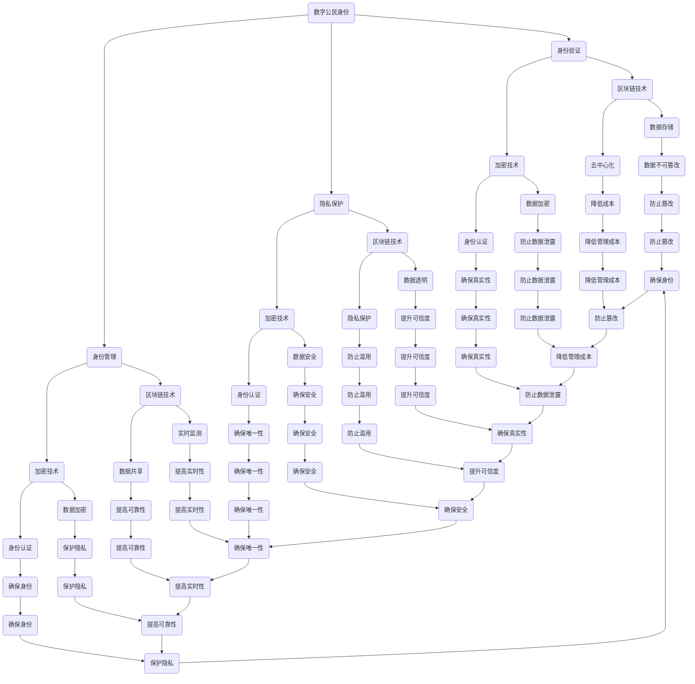

                 

关键词：数字公民身份，身份认证，区块链，加密技术，隐私保护，数字货币，创新应用，未来趋势。

> 摘要：本文旨在探讨数字公民身份创业领域的发展机遇与挑战，重点关注身份认证技术的创新应用及其对未来社会的影响。通过分析区块链、加密技术、隐私保护等核心概念，探讨其在数字公民身份建设中的关键作用，为创业者提供有价值的参考。

## 1. 背景介绍

随着信息技术的飞速发展，互联网已经深刻地改变了人们的生产生活方式。在这个数字化时代，身份认证成为保障网络信息安全的重要手段。传统的身份认证方式主要依赖于中心化的权威机构，如政府、银行和企业等。然而，这种中心化的身份认证系统面临着诸多挑战，如隐私泄露、数据滥用、欺诈等问题。因此，探索去中心化的身份认证技术成为当前研究的热点。

数字公民身份（Digital Citizenship Identity）是指个人在数字世界中的身份及其相关属性，包括身份验证、隐私保护、身份管理等功能。数字公民身份创业领域涉及到多个技术领域，如区块链、加密技术、人工智能等。这些技术的融合与发展为构建一个安全、透明、高效的数字身份认证体系提供了可能性。

本文将围绕数字公民身份创业领域展开讨论，重点关注以下核心问题：

- 数字公民身份的核心概念及其重要性。
- 区块链技术在数字身份认证中的应用。
- 加密技术如何保障数字身份的隐私和安全。
- 隐私保护与数字公民身份的关系。
- 数字货币与数字身份认证的结合。
- 数字公民身份创业的挑战与机遇。

通过以上问题的探讨，本文旨在为数字公民身份创业领域的研究和实践提供一些有价值的思考和建议。

## 2. 核心概念与联系

### 2.1 数字公民身份

数字公民身份是指个人在数字世界中的身份及其相关属性，包括身份验证、隐私保护、身份管理等功能。它不仅仅是一个简单的账号或密码，而是一个综合性的身份信息库，涵盖了个人基本信息、行为记录、信用评分等。

数字公民身份的重要性体现在以下几个方面：

1. **保障网络信息安全**：数字公民身份能够确保网络用户身份的真实性和唯一性，降低欺诈和网络犯罪的风险。
2. **简化身份验证流程**：通过数字公民身份，用户可以方便地完成身份验证，无需重复填写个人信息，提高用户体验。
3. **促进个人信息保护**：数字公民身份可以实现个人信息的分布式存储和管理，有效防止隐私泄露和数据滥用。
4. **推动数字经济发展**：数字公民身份为电子商务、数字金融等领域提供了安全、高效的认证方式，有助于推动数字经济的发展。

### 2.2 区块链技术

区块链技术是一种去中心化的分布式数据库技术，通过加密算法确保数据的安全性和不可篡改性。在数字身份认证中，区块链技术具有以下关键作用：

1. **去中心化**：区块链技术消除了中心化的权威机构，实现了去中心化的身份认证，降低了管理成本，提高了系统的可靠性。
2. **不可篡改性**：区块链技术通过加密算法确保数据的不可篡改性，防止数据被篡改或篡改后无法追踪。
3. **透明性**：区块链技术的数据存储是公开透明的，用户可以查询和验证身份信息，提高了系统的可信度。
4. **隐私保护**：区块链技术可以实现身份信息的匿名化处理，保护用户的隐私。

### 2.3 加密技术

加密技术是一种通过密码学方法保护信息安全和隐私的技术。在数字身份认证中，加密技术具有以下关键作用：

1. **身份认证**：加密技术可以实现身份认证，确保用户身份的真实性和唯一性。
2. **数据加密**：加密技术可以对敏感数据进行加密处理，防止数据在传输和存储过程中被窃取或篡改。
3. **隐私保护**：加密技术可以保护用户的隐私，防止个人信息被滥用或泄露。

### 2.4 数字货币

数字货币是一种基于区块链技术的加密货币，如比特币、以太坊等。在数字公民身份认证中，数字货币具有以下潜在应用：

1. **身份验证**：数字货币可以作为身份验证的一种手段，用户可以使用数字货币完成身份认证，提高认证的便捷性和安全性。
2. **交易结算**：数字货币可以用于数字公民身份认证过程中的交易结算，降低交易成本，提高交易效率。
3. **激励机制**：数字货币可以作为激励机制，鼓励用户参与数字公民身份认证的构建和运营，促进数字身份认证系统的健康发展。

### 2.5 其他相关技术

除了区块链、加密技术和数字货币，还有其他一些技术也在数字公民身份认证领域发挥着重要作用，如人工智能、大数据、物联网等。这些技术可以协同作用，共同推动数字公民身份认证的发展：

1. **人工智能**：人工智能技术可以用于用户行为分析、信用评分等，提高数字公民身份认证的准确性和智能化程度。
2. **大数据**：大数据技术可以用于分析用户行为数据、挖掘潜在风险等，为数字公民身份认证提供有力支持。
3. **物联网**：物联网技术可以用于实时监测和追踪用户身份信息，提高数字公民身份认证的实时性和可靠性。

### 2.6 Mermaid 流程图

以下是一个简化的数字公民身份认证的 Mermaid 流程图，展示了核心概念及其之间的联系：



## 3. 核心算法原理 & 具体操作步骤

### 3.1 算法原理概述

在数字公民身份认证中，核心算法主要涉及以下几个方面：

1. **加密算法**：加密算法用于保护用户身份信息和隐私。常见的加密算法包括对称加密和非对称加密。
2. **哈希算法**：哈希算法用于生成身份信息摘要，确保身份信息的唯一性和不可篡改性。
3. **数字签名**：数字签名用于验证身份信息的真实性和完整性。
4. **智能合约**：智能合约是一种自动执行的合约，用于管理身份信息的使用和权限。

### 3.2 算法步骤详解

1. **用户注册**：用户在数字身份认证平台上注册账号，提交身份信息（如姓名、身份证号、照片等）。
2. **身份信息加密**：平台使用加密算法对用户提交的身份信息进行加密，确保隐私保护。
3. **身份信息哈希**：平台使用哈希算法生成身份信息的哈希值，确保身份信息的唯一性和不可篡改性。
4. **数字签名**：平台对加密后的身份信息和哈希值进行数字签名，确保身份信息的真实性和完整性。
5. **身份信息存储**：平台将加密后的身份信息、哈希值和数字签名存储在区块链上，实现去中心化的身份信息管理。
6. **身份验证**：当用户需要验证身份时，平台从区块链上获取用户身份信息，使用数字签名和哈希算法进行验证。
7. **权限管理**：平台通过智能合约实现身份信息的权限管理，确保用户身份信息的安全和合法使用。

### 3.3 算法优缺点

**优点**：

1. **安全性高**：加密算法、哈希算法和数字签名等技术确保身份信息的真实性和完整性，降低隐私泄露和数据篡改的风险。
2. **去中心化**：区块链技术实现了去中心化的身份信息管理，降低了管理成本，提高了系统的可靠性。
3. **透明性**：区块链技术的数据存储是公开透明的，用户可以查询和验证身份信息，提高了系统的可信度。
4. **灵活性强**：智能合约技术可以实现灵活的身份信息权限管理，满足不同场景下的身份认证需求。

**缺点**：

1. **计算成本高**：加密算法和区块链技术需要大量的计算资源，可能增加系统的计算成本。
2. **交易延迟**：区块链技术的交易确认时间较长，可能影响用户的身份验证体验。
3. **隐私保护难度大**：尽管区块链技术实现了去中心化的身份信息管理，但仍然存在隐私保护难度大的问题，需要进一步优化算法和技术。

### 3.4 算法应用领域

数字公民身份认证算法可以应用于多个领域，如：

1. **电子商务**：通过数字公民身份认证，确保电商交易中的用户身份真实性和交易安全性。
2. **金融行业**：通过数字公民身份认证，提高金融服务的可信度和安全性，降低欺诈风险。
3. **政务管理**：通过数字公民身份认证，简化政务服务流程，提高政务服务效率。
4. **社会管理**：通过数字公民身份认证，加强社会管理，提高社会治理能力。

## 4. 数学模型和公式 & 详细讲解 & 举例说明

### 4.1 数学模型构建

在数字公民身份认证中，数学模型主要涉及以下几个方面：

1. **加密模型**：加密模型用于保护用户身份信息和隐私。常见的加密模型包括对称加密模型和非对称加密模型。
2. **哈希模型**：哈希模型用于生成身份信息摘要，确保身份信息的唯一性和不可篡改性。
3. **数字签名模型**：数字签名模型用于验证身份信息的真实性和完整性。
4. **区块链模型**：区块链模型用于实现去中心化的身份信息管理。

### 4.2 公式推导过程

1. **加密模型**：

   对称加密模型：
   $$ C = E(K, P) $$
   其中，$C$ 为加密后的数据，$K$ 为加密密钥，$P$ 为明文数据。

   非对称加密模型：
   $$ C = E(K_{public}, P) $$
   其中，$C$ 为加密后的数据，$K_{public}$ 为公钥，$P$ 为明文数据。

2. **哈希模型**：

   哈希函数：
   $$ H(P) = \text{Hash}(P) $$
   其中，$H$ 为哈希函数，$P$ 为明文数据，$\text{Hash}$ 为哈希算法。

3. **数字签名模型**：

   签名过程：
   $$ S = \text{Sign}(K_{private}, H(P)) $$
   其中，$S$ 为签名，$K_{private}$ 为私钥，$H(P)$ 为消息摘要。

   验签过程：
   $$ \text{Verify}(K_{public}, P, S) = \text{Compare}(\text{Hash}(P), \text{Sign}(K_{private}, H(P))) $$
   其中，$K_{public}$ 为公钥，$P$ 为明文数据，$S$ 为签名。

4. **区块链模型**：

   区块链数据结构：
   $$ Block = \{Header, Transactions\} $$
   其中，$Header$ 为区块头，包括区块版本号、前一个区块哈希、默克尔树根哈希、时间戳等；$Transactions$ 为交易列表。

### 4.3 案例分析与讲解

#### 案例：使用区块链实现数字公民身份认证

1. **用户注册**：

   用户A在数字身份认证平台上注册，提交身份信息（姓名、身份证号、照片等），平台使用哈希函数生成身份信息摘要。

   $$ H(P_A) = \text{Hash}(\text{姓名}, \text{身份证号}, \text{照片}) $$

2. **身份信息加密**：

   平台使用对称加密算法（如AES）对身份信息进行加密，生成加密后的身份信息。

   $$ C_A = E(K_A, P_A) $$

   其中，$K_A$ 为加密密钥。

3. **数字签名**：

   平台使用私钥对加密后的身份信息和哈希值进行数字签名，生成签名。

   $$ S_A = \text{Sign}(K_{private}_A, H(C_A)) $$

4. **身份信息存储**：

   平台将加密后的身份信息、哈希值和数字签名存储在区块链上。

   $$ Block_A = \{Header_A, \{C_A, H(C_A), S_A\}\} $$

   其中，$Header_A$ 为区块头。

5. **身份验证**：

   当用户A需要验证身份时，平台从区块链上获取用户A的身份信息，使用公钥进行验签。

   $$ \text{Verify}(K_{public}_A, C_A, S_A) = \text{Compare}(\text{Hash}(C_A), \text{Sign}(K_{private}_A, \text{Hash}(C_A))) $$

   如果验签结果为真，则身份验证通过。

#### 案例：使用区块链实现数字货币交易

1. **交易发起**：

   用户B向用户A发起一笔交易，金额为100个数字货币。

   $$ \text{Transaction}_B = \{\text{Sender}_B, \text{Recipient}_A, \text{Amount}_A, \text{Timestamp}_B\} $$

2. **交易验证**：

   平台使用区块链网络对交易进行验证，确保交易合法性和余额充足。

   $$ \text{Validate}(\text{Transaction}_B) = \text{True} \quad \text{if} \quad \text{Balance}_{B} \geq \text{Amount}_A $$

3. **交易存储**：

   平台将验证后的交易存储在区块链上。

   $$ Block_B = \{Header_B, \{\text{Transaction}_B\}\} $$

   其中，$Header_B$ 为区块头。

4. **交易结算**：

   平台根据区块链上的交易记录进行结算，更新用户A和B的余额。

   $$ \text{Balance}_{A} = \text{Balance}_{A} + \text{Amount}_A $$
   $$ \text{Balance}_{B} = \text{Balance}_{B} - \text{Amount}_A $$

## 5. 项目实践：代码实例和详细解释说明

### 5.1 开发环境搭建

为了实践数字公民身份认证项目，我们需要搭建一个开发环境。以下是一个基于Python和Ethereum的开发环境搭建步骤：

1. 安装Python：

   在命令行中执行以下命令安装Python：

   ```shell
   sudo apt update
   sudo apt install python3 python3-pip
   ```

2. 安装Ethereum：

   安装Ethereum客户端，我们选择使用Geth：

   ```shell
   wget https://github.com/ethereum/go-ethereum/releases/download/v1.10.21/go-ethereum_1.10.21-1_amd64.deb
   sudo dpkg -i go-ethereum_1.10.21-1_amd64.deb
   ```

3. 启动Geth：

   在命令行中启动Geth：

   ```shell
   geth --datadir /root/.ethereum --networkid 5777 --nodiscover console
   ```

   这将启动一个本地私有链，网络ID为5777。

4. 安装Truffle：

   安装Truffle框架，用于智能合约开发：

   ```shell
   npm install -g truffle
   ```

5. 创建Truffle项目：

   创建一个新Truffle项目：

   ```shell
   truffle init
   ```

6. 安装合约库：

   在项目目录中创建一个名为"contracts"的目录，用于存放智能合约文件。

### 5.2 源代码详细实现

下面是一个简单的数字公民身份认证智能合约示例：

```solidity
pragma solidity ^0.8.0;

contract DigitalCitizenID {
    mapping(address => bytes32) public identities;

    function registerIdentity(bytes32 id) public {
        identities[msg.sender] = id;
    }

    function getIdentity(address user) public view returns (bytes32) {
        return identities[user];
    }

    function verifyIdentity(bytes32 id) public view returns (bool) {
        return identities[msg.sender] == id;
    }
}
```

这个智能合约包含三个函数：

1. **registerIdentity**：用户可以通过这个函数注册其数字身份。
2. **getIdentity**：查询某个用户的数字身份。
3. **verifyIdentity**：验证用户是否拥有指定的数字身份。

### 5.3 代码解读与分析

1. **pragma**：pragma语句用于指定智能合约的编译器版本。
2. **mapping**：mapping是一种特殊的数据结构，用于存储键值对。在这个例子中，我们使用mapping存储用户的数字身份。
3. **public**：public关键字用于声明函数是公开可调用的。
4. **registerIdentity**：这个函数接受一个bytes32类型的参数id，用于存储用户的数字身份。函数的执行者（msg.sender）必须是合约的创建者，以确保只有合约创建者可以注册数字身份。
5. **getIdentity**：这个函数接受一个address类型的参数user，返回用户的数字身份。函数是公开可调用的，因此任何用户都可以查询其他用户的数字身份。
6. **verifyIdentity**：这个函数接受一个bytes32类型的参数id，用于验证执行者（msg.sender）是否拥有指定的数字身份。函数的返回值是一个布尔值，表示验证结果。

### 5.4 运行结果展示

1. **部署合约**：

   使用Truffle部署合约到本地私有链：

   ```shell
   truffle migrate --network development
   ```

   这将编译智能合约并部署到本地私有链。

2. **交互测试**：

   使用Web3.js库与合约进行交互：

   ```javascript
   const web3 = new Web3("http://127.0.0.1:8545");

   const contractAddress = "0x..."; // 合约地址
   const contractABI = [...] // 合约ABI
   const contract = new web3.eth.Contract(contractABI, contractAddress);

   // 用户注册身份
   contract.methods.registerIdentity("0x...").send({ from: "0x..." });

   // 查询身份
   contract.methods.getIdentity("0x...").call().then(result => {
       console.log("Identity:", result);
   });

   // 验证身份
   contract.methods.verifyIdentity("0x...").call({ from: "0x..." }).then(result => {
       console.log("Verification Result:", result);
   });
   ```

   在上述代码中，我们需要替换"0x..."为实际的合约地址和账户地址。

## 6. 实际应用场景

数字公民身份认证技术在多个领域具有广泛的应用前景，以下是一些典型的应用场景：

### 6.1 电子商务

电子商务平台通过数字公民身份认证技术，确保用户身份的真实性和交易的安全性。例如，在购物过程中，用户需要通过数字身份认证验证其身份，确保交易双方的身份真实可靠。

### 6.2 金融行业

金融行业可以利用数字公民身份认证技术，提高金融服务的可信度和安全性。例如，在银行开户、贷款申请等过程中，通过数字身份认证技术，快速验证用户身份，简化开户流程，降低欺诈风险。

### 6.3 政务管理

政务管理领域可以通过数字公民身份认证技术，简化政务服务流程，提高政务服务效率。例如，在办理社保、公积金等业务时，通过数字身份认证技术，快速验证用户身份，实现无纸化办公。

### 6.4 社会管理

社会管理领域可以利用数字公民身份认证技术，加强社会管理，提高社会治理能力。例如，在选举、投票等过程中，通过数字身份认证技术，确保投票者的身份真实可靠，防止选举舞弊。

### 6.5 医疗健康

医疗健康领域可以通过数字公民身份认证技术，确保患者身份的真实性和医疗记录的安全性。例如，在医院就诊、购买药品等过程中，通过数字身份认证技术，确保患者身份和医疗记录的真实可靠。

### 6.6 教育领域

教育领域可以通过数字公民身份认证技术，保障教育资源的公平分配和教育过程的透明性。例如，在教育考试、证书颁发等过程中，通过数字身份认证技术，确保考试者和证书持有者的身份真实可靠。

### 6.7 企业内部管理

企业内部管理领域可以通过数字公民身份认证技术，提高企业信息安全和办公效率。例如，在企业内部办公系统、邮件系统等过程中，通过数字身份认证技术，确保用户身份的真实性和权限的合理分配。

## 7. 工具和资源推荐

### 7.1 学习资源推荐

1. **《区块链技术指南》**：这是一本全面介绍区块链技术的经典教材，涵盖了区块链的基础知识、核心技术、应用场景等。
2. **《加密学概论》**：这本书介绍了密码学的基本概念、加密算法和数字签名等，有助于了解加密技术在数字公民身份认证中的作用。
3. **《人工智能：一种现代方法》**：这本书详细介绍了人工智能的基本原理、算法和应用，有助于了解人工智能在数字公民身份认证中的应用。

### 7.2 开发工具推荐

1. **Ethereum Studio**：这是一个在线智能合约开发环境，支持Solidity语言编写和部署智能合约。
2. **Truffle**：这是一个用于智能合约开发、测试和部署的框架，支持多种编程语言和区块链平台。
3. **Web3.js**：这是一个JavaScript库，用于与以太坊区块链进行交互，实现智能合约的调用和事件监听。

### 7.3 相关论文推荐

1. **《区块链：一种分布式数据库技术》**：这篇论文详细介绍了区块链的技术原理、应用场景和发展趋势。
2. **《加密货币与区块链：技术和应用》**：这篇论文探讨了加密货币和区块链技术在数字公民身份认证中的应用前景。
3. **《数字公民身份与隐私保护》**：这篇论文讨论了数字公民身份认证技术中的隐私保护问题，提出了一些解决方案。

## 8. 总结：未来发展趋势与挑战

### 8.1 研究成果总结

数字公民身份认证技术取得了显著的成果，主要包括以下几个方面：

1. **技术成熟**：区块链、加密技术、人工智能等核心技术在数字公民身份认证中的应用日益成熟，为构建一个安全、透明、高效的数字身份认证体系提供了技术保障。
2. **应用广泛**：数字公民身份认证技术已经在电子商务、金融行业、政务管理、社会管理等多个领域得到广泛应用，提高了业务流程的效率和安全。
3. **隐私保护**：通过区块链和加密技术的应用，数字公民身份认证技术在隐私保护方面取得了显著成效，有效防止了隐私泄露和数据滥用。

### 8.2 未来发展趋势

未来，数字公民身份认证技术将继续向以下几个方向发展：

1. **去中心化**：随着区块链技术的发展，数字公民身份认证将进一步去中心化，降低管理成本，提高系统可靠性。
2. **隐私保护**：隐私保护技术将不断发展，为数字公民身份认证提供更加安全的隐私保护手段。
3. **人工智能**：人工智能技术将进一步提升数字公民身份认证的智能化水平，实现更加精准的身份识别和风险控制。
4. **跨平台融合**：数字公民身份认证技术将与其他技术（如物联网、大数据等）实现跨平台融合，为构建一个全面的数字身份认证体系提供支持。

### 8.3 面临的挑战

数字公民身份认证技术在发展过程中也面临一些挑战：

1. **隐私保护**：如何在保障用户隐私的前提下，实现高效的身份认证，仍是一个亟待解决的问题。
2. **技术成熟度**：尽管区块链、加密技术等在数字公民身份认证中得到了广泛应用，但其在某些方面的成熟度仍有待提高。
3. **法律法规**：数字公民身份认证技术的应用需要完善的法律法规支持，以规范其发展，保障用户权益。

### 8.4 研究展望

未来，数字公民身份认证技术的研究可以从以下几个方面展开：

1. **隐私保护机制**：进一步研究隐私保护机制，提高数字公民身份认证系统的隐私保护水平。
2. **跨平台融合**：探索数字公民身份认证技术在跨平台融合中的应用，构建一个全面的数字身份认证体系。
3. **人工智能**：结合人工智能技术，实现更加精准的身份识别和风险控制，提高数字公民身份认证的智能化水平。
4. **法律法规**：推动相关法律法规的制定和修订，为数字公民身份认证技术提供法律保障。

## 9. 附录：常见问题与解答

### 9.1 什么是数字公民身份？

数字公民身份是指个人在数字世界中的身份及其相关属性，包括身份验证、隐私保护、身份管理等功能。

### 9.2 区块链技术在数字公民身份认证中有何作用？

区块链技术可以实现去中心化的身份认证，提高系统的可靠性、透明性和隐私保护水平。

### 9.3 数字公民身份认证技术如何保障用户隐私？

数字公民身份认证技术通过区块链和加密技术的应用，实现了用户身份信息的分布式存储和管理，有效防止了隐私泄露和数据滥用。

### 9.4 数字公民身份认证技术有哪些应用领域？

数字公民身份认证技术可以应用于电子商务、金融行业、政务管理、社会管理、医疗健康、教育领域等多个领域。

### 9.5 数字公民身份认证技术的未来发展趋势是什么？

未来，数字公民身份认证技术将向去中心化、隐私保护、人工智能和跨平台融合等方面发展。

### 9.6 数字公民身份认证技术面临的挑战是什么？

数字公民身份认证技术面临的挑战主要包括隐私保护、技术成熟度和法律法规等方面。

### 9.7 数字公民身份认证技术有哪些研究展望？

未来，数字公民身份认证技术的研究可以从隐私保护机制、跨平台融合、人工智能和法律法规等方面展开。  
----------------------------------------------------------------

作者：禅与计算机程序设计艺术 / Zen and the Art of Computer Programming

