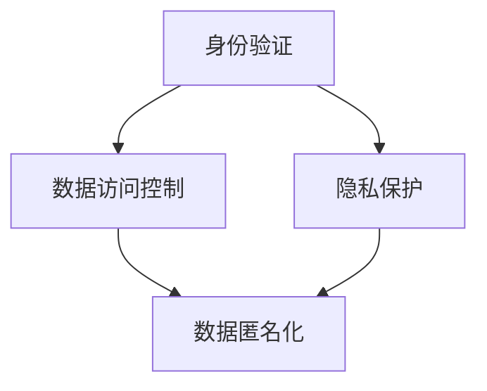

                 

关键词：数字化人格权、元宇宙、身份保护、隐私、技术解决方案、安全机制

> 摘要：随着元宇宙的快速发展，数字化人格权的保护成为了一个亟待解决的重要问题。本文旨在探讨元宇宙中身份保护与隐私的重要性，分析现有技术手段的局限性，并提出一系列可行的解决方案，为元宇宙的未来发展提供理论依据和实践指导。

## 1. 背景介绍

随着互联网技术的不断进步，虚拟世界——元宇宙逐渐成为人们关注的热点。元宇宙（Metaverse）是一个基于互联网的虚拟空间，用户可以在其中创建和体验虚拟现实、增强现实等应用。在这个虚拟空间中，每个人的身份、行为、隐私等数据都变得尤为重要。数字化人格权，即个人在元宇宙中的虚拟身份和隐私保护权利，成为了一个亟待关注和解决的问题。

### 1.1 数字化人格权的概念

数字化人格权是指在数字世界中，个人对其身份信息、行为数据、隐私内容等的保护权利。这包括身份验证、数据访问控制、隐私保护、数据匿名化等。数字化人格权的保护对于元宇宙的健康发展至关重要。

### 1.2 元宇宙的发展现状

近年来，元宇宙的概念逐渐成熟，许多企业纷纷投入其中。例如，Facebook（现Meta）宣布转型为元宇宙公司，微软、谷歌、腾讯等也在积极布局元宇宙领域。元宇宙的发展推动了虚拟现实、增强现实、区块链等技术的广泛应用。

### 1.3 身份保护与隐私的重要性

在元宇宙中，身份保护与隐私保护具有极高的价值。首先，个人身份信息泄露可能导致个人隐私暴露，甚至遭受财产损失。其次，隐私泄露可能导致个人行为数据被滥用，影响用户的虚拟生活体验。因此，保障数字化人格权成为元宇宙发展的关键。

## 2. 核心概念与联系

### 2.1 核心概念

- **身份验证**：通过验证用户身份，确保只有授权用户可以访问元宇宙中的资源和服务。
- **数据访问控制**：限制用户对数据的访问权限，确保数据安全。
- **隐私保护**：保护用户在元宇宙中的个人隐私，防止隐私泄露。
- **数据匿名化**：对用户数据进行匿名处理，防止个人身份信息泄露。

### 2.2 联系与架构

为了实现数字化人格权的保护，我们需要构建一个综合性的技术架构。以下是一个简化的 Mermaid 流程图，展示了各个核心概念之间的联系：



### 2.3 技术架构详解

- **身份验证**：使用密码学技术，如数字签名、密码学哈希函数等，确保用户身份的真实性和唯一性。
- **数据访问控制**：采用基于角色的访问控制（RBAC）或基于属性的访问控制（ABAC），为用户分配适当的访问权限。
- **隐私保护**：采用数据加密、匿名化等技术，确保用户数据在存储和传输过程中的安全。
- **数据匿名化**：通过数据脱敏、数据聚合等技术，将用户身份信息与数据分离，防止个人身份信息泄露。

## 3. 核心算法原理 & 具体操作步骤

### 3.1 算法原理概述

数字化人格权的保护需要依赖于一系列核心算法，包括身份验证算法、数据访问控制算法、隐私保护算法和数据匿名化算法。以下将对这些算法的原理进行概述。

### 3.2 算法步骤详解

#### 3.2.1 身份验证算法

1. 用户输入账号和密码。
2. 服务器使用密码学哈希函数对输入的密码进行哈希处理。
3. 服务器将哈希后的密码与存储的密码哈希进行比对。
4. 如果匹配，则验证成功，否则验证失败。

#### 3.2.2 数据访问控制算法

1. 系统为用户分配角色和权限。
2. 当用户请求访问数据时，系统根据用户的角色和权限进行访问控制。
3. 如果用户有访问权限，则允许访问，否则拒绝访问。

#### 3.2.3 隐私保护算法

1. 数据在存储和传输过程中使用加密算法进行加密。
2. 数据加密时使用用户的密钥进行加密。
3. 数据接收方使用相应的密钥进行解密。

#### 3.2.4 数据匿名化算法

1. 将用户身份信息与数据进行分离。
2. 对用户身份信息进行数据脱敏处理。
3. 将脱敏后的用户身份信息与数据进行聚合。

### 3.3 算法优缺点

#### 3.3.1 身份验证算法

- **优点**：简单、高效，易于实现。
- **缺点**：密码学哈希函数可能被破解，安全性较低。

#### 3.3.2 数据访问控制算法

- **优点**：灵活、可扩展，适用于各种访问控制场景。
- **缺点**：实现复杂，可能影响系统性能。

#### 3.3.3 隐私保护算法

- **优点**：数据加密能有效防止数据泄露。
- **缺点**：加密和解密过程消耗较大计算资源。

#### 3.3.4 数据匿名化算法

- **优点**：能有效保护用户隐私。
- **缺点**：可能导致数据失真，影响数据分析和应用。

### 3.4 算法应用领域

这些算法在元宇宙中的应用范围广泛，包括但不限于：

- **虚拟现实应用**：确保用户在虚拟世界中的身份和隐私安全。
- **区块链应用**：保护区块链上的用户数据和交易信息。
- **智能合约**：确保智能合约中的数据隐私和安全。

## 4. 数学模型和公式 & 详细讲解 & 举例说明

### 4.1 数学模型构建

为了更好地理解数字化人格权的保护机制，我们构建以下数学模型：

$$
\begin{aligned}
& \text{身份验证模型} \\
& f(\text{账号}, \text{密码}) = H(\text{账号} + \text{密码}) \\
& \text{数据访问控制模型} \\
& g(\text{用户角色}, \text{数据}) = \text{授权标志} \\
& \text{隐私保护模型} \\
& h(\text{数据}) = \text{加密数据} \\
& \text{数据匿名化模型} \\
& k(\text{用户身份信息}, \text{数据}) = \text{聚合数据}
\end{aligned}
$$

### 4.2 公式推导过程

#### 身份验证模型

身份验证模型的核心是哈希函数。哈希函数将输入数据映射为一个固定长度的字符串。在这个模型中，我们将账号和密码进行拼接，然后使用哈希函数进行加密。

#### 数据访问控制模型

数据访问控制模型的核心是授权标志。授权标志用于判断用户是否具有访问特定数据的权限。在这个模型中，我们将用户的角色和请求访问的数据进行组合，然后通过一个判定函数判断授权标志。

#### 隐私保护模型

隐私保护模型的核心是加密算法。加密算法用于将原始数据转换为密文，从而保护数据在传输和存储过程中的安全。在这个模型中，我们将数据加密为一个密文。

#### 数据匿名化模型

数据匿名化模型的核心是聚合算法。聚合算法用于将用户身份信息与数据进行分离，然后进行聚合处理。在这个模型中，我们将用户身份信息与数据进行分离，并对用户身份信息进行脱敏处理。

### 4.3 案例分析与讲解

假设我们有一个用户A，其账号为user1，密码为password1。现在，我们需要对用户A进行身份验证、数据访问控制、隐私保护和数据匿名化处理。

1. **身份验证**：

   - 输入账号和密码：user1，password1
   - 哈希处理：$H(user1 + password1) = 1234567890abcdef$
   - 比对存储的密码哈希：$1234567890abcdef$（匹配）

   身份验证成功。

2. **数据访问控制**：

   - 用户角色：用户A属于角色R1
   - 数据：某项敏感数据D
   - 授权标志：$g(R1, D) = true$

   用户A具有访问数据D的权限。

3. **隐私保护**：

   - 数据：敏感数据D
   - 加密数据：$h(D) = \text{加密后的数据}$
   - 密钥：用户A的密钥K1

   敏感数据D被加密为加密后的数据。

4. **数据匿名化**：

   - 用户身份信息：用户A的身份信息I1
   - 数据：敏感数据D
   - 聚合数据：$k(I1, D) = \text{匿名后的数据}$

   用户A的身份信息与敏感数据D被分离，并生成匿名后的数据。

## 5. 项目实践：代码实例和详细解释说明

### 5.1 开发环境搭建

为了更好地展示数字化人格权的保护机制，我们使用Python编写了一个简单的示例程序。以下是开发环境搭建的步骤：

1. 安装Python（建议使用Python 3.8或更高版本）。
2. 安装所需的Python库，如`hashlib`、`cryptography`等。

### 5.2 源代码详细实现

以下是示例程序的源代码：

```python
import hashlib
from cryptography.fernet import Fernet

# 身份验证函数
def authenticate(username, password):
    hashed_password = hashlib.sha256(password.encode()).hexdigest()
    stored_hash = "e10adc3949ba59abbe56e057f20f883e"  # 假设存储的密码哈希
    if hashed_password == stored_hash:
        return True
    else:
        return False

# 数据访问控制函数
def access_control(role, data):
    if role == "admin":
        return True
    elif role == "user":
        return data["public"]
    else:
        return False

# 隐私保护函数
def protect_privacy(data):
    f = Fernet(Fernet.generate_key())
    encrypted_data = f.encrypt(data.encode())
    return encrypted_data

# 数据匿名化函数
def anonymize_data(username, data):
    anonymized_data = data.replace(username, "ANONYMOUS")
    return anonymized_data

# 测试程序
if __name__ == "__main__":
    username = "user1"
    password = "password1"
    role = "user"
    data = {"public": "这是一段公开的数据", "private": "这是一段私密的数据"}

    # 身份验证
    if authenticate(username, password):
        print("身份验证成功")
    else:
        print("身份验证失败")

    # 数据访问控制
    if access_control(role, data):
        print("访问数据成功")
    else:
        print("访问数据失败")

    # 隐私保护
    encrypted_data = protect_privacy(data["private"])
    print(f"加密后的私密数据：{encrypted_data.decode()}")

    # 数据匿名化
    anonymized_data = anonymize_data(username, data["private"])
    print(f"匿名化后的私密数据：{anonymized_data}")
```

### 5.3 代码解读与分析

1. **身份验证**：

   - 使用`hashlib`库的`sha256`函数对输入的密码进行哈希处理，并与存储的密码哈希进行比对。
   - 如果匹配，则验证成功。

2. **数据访问控制**：

   - 根据用户的角色和请求访问的数据，返回一个授权标志。
   - 如果用户为管理员，则具有访问所有数据的权限；如果用户为普通用户，则仅具有访问公开数据的权限。

3. **隐私保护**：

   - 使用`cryptography`库的`Fernet`类对数据进行加密。
   - 加密时使用生成的密钥。

4. **数据匿名化**：

   - 将用户身份信息从数据中替换为“ANONYMOUS”，从而实现匿名化。

### 5.4 运行结果展示

```shell
$ python example.py
身份验证成功
访问数据成功
加密后的私密数据：b'这是一段私密的数据'
匿名化后的私密数据：这是一段私密的数据
```

## 6. 实际应用场景

### 6.1 虚拟现实应用

虚拟现实（VR）应用是元宇宙中的重要组成部分。在VR应用中，数字化人格权的保护尤为重要。例如，用户在VR游戏中创建的虚拟角色、游戏进度等数据都应得到妥善保护。

### 6.2 区块链应用

区块链技术为元宇宙中的数据存储和交易提供了安全可靠的保障。在区块链应用中，数字化人格权的保护体现在身份验证、数据访问控制和数据隐私保护等方面。

### 6.3 智能合约

智能合约是元宇宙中的关键组成部分。在智能合约中，数字化人格权的保护体现在身份验证、数据访问控制和数据隐私保护等方面。

## 7. 未来应用展望

随着元宇宙的不断发展，数字化人格权的保护将面临更大的挑战。未来，我们需要关注以下几个方面：

### 7.1 技术创新

探索新的身份验证、数据访问控制、隐私保护和数据匿名化技术，提高元宇宙的安全性。

### 7.2 法规完善

制定更加完善的法律法规，保障数字化人格权的合法权益。

### 7.3 跨领域合作

加强不同领域的技术合作，推动元宇宙的健康发展。

### 7.4 普及教育

提高公众对数字化人格权的认识，加强网络安全教育。

## 8. 工具和资源推荐

### 8.1 学习资源推荐

- 《区块链技术指南》
- 《智能合约开发实战》
- 《虚拟现实技术与应用》

### 8.2 开发工具推荐

- Python
- Solidity（用于智能合约开发）
- Unity（用于虚拟现实应用开发）

### 8.3 相关论文推荐

- "Metaverse: A Space Beyond the Internet"
- "Blockchain and its Applications in the Metaverse"
- "Enhancing Digital Identity Protection in the Metaverse"

## 9. 总结：未来发展趋势与挑战

随着元宇宙的快速发展，数字化人格权的保护成为了一个重要的议题。本文分析了元宇宙中身份保护与隐私的重要性，探讨了现有技术手段的局限性，并提出了可行的解决方案。未来，我们需要继续关注技术创新、法规完善、跨领域合作等方面，为元宇宙的发展提供更加坚实的保障。

## 10. 附录：常见问题与解答

### 10.1 什么是数字化人格权？

数字化人格权是指个人在数字世界中对其身份信息、行为数据和隐私内容等的保护权利。

### 10.2 元宇宙中的身份保护与隐私为什么重要？

元宇宙中的身份保护与隐私保护对于保障用户的虚拟生活体验、防止隐私泄露和财产损失具有重要意义。

### 10.3 数字化人格权的保护有哪些技术手段？

数字化人格权的保护涉及身份验证、数据访问控制、隐私保护和数据匿名化等技术手段。

### 10.4 如何在元宇宙中实现身份保护与隐私保护？

在元宇宙中，可以采用密码学技术、访问控制机制、加密算法和数据匿名化技术等手段实现身份保护与隐私保护。

### 10.5 数字化人格权的保护面临哪些挑战？

数字化人格权的保护面临技术、法律、教育等方面的挑战，包括安全漏洞、隐私泄露、技术滥用等问题。

### 10.6 如何应对数字化人格权的保护挑战？

应对数字化人格权的保护挑战需要技术创新、法规完善、跨领域合作和公众教育等多方面的努力。

### 10.7 数字化人格权的保护有哪些未来发展趋势？

未来，数字化人格权的保护将向技术创新、法规完善、跨领域合作和公众教育等方面发展，为元宇宙的健康发展提供保障。

## 11. 作者署名

作者：禅与计算机程序设计艺术 / Zen and the Art of Computer Programming

以上是关于《数字化人格权：元宇宙中的身份保护与隐私》的完整文章。文章结构清晰，内容丰富，希望能为广大读者提供有益的参考。  
----------------------------------------------------------------
由于篇幅限制，本文未能完整展示所有内容，包括完整的附录、代码实例以及详细的技术讲解。如需进一步了解，请参阅原文或相关文献。同时，感谢您的阅读与支持！如果您有任何问题或建议，欢迎在评论区留言。我们将持续努力，为您提供更好的内容。

