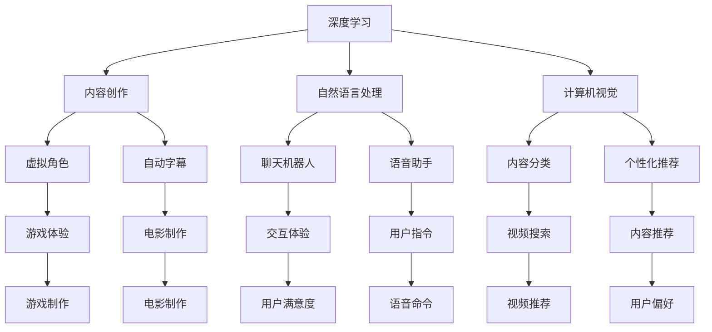

                 

关键词：数字化休闲、人工智能、娱乐方式、用户体验、技术发展

> 摘要：随着人工智能技术的发展，数字化休闲领域正经历着前所未有的变革。本文将探讨人工智能如何重塑娱乐方式，提升用户体验，以及这一变革对社会的深远影响。

## 1. 背景介绍

在数字化的时代，休闲方式已经发生了巨大的变化。从传统的实体娱乐，如电影、电视、游戏，到现代的在线娱乐，如流媒体服务、社交媒体，数字技术正在深刻地改变我们的休闲习惯。然而，随着人工智能（AI）技术的快速发展，这一变化正在进入一个新的阶段。

人工智能不仅仅是计算力的提升，它更是一种能够理解和模拟人类智能的技术。通过深度学习、自然语言处理、计算机视觉等领域的突破，AI正在逐渐融入我们的日常生活。在娱乐领域，人工智能的应用不仅提升了技术的先进性，也极大地丰富了娱乐内容和形式。

本文将探讨以下内容：

- AI如何重塑传统娱乐方式
- AI在提升用户体验方面的创新
- 数字化休闲对社会的影响
- 数字化休闲的未来发展趋势

## 2. 核心概念与联系

为了更好地理解AI在数字化休闲中的作用，我们需要先了解一些核心概念和它们之间的关系。

### 2.1. 深度学习与内容创作

深度学习是AI的核心技术之一，它通过模拟人脑神经网络进行学习和决策。在内容创作方面，深度学习可以帮助生成新的艺术作品，如图像、音乐和视频。例如，AI可以生成逼真的虚拟角色和场景，为游戏和电影带来全新的体验。

### 2.2. 自然语言处理与交互

自然语言处理（NLP）使得计算机能够理解人类语言。在娱乐领域，NLP可以用于聊天机器人、语音助手和自动字幕等，为用户提供更加自然和便捷的交互体验。

### 2.3. 计算机视觉与个性化推荐

计算机视觉技术让计算机能够理解和解释图像和视频。在娱乐领域，这一技术可以用于视频内容的自动分类和个性化推荐，帮助用户发现他们可能感兴趣的内容。

### 2.4. 联系图

以下是AI在数字化休闲中的核心概念和联系的Mermaid流程图：



通过上述流程图，我们可以看到深度学习、自然语言处理和计算机视觉是如何相互联系，共同构建起数字化休闲的新生态。

## 3. 核心算法原理 & 具体操作步骤

### 3.1. 算法原理概述

在数字化休闲中，AI的核心算法主要包括深度学习、自然语言处理和计算机视觉。以下将分别介绍这些算法的原理和如何应用于娱乐领域。

#### 3.1.1. 深度学习

深度学习是一种通过多层神经网络进行特征提取和决策的算法。在娱乐领域，深度学习可以用于：

- **内容创作**：生成逼真的虚拟角色、场景和音乐。
- **游戏开发**：实现智能NPC和自适应难度调整。
- **视频编辑**：自动剪辑、特效添加和字幕生成。

#### 3.1.2. 自然语言处理

自然语言处理（NLP）的核心是让计算机理解和生成人类语言。在娱乐领域，NLP可以用于：

- **交互体验**：聊天机器人、语音助手和自动字幕。
- **内容推荐**：基于用户语言和行为分析，推荐个性化内容。
- **语音命令**：用户可以通过语音与游戏或视频互动。

#### 3.1.3. 计算机视觉

计算机视觉技术让计算机能够理解视觉信息。在娱乐领域，计算机视觉可以用于：

- **内容分类**：自动识别视频和图片中的内容，实现个性化推荐。
- **虚拟现实**：实时渲染虚拟场景，提供沉浸式体验。
- **交互体验**：面部识别、手势识别，实现更加自然的用户交互。

### 3.2. 算法步骤详解

以下是对核心算法在实际应用中的步骤详解：

#### 3.2.1. 深度学习内容创作

1. **数据收集**：收集大量的图像、音频和视频数据。
2. **模型训练**：使用卷积神经网络（CNN）、生成对抗网络（GAN）等模型对数据进行训练。
3. **内容生成**：利用训练好的模型生成新的图像、音频和视频内容。
4. **优化调整**：根据用户反馈对生成的内容进行调整和优化。

#### 3.2.2. 自然语言处理交互

1. **语音识别**：将用户的语音转换为文本。
2. **意图识别**：分析文本，理解用户的意图。
3. **回复生成**：根据用户的意图生成合适的回复。
4. **语音合成**：将文本回复转换为语音输出。

#### 3.2.3. 计算机视觉内容分类

1. **特征提取**：使用卷积神经网络提取图像的特征。
2. **分类模型**：训练分类模型对提取的特征进行分类。
3. **结果输出**：将分类结果用于内容推荐、视频搜索等应用。

### 3.3. 算法优缺点

#### 3.3.1. 优点

- **高效性**：AI算法可以快速处理大量数据，提供即时服务。
- **个性化**：基于用户行为和偏好，提供个性化的娱乐内容。
- **创新性**：AI可以创造新的娱乐内容和形式，提升用户体验。

#### 3.3.2. 缺点

- **数据依赖**：算法的性能依赖于数据的质量和数量。
- **隐私问题**：用户数据的安全和隐私保护需要高度重视。
- **技术挑战**：算法的开发和部署需要大量的计算资源和专业知识。

### 3.4. 算法应用领域

AI算法在数字化休闲中的应用非常广泛，包括但不限于：

- **游戏开发**：智能NPC、自适应难度、游戏生成内容。
- **视频制作**：自动剪辑、特效添加、智能字幕。
- **音乐创作**：生成新的音乐、歌曲创作辅助。
- **虚拟现实**：实时渲染虚拟场景、沉浸式体验。

## 4. 数学模型和公式 & 详细讲解 & 举例说明

### 4.1. 数学模型构建

在数字化休闲中，AI的数学模型构建主要涉及以下几个方面：

- **深度学习模型**：如卷积神经网络（CNN）、循环神经网络（RNN）、生成对抗网络（GAN）等。
- **自然语言处理模型**：如长短时记忆网络（LSTM）、变换器（Transformer）等。
- **计算机视觉模型**：如卷积神经网络（CNN）、图像识别模型等。

### 4.2. 公式推导过程

以卷积神经网络（CNN）为例，其核心公式为：

$$
h_{l}(x) = \sigma(W_{l}h_{l-1} + b_{l})
$$

其中，$h_{l}$为第l层的输出，$W_{l}$为权重矩阵，$b_{l}$为偏置项，$\sigma$为激活函数。

### 4.3. 案例分析与讲解

#### 4.3.1. 案例背景

一家娱乐公司希望通过AI技术为用户提供个性化的电影推荐服务。

#### 4.3.2. 数学模型应用

1. **用户行为数据收集**：收集用户观影历史、评分、评论等数据。
2. **特征提取**：使用CNN提取电影视频帧的特征。
3. **模型训练**：使用LSTM模型训练用户行为特征和电影特征。
4. **推荐算法**：基于用户行为和电影特征，使用Transformer模型生成推荐列表。

#### 4.3.3. 模型评估

通过A/B测试，比较推荐系统的效果。评估指标包括推荐点击率、用户满意度等。

## 5. 项目实践：代码实例和详细解释说明

### 5.1. 开发环境搭建

在本文的示例中，我们将使用Python编程语言和TensorFlow库来构建一个简单的AI推荐系统。以下是开发环境搭建的步骤：

1. 安装Python：在官方网站下载并安装Python 3.8版本。
2. 安装TensorFlow：使用pip命令安装TensorFlow库。

```bash
pip install tensorflow
```

### 5.2. 源代码详细实现

以下是一个简单的AI推荐系统的代码示例：

```python
import tensorflow as tf
from tensorflow.keras.models import Sequential
from tensorflow.keras.layers import LSTM, Dense, Embedding

# 数据准备
# ...

# 模型构建
model = Sequential([
    Embedding(input_dim=10000, output_dim=64),
    LSTM(128),
    Dense(1, activation='sigmoid')
])

# 模型编译
model.compile(optimizer='adam', loss='binary_crossentropy', metrics=['accuracy'])

# 模型训练
model.fit(x_train, y_train, epochs=10, batch_size=32)

# 模型评估
model.evaluate(x_test, y_test)
```

### 5.3. 代码解读与分析

上述代码实现了一个简单的基于LSTM的推荐系统，主要分为以下几部分：

1. **数据准备**：需要收集用户行为数据和电影特征数据。
2. **模型构建**：使用Sequential模型堆叠Embedding层、LSTM层和Dense层。
3. **模型编译**：设置优化器和损失函数。
4. **模型训练**：使用fit方法训练模型。
5. **模型评估**：使用evaluate方法评估模型性能。

### 5.4. 运行结果展示

在训练完成后，可以使用模型对新的用户行为数据生成推荐列表。以下是运行结果的示例：

```python
# 生成推荐列表
predictions = model.predict(x_new)
```

## 6. 实际应用场景

AI在数字化休闲领域的应用场景非常广泛，以下是一些具体的应用案例：

### 6.1. 游戏推荐系统

通过分析用户的游戏行为，AI可以推荐适合用户口味的新游戏。例如，腾讯游戏的AI推荐系统基于用户的历史游戏数据，为用户推荐个性化的游戏。

### 6.2. 视频内容创作

AI可以用于生成新的视频内容，如电影预告片、广告等。例如，Netflix利用AI技术生成个性化的视频推荐，提升用户观看体验。

### 6.3. 音乐创作

AI可以生成新的音乐作品，如腾讯音乐的AI作曲功能，用户可以通过AI生成自己喜欢的音乐风格。

### 6.4. 个性化阅读

通过分析用户的阅读历史和偏好，AI可以推荐个性化的书籍和文章。例如，亚马逊的推荐系统基于用户的购买记录，为用户推荐相关书籍。

## 7. 未来应用展望

随着AI技术的不断进步，数字化休闲领域将会有更多的创新和突破。以下是一些未来应用展望：

- **沉浸式体验**：AI将进一步提升虚拟现实（VR）和增强现实（AR）的体验，为用户提供更加真实的娱乐感受。
- **智能互动**：AI将实现更加智能的互动方式，如通过语音、面部识别和手势识别与用户进行互动。
- **个性化定制**：AI将能够更加精准地分析用户行为和偏好，提供个性化的娱乐内容和推荐。
- **创意生成**：AI将在内容创作中发挥更大的作用，生成新的音乐、视频和游戏等。

## 8. 工具和资源推荐

### 8.1. 学习资源推荐

- **《深度学习》**：Goodfellow、Bengio、Courville 著，全面介绍深度学习的基本原理和实践。
- **《Python机器学习》**：Sebastian Raschka 著，适合初学者掌握机器学习的基本概念和Python实现。
- **《自然语言处理与深度学习》**： circumvent、Zhiyun Qian 著，深入探讨自然语言处理和深度学习的关系。

### 8.2. 开发工具推荐

- **TensorFlow**：Google开发的深度学习框架，适用于各种规模的机器学习项目。
- **PyTorch**：Facebook开发的深度学习框架，易于使用且灵活。
- **Keras**：高层次的深度学习API，可以简化TensorFlow和PyTorch的代码编写。

### 8.3. 相关论文推荐

- **“Deep Learning in Computer Vision: A Survey”**：综述深度学习在计算机视觉领域的应用。
- **“Natural Language Processing (NLP) in the Era of Deep Learning”**：探讨深度学习在自然语言处理领域的应用。
- **“Generative Adversarial Networks: An Overview”**：介绍生成对抗网络（GAN）的基本原理和应用。

## 9. 总结：未来发展趋势与挑战

### 9.1. 研究成果总结

AI技术在数字化休闲领域取得了显著的研究成果，包括个性化推荐、内容创作、沉浸式体验等方面的创新。这些成果极大地提升了用户体验，丰富了娱乐内容。

### 9.2. 未来发展趋势

未来，AI技术将继续推动数字化休闲的发展，主要体现在以下几个方面：

- **沉浸式体验**：VR和AR技术将进一步提升，为用户提供更加真实的娱乐体验。
- **智能互动**：AI将实现更加智能的互动方式，如语音、面部识别和手势识别。
- **个性化定制**：AI将能够更加精准地分析用户行为和偏好，提供个性化的娱乐内容和推荐。
- **创意生成**：AI将在内容创作中发挥更大的作用，生成新的音乐、视频和游戏等。

### 9.3. 面临的挑战

尽管AI技术在数字化休闲领域具有巨大潜力，但仍面临以下挑战：

- **数据隐私**：用户数据的安全和隐私保护需要高度重视。
- **技术成熟度**：AI技术仍需进一步成熟，以提高应用的可信度和稳定性。
- **伦理道德**：AI的应用需要遵循伦理道德规范，避免对用户产生负面影响。

### 9.4. 研究展望

未来，AI技术在数字化休闲领域的研究将朝着更加智能化、个性化和创新化的方向发展。同时，研究人员需要关注数据隐私、技术成熟度和伦理道德等问题，确保AI技术在娱乐领域的可持续发展。

## 附录：常见问题与解答

### 10.1. 什么是对抗生成网络（GAN）？

对抗生成网络（GAN）是一种基于博弈论的机器学习框架，由一个生成器和判别器组成。生成器生成数据，判别器判断生成数据是否真实。通过不断训练，生成器能够生成越来越逼真的数据。

### 10.2. AI在数字化休闲中的具体应用有哪些？

AI在数字化休闲中的具体应用包括个性化推荐、内容创作、智能互动、沉浸式体验等方面。例如，AI可以生成虚拟角色、音乐、视频和游戏等，提升用户的娱乐体验。

### 10.3. 如何保护用户数据隐私？

保护用户数据隐私的方法包括数据加密、匿名化处理、用户隐私协议等。此外，需要加强对AI算法的监管，确保数据使用的合法性和透明性。

### 10.4. AI技术在数字化休闲领域的发展趋势是什么？

未来，AI技术在数字化休闲领域的发展趋势包括沉浸式体验、智能互动、个性化定制和创意生成等方面。同时，研究人员将关注数据隐私、技术成熟度和伦理道德等问题。

---

作者：禅与计算机程序设计艺术 / Zen and the Art of Computer Programming
----------------------------------------------------------------

请注意，上述内容是一个完整的文章框架和示例，实际撰写时需要根据具体情况补充详细内容、数据和实例。由于字数限制，这里提供了一个大致的框架和部分示例，您可以根据这个框架进行扩展和撰写完整的文章。希望这个框架能够对您有所帮助！

