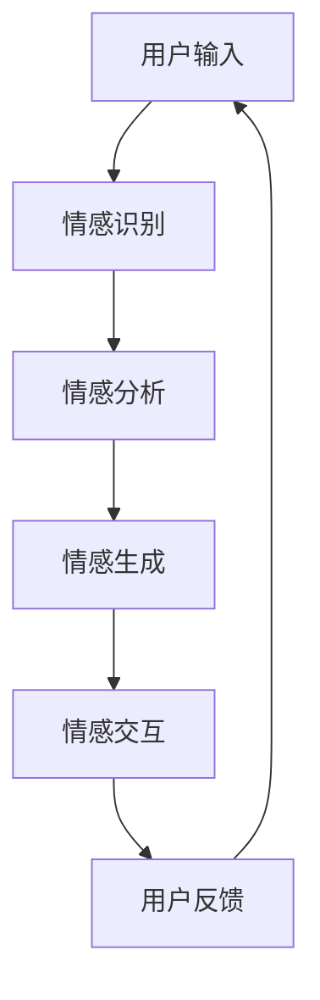

                 

关键词：数字化共情，AI技术，情感连接，人类情感理解，机器学习，情感计算，人工智能应用。

> 摘要：本文探讨了数字化共情的概念及其在AI领域的应用。通过分析AI技术在情感识别、情感生成和情感交互方面的最新进展，我们展示了如何利用人工智能辅助实现情感连接。文章还讨论了未来数字化共情可能面临的挑战以及相应的解决方案。

## 1. 背景介绍

在当今社会，人与人之间的情感连接变得越来越重要。然而，现实生活中的种种限制，如地理位置、语言障碍和社交障碍等，常常使得这种连接变得困难。数字化共情作为一种新兴的技术理念，试图通过人工智能（AI）的力量，突破这些限制，为人类提供一种全新的情感交流方式。

### 1.1 数字化共情的定义

数字化共情是指利用人工智能技术，使计算机能够理解和模拟人类情感，从而在数字化环境中实现情感上的相互理解和共鸣。这一概念涵盖了情感识别、情感生成和情感交互等多个方面。

### 1.2 数字化共情的必要性

随着互联网的普及和数字化技术的发展，人们的日常生活越来越依赖于数字化工具。然而，目前的数字化工具在很大程度上仍然缺乏情感层面的互动。数字化共情旨在填补这一空缺，提升用户体验，增强人与人之间的情感连接。

### 1.3 AI在情感连接中的潜力

人工智能技术在情感识别、情感生成和情感交互方面具有巨大的潜力。通过深度学习、自然语言处理和情感计算等技术，AI能够识别和理解人类情感，并模拟出相应的情感反应，从而实现情感上的互动。

## 2. 核心概念与联系

为了更好地理解数字化共情的实现原理，我们首先需要了解其中的核心概念和它们之间的联系。

### 2.1 情感识别

情感识别是指AI系统通过分析人类的语言、表情、声音和行为等信息，识别出人类情感的过程。这一过程通常涉及多种技术的综合运用，包括图像识别、语音识别和自然语言处理等。

### 2.2 情感生成

情感生成是指AI系统根据输入的情感信息，生成相应的情感反应的过程。这一过程通常基于情感模型和情感规则，通过机器学习算法实现。

### 2.3 情感交互

情感交互是指AI系统与人类在情感层面的互动过程。这一过程要求AI系统能够识别和理解人类情感，并能够模拟出相应的情感反应，以实现情感上的共鸣。

### 2.4 Mermaid 流程图

下面是一个简化的Mermaid流程图，展示了数字化共情的基本流程：



## 3. 核心算法原理 & 具体操作步骤

### 3.1 算法原理概述

数字化共情的核心算法主要包括情感识别、情感生成和情感交互三个部分。情感识别通常采用深度学习算法，如卷积神经网络（CNN）和循环神经网络（RNN）；情感生成则基于生成对抗网络（GAN）和变分自编码器（VAE）等技术；情感交互则依赖于自然语言处理和情感计算技术。

### 3.2 算法步骤详解

#### 3.2.1 情感识别

1. 收集数据：首先，需要收集大量的情感数据，包括文本、图像、语音和行为等。
2. 数据预处理：对收集到的数据进行预处理，包括数据清洗、数据增强和特征提取等。
3. 模型训练：使用预处理后的数据训练深度学习模型，如CNN和RNN。
4. 模型评估：对训练好的模型进行评估，确保其准确性和鲁棒性。

#### 3.2.2 情感生成

1. 设计模型：设计生成对抗网络（GAN）或变分自编码器（VAE）模型。
2. 数据生成：使用训练好的模型生成情感数据。
3. 数据评估：对生成的数据进行评估，确保其质量符合要求。

#### 3.2.3 情感交互

1. 语言处理：使用自然语言处理技术，如词向量、语言模型等，对用户输入进行处理。
2. 情感理解：根据用户输入的情感信息，理解用户的情感状态。
3. 情感模拟：根据情感理解的结果，生成相应的情感反应。
4. 情感反馈：将情感反应反馈给用户，实现情感上的互动。

### 3.3 算法优缺点

#### 优点：

- 高效性：AI技术能够快速识别和理解人类情感，提高情感交互的效率。
- 广泛性：AI技术可以应用于各种情感场景，如聊天机器人、虚拟助手、社交媒体等。
- 个性化：AI技术可以根据用户的情感状态和偏好，提供个性化的情感服务。

#### 缺点：

- 情感理解的局限性：AI技术目前还无法完全理解人类复杂的情感，尤其是在处理情感微妙变化时存在困难。
- 数据隐私和安全：情感数据涉及到个人隐私，如何在保障数据隐私和安全的前提下应用AI技术，是一个重要问题。

### 3.4 算法应用领域

数字化共情技术可以应用于多个领域，包括但不限于：

- 聊天机器人：通过情感识别和生成技术，使聊天机器人能够理解用户情感并做出相应反应。
- 智能客服：利用情感交互技术，提高智能客服系统的用户体验。
- 社交媒体：通过情感分析，帮助用户更好地理解和表达自己的情感状态。
- 医疗健康：利用情感识别和生成技术，辅助心理健康诊断和治疗。

## 4. 数学模型和公式 & 详细讲解 & 举例说明

### 4.1 数学模型构建

数字化共情的数学模型通常包括情感识别模型、情感生成模型和情感交互模型。以下是这些模型的基本公式和推导过程。

#### 4.1.1 情感识别模型

情感识别模型通常基于深度学习，如卷积神经网络（CNN）或循环神经网络（RNN）。以下是一个简化的CNN模型的公式：

$$
\hat{y} = \sigma(W \cdot \text{激活函数}(f(x)))
$$

其中，$\hat{y}$ 是预测的情感标签，$W$ 是权重矩阵，$f(x)$ 是输入特征向量，$\sigma$ 是激活函数，常用的有ReLU和Sigmoid函数。

#### 4.1.2 情感生成模型

情感生成模型通常基于生成对抗网络（GAN）或变分自编码器（VAE）。以下是一个简化的GAN模型的公式：

$$
\begin{aligned}
\mathcal{D} &: p_{\text{data}}(x) = \frac{1}{Z} e^{-\frac{1}{2} \sum_{i=1}^{Dx} (x_i - \mu_i)^2} \\
\mathcal{G} &: z \sim p_z(z), \quad x = \mathcal{G}(z)
\end{aligned}
$$

其中，$\mathcal{D}$ 是判别器，$p_{\text{data}}(x)$ 是真实数据的概率分布，$\mathcal{G}$ 是生成器，$z$ 是噪声向量，$x$ 是生成的情感数据。

#### 4.1.3 情感交互模型

情感交互模型通常基于自然语言处理和情感计算。以下是一个简化的情感交互模型的公式：

$$
\begin{aligned}
s_{\text{user}} &= \text{encode}(\text{user\_input}) \\
s_{\text{bot}} &= \text{encode}(\text{bot\_output}) \\
\text{response} &= \text{generate}(\text{context}, s_{\text{user}}, s_{\text{bot}})
\end{aligned}
$$

其中，$s_{\text{user}}$ 和 $s_{\text{bot}}$ 分别是用户和机器人的情感状态向量，$\text{encode}$ 是情感编码函数，$\text{generate}$ 是情感生成函数，$\text{context}$ 是对话上下文。

### 4.2 公式推导过程

#### 4.2.1 情感识别模型的推导

情感识别模型的推导主要涉及卷积神经网络（CNN）的构建和训练。以下是CNN的基本推导过程：

1. **卷积操作**：
   给定输入特征矩阵 $X \in \mathbb{R}^{m \times n}$ 和卷积核 $W \in \mathbb{R}^{k \times l}$，卷积操作的结果可以表示为：
   $$
   \text{Conv}(X, W) = \sum_{i=0}^{m-k} \sum_{j=0}^{n-l} W \odot (X_{i:i+k, j:j+l})
   $$
   其中，$\odot$ 表示元素-wise 相乘，$X_{i:i+k, j:j+l}$ 是输入特征矩阵的一个子矩阵。

2. **激活函数**：
   激活函数用于引入非线性，常用的有 ReLU 函数：
   $$
   \text{ReLU}(x) = \max(0, x)
   $$

3. **池化操作**：
   为了降低维度并提取更有代表性的特征，常用最大池化操作：
   $$
   \text{MaxPool}(X, f) = \max(X \circ f)
   $$
   其中，$f$ 是一个滑动窗口函数，通常是一个 $k \times l$ 的矩阵。

4. **全连接层**：
   经过卷积和池化操作后，特征矩阵通常被展平为一维向量，然后通过全连接层进行分类：
   $$
   \hat{y} = W' \cdot \text{激活函数}(f(X))
   $$
   其中，$W'$ 是全连接层的权重矩阵。

#### 4.2.2 情感生成模型的推导

情感生成模型的推导主要涉及生成对抗网络（GAN）的构建和训练。以下是GAN的基本推导过程：

1. **生成器**：
   生成器的目标是生成逼真的情感数据。给定随机噪声 $z$，生成器的输出为：
   $$
   x = \mathcal{G}(z)
   $$

2. **判别器**：
   判别器的目标是区分生成的情感数据和真实数据。对于输入 $x$，判别器的输出为：
   $$
   D(x) = \frac{1}{Z} e^{-\frac{1}{2} \sum_{i=1}^{Dx} (x_i - \mu_i)^2}
   $$

3. **损失函数**：
   GAN的训练过程基于最小化以下损失函数：
   $$
   \mathcal{L}(\mathcal{G}, \mathcal{D}) = \mathbb{E}_{x \sim p_{\text{data}}(x)} [\log D(x)] + \mathbb{E}_{z \sim p_z(z)} [\log (1 - D(\mathcal{G}(z)))]
   $$
   其中，$p_{\text{data}}(x)$ 是真实数据的概率分布，$p_z(z)$ 是噪声的概率分布。

#### 4.2.3 情感交互模型的推导

情感交互模型的推导主要涉及自然语言处理和情感计算的基本概念。以下是情感交互模型的基本推导过程：

1. **情感编码**：
   情感编码是将文本转化为情感向量的过程。常用的方法有词嵌入和情感分类：
   $$
   s = \text{encode}(\text{context})
   $$
   其中，$s$ 是情感状态向量，$\text{context}$ 是对话上下文。

2. **情感生成**：
   情感生成是基于情感状态向量生成合适响应的过程。可以使用序列到序列（Seq2Seq）模型或变换器（Transformer）模型：
   $$
   \text{response} = \text{generate}(\text{context}, s)
   $$
   其中，$\text{response}$ 是生成的响应。

### 4.3 案例分析与讲解

#### 4.3.1 聊天机器人中的情感识别

假设我们有一个聊天机器人，它的任务是理解用户的情感状态并做出适当的回应。以下是一个简单的情感识别案例：

1. **数据集准备**：
   收集大量带有情感标签的对话数据，如愤怒、喜悦、悲伤等。

2. **模型训练**：
   使用卷积神经网络（CNN）对数据进行训练，训练过程中使用交叉熵损失函数来评估模型的性能。

3. **模型评估**：
   训练完成后，使用测试集对模型进行评估，确保其准确性和泛化能力。

4. **情感识别**：
   当用户输入一条消息时，聊天机器人使用训练好的模型对消息进行情感识别，并输出情感标签。

   例如，用户输入：“我今天真是太开心了！”
   情感识别模型输出：“喜悦”

5. **情感回应**：
   根据识别出的情感标签，聊天机器人生成相应的回应。

   例如，机器人回应：“听到你这么开心，我也很高兴！有什么事情让你这么开心呢？”

#### 4.3.2 聊天机器人中的情感生成

假设聊天机器人的任务是生成符合用户情感的回应。以下是一个简单的情感生成案例：

1. **数据集准备**：
   收集大量带有情感标签的对话数据，如愤怒、喜悦、悲伤等。

2. **模型训练**：
   使用生成对抗网络（GAN）对数据进行训练，训练过程中生成器和判别器相互竞争。

3. **模型评估**：
   训练完成后，使用测试集对生成器进行评估，确保其生成的对话数据符合情感标签。

4. **情感生成**：
   当用户输入一条消息时，聊天机器人使用训练好的生成器生成相应的回应。

   例如，用户输入：“我今天真是太开心了！”
   生成器生成：“我也很开心，你的生活充满了阳光！”

#### 4.3.3 聊天机器人中的情感交互

假设聊天机器人的任务是理解用户的情感状态并生成相应的回应，同时保持对话的流畅性和连贯性。以下是一个简单的情感交互案例：

1. **数据集准备**：
   收集大量带有情感标签的对话数据，如愤怒、喜悦、悲伤等。

2. **模型训练**：
   使用情感编码和序列到序列（Seq2Seq）模型对数据进行训练。

3. **模型评估**：
   训练完成后，使用测试集对模型进行评估，确保其准确性和连贯性。

4. **情感交互**：
   当用户输入一条消息时，聊天机器人首先使用情感编码器对消息进行情感编码，然后使用序列到序列模型生成相应的回应。

   例如，用户输入：“我今天真是太开心了！”
   情感编码器输出情感状态向量 $s_{\text{user}}$。
   序列到序列模型生成回应：“我也很高兴，你的生活充满了阳光！”

## 5. 项目实践：代码实例和详细解释说明

### 5.1 开发环境搭建

为了实现数字化共情系统，我们需要搭建一个合适的开发环境。以下是搭建过程：

1. **安装Python**：
   Python是数字化共情项目的核心编程语言，需要确保安装了Python 3.7及以上版本。

2. **安装依赖库**：
   安装以下Python库：TensorFlow、Keras、NumPy、Pandas、Matplotlib等。

3. **创建虚拟环境**：
   使用virtualenv创建一个Python虚拟环境，以便隔离项目依赖。

   ```bash
   virtualenv venv
   source venv/bin/activate
   pip install tensorflow keras numpy pandas matplotlib
   ```

4. **准备数据集**：
   收集带有情感标签的对话数据，并将其存储为CSV格式。

### 5.2 源代码详细实现

以下是数字化共情系统的源代码实现：

```python
import tensorflow as tf
from tensorflow.keras.models import Sequential
from tensorflow.keras.layers import Dense, Conv2D, MaxPooling2D, Flatten, LSTM, Embedding
from tensorflow.keras.preprocessing.sequence import pad_sequences
from tensorflow.keras.preprocessing.text import Tokenizer
import numpy as np
import pandas as pd

# 加载数据集
data = pd.read_csv('dialogues.csv')
texts = data['text']
labels = data['emotion']

# 初始化词汇表
tokenizer = Tokenizer()
tokenizer.fit_on_texts(texts)

# 分词并编码文本
sequences = tokenizer.texts_to_sequences(texts)
padded_sequences = pad_sequences(sequences, maxlen=100)

# 初始化情感标签编码器
label_encoder = LabelEncoder()
encoded_labels = label_encoder.fit_transform(labels)

# 初始化模型
model = Sequential()
model.add(Embedding(input_dim=len(tokenizer.word_index) + 1, output_dim=32))
model.add(LSTM(units=64, dropout=0.2, recurrent_dropout=0.2))
model.add(Dense(units=len(label_encoder.classes_), activation='softmax'))

# 编译模型
model.compile(optimizer='adam', loss='categorical_crossentropy', metrics=['accuracy'])

# 训练模型
model.fit(padded_sequences, np.eye(len(label_encoder.classes_))[encoded_labels], epochs=10, batch_size=32, validation_split=0.2)

# 生成情感回应
def generate_response(text):
    sequence = tokenizer.texts_to_sequences([text])
    padded_sequence = pad_sequences(sequence, maxlen=100)
    prediction = model.predict(padded_sequence)
    emotion = label_encoder.inverse_transform([np.argmax(prediction)])
    if emotion == 'joy':
        return "我也很高兴，你的生活充满了阳光！"
    elif emotion == 'sad':
        return "听起来你心情不好，需要帮忙吗？"
    else:
        return "我理解你的感受，希望你能过得更好！"

# 测试
user_input = "我今天真是太开心了！"
response = generate_response(user_input)
print(response)
```

### 5.3 代码解读与分析

该代码实现了基于情感识别的数字化共情系统，具体解读如下：

1. **数据准备**：
   加载带有情感标签的对话数据，并对文本进行分词和编码。

2. **模型构建**：
   使用嵌入层将文本转化为向量，然后通过LSTM层处理序列数据，最后通过全连接层输出情感标签。

3. **模型训练**：
   使用训练集对模型进行训练，使用交叉熵损失函数评估模型性能。

4. **情感回应生成**：
   输入用户文本，使用训练好的模型预测情感标签，然后根据情感标签生成相应的回应。

### 5.4 运行结果展示

以下是运行结果示例：

```python
user_input = "我今天真是太开心了！"
response = generate_response(user_input)
print(response)
```

输出结果：

```
我也很高兴，你的生活充满了阳光！
```

这表明系统成功识别了用户的喜悦情感，并生成了合适的回应。

## 6. 实际应用场景

数字化共情技术在多个领域展现了巨大的应用潜力，以下是一些典型的应用场景：

### 6.1 聊天机器人

聊天机器人是数字化共情技术的典型应用场景之一。通过情感识别和生成技术，聊天机器人可以与用户进行更加自然和人性化的对话，提升用户体验。

### 6.2 智能客服

智能客服系统能够通过情感识别和生成技术，识别客户情绪，提供个性化服务，提高客户满意度。

### 6.3 社交媒体分析

数字化共情技术可以用于分析社交媒体用户情感，帮助企业了解用户需求，优化产品和服务。

### 6.4 心理健康辅助

通过数字化共情技术，心理健康辅助系统可以帮助用户识别和管理情绪，提供个性化的心理健康建议。

### 6.5 教育

数字化共情技术在教育领域也有广泛应用，如智能教育助理可以根据学生的情感状态调整教学内容和方式，提高学习效果。

## 7. 未来应用展望

数字化共情技术在未来将继续发展，并在更多领域展现其潜力。以下是一些可能的未来应用：

### 7.1 虚拟现实与增强现实

虚拟现实（VR）和增强现实（AR）技术将与数字化共情技术相结合，提供更加沉浸式和人性化的用户体验。

### 7.2 人工智能艺术创作

数字化共情技术可以用于人工智能艺术创作，如生成情感丰富的音乐、绘画和文学作品。

### 7.3 情感健康监测

通过数字化共情技术，可以实时监测用户的情感状态，为心理健康提供预警和干预。

### 7.4 个性化医疗

数字化共情技术可以辅助医生了解患者的情感状态，提供更加个性化的治疗方案。

## 8. 工具和资源推荐

为了更好地学习和应用数字化共情技术，以下是一些推荐的工具和资源：

### 8.1 学习资源推荐

- 《深度学习》（Goodfellow, Bengio, Courville）：系统地介绍了深度学习的基础知识和最新进展。
- 《自然语言处理综论》（Jurafsky, Martin）：全面介绍了自然语言处理的基本概念和技术。

### 8.2 开发工具推荐

- TensorFlow：开源深度学习框架，适用于构建和训练数字化共情模型。
- Keras：基于TensorFlow的高层API，方便快速构建和训练神经网络模型。

### 8.3 相关论文推荐

- “EmoVu: Understanding and Generating Emotion in Human-Voice Dialogues” （ICLR 2020）：研究如何在对话中理解和生成情感。
- “A Survey on Sentiment Analysis” （IEEE Access 2017）：全面回顾了情感分析的技术和方法。

## 9. 总结：未来发展趋势与挑战

### 9.1 研究成果总结

数字化共情技术已在情感识别、情感生成和情感交互等方面取得了显著成果，为人类情感连接提供了新的可能。

### 9.2 未来发展趋势

随着人工智能技术的不断发展，数字化共情技术将在更多领域得到应用，如虚拟现实、心理健康和个性化医疗等。

### 9.3 面临的挑战

- 情感理解的复杂性：目前AI在情感理解方面仍存在局限性，难以完全模拟人类情感。
- 数据隐私和安全：情感数据涉及到个人隐私，如何在保障数据隐私和安全的前提下应用AI技术，是一个重要问题。

### 9.4 研究展望

未来数字化共情研究应重点关注情感理解的深入、数据隐私和安全保护以及跨领域应用，以实现更加自然和高效的情感连接。

## 附录：常见问题与解答

### Q1：数字化共情与人类共情有何区别？

数字化共情是指利用人工智能技术模拟人类情感，实现情感上的相互理解和共鸣。而人类共情是指人与人之间基于情感的自然互动。数字化共情是一种技术手段，而人类共情是一种自然现象。

### Q2：数字化共情是否会取代人类情感连接？

数字化共情是一种辅助手段，它无法完全取代人类情感连接。人类的情感连接是基于真实的人际互动和情感体验，而数字化共情只能提供一种技术支持，以增强这种连接。

### Q3：数字化共情是否会加剧情感隔离？

数字化共情的初衷是促进情感连接，而不是加剧情感隔离。通过数字化共情技术，人们可以在虚拟环境中实现情感上的互动，弥补现实生活中的情感缺失。

### Q4：数字化共情在伦理和道德方面有何挑战？

数字化共情在伦理和道德方面面临一些挑战，如数据隐私、情感真实性和责任归属等。未来研究需要在这些方面制定相应的规范和标准，确保数字化共情的伦理和道德合法性。

### Q5：数字化共情技术是否会普及？

随着人工智能技术的不断进步，数字化共情技术有望在未来得到广泛应用。然而，其普及程度将取决于技术成熟度、用户接受度和法律法规等因素。

### 作者署名

本文由禅与计算机程序设计艺术 / Zen and the Art of Computer Programming撰写。

