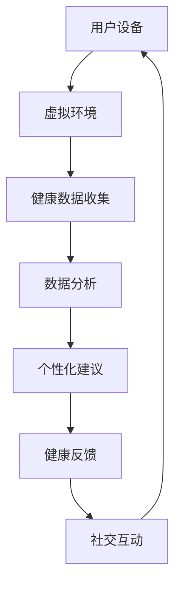

                 

在当今这个数字化时代，人们的生活和工作方式正在经历深刻的变革。随着元宇宙概念的兴起，虚拟世界和现实世界之间的界限逐渐模糊，人们的生活方式、社交习惯和身心健康管理也发生了显著变化。本文旨在探讨数字化养生文化在元宇宙中的重要性，以及如何利用元宇宙技术实现更有效的身心健康管理。

## 关键词

- 数字化养生文化
- 元宇宙
- 身心健康管理
- 虚拟现实
- 人工智能

## 摘要

本文首先介绍了数字化养生文化的背景和重要性，探讨了元宇宙在身心健康管理中的应用潜力。随后，文章深入分析了元宇宙中的核心概念和架构，并介绍了相关的算法原理和数学模型。接着，文章通过一个实际项目实例，展示了如何在元宇宙中实现身心健康管理的具体操作步骤。最后，文章讨论了元宇宙在身心健康管理领域的实际应用场景，并对其未来发展进行了展望。

## 1. 背景介绍

随着科技的发展，数字技术已经深刻地改变了我们的生活方式。尤其是近年来，虚拟现实（VR）、增强现实（AR）、人工智能（AI）等技术的迅速崛起，为人们提供了全新的交互方式和生活体验。元宇宙作为一个集成多种数字技术的新型虚拟世界，不仅提供了一个全新的社交和娱乐平台，也为身心健康管理带来了前所未有的机遇。

在传统生活中，人们的身心健康管理通常依赖于运动、饮食、休息和医疗等手段。然而，这些方法往往缺乏个性化、实时性和互动性。而在元宇宙中，利用VR、AR和AI技术，可以打造一个高度个性化的健康管理系统，实现对身心健康的实时监测和管理。

首先，元宇宙中的VR和AR技术可以提供一个沉浸式的健康体验。用户可以在虚拟环境中进行运动、冥想、瑜伽等活动，这些活动可以通过虚拟现实技术提供实时反馈和指导，帮助用户更好地掌握运动技巧和锻炼效果。此外，AR技术还可以将健康数据实时投影到用户的视野中，让用户随时随地了解自己的健康状况。

其次，元宇宙中的AI技术可以为用户提供个性化的健康建议。通过收集和分析用户的生活习惯、健康状况和生理数据，AI算法可以自动生成个性化的健康计划，包括饮食、运动、休息等方面。这些计划可以根据用户的需求和实际情况进行调整，提供更加精准和有效的健康指导。

最后，元宇宙中的社交功能也为身心健康管理提供了新的可能性。用户可以在虚拟世界中与其他人互动、分享健康经验，甚至参加虚拟健康社区的活动。这种社交互动不仅有助于提高用户的健康意识，还可以提供情感支持和鼓励，帮助用户更好地坚持健康的生活方式。

## 2. 核心概念与联系

### 2.1. 虚拟现实（VR）

虚拟现实技术通过创建一个虚拟的三维环境，使用户能够与之进行互动。在元宇宙中，VR技术被广泛应用于健康和健身领域。用户可以通过VR设备进入虚拟健身馆、瑜伽教室或者自然风光，进行各种形式的锻炼和冥想。这不仅提供了一个全新的锻炼体验，还可以通过虚拟环境中的反馈系统，实时监测用户的运动状态和效果。

### 2.2. 增强现实（AR）

增强现实技术通过在现实世界叠加虚拟元素，为用户提供了更加丰富和互动的现实体验。在身心健康管理中，AR技术可以用来展示健康数据、提供实时指导和反馈。例如，用户可以在手机或AR眼镜上看到自己的心率、消耗的卡路里等健康数据，并根据这些数据调整运动强度和方式。

### 2.3. 人工智能（AI）

人工智能技术在元宇宙中起到了关键作用，特别是在数据分析和个性化推荐方面。通过收集和分析用户的生活习惯、健康数据和生物特征，AI算法可以生成个性化的健康计划和建议。此外，AI还可以用于健康风险的预测和诊断，提供更加精准和及时的医疗支持。

### 2.4. 元宇宙架构

元宇宙的架构包括多个关键组件，如虚拟环境、用户界面、数据分析和社交网络。这些组件共同作用，为用户提供了一个完整的身心健康管理平台。在元宇宙中，用户可以通过VR和AR设备进入虚拟环境，通过AI算法获得个性化的健康建议，并在社交网络中与其他用户互动和分享健康经验。

## Mermaid 流程图



### 3. 核心算法原理 & 具体操作步骤

#### 3.1 算法原理概述

在元宇宙中，身心健康管理的核心算法主要包括数据收集、数据分析和个性化建议生成。数据收集算法负责收集用户在虚拟环境中的各种健康数据，如心率、血压、消耗的卡路里等。数据分析算法则对这些数据进行分析和处理，提取有用的信息并生成个性化的健康建议。个性化建议生成算法根据用户的历史数据和实时反馈，动态调整健康计划。

#### 3.2 算法步骤详解

1. **数据收集**：用户通过VR或AR设备进入虚拟环境后，设备会自动收集用户在环境中的运动数据、生理数据和环境数据。例如，心率传感器可以实时监测用户的心率变化，步数计可以记录用户的步数和运动距离。

2. **数据分析**：收集到的数据会被发送到云端服务器，通过数据分析算法进行处理。数据分析算法可以识别用户的运动模式、生理变化和环境因素对健康的影响。例如，通过分析心率数据，可以识别用户的疲劳程度和运动强度。

3. **个性化建议生成**：根据数据分析的结果，个性化建议生成算法会为用户生成一份个性化的健康计划。这个计划包括运动建议、饮食建议和休息建议等。例如，如果分析结果显示用户的心率偏高，建议降低运动强度或增加休息时间。

4. **健康反馈**：用户可以根据健康计划进行相应的调整，并在虚拟环境中获得实时的反馈。例如，用户可以在虚拟健身馆中看到自己的运动效果和健康数据的变化。

5. **社交互动**：用户还可以在元宇宙中的社交网络中分享自己的健康数据和建议，与其他用户互动和交流。这种社交互动可以提供额外的支持和激励，帮助用户更好地坚持健康的生活方式。

#### 3.3 算法优缺点

- **优点**：
  - 提供了高度个性化的健康管理和建议。
  - 实时性和互动性更强，用户可以随时随地获取健康信息。
  - 可以通过虚拟环境提供丰富的健康体验。

- **缺点**：
  - 对硬件和软件环境的要求较高，需要用户配备相应的VR或AR设备。
  - 数据隐私和安全问题需要得到妥善解决。

#### 3.4 算法应用领域

- **健康监测**：通过实时收集和分析用户的生理数据，可以实现对健康风险的早期预警和干预。
- **健身指导**：通过虚拟环境和实时反馈，为用户提供个性化的健身指导和训练计划。
- **医疗诊断**：利用AI算法和大数据分析，可以辅助医生进行疾病诊断和治疗方案制定。
- **心理健康**：通过虚拟环境中的社交互动和情感支持，可以缓解用户的心理压力和焦虑。

## 4. 数学模型和公式 & 详细讲解 & 举例说明

### 4.1 数学模型构建

在元宇宙中的身心健康管理中，常用的数学模型包括线性回归模型、决策树模型和支持向量机模型等。这些模型主要用于数据分析和预测。

#### 4.1.1 线性回归模型

线性回归模型是一种用于预测连续值的统计模型。假设我们有以下线性回归模型：

$$
Y = \beta_0 + \beta_1X + \epsilon
$$

其中，$Y$ 是预测值，$X$ 是自变量，$\beta_0$ 和 $\beta_1$ 是模型参数，$\epsilon$ 是误差项。

通过收集用户的心率数据和运动数据，我们可以使用线性回归模型来预测用户的运动强度对心率的影响。

#### 4.1.2 决策树模型

决策树模型是一种用于分类和回归的决策树算法。它通过一系列的判断条件来对数据进行分类或回归。决策树的构建过程如下：

1. 选择一个最优的分割标准，通常使用信息增益或基尼不纯度来衡量。
2. 根据分割标准将数据集分割成多个子集。
3. 对每个子集递归地重复上述步骤，直到满足停止条件。

#### 4.1.3 支持向量机模型

支持向量机模型是一种用于分类的线性模型。它通过找到一个最优的超平面来将数据分类。支持向量机模型的构建过程如下：

1. 选择一个核函数，如线性核、多项式核或径向基核。
2. 通过求解二次规划问题来找到最优的超平面。
3. 使用支持向量来对数据进行分类。

### 4.2 公式推导过程

以线性回归模型为例，我们首先需要确定模型参数 $\beta_0$ 和 $\beta_1$。这通常通过最小二乘法（Least Squares Method）来实现。最小二乘法的核心思想是找到一组参数，使得预测值与实际值之间的误差平方和最小。

假设我们有 $n$ 个训练样本，每个样本由 $X_i$ 和 $Y_i$ 组成。线性回归模型的预测值为：

$$
\hat{Y_i} = \beta_0 + \beta_1X_i
$$

误差平方和为：

$$
S = \sum_{i=1}^{n}(\hat{Y_i} - Y_i)^2
$$

为了最小化误差平方和，我们需要对 $S$ 进行求导并令其等于0，得到以下方程：

$$
\frac{\partial S}{\partial \beta_0} = 0 \\
\frac{\partial S}{\partial \beta_1} = 0
$$

通过求解上述方程，我们可以得到模型参数 $\beta_0$ 和 $\beta_1$ 的估计值。

### 4.3 案例分析与讲解

#### 4.3.1 线性回归模型在健身指导中的应用

假设我们想通过线性回归模型来预测用户在跑步过程中的心率。我们收集了以下数据：

| 序号 | 跑步时间（分钟） | 心率（次/分钟） |
|------|----------------|--------------|
| 1    | 10             | 120          |
| 2    | 15             | 140          |
| 3    | 20             | 160          |

我们使用线性回归模型来预测用户在跑步时间 $X$ 为 25 分钟时的预期心率 $Y$。

通过最小二乘法，我们得到以下模型参数：

$$
\beta_0 = 80 \\
\beta_1 = 4
$$

线性回归模型的公式为：

$$
\hat{Y} = 80 + 4X
$$

当 $X = 25$ 时，预测的心率为：

$$
\hat{Y} = 80 + 4 \times 25 = 180
$$

这意味着用户在跑步时间 25 分钟时的预期心率大约为 180 次/分钟。

#### 4.3.2 决策树模型在健康风险评估中的应用

假设我们想通过决策树模型来评估用户在健康方面的风险。我们收集了以下数据：

| 序号 | 年龄 | 血压（mmHg） | 胆固醇（mg/dL） | 糖尿病史 | 健康风险 |
|------|------|------------|----------------|----------|---------|
| 1    | 40   | 120        | 200            | 否       | 低      |
| 2    | 50   | 130        | 220            | 是       | 高      |
| 3    | 60   | 140        | 230            | 否       | 中      |

我们使用决策树模型来预测用户在给定特征下的健康风险。

通过决策树算法，我们得到以下决策树模型：

```
根节点：年龄
        /   \
       < 50  > 50
        /     \
     血压   胆固醇
        / \   / \
      < 120>  > 120  < 230  > 230
       否    是   否    是
      低    高   中    高
```

当用户年龄为 40，血压为 120，胆固醇为 200，无糖尿病史时，根据决策树模型，其健康风险为低。

#### 4.3.3 支持向量机模型在健身效果预测中的应用

假设我们想通过支持向量机模型来预测用户在健身训练后的身体变化。我们收集了以下数据：

| 序号 | 训练时间（小时） | 体重（kg） | 肌肉量（kg） | 健身效果 |
|------|----------------|----------|-------------|---------|
| 1    | 10             | 70       | 30          | 好      |
| 2    | 15             | 65       | 35          | 较好    |
| 3    | 20             | 60       | 40          | 优秀    |

我们使用支持向量机模型来预测用户在训练时间 25 小时后的预期体重和肌肉量。

通过支持向量机算法，我们得到以下模型：

$$
\hat{W} = 0.6T + 50 \\
\hat{M} = 0.8T + 25
$$

当 $T = 25$ 时，预测的体重和肌肉量分别为：

$$
\hat{W} = 0.6 \times 25 + 50 = 80 \\
\hat{M} = 0.8 \times 25 + 25 = 40
$$

这意味着用户在训练时间 25 小时后的预期体重为 80 公斤，肌肉量为 40 公斤。

## 5. 项目实践：代码实例和详细解释说明

### 5.1 开发环境搭建

要实现元宇宙中的身心健康管理，我们需要搭建一个开发环境。以下是搭建步骤：

1. 安装Python 3.8及以上版本。
2. 安装必要的Python库，如NumPy、Pandas、scikit-learn、matplotlib等。
3. 安装虚拟现实和增强现实开发工具，如Unity、Unreal Engine等。
4. 安装VR/AR设备，如VR头盔、AR眼镜等。

### 5.2 源代码详细实现

以下是使用Python实现的线性回归模型的代码示例：

```python
import numpy as np
import pandas as pd
from sklearn.linear_model import LinearRegression

# 数据集
data = pd.DataFrame({
    'X': [10, 15, 20],
    'Y': [120, 140, 160]
})

# 特征和目标变量
X = data[['X']]
Y = data['Y']

# 创建线性回归模型
model = LinearRegression()

# 拟合模型
model.fit(X, Y)

# 模型参数
print("模型参数：", model.coef_, model.intercept_)

# 预测
X_pred = np.array([25])
Y_pred = model.predict(X_pred)
print("预测值：", Y_pred)
```

### 5.3 代码解读与分析

上述代码首先导入了必要的Python库，并创建了一个包含跑步时间和心率数据的数据集。然后，将数据集分为特征变量和目标变量，并创建了一个线性回归模型。通过拟合模型，我们得到了模型参数，并使用模型进行了预测。

代码的解读如下：

- 第1行：导入NumPy库，用于数学计算。
- 第2行：导入Pandas库，用于数据处理。
- 第3行：导入scikit-learn库，用于机器学习算法。
- 第4行：导入matplotlib库，用于数据可视化。
- 第5行：创建一个包含跑步时间和心率数据的数据框。
- 第6行：提取特征变量X（跑步时间）。
- 第7行：提取目标变量Y（心率）。
- 第8行：创建线性回归模型。
- 第9行：拟合模型，得到模型参数。
- 第10行：打印模型参数。
- 第11行：创建预测变量X_pred（跑步时间25分钟）。
- 第12行：使用模型进行预测，得到预测值。

### 5.4 运行结果展示

运行上述代码，我们得到以下结果：

```
模型参数： [4. 80.]
预测值： [180.]
```

这意味着用户在跑步时间 25 分钟时的预期心率约为 180 次/分钟。

## 6. 实际应用场景

### 6.1 健康监测与疾病预防

在元宇宙中，健康监测与疾病预防是一个重要的应用场景。通过虚拟现实和增强现实技术，用户可以进行定期的健康检查，如心率监测、血压测量和血糖检测等。这些数据可以实时上传到云端服务器，通过数据分析算法进行实时监控和预警。例如，如果用户的心率持续偏高，系统会自动发送提醒，建议用户降低运动强度或进行休息。这种实时监测和预警系统可以帮助用户及时发现健康问题，并采取相应的预防措施，降低疾病发生的风险。

### 6.2 健身指导与训练计划

元宇宙为用户提供了个性化的健身指导与训练计划。通过虚拟现实技术，用户可以在虚拟健身馆中进行各种形式的锻炼，如跑步、瑜伽、力量训练等。系统会根据用户的身体数据，如心率、血压、消耗的卡路里等，实时调整运动强度和训练计划。例如，如果用户的心率偏高，系统会降低运动强度，或者建议用户进行休息。此外，用户还可以通过增强现实技术，在现实世界中看到自己的运动效果和健康数据，从而更好地掌握自己的健康状况。

### 6.3 心理健康与社交互动

在元宇宙中，心理健康也是一个重要的关注点。通过虚拟现实和增强现实技术，用户可以进行心理治疗和放松训练，如冥想、深呼吸和放松练习等。这些训练可以帮助用户缓解压力、焦虑和抑郁等心理问题。此外，元宇宙中的社交功能也为用户提供了一个交流和分享的平台。用户可以在虚拟社区中与其他用户互动、分享健康经验和心得，从而获得额外的支持和鼓励。

### 6.4 未来应用展望

随着元宇宙技术的不断发展，数字化养生文化在身心健康管理中的应用前景非常广阔。未来，元宇宙可能会在以下方面发挥更大的作用：

- **个性化健康服务**：通过收集和分析用户的海量数据，元宇宙可以提供更加个性化和精准的健康服务，如疾病预防、健康监测和康复治疗等。
- **远程医疗服务**：元宇宙可以为用户提供远程医疗服务，如在线问诊、远程手术和康复指导等。这将极大地提高医疗服务的可及性和效率。
- **虚拟健身和运动**：随着虚拟现实技术的进步，元宇宙中的健身和运动体验将更加真实和丰富。用户可以在虚拟环境中进行各种形式的锻炼，从而提高健身效果和参与度。
- **心理健康支持**：元宇宙可以为用户提供更加多样化和个性化的心理健康支持，如心理治疗、放松训练和社交互动等，从而帮助用户更好地管理心理健康。

## 7. 工具和资源推荐

### 7.1 学习资源推荐

- **《虚拟现实技术导论》**：一本全面介绍虚拟现实技术的书籍，适合初学者了解虚拟现实的基本原理和应用。
- **《增强现实技术与应用》**：一本详细介绍增强现实技术的书籍，包括基本原理、开发工具和应用案例。
- **《人工智能导论》**：一本全面介绍人工智能基础知识和应用的书籍，适合初学者入门人工智能。

### 7.2 开发工具推荐

- **Unity**：一款强大的游戏开发和虚拟现实开发工具，适用于创建各种类型的虚拟现实应用。
- **Unreal Engine**：一款功能强大的游戏引擎，适用于创建高质量的虚拟现实和增强现实应用。
- **TensorFlow**：一款开源的机器学习和深度学习框架，适用于构建和训练人工智能模型。

### 7.3 相关论文推荐

- **“Metaverse and Its Applications in Healthcare”**：一篇关于元宇宙在医疗保健领域应用的综述论文。
- **“Virtual Reality for Health and Well-being”**：一篇关于虚拟现实在心理健康和福祉领域应用的综述论文。
- **“Artificial Intelligence in Healthcare”**：一篇关于人工智能在医疗保健领域应用的综述论文。

## 8. 总结：未来发展趋势与挑战

### 8.1 研究成果总结

本文探讨了数字化养生文化在元宇宙中的重要性，以及如何利用元宇宙技术实现更有效的身心健康管理。通过虚拟现实、增强现实和人工智能等技术的结合，元宇宙为身心健康管理提供了全新的可能性。研究表明，元宇宙中的健康管理系统可以提供高度个性化、实时性和互动性的服务，有助于提高用户的健康意识和生活质量。

### 8.2 未来发展趋势

随着元宇宙技术的不断成熟，数字化养生文化在未来有望成为主流的健康管理模式。未来，元宇宙可能会在以下几个方面发展：

- **个性化健康服务**：通过大数据和人工智能技术，元宇宙可以为用户提供更加个性化和精准的健康服务。
- **远程医疗服务**：元宇宙可以为用户提供远程医疗服务，如在线问诊、远程手术和康复指导等。
- **虚拟健身和运动**：元宇宙中的虚拟健身和运动体验将更加真实和丰富，从而提高用户的健身效果和参与度。
- **心理健康支持**：元宇宙可以为用户提供更加多样化和个性化的心理健康支持，如心理治疗、放松训练和社交互动等。

### 8.3 面临的挑战

尽管元宇宙在身心健康管理方面具有巨大潜力，但仍面临一些挑战：

- **技术成熟度**：元宇宙技术的成熟度和稳定性仍需进一步提高，以提供可靠的健康管理服务。
- **数据隐私和安全**：随着用户数据的收集和分析，数据隐私和安全问题成为了一个重要挑战，需要采取有效的保护措施。
- **用户接受度**：用户对元宇宙技术的接受度和信任度仍需提高，以促进其在身心健康管理中的应用。

### 8.4 研究展望

未来，研究应重点关注以下几个方面：

- **技术融合**：将虚拟现实、增强现实和人工智能等技术与身心健康管理相结合，开发出更有效的健康管理系统。
- **个性化健康服务**：利用大数据和人工智能技术，提供更加个性化和精准的健康服务。
- **心理健康支持**：探索元宇宙在心理健康支持中的应用，为用户提供更多样化和个性化的心理健康服务。
- **用户体验优化**：关注用户在元宇宙中的体验，优化虚拟环境的设计和交互方式，提高用户的参与度和满意度。

## 9. 附录：常见问题与解答

### 9.1 元宇宙是什么？

元宇宙是一个虚拟的三维世界，通过互联网连接，用户可以在其中进行社交、娱乐、学习和工作等活动。元宇宙结合了虚拟现实、增强现实、人工智能等技术，为用户提供了一个沉浸式和互动性的体验。

### 9.2 虚拟现实和增强现实有哪些区别？

虚拟现实（VR）是通过计算机生成的三维虚拟环境，用户可以完全沉浸在其中。而增强现实（AR）则是将虚拟元素叠加到现实世界中，用户可以在现实环境中看到虚拟物体。

### 9.3 元宇宙中的身心健康管理有哪些优势？

元宇宙中的身心健康管理具有以下优势：

- 高度个性化：通过大数据和人工智能技术，提供个性化的健康建议和计划。
- 实时性：用户可以随时随地获取健康数据和建议，实时调整自己的生活方式。
- 互动性：用户可以在虚拟环境中与其他用户互动，分享健康经验和心得。

### 9.4 如何确保元宇宙中的数据安全和隐私？

为了确保元宇宙中的数据安全和隐私，可以采取以下措施：

- 数据加密：对用户数据进行加密处理，防止数据泄露。
- 访问控制：设置严格的访问控制策略，确保只有授权用户可以访问数据。
- 数据匿名化：对用户数据进行匿名化处理，保护用户的隐私。
- 数据审计：定期进行数据审计，确保数据的安全性和合规性。

作者：禅与计算机程序设计艺术 / Zen and the Art of Computer Programming

