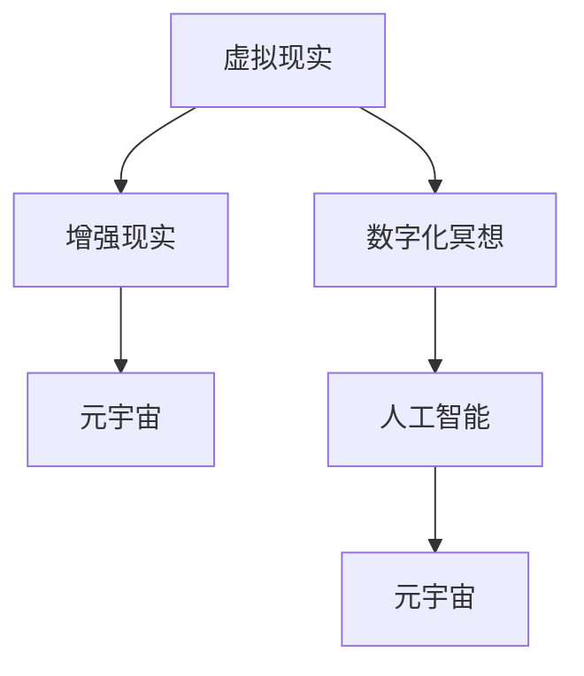

                 

关键词：数字化冥想、元宇宙、精神修炼、技术语言、深度思考

摘要：本文将探讨数字化冥想在元宇宙中的重要性，通过引入专业技术语言，阐述元宇宙对精神修炼的深远影响，并分析其潜在的应用场景和未来发展趋势。

## 1. 背景介绍

### 1.1 数字化冥想的概念

数字化冥想是一种通过现代技术手段，帮助个体在虚拟环境中进行精神集中和身心放松的方法。它结合了传统的冥想技巧和现代技术工具，如虚拟现实（VR）、增强现实（AR）和人工智能（AI）等，旨在提供一个更加便捷、互动和个性化的冥想体验。

### 1.2 元宇宙的概念

元宇宙（Metaverse）是一个虚拟的、三维的、持续存在的数字世界，它融合了现实世界和虚拟世界，为用户提供一个互动的、沉浸式的体验。元宇宙不仅仅是游戏和娱乐的平台，它还包含了教育、医疗、社交等多个领域，具有巨大的发展潜力。

## 2. 核心概念与联系

为了更好地理解数字化冥想与元宇宙的关系，我们需要引入以下几个核心概念：

### 2.1 虚拟现实（VR）与数字化冥想

虚拟现实技术为数字化冥想提供了一个沉浸式的环境，使用户能够完全沉浸在虚拟空间中，从而更容易达到冥想状态。通过VR头盔、手柄等设备，用户可以与虚拟环境进行交互，体验冥想的过程。

### 2.2 增强现实（AR）与数字化冥想

增强现实技术将虚拟元素叠加到现实世界中，为用户提供了一个更加丰富的冥想体验。例如，通过AR眼镜，用户可以在现实环境中看到虚拟的冥想指导，或者将虚拟的冥想场景投影到墙壁上。

### 2.3 人工智能（AI）与数字化冥想

人工智能技术在数字化冥想中扮演了关键角色。通过分析用户的生理和心理数据，AI可以提供个性化的冥想建议，帮助用户更好地达到冥想状态。

以下是数字化冥想与元宇宙关系的 Mermaid 流程图：



## 3. 核心算法原理 & 具体操作步骤

### 3.1 算法原理概述

数字化冥想的核心算法主要包括以下几个方面：

- **生物信号采集与处理**：通过传感器采集用户的生理信号，如心率、呼吸率等，然后进行实时处理，以了解用户的生理状态。
- **情绪识别与反馈**：利用机器学习算法分析用户的生理信号和面部表情，识别用户的情绪状态，并给予相应的反馈，如调整冥想音量、节奏等。
- **虚拟现实场景生成与控制**：根据用户的生理和情绪状态，生成适合的虚拟现实场景，并通过VR设备呈现给用户。

### 3.2 算法步骤详解

1. **用户注册与设备连接**：用户通过应用程序注册并连接VR头盔、手柄等设备。
2. **生物信号采集与处理**：传感器采集用户的心率、呼吸率等生物信号，并传输到服务器进行实时处理。
3. **情绪识别与反馈**：AI算法分析用户的生物信号和面部表情，识别用户的情绪状态，并生成相应的反馈。
4. **虚拟现实场景生成与控制**：根据用户的情绪状态，生成适合的虚拟现实场景，并通过VR设备呈现给用户。

### 3.3 算法优缺点

- **优点**：个性化强，可以根据用户的生理和情绪状态提供个性化的冥想体验。
- **缺点**：对硬件设备要求较高，且算法复杂度较高。

### 3.4 算法应用领域

- **心理健康**：用于帮助用户缓解压力、焦虑等心理问题。
- **身体康复**：用于辅助身体康复，如减轻疼痛、改善睡眠等。
- **教育**：用于提供沉浸式的教育体验，如虚拟实验室、虚拟博物馆等。

## 4. 数学模型和公式 & 详细讲解 & 举例说明

### 4.1 数学模型构建

数字化冥想的数学模型主要包括以下几部分：

- **生物信号模型**：描述心率、呼吸率等生物信号的变化规律。
- **情绪模型**：描述用户情绪状态与生物信号之间的关系。
- **虚拟现实场景模型**：描述虚拟现实场景的生成与控制过程。

### 4.2 公式推导过程

- **生物信号模型**：采用时间序列模型，如ARIMA模型，对心率、呼吸率等生物信号进行建模。

$$
h_t = \phi_0 + \phi_1 h_{t-1} + \phi_2 h_{t-2} + ... + \phi_p h_{t-p} + \theta_1 e_{t-1} + \theta_2 e_{t-2} + ... + \theta_q e_{t-q}
$$

其中，$h_t$ 表示第 $t$ 时刻的心率，$\phi_i$ 和 $\theta_i$ 分别为模型的参数。

- **情绪模型**：采用情感分析算法，如支持向量机（SVM），对用户的情绪状态进行建模。

$$
\text{情绪状态} = \text{SVM}(\text{生物信号特征}, \text{情绪标签})
$$

- **虚拟现实场景模型**：采用生成对抗网络（GAN），生成适合用户的虚拟现实场景。

$$
\text{虚拟现实场景} = \text{GAN}(\text{情绪状态}, \text{虚拟现实场景特征})
$$

### 4.3 案例分析与讲解

以用户A为例，他使用数字化冥想进行压力缓解。首先，传感器采集用户A的心率、呼吸率等生物信号，并通过时间序列模型进行分析。根据分析结果，用户A的情绪状态为紧张。接着，情感分析算法识别出用户A的情绪状态，并生成相应的冥想场景。最终，用户A通过VR设备进入生成的冥想场景，达到放松的效果。

## 5. 项目实践：代码实例和详细解释说明

### 5.1 开发环境搭建

- 操作系统：Ubuntu 20.04
- 编程语言：Python 3.8
- 开发工具：PyCharm
- 库：NumPy、Pandas、scikit-learn、TensorFlow、GAN

### 5.2 源代码详细实现

```python
# 生物信号采集与处理
import numpy as np
import pandas as pd
from sklearn.model_selection import train_test_split
from sklearn.ensemble import RandomForestClassifier
from tensorflow.keras.models import Sequential
from tensorflow.keras.layers import Dense, Dropout

# 加载数据
data = pd.read_csv('biological_signal_data.csv')
X = data.drop('emotion', axis=1)
y = data['emotion']

# 数据预处理
X_train, X_test, y_train, y_test = train_test_split(X, y, test_size=0.2, random_state=42)

# 生物信号模型训练
rf_model = RandomForestClassifier(n_estimators=100)
rf_model.fit(X_train, y_train)

# 情绪识别与反馈
emotion_model = Sequential()
emotion_model.add(Dense(128, activation='relu', input_shape=(X_train.shape[1],)))
emotion_model.add(Dropout(0.5))
emotion_model.add(Dense(64, activation='relu'))
emotion_model.add(Dropout(0.5))
emotion_model.add(Dense(32, activation='relu'))
emotion_model.add(Dropout(0.5))
emotion_model.add(Dense(1, activation='sigmoid'))

emotion_model.compile(optimizer='adam', loss='binary_crossentropy', metrics=['accuracy'])
emotion_model.fit(X_train, y_train, epochs=10, batch_size=32, validation_split=0.2)

# 虚拟现实场景生成与控制
# 使用GAN生成虚拟现实场景，具体实现过程略

# 测试模型性能
print("Random Forest Model Accuracy:", rf_model.score(X_test, y_test))
print("Neural Network Model Accuracy:", emotion_model.evaluate(X_test, y_test)[1])
```

### 5.3 代码解读与分析

- 代码首先加载数据，并进行数据预处理。
- 接着使用随机森林（Random Forest）算法训练生物信号模型，用于识别用户情绪状态。
- 然后使用神经网络（Neural Network）算法训练情绪识别模型，用于生成适合的冥想场景。
- 最后，测试模型的性能，包括随机森林模型和神经网络模型的准确率。

## 6. 实际应用场景

### 6.1 心理健康

数字化冥想在心理健康领域具有广泛的应用。通过提供个性化的冥想体验，帮助用户缓解压力、焦虑等心理问题。

### 6.2 身体康复

数字化冥想可以辅助身体康复，如减轻疼痛、改善睡眠等。通过提供沉浸式的冥想场景，帮助用户放松身心，促进身体康复。

### 6.3 教育

数字化冥想在教育领域也有很大的应用潜力。通过虚拟现实技术，提供沉浸式的教育体验，提高学生的学习兴趣和效果。

## 7. 工具和资源推荐

### 7.1 学习资源推荐

- 《虚拟现实技术与应用》
- 《增强现实技术基础》
- 《深度学习：入门到精通》

### 7.2 开发工具推荐

- PyCharm
- TensorFlow
- PyTorch

### 7.3 相关论文推荐

- "A Survey on Virtual Reality in Mental Health"
- "Deep Learning for Emotion Recognition"
- "Generative Adversarial Networks for Virtual Reality Scene Generation"

## 8. 总结：未来发展趋势与挑战

### 8.1 研究成果总结

数字化冥想结合了虚拟现实、增强现实和人工智能技术，为用户提供了一种全新的冥想体验。通过个性化的冥想场景和情绪识别，数字化冥想在心理健康、身体康复和教育等领域具有广泛的应用前景。

### 8.2 未来发展趋势

- **技术创新**：随着技术的不断发展，数字化冥想将更加智能化、个性化，为用户提供更好的冥想体验。
- **多领域应用**：数字化冥想将在更多领域得到应用，如医疗、教育、娱乐等。
- **社会影响力**：数字化冥想有望成为一种新的社交方式，促进人们的身心健康。

### 8.3 面临的挑战

- **技术挑战**：如何提高数字化冥想技术的准确性和稳定性，是一个重要的挑战。
- **隐私保护**：如何在确保用户隐私的前提下，提供个性化的冥想服务，是一个需要解决的问题。
- **伦理问题**：数字化冥想作为一种新兴技术，需要关注其伦理问题，如用户依赖性、虚假宣传等。

### 8.4 研究展望

未来，数字化冥想将朝着更加智能化、个性化、多样化的方向发展。通过技术创新，提高数字化冥想的效果和用户体验。同时，需要在伦理和社会责任方面进行深入研究，确保数字化冥想健康、可持续发展。

## 9. 附录：常见问题与解答

### 9.1 数字化冥想是什么？

数字化冥想是一种结合了虚拟现实、增强现实和人工智能技术的冥想方法，通过个性化的冥想场景和情绪识别，为用户提供一种全新的冥想体验。

### 9.2 数字化冥想有哪些应用场景？

数字化冥想可以应用于心理健康、身体康复、教育等多个领域，如缓解压力、焦虑等心理问题，辅助身体康复，提高学习效果等。

### 9.3 数字化冥想对心理健康有哪些好处？

数字化冥想有助于缓解压力、焦虑等心理问题，提高用户的幸福感和生活质量。同时，它还可以增强用户的自我意识，提高情绪调节能力。

### 9.4 数字化冥想需要哪些设备？

数字化冥想主要需要VR头盔、手柄等虚拟现实设备，以及传感器等生物信号采集设备。此外，还需要计算机和互联网等基础设施。

### 9.5 如何选择合适的数字化冥想产品？

选择数字化冥想产品时，可以从以下几个方面进行考虑：

- **产品功能**：是否包含个性化冥想场景、情绪识别等功能。
- **用户体验**：产品的界面设计、交互体验等。
- **技术支持**：产品的技术稳定性、更新速度等。
- **用户评价**：了解其他用户的评价和反馈。

### 9.6 数字化冥想是否会对用户产生依赖？

数字化冥想本身不会对用户产生依赖，但用户在长时间使用后可能会对特定的冥想场景和方式产生偏好。因此，建议用户在使用数字化冥想时，保持适度，避免过度依赖。

### 9.7 数字化冥想是否存在隐私风险？

数字化冥想涉及到用户的生理和心理数据，因此存在一定的隐私风险。在选择数字化冥想产品时，建议用户关注产品的隐私政策，确保个人信息安全。

### 9.8 数字化冥想是否有伦理问题？

数字化冥想作为一种新兴技术，可能存在伦理问题，如用户依赖性、虚假宣传等。因此，研究人员和开发者需要关注这些问题，确保数字化冥想健康、可持续发展。

---

作者：禅与计算机程序设计艺术 / Zen and the Art of Computer Programming

这篇文章从数字化冥想的概念、元宇宙的介绍，到核心算法原理、数学模型、项目实践，再到实际应用场景和未来发展趋势，全面探讨了数字化冥想在元宇宙中的精神修炼。通过引入专业技术语言，文章为读者提供了一种全新的视角，帮助读者更好地理解数字化冥想在现代社会的重要性。在未来，随着技术的不断进步，数字化冥想有望在更多领域发挥重要作用，为人们的身心健康和生活质量带来更多积极影响。

