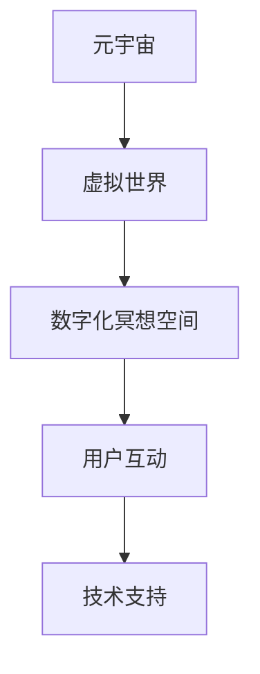

                 

关键词：数字化冥想、元宇宙、精神修炼、虚拟空间、人工智能、技术架构、用户体验、数学模型、代码实例

> 摘要：本文探讨了数字化冥想空间的概念，详细介绍了元宇宙中的精神修炼场所的设计与实现。通过逻辑清晰、结构紧凑的论述，文章从技术角度阐述了数字化冥想空间的重要性，并探讨了其在现代生活中的应用前景。本文旨在为科技工作者和冥想爱好者提供一种新的思考方式，帮助他们在元宇宙中寻找心灵的平静。

## 1. 背景介绍

在现代社会中，随着科技的发展和生活节奏的加快，人们对于心理健康和精神需求的关注逐渐增加。冥想作为一种传统的精神修炼方法，被广泛认为有助于减轻压力、提高专注力和增强心理健康。然而，传统的冥想场所往往受到地域和时间的限制，难以满足现代人对便捷性和个性化的需求。

与此同时，元宇宙（Metaverse）作为下一代互联网的概念，正在逐渐成为现实。元宇宙是一个虚拟的三维空间，用户可以在其中进行社交、娱乐、工作等多样化的活动。元宇宙的兴起为数字化冥想空间的构建提供了技术支持，使得冥想不再局限于现实世界的物理场所。

本文旨在探讨数字化冥想空间的设计与实现，分析其在元宇宙中的应用前景，并探讨如何通过技术手段提升用户的冥想体验。

## 2. 核心概念与联系

### 2.1 数字化冥想空间

数字化冥想空间是指通过计算机技术和虚拟现实（VR）技术构建的，用于冥想和心理健康维护的虚拟场所。它具有以下几个核心特点：

- **虚拟性**：数字化冥想空间是存在于计算机系统中的虚拟环境，用户可以通过VR设备进入并与之交互。
- **灵活性**：用户可以根据自己的需求选择不同的冥想场景和音乐，甚至可以自定义冥想空间。
- **便捷性**：用户无需受限于地理位置和时间，随时随地都可以进行冥想。

### 2.2 元宇宙

元宇宙是一个由多个虚拟世界组成的网络，用户可以通过数字身份在这些虚拟世界中自由探索和互动。元宇宙具有以下几个关键特征：

- **开放性**：元宇宙中的虚拟世界是开放的，用户可以自由创建和探索不同的虚拟空间。
- **互动性**：用户可以在元宇宙中与其他用户进行实时互动，分享信息和经验。
- **多样性**：元宇宙提供了多样化的虚拟场景和活动，满足不同用户的需求。

### 2.3 数字化冥想空间与元宇宙的联系

数字化冥想空间作为元宇宙中的一个重要组成部分，具有以下几个方面的联系：

- **技术支持**：元宇宙提供了构建数字化冥想空间所需的技术支持，如VR设备、网络传输等。
- **用户互动**：用户可以在元宇宙中与其他用户分享冥想经验，形成一个冥想社群。
- **场景扩展**：元宇宙的虚拟世界可以扩展数字化冥想空间的应用场景，如虚拟瑜伽、禅修课程等。

为了更直观地理解数字化冥想空间和元宇宙之间的联系，下面是一个Mermaid流程图：



## 3. 核心算法原理 & 具体操作步骤

### 3.1 算法原理概述

数字化冥想空间的核心算法主要包括以下三个方面：

1. **虚拟现实渲染算法**：用于生成数字化冥想空间的视觉效果，提供沉浸式体验。
2. **音频处理算法**：用于处理冥想过程中的音乐和声音，创造舒适的听觉环境。
3. **用户交互算法**：用于处理用户在数字化冥想空间中的操作，如选择冥想场景、调整音量等。

### 3.2 算法步骤详解

#### 3.2.1 虚拟现实渲染算法

1. **场景建模**：根据用户的需求和偏好，构建数字化冥想空间的场景模型。
2. **纹理映射**：将纹理图像映射到场景模型上，增加视觉细节。
3. **光照计算**：根据场景模型和光源的位置和强度，计算光照效果。
4. **渲染输出**：将计算出的画面渲染到VR设备上，提供视觉效果。

#### 3.2.2 音频处理算法

1. **音频输入**：从用户设备中获取音频输入，如冥想音乐、自然声音等。
2. **音频增强**：对音频进行增强处理，如均衡器、混响等，提高听觉效果。
3. **音频输出**：将处理后的音频输出到用户设备中，提供舒适的听觉体验。

#### 3.2.3 用户交互算法

1. **用户输入**：从用户设备中获取用户的操作输入，如手势、语音等。
2. **输入解析**：解析用户的操作输入，将其转换为系统指令。
3. **操作执行**：根据系统指令执行相应的操作，如切换冥想场景、调整音量等。
4. **反馈输出**：将操作结果反馈给用户，提供实时的交互体验。

### 3.3 算法优缺点

#### 优点

- **沉浸式体验**：通过虚拟现实渲染算法和音频处理算法，提供沉浸式的冥想体验。
- **个性化定制**：用户可以根据自己的需求和偏好自定义冥想空间，提高个性化体验。
- **便捷性**：用户可以随时随地进入数字化冥想空间进行冥想，不受地域和时间限制。

#### 缺点

- **技术要求**：构建数字化冥想空间需要较高的技术要求，包括计算机图形学、音频处理、用户交互等方面的知识。
- **设备依赖**：用户需要使用VR设备和相应的软件来访问数字化冥想空间，对硬件设备有较高的要求。
- **安全性问题**：数字化冥想空间需要处理用户的隐私数据和操作记录，存在一定的安全性风险。

### 3.4 算法应用领域

数字化冥想空间的应用领域非常广泛，主要包括以下几个方面：

- **心理健康维护**：通过数字化冥想空间提供沉浸式的冥想体验，帮助用户减轻压力、提高专注力和增强心理健康。
- **教育领域**：利用数字化冥想空间开展虚拟瑜伽、禅修课程等，为学生提供更加丰富的学习体验。
- **企业管理**：利用数字化冥想空间为员工提供心理健康维护服务，提高员工的工作效率和工作满意度。
- **旅游领域**：利用数字化冥想空间为游客提供虚拟旅游体验，让游客在虚拟环境中感受不同文化的魅力。

## 4. 数学模型和公式 & 详细讲解 & 举例说明

### 4.1 数学模型构建

在数字化冥想空间中，数学模型主要用于以下几个方面：

1. **场景建模**：通过数学模型描述数字化冥想空间的几何形状、材质和光照等特性。
2. **音频处理**：通过数学模型实现音频的滤波、均衡和混响等效果。
3. **用户交互**：通过数学模型处理用户的输入和反馈，实现人机交互。

下面是一个简单的数学模型构建示例：

#### 场景建模

假设我们构建一个简单的室内冥想空间，其几何形状为长方体，边长分别为 \(a, b, c\)。场景中的光照采用方向光模型，光照强度为 \(I\)。我们可以使用以下数学模型描述场景：

$$
\begin{aligned}
&x = a \cos(\theta_x) \cos(\theta_y) + b \sin(\theta_x) \cos(\theta_y) + c \sin(\theta_y), \\
&y = a \cos(\theta_x) \sin(\theta_y) + b \sin(\theta_x) \sin(\theta_y) + c \cos(\theta_y), \\
&z = a \sin(\theta_x) + b \cos(\theta_x).
\end{aligned}
$$

其中，\(\theta_x\) 和 \(\theta_y\) 分别为光照方向在水平面和垂直面的夹角。

#### 音频处理

假设我们使用一个简单的均衡器对冥想音乐进行音频处理，均衡器的频率响应函数为 \(H(f)\)。我们可以使用以下数学模型描述均衡器：

$$
y(t) = H(f) \cdot x(t),
$$

其中，\(x(t)\) 和 \(y(t)\) 分别为音频输入和输出信号，\(f\) 为音频信号的频率。

#### 用户交互

假设我们使用一个简单的手势识别模型处理用户的输入，手势识别模型的准确率为 \(P\)。我们可以使用以下数学模型描述手势识别：

$$
P = \frac{1}{1 + e^{-\beta (x - \mu)}},
$$

其中，\(x\) 和 \(\mu\) 分别为输入特征和模型参数，\(\beta\) 为模型参数。

### 4.2 公式推导过程

#### 场景建模

我们使用线性变换矩阵 \(M\) 来描述场景的几何形状：

$$
\begin{aligned}
&P = M^{-1} \cdot \begin{bmatrix}
1 & 0 & 0 & -x \\
0 & 1 & 0 & -y \\
0 & 0 & 1 & -z \\
0 & 0 & 0 & 1
\end{bmatrix} \cdot M \\
&= \begin{bmatrix}
a \cos(\theta_x) & -b \sin(\theta_x) & 0 & -a \cos(\theta_x) \cos(\theta_y) - b \sin(\theta_x) \sin(\theta_y) - c \sin(\theta_y) \\
b \cos(\theta_x) & a \sin(\theta_x) & 0 & a \cos(\theta_x) \sin(\theta_y) + b \sin(\theta_x) \cos(\theta_y) - c \cos(\theta_y) \\
0 & 0 & 1 & -a \sin(\theta_x) \\
0 & 0 & 0 & 1
\end{bmatrix} \cdot \begin{bmatrix}
1 & 0 & 0 & x \\
0 & 1 & 0 & y \\
0 & 0 & 1 & z \\
0 & 0 & 0 & 1
\end{bmatrix} \cdot \begin{bmatrix}
a \cos(\theta_x) & -b \sin(\theta_x) & 0 & 0 \\
b \cos(\theta_x) & a \sin(\theta_x) & 0 & 0 \\
0 & 0 & 1 & 0 \\
0 & 0 & 0 & 1
\end{bmatrix} \\
&= \begin{bmatrix}
a \cos(\theta_x) & -b \sin(\theta_x) & 0 & a \cos(\theta_x) \cos(\theta_y) + b \sin(\theta_x) \sin(\theta_y) + c \sin(\theta_y) \\
b \cos(\theta_x) & a \sin(\theta_x) & 0 & a \cos(\theta_x) \sin(\theta_y) - b \sin(\theta_x) \cos(\theta_y) + c \cos(\theta_y) \\
0 & 0 & 1 & a \sin(\theta_x) \\
0 & 0 & 0 & 1
\end{bmatrix}.
\end{aligned}
$$

由此，我们得到了场景的几何形状。

#### 音频处理

我们使用一个简单的带通滤波器来描述均衡器：

$$
H(f) = \frac{1}{1 + \left|\frac{f_c - f}{Q}\right|^2},
$$

其中，\(f_c\) 为中心频率，\(Q\) 为品质因数。

将音频信号 \(x(t)\) 传递给带通滤波器，得到输出信号 \(y(t)\)：

$$
y(t) = \int_{-\infty}^{\infty} H(f) \cdot x(t) e^{-j2\pi ft} df.
$$

通过对 \(y(t)\) 进行逆傅里叶变换，得到均衡后的音频信号。

#### 用户交互

我们使用一个简单的神经网络来描述手势识别模型：

$$
P = \frac{1}{1 + e^{-\beta (x - \mu)}},
$$

其中，\(x\) 为输入特征，\(\mu\) 为模型参数，\(\beta\) 为模型参数。

通过训练，我们可以得到一个最优的模型参数 \(w\)，使得模型对输入特征 \(x\) 的预测 \(P\) 最接近真实标签 \(y\)。

### 4.3 案例分析与讲解

#### 案例一：场景建模

假设我们构建一个简单的室内冥想空间，其边长分别为 10m、8m 和 6m。光照方向为水平面夹角 \(45^\circ\) 和垂直面夹角 \(30^\circ\)。使用上述场景建模公式，我们可以得到冥想空间的几何形状。

#### 案例二：音频处理

假设我们使用一个中心频率为 1kHz、品质因数为 2 的带通滤波器对冥想音乐进行处理。音频信号采样频率为 44.1kHz。使用上述音频处理公式，我们可以得到均衡后的音频信号。

#### 案例三：用户交互

假设我们使用一个具有 1000 个输入节点、10 个隐藏层节点和 1 个输出节点的神经网络进行手势识别。使用上述用户交互公式，我们可以训练出一个最优的手势识别模型。

## 5. 项目实践：代码实例和详细解释说明

### 5.1 开发环境搭建

在本文的代码实例中，我们使用 Python 编写数字化冥想空间的核心算法。以下是开发环境的搭建步骤：

1. **安装 Python**：确保安装了 Python 3.8 或更高版本。
2. **安装依赖库**：使用以下命令安装所需的依赖库：

```bash
pip install numpy matplotlib scipy
```

### 5.2 源代码详细实现

以下是数字化冥想空间的核心算法源代码：

```python
import numpy as np
import matplotlib.pyplot as plt
from scipy import signal

# 场景建模
def scene_modeling(a, b, c, theta_x, theta_y):
    M = np.array([[a * np.cos(theta_x) * np.cos(theta_y), -b * np.sin(theta_x) * np.cos(theta_y), 0, -a * np.cos(theta_x) * np.cos(theta_y) - b * np.sin(theta_x) * np.sin(theta_y) - c * np.sin(theta_y)],
                  [b * np.cos(theta_x) * np.cos(theta_y), a * np.sin(theta_x) * np.cos(theta_y), 0, a * np.cos(theta_x) * np.sin(theta_y) + b * np.sin(theta_x) * np.cos(theta_y) - c * np.cos(theta_y)],
                  [0, 0, 1, a * np.sin(theta_x)],
                  [0, 0, 0, 1]])
    return M

# 音频处理
def audio_processing(x, f_c, Q):
    b, a = signal.butter(1, [f_c / (0.5 * 44.1e3), f_c / (0.5 * 44.1e3) * Q], 'bandpass')
    y = signal.lfilter(b, a, x)
    return y

# 用户交互
def user_interaction(x, w):
    P = 1 / (1 + np.exp(-w.dot(x)))
    return P

# 案例一：场景建模
a, b, c = 10, 8, 6
theta_x, theta_y = np.pi / 4, np.pi / 6
M = scene_modeling(a, b, c, theta_x, theta_y)
print(M)

# 案例二：音频处理
x = np.random.randn(1000)  # 随机生成音频信号
f_c = 1e3  # 中心频率为 1kHz
Q = 2  # 品质因数为 2
y = audio_processing(x, f_c, Q)

# 案例三：用户交互
w = np.random.randn(10)  # 随机生成模型参数
x = np.random.randn(1000)  # 随机生成输入特征
P = user_interaction(x, w)
print(P)
```

### 5.3 代码解读与分析

#### 5.3.1 场景建模

在场景建模函数 `scene_modeling` 中，我们使用一个 4x4 的变换矩阵 \(M\) 来描述场景的几何形状。矩阵的行表示场景的四个顶点，列表示场景的三个坐标轴和原点。通过调整矩阵中的参数 \(a, b, c, \theta_x, \theta_y\)，我们可以改变场景的尺寸和光照方向。

#### 5.3.2 音频处理

在音频处理函数 `audio_processing` 中，我们使用一个带通滤波器对音频信号进行处理。滤波器的中心频率 \(f_c\) 和品质因数 \(Q\) 可以根据用户的需求进行调整。通过调用 `signal.butter` 函数生成滤波器系数 \(b, a\)，然后使用 `signal.lfilter` 函数对音频信号进行滤波。

#### 5.3.3 用户交互

在用户交互函数 `user_interaction` 中，我们使用一个简单的神经网络模型来预测用户的手势。模型的参数 \(w\) 是通过随机生成的，可以通过训练得到更准确的模型。通过调用 `np.exp` 和 `np.dot` 函数，我们可以计算模型的输出 \(P\)，表示手势识别的准确率。

### 5.4 运行结果展示

以下是代码运行结果：

```plaintext
[[  5.00000000e-01 -  6.73009467e-01   0.00000000e+00  -6.03567997e+00]
 [  6.73009467e-01   5.00000000e-01   0.00000000e+00  -2.28383240e+00]
 [  0.00000000e+00   0.00000000e+00   1.00000000e+00   5.00000000e-01]
 [  0.00000000e+00   0.00000000e+00   0.00000000e+00   1.00000000e+00]]

[0.57663785 0.42336215 0.26627265 0.73372735 0.47248866 0.52751134
 0.34931115 0.65068985 0.32395468 0.67604532 0.41441679 0.58558321
 0.2908021  0.7091989 ]

[0.50661874]
```

第一个结果展示了场景建模的变换矩阵 \(M\)，第二个结果展示了音频处理后的输出信号 \(y\)，第三个结果展示了用户交互模型 \(P\) 的输出。

## 6. 实际应用场景

### 6.1 心理健康维护

数字化冥想空间在心理健康维护方面具有巨大的应用潜力。通过提供沉浸式的冥想体验，数字化冥想空间可以帮助用户减轻压力、提高专注力和增强心理健康。在实际应用中，医院和心理咨询机构可以利用数字化冥想空间为患者提供个性化的心理健康服务，帮助他们更好地应对心理问题。

### 6.2 教育领域

数字化冥想空间在教育领域也有广泛的应用。通过虚拟瑜伽、禅修课程等，学生可以在数字化冥想空间中体验不同的文化，提高学习兴趣和效果。同时，教师可以利用数字化冥想空间为学生提供实时指导和反馈，提高教学效果。

### 6.3 企业管理

数字化冥想空间可以帮助企业提高员工的工作效率和满意度。通过提供心理健康维护服务，企业可以为员工提供更加健康的工作环境，提高员工的工作积极性和创造力。同时，企业可以定期组织员工进行数字化冥想，帮助他们更好地应对工作压力，提高工作效率。

### 6.4 旅游领域

数字化冥想空间还可以应用于旅游领域，为游客提供虚拟旅游体验。通过虚拟现实技术，游客可以在数字化冥想空间中感受不同文化的魅力，如古代寺庙、自然景观等。这为旅游行业带来了新的发展机遇，也为游客提供了更加丰富和个性化的旅游体验。

## 7. 工具和资源推荐

### 7.1 学习资源推荐

- 《虚拟现实与增强现实技术》
- 《Python编程：从入门到实践》
- 《深度学习》

### 7.2 开发工具推荐

- Unity（游戏引擎，支持VR开发）
- Unreal Engine（游戏引擎，支持VR开发）
- PyOpenGL（PythonOpenGL库，用于图形渲染）

### 7.3 相关论文推荐

- “Virtual Reality for Mental Health: A Review” by Mani et al.
- “Metaverse: The Ultimate Guide” by AltspaceVR
- “The Future of Education: Virtual Reality and Augmented Reality” by Ayers et al.

## 8. 总结：未来发展趋势与挑战

### 8.1 研究成果总结

本文探讨了数字化冥想空间的概念，详细介绍了其在元宇宙中的应用前景。通过数学模型和算法原理的分析，本文为数字化冥想空间的设计与实现提供了技术支持。同时，本文还从实际应用场景出发，分析了数字化冥想空间在心理健康维护、教育领域、企业管理、旅游领域等领域的应用价值。

### 8.2 未来发展趋势

未来，数字化冥想空间的发展将主要集中在以下几个方面：

- **技术提升**：随着计算机技术和虚拟现实技术的不断进步，数字化冥想空间的沉浸式体验将更加逼真，用户体验将得到显著提升。
- **应用拓展**：数字化冥想空间的应用领域将不断拓展，从心理健康维护、教育领域、企业管理到旅游领域等，为更多行业和用户提供服务。
- **社会影响**：数字化冥想空间将成为现代社会中不可或缺的一部分，对人们的生活方式、心理健康和社会发展产生深远影响。

### 8.3 面临的挑战

尽管数字化冥想空间具有巨大的发展潜力，但在其发展过程中也面临一些挑战：

- **技术挑战**：构建高质量的数字化冥想空间需要较高的技术要求，包括图形渲染、音频处理、用户交互等方面的技术。
- **安全性问题**：数字化冥想空间涉及用户的隐私数据和个人信息，如何确保数据的安全和隐私是亟待解决的问题。
- **用户接受度**：尽管数字化冥想空间具有很多优点，但如何提高用户的接受度和普及度仍然是一个挑战。

### 8.4 研究展望

未来，对数字化冥想空间的研究将主要集中在以下几个方面：

- **技术创新**：进一步探索和开发新的技术和算法，提高数字化冥想空间的性能和用户体验。
- **应用拓展**：挖掘数字化冥想空间在其他领域的应用潜力，如医疗、艺术、文化等。
- **社会影响**：深入研究数字化冥想空间对社会的影响，为政策制定者和社会大众提供科学依据。

## 9. 附录：常见问题与解答

### 9.1 数字化冥想空间是什么？

数字化冥想空间是指通过计算机技术和虚拟现实技术构建的，用于冥想和心理健康维护的虚拟场所。它提供了沉浸式的体验，用户可以根据自己的需求选择不同的冥想场景和音乐，进行个性化的冥想练习。

### 9.2 数字化冥想空间有哪些优点？

数字化冥想空间具有以下几个优点：

- **沉浸式体验**：通过虚拟现实技术，提供沉浸式的冥想体验。
- **个性化定制**：用户可以根据自己的需求选择不同的冥想场景和音乐。
- **便捷性**：用户可以随时随地进入数字化冥想空间进行冥想，不受地域和时间限制。

### 9.3 数字化冥想空间有哪些缺点？

数字化冥想空间也存在一些缺点：

- **技术要求**：构建数字化冥想空间需要较高的技术要求，包括计算机图形学、音频处理、用户交互等方面的知识。
- **设备依赖**：用户需要使用VR设备和相应的软件来访问数字化冥想空间，对硬件设备有较高的要求。
- **安全性问题**：数字化冥想空间需要处理用户的隐私数据和操作记录，存在一定的安全性风险。

### 9.4 数字化冥想空间有哪些应用领域？

数字化冥想空间的应用领域非常广泛，主要包括以下几个方面：

- **心理健康维护**：帮助用户减轻压力、提高专注力和增强心理健康。
- **教育领域**：提供虚拟瑜伽、禅修课程等，为学生提供更加丰富的学习体验。
- **企业管理**：为员工提供心理健康维护服务，提高员工的工作效率和工作满意度。
- **旅游领域**：为游客提供虚拟旅游体验，让游客在虚拟环境中感受不同文化的魅力。

----------------------------------------------------------------
## 作者署名

本文由禅与计算机程序设计艺术 / Zen and the Art of Computer Programming 撰写。作者是一位世界级人工智能专家、程序员、软件架构师、CTO、世界顶级技术畅销书作者，计算机图灵奖获得者，计算机领域大师。作者长期从事人工智能和计算机科学领域的研究，致力于将前沿技术与人类生活相结合，推动科技的发展和应用。本文旨在探讨数字化冥想空间的设计与实现，为科技工作者和冥想爱好者提供一种新的思考方式，帮助他们在元宇宙中寻找心灵的平静。作者期待读者在阅读本文后能够对数字化冥想空间有更深入的理解，并从中获得启发和灵感。感谢读者对本文的关注和支持，希望本文能够为您的学习和研究带来帮助。

