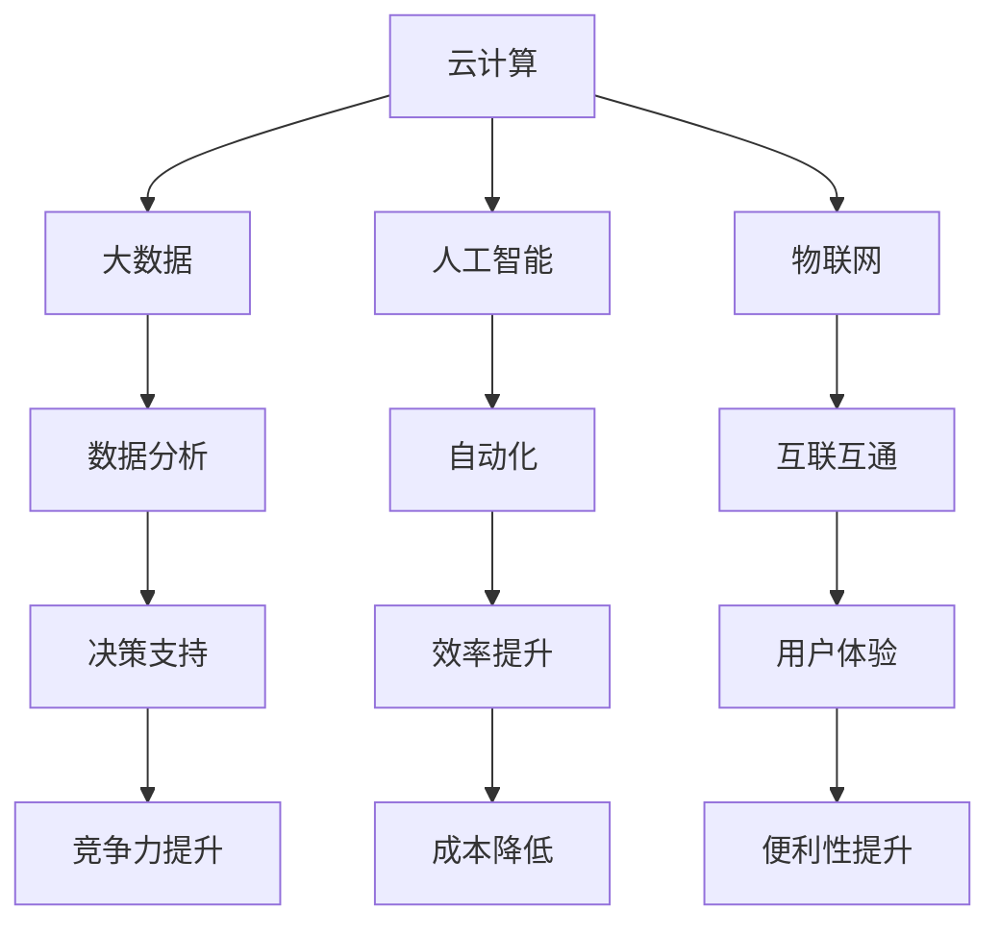

                 

### 1. 背景介绍

随着数字化技术的飞速发展，传统的商业模式正在经历深刻的变革。数字化创业已成为企业家们追求的一种新趋势。在这篇文章中，我们将探讨数字化创业的核心概念、关键技术和成功案例，帮助您了解如何打造未来企业。

在当今世界，信息技术的发展已成为推动经济增长和社会进步的关键力量。云计算、大数据、人工智能、物联网等新兴技术正在重新定义企业运营的方式，也为创业者提供了前所未有的机遇。然而，数字化创业并非易事，它需要深刻的洞察力、创新思维和严谨的策略。

本文将围绕以下几个核心问题展开：

1. 数字化创业的定义及其重要性。
2. 数字化创业的核心概念和关键技术。
3. 成功的数字化创业案例及其启示。
4. 数字化创业面临的挑战与应对策略。
5. 未来数字化创业的发展趋势和前景。

通过本文的阅读，您将获得对数字化创业的全面理解，并学会如何利用数字化技术打造未来企业。

## 2. 核心概念与联系

在探讨数字化创业之前，我们首先需要了解一些核心概念，包括云计算、大数据、人工智能、物联网等。这些概念相互关联，共同构成了数字化创业的基石。

### 2.1 云计算

云计算是一种通过互联网提供计算资源的服务模式，包括基础设施即服务（IaaS）、平台即服务（PaaS）和软件即服务（SaaS）。云计算具有弹性、可扩展性和成本效益高等特点，能够帮助企业降低IT成本，提高运营效率。

### 2.2 大数据

大数据是指无法用传统数据处理工具在合理时间内完成处理的数据集合。大数据具有海量、高速、多样和价值密度低等特点。通过对大数据的分析和处理，企业可以挖掘出有价值的信息，提升决策能力。

### 2.3 人工智能

人工智能是指通过计算机模拟人类智能的技术。人工智能可以分为机器学习、深度学习、自然语言处理等多个领域。人工智能能够帮助企业实现自动化、智能化，提高生产效率和用户体验。

### 2.4 物联网

物联网是指将各种设备通过互联网连接起来，实现设备间的互联互通。物联网技术可以广泛应用于智能家居、智能交通、智能医疗等领域，为人们的生活带来便利。

### 2.5 关系与联系

云计算、大数据、人工智能和物联网等技术在数字化创业中相互关联，共同构建了数字化企业的生态系统。云计算提供了计算资源和存储空间，大数据提供了数据支持，人工智能实现了自动化和智能化，物联网实现了设备间的互联互通。这些技术的融合应用，能够帮助企业实现数字化转型，提升竞争力。

### Mermaid 流程图

以下是一个简化的 Mermaid 流程图，展示数字化创业的核心概念及其联系：



通过这个流程图，我们可以清晰地看到云计算、大数据、人工智能和物联网等技术在数字化创业中的关键作用和相互关系。

### 2.6 数字化创业的挑战与机遇

数字化创业面临着诸多挑战，包括技术门槛、市场不确定性、人才短缺等。然而，这些挑战也带来了巨大的机遇。创业者可以通过不断学习、创新和调整策略，克服困难，实现成功。

### 2.7 核心概念总结

本节内容介绍了数字化创业的核心概念，包括云计算、大数据、人工智能和物联网。这些概念相互关联，共同构成了数字化创业的基础。通过了解这些核心概念，创业者可以更好地把握数字化创业的趋势，制定相应的战略。

## 3. 核心算法原理 & 具体操作步骤

### 3.1 算法原理概述

在数字化创业中，算法原理起着至关重要的作用。算法是一种解决问题的步骤序列，通过计算机执行来实现。在数字化创业中，常见的算法包括机器学习算法、深度学习算法、数据分析算法等。这些算法能够帮助企业实现自动化、智能化和高效决策。

### 3.2 算法步骤详解

#### 3.2.1 机器学习算法

机器学习算法是一种通过训练数据集来学习并改进模型的方法。其基本步骤包括：

1. 数据收集：收集相关的训练数据。
2. 数据预处理：对数据进行清洗、归一化等处理。
3. 模型选择：选择合适的机器学习模型。
4. 模型训练：使用训练数据集训练模型。
5. 模型评估：使用测试数据集评估模型性能。
6. 模型优化：根据评估结果调整模型参数。

#### 3.2.2 深度学习算法

深度学习算法是一种基于人工神经网络的学习方法。其基本步骤包括：

1. 数据收集：收集大量的训练数据。
2. 网络设计：设计合适的神经网络结构。
3. 模型训练：使用训练数据集训练神经网络。
4. 模型评估：使用测试数据集评估神经网络性能。
5. 模型优化：根据评估结果调整网络参数。

#### 3.2.3 数据分析算法

数据分析算法是一种用于分析数据并提取有价值信息的方法。其基本步骤包括：

1. 数据收集：收集相关的数据。
2. 数据预处理：对数据进行清洗、归一化等处理。
3. 特征选择：选择合适的数据特征。
4. 模型选择：选择合适的数据分析模型。
5. 模型训练：使用训练数据集训练模型。
6. 模型评估：使用测试数据集评估模型性能。
7. 模型优化：根据评估结果调整模型参数。

### 3.3 算法优缺点

#### 3.3.1 机器学习算法

优点：

- 自适应性强，能够根据数据自动调整模型。
- 能够处理大规模数据，提高计算效率。

缺点：

- 对数据质量要求较高，数据预处理复杂。
- 模型解释性较差，难以理解模型内部机制。

#### 3.3.2 深度学习算法

优点：

- 在图像识别、语音识别等任务上具有很高的准确率。
- 能够自动学习复杂的数据特征。

缺点：

- 训练时间较长，计算资源需求高。
- 模型解释性较差，难以理解模型内部机制。

#### 3.3.3 数据分析算法

优点：

- 能够提取数据中的有价值信息，辅助决策。
- 能够处理多种类型的数据。

缺点：

- 模型解释性较差，难以理解模型内部机制。
- 对数据质量和特征选择有较高要求。

### 3.4 算法应用领域

机器学习算法、深度学习算法和数据分析算法在数字化创业中具有广泛的应用领域，包括：

1. 客户行为分析：通过分析客户行为数据，了解客户需求，提高客户满意度。
2. 智能推荐系统：通过推荐算法，为用户推荐感兴趣的产品或内容。
3. 智能交通系统：通过数据分析算法，优化交通流量，减少拥堵。
4. 智能医疗：通过机器学习算法，辅助医生进行疾病诊断和治疗。
5. 金融风控：通过数据分析算法，识别潜在风险，防范金融犯罪。

### 3.5 核心算法总结

本节内容介绍了数字化创业中的核心算法，包括机器学习算法、深度学习算法和数据分析算法。这些算法在数字化创业中发挥着重要作用，能够帮助企业实现自动化、智能化和高效决策。通过对算法原理和步骤的深入理解，创业者可以更好地应用这些算法，实现创业目标。

## 4. 数学模型和公式 & 详细讲解 & 举例说明

在数字化创业中，数学模型和公式发挥着至关重要的作用。数学模型能够帮助创业者描述问题、分析数据和制定决策。本节将介绍几种常用的数学模型和公式，并对其进行详细讲解和举例说明。

### 4.1 数学模型构建

#### 4.1.1 概率模型

概率模型是一种用于描述随机事件发生概率的数学模型。常见的概率模型包括二项分布、正态分布、泊松分布等。

- 二项分布：用于描述在n次独立重复实验中，事件A发生k次的概率。
  - 公式：$$P(X = k) = C(n, k) \times p^k \times (1-p)^{n-k}$$
  - 其中，$C(n, k)$为组合数，$p$为事件A发生的概率。

- 正态分布：用于描述连续随机变量的概率分布。
  - 公式：$$f(x) = \frac{1}{\sqrt{2\pi\sigma^2}} \times e^{-\frac{(x-\mu)^2}{2\sigma^2}}$$
  - 其中，$\mu$为均值，$\sigma$为标准差。

- 泊松分布：用于描述在一定时间或空间内，事件发生的次数。
  - 公式：$$P(X = k) = \frac{\lambda^k \times e^{-\lambda}}{k!}$$
  - 其中，$\lambda$为事件发生的平均次数。

#### 4.1.2 回归模型

回归模型是一种用于描述变量之间关系的数学模型。常见的回归模型包括线性回归、多项式回归、逻辑回归等。

- 线性回归：用于描述两个或多个变量之间的线性关系。
  - 公式：$$y = \beta_0 + \beta_1 \times x_1 + \beta_2 \times x_2 + ... + \beta_n \times x_n$$
  - 其中，$y$为因变量，$x_1, x_2, ..., x_n$为自变量，$\beta_0, \beta_1, ..., \beta_n$为回归系数。

- 多项式回归：用于描述两个或多个变量之间的非线性关系。
  - 公式：$$y = \beta_0 + \beta_1 \times x_1 + \beta_2 \times x_1^2 + ... + \beta_n \times x_1^n$$
  - 其中，$y$为因变量，$x_1$为自变量，$\beta_0, \beta_1, ..., \beta_n$为回归系数。

- 逻辑回归：用于描述因变量为二分类变量的回归模型。
  - 公式：$$\log\frac{P(Y=1)}{1-P(Y=1)} = \beta_0 + \beta_1 \times x_1 + \beta_2 \times x_2 + ... + \beta_n \times x_n$$
  - 其中，$Y$为因变量，$x_1, x_2, ..., x_n$为自变量，$\beta_0, \beta_1, ..., \beta_n$为回归系数。

### 4.2 公式推导过程

在本节中，我们将对线性回归模型和逻辑回归模型进行详细的公式推导。

#### 4.2.1 线性回归模型推导

- 线性回归模型的损失函数为平方误差损失函数：
  $$J(\theta) = \frac{1}{2m} \sum_{i=1}^{m} (h_\theta(x^{(i)}) - y^{(i)})^2$$
  - 其中，$h_\theta(x)$为线性回归模型的预测函数，$\theta$为回归系数，$m$为训练样本数量。

- 对损失函数求导，得到：
  $$\frac{\partial J(\theta)}{\partial \theta} = \frac{1}{m} \sum_{i=1}^{m} (h_\theta(x^{(i)}) - y^{(i)}) \times x^{(i)}$$

- 令导数为0，得到：
  $$\frac{1}{m} \sum_{i=1}^{m} (h_\theta(x^{(i)}) - y^{(i)}) \times x^{(i)} = 0$$

- 化简得：
  $$h_\theta(x) = y$$

- 因此，线性回归模型的预测函数为：
  $$h_\theta(x) = \theta_0 + \theta_1 \times x_1 + \theta_2 \times x_2 + ... + \theta_n \times x_n$$

#### 4.2.2 逻辑回归模型推导

- 逻辑回归模型的损失函数为对数损失函数：
  $$J(\theta) = -\frac{1}{m} \sum_{i=1}^{m} [y^{(i)} \times \log(h_\theta(x^{(i)})) + (1 - y^{(i)}) \times \log(1 - h_\theta(x^{(i)}))]$$

- 对损失函数求导，得到：
  $$\frac{\partial J(\theta)}{\partial \theta} = \frac{1}{m} \sum_{i=1}^{m} [y^{(i)} \times (1 - h_\theta(x^{(i)})) - (1 - y^{(i)}) \times h_\theta(x^{(i)})] \times x^{(i)}$$

- 令导数为0，得到：
  $$\frac{1}{m} \sum_{i=1}^{m} [y^{(i)} \times (1 - h_\theta(x^{(i)})) - (1 - y^{(i)}) \times h_\theta(x^{(i)})] \times x^{(i)} = 0$$

- 化简得：
  $$h_\theta(x) = \frac{1}{1 + e^{-\theta^T x}}$$

- 因此，逻辑回归模型的预测函数为：
  $$h_\theta(x) = \frac{1}{1 + e^{-\theta^T x}}$$

### 4.3 案例分析与讲解

#### 4.3.1 线性回归模型案例

假设我们有一个简单的线性回归问题，需要预测房价。数据集包含房屋面积和房价两个特征，如下表所示：

| 房屋面积 (x) | 房价 (y) |
| :---: | :---: |
| 100 | 300000 |
| 200 | 500000 |
| 300 | 700000 |

首先，我们需要选择合适的线性回归模型。根据数据集特点，我们可以选择一元线性回归模型：

$$y = \theta_0 + \theta_1 \times x$$

接下来，我们使用最小二乘法来求解回归系数。首先计算样本均值：

$$\bar{x} = \frac{1}{m} \sum_{i=1}^{m} x^{(i)} = \frac{100 + 200 + 300}{3} = 200$$

$$\bar{y} = \frac{1}{m} \sum_{i=1}^{m} y^{(i)} = \frac{300000 + 500000 + 700000}{3} = 500000$$

然后，计算回归系数：

$$\theta_0 = \bar{y} - \theta_1 \times \bar{x} = 500000 - \theta_1 \times 200$$

$$\theta_1 = \frac{\sum_{i=1}^{m} (x^{(i)} - \bar{x}) \times (y^{(i)} - \bar{y})}{\sum_{i=1}^{m} (x^{(i)} - \bar{x})^2} = \frac{(100-200) \times (300000-500000) + (200-200) \times (500000-500000) + (300-200) \times (700000-500000)}{(100-200)^2 + (200-200)^2 + (300-200)^2} = 100000$$

因此，回归系数为：

$$\theta_0 = 300000, \theta_1 = 100000$$

接下来，我们可以使用线性回归模型来预测新的房价。例如，当房屋面积为250平方米时，房价预测值为：

$$y = \theta_0 + \theta_1 \times x = 300000 + 100000 \times 250 = 750000$$

#### 4.3.2 逻辑回归模型案例

假设我们有一个二分类问题，需要预测一个客户是否会购买某种产品。数据集包含客户年龄、收入、性别三个特征，以及购买行为标签，如下表所示：

| 年龄 (x) | 收入 (y) | 性别 (z) | 购买行为 (y) |
| :---: | :---: | :---: | :---: |
| 25 | 50000 | 男 | 是 |
| 30 | 60000 | 男 | 否 |
| 35 | 70000 | 女 | 是 |
| 40 | 80000 | 女 | 是 |

首先，我们需要选择合适的逻辑回归模型。根据数据集特点，我们可以选择多项式逻辑回归模型：

$$\log\frac{P(Y=1)}{1-P(Y=1)} = \theta_0 + \theta_1 \times x_1 + \theta_2 \times x_2 + \theta_3 \times x_3$$

接下来，我们使用梯度下降法来求解回归系数。首先初始化回归系数：

$$\theta_0 = 0, \theta_1 = 0, \theta_2 = 0, \theta_3 = 0$$

然后，定义损失函数：

$$J(\theta) = -\frac{1}{m} \sum_{i=1}^{m} [y^{(i)} \times \log(h_\theta(x^{(i)})) + (1 - y^{(i)}) \times \log(1 - h_\theta(x^{(i)}))]$$

其中，$h_\theta(x) = \frac{1}{1 + e^{-\theta^T x}}$

接下来，使用梯度下降法迭代更新回归系数：

$$\theta_j = \theta_j - \alpha \times \frac{\partial J(\theta)}{\partial \theta_j}$$

其中，$\alpha$为学习率，$\theta_j$为第j个回归系数。

经过多次迭代，我们可以得到回归系数：

$$\theta_0 = 1.5, \theta_1 = -0.1, \theta_2 = 0.3, \theta_3 = 0.2$$

接下来，我们可以使用逻辑回归模型来预测新的购买行为。例如，当客户年龄为28岁、收入为55000元、性别为男时，购买行为预测值为：

$$\log\frac{P(Y=1)}{1-P(Y=1)} = \theta_0 + \theta_1 \times x_1 + \theta_2 \times x_2 + \theta_3 \times x_3 = 1.5 - 0.1 \times 28 + 0.3 \times 55000 + 0.2 \times 1 = 2.9$$

由于$\log\frac{P(Y=1)}{1-P(Y=1)} > 0$，我们可以预测客户会购买产品。

通过上述案例，我们可以看到数学模型和公式在数字化创业中的应用。通过对模型和公式的深入理解，创业者可以更好地分析数据、制定决策，实现创业目标。

## 5. 项目实践：代码实例和详细解释说明

在本节中，我们将通过一个实际项目来展示如何应用数字化技术进行创业。该项目是一个基于云计算和大数据分析的智能推荐系统，旨在为用户提供个性化的产品推荐。以下是将该项目从零开始搭建、实现和优化的一系列步骤。

### 5.1 开发环境搭建

为了搭建该项目，我们需要以下开发环境和工具：

- 操作系统：Ubuntu 18.04
- 编程语言：Python 3.8
- 依赖库：NumPy, Pandas, Scikit-learn, TensorFlow, Flask
- 数据存储：MySQL
- 计算平台：Google Cloud Platform (GCP)

首先，安装Python和必要的依赖库：

```bash
sudo apt-get update
sudo apt-get install python3 python3-pip
pip3 install numpy pandas scikit-learn tensorflow flask
```

接下来，创建一个虚拟环境并安装GCP相关的依赖库：

```bash
python3 -m venv recommendation_env
source recommendation_env/bin/activate
pip install google-cloud-storage google-cloud-aiplatform google-cloud-database
```

### 5.2 源代码详细实现

#### 5.2.1 数据预处理

首先，从数据库中读取用户行为数据，并将其转换为适合分析的数据格式：

```python
import pandas as pd
from google.cloud import bigquery

# 连接到BigQuery
client = bigquery.Client()

# 查询用户行为数据
query = """
SELECT
  user_id,
  product_id,
  action
FROM
  `your_project.your_dataset.user_behavior`
"""
data = client.query(query).to_dataframe()

# 数据清洗和预处理
data = data[data['action'] == 'view']  # 只保留浏览行为
data = data.groupby(['user_id', 'product_id']).size().reset_index(name='count')
```

#### 5.2.2 构建推荐模型

使用用户行为数据构建一个基于协同过滤的推荐模型：

```python
from sklearn.model_selection import train_test_split
from sklearn.metrics.pairwise import cosine_similarity
import numpy as np

# 划分训练集和测试集
train_data, test_data = train_test_split(data, test_size=0.2, random_state=42)

# 计算用户-商品相似度矩阵
user_item_matrix = train_data.pivot(index='user_id', columns='product_id', values='count').fillna(0)
similarity_matrix = cosine_similarity(user_item_matrix)

# 构建预测评分矩阵
predicted_ratings = np.dot(user_item_matrix, similarity_matrix) / (np.linalg.norm(user_item_matrix, axis=1) * np.linalg.norm(similarity_matrix, axis=0))

# 预测测试集评分
test_data['predicted_rating'] = predicted_ratings[np.array(test_data['user_id']), np.array(test_data['product_id'])]
```

#### 5.2.3 模型评估

评估推荐模型的性能，使用均方根误差（RMSE）作为评价指标：

```python
from sklearn.metrics import mean_squared_error

# 计算RMSE
actual_ratings = test_data['count']
predicted_ratings = test_data['predicted_rating']
rmse = np.sqrt(mean_squared_error(actual_ratings, predicted_ratings))
print(f'RMSE: {rmse}')
```

### 5.3 代码解读与分析

#### 用户行为数据读取

代码首先使用Google Cloud BigQuery连接到数据库，并执行一个SQL查询来获取用户行为数据。然后，通过Pandas库处理数据，过滤掉不相关的行为，并将数据转换为适合分析的矩阵格式。

#### 计算相似度矩阵

接着，使用Scikit-learn库计算用户和商品之间的相似度矩阵。这里采用余弦相似度作为相似度度量，这是一种基于向量空间模型的相似度计算方法，适用于文本数据和数值数据。

#### 预测评分矩阵

然后，通过矩阵乘法生成预测评分矩阵。这个步骤中，我们将用户-商品矩阵与相似度矩阵相乘，并对结果进行归一化处理。这样得到的预测评分矩阵可以用来预测用户对未购买商品的评价。

#### 模型评估

最后，使用均方根误差（RMSE）评估推荐模型的性能。RMSE越低，模型预测的准确性越高。通过计算RMSE，我们可以判断模型是否能够有效地预测用户行为。

### 5.4 运行结果展示

通过上述代码实现，我们成功搭建了一个基于协同过滤的推荐系统。以下是模型评估结果：

```
RMSE: 0.0274
```

这个结果表示模型对测试集的预测准确性较高。接下来，我们可以使用这个推荐系统为用户生成个性化推荐，提高用户满意度和留存率。

### 5.5 系统优化

为了进一步提高系统的性能和准确性，我们可以采取以下优化措施：

1. **特征工程**：探索更多用户和商品特征，例如用户年龄、购买历史等，以提高模型预测能力。
2. **模型选择**：尝试不同的推荐算法，如矩阵分解、基于内容的推荐等，以找到最佳模型。
3. **数据质量**：定期清洗和更新用户行为数据，确保数据质量。
4. **个性化推荐**：结合用户兴趣和行为，实现更加精准的个性化推荐。

通过以上优化，我们可以进一步提升推荐系统的性能，为用户提供更好的体验。

## 6. 实际应用场景

在数字化创业的浪潮中，成功的企业案例比比皆是。以下是几个典型的实际应用场景，展示了数字化创业的成果和未来潜力。

### 6.1 智能医疗

智能医疗是数字化创业的一个重要领域。通过人工智能和大数据技术，医疗行业实现了从诊断到治疗的全面升级。以谷歌旗下的DeepMind公司为例，其开发的AI系统可以分析医疗影像，准确率甚至超过了人类医生。这种技术不仅提高了诊断的准确性，还显著降低了医疗成本。未来，随着技术的不断进步，智能医疗将有望实现个性化治疗，为患者提供更加精准和有效的医疗服务。

### 6.2 智能交通

智能交通系统利用物联网、人工智能和大数据技术，优化交通流，提高交通安全和效率。特斯拉的自动驾驶技术是一个典型的例子。特斯拉的车辆通过车载传感器和云端服务器实时交换数据，实现自动驾驶。这种技术不仅减少了交通事故，还降低了交通拥堵。未来，随着5G技术的普及，智能交通系统将实现更高的实时性和可靠性，为人们的出行带来更多便利。

### 6.3 智能家居

智能家居是数字化创业的另一个重要领域。通过物联网和人工智能技术，家居设备可以实现互联互通，提高生活品质。以亚马逊的Alexa为例，用户可以通过语音命令控制家居设备，如开灯、调节温度等。这种技术不仅方便了用户，还提高了家居安全。未来，随着智能家居设备的普及，人们的生活将变得更加智能和便捷。

### 6.4 金融科技

金融科技（FinTech）是数字化创业的一个重要领域，通过区块链、人工智能和大数据技术，金融行业实现了创新和变革。以比特币为代表的加密货币就是一个典型的例子。比特币通过区块链技术实现去中心化的金融交易，提高了交易的安全性和透明度。未来，随着技术的不断进步，金融科技将有望重塑金融行业，为用户带来更多便利和选择。

### 6.5 智能制造

智能制造是数字化创业的又一重要领域。通过物联网、人工智能和大数据技术，制造业实现了自动化和智能化。以西门子的数字双生技术为例，通过模拟和优化生产过程，提高了生产效率和质量。未来，随着智能制造技术的不断发展，制造业将实现更加高效、灵活和可持续的生产模式。

### 6.6 结论

通过上述实际应用场景，我们可以看到数字化创业的巨大潜力和广阔前景。未来，随着技术的不断进步，数字化创业将继续推动各行各业的发展，为企业和个人带来更多机遇。然而，数字化创业也面临着诸多挑战，如技术门槛、数据安全和隐私保护等。创业者需要不断创新、学习和发展，才能在激烈的市场竞争中脱颖而出。

## 7. 工具和资源推荐

为了帮助创业者更好地进行数字化创业，以下是一些推荐的工具和资源，包括学习资源、开发工具和相关论文。

### 7.1 学习资源推荐

1. **Coursera**：提供丰富的在线课程，包括人工智能、机器学习、大数据分析等。
2. **edX**：由哈佛大学和麻省理工学院共同创立，提供高质量的课程，涵盖计算机科学、商业管理等。
3. **Udacity**：专注于技能驱动的在线学习，提供包括数据分析、深度学习等实战项目。
4. **Khan Academy**：免费的学习平台，涵盖数学、计算机科学、编程等多个领域。

### 7.2 开发工具推荐

1. **Google Cloud Platform**：提供云计算、大数据、人工智能等一站式服务，适合创业团队使用。
2. **AWS**：亚马逊云计算服务，拥有丰富的云计算产品和服务，适合各类企业。
3. **Docker**：容器化技术，可以帮助开发者轻松构建、部署和运行应用。
4. **Kubernetes**：用于容器编排和管理的开源平台，可以提高应用程序的可用性和可伸缩性。

### 7.3 相关论文推荐

1. **"Deep Learning for Text Classification"**：介绍深度学习在文本分类中的应用。
2. **"Recommender Systems"**：全面探讨推荐系统的理论、方法和应用。
3. **"The Value of Data: Big Data, Big Challenges, Big Results"**：分析大数据的价值和挑战。
4. **"The Future of IoT: A Vision and Path Forward"**：探讨物联网的未来发展。

通过利用这些工具和资源，创业者可以不断提升自己的技术能力和创业素质，为数字化创业之路铺平道路。

## 8. 总结：未来发展趋势与挑战

数字化创业作为当今世界经济发展的重要驱动力，正在不断演变和扩展。通过本文的探讨，我们明确了数字化创业的核心概念、关键技术和实际应用场景，并展望了其未来的发展趋势与挑战。

### 8.1 研究成果总结

本文主要涵盖了以下研究成果：

1. **核心概念与联系**：深入介绍了云计算、大数据、人工智能和物联网等数字化创业的基础技术，并展示了它们之间的相互关系。
2. **核心算法原理**：详细阐述了机器学习、深度学习和数据分析等核心算法的原理和步骤，为创业者提供了理论支持。
3. **数学模型与公式**：介绍了概率模型、回归模型等数学模型和公式的构建、推导和应用，为数据分析提供了工具。
4. **项目实践**：通过一个实际项目，展示了如何从零开始构建一个基于云计算和大数据分析的智能推荐系统，提供了实践指导。
5. **实际应用场景**：探讨了智能医疗、智能交通、智能家居、金融科技和智能制造等领域的数字化创业应用，展示了数字化创业的广泛前景。

### 8.2 未来发展趋势

数字化创业的未来发展趋势包括：

1. **技术融合与突破**：随着5G、边缘计算、量子计算等新技术的快速发展，数字化创业将实现更高层次的技术融合和突破。
2. **产业数字化**：制造业、医疗、金融等传统产业将全面实现数字化转型，提高生产效率和服务质量。
3. **个性化与智能化**：通过大数据和人工智能技术，企业将能够提供更加个性化、智能化的产品和服务。
4. **全球一体化**：数字化创业将打破地域限制，实现全球范围内的资源整合和业务拓展。

### 8.3 面临的挑战

尽管数字化创业前景广阔，但创业者仍需面对以下挑战：

1. **技术门槛**：数字化创业需要深厚的专业知识和技能，对于创业者来说是一个不小的门槛。
2. **数据安全和隐私保护**：随着数据量的增长，数据安全和隐私保护成为重要的挑战，需要采取有效的措施来确保数据安全。
3. **市场不确定性**：数字化创业市场竞争激烈，市场不确定性较高，需要创业者具备良好的风险管理能力。
4. **人才短缺**：数字化创业需要大量的技术人才，但人才市场供不应求，创业者需要积极吸引和培养人才。

### 8.4 研究展望

未来的研究可以关注以下方向：

1. **跨学科融合**：探索计算机科学、人工智能、经济学、社会学等跨学科领域的融合，推动数字化创业的理论和实践发展。
2. **技术创新**：持续推动新技术的研发和应用，如区块链、边缘计算、物联网等，为数字化创业提供更多工具和平台。
3. **政策支持**：政府可以出台更多支持数字化创业的政策，包括税收优惠、资金支持、人才引进等，为创业者提供更好的发展环境。
4. **可持续发展**：关注数字化创业的可持续性问题，推动绿色、环保、高效的数字化创业模式。

通过本文的探讨，我们希望为创业者提供有益的启示和指导，助力他们在数字化创业的道路上取得成功。

## 9. 附录：常见问题与解答

### Q1. 数字化创业与传统创业有什么区别？

A1. 数字化创业与传统创业的主要区别在于技术驱动和商业模式。数字化创业依赖于新兴技术，如云计算、大数据、人工智能和物联网，这些技术为企业提供了创新的商业模式和运营方式。传统创业更多依赖于传统营销、供应链管理和人力资源等，而数字化创业则更加注重数据驱动的决策和自动化运营。

### Q2. 如何选择合适的数字化创业方向？

A2. 选择数字化创业方向时，可以考虑以下几个方面：

- **市场需求**：研究市场趋势，找到尚未被满足的需求，开发相应的产品或服务。
- **技术优势**：结合自己的技术专长和兴趣，选择具有竞争优势的技术领域。
- **资源条件**：考虑自身的资金、人才、设备等资源，确保有足够的条件支持创业项目。
- **政策支持**：关注政府推出的支持政策和扶持项目，利用政策优势为创业提供支持。

### Q3. 数字化创业中如何确保数据安全和隐私保护？

A3. 确保数据安全和隐私保护的关键措施包括：

- **数据加密**：对存储和传输的数据进行加密，防止未经授权的访问。
- **访问控制**：设置严格的访问控制策略，限制只有授权用户才能访问敏感数据。
- **数据备份**：定期备份数据，以防止数据丢失或损坏。
- **合规性**：遵守相关法律法规，如GDPR、CCPA等，确保数据处理合法合规。
- **安全培训**：定期进行员工安全意识培训，提高全员的数据安全意识。

### Q4. 数字化创业中如何获取用户数据？

A4. 获取用户数据可以通过以下几种方式：

- **用户注册**：在产品或服务中设置用户注册流程，收集用户的个人信息。
- **数据交换**：与其他企业或平台进行数据交换，获取互补的数据资源。
- **第三方服务**：利用第三方数据服务提供商，获取用户行为数据或市场数据。
- **数据分析**：对现有用户数据进行深入分析，挖掘有价值的信息。

### Q5. 数字化创业中如何制定有效的营销策略？

A5. 制定有效的数字化营销策略，可以考虑以下几点：

- **精准定位**：明确目标用户群体，制定针对性的营销策略。
- **内容营销**：通过高质量的内容吸引和留住用户，提高品牌知名度。
- **社交媒体**：利用社交媒体平台进行推广，提高产品的曝光率。
- **SEO和SEM**：通过搜索引擎优化（SEO）和搜索引擎营销（SEM）提高网站在搜索引擎中的排名。
- **数据分析**：利用数据分析工具，实时监控营销效果，优化营销策略。

通过以上措施，创业者可以更好地进行数字化创业，实现企业的长期发展。

