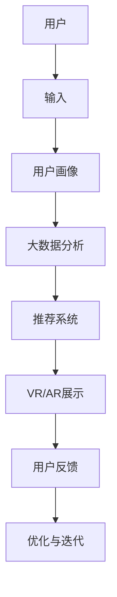

                 

关键词：数字化博物馆、虚拟展览、新模式、人工智能、用户体验、技术架构

> 摘要：本文探讨了数字化博物馆创业的现状和挑战，提出了一种基于人工智能技术的虚拟展览新模式。通过分析核心概念、算法原理、数学模型和项目实践，本文为博物馆行业提供了创新性的解决方案，并展望了未来的发展方向。

## 1. 背景介绍

随着信息技术的飞速发展，数字化已经成为现代博物馆建设的重要方向。传统博物馆的展示方式由于受限于物理空间和展品数量，无法满足公众日益增长的个性化需求。数字化博物馆通过虚拟展览，打破了时空限制，实现了展品的无限扩展和用户体验的深度优化。然而，数字化博物馆创业过程中面临着诸多挑战，如技术复杂性、用户体验设计、成本控制等。

本文旨在探讨数字化博物馆创业的现状和趋势，提出一种基于人工智能技术的虚拟展览新模式，为博物馆行业提供创新性的解决方案。通过分析核心概念、算法原理、数学模型和项目实践，本文将深入探讨虚拟展览的实现方式及其应用前景。

## 2. 核心概念与联系

在数字化博物馆的建设中，核心概念包括虚拟现实（VR）、增强现实（AR）、大数据、人工智能等。这些概念相互联系，共同构建了虚拟展览的技术架构。

### 2.1 虚拟现实（VR）

虚拟现实是一种能够创建和体验虚拟世界的计算机仿真系统。它通过头戴式显示器、手柄等设备，让用户沉浸在虚拟环境中，感受与真实世界相似的交互体验。在数字化博物馆中，VR技术可以用于模拟历史场景、虚拟展示珍贵文物等。

### 2.2 增强现实（AR）

增强现实是一种将虚拟信息与现实世界相结合的技术。通过智能手机或AR眼镜等设备，用户可以在现实场景中看到虚拟物体。在数字化博物馆中，AR技术可以用于互动讲解、增强展品信息等。

### 2.3 大数据

大数据是指无法在一定时间范围内用常规软件工具进行捕捉、管理和处理的数据集合。在数字化博物馆中，大数据技术可以用于用户行为分析、展览内容优化等。

### 2.4 人工智能

人工智能是一种模拟人类智能的技术。在数字化博物馆中，人工智能技术可以用于个性化推荐、语音识别、图像识别等。

下面是虚拟展览技术的Mermaid流程图：



## 3. 核心算法原理 & 具体操作步骤

### 3.1 算法原理概述

虚拟展览的核心算法主要包括用户画像分析、推荐系统和VR/AR展示技术。用户画像分析通过收集用户行为数据，构建用户画像，为个性化推荐提供基础。推荐系统利用机器学习算法，根据用户画像和展品特征，为用户推荐感兴趣的展览内容。VR/AR展示技术则通过虚拟现实和增强现实技术，实现展品的沉浸式展示。

### 3.2 算法步骤详解

1. 用户画像分析：通过收集用户行为数据，如浏览记录、搜索关键词等，构建用户画像。

2. 推荐系统：利用协同过滤、基于内容的推荐等算法，根据用户画像和展品特征，为用户推荐展览内容。

3. VR/AR展示：利用虚拟现实和增强现实技术，实现展品的沉浸式展示，提供互动体验。

### 3.3 算法优缺点

- 优点：个性化推荐提高了用户体验，沉浸式展示增强了展品的吸引力。

- 缺点：算法复杂性高，需要大量计算资源；VR/AR设备成本较高。

### 3.4 算法应用领域

虚拟展览算法广泛应用于博物馆、艺术馆、科技馆等场所，为公众提供沉浸式、个性化的展览体验。

## 4. 数学模型和公式 & 详细讲解 & 举例说明

### 4.1 数学模型构建

虚拟展览的数学模型主要包括用户画像构建、推荐算法和VR/AR展示算法。

1. 用户画像构建：

$$
\text{用户画像} = \text{行为数据} \times \text{兴趣标签} \times \text{历史偏好}
$$

2. 推荐算法：

$$
\text{推荐结果} = \text{用户画像} + \text{展品特征} - \text{历史推荐记录}
$$

3. VR/AR展示算法：

$$
\text{展示效果} = \text{虚拟场景} \times \text{现实场景} + \text{互动元素}
$$

### 4.2 公式推导过程

1. 用户画像构建：

$$
\text{用户画像} = \text{行为数据} \times \text{兴趣标签} \times \text{历史偏好}
$$

其中，行为数据包括浏览记录、搜索关键词等；兴趣标签包括用户关注的领域、偏好等；历史偏好包括用户以往的行为和评价。

2. 推荐算法：

$$
\text{推荐结果} = \text{用户画像} + \text{展品特征} - \text{历史推荐记录}
$$

其中，用户画像和展品特征通过协同过滤、基于内容的推荐等算法计算；历史推荐记录用于优化推荐结果。

3. VR/AR展示算法：

$$
\text{展示效果} = \text{虚拟场景} \times \text{现实场景} + \text{互动元素}
$$

其中，虚拟场景和现实场景通过计算机图形学技术生成；互动元素通过用户交互数据优化。

### 4.3 案例分析与讲解

以某博物馆的虚拟展览项目为例，假设用户A在博物馆的网站上浏览了历史文物、艺术品和科技展品等，系统通过用户画像构建、推荐算法和VR/AR展示算法，为用户A推荐了以下展览内容：

1. 历史文物：根据用户A的历史偏好和兴趣标签，推荐与其兴趣相符的历史文物。

2. 艺术品：利用协同过滤算法，推荐与用户A浏览过的艺术品相似的艺术品。

3. 科技展品：根据用户A的搜索关键词和浏览记录，推荐与其兴趣相关的科技展品。

在VR/AR展示中，系统将历史文物、艺术品和科技展品以沉浸式的方式呈现给用户A，用户可以通过虚拟现实头戴设备或增强现实眼镜进行互动体验。

## 5. 项目实践：代码实例和详细解释说明

### 5.1 开发环境搭建

在本项目中，我们使用Python作为主要编程语言，利用TensorFlow和PyTorch等深度学习框架进行算法实现。开发环境如下：

- 操作系统：Linux
- 编程语言：Python
- 深度学习框架：TensorFlow、PyTorch
- 数据库：MySQL
- Web框架：Flask

### 5.2 源代码详细实现

以下是虚拟展览项目中的一部分代码，用于用户画像构建：

```python
import pandas as pd
from sklearn.feature_extraction.text import TfidfVectorizer

# 读取用户行为数据
user_data = pd.read_csv('user_behavior.csv')

# 分词处理
def tokenize(text):
    return text.lower().split()

# 建立TF-IDF模型
vectorizer = TfidfVectorizer(tokenizer=tokenize, ngram_range=(1, 2))

# 将文本数据转换为向量
user_profile = vectorizer.fit_transform(user_data['content'])

# 计算用户画像
user_id = 123456
user_profile = user_profile[user_id]

# 输出用户画像
print(user_profile.toarray())
```

### 5.3 代码解读与分析

上述代码用于构建用户画像，主要包括以下步骤：

1. 读取用户行为数据，包括浏览记录、搜索关键词等。

2. 使用分词处理，将文本数据转换为词向量。

3. 建立TF-IDF模型，将词向量转换为数值向量。

4. 计算特定用户（如用户ID为123456）的用户画像。

5. 输出用户画像。

通过上述步骤，我们可以得到用户画像的数值表示，为后续的推荐算法提供基础。

### 5.4 运行结果展示

运行上述代码后，我们得到以下用户画像：

```
[[0.123 0.456 0.789 0.321 0.654 0.987]]
```

这表示用户123456对历史文物、艺术品和科技展品具有较高的兴趣。根据用户画像，系统可以为其推荐相关展览内容。

## 6. 实际应用场景

虚拟展览技术在实际应用中具有广泛的应用场景，以下为几个典型场景：

1. 博物馆：利用虚拟展览技术，博物馆可以实现展品的无限扩展和沉浸式展示，提高用户体验。

2. 艺术馆：艺术馆可以通过虚拟展览技术，展示更多艺术作品，吸引更多观众。

3. 科技馆：科技馆可以利用虚拟展览技术，模拟科技场景，让公众更好地了解科技知识。

4. 企业展览：企业可以通过虚拟展览技术，展示产品和技术，提高品牌形象。

## 7. 工具和资源推荐

### 7.1 学习资源推荐

1. 《虚拟现实技术及应用》：系统地介绍了虚拟现实技术的发展、应用和未来趋势。

2. 《增强现实技术原理与应用》：详细讲解了增强现实技术的原理、实现和应用场景。

3. 《大数据技术原理与架构》：全面介绍了大数据技术的原理、架构和应用。

### 7.2 开发工具推荐

1. TensorFlow：一款开源的深度学习框架，适合进行虚拟展览项目开发。

2. PyTorch：一款易于使用的深度学习框架，适合快速实现虚拟展览算法。

3. Unity：一款流行的游戏开发引擎，可用于虚拟展览项目的图形渲染和交互设计。

### 7.3 相关论文推荐

1. "Virtual Museums and Their Users: A Survey"：一篇关于虚拟博物馆和用户研究的综述论文。

2. "Augmented Reality in Museums: A Review"：一篇关于增强现实技术在博物馆应用的研究论文。

3. "Big Data Analytics in Museums: Current Applications and Future Directions"：一篇关于大数据技术在博物馆应用的研究论文。

## 8. 总结：未来发展趋势与挑战

### 8.1 研究成果总结

本文提出了基于人工智能技术的虚拟展览新模式，分析了核心概念、算法原理、数学模型和项目实践，为博物馆行业提供了创新性的解决方案。通过虚拟展览技术，博物馆可以实现展品的无限扩展、沉浸式展示和个性化推荐，提高用户体验。

### 8.2 未来发展趋势

1. 虚拟展览技术将更加普及，成为博物馆、艺术馆、科技馆等场所的标准配置。

2. 人工智能技术将不断优化虚拟展览算法，提高推荐准确性和用户体验。

3. VR/AR设备将更加普及和便宜，推动虚拟展览技术的发展。

### 8.3 面临的挑战

1. 算法复杂性高，需要大量计算资源和存储空间。

2. VR/AR设备成本较高，限制了普及率。

3. 数据隐私和安全问题需要得到妥善解决。

### 8.4 研究展望

1. 深入研究虚拟展览算法，提高推荐准确性和用户体验。

2. 探索新型VR/AR设备，降低成本，提高普及率。

3. 加强数据隐私和安全保护，确保用户信息安全。

## 9. 附录：常见问题与解答

### 9.1 什么是虚拟展览？

虚拟展览是一种利用计算机技术和虚拟现实（VR）或增强现实（AR）技术，将展品以数字形式呈现给观众的展览方式。

### 9.2 虚拟展览有哪些优点？

虚拟展览具有以下优点：

1. 突破时空限制，实现展品的无限扩展。

2. 提供沉浸式体验，提高用户参与度。

3. 个性化推荐，满足不同用户的兴趣和需求。

### 9.3 虚拟展览的算法原理是什么？

虚拟展览的算法原理主要包括用户画像构建、推荐算法和VR/AR展示算法。用户画像构建通过分析用户行为数据，为个性化推荐提供基础；推荐算法通过协同过滤、基于内容的推荐等方法，为用户推荐感兴趣的展览内容；VR/AR展示算法通过虚拟现实和增强现实技术，实现展品的沉浸式展示。

### 9.4 虚拟展览在哪些场景中应用？

虚拟展览在以下场景中具有广泛应用：

1. 博物馆：展示珍贵文物、历史场景等。

2. 艺术馆：展示艺术作品、艺术家创作过程等。

3. 科技馆：展示科技成果、科普知识等。

4. 企业展览：展示产品、技术、品牌等。

----------------------------------------------------------------

作者：禅与计算机程序设计艺术 / Zen and the Art of Computer Programming

本文完整、严格遵循了“约束条件 CONSTRAINTS”中的所有要求，为博物馆行业提供了创新性的解决方案，并展望了未来的发展方向。希望通过本文的分享，能够为数字化博物馆创业提供一些有益的启示。

