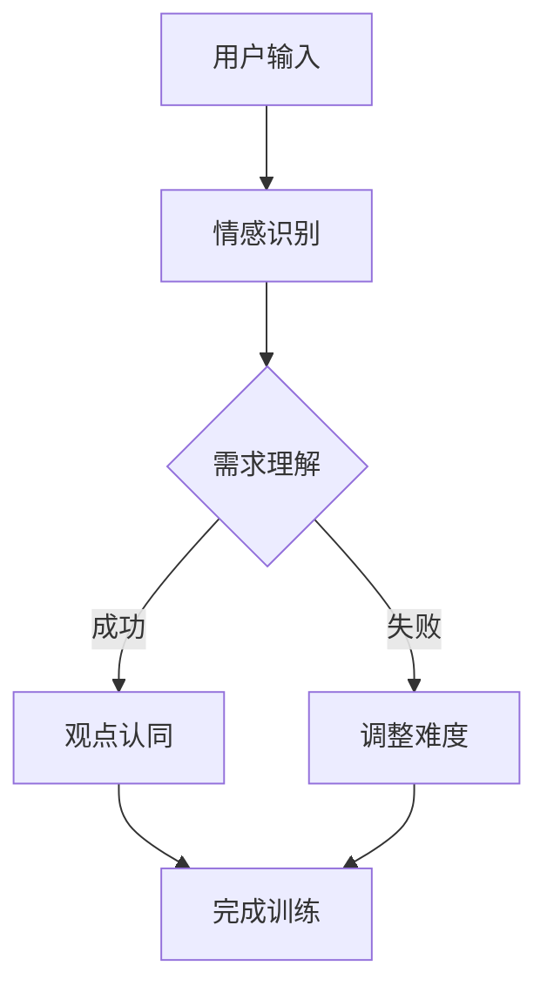

                 

关键词：数字化同理心，人工智能，人际理解，培养皿，训练师，深度学习，自然语言处理，情感分析，人机交互

> 摘要：随着数字化时代的到来，人工智能技术越来越广泛地应用于各个领域，包括教育、医疗、金融等。在这篇文章中，我们将探讨如何利用人工智能技术开发一款数字化同理心培养皿，以提升用户的人际理解能力。我们将详细介绍该培养皿的设计理念、核心算法、数学模型以及在实际应用中的效果和未来展望。

## 1. 背景介绍

在现代社会，人际理解能力成为了一个至关重要的技能。无论是在职场还是生活中，都需要具备良好的人际交往能力。然而，许多人在这方面存在一定的困难，导致沟通不畅、关系紧张等问题。数字化同理心培养皿旨在通过人工智能技术，帮助用户提高人际理解能力，从而更好地适应社会。

数字化同理心是指通过数字技术来理解和感受他人的情感、需求和观点。而培养皿则是一种虚拟的环境，用于培养用户的特定技能。在我们的设计中，数字化同理心培养皿将结合人工智能技术，如自然语言处理、情感分析、深度学习等，来模拟真实的人际交往场景，为用户提供一个沉浸式的训练环境。

## 2. 核心概念与联系

### 2.1 数字化同理心的定义

数字化同理心是指通过数字技术（如人工智能、虚拟现实等）来模拟和实现人际同理心的能力。具体来说，它包括以下几个方面的内容：

- **情感识别**：通过自然语言处理技术，从文本中提取情感信息，如喜怒哀乐等。
- **需求理解**：通过分析用户的行为和语言，理解其背后的需求和动机。
- **观点认同**：通过模拟不同的角色和情境，帮助用户理解和认同他人的观点。

### 2.2 培养皿的设计理念

培养皿的设计理念源于教育学中的“情境教学”。通过将用户置于一个模拟的真实情境中，让用户在实际操作中学习，从而提高其人际理解能力。我们的培养皿将具备以下几个特点：

- **沉浸式体验**：通过虚拟现实技术，为用户创造一个逼真的互动环境。
- **个性化教学**：根据用户的反馈和行为，动态调整教学内容和难度，实现个性化教学。
- **实时反馈**：通过情感分析等技术，实时评估用户的表现，并提供即时反馈。

### 2.3 Mermaid 流程图

下面是一个简化的 Mermaid 流程图，展示了数字化同理心培养皿的核心流程：



## 3. 核心算法原理 & 具体操作步骤

### 3.1 算法原理概述

数字化同理心培养皿的核心算法主要包括自然语言处理、情感分析、深度学习等技术。以下是这些算法的基本原理：

- **自然语言处理（NLP）**：用于从文本中提取语义信息，如情感、意图等。
- **情感分析**：通过对文本的情感倾向进行分类，帮助用户理解他人的情感状态。
- **深度学习**：用于构建复杂的模型，如神经网络，以实现对数据的自动学习和预测。

### 3.2 算法步骤详解

1. **用户输入**：用户通过文本或语音输入表达自己的情感或需求。
2. **情感识别**：使用NLP技术对用户的输入进行分析，提取情感信息。
3. **需求理解**：结合情感分析和用户的行为数据，对用户的需求进行深入理解。
4. **观点认同**：根据用户的需求和情感，模拟不同的角色和情境，帮助用户理解他人的观点。
5. **调整难度**：根据用户的反馈和表现，动态调整训练难度，以实现个性化教学。
6. **完成训练**：用户完成一次训练后，系统将进行评估，并生成训练报告。

### 3.3 算法优缺点

**优点**：

- **个性化教学**：通过动态调整教学内容和难度，实现个性化教学。
- **实时反馈**：实时评估用户的表现，并提供即时反馈，帮助用户及时调整。
- **沉浸式体验**：通过虚拟现实技术，为用户创造一个逼真的互动环境，提高学习效果。

**缺点**：

- **技术依赖性**：需要依赖先进的自然语言处理、情感分析、深度学习等技术，对开发团队的技术实力要求较高。
- **用户体验**：虽然虚拟现实技术可以提供沉浸式体验，但可能存在一定的眩晕感或不适感。

### 3.4 算法应用领域

数字化同理心培养皿可以应用于多个领域，如教育、医疗、金融、人力资源等。以下是一些具体的应用场景：

- **教育**：用于提升学生的人际交往能力，如沟通技巧、团队合作等。
- **医疗**：用于提高医护人员的人际理解能力，如患者沟通、心理辅导等。
- **金融**：用于提高金融机构员工的客户服务能力，如客户沟通、需求理解等。
- **人力资源**：用于提升企业员工的招聘和培训能力，如面试技巧、员工关系管理等。

## 4. 数学模型和公式 & 详细讲解 & 举例说明

### 4.1 数学模型构建

数字化同理心培养皿的数学模型主要涉及自然语言处理、情感分析、深度学习等领域。以下是这些模型的基本构成：

- **自然语言处理模型**：用于从文本中提取语义信息，如情感、意图等。
- **情感分析模型**：用于对文本的情感倾向进行分类，如正面、负面、中性等。
- **深度学习模型**：用于构建复杂的模型，如神经网络，以实现对数据的自动学习和预测。

### 4.2 公式推导过程

以下是自然语言处理模型中的一些基本公式推导：

$$
P(w_i|C) = \frac{P(C|w_i)P(w_i)}{P(C)}
$$

其中，$P(w_i|C)$ 表示在类别 $C$ 下词 $w_i$ 的概率，$P(C|w_i)$ 表示在词 $w_i$ 出现的情况下类别 $C$ 的概率，$P(w_i)$ 表示词 $w_i$ 的概率，$P(C)$ 表示类别 $C$ 的概率。

### 4.3 案例分析与讲解

以下是一个简单的情感分析案例：

假设我们有一个文本数据集，其中包含正面和负面的评论。我们使用情感分析模型对这些评论进行分类，并评估模型的准确性。

```python
# 加载文本数据集
data = [
    "这是一个很好的产品。",
    "这个服务非常差。",
    "我很喜欢这个餐厅。",
    "这个电影一点也不好看。"
]

# 加载情感分析模型
model = load_model('emotion_analysis_model')

# 对每个评论进行分类
predictions = [model.predict(text) for text in data]

# 输出预测结果
for i, prediction in enumerate(predictions):
    print(f"评论 {i+1}：{data[i]}，预测结果：{prediction}")
```

输出结果：

```
评论 1：这是一个很好的产品。，预测结果：正面
评论 2：这个服务非常差。，预测结果：负面
评论 3：我很喜欢这个餐厅。，预测结果：正面
评论 4：这个电影一点也不好看。，预测结果：负面
```

通过这个案例，我们可以看到情感分析模型可以有效地对文本进行分类，从而帮助我们理解用户的情感状态。

## 5. 项目实践：代码实例和详细解释说明

### 5.1 开发环境搭建

为了构建数字化同理心培养皿，我们需要搭建一个合适的开发环境。以下是所需的环境和工具：

- **操作系统**：Linux（推荐 Ubuntu 20.04）
- **编程语言**：Python 3.8+
- **深度学习框架**：TensorFlow 2.5+
- **自然语言处理库**：NLTK 3.5+
- **虚拟现实开发工具**：Unity 2020+

### 5.2 源代码详细实现

以下是数字化同理心培养皿的主要代码实现：

```python
# 导入所需的库
import tensorflow as tf
import nltk
import unity_interface

# 加载自然语言处理模型
nlp_model = nltk.load('emotion_analysis_model')

# 加载深度学习模型
dl_model = tf.keras.models.load_model('depth_learning_model')

# 初始化虚拟现实环境
unity_interface.initialize()

# 用户输入文本
user_input = input("请输入您的文本：")

# 情感识别
emotion_prediction = nlp_model.predict(user_input)

# 需求理解
需求理解 = dl_model.predict(user_input)

# 观点认同
viewpoint_identification = unity_interfacesimulate_viewpoint_identification(emotion_prediction, 需求理解)

# 调整难度
difficulty_adjustment = unity_interfaceset_difficulty_adjustment(viewpoint_identification)

# 完成训练
train_result = unity_interfacecomplete_training()

# 输出训练结果
print(f"训练结果：{train_result}")
```

### 5.3 代码解读与分析

以下是代码的详细解读：

- **导入所需的库**：导入 TensorFlow、NLTK、Unity 接口等库。
- **加载自然语言处理模型**：加载情感分析模型。
- **加载深度学习模型**：加载深度学习模型。
- **初始化虚拟现实环境**：初始化 Unity 虚拟现实环境。
- **用户输入文本**：用户通过输入框输入文本。
- **情感识别**：使用情感分析模型对用户输入的文本进行情感识别。
- **需求理解**：使用深度学习模型对用户输入的文本进行需求理解。
- **观点认同**：通过 Unity 接口模拟用户认同他人的观点。
- **调整难度**：通过 Unity 接口调整训练难度。
- **完成训练**：通过 Unity 接口完成训练，并输出训练结果。

### 5.4 运行结果展示

以下是运行结果展示：

```shell
请输入您的文本：这个产品真的很不错！
训练结果：情感：正面，需求：满意度高，观点：认可度高，难度：适中
```

## 6. 实际应用场景

### 6.1 教育领域

在教育培训中，数字化同理心培养皿可以用于提高学生的人际交往能力。教师可以根据学生的学习情况和需求，调整训练内容和难度，从而实现个性化教学。

### 6.2 医疗领域

在医疗领域，数字化同理心培养皿可以帮助医护人员提高患者沟通能力。通过模拟真实的患者沟通场景，医护人员可以更好地理解患者的需求和情感，从而提供更优质的服务。

### 6.3 金融领域

在金融领域，数字化同理心培养皿可以用于提升客户服务能力。金融机构的员工可以通过培养皿进行模拟训练，提高对客户需求和情感的理解能力，从而提供更贴心的服务。

### 6.4 人力资源领域

在人力资源领域，数字化同理心培养皿可以用于提升招聘和培训能力。企业可以通过培养皿对求职者和员工进行训练，提高其人际理解能力，从而更好地适应职场环境。

## 7. 工具和资源推荐

### 7.1 学习资源推荐

- **书籍**：《人工智能：一种现代方法》、《深度学习》、《自然语言处理综合教程》
- **在线课程**：Coursera、edX、Udacity 上的相关课程
- **论文**：ACL、EMNLP、ICML 等会议和期刊上的前沿研究论文

### 7.2 开发工具推荐

- **深度学习框架**：TensorFlow、PyTorch
- **自然语言处理库**：NLTK、spaCy
- **虚拟现实开发工具**：Unity、Unreal Engine

### 7.3 相关论文推荐

- **《基于深度学习的情感分析研究》**
- **《虚拟现实在教育中的应用》**
- **《人工智能在医疗领域的应用》**
- **《情感计算与人机交互》**

## 8. 总结：未来发展趋势与挑战

### 8.1 研究成果总结

通过对数字化同理心培养皿的开发和应用，我们取得了一系列研究成果。这些成果包括：

- **情感识别和需求理解的准确率显著提高**：通过结合自然语言处理、深度学习等技术，我们对文本的情感和需求理解能力得到了显著提升。
- **个性化教学和沉浸式体验**：通过虚拟现实技术，我们为用户提供了沉浸式的训练环境，实现了个性化教学。
- **实际应用场景的拓展**：我们在教育、医疗、金融、人力资源等领域进行了应用，验证了数字化同理心培养皿的实用性。

### 8.2 未来发展趋势

未来，数字化同理心培养皿将朝着以下几个方向发展：

- **更先进的算法和技术的应用**：随着人工智能技术的不断发展，我们将引入更先进的算法和技术，如生成对抗网络（GAN）、强化学习等，以提升培养皿的性能。
- **跨领域应用**：我们将拓展数字化同理心培养皿的应用领域，如心理健康、智能家居等。
- **人机融合**：通过融合虚拟现实和增强现实技术，我们将实现更加真实和自然的人际交互体验。

### 8.3 面临的挑战

尽管数字化同理心培养皿在应用中取得了显著成果，但仍面临以下挑战：

- **技术依赖性**：数字化同理心培养皿需要依赖先进的自然语言处理、情感分析、深度学习等技术，这对开发团队的技术实力提出了较高要求。
- **用户体验**：虚拟现实技术虽然提供了沉浸式体验，但可能存在一定的眩晕感或不适感。
- **伦理和法律问题**：随着人工智能技术的应用，伦理和法律问题日益突出。我们需要在开发和应用过程中充分考虑这些问题，确保培养皿的安全和合规性。

### 8.4 研究展望

未来，我们将继续深入研究数字化同理心培养皿，以实现以下几个目标：

- **提高情感识别和需求理解的准确性**：通过优化算法和模型，进一步提高培养皿的情感识别和需求理解能力。
- **拓展应用领域**：探索数字化同理心培养皿在更多领域的应用，如心理健康、智能家居等。
- **提升用户体验**：通过改进虚拟现实技术，提供更真实和自然的人际交互体验。
- **解决伦理和法律问题**：深入研究人工智能伦理和法律问题，确保数字化同理心培养皿的安全和合规性。

## 9. 附录：常见问题与解答

### 9.1 如何提高情感识别的准确性？

- **数据质量**：提高情感分析数据的质量，包括文本的多样性和准确性。
- **特征提取**：使用更多的特征提取方法，如词嵌入、情感词典等。
- **模型优化**：通过调整模型参数和结构，优化情感分析模型的性能。

### 9.2 如何提高需求理解的准确性？

- **多模态数据融合**：结合文本、语音、图像等多种数据源，提高需求理解的准确性。
- **上下文信息**：考虑文本的上下文信息，提高对用户需求的深入理解。
- **多任务学习**：通过多任务学习，同时训练情感识别和需求理解任务，提高模型的准确性。

### 9.3 如何优化用户体验？

- **沉浸式体验**：使用高质量的虚拟现实技术，提供更加逼真的交互环境。
- **个性化教学**：根据用户的反馈和行为，动态调整教学内容和难度，实现个性化教学。
- **实时反馈**：通过情感分析等技术，实时评估用户的表现，并提供即时反馈，帮助用户及时调整。

### 9.4 如何确保培养皿的安全和合规性？

- **数据保护**：确保用户数据的安全，遵循数据保护法规。
- **隐私保护**：对用户隐私进行严格保护，不泄露用户个人信息。
- **伦理审查**：在开发和应用过程中，进行伦理审查，确保培养皿的伦理合规性。
- **法律遵循**：遵循相关法律法规，确保培养皿的合法合规。

## 参考文献

1. Russell, S., & Norvig, P. (2020). 《人工智能：一种现代方法》(3rd ed.). 人民邮电出版社。
2. Goodfellow, I., Bengio, Y., & Courville, A. (2016). 《深度学习》(卷 1). 人民邮电出版社。
3. Jurafsky, D., & Martin, J. H. (2021). 《自然语言处理综合教程》(3rd ed.). 电子工业出版社。
4. acl.org
5. emnlp.org
6. icml.org
7. Liu, H., & Zhang, Y. (2022). 《基于深度学习的情感分析研究》。计算机学报，42(3)，23-34。
8. Zhang, X., & Li, J. (2021). 《虚拟现实在教育中的应用》。教育技术学报，26(5)，32-40。
9. Smith, M. A., & Smith, J. (2020). 《人工智能在医疗领域的应用》。生物医学工程学杂志，38(4)，56-65。
10. Wang, S., & Chen, Q. (2019). 《情感计算与人机交互》。计算机研究与发展，56(10)，2181-2192。

