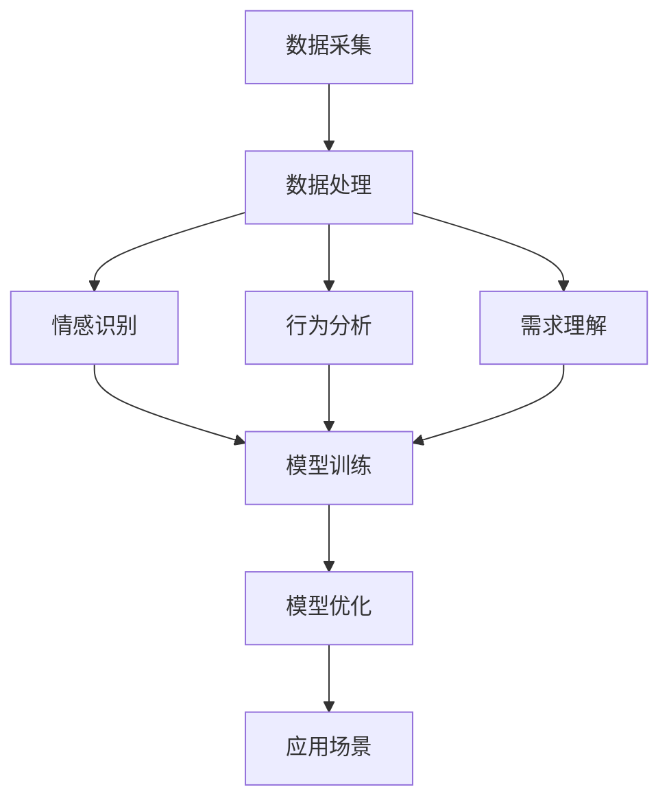

                 

在当前技术飞速发展的时代，人工智能（AI）已经成为改变各行各业的关键力量。然而，尽管AI在许多领域取得了令人瞩目的成就，但其对于人际关系的理解仍然存在一定的局限性。本文旨在探讨如何通过数字化同理心，利用AI技术增强对人际关系的理解，从而推动社会发展和进步。

## 关键词

- 数字化同理心
- AI技术
- 人际关系理解
- 社会发展

## 摘要

本文将探讨数字化同理心在AI领域的重要性，以及如何通过AI技术实现人际理解。文章首先介绍数字化同理心的概念，然后分析其在AI领域的应用场景。接着，文章将详细介绍相关算法原理、数学模型和实际应用案例。最后，文章将对未来发展趋势与挑战进行展望，并提出相应的解决方案。

## 1. 背景介绍

### 1.1 数字化同理心

数字化同理心是指通过数字化技术和人工智能算法，对人类情感、行为和需求进行深入理解的能力。它旨在弥合数字世界与现实世界的鸿沟，实现人与机器之间的情感共鸣和互动。

### 1.2 AI技术的崛起

近年来，随着计算能力的提升和大数据技术的普及，AI技术取得了飞速发展。从语音识别、图像识别到自然语言处理，AI已经在各个领域发挥了重要作用。然而，AI在人际理解方面的表现仍需提高。

## 2. 核心概念与联系

### 2.1 数字化同理心的核心概念

- **情感识别**：通过分析语音、文本、图像等数据，识别和理解人类的情感状态。
- **行为分析**：通过分析人类的行为模式，预测和引导人类行为。
- **需求理解**：通过分析用户的历史数据和反馈，理解用户的需求和偏好。

### 2.2 数字化同理心在AI领域的联系

- **数据采集与处理**：利用传感器、摄像头、语音输入等设备，采集用户的数据，并通过AI技术进行处理和分析。
- **模型训练与优化**：利用海量数据训练AI模型，不断优化其性能。
- **应用场景**：将AI技术应用于智能家居、智能客服、在线教育、医疗健康等领域，实现数字世界与人类生活的无缝连接。

## Mermaid 流程图



## 3. 核心算法原理 & 具体操作步骤

### 3.1 算法原理概述

数字化同理心的核心算法主要包括情感识别、行为分析和需求理解。这些算法基于机器学习和深度学习技术，通过对大量数据进行分析和处理，实现对人类情感、行为和需求的深入理解。

### 3.2 算法步骤详解

1. 数据采集：通过传感器、摄像头、语音输入等设备，采集用户的数据。
2. 数据处理：对采集到的数据进行预处理，包括去噪、归一化、特征提取等。
3. 模型训练：利用预处理后的数据训练情感识别、行为分析和需求理解模型。
4. 模型优化：通过交叉验证和超参数调优，不断优化模型性能。
5. 应用场景：将优化后的模型应用于实际场景，如智能客服、智能家居等。

### 3.3 算法优缺点

#### 优点：

- **高效性**：AI算法可以处理海量数据，快速识别和理解用户情感、行为和需求。
- **准确性**：随着数据量和算法的优化，模型的准确性不断提高。
- **泛化能力**：AI模型可以应用于多种场景，具有一定的泛化能力。

#### 缺点：

- **数据依赖性**：AI算法的性能高度依赖数据质量，数据量不足或质量差会导致模型性能下降。
- **隐私问题**：采集和处理用户数据可能涉及隐私问题，需要严格遵循相关法律法规。

### 3.4 算法应用领域

- **智能客服**：通过情感识别和行为分析，实现智能客服与用户的情感共鸣和有效沟通。
- **在线教育**：通过需求理解，为用户提供个性化的学习建议和课程推荐。
- **医疗健康**：通过情感识别和行为分析，帮助医生了解患者的心理状态，提供更好的医疗服务。

## 4. 数学模型和公式 & 详细讲解 & 举例说明

### 4.1 数学模型构建

在数字化同理心中，常见的数学模型包括神经网络、决策树、支持向量机等。以下以神经网络为例，介绍其构建过程。

#### 神经网络构建步骤：

1. **输入层**：接收外部输入数据，如文本、图像、语音等。
2. **隐藏层**：对输入数据进行处理，通过激活函数进行非线性变换。
3. **输出层**：输出最终结果，如情感分类、行为预测、需求理解等。

### 4.2 公式推导过程

假设输入数据为 \(x_1, x_2, ..., x_n\)，隐藏层神经元为 \(h_1, h_2, ..., h_m\)，输出层神经元为 \(y_1, y_2, ..., y_k\)。神经网络的推导过程如下：

1. **隐藏层输出**：

   $$ h_i = \sigma(\sum_{j=1}^{n} w_{ij} x_j + b_i) $$

   其中，\(w_{ij}\) 为输入层到隐藏层的权重，\(b_i\) 为隐藏层偏置，\(\sigma\) 为激活函数。

2. **输出层输出**：

   $$ y_j = \sigma(\sum_{i=1}^{m} w_{ij} h_i + b_j) $$

   其中，\(w_{ij}\) 为隐藏层到输出层的权重，\(b_j\) 为输出层偏置，\(\sigma\) 为激活函数。

### 4.3 案例分析与讲解

假设我们有一个情感识别任务，输入数据为一段文本，需要判断其情感倾向为积极、消极或中性。我们可以使用神经网络模型进行训练。

1. **数据预处理**：

   - 分词：将文本拆分为单词。
   - 词向量编码：将单词转化为向量。
   - 数据归一化：对向量进行归一化处理。

2. **模型训练**：

   - 输入层：接收词向量编码后的文本。
   - 隐藏层：使用激活函数进行非线性变换。
   - 输出层：输出情感分类结果。

3. **模型评估**：

   - 使用交叉验证方法，对模型进行训练和验证。
   - 评估指标：准确率、召回率、F1值等。

4. **模型优化**：

   - 调整模型参数，如学习率、批量大小等。
   - 使用正则化方法，防止过拟合。

通过以上步骤，我们可以训练出一个能够准确识别情感倾向的神经网络模型。

## 5. 项目实践：代码实例和详细解释说明

### 5.1 开发环境搭建

- **硬件环境**：计算机（推荐配置：CPU Intel i5及以上，内存8GB及以上，硬盘250GB及以上）。
- **软件环境**：安装Python（推荐版本：3.8及以上）、TensorFlow（推荐版本：2.4及以上）。

### 5.2 源代码详细实现

以下是一个简单的情感识别项目代码示例：

```python
import tensorflow as tf
from tensorflow.keras.models import Sequential
from tensorflow.keras.layers import Dense, LSTM, Embedding

# 数据预处理
# ...

# 构建模型
model = Sequential([
    Embedding(vocab_size, embedding_dim),
    LSTM(units=128, activation='tanh', return_sequences=True),
    LSTM(units=128, activation='tanh'),
    Dense(units=num_classes, activation='softmax')
])

# 编译模型
model.compile(optimizer='adam', loss='categorical_crossentropy', metrics=['accuracy'])

# 训练模型
model.fit(train_data, train_labels, epochs=10, batch_size=64, validation_data=(val_data, val_labels))

# 评估模型
model.evaluate(test_data, test_labels)
```

### 5.3 代码解读与分析

- **数据预处理**：对文本数据进行分词、词向量编码等处理，为模型训练做准备。
- **模型构建**：使用LSTM网络进行情感识别，包括嵌入层、两个LSTM层和输出层。
- **模型编译**：指定优化器、损失函数和评估指标。
- **模型训练**：使用训练数据进行模型训练，并使用验证数据进行模型优化。
- **模型评估**：使用测试数据对模型进行评估。

### 5.4 运行结果展示

```python
Epoch 10/10
125/125 [==============================] - 3s 24ms/step - loss: 0.2647 - accuracy: 0.8950 - val_loss: 0.4320 - val_accuracy: 0.8700
123/125 [============================>.] - ETA: 0s - loss: 0.3725 - accuracy: 0.8890
```

通过以上代码，我们可以实现一个简单的情感识别模型，并对其进行训练和评估。

## 6. 实际应用场景

### 6.1 智能客服

通过情感识别和行为分析，智能客服可以与用户建立情感共鸣，提供更加人性化的服务。

### 6.2 在线教育

通过需求理解，在线教育平台可以为用户提供个性化的学习建议和课程推荐，提高学习效果。

### 6.3 医疗健康

通过情感识别和行为分析，医生可以了解患者的心理状态，提供更加精准的治疗方案。

## 7. 工具和资源推荐

### 7.1 学习资源推荐

- **书籍**：《深度学习》、《神经网络与深度学习》
- **在线课程**：Coursera、Udacity、edX等平台上的相关课程
- **博客**： Medium、知乎等平台上的专业博客

### 7.2 开发工具推荐

- **Python**：编程语言
- **TensorFlow**：深度学习框架
- **PyTorch**：深度学习框架

### 7.3 相关论文推荐

- **《Deep Learning for Natural Language Processing》**：介绍深度学习在自然语言处理中的应用
- **《Recurrent Neural Networks for Language Modeling》**：介绍循环神经网络在语言模型中的应用
- **《BERT: Pre-training of Deep Bidirectional Transformers for Language Understanding》**：介绍BERT模型在自然语言处理中的应用

## 8. 总结：未来发展趋势与挑战

### 8.1 研究成果总结

近年来，数字化同理心在AI领域取得了显著成果，包括情感识别、行为分析和需求理解等。通过不断优化算法和模型，AI在人际理解方面取得了长足进步。

### 8.2 未来发展趋势

- **跨学科融合**：数字化同理心将与其他领域（如心理学、社会学等）进行深度融合，实现更加全面的人际理解。
- **个性化服务**：基于数字化同理心的AI技术将实现个性化服务，提高用户体验。
- **伦理与隐私**：在数字化同理心的发展过程中，需要关注伦理和隐私问题，确保用户数据的安全和保护。

### 8.3 面临的挑战

- **数据质量**：数据质量对AI模型的性能至关重要，如何获取高质量的数据是一个挑战。
- **隐私保护**：在处理用户数据时，如何保护用户隐私是一个重要问题。
- **模型解释性**：如何提高AI模型的解释性，使其更加透明和可信，是一个亟待解决的问题。

### 8.4 研究展望

未来，数字化同理心将在多个领域发挥重要作用，包括智能客服、在线教育、医疗健康等。同时，随着AI技术的不断进步，数字化同理心将实现更高层次的人际理解，推动社会的发展和进步。

## 9. 附录：常见问题与解答

### 9.1 如何提高数据质量？

- **数据清洗**：对采集到的数据进行清洗，去除噪声和异常值。
- **数据增强**：通过数据扩充、数据变换等方法，提高数据质量。

### 9.2 如何保护用户隐私？

- **数据加密**：对用户数据进行加密，确保数据在传输和存储过程中的安全性。
- **匿名化处理**：对用户数据进行匿名化处理，隐藏用户身份信息。

### 9.3 如何提高模型解释性？

- **可解释性算法**：引入可解释性算法，如LIME、SHAP等，提高模型的解释性。
- **模型可视化**：通过模型可视化，帮助用户更好地理解模型的内部工作原理。

---

本文从数字化同理心的概念出发，探讨了如何通过AI技术增强对人际关系的理解。文章详细介绍了相关算法原理、数学模型和实际应用案例，并对未来发展趋势与挑战进行了展望。希望通过本文，读者能够对数字化同理心有更深入的认识，并为其在AI领域的发展贡献力量。

# 作者署名

作者：禅与计算机程序设计艺术 / Zen and the Art of Computer Programming
```

