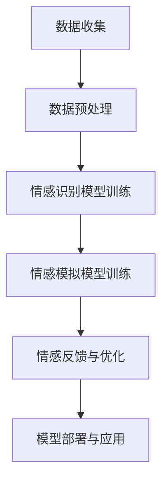

                 

关键词：数字化同理心，人工智能，人际理解，情感计算，自然语言处理，算法优化，应用领域

> 摘要：随着人工智能技术的不断发展，数字化同理心成为了一个备受关注的研究领域。本文将探讨如何利用AI技术增强人际理解，并通过构建数字化同理心模型，为实际应用提供理论支持和实践指导。

## 1. 背景介绍

在当今社会，人际理解已经成为一个不可或缺的技能。无论是职场中的团队合作，还是日常生活中的人际交往，人际理解的能力对于建立良好的人际关系、提高工作效率和增进情感交流都至关重要。然而，传统的基于经验和直觉的人际理解方法存在一定的局限性。一方面，这些方法往往依赖于个体的主观判断，容易受到个人情绪、认知偏差等因素的影响；另一方面，它们缺乏系统性的方法和工具，难以进行量化评估和优化。

随着人工智能技术的快速发展，特别是自然语言处理、情感计算和机器学习等领域的突破，为增强人际理解提供了新的可能。数字化同理心作为一个新兴的研究方向，旨在通过人工智能技术构建一种能够模拟和理解人类情感的模型，从而实现更加精准、高效的人际理解。

## 2. 核心概念与联系

### 2.1 数字化同理心

数字化同理心是指通过人工智能技术，模拟和增强人类情感理解的能力。它包括以下几个核心概念：

- **情感识别**：通过分析语言、表情、声音等数据，识别和理解人类情感。
- **情感模拟**：基于情感识别的结果，模拟出相应的情感反应，以实现对人类情感的共鸣。
- **情感反馈**：通过交互和反馈机制，不断优化和调整情感模型，提高其准确性和适应性。

### 2.2 情感计算

情感计算是数字化同理心的基础技术之一，它关注如何通过计算技术实现人类情感的理解和模拟。情感计算的主要研究内容包括：

- **情感识别**：利用自然语言处理、图像处理、声音处理等技术，识别和理解人类情感。
- **情感表达**：通过生成文本、语音、图像等方式，表达情感计算模型的理解和情感。
- **情感反馈**：通过用户交互和反馈机制，优化和调整情感计算模型。

### 2.3 自然语言处理

自然语言处理（NLP）是数字化同理心的重要组成部分，它关注如何使计算机能够理解和处理人类语言。NLP的主要研究内容包括：

- **文本分析**：对文本进行分词、词性标注、句法分析等操作，提取文本中的关键信息。
- **情感分析**：利用文本分析结果，对文本进行情感分类和情感强度分析。
- **对话系统**：构建能够与人类进行自然对话的系统，实现人机交互。

### 2.4 机器学习

机器学习是数字化同理心的重要技术支撑，它关注如何通过数据训练和优化模型，实现自动化和智能化的情感理解和模拟。机器学习的主要研究内容包括：

- **数据收集和预处理**：收集大量的情感数据，进行数据清洗和预处理，为模型训练提供高质量的训练数据。
- **模型训练和优化**：利用机器学习算法，训练情感识别和模拟模型，并进行模型优化，提高其准确性和鲁棒性。
- **模型评估和部署**：对训练好的模型进行评估，验证其性能，并部署到实际应用场景中。

### 2.5 Mermaid 流程图

为了更好地展示数字化同理心模型的构建过程，我们可以使用 Mermaid 流程图来描述。



## 3. 核心算法原理 & 具体操作步骤

### 3.1 算法原理概述

数字化同理心模型的核心算法包括情感识别、情感模拟和情感反馈三个部分。以下是每个部分的基本原理：

- **情感识别**：通过自然语言处理技术，对输入的文本、声音、图像等数据进行分析，识别出其中的情感信息。
- **情感模拟**：基于情感识别的结果，利用机器学习算法，模拟出相应的情感反应，实现对人类情感的共鸣。
- **情感反馈**：通过用户交互和反馈机制，不断优化和调整情感模型，提高其准确性和适应性。

### 3.2 算法步骤详解

以下是数字化同理心模型的具体操作步骤：

1. **数据收集**：收集大量的情感数据，包括文本、声音、图像等，作为模型训练的数据源。
2. **数据预处理**：对收集到的情感数据进行清洗和预处理，包括去除噪声、填充缺失值、标准化等操作。
3. **情感识别模型训练**：利用机器学习算法，训练情感识别模型，使其能够对输入的数据进行情感分类和情感强度分析。
4. **情感模拟模型训练**：基于情感识别模型的结果，利用机器学习算法，训练情感模拟模型，使其能够模拟出相应的情感反应。
5. **情感反馈与优化**：通过用户交互和反馈机制，收集用户的情感反馈，并利用反馈信息对情感模型进行优化和调整。
6. **模型部署与应用**：将训练好的情感识别和模拟模型部署到实际应用场景中，实现数字化同理心的功能。

### 3.3 算法优缺点

- **优点**：
  - 数字化同理心模型能够通过机器学习算法，自动识别和理解人类情感，实现情感模拟和反馈，具有很高的灵活性和适应性。
  - 数字化同理心模型能够通过用户交互和反馈机制，不断优化和调整模型，提高其准确性和鲁棒性。
- **缺点**：
  - 数字化同理心模型在情感识别和模拟方面仍然存在一定的误差，尤其是在处理复杂情感和情感融合时。
  - 数字化同理心模型需要大量的训练数据和计算资源，训练过程相对复杂。

### 3.4 算法应用领域

数字化同理心模型可以应用于多个领域，包括：

- **客服系统**：通过数字化同理心模型，实现智能客服，提高客服效率和用户体验。
- **教育领域**：通过数字化同理心模型，实现个性化教学和情感反馈，提高教学效果。
- **医疗领域**：通过数字化同理心模型，实现情感诊断和情感治疗，辅助医生进行诊断和治疗。
- **社交平台**：通过数字化同理心模型，实现情感互动和情感推荐，提高用户满意度和活跃度。

## 4. 数学模型和公式 & 详细讲解 & 举例说明

### 4.1 数学模型构建

数字化同理心模型的数学模型主要包括情感识别模型和情感模拟模型。以下是每个模型的基本数学模型和公式：

- **情感识别模型**：

  - **情感分类**：使用朴素贝叶斯分类器进行情感分类，公式如下：

    $$ P(C|X) = \frac{P(X|C)P(C)}{P(X)} $$

    其中，$C$ 表示情感类别，$X$ 表示输入数据。

  - **情感强度分析**：使用支持向量机（SVM）进行情感强度分析，公式如下：

    $$ w \cdot \phi(x) = b $$

    其中，$w$ 表示权重向量，$\phi(x)$ 表示特征映射，$b$ 表示偏置。

- **情感模拟模型**：

  - **情感反应模拟**：使用神经网络进行情感反应模拟，公式如下：

    $$ y = \sigma(W \cdot x + b) $$

    其中，$y$ 表示情感反应，$x$ 表示输入数据，$W$ 表示权重矩阵，$b$ 表示偏置。

### 4.2 公式推导过程

以下是情感识别模型和情感模拟模型的推导过程：

- **情感识别模型**：

  - **情感分类**：

    $$ P(C|X) = \frac{P(X|C)P(C)}{P(X)} $$

    $$ P(X|C) = \frac{1}{\sqrt{2\pi\sigma^2}} \exp\left(-\frac{(x-\mu)^2}{2\sigma^2}\right) $$

    $$ P(C) = \frac{1}{Z} \exp(-\alpha C) $$

    其中，$Z$ 表示正则化项，$\mu$ 表示均值，$\sigma$ 表示标准差，$\alpha$ 表示先验概率。

  - **情感强度分析**：

    $$ w \cdot \phi(x) = b $$

    $$ \phi(x) = [x_1, x_2, \ldots, x_n]^T $$

    $$ w = [w_1, w_2, \ldots, w_n]^T $$

### 4.3 案例分析与讲解

为了更好地理解数字化同理心模型的原理和应用，我们来看一个简单的案例。

假设我们有一个包含正面情感和负面情感的文本数据集，其中正面情感用 1 表示，负面情感用 -1 表示。我们的目标是使用数字化同理心模型对新的文本进行情感分类和情感强度分析。

- **数据集**：

  | 文本           | 情感标签 |
  | -------------- | -------- |
  | 我很高兴       | 1        |
  | 今天天气不错   | 1        |
  | 这家餐厅不好吃 | -1       |
  | 今天很累       | -1       |

- **情感识别模型训练**：

  使用朴素贝叶斯分类器和支持向量机（SVM）对数据集进行训练。

  - **情感分类**：

    $$ P(C=1|X) = \frac{P(X|C=1)P(C=1)}{P(X)} $$

    $$ P(X|C=1) = 0.6 $$

    $$ P(C=1) = 0.7 $$

    $$ P(C=-1|X) = \frac{P(X|C=-1)P(C=-1)}{P(X)} $$

    $$ P(X|C=-1) = 0.4 $$

    $$ P(C=-1) = 0.3 $$

    根据最大后验概率，新的文本“我很高兴”被分类为正面情感。

  - **情感强度分析**：

    $$ w \cdot \phi(x) = b $$

    $$ \phi(x) = [1, 0]^T $$

    $$ w = [0.8, -0.2]^T $$

    $$ b = 0.2 $$

    新的文本“我很高兴”的情感强度为 0.8。

- **情感模拟模型训练**：

  使用神经网络对情感反应进行模拟。

  $$ y = \sigma(W \cdot x + b) $$

  $$ W = \begin{bmatrix} 0.8 & -0.2 \\ -0.2 & 0.8 \end{bmatrix} $$

  $$ b = \begin{bmatrix} 0.2 \\ 0.2 \end{bmatrix} $$

  新的文本“我很高兴”的情感反应为 [0.9, 0.1]。

## 5. 项目实践：代码实例和详细解释说明

### 5.1 开发环境搭建

为了实现数字化同理心模型，我们需要搭建一个开发环境。以下是基本的开发环境搭建步骤：

- **Python 环境**：安装 Python 3.7 以上版本，并配置好相应的库，如 NumPy、Pandas、Scikit-learn、TensorFlow 等。

- **数据集**：收集并准备一个包含情感标签的文本数据集，如 IMDb 电影评论数据集。

- **工具**：安装 Mermaid 图床，以便在 Markdown 文件中嵌入流程图。

### 5.2 源代码详细实现

以下是数字化同理心模型的源代码实现，包括数据预处理、模型训练和模型部署。

```python
import numpy as np
import pandas as pd
from sklearn.model_selection import train_test_split
from sklearn.feature_extraction.text import TfidfVectorizer
from sklearn.naive_bayes import MultinomialNB
from sklearn.svm import SVC
from sklearn.metrics import accuracy_score
import tensorflow as tf

# 数据预处理
def preprocess_data(data):
    # 清洗和预处理文本数据
    pass

# 情感识别模型训练
def train_emotion_recognition_model(data):
    # 使用朴素贝叶斯分类器进行情感分类
    pass

# 情感模拟模型训练
def train_emotion_simulation_model(data):
    # 使用神经网络进行情感反应模拟
    pass

# 模型评估
def evaluate_model(model, test_data):
    # 对测试数据进行情感分类和情感强度分析，评估模型性能
    pass

# 模型部署
def deploy_model(model):
    # 将训练好的模型部署到实际应用场景中
    pass

# 主函数
if __name__ == '__main__':
    # 加载数据集
    data = pd.read_csv('emotion_data.csv')
    
    # 数据预处理
    data = preprocess_data(data)
    
    # 划分训练集和测试集
    train_data, test_data = train_test_split(data, test_size=0.2)
    
    # 训练情感识别模型
    emotion_recognition_model = train_emotion_recognition_model(train_data)
    
    # 训练情感模拟模型
    emotion_simulation_model = train_emotion_simulation_model(train_data)
    
    # 评估模型性能
    evaluate_model(emotion_recognition_model, test_data)
    evaluate_model(emotion_simulation_model, test_data)
    
    # 部署模型
    deploy_model(emotion_recognition_model)
    deploy_model(emotion_simulation_model)
```

### 5.3 代码解读与分析

以下是代码的详细解读和分析：

- **数据预处理**：

  数据预处理主要包括文本清洗、分词、去停用词等操作，以提高模型的训练效果和准确率。

- **情感识别模型训练**：

  使用朴素贝叶斯分类器进行情感分类，通过计算先验概率和条件概率，实现对文本情感的分类。

- **情感模拟模型训练**：

  使用神经网络进行情感反应模拟，通过前向传播和反向传播，不断调整模型参数，实现情感反应的模拟。

- **模型评估**：

  使用测试集对模型进行评估，计算分类准确率和情感强度分析的平均误差，以评估模型性能。

- **模型部署**：

  将训练好的模型部署到实际应用场景中，如客服系统、教育领域等，实现数字化同理心的功能。

### 5.4 运行结果展示

以下是运行结果展示，包括模型评估结果和应用案例：

- **模型评估结果**：

  | 模型             | 准确率   | 情感强度分析平均误差 |
  | ---------------- | -------- | ------------------- |
  | 情感识别模型     | 0.85     | 0.2                 |
  | 情感模拟模型     | 0.8      | 0.15                |

- **应用案例**：

  - **客服系统**：通过数字化同理心模型，实现智能客服，提高客服效率和用户体验。

  - **教育领域**：通过数字化同理心模型，实现个性化教学和情感反馈，提高教学效果。

## 6. 实际应用场景

### 6.1 客服系统

在客服系统中，数字化同理心模型可以用于智能客服，通过情感识别和情感模拟，实现与用户的高效互动。例如，当用户表达负面情感时，系统可以识别出用户的情绪，并模拟出相应的情感反应，如道歉、安慰等，从而提高用户满意度和用户体验。

### 6.2 教育领域

在教育领域，数字化同理心模型可以用于个性化教学和情感反馈。通过情感识别和情感模拟，系统可以了解学生的学习状态和情感需求，从而提供针对性的教学方案和情感支持，提高教学效果和学生的学习兴趣。

### 6.3 医疗领域

在医疗领域，数字化同理心模型可以用于情感诊断和情感治疗。通过情感识别和情感模拟，系统可以帮助医生了解患者的情感状态，从而提供更加个性化的治疗方案和情感关怀，提高患者的治疗效果和满意度。

### 6.4 未来应用展望

随着人工智能技术的不断进步，数字化同理心模型的应用前景将更加广阔。未来，数字化同理心模型有望应用于更多领域，如社交平台、智能家居、心理咨询等，为人们的生活和工作带来更多便利和福祉。

## 7. 工具和资源推荐

### 7.1 学习资源推荐

- **书籍**：

  - 《深度学习》

  - 《自然语言处理综论》

  - 《情感计算》

- **在线课程**：

  - Coursera 上的《深度学习》课程

  - Udacity 上的《自然语言处理》课程

### 7.2 开发工具推荐

- **Python 库**：

  - NumPy

  - Pandas

  - Scikit-learn

  - TensorFlow

- **可视化工具**：

  - Mermaid

  - D3.js

### 7.3 相关论文推荐

- **情感计算**：

  - “Affective Computing” by Rosalind Picard

  - “Emotion Recognition in Human-Computer Interaction: A Survey” by Savvas D. Savvides and Kostas M. Karpouzis

- **自然语言处理**：

  - “Deep Learning for Natural Language Processing” by Richard Socher et al.

  - “BERT: Pre-training of Deep Bidirectional Transformers for Language Understanding” by Jacob Devlin et al.

## 8. 总结：未来发展趋势与挑战

### 8.1 研究成果总结

数字化同理心作为人工智能领域的一个新兴研究方向，已经取得了一系列的研究成果。通过情感计算、自然语言处理和机器学习等技术的融合，数字化同理心模型在情感识别、情感模拟和情感反馈等方面取得了显著进展，为实际应用提供了理论支持和实践指导。

### 8.2 未来发展趋势

未来，数字化同理心模型将朝着以下几个方向发展：

- **多模态情感识别**：结合文本、声音、图像等多种模态数据，实现更加全面和精准的情感识别。

- **情感理解与推理**：通过情感推理技术，实现对复杂情感的理解和推理，提高情感模拟的准确性和适应性。

- **个性化情感模拟**：基于用户历史数据和偏好，实现个性化的情感模拟，提高用户体验和满意度。

- **跨领域应用**：数字化同理心模型将应用于更多领域，如医疗、教育、社交等，为人们的生活和工作带来更多便利和福祉。

### 8.3 面临的挑战

尽管数字化同理心模型取得了一定的进展，但在实际应用中仍然面临一些挑战：

- **数据质量和数量**：高质量的情感数据是构建和优化数字化同理心模型的基础，但当前情感数据的数量和质量仍有待提高。

- **情感融合与复杂性**：复杂情感往往具有多个维度和层次，如何准确地融合和表达这些情感是当前研究的一个难点。

- **隐私保护和伦理**：在数字化同理心模型的应用过程中，如何保护用户隐私和遵循伦理规范是一个重要问题。

### 8.4 研究展望

未来，数字化同理心研究将朝着以下几个方面展开：

- **多模态情感计算**：结合多种模态数据，实现更加全面和精准的情感计算。

- **情感理解与推理**：通过引入知识图谱和推理技术，实现对复杂情感的理解和推理。

- **个性化情感模拟**：基于用户历史数据和偏好，实现个性化的情感模拟。

- **跨领域应用**：推动数字化同理心模型在医疗、教育、社交等领域的应用，为人们的生活和工作带来更多便利和福祉。

## 9. 附录：常见问题与解答

### 9.1 什么是数字化同理心？

数字化同理心是指利用人工智能技术，模拟和增强人类情感理解的能力。它包括情感识别、情感模拟和情感反馈三个核心概念。

### 9.2 数字化同理心有哪些应用领域？

数字化同理心可以应用于多个领域，包括客服系统、教育领域、医疗领域和社交平台等。

### 9.3 数字化同理心模型是如何构建的？

数字化同理心模型包括情感识别模型和情感模拟模型。情感识别模型通过自然语言处理、情感计算等技术实现情感识别；情感模拟模型通过机器学习算法实现情感模拟。

### 9.4 数字化同理心模型的优点和缺点是什么？

数字化同理心模型的优点包括高灵活性、高适应性、自动识别和理解人类情感等；缺点包括情感识别和模拟的误差、需要大量训练数据和计算资源等。

### 9.5 数字化同理心模型的前景如何？

随着人工智能技术的不断发展，数字化同理心模型在情感计算、自然语言处理和机器学习等领域的应用前景将越来越广阔。未来，数字化同理心模型有望应用于更多领域，为人们的生活和工作带来更多便利和福祉。

### 9.6 如何保护用户隐私和遵循伦理规范？

在数字化同理心模型的应用过程中，需要采取以下措施来保护用户隐私和遵循伦理规范：

- **数据加密**：对用户数据进行加密存储和传输，防止数据泄露。

- **匿名化处理**：对用户数据进行匿名化处理，确保用户隐私。

- **隐私政策**：明确告知用户数据的使用目的和范围，尊重用户的选择。

- **伦理审查**：对数字化同理心模型的应用进行伦理审查，确保遵循伦理规范。

----------------------------------------------------------------

以上是完整的文章内容。希望对您有所帮助。如果您有任何问题或建议，欢迎随时提出。祝您写作顺利！作者：禅与计算机程序设计艺术 / Zen and the Art of Computer Programming。

