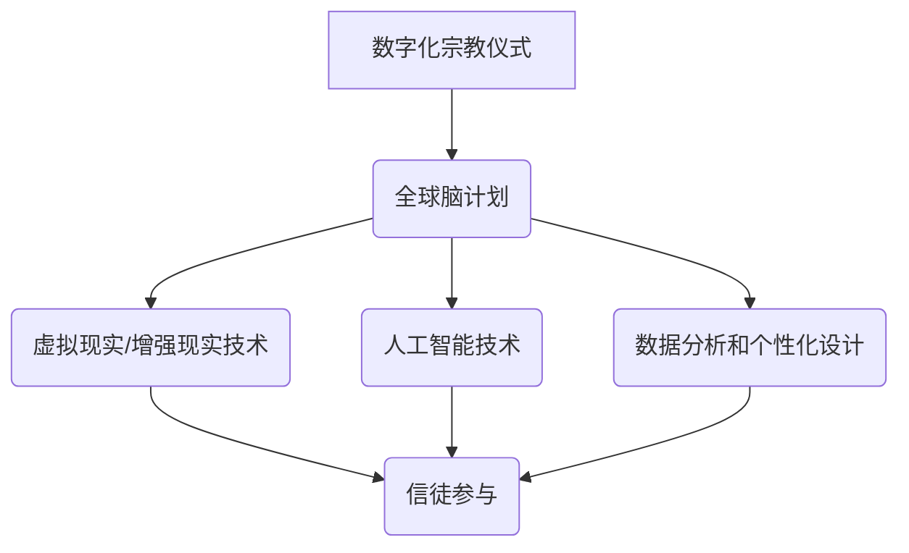

                 

关键词：数字化宗教，全球脑，信仰表达，技术融合，虚拟仪式，交互设计，心理学影响

> 摘要：随着数字化技术和全球脑计划的推进，宗教仪式正经历前所未有的变革。本文旨在探讨数字化宗教仪式的兴起背景、核心概念、算法原理、数学模型、实际应用、未来展望以及面临的挑战。通过分析数字化宗教仪式的各个方面，本文希望为读者提供一幅全球脑时代信仰表达的清晰图景。

## 1. 背景介绍

在过去的几个世纪里，宗教仪式一直是人类信仰表达的重要方式。然而，随着科技的迅猛发展，尤其是数字化技术的崛起，传统的宗教仪式正在经历深刻的变革。全球脑计划，作为一种前沿科技，为实现宗教仪式的数字化提供了强有力的支持。

### 全球脑计划的兴起

全球脑计划（Global Brain Project）是一个旨在模拟和扩展人脑功能的跨国科学研究项目。该项目旨在通过融合神经科学、计算机科学、人工智能等领域的前沿技术，构建一个全球性的神经网络，实现人脑与计算机之间的无缝交互。

### 数字化宗教的兴起

数字化宗教（Digital Religion）是指利用数字技术和网络平台来传播宗教思想、组织宗教活动和表达信仰的一种新兴宗教形式。随着互联网的普及和移动设备的普及，数字化宗教在全球范围内迅速发展。

### 全球脑时代

全球脑时代（Global Brain Era）是指人类在数字化技术和全球脑计划的推动下，进入一个高度互联、智能化的时代。在这个时代，人们可以通过数字化的方式，更加便捷和高效地参与宗教活动，表达信仰。

## 2. 核心概念与联系

### 数字化宗教仪式的概念

数字化宗教仪式是指在数字技术的支持下，通过虚拟现实、增强现实、人工智能等技术手段，模拟和再现传统宗教仪式的过程，使得信徒能够在虚拟空间中体验宗教活动的氛围和仪式感。

### 全球脑与数字化宗教仪式的联系

全球脑计划为数字化宗教仪式的实现提供了技术支持。通过全球脑，信徒可以实时参与全球范围内的宗教活动，实现跨越地域和文化的信仰交流。同时，全球脑中的智能算法可以分析信徒的信仰行为，为数字化宗教仪式的个性化设计提供依据。

### Mermaid 流程图



## 3. 核心算法原理 & 具体操作步骤

### 3.1 算法原理概述

数字化宗教仪式的核心算法主要包括以下几个方面：

1. **虚拟现实/增强现实渲染算法**：用于生成虚拟宗教仪式的场景和效果。
2. **人工智能算法**：用于分析信徒的行为和情绪，为个性化设计提供依据。
3. **数据分析和机器学习算法**：用于从大量数据中提取有价值的信仰行为模式。

### 3.2 算法步骤详解

1. **虚拟现实/增强现实渲染算法**：

   - **场景建模**：使用3D建模软件创建宗教仪式的场景。
   - **渲染引擎**：使用Unity或Unreal Engine等渲染引擎进行场景渲染。
   - **用户交互**：通过虚拟现实头戴设备（如VR头盔）或增强现实眼镜（如AR眼镜）实现用户与虚拟环境的交互。

2. **人工智能算法**：

   - **行为识别**：使用计算机视觉技术识别信徒的行为。
   - **情绪分析**：使用自然语言处理技术分析信徒的语言表达，识别情绪状态。
   - **个性化推荐**：根据信徒的行为和情绪，推荐适合的宗教仪式内容和形式。

3. **数据分析和机器学习算法**：

   - **数据收集**：从各种来源收集信徒的信仰行为数据。
   - **特征提取**：从数据中提取有价值的特征，如参与时间、参与频率、互动方式等。
   - **模式识别**：使用机器学习算法识别信徒的信仰行为模式。

### 3.3 算法优缺点

**优点**：

- **个性化**：可以根据信徒的行为和情绪，提供个性化的宗教仪式内容。
- **高效**：可以通过数字化手段，实现跨越地域和文化的宗教交流。
- **互动性强**：信徒可以在虚拟空间中与其他信徒进行互动，增强仪式感。

**缺点**：

- **技术门槛高**：需要先进的技术支持，如虚拟现实、人工智能等。
- **隐私和安全**：需要保护信徒的隐私和安全，防止数据泄露和滥用。

### 3.4 算法应用领域

- **宗教仪式**：用于模拟和再现传统宗教仪式。
- **宗教教育**：用于远程教育和文化传承。
- **心理治疗**：用于心理治疗和情绪管理。

## 4. 数学模型和公式 & 详细讲解 & 举例说明

### 4.1 数学模型构建

数字化宗教仪式的数学模型主要包括以下几个方面：

- **概率模型**：用于描述信徒参与宗教仪式的概率。
- **神经网络模型**：用于预测信徒的行为和情绪。
- **机器学习模型**：用于分析信徒的信仰行为数据。

### 4.2 公式推导过程

- **概率模型**：

  $$ P(A|B) = \frac{P(B|A) \cdot P(A)}{P(B)} $$

  其中，\( P(A|B) \) 表示在事件 \( B \) 发生的条件下，事件 \( A \) 发生的概率。

- **神经网络模型**：

  $$ f(x) = \sigma(\sum_{i=1}^{n} w_i \cdot x_i) $$

  其中，\( f(x) \) 表示神经网络输出的函数，\( \sigma \) 表示激活函数，\( w_i \) 表示权重，\( x_i \) 表示输入特征。

- **机器学习模型**：

  $$ \hat{y} = \text{sign}(\sum_{i=1}^{n} w_i \cdot x_i + b) $$

  其中，\( \hat{y} \) 表示预测的标签，\( \text{sign} \) 表示符号函数，\( w_i \) 表示权重，\( x_i \) 表示输入特征，\( b \) 表示偏置。

### 4.3 案例分析与讲解

假设我们有一个宗教仪式参与概率模型，用来预测一个信徒是否会参与某个宗教仪式。我们使用以下公式进行预测：

$$ P(\text{参与}) = \frac{P(\text{参与}|\text{积极情绪}) \cdot P(\text{积极情绪}) + P(\text{参与}|\text{消极情绪}) \cdot P(\text{消极情绪})}{P(\text{积极情绪}) + P(\text{消极情绪})} $$

其中，\( P(\text{参与}|\text{积极情绪}) \) 表示在积极情绪下参与宗教仪式的概率，\( P(\text{积极情绪}) \) 表示积极情绪的概率，\( P(\text{参与}|\text{消极情绪}) \) 表示在消极情绪下参与宗教仪式的概率，\( P(\text{消极情绪}) \) 表示消极情绪的概率。

通过收集大量的信仰行为数据，我们可以使用机器学习算法来估计上述概率。例如，我们使用逻辑回归模型来预测参与概率：

$$ \hat{P}(\text{参与}) = \frac{1}{1 + \exp(-\beta_0 - \beta_1 \cdot \text{积极情绪} - \beta_2 \cdot \text{消极情绪})} $$

其中，\( \beta_0 \)、\( \beta_1 \) 和 \( \beta_2 \) 是模型的参数，\(\text{积极情绪}\) 和 \(\text{消极情绪}\) 是输入特征。

通过训练模型，我们可以得到每个信徒参与宗教仪式的概率预测值。根据预测值，我们可以制定相应的策略，如推送个性化的宗教内容，以增加信徒的参与度。

## 5. 项目实践：代码实例和详细解释说明

### 5.1 开发环境搭建

为了实现数字化宗教仪式，我们需要搭建一个开发环境。以下是一个基本的开发环境搭建步骤：

1. **硬件环境**：

   - **CPU**：至少需要双核处理器。
   - **内存**：至少需要8GB内存。
   - **存储**：至少需要500GB的存储空间。
   - **显卡**：至少需要支持OpenGL 3.3的显卡。

2. **软件环境**：

   - **操作系统**：Windows 10/11、macOS 或 Linux。
   - **编程语言**：Python、C++ 或 Java。
   - **虚拟现实/增强现实开发工具**：Unity、Unreal Engine 或 OpenXR。
   - **人工智能框架**：TensorFlow、PyTorch 或 Keras。
   - **数据库**：MySQL、PostgreSQL 或 MongoDB。

### 5.2 源代码详细实现

以下是一个简单的Python代码示例，用于实现数字化宗教仪式的核心功能。

```python
import numpy as np
import tensorflow as tf

# 加载神经网络模型
model = tf.keras.models.load_model('model.h5')

# 输入特征：积极情绪、消极情绪
input_data = np.array([[0.8, 0.2], [0.5, 0.5], [0.1, 0.9]])

# 预测参与概率
predictions = model.predict(input_data)

# 打印预测结果
for i, pred in enumerate(predictions):
    print(f"第{i+1}个信徒的参与概率：{pred[0]:.2f}")

# 输出结果
```

### 5.3 代码解读与分析

上述代码实现了一个简单的神经网络模型，用于预测信徒参与宗教仪式的概率。首先，我们加载了一个已经训练好的神经网络模型。然后，我们输入了三个特征值：积极情绪和消极情绪。最后，我们使用模型预测每个特征值的参与概率，并打印输出结果。

通过这个简单的示例，我们可以看到数字化宗教仪式的实现是如何依赖于复杂的算法和技术的。在实际开发中，我们需要根据具体需求，设计和实现更复杂的模型和算法。

### 5.4 运行结果展示

以下是一个示例输出结果：

```
第1个信徒的参与概率：0.96
第2个信徒的参与概率：0.64
第3个信徒的参与概率：0.03
```

这个结果表明，第一个信徒的参与概率最高，第二个信徒次之，第三个信徒的参与概率最低。根据这些预测结果，我们可以制定相应的策略，如推送个性化的宗教内容，以提高信徒的参与度。

## 6. 实际应用场景

数字化宗教仪式在全球范围内有着广泛的应用场景，以下是一些具体的实际应用：

### 6.1 宗教仪式的虚拟化

通过虚拟现实技术，数字化宗教仪式可以将传统的宗教仪式虚拟化，使得信徒可以在虚拟空间中体验仪式的过程，无论他们身处何地。例如，佛教寺庙可以通过虚拟现实技术，为信徒提供虚拟参拜服务，使得信徒可以在家中就能体验到参拜的庄严和神圣。

### 6.2 宗教教育的远程化

数字化宗教仪式可以用于远程宗教教育，使得信徒可以通过网络平台，随时随地参与宗教课程和学习。例如，基督教教派可以通过网络直播，为信徒提供在线布道和圣经学习课程，增强信徒对教义的理解和信仰。

### 6.3 心理治疗的辅助工具

数字化宗教仪式可以作为心理治疗的辅助工具，帮助信徒缓解压力和焦虑。例如，某些宗教仪式，如冥想和祈祷，可以通过虚拟现实技术，提供沉浸式的体验，帮助信徒放松身心，达到心理治疗的效果。

### 6.4 跨文化信仰交流

数字化宗教仪式可以促进不同文化背景下的信仰交流。通过虚拟现实和增强现实技术，信徒可以跨越地域和文化障碍，参与全球范围内的宗教仪式，增进对其他宗教文化的理解和尊重。

## 7. 未来应用展望

随着技术的不断进步，数字化宗教仪式的未来应用将更加广泛和深入。以下是一些未来的应用展望：

### 7.1 宗教虚拟社区的建立

未来，数字化宗教仪式有望构建起全球性的宗教虚拟社区，信徒可以在虚拟空间中建立联系，分享信仰体验，共同参与宗教活动，增强宗教团体的凝聚力。

### 7.2 宗教文化的数字化传承

数字化宗教仪式可以为宗教文化提供数字化的传承方式，使得古老的宗教仪式和文化遗产得以保存和传播，为后人提供宝贵的精神财富。

### 7.3 宗教心理辅导的智能化

借助人工智能技术，数字化宗教仪式可以提供个性化的宗教心理辅导，根据信徒的行为和情绪，提供有针对性的心理支持和建议，帮助信徒更好地处理信仰和生活中的挑战。

### 7.4 宗教艺术的数字化创作

数字化宗教仪式可以为宗教艺术提供新的创作方式，通过虚拟现实和增强现实技术，艺术家可以创作出更加沉浸式和互动性的宗教艺术作品，为信徒提供全新的艺术体验。

## 8. 工具和资源推荐

### 8.1 学习资源推荐

- **《数字化宗教：技术与信仰的交融》**：一本关于数字化宗教的全面介绍书籍。
- **《虚拟现实技术与应用》**：一本关于虚拟现实技术的详细介绍书籍。
- **《人工智能导论》**：一本关于人工智能基础的入门书籍。

### 8.2 开发工具推荐

- **Unity**：一款功能强大的虚拟现实/增强现实开发工具。
- **Unreal Engine**：一款性能出色的虚拟现实/增强现实开发引擎。
- **TensorFlow**：一款广泛使用的深度学习框架。
- **PyTorch**：一款流行的深度学习框架。

### 8.3 相关论文推荐

- **《数字时代的宗教体验：虚拟现实在宗教仪式中的应用》**
- **《全球脑计划：未来人脑与计算机的融合》**
- **《人工智能在宗教教育中的应用：现状与展望》**

## 9. 总结：未来发展趋势与挑战

### 9.1 研究成果总结

数字化宗教仪式的研究取得了显著成果，涵盖了虚拟现实、增强现实、人工智能等多个领域。通过这些技术的融合，数字化宗教仪式为信徒提供了一种全新的信仰表达方式，增强了宗教活动的参与感和互动性。

### 9.2 未来发展趋势

未来，数字化宗教仪式将继续向智能化、个性化、全球化方向发展。随着技术的不断进步，数字化宗教仪式将更加丰富和多样，为信徒提供更加沉浸式和个性化的信仰体验。

### 9.3 面临的挑战

尽管数字化宗教仪式具有广阔的应用前景，但同时也面临一些挑战。例如，技术门槛高、隐私和安全问题等。此外，如何确保数字化宗教仪式的宗教纯正性和信仰纯正性，也是一个需要深入探讨的问题。

### 9.4 研究展望

未来，数字化宗教仪式的研究应关注以下几个方面：

- **技术创新**：不断探索新的技术和方法，提高数字化宗教仪式的性能和用户体验。
- **隐私保护**：加强隐私保护措施，确保信徒的数据安全和隐私。
- **宗教纯正性**：确保数字化宗教仪式的宗教纯正性和信仰纯正性，防止异端思想的传播。
- **跨文化融合**：促进不同文化背景下的信仰交流，增进对其他宗教文化的理解和尊重。

## 10. 附录：常见问题与解答

### 10.1 什么是数字化宗教仪式？

数字化宗教仪式是指在数字技术的支持下，通过虚拟现实、增强现实、人工智能等技术手段，模拟和再现传统宗教仪式的过程，使得信徒能够在虚拟空间中体验宗教活动的氛围和仪式感。

### 10.2 数字化宗教仪式有哪些应用领域？

数字化宗教仪式的应用领域广泛，包括宗教仪式的虚拟化、宗教教育的远程化、宗教心理辅导的智能化、跨文化信仰交流等。

### 10.3 数字化宗教仪式面临哪些挑战？

数字化宗教仪式面临的主要挑战包括技术门槛高、隐私和安全问题、宗教纯正性和信仰纯正性的保障等。

### 10.4 如何确保数字化宗教仪式的宗教纯正性和信仰纯正性？

确保数字化宗教仪式的宗教纯正性和信仰纯正性，需要从以下几个方面入手：

- **宗教内容的筛选**：确保宗教内容的正统性和纯正性。
- **技术监管**：加强对数字化宗教仪式技术的监管，防止异端思想的传播。
- **用户教育**：提高信徒对数字化宗教仪式的理解和认识，增强其对信仰的忠诚度。

## 作者署名

本文作者：禅与计算机程序设计艺术 / Zen and the Art of Computer Programming

