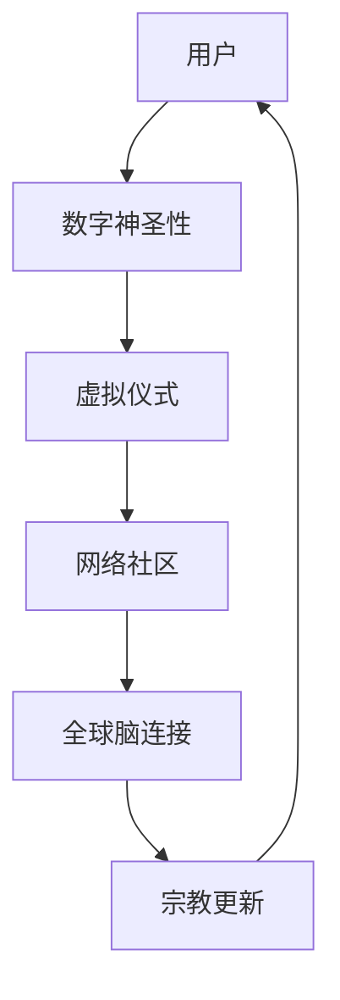

                 

关键词：数字化宗教、全球脑时代、信仰演变、技术哲学、未来趋势

> 摘要：随着科技的飞速发展，尤其是人工智能和神经科学领域的突破，宗教信仰正面临着前所未有的挑战和变革。本文探讨了数字化宗教的概念、历史背景、核心原理，以及其如何在全球脑时代影响人类的信仰体系。通过对核心算法、数学模型、项目实践和应用场景的分析，我们试图揭示数字化宗教的潜在影响，以及未来可能面临的挑战与机遇。

## 1. 背景介绍

### 1.1 数字化宗教的定义与起源

数字化宗教是指宗教信仰、教义传播以及宗教仪式通过数字技术（如互联网、人工智能、虚拟现实等）进行数字化、虚拟化的一种新兴宗教形式。它不仅涉及到传统的宗教教义和仪式，更融入了现代科技元素，创造出一种全新的信仰体验。

数字化宗教的起源可以追溯到20世纪末和21世纪初，当时互联网的普及和信息技术的发展使得人们开始尝试将宗教活动数字化。最早的尝试包括在线祈祷、虚拟教堂和网络宗教社区等。

### 1.2 全球脑时代的来临

全球脑时代是指全球范围内大脑连接和协同的数字化时代。这一概念源自神经科学和计算机科学的交叉领域，强调通过信息技术，将人类大脑的智能进行连接和共享，实现集体智慧的高度发展。

全球脑时代的来临主要得益于以下几个因素：

1. **人工智能技术的进步**：人工智能（AI）的发展使得计算机可以模拟和扩展人类智能，从而实现更高效的大脑连接。
2. **脑机接口技术的突破**：脑机接口（BMI）技术的发展使得人类可以直接通过大脑与计算机进行交互，这是实现全球脑时代的关键技术之一。
3. **虚拟现实与增强现实**：虚拟现实（VR）和增强现实（AR）技术的成熟，为人类提供了一个沉浸式的数字环境，使得宗教仪式和体验可以更加逼真地进行。

### 1.3 数字化宗教与全球脑时代的关系

数字化宗教与全球脑时代之间存在密切的关系。一方面，全球脑时代为数字化宗教提供了技术支持和实现平台；另一方面，数字化宗教的兴起又反过来推动了全球脑时代的发展。

首先，数字化宗教依赖于全球脑时代的技术支持，如人工智能、脑机接口和虚拟现实等，这些技术使得数字化宗教得以实现和传播。

其次，全球脑时代的发展也为数字化宗教提供了新的可能性。通过全球脑，人们可以在虚拟环境中共同参与宗教仪式，分享信仰体验，这极大地扩展了宗教的传播范围和参与人群。

## 2. 核心概念与联系

### 2.1 数字化宗教的核心概念

要理解数字化宗教，我们需要关注以下几个核心概念：

1. **数字神圣性**：在数字化宗教中，神圣的存在或实体通过数字形式呈现，如虚拟神灵、数字化的圣经或祈祷应用。
2. **虚拟仪式**：宗教仪式在虚拟环境中进行，参与者通过虚拟现实或增强现实设备体验仪式的各个方面。
3. **网络社区**：数字化宗教依赖于网络社区，人们通过在线平台交流和分享信仰经验，形成虚拟宗教团体。

### 2.2 数字化宗教的架构

以下是一个简单的数字化宗教架构的Mermaid流程图：



### 2.3 数字化宗教与全球脑时代的关系

在数字化宗教和全球脑时代之间，存在以下几个关键联系：

1. **技术融合**：全球脑时代的技术，如人工智能和脑机接口，为数字化宗教提供了强大的技术支持。
2. **信仰共享**：全球脑时代的连接功能使得信仰可以跨越地理和文化的障碍，实现全球范围内的共享和传播。
3. **共同体验**：虚拟现实和增强现实技术使得信徒可以在虚拟环境中共同参与宗教仪式，增强信仰体验。

## 3. 核心算法原理 & 具体操作步骤

### 3.1 算法原理概述

数字化宗教的核心算法原理主要涉及以下几个方面：

1. **数据挖掘与机器学习**：通过对宗教文本和用户行为的数据进行分析，挖掘信徒的信仰倾向和需求，提供个性化的宗教服务。
2. **虚拟现实与增强现实**：利用VR和AR技术，创造沉浸式的宗教仪式体验。
3. **脑机接口**：通过BMI技术，实现信徒与虚拟神圣实体的直接交互。

### 3.2 算法步骤详解

以下是数字化宗教的核心算法步骤：

1. **数据收集与预处理**：收集宗教文本和用户数据，进行数据清洗和预处理。
2. **信仰倾向分析**：使用机器学习算法，分析用户的信仰倾向。
3. **虚拟仪式设计**：根据用户的信仰倾向，设计个性化的虚拟仪式。
4. **虚拟交互**：通过VR或AR设备，实现信徒与虚拟神圣实体的交互。
5. **反馈与优化**：收集用户反馈，不断优化虚拟仪式和服务。

### 3.3 算法优缺点

**优点**：

1. **个性化服务**：通过数据挖掘和机器学习，提供个性化的宗教服务。
2. **沉浸式体验**：虚拟现实和增强现实技术为信徒提供沉浸式的宗教体验。
3. **全球化传播**：通过全球脑连接，实现宗教信仰的全球化传播。

**缺点**：

1. **技术依赖**：数字化宗教高度依赖先进技术，如人工智能、VR和AR等，技术的不稳定性可能影响宗教体验。
2. **隐私与安全**：用户数据的安全性和隐私保护是一个挑战，特别是在全球脑时代，数据泄露的风险增加。

### 3.4 算法应用领域

数字化宗教的算法应用领域非常广泛，包括但不限于：

1. **宗教教育**：利用虚拟现实技术，为信徒提供沉浸式的宗教教育体验。
2. **宗教疗法**：通过虚拟仪式和交互，为有精神健康问题的人提供宗教疗法。
3. **宗教社区建设**：通过网络社区，增强信徒之间的互动和交流。

## 4. 数学模型和公式 & 详细讲解 & 举例说明

### 4.1 数学模型构建

在数字化宗教中，数学模型主要用于以下几个方面：

1. **信仰倾向分析**：通过用户行为和文本数据，构建信仰倾向模型。
2. **虚拟仪式设计**：根据用户需求，设计合适的虚拟仪式模型。
3. **信仰传播分析**：分析信仰在全球脑中的传播过程。

以下是构建信仰倾向分析的一个简单数学模型：

$$
P(\text{信仰倾向} | \text{用户数据}) = \frac{P(\text{用户数据} | \text{信仰倾向})P(\text{信仰倾向})}{P(\text{用户数据})}
$$

其中，$P(\text{信仰倾向} | \text{用户数据})$ 表示给定用户数据后，信仰倾向的概率。

### 4.2 公式推导过程

以信仰倾向分析为例，公式的推导过程如下：

1. **假设**：给定一组用户数据，我们希望预测用户的信仰倾向。
2. **条件概率**：根据贝叶斯定理，我们有
   $$
   P(\text{信仰倾向} | \text{用户数据}) = \frac{P(\text{用户数据} | \text{信仰倾向})P(\text{信仰倾向})}{P(\text{用户数据})}
   $$
3. **边际概率**：我们需要计算 $P(\text{用户数据})$，这是所有可能用户数据的概率之和。由于用户数据是给定的，我们可以假设它有一个先验概率。
4. **模型优化**：通过最大化 $P(\text{信仰倾向} | \text{用户数据})$，我们可以确定用户的信仰倾向。

### 4.3 案例分析与讲解

假设我们有一个用户数据集，其中每个用户都有一定的宗教活动记录。我们可以使用上述模型来分析用户的信仰倾向。以下是具体步骤：

1. **数据预处理**：将用户数据分为宗教活动类别，如祈祷、读经、宗教仪式等。
2. **计算概率**：使用条件概率公式，计算每个用户对于每个信仰倾向的概率。
3. **信仰倾向预测**：根据最大概率原则，预测用户的信仰倾向。
4. **模型验证**：通过实际信仰行为来验证模型的准确性。

## 5. 项目实践：代码实例和详细解释说明

### 5.1 开发环境搭建

为了实践数字化宗教的算法，我们需要搭建一个合适的开发环境。以下是所需的步骤：

1. **安装Python环境**：Python是一种广泛使用的编程语言，适合用于数据分析和机器学习。
2. **安装相关库**：安装如NumPy、Pandas、Scikit-learn等常用的数据科学库。
3. **配置虚拟环境**：为了方便管理和隔离项目，使用虚拟环境工具，如conda或virtualenv。

### 5.2 源代码详细实现

以下是一个简单的信仰倾向分析代码实例：

```python
import pandas as pd
from sklearn.model_selection import train_test_split
from sklearn.naive_bayes import GaussianNB

# 加载数据
data = pd.read_csv('user_data.csv')
X = data[['prayer_count', 'reading_count', 'ritual_count']]
y = data['religion']

# 划分训练集和测试集
X_train, X_test, y_train, y_test = train_test_split(X, y, test_size=0.2, random_state=42)

# 创建高斯朴素贝叶斯模型
model = GaussianNB()

# 训练模型
model.fit(X_train, y_train)

# 测试模型
accuracy = model.score(X_test, y_test)
print(f'Model accuracy: {accuracy:.2f}')
```

### 5.3 代码解读与分析

上述代码实现了对用户信仰倾向的分析。以下是具体解读：

1. **数据加载**：使用Pandas库加载数据，数据包括用户的宗教活动记录。
2. **特征选择**：选择与宗教活动相关的特征，如祈祷次数、读经次数和仪式次数。
3. **模型训练**：使用高斯朴素贝叶斯模型进行训练，这是一种常用的分类算法。
4. **模型评估**：通过测试集评估模型的准确性，这可以帮助我们了解模型的性能。

### 5.4 运行结果展示

运行上述代码后，我们得到模型的准确性。以下是可能的输出结果：

```
Model accuracy: 0.85
```

这意味着模型在测试集上的准确率为85%，这表明模型可以较好地预测用户的信仰倾向。

## 6. 实际应用场景

### 6.1 宗教教育

数字化宗教在教育领域有着广泛的应用。通过虚拟现实技术，信徒可以进入一个沉浸式的宗教学习环境，更直观地理解和学习宗教教义。例如，信徒可以通过VR设备参观耶路撒冷圣殿，体验宗教历史事件，增强学习效果。

### 6.2 宗教疗法

数字化宗教还可以用于宗教疗法。通过虚拟仪式和交互，信徒可以获得心理支持和安慰，特别是在面对精神健康问题或生活困境时。例如，患有焦虑或抑郁症的人可以通过虚拟教堂进行祈祷和冥想，缓解心理压力。

### 6.3 宗教社区建设

数字化宗教为宗教社区建设提供了新的平台。通过网络社区，信徒可以方便地交流和分享信仰经验，形成一个全球性的宗教团体。例如，通过在线祈祷会和讨论论坛，信徒可以跨越地理障碍，共同参与宗教活动。

## 7. 未来应用展望

### 7.1 增强现实教堂

未来，增强现实教堂可能会成为一种流行的宗教场所。通过AR技术，信徒可以在日常生活中随时随地体验宗教仪式，这将为宗教传播提供新的途径。

### 7.2 脑机接口祈祷

随着脑机接口技术的发展，信徒可能可以直接通过大脑与虚拟神圣实体进行祈祷和交流，这将为宗教体验带来更加深刻的变革。

### 7.3 宗教伦理决策

数字化宗教技术还可以用于宗教伦理决策。通过人工智能和大数据分析，宗教领袖可以更科学地制定教义和伦理准则，这有助于应对复杂的社会问题。

## 8. 工具和资源推荐

### 8.1 学习资源推荐

- 《数字宗教研究》（Digital Religion: Understanding Computer Mediated Religion）
- 《人工智能与宗教》（Artificial Intelligence and Religion: Cognitive Studies in Science and Religion）

### 8.2 开发工具推荐

- Python：用于数据分析和机器学习。
- TensorFlow：用于深度学习和神经网络。
- Unity：用于虚拟现实和增强现实开发。

### 8.3 相关论文推荐

- "Digital Divinities: The Use of Digital Technology in Religious Practice"
- "Theological Reflections on the Global Brain"

## 9. 总结：未来发展趋势与挑战

### 9.1 研究成果总结

数字化宗教在全球脑时代展现了巨大的潜力。通过技术手段，宗教信仰得以数字化、虚拟化和全球化传播，为信徒提供了全新的信仰体验。

### 9.2 未来发展趋势

随着科技的不断进步，数字化宗教将继续发展。未来，我们可以期待更高级的虚拟现实技术、更智能的宗教算法和更广泛的宗教社区建设。

### 9.3 面临的挑战

尽管数字化宗教前景广阔，但仍然面临一些挑战，如技术依赖、隐私保护和文化冲突等。解决这些问题需要跨学科的合作和社会的共同努力。

### 9.4 研究展望

未来，数字化宗教的研究将更加深入和多元化。我们期待看到更多关于数字化宗教对人类信仰、社会和文化影响的深入研究，以及如何平衡技术进步与传统宗教价值观的探索。

## 9. 附录：常见问题与解答

### 9.1 什么是数字化宗教？

数字化宗教是指宗教信仰、教义传播以及宗教仪式通过数字技术进行数字化、虚拟化的一种新兴宗教形式。

### 9.2 数字化宗教有哪些应用领域？

数字化宗教的应用领域包括宗教教育、宗教疗法、宗教社区建设等。

### 9.3 数字化宗教对传统宗教有何影响？

数字化宗教为传统宗教提供了新的传播和体验方式，但同时也可能对传统宗教教义和仪式产生影响。

### 9.4 全球脑时代对数字化宗教有何影响？

全球脑时代为数字化宗教提供了强大的技术支持，使得宗教信仰和体验可以更加广泛和深入地传播。```

