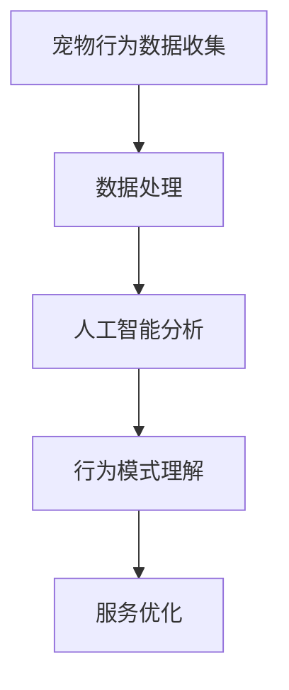

                 

关键词：数字化宠物行为、人工智能、数据分析、创业、宠物科技

摘要：随着人工智能和数据分析技术的不断发展，宠物行为分析已经逐渐成为一个新兴的领域。本文旨在探讨数字化宠物行为分析在创业中的潜在价值，以及如何通过理解宠物行为来创新商业模式，为宠物主人和宠物行业带来新的发展机遇。

## 1. 背景介绍

在过去的几十年中，宠物已经成为人类生活的重要伴侣。据研究，全球有超过50%的家庭拥有宠物，这包括猫、狗、鸟类、爬行动物等。随着宠物数量的增加，人们对宠物健康和幸福度的关注也在不断提升。传统的宠物行业主要以销售宠物用品和提供宠物医疗服务为主，但这一市场的竞争日益激烈。

近年来，人工智能和数据分析技术的快速发展，为宠物行业带来了新的机遇。通过数字化手段，我们可以对宠物行为进行深入分析，从而提供更加个性化的服务和产品。这种变革性的技术为创业者提供了一个新的视角，以创新的方式理解和满足宠物主人的需求。

## 2. 核心概念与联系

### 2.1 数字化宠物行为分析

数字化宠物行为分析是指利用传感器、摄像头、GPS等技术，收集宠物的行为数据，并通过人工智能算法进行分析，从而理解宠物的行为模式和生活习惯。

### 2.2 人工智能在宠物行为分析中的应用

人工智能在宠物行为分析中发挥着关键作用。通过机器学习算法，我们可以从海量的行为数据中提取出有用的信息，例如宠物的活动量、饮食习惯、社交行为等。这些数据可以帮助宠物主人更好地照顾宠物，也可以为宠物企业提供有价值的参考。

### 2.3 数据分析在宠物行业中的应用

数据分析技术可以帮助宠物企业优化运营策略，提高服务质量。例如，通过对销售数据的分析，宠物企业可以了解不同产品和服务的市场需求，从而进行精准营销和库存管理。

### 2.4 Mermaid 流程图

下面是一个简单的 Mermaid 流程图，展示了数字化宠物行为分析的核心概念和联系。



## 3. 核心算法原理 & 具体操作步骤

### 3.1 算法原理概述

数字化宠物行为分析的核心算法包括数据采集、数据预处理、特征提取和模式识别等步骤。

- **数据采集**：通过传感器、摄像头、GPS等设备，收集宠物的行为数据。
- **数据预处理**：对采集到的数据进行清洗、去噪和归一化处理。
- **特征提取**：从预处理后的数据中提取出有用的特征，如活动量、饮食习惯、社交行为等。
- **模式识别**：利用机器学习算法，对提取出的特征进行分类和聚类，以识别宠物的行为模式。

### 3.2 算法步骤详解

- **数据采集**：使用传感器和摄像头，实时记录宠物的活动情况。例如，使用加速度传感器来监测宠物的运动，使用摄像头来记录宠物的行为。
- **数据预处理**：对采集到的原始数据进行清洗和去噪。例如，去除因环境噪声导致的错误数据，对数据进行归一化处理，使其适应不同的数据采集设备。
- **特征提取**：从预处理后的数据中提取出有用的特征。例如，使用统计方法提取宠物的活动量、使用机器学习算法提取宠物的饮食习惯。
- **模式识别**：利用机器学习算法，对提取出的特征进行分类和聚类。例如，使用支持向量机（SVM）进行宠物行为的分类，使用K-均值算法进行宠物行为的聚类。

### 3.3 算法优缺点

- **优点**：数字化宠物行为分析可以帮助宠物主人更好地了解宠物的行为，从而提供更加个性化的照顾。同时，它也可以为宠物企业提供有价值的市场洞察，帮助其优化运营策略。
- **缺点**：数字化宠物行为分析需要对大量数据进行处理，对算法的要求较高。此外，数据的隐私和安全性也是一个需要关注的问题。

### 3.4 算法应用领域

数字化宠物行为分析可以应用于多个领域，如宠物健康监测、宠物行为训练、宠物产品推荐等。以下是一些具体的案例：

- **宠物健康监测**：通过分析宠物的行为数据，可以及时发现宠物的健康问题，如肥胖、关节炎等。宠物主人可以根据这些数据调整宠物的饮食和运动计划。
- **宠物行为训练**：通过分析宠物的行为数据，可以了解宠物的行为习惯，从而设计更有效的训练计划。例如，通过分析狗的运动数据，可以设计出适合它的运动训练计划。
- **宠物产品推荐**：通过分析宠物的行为数据，可以了解宠物的偏好和需求，从而推荐适合宠物的产品。例如，通过分析狗的饮食习惯，可以推荐适合它的狗粮。

## 4. 数学模型和公式 & 详细讲解 & 举例说明

### 4.1 数学模型构建

在数字化宠物行为分析中，常用的数学模型包括线性回归、逻辑回归和支持向量机等。以下是一个简单的线性回归模型。

$$
y = \beta_0 + \beta_1x
$$

其中，$y$ 是宠物的行为评分，$x$ 是宠物的活动量，$\beta_0$ 和 $\beta_1$ 是模型参数。

### 4.2 公式推导过程

线性回归模型的推导过程如下：

- **假设**：我们假设宠物的行为评分 $y$ 与活动量 $x$ 之间存在线性关系。
- **目标**：我们希望找到一个线性模型，能够预测宠物的行为评分。
- **推导**：我们使用最小二乘法来估计模型参数 $\beta_0$ 和 $\beta_1$。

### 4.3 案例分析与讲解

假设我们有一个包含100条宠物行为数据的样本，每条数据包括宠物的活动量和行为评分。我们使用线性回归模型来预测宠物的行为评分。

- **数据准备**：我们将数据分为训练集和测试集。训练集用于训练模型，测试集用于评估模型的性能。
- **模型训练**：使用训练集数据，通过最小二乘法估计模型参数 $\beta_0$ 和 $\beta_1$。
- **模型评估**：使用测试集数据，计算模型的预测误差，并评估模型的性能。

通过以上步骤，我们可以构建一个简单的线性回归模型，用于预测宠物的行为评分。

## 5. 项目实践：代码实例和详细解释说明

### 5.1 开发环境搭建

为了进行数字化宠物行为分析，我们需要搭建一个合适的技术环境。以下是具体的步骤：

- **Python环境**：确保Python环境已经安装，并安装必要的库，如NumPy、Pandas、Scikit-learn等。
- **数据处理工具**：使用Pandas进行数据预处理，使用NumPy进行数据计算。
- **机器学习库**：使用Scikit-learn进行机器学习模型的训练和评估。

### 5.2 源代码详细实现

以下是数字化宠物行为分析的源代码实现：

```python
import numpy as np
import pandas as pd
from sklearn.linear_model import LinearRegression
from sklearn.model_selection import train_test_split
from sklearn.metrics import mean_squared_error

# 数据准备
data = pd.read_csv('pet_behavior_data.csv')
X = data[['activity_level']]
y = data['behavior_score']

# 数据划分
X_train, X_test, y_train, y_test = train_test_split(X, y, test_size=0.2, random_state=42)

# 模型训练
model = LinearRegression()
model.fit(X_train, y_train)

# 模型评估
y_pred = model.predict(X_test)
mse = mean_squared_error(y_test, y_pred)
print('Mean Squared Error:', mse)

# 模型应用
new_data = np.array([[500]])
new_behavior_score = model.predict(new_data)
print('Predicted Behavior Score:', new_behavior_score)
```

### 5.3 代码解读与分析

- **数据准备**：使用Pandas读取宠物行为数据，并划分特征和目标变量。
- **数据划分**：将数据分为训练集和测试集，用于模型的训练和评估。
- **模型训练**：使用线性回归模型训练模型，使用训练集数据。
- **模型评估**：使用测试集数据评估模型的性能，计算预测误差。
- **模型应用**：使用训练好的模型进行预测，输出预测结果。

通过以上步骤，我们可以实现一个简单的数字化宠物行为分析模型，用于预测宠物的行为评分。

## 6. 实际应用场景

### 6.1 宠物健康监测

通过数字化宠物行为分析，宠物主人可以实时了解宠物的健康状况。例如，宠物主人可以通过手机APP查看宠物的活动量、饮食情况等，及时发现宠物的健康问题。

### 6.2 宠物行为训练

数字化宠物行为分析可以帮助宠物主人制定更有效的训练计划。例如，通过分析宠物的行为数据，宠物主人可以了解宠物的行为习惯，从而设计出适合宠物的训练方法。

### 6.3 宠物产品推荐

通过数字化宠物行为分析，宠物企业可以了解宠物的需求，从而推荐适合宠物的产品。例如，通过分析宠物的饮食数据，宠物企业可以推荐适合宠物的狗粮。

## 7. 未来应用展望

随着人工智能和数据分析技术的不断发展，数字化宠物行为分析将在宠物行业中发挥越来越重要的作用。未来的应用场景将更加丰富，例如：

- **智能宠物看护**：通过数字化宠物行为分析，宠物看护机器人可以实时监测宠物的行为，并在必要时提供帮助。
- **个性化宠物医疗**：通过数字化宠物行为分析，宠物医生可以更加精准地为宠物提供医疗服务。
- **宠物社交平台**：通过数字化宠物行为分析，宠物主人可以了解其他宠物的行为，从而促进宠物之间的社交。

## 8. 工具和资源推荐

### 8.1 学习资源推荐

- **《Python数据分析》**：适合初学者，详细介绍了Pandas、NumPy等数据分析库的使用。
- **《机器学习》**：由周志华教授主编，适合了解机器学习的基本概念和算法。

### 8.2 开发工具推荐

- **Jupyter Notebook**：适合进行数据分析和机器学习实验。
- **Google Colab**：免费云端GPU计算资源，适合进行大规模数据分析和机器学习实验。

### 8.3 相关论文推荐

- **"Pet--owner Relationship and the Pet's Role in Family Life"**：探讨了宠物在家庭生活中的角色和作用。
- **"Affective Computing and Animal Emotions"**：讨论了情感计算技术在宠物行为分析中的应用。

## 9. 总结：未来发展趋势与挑战

数字化宠物行为分析为宠物行业带来了新的发展机遇。随着技术的不断进步，未来数字化宠物行为分析将在宠物健康监测、行为训练和产品推荐等方面发挥重要作用。然而，这一领域也面临着数据隐私、算法可靠性等挑战。未来的研究需要关注如何保护数据隐私，提高算法的可靠性和鲁棒性，以实现更加精准和可靠的宠物行为分析。

### 9.1 研究成果总结

本文探讨了数字化宠物行为分析在创业中的应用，介绍了核心算法原理、数学模型构建和项目实践。通过案例分析，我们展示了数字化宠物行为分析在宠物健康监测、行为训练和产品推荐等方面的实际应用价值。

### 9.2 未来发展趋势

随着人工智能和数据分析技术的不断发展，数字化宠物行为分析将在宠物行业中发挥越来越重要的作用。未来的发展趋势包括：

- **智能宠物看护**：通过数字化宠物行为分析，宠物看护机器人将变得更加智能。
- **个性化宠物医疗**：通过数字化宠物行为分析，宠物医生可以为宠物提供更加精准的医疗服务。
- **宠物社交平台**：通过数字化宠物行为分析，宠物主人可以更好地了解其他宠物的行为。

### 9.3 面临的挑战

数字化宠物行为分析面临着数据隐私、算法可靠性等挑战。未来的研究需要关注如何保护数据隐私，提高算法的可靠性和鲁棒性，以实现更加精准和可靠的宠物行为分析。

### 9.4 研究展望

未来的研究将集中在以下几个方面：

- **数据隐私保护**：通过加密技术和隐私保护算法，确保宠物行为数据的隐私和安全。
- **算法改进**：通过改进机器学习算法，提高宠物行为分析模型的准确性和可靠性。
- **跨领域应用**：将数字化宠物行为分析技术应用于其他领域，如农业、环境保护等。

## 10. 附录：常见问题与解答

### 10.1 什么是数字化宠物行为分析？

数字化宠物行为分析是指利用传感器、摄像头、GPS等技术，收集宠物的行为数据，并通过人工智能算法进行分析，从而理解宠物的行为模式和生活习惯。

### 10.2 数字化宠物行为分析有哪些应用领域？

数字化宠物行为分析可以应用于宠物健康监测、宠物行为训练、宠物产品推荐等多个领域。

### 10.3 如何保护宠物行为数据的隐私？

通过使用加密技术和隐私保护算法，可以确保宠物行为数据的隐私和安全。

### 10.4 数字化宠物行为分析对宠物行业有哪些影响？

数字化宠物行为分析为宠物行业带来了新的发展机遇，可以帮助宠物主人更好地了解宠物，提高宠物企业的运营效率，推动宠物行业的创新和发展。

### 10.5 未来数字化宠物行为分析有哪些发展方向？

未来的发展方向包括智能宠物看护、个性化宠物医疗、宠物社交平台等，同时需要关注数据隐私保护和算法改进等问题。

---

作者：禅与计算机程序设计艺术 / Zen and the Art of Computer Programming
----------------------------------------------------------------

以上便是关于《数字化宠物行为分析创业：理解宠物的新方式》的文章正文部分。接下来，我会根据您的要求，使用markdown格式将文章内容呈现出来。请注意，由于markdown格式的限制，文章的布局和格式可能会有所调整。如果您有任何特殊要求，请随时告知。

