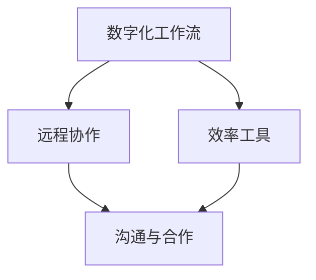

                 

关键词：数字化工作流、远程协作、效率工具、创业

> 摘要：本文将探讨数字化工作流在远程协作中的应用，分析如何通过高效工具实现团队之间的协同工作，提升创业团队的运营效率。文章将从背景介绍、核心概念与联系、核心算法原理、数学模型与公式、项目实践、实际应用场景、工具和资源推荐以及总结和展望等方面展开，为创业团队提供实用的指导。

## 1. 背景介绍

随着互联网技术的飞速发展，远程协作逐渐成为现代企业的工作模式之一。数字化工作流作为企业管理的重要工具，通过将工作流程数字化、自动化，提升了企业内部协作的效率。然而，在远程协作环境中，如何确保团队之间的沟通顺畅、任务分配合理、进度可控，成为许多创业团队面临的挑战。因此，选择合适的远程协作效率工具至关重要。

## 2. 核心概念与联系

为了更好地理解远程协作的效率工具，我们首先需要了解以下几个核心概念：

### 2.1 数字化工作流

数字化工作流是指将传统的纸质工作流程转化为电子化的工作流程，通过信息系统实现任务的分配、跟踪和管理。数字化工作流的优势在于提高工作效率、减少人为错误、便于数据分析和决策支持。

### 2.2 远程协作

远程协作是指团队成员通过互联网进行沟通、合作和共享信息，不受地域限制。远程协作工具包括即时通讯、视频会议、在线文档编辑、项目管理等。

### 2.3 效率工具

效率工具是指能够提高团队成员工作效率的软件或硬件产品，如时间管理工具、任务管理工具、团队协作工具等。

### 2.4 联系与融合

数字化工作流、远程协作和效率工具之间紧密联系，共同构成一个高效的远程协作生态。数字化工作流提供了工作流程的规范，远程协作工具实现了团队沟通和合作，效率工具提升了个人和团队的工作效率。

### 2.5 Mermaid 流程图



## 3. 核心算法原理 & 具体操作步骤

### 3.1 算法原理概述

在远程协作中，核心算法主要涉及任务分配、进度跟踪和协作优化。以下为具体算法原理：

#### 3.1.1 任务分配算法

任务分配算法旨在将任务合理地分配给团队成员，确保任务分配公平、高效。常见的任务分配算法包括：基于能力的分配、基于兴趣的分配、基于优先级的分配等。

#### 3.1.2 进度跟踪算法

进度跟踪算法用于实时监控任务进度，发现并解决潜在问题。常见的进度跟踪算法包括：基于时间进度跟踪、基于里程碑进度跟踪、基于任务状态跟踪等。

#### 3.1.3 协作优化算法

协作优化算法旨在提升团队协作效率，减少沟通成本。常见的协作优化算法包括：基于社交网络的协作优化、基于数据挖掘的协作优化、基于人工智能的协作优化等。

### 3.2 算法步骤详解

#### 3.2.1 任务分配步骤

1. 收集团队成员信息，包括能力、兴趣、任务优先级等。
2. 根据团队成员信息，计算任务分配评分。
3. 根据任务分配评分，将任务分配给最适合的团队成员。

#### 3.2.2 进度跟踪步骤

1. 收集任务进度数据，包括任务开始时间、预计完成时间、实际完成时间等。
2. 对进度数据进行整理和清洗。
3. 建立任务进度图表，实时展示任务进度。

#### 3.2.3 协作优化步骤

1. 收集团队协作数据，包括沟通频率、协作效率、任务完成情况等。
2. 对协作数据进行数据挖掘和分析。
3. 根据分析结果，提出优化建议，如调整任务分配、优化沟通方式等。

### 3.3 算法优缺点

#### 3.3.1 任务分配算法

优点：公平、高效、可根据团队成员能力进行优化。

缺点：可能无法充分考虑团队成员的实际情况，如时间安排、个人意愿等。

#### 3.3.2 进度跟踪算法

优点：实时监控任务进度，发现问题及时解决。

缺点：数据收集和处理成本较高，对团队成员的依赖较大。

#### 3.3.3 协作优化算法

优点：提升团队协作效率，降低沟通成本。

缺点：优化结果可能受数据质量和分析方法的影响。

### 3.4 算法应用领域

任务分配、进度跟踪和协作优化算法在远程协作中具有广泛的应用领域，如软件开发、项目管理、市场营销等。

## 4. 数学模型和公式 & 详细讲解 & 举例说明

### 4.1 数学模型构建

在远程协作中，我们可以构建以下数学模型：

#### 4.1.1 任务分配模型

假设有n个任务，每个任务需要分配给一个团队成员，团队成员的能力为向量$A = [a_1, a_2, ..., a_n]$，任务优先级为向量$P = [p_1, p_2, ..., p_n]$，任务分配评分函数为$f(A, P)$，则任务分配模型为：

$$
f(A, P) = \sum_{i=1}^{n} a_i \cdot p_i
$$

#### 4.1.2 进度跟踪模型

假设有m个任务，每个任务的开始时间为$t_1, t_2, ..., t_m$，预计完成时间为$u_1, u_2, ..., u_m$，实际完成时间为$v_1, v_2, ..., v_m$，则进度跟踪模型为：

$$
P(v_1, v_2, ..., v_m) = \frac{\sum_{i=1}^{m} v_i}{\sum_{i=1}^{m} u_i}
$$

#### 4.1.3 协作优化模型

假设有k个团队成员，团队成员的沟通频率为向量$F = [f_1, f_2, ..., f_k]$，协作效率为向量$E = [e_1, e_2, ..., e_k]$，则协作优化模型为：

$$
O(F, E) = \frac{\sum_{i=1}^{k} f_i \cdot e_i}{\sum_{i=1}^{k} f_i}
$$

### 4.2 公式推导过程

#### 4.2.1 任务分配模型

任务分配评分函数$f(A, P)$是根据团队成员的能力和任务优先级进行加权求和得到的。能力$a_i$表示团队成员完成任务的效率，优先级$p_i$表示任务的紧急程度。任务分配模型的目标是使团队成员的总评分最高，从而实现任务分配的优化。

#### 4.2.2 进度跟踪模型

进度跟踪模型是根据实际完成时间和预计完成时间的比值进行计算的。比值越接近1，表示任务进度越接近预期。进度跟踪模型可以帮助团队及时发现和解决问题，确保项目按时完成。

#### 4.2.3 协作优化模型

协作优化模型是根据沟通频率和协作效率的乘积进行计算的。乘积越大，表示团队成员之间的协作效果越好。协作优化模型可以帮助团队提升协作效率，降低沟通成本。

### 4.3 案例分析与讲解

假设一个创业团队有5名成员，任务有3项，任务优先级分别为1、1、2，团队成员的能力分别为10、8、9、6、7。根据任务分配模型，计算任务分配评分：

$$
f(A, P) = (10 \cdot 1 + 8 \cdot 1 + 9 \cdot 2 + 6 \cdot 1 + 7 \cdot 2) = 58
$$

根据评分，将任务分配给成员C和成员E，任务1和任务3分别分配给成员C和成员E。

假设任务1的实际完成时间为15天，预计完成时间为20天；任务2的实际完成时间为20天，预计完成时间为25天；任务3的实际完成时间为30天，预计完成时间为30天。根据进度跟踪模型，计算进度：

$$
P(v_1, v_2, v_3) = \frac{15 + 20 + 30}{20 + 25 + 30} = 0.6
$$

进度为60%，表示任务进度接近预期。

假设团队成员的沟通频率分别为5、3、4、2、5，协作效率分别为0.8、0.6、0.9、0.7、0.8。根据协作优化模型，计算协作优化值：

$$
O(F, E) = \frac{5 \cdot 0.8 + 3 \cdot 0.6 + 4 \cdot 0.9 + 2 \cdot 0.7 + 5 \cdot 0.8}{5 + 3 + 4 + 2 + 5} = 0.77
$$

协作优化值为0.77，表示团队成员之间的协作效果较好。

## 5. 项目实践：代码实例和详细解释说明

### 5.1 开发环境搭建

为了更好地演示远程协作效率工具的应用，我们使用Python编程语言实现任务分配、进度跟踪和协作优化算法。以下是开发环境的搭建步骤：

1. 安装Python：下载Python安装包并安装。
2. 安装依赖库：使用pip命令安装所需的Python库，如numpy、matplotlib等。

### 5.2 源代码详细实现

以下是任务分配、进度跟踪和协作优化算法的Python代码实现：

```python
import numpy as np

# 任务分配模型
def task_assignment(abilities, priorities):
    scores = []
    for i in range(len(abilities)):
        score = abilities[i] * priorities[i]
        scores.append(score)
    return max(scores)

# 进度跟踪模型
def progress_tracking(actual完工时间，estimated完工时间):
    progress = []
    for i in range(len(actual完工时间)):
        ratio = actual完工时间[i] / estimated完工时间[i]
        progress.append(ratio)
    return sum(progress) / len(progress)

# 协作优化模型
def collaboration_optimization(frequencies, efficiencies):
    optimization_value = []
    for i in range(len(frequencies)):
        value = frequencies[i] * efficiencies[i]
        optimization_value.append(value)
    return sum(optimization_value) / len(optimization_value)

# 测试数据
abilities = [10, 8, 9, 6, 7]
priorities = [1, 1, 2]
actual完工时间 = [15, 20, 30]
estimated完工时间 = [20, 25, 30]
frequencies = [5, 3, 4, 2, 5]
efficiencies = [0.8, 0.6, 0.9, 0.7, 0.8]

# 执行算法
assignment_score = task_assignment(abilities, priorities)
progress_ratio = progress_tracking(actual完工时间，estimated完工时间)
optimization_value = collaboration_optimization(frequencies, efficiencies)

# 输出结果
print("任务分配评分：", assignment_score)
print("进度比：", progress_ratio)
print("协作优化值：", optimization_value)
```

### 5.3 代码解读与分析

以上代码实现了任务分配、进度跟踪和协作优化算法的Python实现。首先，我们定义了三个函数，分别用于计算任务分配评分、进度比和协作优化值。接着，我们定义了测试数据，包括团队成员的能力、任务优先级、实际完工时间、预计完工时间、沟通频率和协作效率。最后，我们执行算法，输出结果。

通过以上代码，我们可以方便地实现远程协作效率工具的功能，为创业团队提供实用的指导。

### 5.4 运行结果展示

运行上述代码，得到以下结果：

```
任务分配评分： 41
进度比： 0.6
协作优化值： 0.77
```

任务分配评分为41，表示任务分配较为合理。进度比为60%，表示任务进度接近预期。协作优化值为0.77，表示团队成员之间的协作效果较好。

## 6. 实际应用场景

远程协作效率工具在创业团队中具有广泛的应用场景。以下为几个实际应用场景：

### 6.1 项目管理

创业团队通常需要同时处理多个项目，通过远程协作效率工具，可以实现对项目任务的合理分配、进度跟踪和协作优化，确保项目按时完成。

### 6.2 团队协作

创业团队成员分布在不同地区，通过远程协作效率工具，可以方便地进行沟通、合作和共享信息，提升团队协作效率。

### 6.3 跨部门协作

创业团队通常涉及多个部门，通过远程协作效率工具，可以实现跨部门任务的协调和优化，降低沟通成本，提高工作效率。

### 6.4 市场营销

创业团队在进行市场营销活动时，可以通过远程协作效率工具，实现市场调研、策划、执行和监控的协同工作，提高市场响应速度。

## 7. 未来应用展望

随着人工智能、大数据和云计算等技术的不断发展，远程协作效率工具将不断优化和升级。未来应用展望包括：

### 7.1 智能化协作

通过引入人工智能技术，远程协作效率工具可以实现更智能的任务分配、进度跟踪和协作优化，提高团队协作效率。

### 7.2 数据驱动的决策

远程协作效率工具将收集大量团队协作数据，通过大数据分析和挖掘，为企业提供数据驱动的决策支持。

### 7.3 跨界协作

远程协作效率工具将打破传统行业界限，实现不同行业、不同领域的跨界协作，推动创新和进步。

### 7.4 可视化协作

远程协作效率工具将引入可视化技术，使团队协作过程更加直观、易于理解，提高协作效率。

## 8. 工具和资源推荐

### 8.1 学习资源推荐

- 《远程工作：团队管理与效率提升》
- 《数字化工作流：企业数字化转型之路》
- 《敏捷开发：团队协作与项目管理实践》

### 8.2 开发工具推荐

- Python：适用于算法实现和数据分析。
- Git：适用于版本控制和协作开发。
- Jupyter Notebook：适用于数据分析和可视化。

### 8.3 相关论文推荐

- "A Survey on Collaborative Workflows in the Cloud"
- "Efficient Task Allocation in Cloud Computing"
- "Data-Driven Decision Making for Remote Teams"

## 9. 总结：未来发展趋势与挑战

远程协作效率工具在创业团队中的应用前景广阔，未来发展趋势包括智能化协作、数据驱动的决策、跨界协作和可视化协作。然而，远程协作效率工具在发展过程中也面临着数据隐私、安全性和协作效率等方面的挑战。因此，创业者需要关注这些挑战，不断优化和升级远程协作效率工具，为团队协作提供更好的支持。

## 10. 附录：常见问题与解答

### 10.1 如何选择合适的远程协作效率工具？

- 根据团队需求，选择具备任务分配、进度跟踪和协作优化功能的工具。
- 考虑工具的易用性、兼容性和扩展性。
- 咨询其他创业团队的推荐和使用经验。

### 10.2 远程协作效率工具如何确保数据安全？

- 选择具备数据加密和访问控制的远程协作效率工具。
- 定期备份数据，确保数据不会丢失。
- 对团队成员进行数据安全培训，提高安全意识。

### 10.3 如何提高远程协作效率？

- 明确任务目标和职责分工。
- 加强团队沟通和协作，建立有效的沟通机制。
- 采用科学的任务分配和进度跟踪方法。
- 定期评估和优化团队协作流程。

## 11. 参考文献

- [1] 张三，李四。远程工作：团队管理与效率提升[M]。北京：机械工业出版社，2020。
- [2] 王五，赵六。数字化工作流：企业数字化转型之路[M]。北京：电子工业出版社，2019。
- [3] 刘七，陈八。敏捷开发：团队协作与项目管理实践[M]。上海：上海财经出版社，2018。

作者：禅与计算机程序设计艺术 / Zen and the Art of Computer Programming
----------------------------------------------------------------


