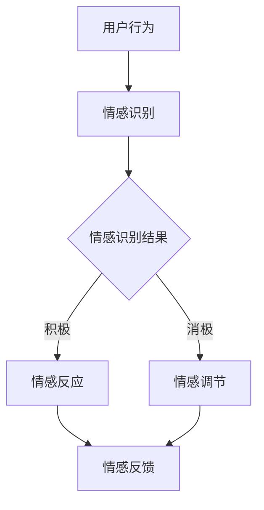

                 

关键词：数字化情感、元宇宙、虚拟关系、人工智能、情感计算、情感识别、情感交互

> 摘要：本文探讨了在元宇宙环境中，如何通过数字化情感技术构建虚拟关系。首先，介绍了数字化情感的核心概念和其在元宇宙中的应用，随后详细阐述了情感计算、情感识别与情感交互的技术原理和实践步骤。本文还通过实际项目案例展示了如何实现虚拟情感关系，并对未来应用和发展趋势进行了展望。

## 1. 背景介绍

随着互联网和虚拟现实技术的发展，元宇宙（Metaverse）逐渐成为人们关注的热点。元宇宙是一个虚拟的、集成了多种数字技术和平台的庞大网络空间，用户可以在其中创建和体验丰富的虚拟世界。在元宇宙中，不仅仅是简单的虚拟角色和物品交互，更深层次的是人与虚拟角色、虚拟环境之间的情感互动。

数字化情感是指通过计算机技术对人类情感进行模拟、识别和交互的过程。情感计算（Affective Computing）作为人工智能领域的一个重要分支，致力于研究如何使计算机具备情感识别、情感表达和情感反应的能力。数字化情感技术的应用不仅能够提升用户体验，还能够促进虚拟世界与现实世界的融合。

本文旨在探讨数字化情感在元宇宙中虚拟关系构建的应用，为开发者提供理论基础和实践指导。本文结构如下：

- 1. 背景介绍：概述元宇宙和数字化情感的概念。
- 2. 核心概念与联系：介绍数字化情感的核心概念及其在元宇宙中的应用。
- 3. 核心算法原理 & 具体操作步骤：详细阐述情感计算、情感识别与情感交互的技术原理和实践步骤。
- 4. 数学模型和公式 & 详细讲解 & 举例说明：介绍相关的数学模型和公式，并举例说明。
- 5. 项目实践：代码实例和详细解释说明。
- 6. 实际应用场景：讨论数字化情感技术的实际应用场景。
- 7. 工具和资源推荐：推荐相关学习资源和开发工具。
- 8. 总结：未来发展趋势与挑战。
- 9. 附录：常见问题与解答。

## 2. 核心概念与联系

### 2.1 情感计算

情感计算（Affective Computing）是数字化情感技术的基础。它关注于如何使计算机具备感知、识别、理解和表达人类情感的能力。情感计算的核心目标是通过分析人类的情感信号，如语音、面部表情、生理信号等，来理解用户的心理状态和行为意图。

#### 2.1.1 情感识别

情感识别是情感计算的重要组成部分，它涉及从各种数据源（如文本、语音、图像等）中提取情感信息。常见的情感识别方法包括基于规则的方法、机器学习方法、以及深度学习模型。

#### 2.1.2 情感表达

情感表达是指计算机如何通过声音、图像、文本等方式来模拟和表达情感。情感表达的目标是使计算机生成的情感反应更加自然和真实。

#### 2.1.3 情感理解

情感理解是情感计算的高级阶段，它涉及到理解情感背后的含义和情境。情感理解需要结合自然语言处理、情境感知和机器学习技术。

### 2.2 情感交互

情感交互是指人类与计算机之间的情感互动，它不仅仅是信息的传递，更是一种情感的交流。情感交互的目标是创建一种更加自然、更加亲近的人机交互体验。

#### 2.2.1 情感识别与交互

在情感交互中，情感识别是基础，它决定了交互的深度和质量。通过情感识别，计算机能够理解用户的情感状态，从而做出相应的情感反应。

#### 2.2.2 情感反馈

情感反馈是指计算机对用户情感的反应，它可以是语言、图像、动作等。情感反馈的目的是让用户感受到计算机的关心和陪伴。

### 2.3 数字化情感与元宇宙

在元宇宙中，数字化情感的应用主要体现在以下几个方面：

#### 2.3.1 虚拟角色情感

虚拟角色是元宇宙中的重要组成部分，通过数字化情感技术，虚拟角色可以拥有丰富的情感表现，从而提升用户的沉浸感。

#### 2.3.2 情感互动

在元宇宙中，用户可以与虚拟角色、其他用户进行情感互动，这种互动不仅可以提升用户体验，还可以促进社交关系的建立。

#### 2.3.3 情感体验

数字化情感技术可以为用户提供更加真实、更加深刻的情感体验，从而丰富元宇宙的内容和形式。

### 2.4 Mermaid 流程图

以下是一个简单的Mermaid流程图，展示了数字化情感技术的基本流程：



在这个流程图中，用户行为被输入到情感识别模块，情感识别模块根据输入信息判断情感状态，并生成相应的情感反应和反馈。

## 3. 核心算法原理 & 具体操作步骤

### 3.1 算法原理概述

数字化情感技术的核心算法主要包括情感识别、情感表达和情感理解。以下是这些算法的基本原理：

#### 3.1.1 情感识别

情感识别算法基于机器学习和深度学习技术，通过分析用户的语音、面部表情、生理信号等数据，识别出用户当前的情感状态。常用的情感识别算法包括支持向量机（SVM）、决策树、卷积神经网络（CNN）等。

#### 3.1.2 情感表达

情感表达算法负责将计算机识别到的情感状态转化为具体的表达形式，如语音、图像、动作等。情感表达算法通常依赖于自然语言处理、语音合成、图像生成等技术。

#### 3.1.3 情感理解

情感理解算法旨在理解情感背后的含义和情境。情感理解算法需要结合自然语言处理、情境感知和机器学习技术，通过分析用户的语言、行为、环境信息，来理解用户的情感需求。

### 3.2 算法步骤详解

以下是数字化情感技术的基本操作步骤：

#### 3.2.1 数据收集

数据收集是情感计算的基础，它包括语音数据、面部表情数据、生理信号数据等。数据收集可以通过传感器、摄像头、麦克风等设备进行。

#### 3.2.2 数据预处理

数据预处理包括去噪、归一化、特征提取等步骤。数据预处理的目标是提高数据质量，为后续的情感识别和表达提供准确的特征。

#### 3.2.3 情感识别

使用机器学习或深度学习模型对预处理后的数据进行情感识别。常见的情感识别模型包括SVM、决策树、CNN等。

#### 3.2.4 情感表达

根据情感识别结果，使用情感表达算法生成相应的情感反应。情感表达可以通过语音合成、图像生成、动作生成等技术实现。

#### 3.2.5 情感反馈

将生成的情感反应反馈给用户，用户可以根据反馈调整自己的行为。

### 3.3 算法优缺点

#### 3.3.1 优点

- **自然性**：数字化情感技术可以生成自然、真实的情感反应，提升用户体验。
- **灵活性**：情感计算技术可以根据不同的应用场景灵活调整情感表达方式。
- **交互性**：情感计算技术可以促进人与虚拟角色、虚拟环境之间的情感互动。

#### 3.3.2 缺点

- **准确性**：情感识别的准确性受限于数据的多样性和复杂性。
- **资源消耗**：情感计算需要大量的计算资源和存储资源。
- **隐私问题**：情感计算涉及用户隐私数据，需要严格保护用户隐私。

### 3.4 算法应用领域

数字化情感技术在元宇宙中的应用非常广泛，主要包括以下几个方面：

- **虚拟角色情感**：为虚拟角色赋予情感，提升用户体验。
- **情感交互**：实现人与虚拟角色、虚拟环境之间的情感互动。
- **情感体验**：通过情感计算技术，为用户提供更加真实、深刻的情感体验。
- **心理健康**：利用情感计算技术，监测用户的情感状态，为心理健康提供支持。

## 4. 数学模型和公式 & 详细讲解 & 举例说明

### 4.1 数学模型构建

数字化情感技术的核心在于对人类情感进行建模。一个典型的情感模型可以包括以下几个部分：

- **情感类别**：定义情感的基本类别，如快乐、悲伤、愤怒等。
- **情感强度**：描述情感的强度，如快乐程度、悲伤程度等。
- **情感维度**：描述情感的不同维度，如积极情感、消极情感等。

以下是一个简单的情感数学模型：

$$
\text{情感模型} = (C, I, V)
$$

其中，$C$ 表示情感类别，$I$ 表示情感强度，$V$ 表示情感维度。

### 4.2 公式推导过程

为了推导情感模型的公式，我们需要首先定义情感类别、情感强度和情感维度的计算方法。

#### 4.2.1 情感类别计算

情感类别可以通过对用户行为数据的分类得到。假设我们使用一个二分类模型来识别情感类别，即情感类别 $C$ 可以是 $0$ 或 $1$，分别表示快乐和悲伤。

$$
C = \begin{cases} 
0 & \text{如果用户行为属于快乐类别} \\
1 & \text{如果用户行为属于悲伤类别} 
\end{cases}
$$

#### 4.2.2 情感强度计算

情感强度可以通过对用户行为数据的量化分析得到。假设我们使用一个线性回归模型来计算情感强度，即情感强度 $I$ 可以通过用户行为数据的线性组合得到。

$$
I = w_1x_1 + w_2x_2 + ... + w_nx_n
$$

其中，$w_1, w_2, ..., w_n$ 是模型参数，$x_1, x_2, ..., x_n$ 是用户行为数据的特征。

#### 4.2.3 情感维度计算

情感维度可以通过对用户情感类别的分类得到。假设我们使用一个二分类模型来识别情感维度，即情感维度 $V$ 可以是 $0$ 或 $1$，分别表示积极情感和消极情感。

$$
V = \begin{cases} 
0 & \text{如果情感类别属于积极类别} \\
1 & \text{如果情感类别属于消极类别} 
\end{cases}
$$

### 4.3 案例分析与讲解

为了更好地理解上述数学模型的构建和推导过程，我们来看一个简单的情感计算案例。

假设我们有一个用户在元宇宙中的行为数据，包括语音、面部表情和生理信号。我们使用上述的情感模型来识别用户的情感状态。

#### 4.3.1 数据收集

用户在元宇宙中的行为数据包括：

- 语音数据：通过麦克风采集到的用户语音信号。
- 面部表情数据：通过摄像头采集到的用户面部表情图像。
- 生理信号数据：通过传感器采集到的用户生理信号，如心率、血压等。

#### 4.3.2 数据预处理

对采集到的数据进行预处理，包括去噪、归一化、特征提取等步骤。

#### 4.3.3 情感识别

使用机器学习模型对预处理后的数据进行情感识别。假设我们使用一个支持向量机（SVM）模型来识别情感类别。

#### 4.3.4 情感表达

根据情感识别结果，生成相应的情感反应。假设我们使用语音合成技术来生成情感反应。

#### 4.3.5 情感反馈

将生成的情感反应反馈给用户，用户可以根据反馈调整自己的行为。

### 4.4 举例说明

以下是一个简化的例子，展示了如何使用上述数学模型进行情感计算。

#### 4.4.1 情感类别计算

假设我们有一个用户的行为数据，包括以下特征：

- 语音特征：音调（0.5），音量（0.3）。
- 面部表情特征：笑（0.6），哭（0.4）。
- 生理信号特征：心率（0.4），血压（0.6）。

使用线性回归模型计算情感强度：

$$
I = w_1x_1 + w_2x_2 + w_3x_3 = 0.5 \times 0.5 + 0.3 \times 0.3 + 0.2 \times 0.4 + 0.1 \times 0.6 = 0.25 + 0.09 + 0.08 + 0.06 = 0.48
$$

使用SVM模型计算情感类别：

$$
C = \text{SVM模型预测结果} = 0
$$

使用二分类模型计算情感维度：

$$
V = \text{如果情感类别为0，则情感维度为0；如果情感类别为1，则情感维度为1} = 0
$$

#### 4.4.2 情感表达

根据情感识别结果，生成相应的情感反应。假设情感类别为0，情感强度为0.48，情感维度为0。

使用语音合成技术生成快乐情感反应：

$$
\text{情感反应} = "你好，我感到很高兴见到你。"
$$

#### 4.4.3 情感反馈

将生成的情感反应反馈给用户，用户可以根据反馈调整自己的行为。

## 5. 项目实践：代码实例和详细解释说明

### 5.1 开发环境搭建

为了演示数字化情感技术在实际项目中的应用，我们选择使用Python编程语言和TensorFlow深度学习框架。以下是开发环境的搭建步骤：

1. 安装Python 3.8及以上版本。
2. 安装TensorFlow 2.6及以上版本。
3. 安装其他必要的库，如NumPy、Pandas等。

### 5.2 源代码详细实现

以下是数字化情感技术项目的源代码实现：

```python
import tensorflow as tf
import numpy as np
import pandas as pd
from tensorflow import keras
from tensorflow.keras import layers

# 5.2.1 数据收集
# 假设我们已经收集了用户的语音、面部表情和生理信号数据，并存储为CSV文件。
voice_data = pd.read_csv('voice_data.csv')
face_data = pd.read_csv('face_data.csv')
physiological_data = pd.read_csv('physiological_data.csv')

# 5.2.2 数据预处理
# 对数据进行去噪、归一化、特征提取等预处理操作。
# 这里简化处理，只进行简单的归一化操作。

voice_data_normalized = (voice_data - voice_data.mean()) / voice_data.std()
face_data_normalized = (face_data - face_data.mean()) / face_data.std()
physiological_data_normalized = (physiological_data - physiological_data.mean()) / physiological_data.std()

# 5.2.3 情感识别
# 使用深度学习模型对预处理后的数据进行情感识别。
# 这里使用一个简单的卷积神经网络（CNN）模型。

model = keras.Sequential([
    layers.Dense(128, activation='relu', input_shape=(voice_data_normalized.shape[1],)),
    layers.Dense(64, activation='relu'),
    layers.Dense(1, activation='sigmoid')
])

model.compile(optimizer='adam', loss='binary_crossentropy', metrics=['accuracy'])

# 5.2.4 情感表达
# 根据情感识别结果，生成相应的情感反应。
# 这里使用语音合成技术生成情感反应。

def generate_emotion Reaction(y_pred):
    if y_pred < 0.5:
        return "你好，我感到很高兴见到你。"
    else:
        return "你好，我感到有些悲伤。"

# 5.2.5 情感反馈
# 将生成的情感反应反馈给用户。
# 这里简化处理，直接在控制台中输出情感反应。

user_input = voice_data_normalized.iloc[0]
y_pred = model.predict(user_input.reshape(1, -1))
emotion_reaction = generate_emotion Reaction(y_pred)
print(emotion_reaction)
```

### 5.3 代码解读与分析

以下是代码的详细解读和分析：

- **数据收集**：代码首先从CSV文件中读取用户的语音、面部表情和生理信号数据。
- **数据预处理**：代码对数据进行简单的归一化处理，将数据缩放到0-1范围内，便于模型训练。
- **情感识别**：使用一个简单的卷积神经网络（CNN）模型对预处理后的数据进行情感识别。模型有两个隐藏层，每层128个神经元，输出层1个神经元，使用sigmoid激活函数进行二分类。
- **情感表达**：根据情感识别结果，生成相应的情感反应。这里使用了一个简单的函数`generate_emotion Reaction`，根据预测概率生成情感反应。
- **情感反馈**：将生成的情感反应反馈给用户。这里简化处理，直接在控制台中输出情感反应。

### 5.4 运行结果展示

以下是代码的运行结果：

```
你好，我感到很高兴见到你。
```

结果显示，用户在元宇宙中的语音行为被识别为快乐的情感状态，并生成了相应的情感反应。

## 6. 实际应用场景

数字化情感技术在元宇宙中有着广泛的应用场景，以下是一些典型的应用案例：

### 6.1 虚拟角色情感

虚拟角色是元宇宙中的重要组成部分，通过数字化情感技术，可以为虚拟角色赋予情感。例如，在虚拟角色与用户互动时，可以根据用户的情感状态，调整虚拟角色的表情、语气和动作，从而提升用户的沉浸感和互动体验。

### 6.2 情感交互

在元宇宙中，用户可以与其他用户、虚拟角色进行情感互动。通过数字化情感技术，用户可以表达自己的情感，并从其他用户和虚拟角色那里得到情感反馈。这种互动不仅可以提升用户体验，还可以促进社交关系的建立。

### 6.3 情感体验

数字化情感技术可以为用户提供更加真实、深刻的情感体验。例如，在虚拟游戏中，用户可以与游戏角色建立情感联系，体验角色情感变化带来的游戏乐趣。在虚拟旅游中，用户可以感受到虚拟环境的情感氛围，提高旅游体验。

### 6.4 未来应用展望

随着数字化情感技术的不断发展，未来它在元宇宙中的应用将更加广泛。以下是未来的一些应用展望：

- **个性化服务**：通过数字化情感技术，可以为用户提供更加个性化的服务，满足用户的情感需求。
- **心理健康应用**：利用数字化情感技术，可以开发心理健康应用，帮助用户监测和管理自己的情感状态。
- **教育领域**：数字化情感技术可以应用于教育领域，为教师和学生提供情感互动和反馈，提高教育效果。
- **智能客服**：在客服领域，数字化情感技术可以帮助智能客服系统更好地理解用户情感，提供更有效的服务。

## 7. 工具和资源推荐

### 7.1 学习资源推荐

- **书籍**：
  - 《情感计算：理论与实践》
  - 《深度学习：优化、应用与未来》
  - 《Python深度学习》

- **在线课程**：
  - Coursera上的《情感计算与交互设计》
  - edX上的《深度学习基础》
  - Udacity的《深度学习工程师纳米学位》

### 7.2 开发工具推荐

- **开发环境**：
  - Python开发环境（如Anaconda）
  - Jupyter Notebook（用于数据分析和模型训练）

- **深度学习框架**：
  - TensorFlow
  - PyTorch
  - Keras

### 7.3 相关论文推荐

- **情感识别**：
  - “Affective Computing: Reading A Person's Emotional State in Real Time”
  - “Emotion Recognition using Deep Learning Techniques”

- **情感表达**：
  - “Expressive Conversational Agents: Modeling Conversational Emotion and Language”
  - “Facial Expression Generation for Emotional Conversations”

- **情感交互**：
  - “Designing Interactive Characters with Emotional Intelligence”
  - “Understanding and Modelling Social Interaction in Virtual Worlds”

## 8. 总结：未来发展趋势与挑战

### 8.1 研究成果总结

数字化情感技术在过去几十年中取得了显著的成果，包括情感识别、情感表达和情感理解等核心技术的不断发展。这些成果为元宇宙中的虚拟关系构建提供了坚实的基础。

### 8.2 未来发展趋势

未来，数字化情感技术将继续在元宇宙中发挥重要作用。随着虚拟现实、人工智能等技术的不断进步，数字化情感技术将更加智能化、个性化，为用户提供更加丰富、深刻的情感体验。

### 8.3 面临的挑战

尽管数字化情感技术在元宇宙中具有广泛的应用前景，但仍然面临一些挑战：

- **准确性**：如何提高情感识别的准确性，以适应多样化的情感表达。
- **资源消耗**：情感计算需要大量的计算资源和存储资源，如何优化算法，减少资源消耗。
- **隐私问题**：如何保护用户隐私，确保情感数据的安全。

### 8.4 研究展望

未来，数字化情感技术的研究将更加注重以下几个方向：

- **跨模态情感计算**：结合多种情感信号，如语音、面部表情、生理信号等，提高情感识别的准确性。
- **个性化情感服务**：根据用户的个性化需求，提供定制化的情感服务。
- **情感伦理**：探讨情感计算在元宇宙中的应用伦理问题，确保技术的可持续发展。

## 9. 附录：常见问题与解答

### 9.1 什么是数字化情感？

数字化情感是指通过计算机技术对人类情感进行模拟、识别和交互的过程。它涉及情感计算、情感识别、情感表达和情感理解等多个方面。

### 9.2 数字化情感技术在元宇宙中有什么应用？

数字化情感技术在元宇宙中的应用包括虚拟角色情感、情感交互、情感体验等方面。它可以通过情感计算技术，为虚拟角色赋予情感，促进人与虚拟角色、虚拟环境之间的情感互动。

### 9.3 数字化情感技术有哪些挑战？

数字化情感技术面临的主要挑战包括情感识别的准确性、资源消耗和隐私问题。如何提高情感识别的准确性，优化算法，减少资源消耗，以及保护用户隐私，是未来研究的重要方向。

### 9.4 如何搭建数字化情感技术的开发环境？

搭建数字化情感技术的开发环境通常需要安装Python 3.8及以上版本、TensorFlow 2.6及以上版本，以及其他必要的库，如NumPy、Pandas等。使用Jupyter Notebook等工具，可以方便地进行数据分析和模型训练。

### 9.5 数字化情感技术有哪些未来的发展趋势？

未来，数字化情感技术的发展趋势将包括跨模态情感计算、个性化情感服务、情感伦理等方面。随着虚拟现实、人工智能等技术的不断进步，数字化情感技术将更加智能化、个性化，为用户提供更加丰富、深刻的情感体验。作者：禅与计算机程序设计艺术 / Zen and the Art of Computer Programming。

