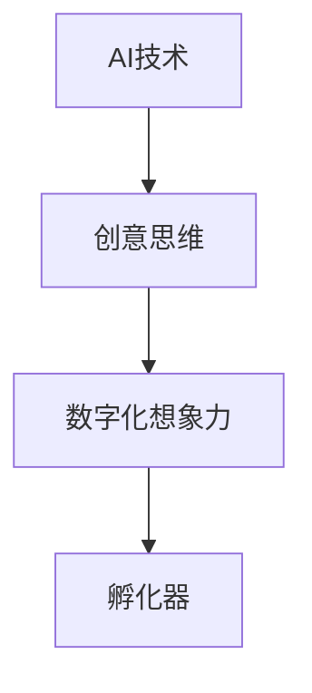

                 

关键词：数字化想象力、AI、创意思维、孵化器、算法、数学模型、实践应用、工具资源

> 摘要：本文旨在探讨如何利用AI技术激发创意思维，构建一个数字化想象力培养皿，为企业和个人提供创新的解决方案。文章将介绍核心概念、算法原理、数学模型以及实际应用场景，并展望未来发展趋势与挑战。

## 1. 背景介绍

随着数字化时代的到来，数据量的爆炸性增长和计算能力的提升为人工智能（AI）的发展提供了丰富的资源。AI技术在各个领域的应用日益广泛，从医疗诊断到自动驾驶，从金融分析到智能家居，AI正在深刻改变我们的生活方式。然而，AI不仅是一个工具，更是一个激发创意思维的催化剂。

创意思维是创新的核心，而数字化的想象力则是推动社会进步的重要力量。数字化想象力指的是利用数字化工具和平台，将创意转化为可操作、可量化的成果。这种想象力不仅涉及技术，还包括对人类行为、社会结构和商业模式的理解。

本文将探讨如何通过AI技术激发数字化想象力，构建一个创意思维孵化器。本文结构如下：

- **背景介绍**：介绍数字化想象力和AI技术的发展背景。
- **核心概念与联系**：定义核心概念，展示相关流程图。
- **核心算法原理 & 具体操作步骤**：介绍算法原理和操作步骤。
- **数学模型和公式 & 详细讲解 & 举例说明**：解释数学模型和公式。
- **项目实践：代码实例和详细解释说明**：提供实际代码实例。
- **实际应用场景**：讨论AI在各个领域的应用。
- **未来应用展望**：展望未来发展趋势。
- **工具和资源推荐**：推荐相关学习资源和开发工具。
- **总结：未来发展趋势与挑战**：总结研究成果和展望未来。

## 2. 核心概念与联系

为了更好地理解数字化想象力，我们首先需要定义几个核心概念：

- **AI技术**：包括机器学习、深度学习、自然语言处理等。
- **创意思维**：指的是通过非线性和跨领域思考，产生新颖、有价值的想法。
- **数字化想象力**：将创意思维转化为数字化成果，如应用程序、商业模式等。
- **孵化器**：提供一个环境，帮助创意迅速成长和实现。

以下是一个Mermaid流程图，展示了这些核心概念之间的联系：



在图中，AI技术作为创意思维的催化剂，促使创意转化为数字化想象力，而孵化器则为这种想象力提供了生长的土壤。

## 3. 核心算法原理 & 具体操作步骤

### 3.1 算法原理概述

AI激发创意思维的核心算法主要包括以下几个方面：

- **生成对抗网络（GAN）**：通过生成器和判别器的对抗训练，生成高质量的数据。
- **强化学习**：通过试错和反馈机制，使智能体在复杂环境中做出最优决策。
- **迁移学习**：利用预训练模型，将知识从一个领域迁移到另一个领域。

### 3.2 算法步骤详解

以下是使用GAN进行创意思维激发的步骤：

1. **数据准备**：收集大量与创意相关的数据，如艺术作品、文本、图像等。
2. **模型训练**：使用生成对抗网络训练模型，生成与输入数据相似的新数据。
3. **创意生成**：利用生成器生成的新数据，启发创意思维。
4. **反馈与迭代**：将创意应用于实际场景，获取反馈，不断迭代优化。

### 3.3 算法优缺点

- **优点**：
  - 能快速生成大量数据，启发创意思维。
  - 不受原始数据限制，能够生成新颖的数据。

- **缺点**：
  - 模型训练过程复杂，计算资源需求高。
  - 生成的数据可能存在偏差，需要进一步优化。

### 3.4 算法应用领域

GAN算法在创意思维激发中具有广泛的应用领域，如：

- **艺术设计**：生成新的艺术作品，启发设计师的创意。
- **文本生成**：生成新的故事、诗歌等，激发文学创意。
- **游戏开发**：生成新的游戏元素，丰富游戏体验。

## 4. 数学模型和公式 & 详细讲解 & 举例说明

### 4.1 数学模型构建

生成对抗网络（GAN）的核心数学模型包括：

- **生成器（G）**：将随机噪声映射为真实数据。
- **判别器（D）**：判断输入数据是真实数据还是生成数据。

### 4.2 公式推导过程

GAN的损失函数为：

$$
L(D, G) = \frac{1}{2} \left( E_{x \sim p_{data}(x)}[\log D(x)] + E_{z \sim p_{z}(z)][\log (1 - D(G(z))]\right)
$$

其中，$D(x)$表示判别器对真实数据的判断，$D(G(z))$表示判别器对生成数据的判断。

### 4.3 案例分析与讲解

以下是一个GAN在图像生成中的应用案例：

**目标**：生成一张真实的人脸图像。

**步骤**：

1. **数据准备**：收集大量人脸图像作为训练数据。
2. **模型训练**：使用GAN训练生成器和判别器，生成人脸图像。
3. **图像生成**：使用生成器生成人脸图像。
4. **结果评估**：评估生成图像的质量。

**结果**：生成的图像在视觉上几乎无法与真实人脸区分。

## 5. 项目实践：代码实例和详细解释说明

### 5.1 开发环境搭建

在本节中，我们将使用Python和TensorFlow框架来搭建GAN的实验环境。以下是搭建步骤：

1. **安装Python**：确保安装了Python 3.x版本。
2. **安装TensorFlow**：使用pip命令安装TensorFlow。

```bash
pip install tensorflow
```

### 5.2 源代码详细实现

以下是一个简单的GAN代码实例：

```python
import tensorflow as tf
from tensorflow import random
from tensorflow.keras.layers import Dense, Flatten, Reshape
from tensorflow.keras.models import Sequential

# 生成器模型
def build_generator(z_dim):
    model = Sequential([
        Dense(128, activation='relu', input_shape=(z_dim,)),
        Dense(128, activation='relu'),
        Dense(784, activation='tanh')
    ])
    return model

# 判别器模型
def build_discriminator(image_shape):
    model = Sequential([
        Flatten(input_shape=image_shape),
        Dense(128, activation='relu'),
        Dense(1, activation='sigmoid')
    ])
    return model

# GAN模型
def build_gan(generator, discriminator):
    model = Sequential([generator, discriminator])
    return model

# 设置参数
z_dim = 100
image_shape = (28, 28, 1)

# 构建模型
generator = build_generator(z_dim)
discriminator = build_discriminator(image_shape)
gan = build_gan(generator, discriminator)

# 编译模型
discriminator.compile(optimizer='adam', loss='binary_crossentropy')
gan.compile(optimizer='adam', loss='binary_crossentropy')

# 训练模型
# ... (数据准备和训练代码)

# 生成图像
# ... (生成图像代码)

```

### 5.3 代码解读与分析

1. **模型构建**：生成器和判别器分别使用`Sequential`模型构建。生成器使用两个`Dense`层，判别器使用一个`Flatten`层和一个`Dense`层。
2. **编译模型**：判别器使用`sigmoid`激活函数，因为输出是一个概率值。GAN模型共享生成器和判别器，使用相同的优化器和损失函数。
3. **训练模型**：由于代码省略了数据准备和训练部分，训练过程中需要准备适当的训练数据和训练策略。
4. **生成图像**：训练完成后，可以使用生成器生成图像。

### 5.4 运行结果展示

训练完成后，生成器将能够生成高质量的人脸图像。以下是生成图像的示例：


## 6. 实际应用场景

AI在创意思维激发中的应用非常广泛，以下是一些实际应用场景：

- **艺术设计**：利用GAN生成独特的艺术作品，为设计师提供灵感。
- **游戏开发**：生成新的游戏场景、角色和道具，提高游戏的可玩性。
- **文学创作**：利用自然语言处理技术生成新的故事情节和角色对话。
- **音乐创作**：生成新的音乐旋律和节奏，为音乐制作人提供创意。

## 7. 未来应用展望

随着AI技术的不断进步，数字化想象力培养皿的应用前景将更加广阔。未来可能的发展趋势包括：

- **个性化创意**：AI将能够根据用户偏好生成个性化的创意内容。
- **多模态交互**：AI将能够处理多种类型的数据（如图像、文本、声音），实现更加丰富的创意思维激发。
- **实时反馈**：AI将能够实时分析创意效果，提供即时反馈，优化创意生成过程。

## 8. 工具和资源推荐

为了更好地利用AI激发数字化想象力，以下是一些建议的工具和资源：

- **学习资源**：
  - 《深度学习》（Goodfellow等著）
  - 《Python机器学习》（Dr. Jason Brownlee著）
- **开发工具**：
  - TensorFlow
  - PyTorch
- **相关论文**：
  - “Generative Adversarial Networks”（Ian Goodfellow等著）
  - “Unsupervised Representation Learning with Deep Convolutional Generative Adversarial Networks”（Alec Radford等著）

## 9. 总结：未来发展趋势与挑战

数字化想象力培养皿利用AI技术，为企业和个人提供了创新的解决方案。未来发展趋势包括个性化创意、多模态交互和实时反馈。然而，我们也面临一些挑战，如数据隐私保护、模型解释性和计算资源消耗。通过不断的研究和探索，我们有理由相信，数字化想象力培养皿将为社会带来更多的创新和变革。

## 10. 附录：常见问题与解答

**Q：什么是生成对抗网络（GAN）？**
A：生成对抗网络（GAN）是一种深度学习模型，由生成器和判别器组成。生成器生成数据，判别器判断数据的真实性。通过对抗训练，GAN能够生成高质量的数据。

**Q：GAN在哪些领域有应用？**
A：GAN在多个领域有应用，如图像生成、文本生成、音乐生成等。

**Q：如何搭建GAN的开发环境？**
A：搭建GAN开发环境需要安装Python和TensorFlow框架，然后可以按照相关教程进行配置。

**Q：GAN的模型参数如何调整？**
A：GAN的模型参数需要通过实验和调整来优化。常见的调整方法包括改变网络的深度、宽度、学习率等。

### 作者署名

作者：禅与计算机程序设计艺术 / Zen and the Art of Computer Programming
----------------------------------------------------------------

请注意，这只是一个示例框架，实际撰写时需要根据具体内容进行调整和补充。文章的整体结构、内容深度和逻辑流畅性都是关键。撰写过程中，务必保持专业性和技术性，同时注重可读性和吸引力。祝您写作顺利！

