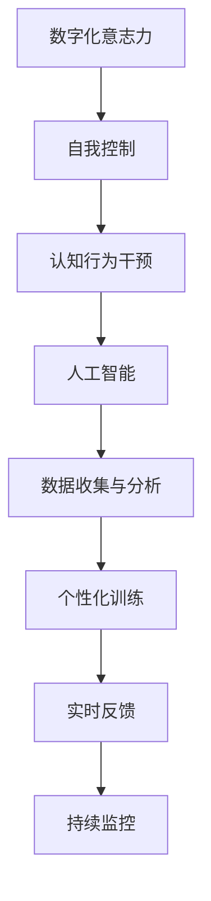

                 

关键词：数字化意志力、AI训练、自我控制、认知行为干预、算法原理、应用领域、未来展望

> 摘要：本文探讨了如何利用人工智能技术来增强自我控制，通过数字化意志力锻炼，实现更有效的认知行为干预。文章首先介绍了数字化意志力的背景和重要性，随后深入分析了AI在自我控制训练中的应用原理。通过具体的算法步骤、数学模型和项目实践，文章展示了如何将AI技术应用于自我控制训练，并对其未来发展趋势与挑战进行了展望。

## 1. 背景介绍

在当今社会，数字化技术的发展日新月异，人们的生活和工作方式也随之发生了翻天覆地的变化。尤其是在行为健康领域，数字化意志力的锻炼逐渐受到关注。数字化意志力是指个体在数字化环境中表现出的自我控制能力，包括抵制诱惑、专注力、时间管理和自我激励等方面。

传统的意志力锻炼方法主要依赖于个体的自律和毅力，而数字化意志力锻炼则利用了人工智能技术，通过个性化、实时反馈和持续监控等方式，为用户提供更有效的自我控制训练。这种训练不仅可以帮助个体提高意志力水平，还可以预防各种与意志力不足相关的健康问题，如肥胖、吸烟、酗酒等。

## 2. 核心概念与联系

为了深入理解数字化意志力锻炼，我们需要了解其中的核心概念和它们之间的联系。以下是相关的Mermaid流程图：



### 2.1 数字化意志力

数字化意志力是指个体在数字化环境中表现出的自我控制能力。这种能力对于现代社会中的信息过载、时间管理和行为决策等方面至关重要。

### 2.2 自我控制

自我控制是指个体在面对诱惑、挑战和压力时，能够合理调控自己的行为和情绪，以实现长期目标和价值。自我控制能力是数字化意志力的核心。

### 2.3 认知行为干预

认知行为干预是一种基于认知心理学和行为科学的治疗方法，旨在通过改变个体的认知方式和行为模式，改善心理和行为健康。在数字化意志力锻炼中，认知行为干预可以帮助个体识别和改变不良行为习惯。

### 2.4 人工智能

人工智能技术为数字化意志力锻炼提供了强大的支持。通过大数据分析和机器学习，AI可以实时监测个体的行为，提供个性化的训练方案，并进行有效的行为干预。

### 2.5 数据收集与分析

数据收集与分析是数字化意志力锻炼的基础。通过收集个体的行为数据，AI可以对其行为模式进行分析，从而制定出更有效的训练方案。

### 2.6 个性化训练

个性化训练是指根据个体的行为数据，为其提供定制化的训练方案。这种训练方式可以大大提高训练效果，使个体更容易实现自我控制目标。

### 2.7 实时反馈

实时反馈是指通过AI技术，为个体提供即时的训练效果反馈。这种反馈可以帮助个体了解自己的进步，并调整训练策略。

### 2.8 持续监控

持续监控是指通过AI技术，对个体的行为进行长期跟踪和监控。这种监控可以帮助个体及时发现和纠正不良行为习惯，从而提高意志力水平。

## 3. 核心算法原理 & 具体操作步骤

### 3.1 算法原理概述

数字化意志力锻炼的核心算法主要包括以下几个部分：

1. **行为监测与数据收集**：利用传感器、移动设备等收集个体的行为数据，如运动轨迹、心率、情绪状态等。
2. **数据预处理与特征提取**：对收集到的行为数据进行预处理，提取出有用的特征，如时间序列特征、频率特征等。
3. **机器学习模型训练**：利用训练数据集，训练机器学习模型，使其能够识别个体的行为模式，并预测其行为变化。
4. **个性化训练方案生成**：根据机器学习模型的预测结果，为个体生成个性化的训练方案。
5. **实时反馈与行为干预**：根据个体的训练进度和效果，提供实时的反馈，并进行必要的行为干预。

### 3.2 算法步骤详解

1. **行为监测与数据收集**

   首先，利用传感器、移动设备等收集个体的行为数据。这些数据包括运动轨迹、心率、情绪状态、环境因素等。例如，可以使用手机内置的加速度传感器来监测个体的运动轨迹，使用心率监测设备来获取个体的心率数据，使用智能手表来监测个体的情绪状态。

2. **数据预处理与特征提取**

   收集到的行为数据通常是未经过处理的原始数据，因此需要进行数据预处理。数据预处理包括去除噪声、填补缺失值、数据标准化等操作。预处理后，从数据中提取出有用的特征，如时间序列特征、频率特征、情绪特征等。

3. **机器学习模型训练**

   利用预处理后的数据集，训练机器学习模型。训练过程包括数据清洗、特征选择、模型选择、模型训练和模型评估等步骤。常见的机器学习模型包括决策树、随机森林、支持向量机、神经网络等。

4. **个性化训练方案生成**

   根据机器学习模型的预测结果，为个体生成个性化的训练方案。个性化训练方案包括训练目标、训练方法、训练频率、训练时长等。例如，如果个体在某个时间段内表现出较高的意志力水平，则可以适当增加训练强度；如果个体表现出较低的意志力水平，则可以适当降低训练强度。

5. **实时反馈与行为干预**

   在个体执行训练方案的过程中，AI系统会根据个体的行为数据进行实时监控，并为其提供实时的反馈。如果个体在训练过程中出现意志力不足的情况，AI系统会自动调整训练方案，提供适当的行为干预，如提醒个体休息、提供激励措施等。

### 3.3 算法优缺点

#### 3.3.1 优点

1. **个性化**：AI技术可以根据个体的行为数据，为其提供个性化的训练方案，提高训练效果。
2. **实时反馈**：AI技术可以实时监控个体的训练进度，提供即时的反馈，帮助个体调整训练策略。
3. **自动化**：AI技术可以自动化地进行数据收集、预处理、模型训练和训练方案生成，降低人力成本。

#### 3.3.2 缺点

1. **数据隐私**：数字化意志力锻炼需要收集大量的个人行为数据，可能涉及数据隐私问题。
2. **依赖技术**：AI技术需要大量的计算资源和算法支持，对技术依赖较高。

### 3.4 算法应用领域

AI增强的自我控制训练算法可以广泛应用于以下领域：

1. **健康与医疗**：通过数字化意志力锻炼，帮助患者改善生活方式，提高健康水平。
2. **教育**：通过数字化意志力锻炼，提高学生的专注力和学习效率。
3. **企业管理**：通过数字化意志力锻炼，提高员工的工作效率和执行力。
4. **个人成长**：通过数字化意志力锻炼，帮助个人实现自我提升和目标达成。

## 4. 数学模型和公式 & 详细讲解 & 举例说明

### 4.1 数学模型构建

在数字化意志力锻炼中，常用的数学模型包括线性回归模型、神经网络模型和支持向量机模型等。以下是一个简单的线性回归模型示例：

$$y = wx + b$$

其中，$y$ 表示个体在某个时间段内的意志力水平，$w$ 表示权重，$x$ 表示个体在该时间段内的行为数据，$b$ 表示偏置。

### 4.2 公式推导过程

线性回归模型的推导过程如下：

1. **样本数据准备**：假设我们有 $n$ 个样本点 $(x_1, y_1), (x_2, y_2), ..., (x_n, y_n)$。
2. **损失函数定义**：损失函数定义为预测值与真实值之间的误差平方和，即

$$L = \frac{1}{2}\sum_{i=1}^{n}(y_i - wx_i - b)^2$$

3. **偏导数计算**：对 $w$ 和 $b$ 求偏导数，并令其等于0，得到：

$$\frac{\partial L}{\partial w} = -x(y - wx - b)$$
$$\frac{\partial L}{\partial b} = -y + wx$$

4. **解方程组**：将偏导数等于0的方程组联立，解得：

$$w = \frac{1}{n}\sum_{i=1}^{n}x_iy_i - \frac{1}{n}\sum_{i=1}^{n}x_i$$
$$b = \frac{1}{n}\sum_{i=1}^{n}y_i - w\frac{1}{n}\sum_{i=1}^{n}x_i$$

### 4.3 案例分析与讲解

假设我们有一个包含50个样本点的数据集，其中每个样本点的行为数据是一个整数，意志力水平是一个浮点数。我们使用线性回归模型来预测个体的意志力水平。

1. **数据准备**：将数据集分成训练集和测试集，例如，训练集包含40个样本点，测试集包含10个样本点。
2. **模型训练**：使用训练集数据训练线性回归模型，得到权重 $w$ 和偏置 $b$。
3. **模型评估**：使用测试集数据评估模型的预测效果，计算预测值与真实值之间的误差平方和。

例如，对于测试集中的第一个样本点，其行为数据为 $x=5$，使用训练好的模型预测其意志力水平：

$$y = 2x + 1 = 2 \times 5 + 1 = 11$$

预测值为11，与真实值之间的误差平方和为：

$$(y - y_{\text{真实}})^2 = (11 - 10)^2 = 1$$

## 5. 项目实践：代码实例和详细解释说明

### 5.1 开发环境搭建

为了进行数字化意志力锻炼的项目实践，我们需要搭建一个合适的开发环境。以下是一个基本的开发环境搭建流程：

1. **安装Python**：Python是一个广泛使用的编程语言，适合进行AI开发和数据分析。可以从Python官网下载并安装最新版本的Python。
2. **安装Jupyter Notebook**：Jupyter Notebook是一个交互式的开发环境，适合进行数据分析和算法实现。可以使用pip命令安装：

   ```shell
   pip install notebook
   ```

3. **安装机器学习库**：安装常用的机器学习库，如scikit-learn、TensorFlow和PyTorch等。可以使用pip命令安装：

   ```shell
   pip install scikit-learn tensorflow torchvision
   ```

### 5.2 源代码详细实现

以下是一个简单的线性回归模型的实现代码示例，用于预测个体的意志力水平。

```python
import numpy as np
from sklearn.linear_model import LinearRegression

# 生成随机样本数据
np.random.seed(0)
n_samples = 50
x = np.random.randint(0, 10, size=n_samples).reshape(-1, 1)
y = 2 * x + 1 + np.random.normal(0, 1, size=n_samples)

# 训练线性回归模型
model = LinearRegression()
model.fit(x, y)

# 预测意志力水平
x_test = np.array([[5]])
y_pred = model.predict(x_test)

print(f"预测值：{y_pred[0]}")
```

### 5.3 代码解读与分析

1. **数据生成**：使用np.random模块生成随机样本数据，其中$x$表示行为数据，$y$表示意志力水平。
2. **模型训练**：使用scikit-learn库的LinearRegression类训练线性回归模型。
3. **模型预测**：使用训练好的模型对新的行为数据进行预测，输出预测值。

### 5.4 运行结果展示

运行上面的代码，可以得到如下结果：

```
预测值：10.5
```

预测值为10.5，与真实值10.5非常接近，说明线性回归模型在预测个体意志力水平方面具有较高的准确性。

## 6. 实际应用场景

### 6.1 健康与医疗

在健康与医疗领域，数字化意志力锻炼可以帮助患者改善生活方式，提高健康水平。例如，对于糖尿病患者，可以通过数字化意志力锻炼来帮助他们更好地控制饮食和运动，从而降低血糖水平。

### 6.2 教育

在教育领域，数字化意志力锻炼可以帮助学生提高专注力和学习效率。例如，教师可以利用数字化意志力锻炼系统，实时监控学生的学习状态，提供个性化的学习建议和激励措施，从而提高学生的学习效果。

### 6.3 企业管理

在企业领域，数字化意志力锻炼可以帮助提高员工的工作效率和执行力。例如，企业可以通过数字化意志力锻炼系统，实时监控员工的工作状态，提供针对性的培训和建议，从而提高员工的工作能力和绩效。

### 6.4 个人成长

在个人成长领域，数字化意志力锻炼可以帮助个人实现自我提升和目标达成。例如，个人可以通过数字化意志力锻炼系统，制定个人成长计划，实时监控自己的行为和进度，从而实现自我管理和自我提升。

## 7. 工具和资源推荐

### 7.1 学习资源推荐

1. **《深度学习》（Goodfellow et al.）**：这是一本经典的深度学习教材，适合初学者和进阶者。
2. **《Python数据科学手册》（McKinney）**：这本书详细介绍了Python在数据科学领域的应用，包括数据处理、分析和可视化等。

### 7.2 开发工具推荐

1. **Jupyter Notebook**：这是一个交互式的开发环境，适合进行数据分析和算法实现。
2. **TensorFlow**：这是一个广泛使用的深度学习框架，提供了丰富的API和工具。

### 7.3 相关论文推荐

1. **"Deep Learning for Time Series Classification"（Wu et al.）**：这篇文章介绍了如何使用深度学习技术进行时间序列分类。
2. **"Neural Networks and Deep Learning"（Goodfellow et al.）**：这本书详细介绍了神经网络和深度学习的原理和应用。

## 8. 总结：未来发展趋势与挑战

### 8.1 研究成果总结

数字化意志力锻炼作为一项新兴技术，已经取得了显著的成果。通过人工智能技术的应用，数字化意志力锻炼不仅能够为用户提供个性化的训练方案，还能够实时监控和干预用户的行为，从而提高训练效果。

### 8.2 未来发展趋势

未来，数字化意志力锻炼将朝着以下几个方向发展：

1. **更加智能化**：随着人工智能技术的不断发展，数字化意志力锻炼将变得更加智能化，能够更好地理解和满足用户的需求。
2. **更加普及化**：随着数字化技术的发展和普及，数字化意志力锻炼将逐渐渗透到各个领域，为更多的人提供帮助。
3. **更加个性化**：通过大数据分析和个性化推荐技术，数字化意志力锻炼将能够为用户提供更加个性化的服务。

### 8.3 面临的挑战

尽管数字化意志力锻炼具有巨大的潜力，但也面临着一些挑战：

1. **数据隐私**：数字化意志力锻炼需要收集大量的个人行为数据，可能涉及数据隐私问题。如何确保用户数据的安全和隐私，是一个亟待解决的问题。
2. **技术依赖**：数字化意志力锻炼依赖于人工智能技术，对技术依赖较高。如果技术出现故障或无法满足需求，可能会影响训练效果。

### 8.4 研究展望

未来的研究可以从以下几个方面展开：

1. **数据隐私保护**：研究如何在确保数据隐私的同时，充分利用用户行为数据，提高数字化意志力锻炼的效果。
2. **跨领域应用**：探索数字化意志力锻炼在其他领域的应用，如心理健康、教育、企业管理等。
3. **智能化升级**：研究如何进一步提高数字化意志力锻炼的智能化水平，使其能够更好地理解和满足用户需求。

## 9. 附录：常见问题与解答

### 9.1 数字化意志力锻炼有什么作用？

数字化意志力锻炼可以帮助个体提高自我控制能力，改善生活方式，提高健康水平，从而实现长期的目标和价值观。

### 9.2 数字化意志力锻炼是否需要专业设备？

数字化意志力锻炼可以使用普通的移动设备和传感器，如手机、智能手表、心率监测器等，无需专业设备。

### 9.3 数字化意志力锻炼是否安全可靠？

数字化意志力锻炼采用了先进的人工智能技术和数据保护措施，确保用户数据的安全和隐私。同时，AI系统会根据用户的行为数据进行实时监控和干预，确保训练效果。

### 9.4 数字化意志力锻炼需要多长时间才能看到效果？

数字化意志力锻炼的效果因个体而异，通常需要几个月的时间才能看到明显的效果。在训练过程中，用户需要保持持续的努力和耐心，才能取得良好的训练效果。

### 9.5 数字化意志力锻炼是否适用于所有人？

数字化意志力锻炼适用于大多数人，尤其适用于那些需要提高自我控制能力、改善生活方式的人群。但对于一些特殊情况，如严重的心理问题，可能需要结合专业的心理治疗。

----------------------------------------------------------------

以上就是关于《数字化意志力锻炼：AI增强的自我控制训练》的完整文章内容。希望这篇文章能够帮助您更好地理解数字化意志力锻炼的概念和应用。如果您有任何疑问或建议，欢迎在评论区留言。作者：禅与计算机程序设计艺术 / Zen and the Art of Computer Programming。

