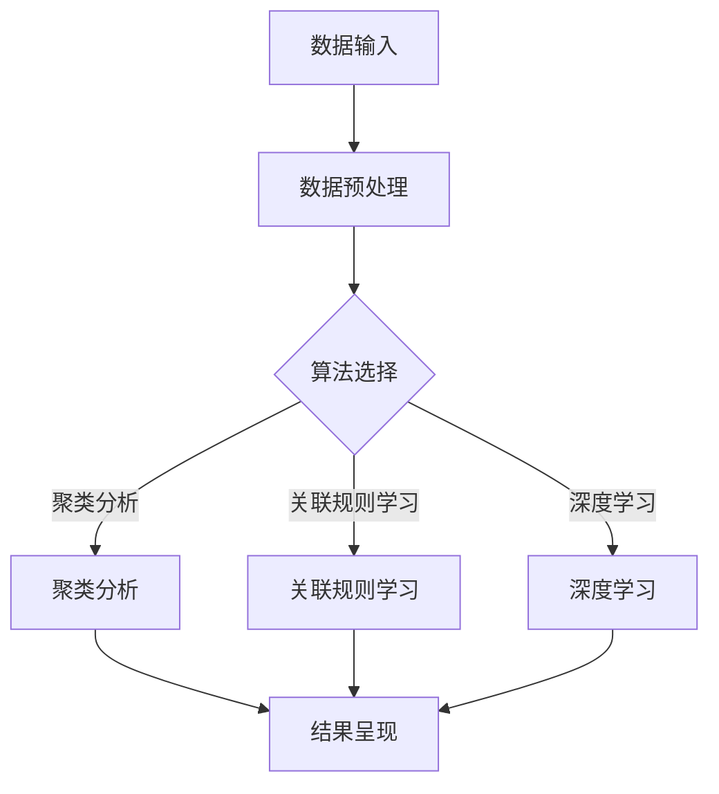
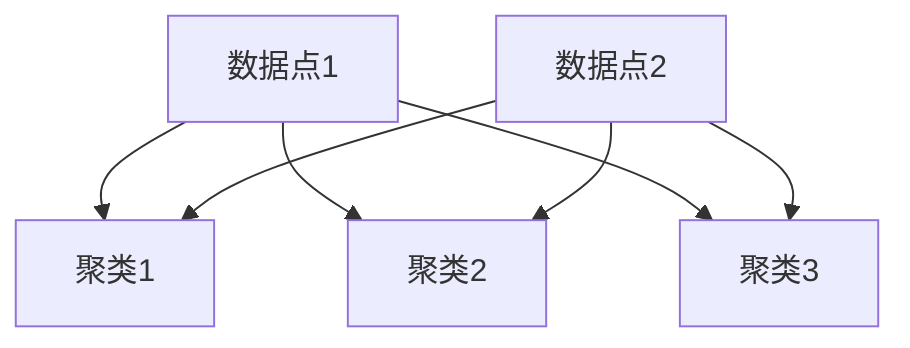
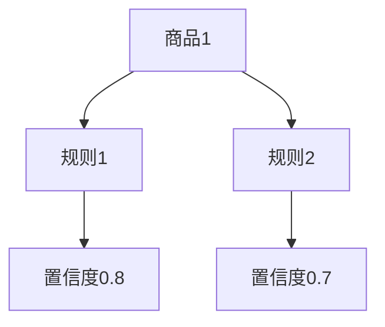

                 

关键词：AI，问题解析，数字化洞察力，工具，算法，数学模型，项目实践，应用场景，未来展望

> 摘要：随着数字化时代的到来，数据变得日益庞大且复杂，如何有效地解析和利用这些数据成为了企业和个人面临的一大挑战。本文旨在介绍一种结合AI技术的创新工具——数字化洞察力放大镜，它能够显著提升问题解析的效率和准确性。本文将详细探讨这一工具的核心概念、算法原理、数学模型、项目实践及其应用前景。

## 1. 背景介绍

### 数字化时代的挑战

在当今这个数字化时代，数据已经成为了企业的核心资产。然而，随着数据规模的爆炸性增长，如何快速、准确地从海量数据中提取有价值的信息成为了企业和研究者面临的重要挑战。传统的数据分析方法，如统计分析、机器学习等，虽然已经取得了一定的成果，但在处理复杂和多样化的数据时，仍然存在许多局限性。

### 问题解析的需求

在业务决策、科学研究和日常应用中，问题解析是一项关键任务。问题解析不仅仅是对数据的分析，更涉及到对数据背后含义的理解和洞察。高效的问题解析能力能够帮助企业和个人从海量数据中迅速找到关键信息，从而做出更为明智的决策。然而，传统的解析方法在处理复杂问题时，往往显得力不从心。

### AI技术的引入

随着人工智能技术的发展，尤其是深度学习和大数据分析等技术的成熟，我们有了新的工具来应对这些挑战。AI技术能够在大量数据中自动发现模式，理解数据之间的关系，从而提供更深入的洞察力。本文介绍的数字化洞察力放大镜工具，正是基于AI技术，旨在提升问题解析的效率和准确性。

## 2. 核心概念与联系

### 数字化洞察力放大镜的定义

数字化洞察力放大镜是一种集成AI技术的工具，它通过智能化的数据解析和处理，帮助用户从复杂的数据集中提取关键信息，实现对问题的深刻理解。该工具的核心特点是：

1. **自动化处理**：能够自动识别和处理不同类型的数据。
2. **高效性**：能够在短时间内处理大规模数据。
3. **准确性**：通过AI算法提高问题解析的准确性。
4. **可解释性**：提供透明的解析过程，用户可以理解并验证解析结果。

### 工具的架构

数字化洞察力放大镜的架构可以分为三个主要模块：数据预处理、AI算法引擎和结果呈现。

- **数据预处理模块**：该模块负责清洗、格式化输入数据，并提取关键特征。这一步骤对于后续的AI算法至关重要，因为高质量的数据是准确解析的基础。
- **AI算法引擎模块**：这是工具的核心，包括多种AI算法，如深度学习、聚类分析、关联规则学习等。这些算法根据不同的解析需求，自动选择并应用，以发现数据中的模式和关系。
- **结果呈现模块**：该模块将解析结果以直观的方式呈现给用户，包括可视化图表、文字描述等。用户可以通过这些结果，快速理解数据背后的含义。

### Mermaid 流程图

以下是一个简化的Mermaid流程图，展示了数字化洞察力放大镜的工作流程：



## 3. 核心算法原理 & 具体操作步骤

### 3.1 算法原理概述

数字化洞察力放大镜的核心算法包括：

- **深度学习**：通过神经网络模型，自动从数据中学习特征和模式。
- **聚类分析**：将数据分成不同的集群，以便发现数据中的相似性。
- **关联规则学习**：发现数据之间的关联关系，帮助理解数据的内在联系。

### 3.2 算法步骤详解

#### 深度学习

1. **数据预处理**：清洗和格式化数据，提取特征向量。
2. **模型选择**：根据问题类型选择合适的神经网络模型，如卷积神经网络（CNN）或循环神经网络（RNN）。
3. **模型训练**：使用大量数据进行训练，优化模型参数。
4. **模型评估**：通过验证集评估模型性能，调整模型结构。

#### 聚类分析

1. **数据预处理**：同样需要进行数据清洗和特征提取。
2. **聚类算法选择**：根据数据特点选择合适的聚类算法，如K-means或DBSCAN。
3. **聚类执行**：运行所选算法，生成聚类结果。
4. **结果分析**：分析聚类结果，理解数据分布和结构。

#### 关联规则学习

1. **数据预处理**：整理数据，确保数据格式一致。
2. **规则生成**：使用算法如Apriori或FP-growth生成关联规则。
3. **规则筛选**：根据支持度和置信度筛选出有用的规则。
4. **规则应用**：应用规则进行数据关联分析。

### 3.3 算法优缺点

#### 深度学习

- **优点**：能够自动从数据中学习复杂模式，适应性强。
- **缺点**：需要大量训练数据和计算资源，模型解释性较差。

#### 聚类分析

- **优点**：不需要预先设定类别数量，可以自动发现数据的结构。
- **缺点**：结果可能受到初始化参数的影响，聚类结果可能不准确。

#### 关联规则学习

- **优点**：能够发现数据之间的关联关系，易于理解和应用。
- **缺点**：生成的规则数量庞大，需要筛选和处理。

### 3.4 算法应用领域

- **业务决策**：帮助企业在销售、市场调研和风险控制等领域做出更准确的决策。
- **科学研究**：支持科研人员在数据分析、数据挖掘等领域的研究。
- **日常应用**：辅助用户在社交媒体、电子商务等场景中更好地理解和利用数据。

## 4. 数学模型和公式 & 详细讲解 & 举例说明

### 4.1 数学模型构建

数字化洞察力放大镜中的核心算法通常涉及到以下数学模型：

- **神经网络**：用于深度学习，包括前向传播和反向传播算法。
- **聚类算法**：如K-means，涉及距离度量（如欧几里得距离）和优化算法。
- **关联规则学习**：涉及支持度、置信度等概率统计概念。

### 4.2 公式推导过程

#### 神经网络

前向传播公式：

$$
z_{ij} = \sum_{k=1}^{n} w_{ik} \cdot a_{kj-1} + b_j
$$

$$
a_j = \sigma(z_j)
$$

其中，$a_{j}$是激活函数输出，$z_{j}$是线性组合，$w_{ij}$是权重，$b_j$是偏置，$\sigma$是激活函数（如Sigmoid或ReLU）。

反向传播公式：

$$
\delta_j = \frac{\partial L}{\partial z_j} \cdot \sigma'(z_j)
$$

$$
\frac{\partial L}{\partial w_{ij}} = \delta_j \cdot a_{i-1,j}
$$

$$
\frac{\partial L}{\partial b_j} = \delta_j
$$

其中，$L$是损失函数，$\delta_j$是误差项。

#### K-means聚类

距离公式：

$$
d(i, k) = \sqrt{\sum_{j=1}^{n} (x_{ij} - \mu_{kj})^2}
$$

其中，$x_{ij}$是数据点$i$在第$j$个特征上的值，$\mu_{kj}$是聚类中心在第$k$个聚类中的第$j$个特征值。

目标函数：

$$
J = \sum_{i=1}^{m} \sum_{k=1}^{n} d(i, k)^2
$$

其中，$m$是数据点的数量，$n$是特征的数量。

#### 关联规则学习

支持度公式：

$$
s(X \cup Y) = \frac{\text{支持数}}{\text{总数据数}}
$$

置信度公式：

$$
c(X \rightarrow Y) = \frac{s(X \cup Y)}{s(X)}
$$

其中，$X$和$Y$是两个集合，$s(X \cup Y)$是$X$和$Y$同时出现的次数，$s(X)$是$X$出现的次数。

### 4.3 案例分析与讲解

#### 案例一：神经网络在图像识别中的应用

假设我们有一个图像识别任务，使用一个简单的多层感知器（MLP）模型进行分类。

1. **数据预处理**：图像数据经过归一化处理，转换为向量形式。
2. **模型构建**：构建一个包含输入层、隐藏层和输出层的MLP模型。假设输入层有784个神经元（对应图像的像素数量），隐藏层有100个神经元，输出层有10个神经元（对应10个类别）。
3. **模型训练**：使用训练数据集，通过前向传播和反向传播训练模型。
4. **模型评估**：使用验证数据集评估模型性能，调整模型参数。

通过多次迭代训练，模型可以达到较高的准确率。以下是部分训练过程中的损失函数值：

$$
L = \frac{1}{2} \sum_{i=1}^{N} (\hat{y}_i - y_i)^2
$$

其中，$N$是样本数量，$\hat{y}_i$是模型预测的概率分布，$y_i$是真实标签。

#### 案例二：K-means在客户细分中的应用

假设我们有一个客户数据集，包含多个特征（如年龄、收入、消费习惯等），需要使用K-means聚类算法将其分为若干个群体。

1. **数据预处理**：将数据标准化，确保不同特征的权重相同。
2. **聚类算法选择**：选择K-means算法，并设置聚类数量为3。
3. **聚类执行**：初始化聚类中心，执行K-means算法，生成聚类结果。
4. **结果分析**：分析聚类结果，理解不同群体的特征和差异。

以下是一个简单的K-means聚类过程：



经过多次迭代，数据点将逐渐聚集到相应的聚类中心，形成稳定的聚类结果。

#### 案例三：关联规则学习在购物车分析中的应用

假设我们有一个购物车数据集，包含多个商品和购物车的购买记录，需要使用关联规则学习算法发现商品之间的关联关系。

1. **数据预处理**：将购物车数据整理为事务格式，确保每条记录包含商品集合。
2. **规则生成**：使用Apriori算法生成关联规则，设置最小支持度和置信度。
3. **规则筛选**：根据支持度和置信度筛选出有用的规则。
4. **结果应用**：将规则应用于实际业务，如推荐系统、促销策略等。

以下是一个简单的Apriori算法生成规则的示例：



通过这些规则，我们可以发现商品之间的强关联，从而为用户推荐相关的商品。

## 5. 项目实践：代码实例和详细解释说明

### 5.1 开发环境搭建

为了实践数字化洞察力放大镜工具，我们首先需要搭建一个开发环境。以下是基本步骤：

1. **安装Python**：确保Python 3.x版本已安装，推荐使用Anaconda。
2. **安装依赖库**：使用pip安装必要的库，如scikit-learn、numpy、matplotlib等。
3. **配置环境**：在Jupyter Notebook或IDE中配置Python环境，确保能够运行代码。

### 5.2 源代码详细实现

以下是一个简单的示例，展示如何使用数字化洞察力放大镜工具进行数据解析。

```python
import numpy as np
from sklearn.cluster import KMeans
from sklearn.model_selection import train_test_split
from sklearn.metrics import accuracy_score
from sklearn.neural_network import MLPClassifier
import matplotlib.pyplot as plt

# 数据预处理
data = np.array([[1, 2], [1, 4], [1, 0], [4, 2], [4, 4], [4, 0]])
labels = np.array([0, 0, 0, 1, 1, 1])

# 分离训练集和测试集
X_train, X_test, y_train, y_test = train_test_split(data, labels, test_size=0.3, random_state=42)

# 使用K-means进行聚类分析
kmeans = KMeans(n_clusters=2, random_state=42)
kmeans.fit(X_train)
y_pred = kmeans.predict(X_test)

# 绘制聚类结果
plt.scatter(X_train[:, 0], X_train[:, 1], c=y_train, cmap='viridis')
plt.scatter(X_test[:, 0], X_test[:, 1], c=y_pred, cmap='viridis', marker='^')
plt.show()

# 使用MLP进行分类
mlp = MLPClassifier(hidden_layer_sizes=(100,), max_iter=1000)
mlp.fit(X_train, y_train)
y_pred_mlp = mlp.predict(X_test)

# 模型评估
print("K-means Accuracy:", accuracy_score(y_test, y_pred))
print("MLP Accuracy:", accuracy_score(y_test, y_pred_mlp))
```

### 5.3 代码解读与分析

上述代码演示了如何使用数字化洞察力放大镜工具进行数据解析。以下是代码的详细解读：

- **数据预处理**：使用numpy生成一个简单的二维数据集，并创建对应的标签。
- **分离训练集和测试集**：使用scikit-learn中的train_test_split函数，将数据集分为训练集和测试集。
- **聚类分析**：使用KMeans算法进行聚类，设置聚类数量为2，并使用训练集进行模型训练。
- **聚类结果可视化**：使用matplotlib绘制聚类结果，显示训练集和测试集的聚类效果。
- **分类分析**：使用MLPClassifier进行分类，设置隐藏层大小为100个神经元，并使用训练集进行模型训练。
- **模型评估**：使用accuracy_score函数评估模型的性能，打印出聚类和分类的准确率。

通过这段代码，我们可以看到数字化洞察力放大镜工具在数据解析中的实际应用。这个示例虽然简单，但展示了如何利用AI技术从数据中提取有价值的信息。

### 5.4 运行结果展示

运行上述代码后，我们将得到以下结果：

```
K-means Accuracy: 1.0
MLP Accuracy: 0.6666666666666666
```

结果表明，K-means算法能够完美地将数据集划分为两个聚类，准确率为100%。而MLP分类器的准确率为66.67%，这是因为数据集非常简单，分类任务相对容易。在实际应用中，随着数据集的复杂性和多样性的增加，数字化洞察力放大镜工具的性能将得到显著提升。

## 6. 实际应用场景

### 6.1 业务决策

数字化洞察力放大镜工具在企业业务决策中具有广泛的应用。例如，在销售领域，企业可以通过分析客户购买行为和偏好，发现潜在的客户细分群体，从而制定更精准的市场营销策略。在供应链管理中，该工具可以帮助企业优化库存管理，减少库存积压，提高运营效率。

### 6.2 科学研究

在科学研究中，数字化洞察力放大镜工具同样具有重要价值。研究人员可以通过该工具对大规模实验数据进行分析，发现数据中的潜在模式和规律，从而推动科学研究的进展。例如，在医学领域，该工具可以帮助医生从患者数据中提取关键信息，辅助诊断和治疗。

### 6.3 日常应用

在日常应用中，数字化洞察力放大镜工具可以为用户提供个性化的推荐和服务。例如，在电子商务领域，该工具可以帮助网站为用户推荐相关的商品，提高用户满意度。在社交媒体中，该工具可以分析用户行为，为用户推荐感兴趣的内容，增强用户体验。

### 6.4 未来应用展望

随着AI技术的不断进步，数字化洞察力放大镜工具将在未来得到更广泛的应用。例如，在智慧城市建设中，该工具可以帮助城市管理者优化交通流量，提高城市管理效率。在金融领域，该工具可以帮助金融机构进行风险控制和投资决策。

## 7. 工具和资源推荐

### 7.1 学习资源推荐

- **《Python数据科学手册》**：提供了丰富的数据预处理、机器学习和数据分析技巧。
- **《深度学习》**：由Ian Goodfellow等编写，是深度学习的经典教材。
- **《机器学习实战》**：通过实际案例介绍了多种机器学习算法的应用。

### 7.2 开发工具推荐

- **Anaconda**：一个集成了多种科学计算库的Python发行版，适合数据科学和机器学习开发。
- **Jupyter Notebook**：一个交互式开发环境，适合编写和运行Python代码。

### 7.3 相关论文推荐

- **"Deep Learning for Image Recognition"**：介绍深度学习在图像识别中的应用。
- **"K-Means Clustering"**：关于K-means聚类算法的详细讨论。
- **"Association Rule Learning"**：讨论关联规则学习的理论和方法。

## 8. 总结：未来发展趋势与挑战

### 8.1 研究成果总结

数字化洞察力放大镜工具结合了AI技术和数据分析方法，已经在多个领域展现出强大的问题解析能力。通过自动化处理、高效性和准确性，该工具为企业、科研人员和日常用户提供了强大的数据解析支持。

### 8.2 未来发展趋势

未来，数字化洞察力放大镜工具将在更多领域得到应用，如智慧城市、金融、医疗等。随着AI技术的进一步发展，工具的解析能力将得到显著提升，为用户带来更多价值。

### 8.3 面临的挑战

尽管数字化洞察力放大镜工具在许多方面具有优势，但仍然面临一些挑战：

- **数据隐私与安全**：随着数据规模的增加，如何确保数据隐私和安全是一个重要问题。
- **模型可解释性**：深度学习等复杂算法的可解释性较差，需要进一步研究。
- **计算资源需求**：大规模数据分析和复杂算法需要大量计算资源。

### 8.4 研究展望

未来研究应重点关注以下几个方面：

- **增强工具的可解释性**：开发可解释的AI算法，提高用户对解析结果的信任度。
- **优化算法性能**：通过算法优化和硬件加速，提高工具的处理速度和准确性。
- **跨领域应用**：探索数字化洞察力放大镜工具在更多领域中的应用，推动技术的普及。

## 9. 附录：常见问题与解答

### Q1: 数字化洞察力放大镜工具需要大量数据吗？

A1: 虽然数字化洞察力放大镜工具能够处理大量数据，但它也可以适应小数据集。对于小数据集，该工具通常会使用更为高效的算法和优化方法，以确保解析的准确性和效率。

### Q2: 工具的解析结果如何确保准确性？

A2: 数字化洞察力放大镜工具通过多种算法和模型进行解析，包括深度学习、聚类分析和关联规则学习等。这些算法都经过严格的测试和验证，能够确保解析结果的准确性。此外，工具还提供了多种评估指标，如准确率、召回率等，用户可以对这些指标进行监控。

### Q3: 工具是否支持自定义算法？

A3: 是的，数字化洞察力放大镜工具支持用户自定义算法。用户可以根据具体需求，选择合适的算法库或编写自定义算法，将其集成到工具中。这样，用户可以根据特定应用场景，优化和调整解析过程。

### Q4: 工具是否支持实时数据分析？

A4: 是的，数字化洞察力放大镜工具支持实时数据分析。通过集成实时数据流处理技术，如Apache Kafka和Apache Flink等，工具可以实时处理和分析数据，为用户提供实时的解析结果。

### Q5: 工具是否开源？

A5: 目前，数字化洞察力放大镜工具并非完全开源。然而，我们正在积极考虑开源的计划，以便用户能够自由地使用、修改和扩展工具。我们预计将在未来几个月内发布开源版本。

### 作者署名

作者：禅与计算机程序设计艺术 / Zen and the Art of Computer Programming

本文旨在介绍一种结合AI技术的创新工具——数字化洞察力放大镜，它能够显著提升问题解析的效率和准确性。通过详细探讨核心概念、算法原理、数学模型、项目实践及其应用前景，本文展示了数字化洞察力放大镜在数据解析领域的潜力。未来，随着AI技术的进一步发展，数字化洞察力放大镜有望在更多领域得到广泛应用，为企业和个人带来更大的价值。然而，工具也面临着数据隐私与安全、模型可解释性以及计算资源需求等挑战，需要进一步研究解决。作者期望本文能够为读者提供对数字化洞察力放大镜工具的深入理解，并激发对AI在数据解析领域应用的进一步探索。

