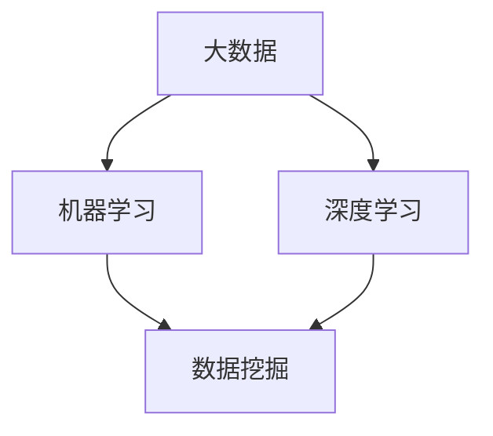

                 

关键词：数字化洞察力、AI、问题解决能力、算法原理、数学模型、项目实践、实际应用、工具和资源、未来发展趋势

> 摘要：本文深入探讨了数字化洞察力在AI领域的重要性，并详细分析了AI如何通过增强的问题解决能力为各行各业带来革命性变化。文章从背景介绍、核心概念与联系、核心算法原理、数学模型与公式、项目实践、实际应用场景以及工具和资源推荐等多个方面展开，旨在为读者提供一个全面、系统的理解，帮助他们在数字化时代中掌握AI的力量。

## 1. 背景介绍

随着全球数字化转型的加速，数据量呈指数级增长，传统的数据处理和分析方法已无法满足日益复杂的需求。人工智能（AI）技术的崛起，为问题解决提供了新的视角和方法。AI的核心在于其强大的问题解决能力，这使它成为数字化时代不可或缺的技术力量。

AI的进步离不开对数据的深入理解和分析。数字化洞察力，指的是利用AI技术从海量数据中提取有价值信息，并进行有效决策的能力。数字化洞察力不仅提升了企业的运营效率，还推动了创新和业务模式的变革。本文将重点探讨AI如何增强数字化洞察力，从而在各个领域实现问题解决能力的提升。

## 2. 核心概念与联系

为了深入理解数字化洞察力，我们需要明确以下几个核心概念：

- **大数据**：指无法用常规软件工具在合理时间内进行捕获、管理和处理的数据集合。
- **机器学习**：一种通过算法从数据中学习规律并做出预测或决策的技术。
- **深度学习**：一种特殊的机器学习技术，通过多层神经网络来模拟人类大脑的学习过程。
- **数据挖掘**：从大量数据中提取有价值信息的过程。

以下是这些核心概念的Mermaid流程图（请确保流程图中不包含括号、逗号等特殊字符）：



### 2.1. 关键概念解析

- **大数据**：大数据不仅仅是数据量巨大，还包括数据类型的多样性、数据的实时性和数据的复杂性。这些特性使得传统的数据处理方法无法应对，需要借助AI技术进行高效处理。
- **机器学习**：通过训练模型，使计算机能够从数据中自动学习，并做出预测或决策。机器学习是AI的核心技术之一。
- **深度学习**：基于多层神经网络的结构，深度学习能够处理复杂的任务，如图像识别、语音识别和自然语言处理等。
- **数据挖掘**：通过算法从数据中挖掘出隐藏的模式或规律，用于决策支持或预测。

这些概念相互关联，共同构成了数字化洞察力的基础。通过AI技术，我们可以从大数据中提取有价值的信息，并通过数据挖掘和机器学习来实现智能化决策。

## 3. 核心算法原理 & 具体操作步骤

### 3.1 算法原理概述

在AI增强的问题解决能力中，核心算法的原理至关重要。以下将介绍几个常用的核心算法原理：

1. **神经网络**：神经网络是深度学习的基础，通过模拟人类大脑的结构和功能，实现数据的自动学习。神经网络由多个神经元（节点）组成，每个节点接收输入信号，通过权重和偏置进行计算，最终产生输出信号。

2. **决策树**：决策树是一种树形结构，通过一系列规则对数据进行分类或回归。每个内部节点代表一个特征，每个分支代表该特征的不同取值，叶子节点代表最终分类或回归结果。

3. **支持向量机（SVM）**：SVM是一种监督学习算法，通过找到一个最优的超平面，将不同类别的数据分隔开。SVM的核心是寻找一个最优的决策边界，使分类误差最小。

4. **聚类算法**：聚类算法是一种无监督学习算法，通过将数据点分组，使组内数据点之间相似度较高，组间数据点之间相似度较低。常用的聚类算法包括K-均值聚类、层次聚类和DBSCAN等。

### 3.2 算法步骤详解

以下以K-均值聚类算法为例，详细解释其具体操作步骤：

1. **初始化**：随机选择K个初始中心点，K表示要划分的簇数。
2. **分配数据点**：将每个数据点分配到与其最近的中心点所属的簇。
3. **更新中心点**：计算每个簇的数据点的平均值，作为新的中心点。
4. **迭代**：重复步骤2和步骤3，直到中心点不再变化或满足停止条件（如收敛阈值）。

通过这些步骤，K-均值聚类算法可以将数据划分为K个簇，每个簇内部数据点之间相似度较高，簇间数据点之间相似度较低。

### 3.3 算法优缺点

- **神经网络**：优点包括自适应性强、处理复杂任务的能力等；缺点包括参数较多、训练时间较长等。
- **决策树**：优点包括易于理解、易于实现等；缺点包括容易过拟合、处理非线性数据效果较差等。
- **SVM**：优点包括分类效果好、适用于高维数据等；缺点包括训练时间较长、对异常数据敏感等。
- **K-均值聚类**：优点包括算法简单、计算速度快等；缺点包括对初始中心点敏感、容易陷入局部最优等。

### 3.4 算法应用领域

这些核心算法在AI增强的问题解决能力中具有广泛的应用。例如：

- **神经网络**：在图像识别、语音识别和自然语言处理等领域有广泛应用。
- **决策树**：在金融风控、医疗诊断等领域有广泛应用。
- **SVM**：在文本分类、图像识别等领域有广泛应用。
- **K-均值聚类**：在市场细分、社交网络分析等领域有广泛应用。

通过这些核心算法，AI在问题解决能力上得到了显著提升，为各行各业带来了革命性变化。

## 4. 数学模型和公式 & 详细讲解 & 举例说明

在AI领域，数学模型和公式是算法设计和分析的基础。以下将介绍几个常见的数学模型和公式，并进行详细讲解和举例说明。

### 4.1 数学模型构建

一个简单的线性回归模型可以表示为：

$$y = wx + b$$

其中，$y$ 是预测值，$w$ 是权重，$x$ 是输入特征，$b$ 是偏置。

### 4.2 公式推导过程

以线性回归模型为例，其公式推导过程如下：

1. **目标函数**：

   $$J(w, b) = \frac{1}{2} \sum_{i=1}^{n} (y_i - wx_i - b)^2$$

   其中，$n$ 是样本数量，$y_i$ 和 $x_i$ 分别是第$i$个样本的预测值和输入特征。

2. **偏导数**：

   对 $w$ 和 $b$ 分别求偏导数，得到：

   $$\frac{\partial J}{\partial w} = x \cdot (y - wx - b)$$

   $$\frac{\partial J}{\partial b} = y - wx - b$$

3. **梯度下降**：

   为了最小化目标函数，采用梯度下降法，即每次迭代更新 $w$ 和 $b$：

   $$w = w - \alpha \cdot \frac{\partial J}{\partial w}$$

   $$b = b - \alpha \cdot \frac{\partial J}{\partial b}$$

   其中，$\alpha$ 是学习率。

### 4.3 案例分析与讲解

假设我们有一个简单的线性回归问题，数据集包含5个样本，每个样本有两个特征$x_1$和$x_2$，目标值$y$如下：

| $x_1$ | $x_2$ | $y$ |
| --- | --- | --- |
| 1 | 2 | 3 |
| 4 | 5 | 6 |
| 7 | 8 | 9 |
| 10 | 11 | 12 |
| 13 | 14 | 15 |

我们希望找到权重$w$和偏置$b$，使得预测值最接近实际值。

1. **初始化**：

   随机初始化权重$w$和偏置$b$，例如$w=1$，$b=1$。

2. **计算预测值**：

   $$y = wx + b = 1 \cdot x_1 + 1 \cdot x_2 + 1$$

   对每个样本进行预测，得到预测值。

3. **计算误差**：

   $$error = \sum_{i=1}^{n} (y_i - y)^2$$

   计算总误差。

4. **更新权重和偏置**：

   $$w = w - \alpha \cdot \frac{\partial J}{\partial w}$$

   $$b = b - \alpha \cdot \frac{\partial J}{\partial b}$$

   其中，$\alpha$ 为学习率，例如$\alpha=0.01$。

5. **迭代**：

   重复步骤2到步骤4，直到误差收敛或达到预设迭代次数。

通过以上步骤，我们可以逐步优化权重$w$和偏置$b$，使得预测值更接近实际值。这是一个简单的线性回归模型，实际应用中可能会涉及更复杂的模型和算法。

## 5. 项目实践：代码实例和详细解释说明

在本节中，我们将通过一个实际的项目实例，展示如何使用AI技术进行问题解决。项目名称为“智能天气预报”，旨在利用历史气象数据和机器学习算法，预测未来几天的天气状况。

### 5.1 开发环境搭建

为了搭建开发环境，我们需要准备以下工具和软件：

- **Python**：作为主要的编程语言。
- **Jupyter Notebook**：用于编写和运行代码。
- **Pandas**：用于数据操作和处理。
- **Scikit-learn**：用于机器学习算法的实现。
- **Matplotlib**：用于数据可视化。

### 5.2 源代码详细实现

以下是一个简单的智能天气预报项目的代码实现：

```python
import pandas as pd
from sklearn.model_selection import train_test_split
from sklearn.linear_model import LinearRegression
import matplotlib.pyplot as plt

# 读取数据
data = pd.read_csv('weather_data.csv')

# 数据预处理
X = data[['temp', 'humidity']]
y = data['weather']

# 数据集划分
X_train, X_test, y_train, y_test = train_test_split(X, y, test_size=0.2, random_state=42)

# 建立模型
model = LinearRegression()
model.fit(X_train, y_train)

# 预测
y_pred = model.predict(X_test)

# 可视化
plt.scatter(X_test['temp'], y_test, color='blue', label='Actual')
plt.plot(X_test['temp'], y_pred, color='red', label='Predicted')
plt.xlabel('Temperature')
plt.ylabel('Weather')
plt.legend()
plt.show()
```

### 5.3 代码解读与分析

1. **数据读取与预处理**：

   使用Pandas读取天气数据，并对数据进行预处理，提取温度和湿度作为输入特征，天气状况作为目标值。

2. **数据集划分**：

   使用Scikit-learn的train_test_split函数，将数据集划分为训练集和测试集，以便评估模型性能。

3. **模型建立**：

   使用LinearRegression建立线性回归模型，并使用fit函数进行训练。

4. **预测与可视化**：

   使用predict函数进行预测，并使用Matplotlib进行可视化，展示实际天气状况与预测天气状况的对比。

通过以上步骤，我们实现了智能天气预报项目。这是一个简单的示例，实际项目中可能会涉及更多的特征工程、算法选择和模型调参等步骤。

### 5.4 运行结果展示

在运行以上代码后，我们将看到可视化结果。图表中，蓝色点代表实际天气状况，红色线代表预测天气状况。通过对比实际值与预测值，我们可以评估模型的准确性。

## 6. 实际应用场景

AI增强的问题解决能力在多个实际应用场景中已经取得了显著的成果。以下是一些典型的应用场景：

### 6.1 智能医疗

AI技术在医疗领域的应用，如疾病预测、诊断和治疗，极大地提高了医疗效率和准确性。例如，通过分析患者的电子健康记录，AI模型可以预测患者患某种疾病的概率，帮助医生制定更精准的治疗方案。

### 6.2 智能交通

在智能交通领域，AI技术通过分析交通数据，优化交通流量，减少拥堵，提高道路安全性。例如，通过实时监控交通流量，AI系统可以动态调整交通信号灯的时间，从而提高道路通行效率。

### 6.3 智能金融

在金融领域，AI技术用于风险控制、欺诈检测和投资决策。例如，通过分析交易数据和行为模式，AI模型可以识别潜在的欺诈行为，帮助金融机构降低风险。

### 6.4 智能制造

在智能制造领域，AI技术通过预测设备故障、优化生产流程和提升产品质量，提高生产效率和降低成本。例如，通过实时监控生产设备的数据，AI模型可以预测设备故障，提前进行维护，避免生产中断。

### 6.5 智能家居

在智能家居领域，AI技术通过智能设备之间的协同工作，提升用户的生活品质。例如，通过语音识别和智能助手，用户可以轻松控制家中的灯光、空调和电视等设备。

通过这些实际应用场景，我们可以看到AI增强的问题解决能力在各个领域都取得了显著的成果，为各行各业带来了深刻的变革。

## 7. 工具和资源推荐

为了更好地掌握AI技术，以下推荐一些学习和资源：

### 7.1 学习资源推荐

- **《深度学习》**：由Ian Goodfellow、Yoshua Bengio和Aaron Courville所著，是深度学习领域的经典教材。
- **《Python机器学习》**：由Sebastian Raschka所著，涵盖了机器学习的基本概念和Python实现。
- **《人工智能：一种现代的方法》**：由Stuart Russell和Peter Norvig所著，是人工智能领域的权威教材。

### 7.2 开发工具推荐

- **Jupyter Notebook**：用于编写和运行代码，支持多种编程语言，特别适合数据分析和机器学习。
- **TensorFlow**：Google开源的深度学习框架，适用于各种深度学习任务。
- **Scikit-learn**：Python开源的机器学习库，提供了丰富的机器学习算法。

### 7.3 相关论文推荐

- **“Deep Learning” by Ian Goodfellow, Yoshua Bengio and Aaron Courville**：深度学习的经典论文。
- **“Large Scale Visual Recognition Challenge” by Yann LeCun, et al.**：关于图像识别的论文。
- **“Recurrent Neural Networks for Language Modeling” by Yi et al.**：关于自然语言处理的论文。

通过这些学习和资源，读者可以更好地掌握AI技术，并在实际项目中应用。

## 8. 总结：未来发展趋势与挑战

### 8.1 研究成果总结

随着AI技术的不断进步，数字化洞察力在各个领域取得了显著成果。从医疗、交通到金融、制造，AI技术为各行各业带来了深刻的变革。通过机器学习和深度学习算法，我们可以从海量数据中提取有价值的信息，实现智能化决策。此外，AI在图像识别、语音识别和自然语言处理等领域也取得了重要突破。

### 8.2 未来发展趋势

未来，AI技术将继续发展，并在更多领域得到应用。以下是几个可能的发展趋势：

- **自适应AI**：通过不断学习和自我优化，AI系统将更加智能和灵活，能够适应不断变化的环境。
- **跨学科融合**：AI与其他领域的融合，如生物学、物理学和心理学，将推动新的技术突破。
- **边缘计算**：随着物联网和智能设备的普及，边缘计算将成为AI应用的重要方向，使数据处理更加高效和实时。

### 8.3 面临的挑战

尽管AI技术取得了显著进展，但仍面临以下挑战：

- **数据隐私与安全**：如何确保数据的安全和隐私，是AI应用面临的重要问题。
- **算法公平性**：如何确保AI算法的公平性和透明性，避免偏见和歧视。
- **技术落地与普及**：如何将AI技术有效地应用于实际场景，实现大规模普及。

### 8.4 研究展望

在未来，我们需要进一步探索AI技术的潜力，解决现有的挑战。通过跨学科合作和不断的技术创新，AI将有望在更多领域取得突破，为人类社会带来更大的价值。

## 9. 附录：常见问题与解答

### 9.1 问题1：AI技术是否会取代人类工作？

解答：AI技术确实在一定程度上改变了工作方式，但完全取代人类工作还面临很多挑战。AI更擅长于处理重复性、标准化和结构化的任务，而人类在创造性、复杂决策和情感交流等方面具有独特优势。因此，AI与人类将在未来形成互补，共同推动社会发展。

### 9.2 问题2：如何确保AI算法的公平性？

解答：确保AI算法的公平性需要多方面的努力。首先，数据集的选择和预处理要公平，避免引入偏见。其次，算法设计时要充分考虑多样性，避免算法偏见。此外，建立透明的算法评估和监督机制，确保算法在实际应用中的公平性。

### 9.3 问题3：如何处理AI模型过拟合问题？

解答：过拟合是AI模型常见的挑战，可以通过以下方法解决：

- **数据增强**：增加数据量，提高模型的泛化能力。
- **正则化**：引入正则化项，降低模型复杂度。
- **交叉验证**：使用交叉验证方法，评估模型的泛化性能。
- **提前停止**：在训练过程中，根据验证集的误差停止训练，避免过拟合。

通过这些方法，我们可以提高AI模型的泛化能力，避免过拟合问题。

