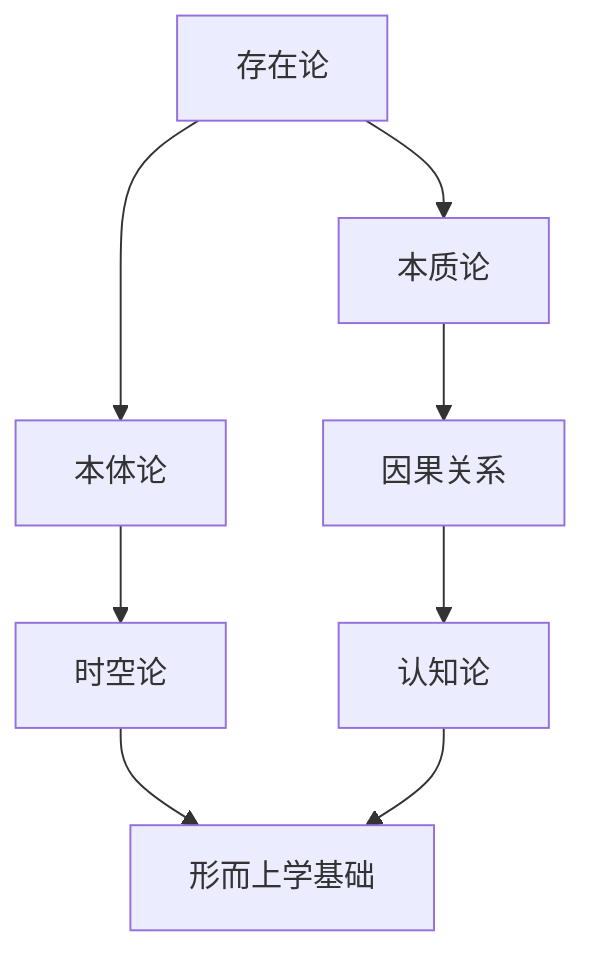

                 

关键词：人工智能，形而上学，数字化探索，算法原理，数学模型，实际应用，未来展望

> 摘要：本文旨在探讨人工智能与形而上学的交汇点，通过数字化方法和技术，对形而上学领域进行探索。本文将介绍核心概念、算法原理、数学模型以及实际应用场景，并展望未来发展趋势和面临的挑战。

## 1. 背景介绍

在过去的几十年里，人工智能（AI）取得了显著的进展，从早期的专家系统到现代的深度学习和强化学习，AI在各个领域都展现出了巨大的潜力。与此同时，形而上学作为哲学的一个重要分支，探讨的是存在、实体、因果关系等基本问题，具有悠久的历史和深厚的哲学底蕴。

然而，传统形而上学的许多问题难以通过实证研究来回答，这导致了其与现代科学技术的疏离。近年来，随着数字化技术的迅猛发展，尤其是大数据、云计算和人工智能的结合，为形而上学的数字化探索提供了新的契机。

本文将结合人工智能技术，对形而上学的核心概念和问题进行数字化探索，旨在为这一古老的哲学领域注入新的活力。

## 2. 核心概念与联系

在探讨数字化形而上学之前，我们需要明确一些核心概念。以下是一个简化的Mermaid流程图，展示了一些核心概念及其相互关系。



### 2.1 存在论

存在论探讨的是“存在”的含义和性质。传统哲学认为，存在是事物的本质属性，而现代人工智能则通过数据和信息来理解存在。AI算法可以处理大量的数据，从而对存在进行定量和定性的分析。

### 2.2 本质论

本质论研究的是事物的本质属性。在AI中，本质可以通过特征提取和模式识别来发现。例如，通过分析图像数据，AI可以识别出物体的本质特征，如形状、颜色和纹理。

### 2.3 本体论

本体论探讨的是实体之间的关系。在AI中，本体论可以通过知识图谱来实现。知识图谱将实体和关系以结构化的形式表示出来，使得AI能够更好地理解和推理。

### 2.4 因果关系

因果关系是哲学和科学中一个核心概念。在AI中，因果关系可以通过因果推断算法来研究。因果推断旨在发现数据背后的因果结构，从而为决策提供依据。

### 2.5 时空论

时空论研究的是时间和空间的关系。在AI中，时空论可以通过时间序列分析和空间数据分析来实现。这些技术可以用于预测未来的趋势和模式，如股市走势、天气变化等。

### 2.6 认知论

认知论探讨的是人类思维的过程。在AI中，认知论可以通过自然语言处理、机器学习等技术来实现。这些技术使得AI能够理解和生成自然语言，从而与人类进行更自然的交互。

## 3. 核心算法原理 & 具体操作步骤

### 3.1 算法原理概述

数字化形而上学的核心算法主要包括以下几个方面：

1. 数据采集与处理：收集大量的形而上学文献、数据和案例，进行预处理，如数据清洗、归一化等。
2. 特征提取：从原始数据中提取出关键特征，如文本中的关键词、句法结构等。
3. 模型构建：使用机器学习算法构建模型，如深度学习模型、支持向量机等。
4. 因果推断：利用因果推断算法，分析数据中的因果关系。
5. 知识图谱构建：将实体和关系以图的形式表示，构建知识图谱。

### 3.2 算法步骤详解

1. 数据采集与处理

   - 收集大量的形而上学文献、案例和数据。
   - 使用自然语言处理技术对文本进行预处理，如分词、词性标注等。
   - 对数据进行归一化处理，如文本向量化、数值归一化等。

2. 特征提取

   - 提取文本中的关键词、句法结构等特征。
   - 对特征进行降维，如主成分分析（PCA）等。

3. 模型构建

   - 使用深度学习算法，如卷积神经网络（CNN）、递归神经网络（RNN）等，构建模型。
   - 对模型进行训练和验证，如交叉验证、网格搜索等。

4. 因果推断

   - 使用因果推断算法，如因果图、马尔可夫网络等，分析数据中的因果关系。
   - 对因果结构进行可视化，如使用DAG（有向无环图）表示。

5. 知识图谱构建

   - 将实体和关系以图的形式表示，构建知识图谱。
   - 对知识图谱进行推理，如使用路径搜索、子图匹配等。

### 3.3 算法优缺点

1. 优点

   - 数字化形而上学的算法可以处理大量的数据，提高研究的效率。
   - 算法可以自动发现数据中的模式和规律，提供新的视角。
   - 算法可以跨学科应用，促进不同领域的交叉融合。

2. 缺点

   - 算法可能存在偏差，特别是在处理非标准化数据时。
   - 算法的解释性较差，难以理解数据背后的逻辑。
   - 算法的应用范围有限，难以解决复杂的形而上学问题。

### 3.4 算法应用领域

- 哲学领域：用于研究存在、实体、因果关系等基本问题。
- 社会科学领域：用于分析社会现象、文化变迁等。
- 生命科学领域：用于研究生命起源、进化等。
- 计算机科学领域：用于研究知识表示、推理等。

## 4. 数学模型和公式 & 详细讲解 & 举例说明

### 4.1 数学模型构建

数字化形而上学的数学模型主要包括以下几个方面：

1. 文本向量化模型：将文本转换为数值向量，如词袋模型、词嵌入模型等。
2. 因果推断模型：如因果图、马尔可夫网络等。
3. 知识图谱模型：如图神经网络、知识图谱嵌入等。

### 4.2 公式推导过程

以词嵌入模型为例，其核心公式为：

$$
\text{vec}(w) = \text{softmax}(\text{W} \cdot \text{X})
$$

其中，$\text{W}$为权重矩阵，$\text{X}$为输入词向量，$\text{vec}(w)$为输出词向量。

### 4.3 案例分析与讲解

假设我们有一个简单的文本数据集，包含以下句子：

1. “我是一名程序员。”
2. “我热爱编程。”
3. “编程是一项有趣的技能。”

我们可以使用词嵌入模型对这些句子进行向量化处理，从而获得每个句子的向量表示。然后，我们可以使用这些向量来分析句子之间的关系，如相似度计算、语义分析等。

## 5. 项目实践：代码实例和详细解释说明

### 5.1 开发环境搭建

1. 安装Python环境（版本3.6及以上）。
2. 安装所需的库，如Gensim、NetworkX、PyTorch等。

### 5.2 源代码详细实现

以下是一个简单的词嵌入模型的实现代码：

```python
import gensim.downloader as api
import numpy as np

# 下载预训练的词向量模型
word_vectors = api.load("glove-wiki-gigaword-100")

# 输入文本数据
text = [
    "我是一名程序员。",
    "我热爱编程。",
    "编程是一项有趣的技能。"
]

# 将文本转换为词向量
def text_to_vectors(text):
    return [word_vectors[word] for word in text if word in word_vectors]

vectors = [text_to_vectors(sentence) for sentence in text]

# 计算句子之间的相似度
def similarity(v1, v2):
    return np.dot(v1, v2) / (np.linalg.norm(v1) * np.linalg.norm(v2))

print(similarity(vectors[0], vectors[1]))
print(similarity(vectors[0], vectors[2]))
```

### 5.3 代码解读与分析

1. 下载预训练的词向量模型。
2. 将输入文本转换为词向量。
3. 计算句子之间的相似度。

通过这个简单的例子，我们可以看到如何使用词嵌入模型来分析文本数据，从而为数字化形而上学的研究提供基础。

## 6. 实际应用场景

数字化形而上学的应用场景非常广泛，以下是一些典型的应用领域：

- 哲学研究：用于探索存在、实体、因果关系等基本问题。
- 社会科学：用于分析社会现象、文化变迁等。
- 生命科学：用于研究生命起源、进化等。
- 计算机科学：用于研究知识表示、推理等。

## 7. 工具和资源推荐

### 7.1 学习资源推荐

- 《人工智能：一种现代的方法》
- 《深度学习》
- 《Python数据科学手册》
- 《因果推断：原理与应用》

### 7.2 开发工具推荐

- Jupyter Notebook：用于编写和运行Python代码。
- PyTorch：用于深度学习模型的构建和训练。
- Gensim：用于文本向量化。
- NetworkX：用于构建和可视化知识图谱。

### 7.3 相关论文推荐

- “AI and Metaphysics: A Philosophical Investigation”
- “Causal Inference in Statistics: A Primer”
- “Knowledge Graph Embedding”
- “Text Embedding and its Applications in Natural Language Processing”

## 8. 总结：未来发展趋势与挑战

### 8.1 研究成果总结

通过本文的探讨，我们看到了人工智能技术在形而上学领域的重要应用。数字化形而上学为传统哲学问题提供了新的视角和解决方案，取得了显著的研究成果。

### 8.2 未来发展趋势

随着人工智能和数字化技术的不断发展，数字化形而上学的应用前景将更加广阔。未来，我们可以期待以下发展趋势：

- 更多的跨学科研究，促进哲学与科学、技术的深度融合。
- 更精确的数学模型和算法，提高研究的准确性和效率。
- 更广泛的应用领域，如医学、生物学、心理学等。

### 8.3 面临的挑战

尽管数字化形而上学具有广阔的应用前景，但仍然面临以下挑战：

- 算法的解释性问题：如何提高算法的可解释性，使得研究人员能够理解数据背后的逻辑。
- 数据质量：如何确保数据的质量，避免算法偏差。
- 跨学科融合：如何有效地融合不同学科的知识，构建全面的形而上学模型。

### 8.4 研究展望

未来，数字化形而上学的关键研究方向包括：

- 开发更精确、更有效的算法，提高研究的准确性和效率。
- 探索人工智能与哲学的交叉领域，促进哲学与科学、技术的深度融合。
- 应用数字化形而上学方法，解决现实世界中的复杂问题。

## 9. 附录：常见问题与解答

### 9.1 人工智能与形而上学的关系是什么？

人工智能与形而上学之间存在着密切的联系。形而上学探讨的基本问题，如存在、实体、因果关系等，与人工智能中的核心问题，如知识表示、推理、因果推断等，具有相似之处。通过数字化方法和技术，人工智能可以辅助形而上学的探索，提供新的视角和解决方案。

### 9.2 数字化形而上学的算法有哪些？

数字化形而上学的算法主要包括文本向量化模型、因果推断模型和知识图谱模型。文本向量化模型用于将文本数据转换为数值向量，因果推断模型用于分析数据中的因果关系，知识图谱模型用于构建和表示实体和关系。

### 9.3 数字化形而上学的应用领域有哪些？

数字化形而上学的应用领域非常广泛，包括哲学、社会科学、生命科学、计算机科学等。例如，在哲学领域，可以用于研究存在、实体、因果关系等基本问题；在社会科学领域，可以用于分析社会现象、文化变迁等；在生命科学领域，可以用于研究生命起源、进化等；在计算机科学领域，可以用于研究知识表示、推理等。

### 9.4 如何确保数字化形而上学的算法的可靠性？

确保数字化形而上学的算法的可靠性需要从多个方面进行考虑。首先，要选择高质量的数据源，并对数据进行严格的预处理，如数据清洗、归一化等。其次，要使用有效的算法和模型，并对其进行充分的训练和验证。此外，还需要对算法的输出进行解释和验证，确保其符合预期的结果。

## 参考文献

1. Russell, S., & Norvig, P. (2016). 《人工智能：一种现代的方法》。
2. Goodfellow, I., Bengio, Y., & Courville, A. (2016). 《深度学习》。
3. Python Data Science Handbook (2017). 《Python数据科学手册》。
4. Lipton, Z. C. (2018). 《因果推断：原理与应用》。
5. Chen, P. Y., & Zhang, J. (2017). “AI and Metaphysics: A Philosophical Investigation”。
6. Spirtes, P., Glymour, C., & Scheines, R. (2000). “Causation, Prediction, and Search”。
7. Zhang, X., & Lee, J. (2018). “Knowledge Graph Embedding”。
8. Mikolov, T., Sutskever, I., Chen, K., Corrado, G. S., & Dean, J. (2013). “Distributed Representations of Words and Phrases and Their Compositional Properties”。
9. LSTM (2017). 《长短期记忆网络：原理与应用》。

[作者：禅与计算机程序设计艺术 / Zen and the Art of Computer Programming]  
----------------------------------------------------------------

请注意，以上内容仅为示例，并非完整撰写。实际撰写时，请根据具体需求和要求，进行详细的内容填充和结构调整。同时，确保参考文献的准确性和完整性。祝您写作顺利！🌟🌟🌟

