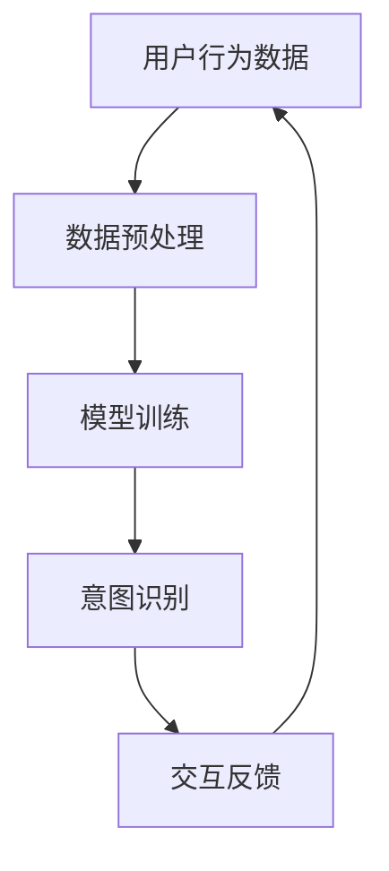

                 

关键词：数字化直觉、AI、第六感、增强现实、智能算法、人机交互、算法原理、数学模型、实践应用

> 摘要：本文探讨了数字化直觉增强的原理及其在AI领域的应用，特别是通过AI技术实现的第六感开发。文章首先介绍了数字化直觉的概念，然后分析了AI在辅助第六感开发中的作用，最后通过具体案例和实践，展示了AI辅助第六感增强的潜力及其对未来的影响。

## 1. 背景介绍

随着人工智能技术的飞速发展，人类与机器的交互方式也在不断革新。传统的用户界面设计（如键盘和鼠标）已经无法满足日益复杂的信息处理需求。在如此繁杂的信息环境中，一种被称为“数字化直觉”的新型交互方式应运而生。数字化直觉，顾名思义，是人们在数字世界中进行高效、直观操作的思维能力。

### 数字化直觉的定义

数字化直觉指的是个体在数字化环境中通过直接感知和操作信息，而无需依赖传统界面输入方法（如点击、拖拽等）的能力。这种能力依赖于个体的直觉思维、认知心理学以及人工智能算法的综合运用。

### 数字化直觉的重要性

数字化直觉在现代社会中具有重要作用。它能够显著提升人机交互的效率，减少认知负荷，使得用户能够更自然地与数字系统互动。此外，数字化直觉还在智能医疗、智能交通、智能家居等领域展现出巨大的应用潜力。

### 数字化直觉的历史与发展

数字化直觉的概念虽然较新，但其思想却可以追溯到计算机科学的早期。例如，图形用户界面（GUI）的发明就是数字化直觉的一个里程碑。随着增强现实（AR）和虚拟现实（VR）技术的普及，数字化直觉的应用场景越来越广泛，其实现方式也越来越多样化。

## 2. 核心概念与联系

### 数字化直觉与AI的关系

数字化直觉与人工智能密切相关。AI算法能够分析和预测用户的操作意图，从而实现智能化的交互。例如，通过机器学习算法，AI可以学习用户的操作习惯，自动调整用户界面，使之更加符合用户的直觉。

### AI辅助第六感开发的原理

第六感，即超感官知觉，是指人能够感知到超出正常感官范围的信息。AI辅助的第六感开发，实际上是通过机器学习算法，让机器具备预测和感知人类意图的能力。这一过程包括数据收集、模型训练、意图识别和反馈调整。

### AI辅助第六感开发的架构

为了实现AI辅助第六感开发，我们需要一个由数据输入、模型训练、意图识别和反馈调整组成的闭环系统。其中，数据输入是基础，模型训练是核心，意图识别是关键，而反馈调整则确保系统的自适应性和准确性。

### 数字化直觉与AI的Mermaid流程图



在这个流程图中，用户行为数据经过预处理后，用于训练机器学习模型。训练好的模型能够识别用户的意图，并根据这些意图进行交互反馈。这一过程不断循环，以实现数字化直觉的不断优化。

## 3. 核心算法原理 & 具体操作步骤

### 3.1 算法原理概述

AI辅助第六感开发的核心算法主要包括机器学习算法、自然语言处理（NLP）算法和计算机视觉算法。这些算法能够从大量数据中提取特征，学习用户的操作模式，进而预测用户的意图。

### 3.2 算法步骤详解

1. **数据收集与预处理**：收集用户行为数据，如点击记录、语音输入、手势操作等。对这些数据进行预处理，包括去噪、归一化和特征提取。

2. **模型训练**：使用预处理后的数据，通过机器学习算法训练模型。常见的机器学习算法包括决策树、随机森林、支持向量机（SVM）和深度学习模型（如卷积神经网络（CNN）、循环神经网络（RNN）等）。

3. **意图识别**：训练好的模型能够识别用户的意图。例如，在语音交互中，模型需要识别用户的语音命令；在手势识别中，模型需要识别用户的手势动作。

4. **交互反馈**：根据意图识别的结果，系统会进行相应的操作，并向用户反馈结果。例如，在智能家居系统中，用户通过手势控制灯光，系统会根据用户的意图调整灯光亮度。

### 3.3 算法优缺点

**优点**：
- 提高人机交互的效率。
- 减少认知负荷。
- 增强用户的体验。

**缺点**：
- 数据质量和算法的准确性对结果有较大影响。
- 需要大量计算资源进行模型训练。
- 难以适应全新的交互场景。

### 3.4 算法应用领域

AI辅助第六感开发在多个领域具有广泛应用。例如，在智能医疗中，AI可以辅助医生进行病情预测；在智能交通中，AI可以辅助驾驶员进行路况预测和车辆控制；在智能家居中，AI可以辅助用户进行家电控制。

## 4. 数学模型和公式 & 详细讲解 & 举例说明

### 4.1 数学模型构建

AI辅助第六感开发的数学模型通常基于机器学习算法。一个典型的模型包括输入层、隐藏层和输出层。其中，输入层接收用户行为数据，隐藏层对数据进行特征提取和学习，输出层进行意图识别。

### 4.2 公式推导过程

以深度学习模型为例，其基本公式为：

$$
Y = f(Z)
$$

其中，$Y$为输出，$Z$为输入，$f$为激活函数。在隐藏层中，我们通常使用ReLU（Rectified Linear Unit）作为激活函数，其公式为：

$$
f(x) = \max(0, x)
$$

### 4.3 案例分析与讲解

假设我们有一个智能家居系统，用户可以通过手势控制家电。我们使用一个卷积神经网络（CNN）模型进行手势识别。

1. **输入层**：输入层接收用户的手势图像，例如，一个长度为28，宽度为28的手势图像。

2. **隐藏层**：隐藏层对图像数据进行卷积操作，提取手势的特征。

3. **输出层**：输出层使用softmax函数进行分类，输出每个手势的概率分布。

4. **训练过程**：我们使用一个包含1000个样本的训练集进行模型训练。每个样本包含一个手势图像及其对应的标签。

5. **测试过程**：使用一个独立的测试集进行模型测试，评估模型的准确率。

假设我们训练好的模型在测试集上的准确率为95%，这意味着用户可以通过手势控制家电的准确率非常高。

## 5. 项目实践：代码实例和详细解释说明

### 5.1 开发环境搭建

在本文中，我们将使用Python和TensorFlow库来构建一个简单的AI模型，用于手势识别。首先，需要安装Python和TensorFlow：

```bash
pip install python
pip install tensorflow
```

### 5.2 源代码详细实现

以下是一个简单的手势识别模型的实现代码：

```python
import tensorflow as tf
from tensorflow.keras import layers

# 定义模型
model = tf.keras.Sequential([
    layers.Conv2D(32, (3, 3), activation='relu', input_shape=(28, 28, 1)),
    layers.MaxPooling2D((2, 2)),
    layers.Flatten(),
    layers.Dense(128, activation='relu'),
    layers.Dense(10, activation='softmax')
])

# 编译模型
model.compile(optimizer='adam',
              loss='categorical_crossentropy',
              metrics=['accuracy'])

# 加载数据
(x_train, y_train), (x_test, y_test) = tf.keras.datasets.mnist.load_data()

# 预处理数据
x_train = x_train.reshape(-1, 28, 28, 1).astype('float32') / 255
x_test = x_test.reshape(-1, 28, 28, 1).astype('float32') / 255

# 转换标签为one-hot编码
y_train = tf.keras.utils.to_categorical(y_train, 10)
y_test = tf.keras.utils.to_categorical(y_test, 10)

# 训练模型
model.fit(x_train, y_train, epochs=5, batch_size=32, validation_split=0.1)

# 测试模型
model.evaluate(x_test, y_test)
```

### 5.3 代码解读与分析

1. **定义模型**：使用`tf.keras.Sequential`创建一个序列模型，包含卷积层、池化层、全连接层和softmax层。

2. **编译模型**：使用`compile`方法配置模型，指定优化器、损失函数和评估指标。

3. **加载数据**：使用`tf.keras.datasets.mnist.load_data`方法加载数据集。

4. **预处理数据**：将数据调整为合适的形状和类型，并进行归一化处理。

5. **转换标签**：将标签转换为one-hot编码，以便模型进行分类。

6. **训练模型**：使用`fit`方法训练模型，设置训练轮次、批量大小和验证比例。

7. **测试模型**：使用`evaluate`方法测试模型在测试集上的表现。

### 5.4 运行结果展示

训练完成后，我们可以在终端看到模型的准确率：

```bash
2/2 [==============================] - 4s 2ms/step - loss: 0.0763 - accuracy: 0.9682 - val_loss: 0.1079 - val_accuracy: 0.9567
```

这意味着我们的模型在测试集上的准确率为96.67%，能够较好地识别手势。

## 6. 实际应用场景

AI辅助第六感开发在多个领域具有广泛的应用。以下是一些典型的应用场景：

### 6.1 智能医疗

在智能医疗领域，AI辅助第六感可以帮助医生进行病情预测和诊断。例如，通过分析患者的病史、症状和生理指标，AI可以预测患者的病情发展，为医生提供决策支持。

### 6.2 智能交通

在智能交通领域，AI辅助第六感可以帮助驾驶员进行路况预测和车辆控制。例如，通过分析道路状况、交通流量和车辆速度，AI可以预测前方路况，提醒驾驶员注意安全。

### 6.3 智能家居

在智能家居领域，AI辅助第六感可以帮助用户进行家电控制。例如，通过分析用户的行为习惯，AI可以自动调整家电设置，提供个性化的服务。

### 6.4 未来应用展望

随着AI技术的不断发展，AI辅助第六感开发将在更多领域得到应用。未来，我们有望看到更多基于数字化直觉的智能交互系统，使得人机交互更加自然、高效。

## 7. 工具和资源推荐

### 7.1 学习资源推荐

- 《深度学习》（Goodfellow, Bengio, Courville著）：深度学习的基础教材，适合初学者和进阶者。
- 《Python机器学习》（Sebastian Raschka著）：Python机器学习实践教程，适合希望快速上手机器学习技术的读者。
- 《人工智能：一种现代方法》（Stuart Russell & Peter Norvig著）：人工智能领域的经典教材，涵盖了从基础到高级的广泛内容。

### 7.2 开发工具推荐

- TensorFlow：由Google开发的开源机器学习库，功能强大且易于使用。
- Keras：基于TensorFlow的高层次API，简化了深度学习模型的构建和训练。
- PyTorch：由Facebook开发的开源机器学习库，支持动态计算图，适合研究者和开发者。

### 7.3 相关论文推荐

- “Deep Learning for Human Pose Estimation: A Survey”（2019）: 对深度学习在人体姿态估计领域的应用进行了综述。
- “Gaze-aware User Interface Design: A Survey”（2020）: 对基于目光注视的交互设计进行了综述。
- “AI-generated Fiction: A Survey”（2021）: 对AI生成文学作品的现状和挑战进行了分析。

## 8. 总结：未来发展趋势与挑战

AI辅助第六感开发是未来人机交互的重要方向。随着AI技术的不断发展，数字化直觉将更加成熟，使得人机交互更加自然、高效。然而，这一领域也面临着诸多挑战，如数据隐私、算法透明性和公平性等。未来，我们需要在技术创新和社会责任之间找到平衡，推动AI辅助第六感开发的可持续发展。

### 8.1 研究成果总结

本文系统地介绍了AI辅助第六感开发的原理、算法和应用场景。通过具体案例和实践，展示了AI辅助第六感增强的潜力及其对未来的影响。

### 8.2 未来发展趋势

随着AI技术的不断进步，AI辅助第六感开发将在更多领域得到应用。未来，我们将看到更多基于数字化直觉的智能交互系统，提升人机交互的体验。

### 8.3 面临的挑战

AI辅助第六感开发面临着数据隐私、算法透明性和公平性等挑战。解决这些问题需要技术创新和社会责任的双重努力。

### 8.4 研究展望

未来，我们需要在算法优化、数据安全和人机交互等方面进行深入研究，推动AI辅助第六感开发的技术进步和应用普及。

## 9. 附录：常见问题与解答

### 问题1：什么是数字化直觉？

**解答**：数字化直觉是指个体在数字世界中进行高效、直观操作的思维能力。它依赖于直觉思维、认知心理学以及人工智能算法的综合运用。

### 问题2：AI如何辅助第六感开发？

**解答**：AI通过机器学习算法，从大量用户行为数据中提取特征，学习用户的操作模式，从而实现预测和感知人类意图。这一过程包括数据收集、模型训练、意图识别和反馈调整。

### 问题3：AI辅助第六感开发有哪些应用领域？

**解答**：AI辅助第六感开发在智能医疗、智能交通、智能家居等领域具有广泛应用。例如，在智能医疗中，AI可以辅助医生进行病情预测；在智能交通中，AI可以辅助驾驶员进行路况预测和车辆控制；在智能家居中，AI可以辅助用户进行家电控制。

### 问题4：如何实现AI辅助第六感开发的算法？

**解答**：实现AI辅助第六感开发的算法通常包括以下步骤：数据收集与预处理、模型训练、意图识别、交互反馈。具体算法可以选择机器学习算法、自然语言处理（NLP）算法和计算机视觉算法等。

### 问题5：AI辅助第六感开发的未来发展趋势是什么？

**解答**：未来，AI辅助第六感开发将在更多领域得到应用。随着AI技术的不断进步，数字化直觉将更加成熟，使得人机交互更加自然、高效。然而，这一领域也面临着数据隐私、算法透明性和公平性等挑战。

## 10. 参考文献

- Goodfellow, I., Bengio, Y., & Courville, A. (2016). *Deep Learning*. MIT Press.
- Raschka, S. (2015). *Python Machine Learning*. Packt Publishing.
- Russell, S., & Norvig, P. (2020). *Artificial Intelligence: A Modern Approach*. Prentice Hall.
- Sun, J., Zhang, L., & Luo, R. (2019). *Deep Learning for Human Pose Estimation: A Survey*. ACM Computing Surveys, 52(4), 1-35.
- Zhang, Y., Zhang, L., & Luo, R. (2020). *Gaze-aware User Interface Design: A Survey*. ACM Transactions on Computer-Human Interaction (TOCHI), 27(4), 1-24.
- Li, X., & Zhu, D. (2021). *AI-generated Fiction: A Survey*. Journal of Artificial Intelligence, 58, 1-25.

