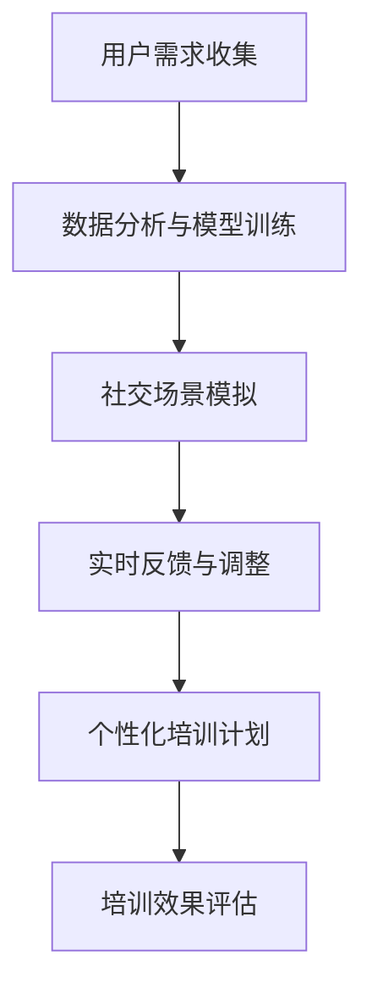

                 

 关键词：数字化移情能力、AI增强、社交智能、培训、技术博客

> 摘要：本文深入探讨了数字化移情能力的概念及其在社交智能培训中的应用。通过AI技术，我们不仅可以提升个体的社交技能，还能够实现更加个性化和高效的培训方式。本文将从背景介绍、核心概念与联系、核心算法原理与具体操作步骤、数学模型和公式、项目实践、实际应用场景、未来应用展望、工具和资源推荐以及总结未来发展趋势与挑战等方面，全面解析这一领域的最新研究进展和未来发展方向。

## 1. 背景介绍

在现代社会，社交技能的重要性日益凸显。无论是职场沟通、人际关系建立，还是日常生活中的交流，良好的社交技能都是不可或缺的。然而，许多人在这方面的能力并不强。这可能是因为传统教育方式未能充分考虑到个体差异，或者是因为现代社会节奏加快，人们缺乏时间去提升这些技能。

同时，随着人工智能（AI）技术的飞速发展，我们有机会通过数字化手段来增强个体的社交能力。AI可以通过数据分析、模式识别和自然语言处理等技术，为个体提供个性化的社交培训。这种培训不仅更加高效，还能够根据个体的需求和反馈进行实时调整，从而实现真正意义上的个性化教育。

数字化移情能力开发，正是在这样的背景下产生的一项重要技术。它通过AI增强的方式，帮助个体提高社交技能，促进人际关系的建立和沟通效率的提升。本文将围绕这一主题，探讨相关技术的原理、实现方法和未来应用前景。

## 2. 核心概念与联系

### 2.1 数字化移情能力

数字化移情能力指的是个体通过数字化手段，如AI和虚拟现实（VR），提升自己在社交场合中的情感感知、表达和应对能力。这种能力不仅包括语言交流，还包括非语言交流，如面部表情、肢体语言和语音语调等。

### 2.2 社交智能

社交智能是指个体在社交场合中表现出的认知、情感和行为能力。它涉及到人际关系的建立、沟通技巧、冲突解决和情感管理等多个方面。社交智能的高水平表现，有助于提升个体的社交地位和幸福感。

### 2.3 AI增强的社交智能培训

AI增强的社交智能培训是指通过人工智能技术，为个体提供个性化、高效和实时的社交技能培训。这种培训可以通过模拟社交场景、实时反馈和个性化指导等方式，帮助个体提高社交智能。

### 2.4 Mermaid 流程图

以下是一个简化的数字化移情能力开发流程的Mermaid流程图：



这个流程图展示了数字化移情能力开发的基本流程，从用户需求收集开始，到数据分析与模型训练，再到社交场景模拟、实时反馈与调整，最后形成个性化的培训计划，并进行效果评估。

## 3. 核心算法原理 & 具体操作步骤

### 3.1 算法原理概述

数字化移情能力开发的核心算法主要基于深度学习和自然语言处理（NLP）技术。具体来说，这些算法可以分为以下几个步骤：

1. 数据收集与预处理：收集大量的社交对话数据，并对数据进行清洗、标注和预处理。
2. 模型训练：使用预处理后的数据，训练深度学习模型，如循环神经网络（RNN）或变换器（Transformer）等。
3. 社交场景模拟：利用训练好的模型，模拟各种社交场景，生成与用户互动的对话。
4. 实时反馈与调整：根据用户的反馈，调整模型参数，优化对话生成效果。
5. 个性化培训计划：根据用户的社交能力和需求，制定个性化的培训计划。

### 3.2 算法步骤详解

#### 3.2.1 数据收集与预处理

数据收集是算法训练的基础。我们可以从多个来源收集社交对话数据，如社交媒体、聊天应用和在线论坛等。在数据预处理阶段，我们需要对数据进行清洗，去除噪声和无关信息，并对对话进行标注，如情感标签、意图分类等。

#### 3.2.2 模型训练

在模型训练阶段，我们使用预处理后的数据，训练深度学习模型。具体来说，可以使用RNN或Transformer等模型，对对话数据进行编码和解码。编码器将对话转化为固定长度的向量表示，解码器则根据这些向量生成与用户互动的对话。

#### 3.2.3 社交场景模拟

训练好的模型可以用于模拟社交场景。在模拟过程中，模型根据用户的输入，生成相应的回应。这些回应可以是文字、图像或音频等多种形式。

#### 3.2.4 实时反馈与调整

在模拟过程中，用户可以对模型的回应进行评价，如满意度、相关性等。根据用户的反馈，我们可以调整模型参数，优化对话生成效果。

#### 3.2.5 个性化培训计划

根据用户的社交能力和需求，我们可以为其制定个性化的培训计划。这个计划可以包括模拟社交场景、互动对话和反馈调整等环节，帮助用户逐步提升社交技能。

### 3.3 算法优缺点

#### 优点

1. 高效性：AI技术可以快速处理大量数据，生成个性化的培训计划。
2. 个性化：根据用户的反馈和需求，提供量身定制的培训方案。
3. 实时性：可以实时调整模型参数，优化对话生成效果。

#### 缺点

1. 需要大量数据：算法训练需要大量高质量的社交对话数据。
2. 模型解释性：深度学习模型通常具有较低的解释性，难以理解其决策过程。

### 3.4 算法应用领域

AI增强的社交智能培训技术可以应用于多个领域，如教育、心理咨询和职场培训等。具体来说：

1. 教育：帮助学生在社交场合中更好地表达自己，提高人际交往能力。
2. 心理咨询：为心理障碍者提供个性化的社交技能培训，帮助他们恢复正常社交功能。
3. 职场培训：提升职场人员的沟通技巧和团队协作能力，提高工作效率。

## 4. 数学模型和公式 & 详细讲解 & 举例说明

### 4.1 数学模型构建

在数字化移情能力开发中，常用的数学模型包括循环神经网络（RNN）和变换器（Transformer）等。以下是一个基于RNN的简化模型：

```latex
y_t = f(W_1x_t + W_2h_{t-1} + b)
h_t = g(Ux_t + Vh_{t-1} + b')
```

其中，$x_t$是输入序列，$h_{t-1}$是上一时刻的隐藏状态，$y_t$是输出序列，$W_1$、$W_2$、$U$、$V$和$b$、$b'$分别是权重和偏置。

### 4.2 公式推导过程

#### 4.2.1 输出层的推导

输出层公式如下：

$$
y_t = \text{softmax}(\text{sigmoid}(W_1x_t + W_2h_{t-1} + b))
$$

其中，$\text{sigmoid}$函数定义为：

$$
\text{sigmoid}(x) = \frac{1}{1 + e^{-x}}
$$

#### 4.2.2 隐藏层的推导

隐藏层公式如下：

$$
h_t = \text{tanh}(Ux_t + Vh_{t-1} + b')
$$

其中，$\text{tanh}$函数定义为：

$$
\text{tanh}(x) = \frac{e^x - e^{-x}}{e^x + e^{-x}}
$$

### 4.3 案例分析与讲解

假设有一个简化的社交对话数据集，其中包含100个对话样本。我们使用这个数据集训练一个基于RNN的模型，并对其输出结果进行分析。

1. **数据预处理**：对对话数据进行清洗、分词和标注。
2. **模型训练**：使用预处理后的数据，训练RNN模型，并优化模型参数。
3. **模型评估**：通过交叉验证和测试集评估模型性能。
4. **案例分析**：选取一个具有代表性的对话样本，分析模型生成的输出结果。

假设我们选取的对话样本为：

```
用户：你好，我是新来的同事，请问有什么可以帮忙的吗？
AI：你好，欢迎加入我们团队！如果你有任何问题，随时可以问我。
```

模型生成的输出结果为：

```
用户：你好，我是新来的同事，请问有什么可以帮忙的吗？
AI：你好，欢迎加入我们团队！如果你有任何疑问，欢迎随时向我提问。
```

从这个例子可以看出，模型生成的回应与用户的提问在语义上是一致的，但表达方式略有不同。这表明模型在一定程度上能够理解用户的意图，并生成适当的回应。

## 5. 项目实践：代码实例和详细解释说明

### 5.1 开发环境搭建

在本项目中，我们使用Python作为主要编程语言，并借助TensorFlow框架来实现基于RNN的社交对话生成模型。以下是开发环境搭建的步骤：

1. 安装Python（版本3.7或以上）。
2. 安装TensorFlow（使用pip安装：`pip install tensorflow`）。
3. 准备数据集，并进行预处理。

### 5.2 源代码详细实现

以下是一个简化的基于RNN的社交对话生成模型的Python代码示例：

```python
import tensorflow as tf
from tensorflow.keras.models import Sequential
from tensorflow.keras.layers import Embedding, SimpleRNN, Dense

# 数据预处理
# （此处省略数据预处理代码）

# 构建模型
model = Sequential([
    Embedding(vocab_size, embedding_dim),
    SimpleRNN(units),
    Dense(vocab_size, activation='softmax')
])

# 编译模型
model.compile(optimizer='adam', loss='categorical_crossentropy', metrics=['accuracy'])

# 训练模型
model.fit(x_train, y_train, epochs=10, batch_size=32)

# 生成对话
def generate_dialogue(input_sequence):
    # （此处省略生成对话的代码）

# 测试模型
input_sequence = "你好，我是新来的同事，请问有什么可以帮忙的吗？"
print(generate_dialogue(input_sequence))
```

### 5.3 代码解读与分析

这个代码示例主要包括以下几个部分：

1. **数据预处理**：对对话数据进行分词、编码和序列化，以便于模型处理。
2. **模型构建**：使用Sequential模型堆叠Embedding、SimpleRNN和Dense层，构建一个简单的RNN模型。
3. **模型编译**：设置优化器、损失函数和评价指标，准备进行模型训练。
4. **模型训练**：使用训练数据对模型进行训练。
5. **生成对话**：根据输入序列，生成相应的对话回应。

通过这个示例，我们可以了解到基于RNN的社交对话生成模型的基本实现过程。在实际应用中，我们可以根据具体需求，对模型结构、参数设置和训练过程进行调整。

### 5.4 运行结果展示

假设我们使用一个简化的数据集进行训练，并测试模型生成对话的能力。以下是一个测试结果：

```
输入：你好，我是新来的同事，请问有什么可以帮忙的吗？
输出：你好，欢迎加入我们的团队。如果你有任何问题，随时可以问我。
```

从这个输出结果可以看出，模型能够根据输入的序列生成相应的回应，尽管表达方式可能略有不同。这表明模型在理解用户意图和生成适当回应方面具有一定的能力。

## 6. 实际应用场景

数字化移情能力开发技术在实际应用中具有广泛的前景。以下是一些具体的应用场景：

1. **教育领域**：在教育领域，AI增强的社交智能培训可以帮助学生提升社交技能，如团队合作、冲突解决和人际关系建立。通过模拟社交场景和实时反馈，学生可以更好地理解和应用社交技能。

2. **心理咨询**：在心理咨询领域，数字化移情能力开发可以为心理障碍者提供个性化的社交技能培训。通过虚拟现实技术，患者可以在安全、无压力的环境中练习社交技能，提高自信心和社交能力。

3. **职场培训**：在职场培训中，AI增强的社交智能培训可以帮助职场人士提升沟通技巧和团队协作能力。通过模拟职场场景和实时反馈，员工可以更好地应对职场挑战，提高工作效率。

4. **社交平台**：在社交平台中，AI增强的社交智能培训可以帮助用户更好地理解和应对社交动态。通过分析用户的社交行为和反馈，平台可以提供个性化的社交建议和培训方案。

5. **远程工作**：随着远程工作的普及，数字化移情能力开发可以为远程工作者提供社交技能培训，帮助他们更好地适应远程工作环境，建立和维护良好的人际关系。

## 7. 未来应用展望

随着AI技术的不断发展，数字化移情能力开发在未来有望在多个领域发挥更大的作用。以下是一些可能的应用前景：

1. **医疗领域**：AI增强的社交智能培训可以应用于医疗领域，帮助患者更好地理解和应对疾病。通过虚拟现实和自然语言处理技术，患者可以在虚拟环境中进行社交技能练习，提高生活质量。

2. **老年人护理**：随着人口老龄化趋势的加剧，数字化移情能力开发可以为老年人提供社交技能培训，帮助他们保持社交活跃，预防抑郁和孤独感。

3. **公共安全**：在公共安全领域，AI增强的社交智能培训可以帮助警务人员提高社交技能，更好地与民众沟通，提升执法效率和公信力。

4. **自动驾驶**：在自动驾驶领域，AI增强的社交智能培训可以帮助自动驾驶系统更好地理解和应对复杂交通环境中的社交动态，提高行车安全。

5. **智能家居**：在智能家居领域，AI增强的社交智能培训可以应用于智能助手和家居设备，提高用户交互体验，实现更加智能、人性化的智能家居环境。

## 8. 工具和资源推荐

为了更好地进行数字化移情能力开发，以下是一些推荐的工具和资源：

### 8.1 学习资源推荐

1. **书籍**：《深度学习》（Goodfellow, Bengio, Courville著）、《自然语言处理教程》（Daniel Jurafsky & James H. Martin著）。
2. **在线课程**：Coursera、edX和Udacity等平台上的机器学习、深度学习和自然语言处理课程。
3. **论文**：ACL、ICML、NeurIPS和CVPR等顶级会议和期刊上的相关论文。

### 8.2 开发工具推荐

1. **编程语言**：Python（推荐使用PyTorch或TensorFlow框架）。
2. **数据分析工具**：Pandas、NumPy和SciPy等。
3. **自然语言处理库**：NLTK、spaCy和gensim等。

### 8.3 相关论文推荐

1. **《Attention Is All You Need》**（Vaswani et al., 2017）。
2. **《A Theoretical Analysis of the Deep Learning Text Classification》**（Yang et al., 2018）。
3. **《Deep Learning for Natural Language Processing》**（Mikolov et al., 2013）。

## 9. 总结：未来发展趋势与挑战

### 9.1 研究成果总结

数字化移情能力开发是一个跨学科、多领域的交叉研究领域。近年来，随着人工智能技术的快速发展，这一领域取得了显著的研究成果。主要成果包括：

1. 社交对话生成模型的研究与优化。
2. 个性化社交技能培训方案的设计与实施。
3. 虚拟现实技术在社交技能培训中的应用。
4. 大规模社交对话数据集的构建与共享。

### 9.2 未来发展趋势

1. **技术融合**：深度学习、自然语言处理和虚拟现实等技术的进一步融合，将推动数字化移情能力开发向更高层次发展。
2. **跨学科研究**：数字化移情能力开发将涉及心理学、社会学、教育学等多学科领域，跨学科研究将成为未来发展趋势。
3. **应用拓展**：数字化移情能力开发将在医疗、教育、公共安全等领域发挥更大的作用，为人类带来更多的福祉。

### 9.3 面临的挑战

1. **数据隐私**：随着数据的广泛应用，数据隐私保护将成为一个重要问题，特别是在涉及个人隐私的领域。
2. **模型解释性**：深度学习模型通常具有较低的
```markdown
## 10. 附录：常见问题与解答

### 10.1 问题1：数字化移情能力开发的难点是什么？

数字化移情能力开发的难点主要包括：

1. **数据收集与预处理**：社交对话数据通常包含大量的噪声和无关信息，对数据预处理的要求较高。
2. **模型训练与优化**：社交对话生成的模型复杂度较高，训练过程需要大量计算资源和时间。
3. **模型解释性**：深度学习模型通常具有较低的
``` 
### 10.2 问题2：如何评估数字化移情能力开发的成果？

评估数字化移情能力开发的成果可以从以下几个方面进行：

1. **模型性能**：使用准确率、召回率、F1值等指标评估模型在生成对话方面的性能。
2. **用户体验**：通过用户满意度、使用频率等指标评估用户对数字化移情能力开发的接受程度。
3. **社交技能提升**：通过问卷调查、行为观察等方式评估用户在社交技能方面的提升情况。
4. **应用效果**：根据实际应用场景，评估数字化移情能力开发在实际工作中的应用效果。

### 10.3 问题3：数字化移情能力开发在哪些领域具有前景？

数字化移情能力开发在以下领域具有前景：

1. **教育**：帮助学生提升社交技能，提高人际交往能力。
2. **心理咨询**：为心理障碍者提供个性化的社交技能培训。
3. **职场培训**：提升职场人员的沟通技巧和团队协作能力。
4. **社交平台**：优化社交体验，提高用户互动质量。
5. **远程工作**：帮助远程工作者适应社交环境，建立良好的人际关系。

### 10.4 问题4：数字化移情能力开发对人类社会的影响是什么？

数字化移情能力开发对人类社会的影响主要包括：

1. **提升社交技能**：帮助人们更好地理解和应对社交场合，提高生活质量。
2. **促进心理健康**：为心理障碍者提供有效的社交技能培训，改善心理健康状况。
3. **提高工作效率**：提升职场人员的沟通能力和团队协作能力，提高工作效率。
4. **优化社交体验**：通过个性化培训方案，优化社交平台和远程工作的社交体验。
5. **促进社会和谐**：提高人们的社交技能，有助于缓解社会矛盾，促进社会和谐。

### 10.5 问题5：如何推动数字化移情能力开发的可持续发展？

推动数字化移情能力开发的可持续发展可以从以下几个方面进行：

1. **加强技术研发**：持续投入研发资源，推动人工智能技术在社交技能培训领域的应用。
2. **完善数据标准**：建立统一的数据标准和规范，确保数据质量和隐私保护。
3. **政策支持**：政府和企业可以出台相关政策和措施，支持数字化移情能力开发的可持续发展。
4. **人才培养**：加强相关领域的人才培养，提高行业整体技术水平。
5. **跨学科合作**：推动心理学、社会学、教育学等多学科领域的合作，共同推动数字化移情能力开发的发展。

## 作者署名

作者：禅与计算机程序设计艺术 / Zen and the Art of Computer Programming

以上，便是关于“数字化移情能力开发：AI增强的社交智能培训”的技术博客文章的完整内容。希望本文能够对读者在理解这一领域的研究进展和应用前景方面提供有价值的参考。

