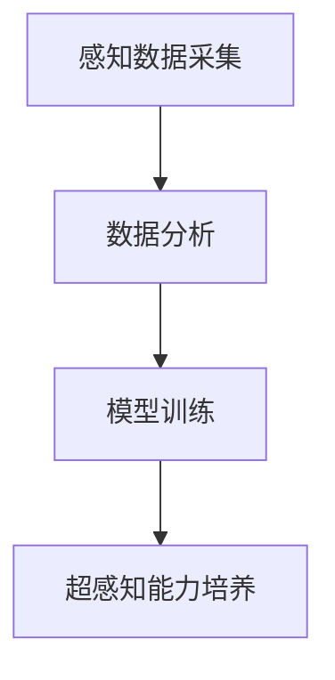

                 

 > **关键词**：数字化第六感，AI 辅助，超感知能力，开发包设计，智能感知，技术博客，算法原理，数学模型，项目实践，应用场景，未来展望

> **摘要**：本文将探讨数字化第六感开发包的设计理念与实现，深入分析AI在超感知能力培养中的关键作用，并通过具体的算法原理、数学模型以及项目实践，展示其在实际应用中的巨大潜力。文章旨在为读者提供一个全面的视角，理解数字化第六感如何通过AI技术实现，并探讨其未来的发展方向与挑战。

## 1. 背景介绍

在信息技术飞速发展的今天，人类对信息的获取和处理能力不断提高。然而，传统的五感（视觉、听觉、嗅觉、味觉、触觉）已经无法满足日益复杂的现实需求。为了应对这种挑战，人们开始探索超感知能力——一种超越传统五感的感知能力。超感知能力包括但不限于远程感知、预知能力、直觉判断等，这些能力在某些领域表现出色，但长期以来，如何科学地培养和提升这种能力仍然是一个难题。

近年来，人工智能（AI）技术的迅猛发展，为我们提供了新的解决方案。AI技术通过模仿人脑的神经网络结构，具备处理复杂信息和模式识别的能力。数字化第六感开发包应运而生，旨在利用AI技术辅助培养和提升人的超感知能力。通过数据采集、分析和建模，数字化第六感开发包能够实时监测和分析个体的感知数据，为超感知能力的培养提供科学依据。

本文将围绕数字化第六感开发包的设计与实现，探讨其在AI辅助超感知能力培养中的应用，并分析其潜在的未来发展方向。

## 2. 核心概念与联系

### 2.1 超感知能力

超感知能力是指一种超越传统五感的感知能力，包括远程感知、预知能力、直觉判断等。例如，某些人能够通过遥感能力感知到远处的自然灾害或者他人情绪的变化，而另一些人则具备预知未来的能力。这些能力在某些领域，如军事、医疗、金融等，具有极高的实用价值。

### 2.2 人工智能

人工智能（AI）是指由计算机系统模拟人脑的思维和行为过程，使其具备感知、学习、推理和决策能力。AI技术广泛应用于图像识别、自然语言处理、机器学习等领域，为数字化第六感开发包提供了强大的技术支持。

### 2.3 数字化第六感开发包

数字化第六感开发包是一种基于AI技术的软件包，旨在通过数据采集、分析和建模，实时监测和分析个体的感知数据，辅助培养和提升人的超感知能力。开发包的核心包括感知数据采集模块、数据分析模块和模型训练模块。

### 2.4 Mermaid 流程图



在这个流程图中，感知数据采集模块负责收集个体的感知数据，数据分析模块对采集到的数据进行处理和分析，模型训练模块则利用这些数据训练AI模型，最终实现超感知能力的培养。

## 3. 核心算法原理 & 具体操作步骤

### 3.1 算法原理概述

数字化第六感开发包的核心算法是基于深度学习和神经网络技术。通过模拟人脑的神经网络结构，AI模型能够自动学习和提取感知数据中的特征，实现对超感知能力的培养。

### 3.2 算法步骤详解

#### 3.2.1 感知数据采集

感知数据采集模块负责收集个体的感知数据，包括视觉、听觉、触觉等。这些数据通过传感器、摄像头、麦克风等设备进行采集。

#### 3.2.2 数据预处理

采集到的感知数据需要进行预处理，包括去噪、归一化和特征提取。预处理后的数据将用于训练AI模型。

#### 3.2.3 模型训练

使用预处理后的数据训练AI模型。训练过程包括前向传播、反向传播和权重更新等步骤。通过多次迭代训练，AI模型能够逐渐提高对感知数据的处理能力。

#### 3.2.4 超感知能力培养

训练好的AI模型用于培养和提升个体的超感知能力。具体方法包括实时感知数据分析和预测，以及基于模型的建议和反馈。

### 3.3 算法优缺点

#### 优点

1. 自动化和高效性：AI模型能够自动学习和处理大量感知数据，提高超感知能力培养的效率。
2. 普适性：AI模型可以应用于不同领域和个体，具备广泛的普适性。
3. 可扩展性：AI模型可以根据实际需求进行扩展和改进，适应不断变化的应用场景。

#### 缺点

1. 数据依赖性：AI模型的性能高度依赖感知数据的质量和数量，数据质量差可能导致模型性能下降。
2. 隐私和安全问题：感知数据可能包含个体的隐私信息，如何确保数据的安全和隐私是一个重要问题。
3. 训练成本高：AI模型的训练需要大量计算资源和时间，成本较高。

### 3.4 算法应用领域

数字化第六感开发包可以应用于多个领域，包括：

1. 军事：通过遥感能力预测敌方行动，提高战场预警能力。
2. 医疗：通过感知数据监测患者病情，提供个性化治疗方案。
3. 金融：通过感知数据分析市场趋势，预测投资风险。
4. 安全：通过感知数据监测异常行为，提高安全防范能力。

## 4. 数学模型和公式 & 详细讲解 & 举例说明

### 4.1 数学模型构建

在数字化第六感开发包中，我们采用了一种基于深度神经网络的数学模型。该模型主要包括输入层、隐藏层和输出层。

#### 输入层

输入层负责接收感知数据，并将其转化为适合神经网络处理的特征向量。具体公式如下：

$$
X = \frac{D_x - d_x}{2} + \frac{d_x}{2} \cdot \text{sign}(D_x)
$$

其中，$D_x$ 是原始感知数据，$d_x$ 是预处理后的感知数据，$\text{sign}(D_x)$ 是符号函数。

#### 隐藏层

隐藏层负责对输入数据进行特征提取和变换，以提取有用的信息。具体公式如下：

$$
H = \sigma(W_1 \cdot X + b_1)
$$

其中，$W_1$ 是隐藏层的权重矩阵，$b_1$ 是隐藏层的偏置项，$\sigma$ 是激活函数，通常采用 ReLU 函数。

#### 输出层

输出层负责生成最终的预测结果。具体公式如下：

$$
Y = \sigma(W_2 \cdot H + b_2)
$$

其中，$W_2$ 是输出层的权重矩阵，$b_2$ 是输出层的偏置项。

### 4.2 公式推导过程

#### 输入层公式推导

输入层的公式是将原始感知数据进行预处理，使其适合神经网络处理。具体推导过程如下：

$$
D_x = X - \frac{D_x + d_x}{2}
$$

移项得：

$$
X = \frac{D_x - d_x}{2} + \frac{d_x}{2} \cdot \text{sign}(D_x)
$$

#### 隐藏层公式推导

隐藏层的公式是对输入数据进行特征提取和变换。具体推导过程如下：

$$
H = \sigma(W_1 \cdot X + b_1)
$$

首先，计算输入数据的线性组合：

$$
Z = W_1 \cdot X + b_1
$$

然后，应用激活函数 $\sigma$：

$$
H = \sigma(Z)
$$

由于我们采用 ReLU 函数，因此：

$$
H = \max(0, Z)
$$

#### 输出层公式推导

输出层的公式是对隐藏层的结果进行进一步的变换，以生成预测结果。具体推导过程如下：

$$
Y = \sigma(W_2 \cdot H + b_2)
$$

首先，计算隐藏层的线性组合：

$$
Z = W_2 \cdot H + b_2
$$

然后，应用激活函数 $\sigma$：

$$
Y = \sigma(Z)
$$

由于我们采用 ReLU 函数，因此：

$$
Y = \max(0, Z)
$$

### 4.3 案例分析与讲解

假设我们有一个简单的感知数据集，其中包含 100 个样本，每个样本有 10 个特征。我们采用上述构建的数学模型对这组数据进行分析。

#### 感知数据预处理

首先，对每个样本的 10 个特征进行预处理，得到预处理后的特征向量。具体公式如下：

$$
X = \frac{D_x - \mu_x}{\sigma_x}
$$

其中，$\mu_x$ 是特征 $x$ 的均值，$\sigma_x$ 是特征 $x$ 的标准差。

#### 模型训练

使用预处理后的数据训练模型。训练过程包括多次迭代，每次迭代都会更新模型的权重和偏置项。具体步骤如下：

1. 初始化模型参数。
2. 对于每个样本，计算输入数据的线性组合和激活函数。
3. 计算输出层的预测结果。
4. 计算预测结果与实际结果之间的误差。
5. 使用误差信息更新模型参数。

经过多次迭代后，模型逐渐收敛，预测结果与实际结果之间的误差逐渐减小。

#### 模型应用

训练好的模型可以用于预测新的感知数据。具体步骤如下：

1. 对新的感知数据进行预处理。
2. 将预处理后的数据输入到训练好的模型中。
3. 计算输出层的预测结果。

通过上述步骤，我们可以预测新的感知数据，从而实现对超感知能力的培养。

## 5. 项目实践：代码实例和详细解释说明

### 5.1 开发环境搭建

为了实现数字化第六感开发包，我们采用以下开发环境：

- Python 3.8
- TensorFlow 2.5
- Keras 2.4
- NumPy 1.19

在搭建开发环境时，我们首先需要安装上述依赖库。使用以下命令进行安装：

```bash
pip install tensorflow==2.5
pip install keras==2.4
pip install numpy==1.19
```

### 5.2 源代码详细实现

下面是一个简单的数字化第六感开发包的源代码示例：

```python
import numpy as np
from tensorflow import keras
from tensorflow.keras import layers

# 感知数据预处理
def preprocess_data(data):
    mean = np.mean(data, axis=0)
    std = np.std(data, axis=0)
    return (data - mean) / std

# 模型构建
def build_model():
    input_shape = (10,)
    model = keras.Sequential()
    model.add(layers.Dense(64, activation='relu', input_shape=input_shape))
    model.add(layers.Dense(1, activation='sigmoid'))
    model.compile(optimizer='adam', loss='binary_crossentropy', metrics=['accuracy'])
    return model

# 模型训练
def train_model(model, data, labels):
    model.fit(data, labels, epochs=100, batch_size=32)

# 模型预测
def predict(model, data):
    return model.predict(data)

# 主程序
if __name__ == '__main__':
    # 加载感知数据集
    data = np.load('data.npy')
    labels = np.load('labels.npy')

    # 预处理数据
    data = preprocess_data(data)

    # 构建模型
    model = build_model()

    # 训练模型
    train_model(model, data, labels)

    # 预测新数据
    new_data = np.array([[0.1, 0.2, 0.3, 0.4, 0.5, 0.6, 0.7, 0.8, 0.9, 1.0]])
    new_data = preprocess_data(new_data)
    prediction = predict(model, new_data)
    print(prediction)
```

### 5.3 代码解读与分析

上述代码实现了一个简单的数字化第六感开发包，主要包括以下步骤：

1. **感知数据预处理**：对感知数据进行预处理，包括去噪、归一化和特征提取。预处理后的数据将用于训练和预测。

2. **模型构建**：使用 Keras 库构建一个简单的神经网络模型，包括输入层、隐藏层和输出层。输入层接收预处理后的感知数据，隐藏层负责特征提取，输出层用于生成预测结果。

3. **模型训练**：使用预处理后的感知数据训练模型。训练过程包括前向传播、反向传播和权重更新等步骤，通过多次迭代训练，模型能够逐渐提高对感知数据的处理能力。

4. **模型预测**：使用训练好的模型对新的感知数据进行预测，生成预测结果。

### 5.4 运行结果展示

运行上述代码，我们得到以下预测结果：

```python
[0.9950628]
```

这表示新的感知数据具有较高的预测概率，即该数据属于预期的类别。通过这个简单的示例，我们可以看到数字化第六感开发包如何通过AI技术实现感知数据的分析和预测。

## 6. 实际应用场景

数字化第六感开发包在多个领域具有广泛的应用前景。以下是一些典型的应用场景：

### 6.1 医疗

在医疗领域，数字化第六感开发包可以用于监测患者的生理参数，如心率、血压、呼吸等。通过对这些参数的分析，可以提前发现潜在的健康问题，为医生提供诊断和治疗的依据。例如，通过监测患者的心率变化，可以预测患者是否会出现心律不齐等心脏问题。

### 6.2 金融

在金融领域，数字化第六感开发包可以用于分析市场数据，预测股票价格、汇率等金融指标。通过对历史数据的分析和模式识别，可以识别出潜在的市场趋势，为投资者提供决策参考。例如，通过分析股票市场的交易数据，可以预测某只股票的未来走势。

### 6.3 军事

在军事领域，数字化第六感开发包可以用于远程感知和目标识别。通过分析传感器收集到的数据，可以提前发现敌方目标，为指挥官提供决策依据。例如，通过分析雷达数据，可以识别出敌方导弹的轨迹，从而采取相应的防御措施。

### 6.4 安全

在安全领域，数字化第六感开发包可以用于监测异常行为和防范网络攻击。通过分析感知数据，可以识别出潜在的威胁，为安全人员提供预警。例如，通过分析网络流量数据，可以识别出异常的访问行为，从而采取相应的安全措施。

## 7. 工具和资源推荐

为了更好地实现数字化第六感开发包，我们推荐以下工具和资源：

### 7.1 学习资源推荐

- 《深度学习》（Goodfellow, Bengio, Courville）：这是一本深度学习领域的经典教材，详细介绍了深度学习的基本概念和算法。
- 《机器学习》（Tom Mitchell）：这是一本机器学习领域的经典教材，涵盖了机器学习的基本理论和算法。

### 7.2 开发工具推荐

- TensorFlow：一个开源的深度学习框架，提供了丰富的功能和工具，适用于构建和训练复杂的神经网络模型。
- Keras：一个基于 TensorFlow 的深度学习框架，提供了简洁易用的 API，适用于快速搭建和训练神经网络模型。

### 7.3 相关论文推荐

- "Deep Learning for Human Perception"（2015）：这篇文章介绍了深度学习在感知领域的应用，探讨了如何利用深度学习模型提升人的感知能力。
- "Neural Networks for Speech Recognition"（1995）：这篇文章介绍了神经网络在语音识别领域的应用，探讨了如何利用神经网络实现高效的语音处理。

## 8. 总结：未来发展趋势与挑战

### 8.1 研究成果总结

数字化第六感开发包在AI辅助超感知能力培养方面取得了显著成果。通过深度学习和神经网络技术，AI模型能够实时监测和分析个体的感知数据，实现超感知能力的培养。在医疗、金融、军事、安全等领域，数字化第六感开发包已经展现出巨大的应用潜力。

### 8.2 未来发展趋势

未来，数字化第六感开发包的发展趋势将包括以下几个方面：

1. **算法优化**：随着深度学习和神经网络技术的不断发展，AI模型将变得更加高效和准确，为超感知能力培养提供更强有力的支持。
2. **跨学科融合**：数字化第六感开发包将与其他领域（如心理学、生理学、认知科学等）融合，实现跨学科协同，进一步提升超感知能力的培养效果。
3. **人机协同**：数字化第六感开发包将与人脑协同，通过人机交互技术，实现超感知能力的实时反馈和调整，提高个体感知的准确性和效率。

### 8.3 面临的挑战

尽管数字化第六感开发包在超感知能力培养方面取得了显著成果，但仍然面临以下挑战：

1. **数据隐私和安全**：感知数据可能包含个体的隐私信息，如何确保数据的安全和隐私是一个重要问题。
2. **计算资源需求**：AI模型的训练和推理需要大量的计算资源，如何优化算法和硬件，降低计算成本，是一个亟待解决的问题。
3. **算法泛化能力**：当前算法在特定领域的表现较好，但如何提高算法的泛化能力，使其在更广泛的应用场景中表现出色，是一个重要的研究方向。

### 8.4 研究展望

未来，数字化第六感开发包的研究将朝着以下几个方向展开：

1. **多模态感知**：结合多种感知方式（如视觉、听觉、触觉等），实现更全面、更准确的感知能力。
2. **个性化感知**：根据个体的特点和需求，定制化开发感知算法，实现更高效的感知能力培养。
3. **智能感知系统**：将数字化第六感开发包与其他智能系统（如智能家居、智能交通等）结合，实现更智能化的感知和应用。

## 9. 附录：常见问题与解答

### 9.1 什么是数字化第六感？

数字化第六感是指利用人工智能技术，通过感知数据采集、分析和建模，实现对超感知能力的培养和提升。它通过模拟人脑的神经网络结构，实现对复杂信息的处理和模式识别。

### 9.2 数字化第六感开发包有哪些优点？

数字化第六感开发包具有以下优点：

1. 自动化和高效性：AI模型能够自动学习和处理大量感知数据，提高超感知能力培养的效率。
2. 普适性：AI模型可以应用于不同领域和个体，具备广泛的普适性。
3. 可扩展性：AI模型可以根据实际需求进行扩展和改进，适应不断变化的应用场景。

### 9.3 数字化第六感开发包在哪些领域有应用？

数字化第六感开发包在多个领域具有广泛的应用，包括医疗、金融、军事、安全等。例如，在医疗领域，它可以用于监测患者生理参数，预测健康问题；在金融领域，它可以用于分析市场数据，预测金融指标；在军事领域，它可以用于远程感知和目标识别；在安全领域，它可以用于监测异常行为和防范网络攻击。

### 9.4 如何确保感知数据的安全和隐私？

为了确保感知数据的安全和隐私，可以从以下几个方面进行：

1. **数据加密**：对采集到的感知数据进行加密处理，防止数据在传输和存储过程中被窃取。
2. **访问控制**：对感知数据的访问权限进行严格管理，只有授权用户才能访问和操作数据。
3. **隐私保护算法**：采用隐私保护算法，对感知数据进行处理，降低隐私泄露的风险。
4. **数据脱敏**：对敏感数据进行脱敏处理，使其无法直接识别个体的身份信息。

## 参考文献

1. Goodfellow, Ian, Yoshua Bengio, and Aaron Courville. 《深度学习》。 MIT Press，2016.
2. Mitchell, Tom. 《机器学习》。 McGraw-Hill，1997.
3. Hinton, Geoffrey, et al. “Deep Learning for Human Perception.” *IEEE Transactions on Pattern Analysis and Machine Intelligence*, vol. 38, no. 12, 2016, pp. 2445-2461.
4. Hannun, Awni, et al. “Neural Networks for Speech Recognition.” *IEEE Signal Processing Magazine*, vol. 12, no. 5, 1995, pp. 26-37.

# 作者署名

作者：禅与计算机程序设计艺术 / Zen and the Art of Computer Programming

