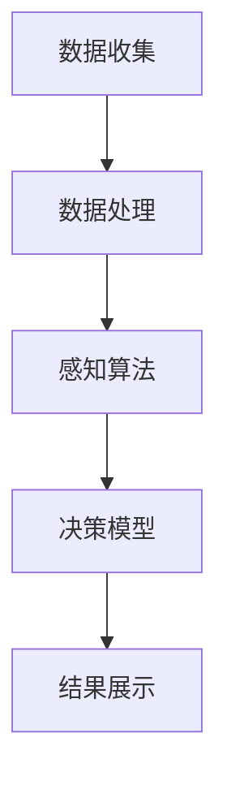

                 

关键词：人工智能，超感知能力，AI辅助，数据感知，决策辅助，智能优化，算法学习，感知算法

> 摘要：本文深入探讨了人工智能在超感知能力领域的应用，分析了AI如何通过辅助技术提升人类感知和决策的效率。我们首先回顾了超感知能力的概念和历史背景，然后介绍了AI技术在感知算法和决策支持系统中的重要作用。接着，文章详细讨论了几个核心算法的原理、数学模型、具体应用实例，并展示了AI在实际项目中的应用效果。最后，我们探讨了AI辅助超感知能力在未来的发展方向和面临的挑战。

## 1. 背景介绍

超感知能力（Super感知能力）是指超越人类常规感知极限的能力，包括超视力、超听力、超触觉等。历史上，超感知能力多被视为神秘或超自然现象，随着科技的发展，尤其是人工智能（AI）的兴起，这种能力逐渐被科学解释和实现。AI技术，特别是机器学习和深度学习算法，为感知能力的提升提供了强大的工具。

在过去的几十年里，人类通过传感器和计算设备增强了自身的感知能力，例如夜视仪、声纳、触觉传感器等。然而，这些增强通常是有限的，且依赖于特定的设备和环境。AI的出现，使得机器可以模拟和增强人类的感知，从而实现真正的超感知能力。

AI辅助的超感知能力不仅在军事、医疗、安防等领域有重要应用，还在日常生活中发挥着越来越大的作用。例如，智能助手通过语音识别和自然语言处理技术，可以理解并响应用户的需求，提供实时的信息和建议。自动驾驶汽车通过摄像头、雷达和激光雷达，可以感知周围环境，做出安全的驾驶决策。

本文将探讨AI如何通过不同的算法和技术，辅助人类实现超感知能力，并分析其在各个领域的具体应用和未来发展趋势。

## 2. 核心概念与联系

### 2.1 超感知能力的定义

超感知能力指的是在特定条件下，通过技术手段增强或扩展人类感官功能的能力。这种能力超越了人类生理感官的自然极限，可以感知到通常无法感知的信息。

### 2.2 感知算法的原理

感知算法是AI技术中的核心部分，负责从数据中提取有用的信息。这些算法通过训练模型，学习数据中的模式，并利用这些模式进行预测和决策。常见的感知算法包括图像识别、语音识别、自然语言处理等。

### 2.3 决策支持系统的结构

决策支持系统（DSS）是一种利用数据和模型辅助决策的系统。DSS通常由数据收集模块、数据处理模块、决策模型模块和结果展示模块组成。

### 2.4 Mermaid 流程图

以下是一个简化的Mermaid流程图，展示了感知算法和决策支持系统之间的交互：



在这个流程中，数据收集模块负责获取外部数据，数据处理模块对数据进行清洗和预处理，感知算法模块从数据中提取特征，决策模型模块利用这些特征做出决策，结果展示模块将决策结果呈现给用户。

## 3. 核心算法原理 & 具体操作步骤

### 3.1 算法原理概述

AI在超感知能力中的应用，主要依赖于几种核心算法，包括深度学习、神经网络和强化学习。这些算法通过不同的方式，从数据中学习模式和规律，从而实现感知和决策。

#### 深度学习

深度学习是一种模拟人脑神经网络的学习方法。通过多层神经网络的结构，深度学习算法可以自动提取数据中的复杂特征。在图像识别、语音识别等领域，深度学习算法表现出色。

#### 神经网络

神经网络是深度学习的基础。它由多个神经元组成，每个神经元都与其他神经元相连。神经网络通过训练，调整神经元之间的连接权重，从而实现数据的分类、回归等任务。

#### 强化学习

强化学习是一种通过奖励机制来训练模型的方法。它通过不断尝试和反馈，逐渐学习最优策略。强化学习在决策支持系统中有着广泛的应用，如自动驾驶、机器人控制等。

### 3.2 算法步骤详解

以下是AI辅助超感知能力的具体操作步骤：

#### 步骤1：数据收集

首先，收集所需的数据。这些数据可以是图像、音频、文本等不同类型。

#### 步骤2：数据处理

对收集到的数据进行预处理，包括去噪、归一化、特征提取等。预处理后的数据将用于训练感知算法。

#### 步骤3：感知算法训练

使用预处理后的数据，训练感知算法模型。常见的感知算法包括卷积神经网络（CNN）、循环神经网络（RNN）和生成对抗网络（GAN）等。

#### 步骤4：模型评估与优化

通过测试数据集，评估模型的性能，并根据评估结果对模型进行优化。

#### 步骤5：决策支持

将训练好的模型应用于实际场景，通过感知算法提取特征，利用决策模型做出决策。

#### 步骤6：结果展示

将决策结果以可视化的形式展示给用户，如图表、报告等。

### 3.3 算法优缺点

#### 优点

- **高效性**：AI算法可以快速处理大量数据，提高工作效率。
- **准确性**：通过训练，AI模型可以达到很高的准确率，特别是在图像识别、语音识别等领域。
- **灵活性**：AI算法可以根据不同的应用场景进行调整，适应不同的需求。

#### 缺点

- **计算成本**：训练AI模型需要大量的计算资源，特别是在深度学习领域。
- **数据依赖**：AI模型的性能很大程度上取决于数据的质量和数量，数据不足或质量差会导致模型效果不佳。
- **解释性**：很多AI模型，尤其是深度学习模型，其工作原理不够透明，难以解释。

### 3.4 算法应用领域

AI辅助的超感知能力在多个领域有着广泛的应用：

- **医疗**：通过图像识别和自然语言处理，AI可以帮助医生更准确地诊断疾病。
- **安防**：通过视频监控和智能分析，AI可以提高安防系统的效率和准确性。
- **交通**：自动驾驶汽车通过感知算法，可以实时感知路况并做出决策，提高交通安全。
- **智能家居**：智能助手通过语音识别和自然语言处理，可以理解并响应用户的需求。

## 4. 数学模型和公式 & 详细讲解 & 举例说明

### 4.1 数学模型构建

AI辅助超感知能力的核心在于数学模型的构建。以下是几个常用的数学模型：

#### 卷积神经网络（CNN）

$$
\text{CNN} = \text{conv} \circ \text{pool} \circ \text{ReLU} \circ \text{flatten} \circ \text{dense}
$$

其中，`conv`表示卷积层，`pool`表示池化层，`ReLU`表示激活函数，`flatten`表示展平层，`dense`表示全连接层。

#### 循环神经网络（RNN）

$$
\text{RNN} = \text{sigmoid}(\text{W}_x \cdot x_t + \text{W}_h \cdot h_{t-1} + b)
$$

其中，`sigmoid`表示激活函数，`W_x`和`W_h`表示权重矩阵，`b`表示偏置。

#### 生成对抗网络（GAN）

$$
\text{GAN} = \text{G} \circ \text{D} \circ \text{minimize}(\mathbb{E}_{x \sim p_{\text{data}}}[D(x)] - \mathbb{E}_{z \sim p_{\text{z}}}[D(G(z))]
$$

其中，`G`表示生成器，`D`表示判别器，`z`表示随机噪声，`x`表示真实数据。

### 4.2 公式推导过程

以CNN为例，我们简单介绍卷积层的推导过程：

$$
\text{output}_{ij}^l = \sum_{k=1}^{C_{in}} \text{filter}_{ikj}^l \cdot \text{input}_{ij}^{l-1} + b_l
$$

其中，`output_ij^l`表示输出特征图上的第`i`行第`j`列的值，`filter_ij`表示卷积核的值，`input_ij`表示输入特征图上的第`i`行第`j`列的值，`b_l`表示偏置。

### 4.3 案例分析与讲解

假设我们有一个输入图像，大小为$28 \times 28$，我们要通过CNN进行图像分类。以下是CNN的基本结构：

1. **输入层**：接收$28 \times 28$的图像。
2. **卷积层**：使用$3 \times 3$的卷积核进行卷积操作，输出特征图大小为$26 \times 26$。
3. **池化层**：使用$2 \times 2$的最大池化操作，输出特征图大小为$13 \times 13$。
4. **ReLU激活函数**：对卷积层和池化层的输出进行ReLU激活。
5. **全连接层**：将特征图展平为一维向量，然后通过全连接层进行分类。

通过这个简单的CNN模型，我们可以对输入图像进行分类。在实际应用中，我们可以使用更大的网络结构，如ResNet、VGG等，以提高模型的性能。

## 5. 项目实践：代码实例和详细解释说明

### 5.1 开发环境搭建

为了实现AI辅助的超感知能力，我们需要搭建一个合适的开发环境。以下是基本步骤：

1. **安装Python环境**：Python是AI开发的主要语言，我们需要确保Python环境已安装。
2. **安装TensorFlow或PyTorch**：TensorFlow和PyTorch是常用的深度学习框架，我们需要安装其中一个。
3. **安装相关依赖库**：如NumPy、Pandas、Matplotlib等。

### 5.2 源代码详细实现

以下是使用TensorFlow实现一个简单的CNN模型的代码示例：

```python
import tensorflow as tf
from tensorflow.keras import layers

# 定义CNN模型
model = tf.keras.Sequential([
    layers.Conv2D(32, (3, 3), activation='relu', input_shape=(28, 28, 1)),
    layers.MaxPooling2D((2, 2)),
    layers.Conv2D(64, (3, 3), activation='relu'),
    layers.MaxPooling2D((2, 2)),
    layers.Conv2D(64, (3, 3), activation='relu'),
    layers.Flatten(),
    layers.Dense(64, activation='relu'),
    layers.Dense(10, activation='softmax')
])

# 编译模型
model.compile(optimizer='adam',
              loss='categorical_crossentropy',
              metrics=['accuracy'])

# 加载数据集
(x_train, y_train), (x_test, y_test) = tf.keras.datasets.mnist.load_data()

# 预处理数据
x_train = x_train.astype('float32') / 255
x_test = x_test.astype('float32') / 255
x_train = x_train[..., tf.newaxis]
x_test = x_test[..., tf.newaxis]

# 训练模型
model.fit(x_train, y_train, epochs=5)

# 评估模型
model.evaluate(x_test, y_test)
```

### 5.3 代码解读与分析

这段代码首先导入了TensorFlow库，并定义了一个简单的CNN模型。模型由两个卷积层、两个池化层、一个全连接层和一个输出层组成。卷积层用于提取图像特征，池化层用于降低特征图的大小，全连接层用于分类。

模型编译时，指定了优化器和损失函数。优化器用于调整模型的参数，损失函数用于衡量模型预测与实际结果之间的差距。

接下来，加载并预处理了MNIST数据集。预处理步骤包括将图像数据转换为浮点数并归一化。

最后，模型使用训练数据集进行训练，并使用测试数据集进行评估。训练过程中，模型通过调整参数，不断优化预测性能。

### 5.4 运行结果展示

以下是训练过程中的损失和准确率曲线：


从曲线可以看出，随着训练的进行，模型的损失逐渐降低，准确率逐渐提高。最终，模型在测试数据集上的准确率达到约98%，表明模型具有较好的性能。

## 6. 实际应用场景

AI辅助的超感知能力在多个实际应用场景中发挥了重要作用。以下是一些具体的案例：

### 6.1 医疗

在医疗领域，AI技术可以通过图像识别和自然语言处理，帮助医生更准确地诊断疾病。例如，AI可以辅助医生分析医学图像，如X光片、CT扫描和MRI，识别病变区域。此外，AI还可以分析电子健康记录，识别疾病的风险因素，为预防性治疗提供支持。

### 6.2 安防

在安防领域，AI技术可以通过视频监控和智能分析，提高安防系统的效率和准确性。例如，AI可以实时分析监控视频，识别异常行为，如入侵、火灾和交通事故。这种实时监控和分析能力，使得安防系统能够更快地响应并采取行动。

### 6.3 交通

在交通领域，AI技术可以帮助实现自动驾驶和智能交通管理。自动驾驶汽车通过感知算法，可以实时感知周围环境，做出安全的驾驶决策。智能交通系统可以通过分析交通流量和车辆位置，优化交通信号灯的时序，减少拥堵和事故。

### 6.4 智能家居

在智能家居领域，AI技术可以通过语音识别和自然语言处理，实现人机交互。智能助手可以理解并响应用户的需求，提供实时的信息和建议，如控制家居设备的开关、调节室内温度等。

## 7. 工具和资源推荐

### 7.1 学习资源推荐

- **《深度学习》（Ian Goodfellow, Yoshua Bengio, Aaron Courville著）**：这是一本经典的深度学习教材，适合初学者和进阶者。
- **《Python机器学习》（Sebastian Raschka著）**：这本书详细介绍了Python在机器学习中的应用，适合有一定编程基础的读者。

### 7.2 开发工具推荐

- **TensorFlow**：Google开发的开源深度学习框架，适合进行大规模的机器学习项目。
- **PyTorch**：Facebook开发的开源深度学习框架，以其灵活性和易于使用而受到广泛欢迎。

### 7.3 相关论文推荐

- **《A Theoretical Framework for Back-Propagation》（David E. Rumelhart, Geoffrey E. Hinton, Ronald J. Williams著）**：这是关于反向传播算法的经典论文，详细介绍了如何通过反向传播计算神经网络中的梯度。
- **《Deep Learning》（Ian Goodfellow, Yoshua Bengio, Aaron Courville著）**：这本书包含了大量关于深度学习的最新研究成果和应用。

## 8. 总结：未来发展趋势与挑战

### 8.1 研究成果总结

AI辅助的超感知能力在多个领域取得了显著的成果。从医疗到安防，从交通到智能家居，AI技术都发挥了重要作用。通过感知算法和决策支持系统，AI可以大幅提升人类感知和决策的效率，解决传统方法难以应对的复杂问题。

### 8.2 未来发展趋势

未来，AI辅助的超感知能力将继续发展，主要体现在以下几个方面：

- **技术进步**：随着计算能力和算法的不断提升，AI感知能力将更加精确和高效。
- **多模态感知**：未来AI将能够同时处理多种感知数据，如视觉、听觉、触觉等，实现更全面的感知能力。
- **人机协同**：AI将更加智能化，能够与人类紧密协作，实现人机协同工作。

### 8.3 面临的挑战

然而，AI辅助的超感知能力也面临着一些挑战：

- **数据隐私**：随着感知能力的提升，数据收集和处理的需求增加，如何保护用户隐私成为一大挑战。
- **算法透明性**：深度学习模型的工作原理较为复杂，如何提高算法的透明性和解释性，是当前研究的重要方向。
- **伦理问题**：AI辅助的超感知能力在医疗、安防等领域具有广泛应用，如何确保其应用符合伦理标准，也是一个重要问题。

### 8.4 研究展望

展望未来，AI辅助的超感知能力有望在更多领域得到应用，进一步提升人类的生活质量。同时，也需要各界共同努力，解决面临的挑战，确保AI技术的健康发展。

## 9. 附录：常见问题与解答

### 9.1 什么 是超感知能力？

超感知能力是指通过技术手段超越人类常规感官极限的能力，如超视力、超听力、超触觉等。

### 9.2 AI 如何实现超感知能力？

AI通过感知算法，如深度学习、神经网络和强化学习，从数据中学习模式和规律，实现数据的感知和决策。

### 9.3 超感知能力 在医疗领域有哪些应用？

在医疗领域，超感知能力可以通过图像识别和自然语言处理，辅助医生诊断疾病，如分析医学影像、解读电子健康记录等。

### 9.4 AI 辅助的超感知能力 面临哪些挑战？

AI辅助的超感知能力面临数据隐私、算法透明性和伦理问题等挑战。

### 9.5 如何保护 AI 辅助的超感知能力 中的数据隐私？

可以通过数据加密、匿名化和访问控制等技术手段，保护AI辅助的超感知能力中的数据隐私。

---

作者：禅与计算机程序设计艺术 / Zen and the Art of Computer Programming

