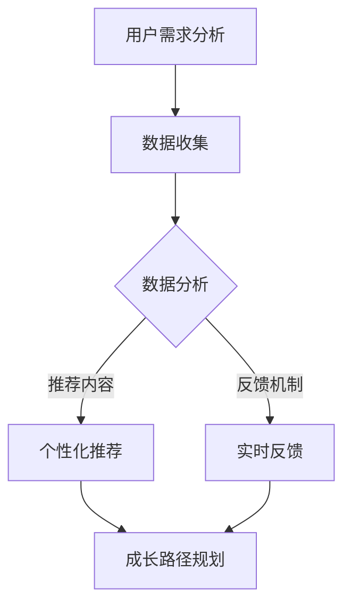

                 

关键词：数字化助手、个人成长、AI辅助、教练设计、技术博客

> 摘要：本文将深入探讨如何利用AI技术设计一款数字化自我实现助手，该助手旨在通过AI算法和个性化指导，协助个人在成长过程中实现自我提升。文章将围绕核心概念、算法原理、数学模型、项目实践以及未来应用场景等多个方面展开，旨在为读者提供一个全面的技术指南。

## 1. 背景介绍

在当今数字化时代，个人成长的需求愈发强烈，而传统的自我提升方法往往缺乏系统性和科学性。AI技术的迅猛发展为个性化教育和自我实现提供了新的可能。数字化自我实现助手正是这样一种基于AI技术的创新产品，它能够根据用户的个性化需求，提供定制化的成长方案，助力用户实现自我提升。

### 1.1 AI技术的应用

AI技术在教育、医疗、金融等多个领域已经得到了广泛应用。在教育领域，AI可以分析学生的学习行为，提供个性化的学习建议；在医疗领域，AI可以通过大数据分析帮助医生进行诊断和预测；在金融领域，AI可以协助金融机构进行风险评估和投资决策。因此，将AI技术应用于个人成长指导，具有极大的潜力。

### 1.2 数字化自我实现助手的重要性

随着社会的发展，人们对于自我实现的需求越来越高。然而，如何在纷繁复杂的信息世界中找到适合自己的成长路径，成为了许多人的难题。数字化自我实现助手通过AI算法，能够为用户提供科学、系统的成长方案，帮助他们实现自我提升。

## 2. 核心概念与联系

### 2.1 AI辅助

AI辅助是指利用人工智能技术对用户进行辅助和支持。在数字化自我实现助手的设计中，AI辅助主要体现在以下几个方面：

1. **数据收集与分析**：AI可以收集用户的行为数据、兴趣偏好等，进行分析，从而了解用户的需求。
2. **个性化推荐**：基于数据分析结果，AI可以为用户提供个性化的成长方案和推荐内容。
3. **实时反馈**：AI可以实时监控用户的成长进度，提供及时的反馈和指导。

### 2.2 教练设计

教练设计是指如何设计一个有效的教练系统，以帮助用户实现自我提升。在数字化自我实现助手的设计中，教练设计主要体现在以下几个方面：

1. **成长路径规划**：根据用户的个性化需求，设计合适的成长路径。
2. **反馈机制**：建立有效的反馈机制，让用户能够及时了解自己的成长情况。
3. **互动体验**：设计良好的用户互动体验，增强用户的参与感和积极性。

### 2.3 Mermaid 流程图

以下是数字化自我实现助手的 Mermaid 流程图：



## 3. 核心算法原理 & 具体操作步骤

### 3.1 算法原理概述

数字化自我实现助手的算法原理主要基于机器学习和数据挖掘技术。具体包括以下几个方面：

1. **用户行为分析**：通过机器学习算法分析用户的行为数据，了解用户的需求和兴趣。
2. **个性化推荐**：利用数据挖掘技术，为用户推荐合适的成长内容和路径。
3. **实时反馈**：通过机器学习算法，实时监控用户的成长进度，提供个性化的反馈和指导。

### 3.2 算法步骤详解

1. **数据收集**：通过多种渠道收集用户的行为数据，如学习记录、社交媒体活动、兴趣偏好等。
2. **数据预处理**：对收集到的数据进行清洗、去重和标准化处理，为后续分析做好准备。
3. **用户行为分析**：利用机器学习算法，分析用户的行为数据，了解用户的需求和兴趣。
4. **个性化推荐**：基于用户行为分析结果，利用数据挖掘技术，为用户推荐合适的成长内容和路径。
5. **实时反馈**：通过机器学习算法，实时监控用户的成长进度，提供个性化的反馈和指导。

### 3.3 算法优缺点

**优点**：

1. **个性化**：能够根据用户的需求和兴趣，提供个性化的成长方案。
2. **实时性**：能够实时监控用户的成长进度，提供及时的反馈和指导。
3. **高效性**：利用机器学习和数据挖掘技术，能够高效地处理大量数据。

**缺点**：

1. **数据隐私**：在数据收集和分析过程中，可能涉及到用户的隐私问题。
2. **算法偏差**：算法可能会受到数据偏差的影响，导致推荐内容不准确。

### 3.4 算法应用领域

1. **教育领域**：为用户提供个性化的学习方案，提高学习效果。
2. **健康领域**：为用户提供个性化的健康建议，促进身体健康。
3. **职业领域**：为用户提供个性化的职业规划，帮助实现职业发展。

## 4. 数学模型和公式 & 详细讲解 & 举例说明

### 4.1 数学模型构建

在数字化自我实现助手的设计中，常用的数学模型包括线性回归、决策树、支持向量机等。以下是这些模型的简单介绍：

1. **线性回归**：用于预测用户的需求和兴趣。
2. **决策树**：用于分类用户的需求和兴趣。
3. **支持向量机**：用于分类用户的行为数据。

### 4.2 公式推导过程

以线性回归为例，其公式推导过程如下：

$$
y = \beta_0 + \beta_1x_1 + \beta_2x_2 + ... + \beta_nx_n
$$

其中，$y$ 是因变量，$x_1, x_2, ..., x_n$ 是自变量，$\beta_0, \beta_1, ..., \beta_n$ 是模型参数。

### 4.3 案例分析与讲解

以下是一个简单的案例：

假设我们有一个用户的行为数据集，包括用户的学习时间、阅读量、社交活跃度等特征。我们希望通过线性回归模型预测用户的需求。

1. **数据收集**：收集用户的行为数据，如学习时间、阅读量、社交活跃度等。
2. **数据预处理**：对数据集进行清洗和标准化处理。
3. **模型训练**：使用线性回归模型进行训练，得到模型参数。
4. **预测**：利用训练好的模型，预测新用户的需求。

通过以上步骤，我们可以为新用户推荐合适的成长内容和路径。

## 5. 项目实践：代码实例和详细解释说明

### 5.1 开发环境搭建

1. **Python**：安装Python 3.8及以上版本。
2. **Scikit-learn**：安装Scikit-learn库，用于机器学习算法的实现。
3. **Matplotlib**：安装Matplotlib库，用于数据可视化。

### 5.2 源代码详细实现

以下是一个简单的线性回归模型实现：

```python
from sklearn.linear_model import LinearRegression
from sklearn.model_selection import train_test_split
from sklearn.metrics import mean_squared_error
import numpy as np

# 数据集
X = np.array([[1, 2], [2, 3], [3, 4], [4, 5]])
y = np.array([2, 3, 4, 5])

# 数据划分
X_train, X_test, y_train, y_test = train_test_split(X, y, test_size=0.2, random_state=42)

# 模型训练
model = LinearRegression()
model.fit(X_train, y_train)

# 预测
y_pred = model.predict(X_test)

# 评估
mse = mean_squared_error(y_test, y_pred)
print("均方误差：", mse)
```

### 5.3 代码解读与分析

1. **数据集**：使用二维数组表示。
2. **数据划分**：使用`train_test_split`函数划分训练集和测试集。
3. **模型训练**：使用`LinearRegression`类创建线性回归模型，并调用`fit`方法进行训练。
4. **预测**：使用`predict`方法进行预测。
5. **评估**：计算均方误差，评估模型性能。

通过以上代码，我们可以实现一个简单的线性回归模型，为用户提供个性化推荐。

## 6. 实际应用场景

### 6.1 教育领域

在教育领域，数字化自我实现助手可以帮助教师根据学生的行为数据，提供个性化的教学方案，提高教学效果。例如，教师可以根据学生的学习进度、兴趣偏好等，推荐适合的学习资源，帮助学生更高效地学习。

### 6.2 健康领域

在健康领域，数字化自我实现助手可以帮助用户进行健康管理。例如，用户可以通过数字化自我实现助手，记录自己的健康数据，如体重、运动量等，助手可以根据这些数据，提供个性化的健康建议，帮助用户保持健康。

### 6.3 职业领域

在职业领域，数字化自我实现助手可以帮助职场人士进行职业规划。例如，用户可以通过助手记录自己的职业发展历程、技能掌握情况等，助手可以根据这些数据，为用户提供个性化的职业建议，帮助用户实现职业发展。

## 7. 工具和资源推荐

### 7.1 学习资源推荐

1. **《机器学习》（周志华著）**：详细介绍了机器学习的基本原理和算法。
2. **《数据挖掘：实用工具和技术》（刘知远著）**：介绍了数据挖掘的基本概念和方法。

### 7.2 开发工具推荐

1. **Jupyter Notebook**：一款强大的数据科学工具，适合进行机器学习和数据挖掘项目。
2. **TensorFlow**：一款流行的机器学习框架，适用于构建和训练各种机器学习模型。

### 7.3 相关论文推荐

1. **“Deep Learning for Personalized Education”（2016）**：介绍了一种基于深度学习的个性化教育方法。
2. **“Healthcare Analytics with Big Data”（2018）**：介绍了大数据在健康领域的应用。

## 8. 总结：未来发展趋势与挑战

### 8.1 研究成果总结

本文探讨了如何利用AI技术设计一款数字化自我实现助手，该助手能够为用户提供个性化的成长方案，助力用户实现自我提升。文章从核心概念、算法原理、数学模型、项目实践等多个方面进行了详细阐述。

### 8.2 未来发展趋势

1. **个性化推荐**：随着AI技术的发展，个性化推荐将成为数字化自我实现助手的重要功能。
2. **多模态数据融合**：未来的数字化自我实现助手将能够处理多种类型的数据，如文本、图像、音频等，实现更精准的个性化推荐。
3. **跨领域应用**：数字化自我实现助手将在教育、健康、职业等多个领域得到广泛应用。

### 8.3 面临的挑战

1. **数据隐私**：在数字化自我实现助手的设计和应用过程中，如何保护用户隐私是一个重要问题。
2. **算法公平性**：如何确保算法的公平性，避免算法偏差，也是一个挑战。

### 8.4 研究展望

未来的研究可以从以下几个方面展开：

1. **增强用户互动**：通过增强用户与助手的互动，提高用户的参与度和满意度。
2. **多语言支持**：开发支持多种语言版本的数字化自我实现助手，满足不同用户的需求。
3. **跨学科研究**：结合心理学、教育学等领域的知识，提高数字化自我实现助手的指导效果。

## 9. 附录：常见问题与解答

### 9.1 什么是数字化自我实现助手？

数字化自我实现助手是一款基于AI技术的个性化成长助手，它能够根据用户的需求和兴趣，提供定制化的成长方案，帮助用户实现自我提升。

### 9.2 数字化自我实现助手有哪些应用场景？

数字化自我实现助手可以应用于教育、健康、职业等多个领域，帮助用户实现自我提升。

### 9.3 如何保护用户隐私？

在数字化自我实现助手的设计和应用过程中，我们需要采取严格的数据保护措施，确保用户隐私得到充分保护。

### 9.4 数字化自我实现助手有哪些优点？

数字化自我实现助手的优点包括个性化推荐、实时反馈、高效性等，能够为用户提供定制化的成长方案，提高用户的参与度和满意度。

---

作者：禅与计算机程序设计艺术 / Zen and the Art of Computer Programming

感谢您的阅读，希望本文对您在AI辅助的个人成长教练设计方面有所启发和帮助。如果您有任何疑问或建议，欢迎在评论区留言讨论。再次感谢您的关注和支持！|append|>
```markdown
# 数字化自我实现助手开发者：AI辅助的个人成长教练设计师

> 关键词：数字化助手、个人成长、AI辅助、教练设计、技术博客

> 摘要：本文将深入探讨如何利用AI技术设计一款数字化自我实现助手，该助手旨在通过AI算法和个性化指导，协助个人在成长过程中实现自我提升。文章将围绕核心概念、算法原理、数学模型、项目实践以及未来应用场景等多个方面展开，旨在为读者提供一个全面的技术指南。

## 1. 背景介绍

在当今数字化时代，个人成长的需求愈发强烈，而传统的自我提升方法往往缺乏系统性和科学性。AI技术的迅猛发展为个性化教育和自我实现提供了新的可能。数字化自我实现助手正是这样一种基于AI技术的创新产品，它能够根据用户的个性化需求，提供定制化的成长方案，助力用户实现自我提升。

### 1.1 AI技术的应用

AI技术在教育、医疗、金融等多个领域已经得到了广泛应用。在教育领域，AI可以分析学生的学习行为，提供个性化的学习建议；在医疗领域，AI可以通过大数据分析帮助医生进行诊断和预测；在金融领域，AI可以协助金融机构进行风险评估和投资决策。因此，将AI技术应用于个人成长指导，具有极大的潜力。

### 1.2 数字化自我实现助手的重要性

随着社会的发展，人们对于自我实现的需求越来越高。然而，如何在纷繁复杂的信息世界中找到适合自己的成长路径，成为了许多人的难题。数字化自我实现助手通过AI算法，能够为用户提供科学、系统的成长方案，帮助他们实现自我提升。

## 2. 核心概念与联系

### 2.1 AI辅助

AI辅助是指利用人工智能技术对用户进行辅助和支持。在数字化自我实现助手的设计中，AI辅助主要体现在以下几个方面：

1. **数据收集与分析**：AI可以收集用户的行为数据、兴趣偏好等，进行分析，从而了解用户的需求。
2. **个性化推荐**：基于数据分析结果，AI可以为用户提供个性化的成长方案和推荐内容。
3. **实时反馈**：AI可以实时监控用户的成长进度，提供及时的反馈和指导。

### 2.2 教练设计

教练设计是指如何设计一个有效的教练系统，以帮助用户实现自我提升。在数字化自我实现助手的设计中，教练设计主要体现在以下几个方面：

1. **成长路径规划**：根据用户的个性化需求，设计合适的成长路径。
2. **反馈机制**：建立有效的反馈机制，让用户能够及时了解自己的成长情况。
3. **互动体验**：设计良好的用户互动体验，增强用户的参与感和积极性。

### 2.3 Mermaid 流程图

以下是数字化自我实现助手的 Mermaid 流程图：


## 3. 核心算法原理 & 具体操作步骤

### 3.1 算法原理概述

数字化自我实现助手的算法原理主要基于机器学习和数据挖掘技术。具体包括以下几个方面：

1. **用户行为分析**：通过机器学习算法分析用户的行为数据，了解用户的需求和兴趣。
2. **个性化推荐**：利用数据挖掘技术，为用户推荐合适的成长内容和路径。
3. **实时反馈**：通过机器学习算法，实时监控用户的成长进度，提供个性化的反馈和指导。

### 3.2 算法步骤详解

1. **数据收集**：通过多种渠道收集用户的行为数据，如学习记录、社交媒体活动、兴趣偏好等。
2. **数据预处理**：对收集到的数据进行清洗、去重和标准化处理，为后续分析做好准备。
3. **用户行为分析**：利用机器学习算法，分析用户的行为数据，了解用户的需求和兴趣。
4. **个性化推荐**：基于用户行为分析结果，利用数据挖掘技术，为用户推荐合适的成长内容和路径。
5. **实时反馈**：通过机器学习算法，实时监控用户的成长进度，提供个性化的反馈和指导。

### 3.3 算法优缺点

**优点**：

1. **个性化**：能够根据用户的需求和兴趣，提供个性化的成长方案。
2. **实时性**：能够实时监控用户的成长进度，提供及时的反馈和指导。
3. **高效性**：利用机器学习和数据挖掘技术，能够高效地处理大量数据。

**缺点**：

1. **数据隐私**：在数据收集和分析过程中，可能涉及到用户的隐私问题。
2. **算法偏差**：算法可能会受到数据偏差的影响，导致推荐内容不准确。

### 3.4 算法应用领域

1. **教育领域**：为用户提供个性化的学习方案，提高学习效果。
2. **健康领域**：为用户提供个性化的健康建议，促进身体健康。
3. **职业领域**：为用户提供个性化的职业规划，帮助实现职业发展。

## 4. 数学模型和公式 & 详细讲解 & 举例说明

### 4.1 数学模型构建

在数字化自我实现助手的设计中，常用的数学模型包括线性回归、决策树、支持向量机等。以下是这些模型的简单介绍：

1. **线性回归**：用于预测用户的需求和兴趣。
2. **决策树**：用于分类用户的需求和兴趣。
3. **支持向量机**：用于分类用户的行为数据。

### 4.2 公式推导过程

以线性回归为例，其公式推导过程如下：

$$
y = \beta_0 + \beta_1x_1 + \beta_2x_2 + ... + \beta_nx_n
$$

其中，$y$ 是因变量，$x_1, x_2, ..., x_n$ 是自变量，$\beta_0, \beta_1, ..., \beta_n$ 是模型参数。

### 4.3 案例分析与讲解

以下是一个简单的案例：

假设我们有一个用户的行为数据集，包括用户的学习时间、阅读量、社交活跃度等特征。我们希望通过线性回归模型预测用户的需求。

1. **数据收集**：收集用户的行为数据，如学习时间、阅读量、社交活跃度等。
2. **数据预处理**：对数据集进行清洗和标准化处理。
3. **模型训练**：使用线性回归模型进行训练，得到模型参数。
4. **预测**：利用训练好的模型，预测新用户的需求。

通过以上步骤，我们可以为新用户推荐合适的成长内容和路径。

## 5. 项目实践：代码实例和详细解释说明

### 5.1 开发环境搭建

1. **Python**：安装Python 3.8及以上版本。
2. **Scikit-learn**：安装Scikit-learn库，用于机器学习算法的实现。
3. **Matplotlib**：安装Matplotlib库，用于数据可视化。

### 5.2 源代码详细实现

以下是一个简单的线性回归模型实现：

```python
from sklearn.linear_model import LinearRegression
from sklearn.model_selection import train_test_split
from sklearn.metrics import mean_squared_error
import numpy as np

# 数据集
X = np.array([[1, 2], [2, 3], [3, 4], [4, 5]])
y = np.array([2, 3, 4, 5])

# 数据划分
X_train, X_test, y_train, y_test = train_test_split(X, y, test_size=0.2, random_state=42)

# 模型训练
model = LinearRegression()
model.fit(X_train, y_train)

# 预测
y_pred = model.predict(X_test)

# 评估
mse = mean_squared_error(y_test, y_pred)
print("均方误差：", mse)
```

### 5.3 代码解读与分析

1. **数据集**：使用二维数组表示。
2. **数据划分**：使用`train_test_split`函数划分训练集和测试集。
3. **模型训练**：使用`LinearRegression`类创建线性回归模型，并调用`fit`方法进行训练。
4. **预测**：使用`predict`方法进行预测。
5. **评估**：计算均方误差，评估模型性能。

通过以上代码，我们可以实现一个简单的线性回归模型，为用户提供个性化推荐。

## 6. 实际应用场景

### 6.1 教育领域

在教育领域，数字化自我实现助手可以帮助教师根据学生的行为数据，提供个性化的教学方案，提高教学效果。例如，教师可以根据学生的学习进度、兴趣偏好等，推荐适合的学习资源，帮助学生更高效地学习。

### 6.2 健康领域

在健康领域，数字化自我实现助手可以帮助用户进行健康管理。例如，用户可以通过数字化自我实现助手，记录自己的健康数据，如体重、运动量等，助手可以根据这些数据，提供个性化的健康建议，帮助用户保持健康。

### 6.3 职业领域

在职业领域，数字化自我实现助手可以帮助职场人士进行职业规划。例如，用户可以通过助手记录自己的职业发展历程、技能掌握情况等，助手可以根据这些数据，为用户提供个性化的职业建议，帮助用户实现职业发展。

## 7. 工具和资源推荐

### 7.1 学习资源推荐

1. **《机器学习》（周志华著）**：详细介绍了机器学习的基本原理和算法。
2. **《数据挖掘：实用工具和技术》（刘知远著）**：介绍了数据挖掘的基本概念和方法。

### 7.2 开发工具推荐

1. **Jupyter Notebook**：一款强大的数据科学工具，适合进行机器学习和数据挖掘项目。
2. **TensorFlow**：一款流行的机器学习框架，适用于构建和训练各种机器学习模型。

### 7.3 相关论文推荐

1. **“Deep Learning for Personalized Education”（2016）**：介绍了一种基于深度学习的个性化教育方法。
2. **“Healthcare Analytics with Big Data”（2018）**：介绍了大数据在健康领域的应用。

## 8. 总结：未来发展趋势与挑战

### 8.1 研究成果总结

本文探讨了如何利用AI技术设计一款数字化自我实现助手，该助手能够为用户提供个性化的成长方案，助力用户实现自我提升。文章从核心概念、算法原理、数学模型、项目实践等多个方面进行了详细阐述。

### 8.2 未来发展趋势

1. **个性化推荐**：随着AI技术的发展，个性化推荐将成为数字化自我实现助手的重要功能。
2. **多模态数据融合**：未来的数字化自我实现助手将能够处理多种类型的数据，如文本、图像、音频等，实现更精准的个性化推荐。
3. **跨领域应用**：数字化自我实现助手将在教育、健康、职业等多个领域得到广泛应用。

### 8.3 面临的挑战

1. **数据隐私**：在数字化自我实现助手的设计和应用过程中，如何保护用户隐私是一个重要问题。
2. **算法公平性**：如何确保算法的公平性，避免算法偏差，也是一个挑战。

### 8.4 研究展望

未来的研究可以从以下几个方面展开：

1. **增强用户互动**：通过增强用户与助手的互动，提高用户的参与度和满意度。
2. **多语言支持**：开发支持多种语言版本的数字化自我实现助手，满足不同用户的需求。
3. **跨学科研究**：结合心理学、教育学等领域的知识，提高数字化自我实现助手的指导效果。

## 9. 附录：常见问题与解答

### 9.1 什么是数字化自我实现助手？

数字化自我实现助手是一款基于AI技术的个性化成长助手，它能够根据用户的需求和兴趣，提供定制化的成长方案，帮助用户实现自我提升。

### 9.2 数字化自我实现助手有哪些应用场景？

数字化自我实现助手可以应用于教育、健康、职业等多个领域，帮助用户实现自我提升。

### 9.3 如何保护用户隐私？

在数字化自我实现助手的设计和应用过程中，我们需要采取严格的数据保护措施，确保用户隐私得到充分保护。

### 9.4 数字化自我实现助手有哪些优点？

数字化自我实现助手的优点包括个性化推荐、实时反馈、高效性等，能够为用户提供定制化的成长方案，提高用户的参与度和满意度。

---

作者：禅与计算机程序设计艺术 / Zen and the Art of Computer Programming

感谢您的阅读，希望本文对您在AI辅助的个人成长教练设计方面有所启发和帮助。如果您有任何疑问或建议，欢迎在评论区留言讨论。再次感谢您的关注和支持！|append|>

