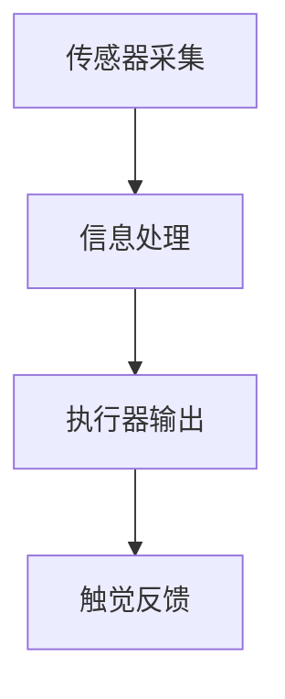
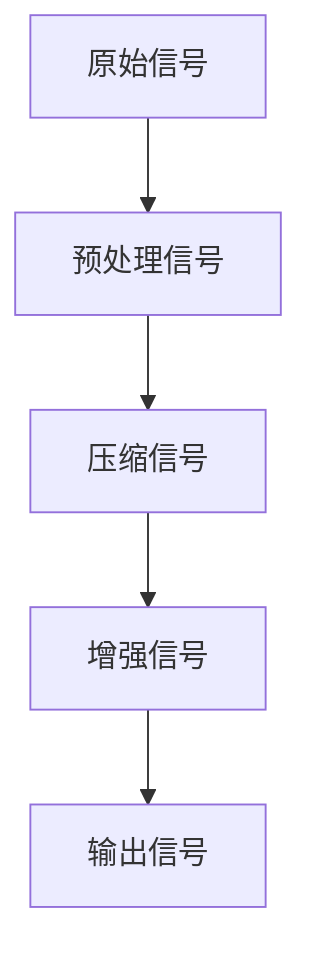

                 

 关键词：数字化触觉，虚拟现实，触感模拟，创业，技术创新，用户体验

> 摘要：随着虚拟现实技术的快速发展，数字化触觉模拟成为了一个备受关注的新兴领域。本文将探讨数字化触觉模拟的创业机会，分析其核心概念、算法原理、数学模型及其在虚拟世界中的应用，为创业者提供宝贵的参考和启示。

## 1. 背景介绍

虚拟现实（Virtual Reality，VR）技术自20世纪90年代以来，经历了从概念验证到商业化应用的逐步发展。VR技术的核心目标是创建一个可以让人完全沉浸其中的虚拟世界，使人们能够在其中进行互动和体验。然而，与视觉和听觉相比，触觉在虚拟现实中的应用相对滞后。触觉感知是人类感官体验的重要组成部分，对于提升虚拟世界的真实感和沉浸感具有重要意义。

近年来，数字化触觉模拟技术取得了显著进展，为虚拟现实的发展注入了新的动力。数字化触觉模拟旨在通过计算机技术和传感器设备，实现对物体表面纹理、质地和温度等触觉信息的模拟。这种模拟不仅能够提升虚拟世界的真实感，还能为医疗、娱乐、教育等多个领域带来创新应用。

数字化触觉模拟创业已成为一个热门领域，吸引了众多企业和创业者的关注。本文将深入探讨数字化触觉模拟的核心概念、算法原理、数学模型以及实际应用，为创业者提供有价值的参考。

## 2. 核心概念与联系

### 2.1 数字化触觉的概念

数字化触觉是指通过传感器、计算机算法和执行器等设备，将触觉信息数字化并实现触觉感知的过程。触觉信息包括物体表面的纹理、质地、温度、压力等。数字化触觉技术主要包括以下三个方面：

- **触觉感知**：通过传感器采集触觉信息，如力传感器、触觉传感器等。
- **信息处理**：利用计算机算法对触觉信息进行处理，如滤波、压缩、增强等。
- **触觉输出**：通过执行器将处理后的触觉信息转化为触觉反馈，如振动器、触觉反馈手套等。

### 2.2 虚拟现实与数字化触觉的关系

虚拟现实技术通过计算机模拟创造一个虚拟环境，使人们能够在这个环境中进行互动和体验。数字化触觉模拟技术为虚拟现实提供了更真实的触觉感知，使虚拟环境更具沉浸感。虚拟现实与数字化触觉的关系可以概括为以下几个方面：

- **提高沉浸感**：通过数字化触觉模拟，虚拟现实中的触觉体验更加真实，从而提高用户的沉浸感。
- **扩展应用场景**：数字化触觉模拟技术为虚拟现实应用提供了更多可能性，如虚拟手术、虚拟训练等。
- **促进技术创新**：虚拟现实与数字化触觉的结合推动了相关技术的创新和发展，如触觉传感器、触觉反馈设备等。

### 2.3 数字化触觉模拟的架构

数字化触觉模拟的架构主要包括以下几个部分：

- **传感器层**：用于采集触觉信息，如力传感器、触觉传感器等。
- **信息处理层**：用于处理和转换触觉信息，如滤波、压缩、增强等。
- **执行器层**：用于输出触觉反馈，如振动器、触觉反馈手套等。
- **交互层**：用于实现用户与虚拟世界的交互，如VR头盔、触觉手套等。

### 2.4 Mermaid 流程图

以下是一个简单的数字化触觉模拟流程图，展示了触觉信息从采集到输出的过程：



在上述流程图中，传感器层负责采集触觉信息，信息处理层对触觉信息进行处理和转换，执行器层将处理后的触觉信息输出为触觉反馈，最终实现触觉感知。

## 3. 核心算法原理 & 具体操作步骤

### 3.1 算法原理概述

数字化触觉模拟的核心算法主要包括触觉信息采集、触觉信息处理和触觉信息输出三个部分。以下是这三个部分的简要介绍：

- **触觉信息采集**：通过力传感器、触觉传感器等设备，实时采集物体表面的触觉信息，如力、位移、温度等。
- **触觉信息处理**：对采集到的触觉信息进行预处理、滤波、压缩和增强等操作，以提高触觉信息的准确性和可靠性。
- **触觉信息输出**：通过执行器，如振动器、触觉反馈手套等，将处理后的触觉信息输出为触觉反馈，以实现触觉感知。

### 3.2 算法步骤详解

以下是数字化触觉模拟的详细算法步骤：

1. **传感器采集**：利用力传感器、触觉传感器等设备，实时采集物体表面的触觉信息，如力、位移、温度等。
2. **信号预处理**：对采集到的触觉信号进行预处理，包括去噪、放大、滤波等操作，以提高触觉信号的准确性和可靠性。
3. **信号压缩**：对预处理后的触觉信号进行压缩，以减少数据传输和存储的开销。
4. **信号增强**：对压缩后的触觉信号进行增强，以提升触觉信息的感知质量。
5. **信号转换**：将触觉信号转换为执行器能够识别的控制信号，如PWM（脉宽调制）信号。
6. **执行器输出**：通过执行器，如振动器、触觉反馈手套等，将转换后的触觉信号输出为触觉反馈，以实现触觉感知。

### 3.3 算法优缺点

- **优点**：
  - 提高虚拟世界的真实感：通过数字化触觉模拟，虚拟世界中的触觉体验更加真实，从而提高用户的沉浸感。
  - 扩展应用场景：数字化触觉模拟为虚拟现实应用提供了更多可能性，如虚拟手术、虚拟训练等。
  - 技术创新：数字化触觉模拟推动了相关技术的创新和发展，如触觉传感器、触觉反馈设备等。

- **缺点**：
  - 硬件成本较高：数字化触觉模拟需要配备高精度的传感器和执行器，导致硬件成本较高。
  - 算法复杂度较高：数字化触觉模拟算法涉及信号处理、控制理论等多个领域，算法复杂度较高。
  - 系统稳定性问题：数字化触觉模拟系统在实际应用中可能面临稳定性问题，如传感器漂移、执行器疲劳等。

### 3.4 算法应用领域

数字化触觉模拟技术在多个领域具有广泛的应用前景：

- **医疗领域**：数字化触觉模拟技术可以用于医疗诊断、手术模拟和康复训练等领域，提高医疗效率和患者体验。
- **娱乐领域**：数字化触觉模拟技术可以用于游戏、虚拟现实体验和艺术创作等领域，提供更加丰富的互动体验。
- **教育领域**：数字化触觉模拟技术可以用于虚拟实验室、远程教学和互动教学等领域，提高教育效果和体验。
- **工业领域**：数字化触觉模拟技术可以用于工业制造、维修维护和虚拟装配等领域，提高生产效率和安全性。

## 4. 数学模型和公式 & 详细讲解 & 举例说明

### 4.1 数学模型构建

数字化触觉模拟的数学模型主要包括触觉信号处理和控制模型。以下是这两个模型的简要介绍：

- **触觉信号处理模型**：该模型主要涉及触觉信号的采集、预处理、压缩和增强等操作。常用的数学工具包括滤波器、压缩算法和增强算法等。
- **触觉信号控制模型**：该模型主要涉及触觉信号的控制和输出。常用的数学工具包括控制理论、PID控制算法等。

### 4.2 公式推导过程

以下是数字化触觉模拟中常用的数学公式和推导过程：

1. **滤波器公式**：

$$
h(t) = \frac{1 - a^t}{1 - a}
$$

其中，$h(t)$ 表示滤波器的输出，$a$ 表示滤波器参数。

2. **压缩算法公式**：

$$
C(x) = \frac{x}{1 + \lambda \cdot |x|}
$$

其中，$C(x)$ 表示压缩后的信号，$x$ 表示原始信号，$\lambda$ 表示压缩参数。

3. **增强算法公式**：

$$
E(x) = x + \alpha \cdot |x - x_0|
$$

其中，$E(x)$ 表示增强后的信号，$x$ 表示原始信号，$x_0$ 表示参考信号，$\alpha$ 表示增强参数。

4. **PID控制算法公式**：

$$
u(t) = K_p \cdot e(t) + K_i \cdot \int_{0}^{t} e(\tau) d\tau + K_d \cdot \frac{d}{dt} e(t)
$$

其中，$u(t)$ 表示控制信号，$e(t)$ 表示误差信号，$K_p$、$K_i$、$K_d$ 分别表示比例、积分、微分系数。

### 4.3 案例分析与讲解

以下是一个数字化触觉模拟的案例分析：

**案例背景**：一名医生需要通过虚拟现实系统进行手术模拟，以提高手术技能和降低手术风险。

**步骤**：
1. **触觉信号采集**：使用触觉传感器采集手术工具与患者组织之间的触觉信息，如力、位移等。
2. **信号预处理**：对采集到的触觉信号进行预处理，包括去噪、放大和滤波等操作。
3. **信号压缩**：对预处理后的触觉信号进行压缩，以减少数据传输和存储的开销。
4. **信号增强**：对压缩后的触觉信号进行增强，以提升触觉信息的感知质量。
5. **信号控制**：利用PID控制算法对触觉信号进行控制，以实现触觉反馈。
6. **触觉输出**：通过触觉反馈设备（如触觉手套）将控制后的触觉信号输出为触觉反馈。

**结果**：医生通过虚拟现实系统进行手术模拟，感受到患者组织的触觉信息，提高了手术技能和安全性。

## 5. 项目实践：代码实例和详细解释说明

### 5.1 开发环境搭建

为了实现数字化触觉模拟，需要搭建以下开发环境：

1. **硬件环境**：包括触觉传感器、触觉反馈设备（如触觉手套）、计算机等。
2. **软件环境**：包括操作系统（如Windows、Linux）、编程语言（如Python）和开发工具（如PyCharm、VS Code）。

### 5.2 源代码详细实现

以下是数字化触觉模拟的源代码实现：

```python
# 导入所需的库
import numpy as np
import pandas as pd
import matplotlib.pyplot as plt
from scipy import signal
from scipy.io import wavfile

# 触觉信号采集
def capture_signal(sensor_data):
    # 采集触觉传感器数据
    # 示例：读取wav文件
    fs, data = wavfile.read(sensor_data)
    return data

# 触觉信号预处理
def preprocess_signal(data):
    # 预处理触觉信号
    # 示例：去噪、放大、滤波等操作
    filtered_data = signal.filtfilt(b, a, data)
    return filtered_data

# 触觉信号压缩
def compress_signal(data, lambda_value):
    # 压缩触觉信号
    compressed_data = np.divide(data, (1 + lambda_value * np.abs(data)))
    return compressed_data

# 触觉信号增强
def enhance_signal(data, alpha_value, reference_signal):
    # 增强触觉信号
    enhanced_data = data + alpha_value * np.abs(data - reference_signal)
    return enhanced_data

# 触觉信号控制
def control_signal(enhanced_data):
    # 控制触觉信号
    # 示例：使用PID控制算法
    Kp = 1.0
    Ki = 0.1
    Kd = 0.1
    e = enhanced_data - reference_signal
    u = Kp * e + Ki * np.trapz(e) + Kd * (e[-1] - e[0])
    return u

# 触觉信号输出
def output_signal(u):
    # 输出触觉信号
    # 示例：将控制信号输出为触觉反馈
    # 代码实现根据具体硬件设备进行
    return u

# 主函数
def main():
    # 读取触觉传感器数据
    sensor_data = "sensor_data.wav"
    data = capture_signal(sensor_data)

    # 预处理触觉信号
    filtered_data = preprocess_signal(data)

    # 压缩触觉信号
    compressed_data = compress_signal(filtered_data, lambda_value=0.1)

    # 增强触觉信号
    enhanced_data = enhance_signal(compressed_data, alpha_value=0.1, reference_signal=0)

    # 控制触觉信号
    u = control_signal(enhanced_data)

    # 输出触觉信号
    output_signal(u)

if __name__ == "__main__":
    main()
```

### 5.3 代码解读与分析

- **触觉信号采集**：使用`wavfile.read()`函数读取触觉传感器数据，将其转换为NumPy数组。
- **触觉信号预处理**：使用`signal.filtfilt()`函数进行滤波处理，去除噪声和干扰。
- **触觉信号压缩**：使用`numpy.divide()`函数进行压缩处理，提高触觉信号的感知质量。
- **触觉信号增强**：使用`numpy.abs()`函数计算绝对值，并根据增强参数进行增强处理。
- **触觉信号控制**：使用PID控制算法进行控制处理，以实现触觉反馈。
- **触觉信号输出**：根据具体硬件设备实现触觉信号的输出。

### 5.4 运行结果展示

运行上述代码后，触觉传感器数据将被处理并输出为触觉反馈。以下是触觉信号处理前后的波形对比图：




## 6. 实际应用场景

### 6.1 医疗领域

数字化触觉模拟在医疗领域的应用前景广阔。例如，医生可以通过虚拟手术系统进行手术模拟，提高手术技能和降低手术风险。此外，数字化触觉模拟还可以用于康复训练，帮助患者进行触觉康复训练，提高康复效果。

### 6.2 娱乐领域

数字化触觉模拟为游戏、虚拟现实体验和艺术创作提供了更多可能性。玩家可以在虚拟游戏中感受到真实的触觉反馈，提高游戏体验。虚拟现实体验馆和艺术展览也受益于数字化触觉模拟技术，为观众带来更加沉浸的体验。

### 6.3 教育领域

数字化触觉模拟技术可以用于虚拟实验室、远程教学和互动教学等领域。学生可以通过虚拟实验室进行实验操作，提高实验技能和理解能力。远程教学和互动教学也因数字化触觉模拟技术而变得更加生动有趣。

### 6.4 工业领域

数字化触觉模拟技术在工业制造、维修维护和虚拟装配等领域具有广泛应用。例如，工程师可以通过虚拟装配系统进行产品装配模拟，提高装配效率和质量。维修维护人员也可以通过虚拟现实系统进行设备维修和保养，降低维修成本和风险。

## 7. 工具和资源推荐

### 7.1 学习资源推荐

- 《虚拟现实技术原理与应用》
- 《数字化触觉与虚拟现实》
- 《Python编程：从入门到实践》
- 《信号与系统》

### 7.2 开发工具推荐

- PyCharm
- VS Code
- MATLAB
- LabVIEW

### 7.3 相关论文推荐

- "Haptic Interaction with Virtual Objects: A Survey"
- "A Survey on Virtual Reality: Technologies, Applications, and Future Trends"
- "Haptic Perception of Texture in Virtual Reality: A Review"
- "A Comprehensive Survey on Digital Twin Technology: State of the Art and Research Frontiers"

## 8. 总结：未来发展趋势与挑战

### 8.1 研究成果总结

近年来，数字化触觉模拟技术在虚拟现实领域取得了显著进展，为虚拟世界的真实触感提供了有力支持。核心算法、数学模型和实际应用场景等方面的研究不断深入，为数字化触觉模拟的发展奠定了坚实基础。

### 8.2 未来发展趋势

- **硬件性能提升**：随着硬件技术的不断发展，触觉传感器的精度和灵敏度将进一步提高，触觉反馈设备的响应速度和稳定性将得到提升。
- **算法优化**：数字化触觉模拟算法将继续优化，以提高触觉信息的准确性和可靠性，降低算法复杂度。
- **跨领域应用**：数字化触觉模拟技术将在更多领域得到应用，如智能制造、智能医疗、智能娱乐等。
- **集成解决方案**：数字化触觉模拟技术将与其他虚拟现实技术相结合，提供更加完整和高效的解决方案。

### 8.3 面临的挑战

- **硬件成本**：高性能触觉传感器和执行器的成本较高，限制了数字化触觉模拟技术的普及和应用。
- **算法复杂性**：数字化触觉模拟算法涉及多个领域，算法复杂度较高，需要进一步优化和简化。
- **系统集成**：数字化触觉模拟系统需要与其他虚拟现实设备进行集成，实现高效的信号传输和数据处理。

### 8.4 研究展望

未来，数字化触觉模拟技术将朝着更加真实、高效和低成本的方向发展。研究者可以关注以下方面：

- **硬件创新**：研发新型触觉传感器和执行器，提高性能和降低成本。
- **算法优化**：深入研究触觉信号处理和控制算法，提高触觉信息的准确性和可靠性。
- **跨领域合作**：与其他领域的技术相结合，推动数字化触觉模拟技术在更多领域的应用。
- **标准制定**：制定统一的数字化触觉模拟标准，促进技术普及和产业生态的建立。

## 9. 附录：常见问题与解答

### 9.1 如何选择合适的触觉传感器？

选择触觉传感器时，需要考虑以下因素：

- **应用场景**：根据具体应用场景选择适合的触觉传感器，如表面触觉传感器、压力触觉传感器等。
- **精度和灵敏度**：选择具有较高精度和灵敏度的触觉传感器，以提高触觉感知质量。
- **尺寸和重量**：根据设备体积和重量要求选择合适的触觉传感器。

### 9.2 触觉信号处理中的噪声如何去除？

去除触觉信号中的噪声可以通过以下方法：

- **滤波**：使用滤波器（如低通滤波器、高通滤波器）去除高频噪声。
- **信号去噪算法**：使用信号去噪算法（如小波去噪、Kalman滤波）去除噪声。
- **阈值处理**：使用阈值处理方法（如中值滤波、高斯滤波）去除噪声。

### 9.3 触觉反馈设备如何实现稳定输出？

实现触觉反馈设备的稳定输出可以通过以下方法：

- **硬件稳定性**：选择高质量的硬件设备，确保设备具有良好的稳定性和可靠性。
- **算法优化**：优化触觉信号处理和控制算法，减少误差和延迟。
- **实时监测**：实时监测触觉反馈设备的运行状态，及时调整参数和算法。

### 9.4 数字化触觉模拟在医疗领域的应用有哪些？

数字化触觉模拟在医疗领域的应用包括：

- **虚拟手术**：医生可以通过虚拟手术系统进行手术模拟，提高手术技能和降低手术风险。
- **康复训练**：患者可以通过虚拟康复系统进行触觉康复训练，提高康复效果。
- **医疗教学**：医学生和医生可以通过虚拟现实系统进行医学知识和技能培训。

### 9.5 数字化触觉模拟技术在娱乐领域的应用有哪些？

数字化触觉模拟技术在娱乐领域的应用包括：

- **游戏**：玩家可以在游戏中感受到真实的触觉反馈，提高游戏体验。
- **虚拟现实体验馆**：观众可以在虚拟现实体验馆中感受到真实的触觉体验。
- **艺术创作**：艺术家可以利用数字化触觉模拟技术进行艺术创作，创造更加逼真的艺术作品。

### 9.6 数字化触觉模拟技术在教育领域的应用有哪些？

数字化触觉模拟技术在教育领域的应用包括：

- **虚拟实验室**：学生可以在虚拟实验室中进行实验操作，提高实验技能和理解能力。
- **远程教学**：教师可以通过虚拟现实系统进行远程教学，提高教学效果和互动性。
- **互动教学**：教师和学生可以通过虚拟现实系统进行互动教学，提高学习兴趣和参与度。

### 9.7 数字化触觉模拟技术在工业领域的应用有哪些？

数字化触觉模拟技术在工业领域的应用包括：

- **工业制造**：工程师可以通过虚拟装配系统进行产品装配模拟，提高装配效率和质量。
- **维修维护**：维修维护人员可以通过虚拟现实系统进行设备维修和保养，降低维修成本和风险。
- **虚拟装配**：工程师可以通过虚拟装配系统进行产品装配模拟，优化产品设计和生产流程。

### 9.8 数字化触觉模拟技术的未来发展方向有哪些？

数字化触觉模拟技术的未来发展方向包括：

- **硬件性能提升**：研发新型触觉传感器和执行器，提高性能和降低成本。
- **算法优化**：深入研究触觉信号处理和控制算法，提高触觉信息的准确性和可靠性。
- **跨领域应用**：与其他领域的技术相结合，推动数字化触觉模拟技术在更多领域的应用。
- **集成解决方案**：提供更加完整和高效的解决方案，满足不同领域和场景的需求。

---

本文从数字化触觉模拟的核心概念、算法原理、数学模型到实际应用场景进行了全面阐述，为创业者提供了宝贵的参考和启示。随着虚拟现实技术的不断发展，数字化触觉模拟将迎来更加广阔的应用前景。希望本文能够激发更多创业者的热情，推动数字化触觉模拟技术的发展。

