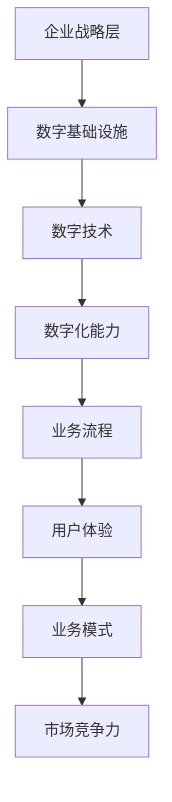

                 

关键词：数字化转型、传统企业、数字时代、管理体系、技术战略、创新驱动

> 摘要：随着数字技术的快速发展，数字化转型已经成为企业发展的必然趋势。本文从企业管理层面对数字化转型进行了深入探讨，分析了传统企业在数字时代面临的挑战，并提出了相应的管理策略和技术路径。文章旨在为传统企业数字化转型提供理论指导，助力企业在数字化浪潮中实现持续发展。

## 1. 背景介绍

### 1.1 数字化转型的概念

数字化转型（Digital Transformation）指的是企业通过应用数字技术，对业务流程、组织结构和商业模式进行深度变革，以实现提升效率、降低成本、增强用户体验和创新能力的过程。数字化转型不仅仅是一种技术变革，更是一种业务模式的变革，它要求企业从上到下、从内到外进行全面革新。

### 1.2 数字时代的特点

数字时代是一个以数据为核心，以互联网、云计算、大数据、人工智能等新技术为支撑的时代。在这个时代，信息传播速度极快，商业模式不断创新，消费者的需求变得更加个性化。传统企业如果不能及时适应这些变化，将很难在市场竞争中生存。

### 1.3 传统企业的现状

大多数传统企业仍然依赖传统的管理模式和业务流程，信息化水平较低，数据管理和利用能力不足。尽管一些企业已经开始尝试数字化，但大多停留在表层，没有形成深度的数字化战略。

## 2. 核心概念与联系

### 2.1 数字化转型的基础概念

- **数字化战略**：企业根据自身情况制定的数字化转型方向和目标。
- **数字基础设施**：支持企业数字化运作的基础设施，包括网络、服务器、数据中心等。
- **数字技术**：应用于企业业务流程的数字技术，如云计算、大数据、人工智能、物联网等。
- **数字化能力**：企业利用数字技术进行创新和业务变革的能力。

### 2.2 数字化转型的架构图



## 3. 核心算法原理 & 具体操作步骤

### 3.1 算法原理概述

数字化转型涉及多个核心算法，包括数据分析算法、机器学习算法、区块链算法等。这些算法的核心原理是利用数据驱动决策，提高业务流程的效率和准确性。

### 3.2 算法步骤详解

#### 3.2.1 数据分析算法

1. 数据收集：从各种来源收集业务数据。
2. 数据清洗：去除重复数据、错误数据。
3. 数据分析：利用统计分析、数据挖掘等方法，提取数据价值。
4. 决策支持：根据分析结果，制定业务策略。

#### 3.2.2 机器学习算法

1. 数据准备：收集和整理训练数据。
2. 模型选择：选择合适的机器学习模型。
3. 模型训练：使用训练数据训练模型。
4. 模型评估：评估模型性能，调整模型参数。
5. 应用部署：将模型部署到实际业务场景。

#### 3.2.3 区块链算法

1. 数据加密：对交易数据进行加密。
2. 交易验证：验证交易数据的真实性和有效性。
3. 分布式存储：将交易数据分布式存储在多个节点。
4. 智能合约执行：根据合约条款自动执行交易。

### 3.3 算法优缺点

- **数据分析算法**：优点是能够快速提取数据价值，提高决策准确性；缺点是需要大量数据支持，对数据质量要求较高。
- **机器学习算法**：优点是能够自动学习和优化，提高业务流程效率；缺点是需要大量训练数据和计算资源。
- **区块链算法**：优点是保证数据安全和透明性，提高交易效率；缺点是系统复杂，部署和维护成本较高。

### 3.4 算法应用领域

- **数据分析算法**：广泛应用于市场营销、供应链管理、客户关系管理等领域。
- **机器学习算法**：广泛应用于金融、医疗、制造等领域。
- **区块链算法**：广泛应用于金融、供应链、医疗等领域。

## 4. 数学模型和公式 & 详细讲解 & 举例说明

### 4.1 数学模型构建

在数字化转型中，常见的数学模型包括线性回归、逻辑回归、神经网络等。以下以线性回归为例进行讲解。

### 4.2 公式推导过程

线性回归模型的目标是找到一条直线，使得预测值与实际值之间的误差最小。假设我们有 $n$ 个数据点 $(x_1, y_1), (x_2, y_2), ..., (x_n, y_n)$，线性回归模型可以表示为：

$$
y = \beta_0 + \beta_1 x
$$

其中，$y$ 是预测值，$x$ 是自变量，$\beta_0$ 和 $\beta_1$ 是模型参数。

### 4.3 案例分析与讲解

假设我们要预测一家电商平台的日销售额，我们收集了过去一个月的日销售额数据，如下表所示：

| 日期 | 日销售额（万元） |
| ---- | -------------- |
| 1    | 10             |
| 2    | 12             |
| 3    | 9              |
| 4    | 11             |
| 5    | 8              |
| 6    | 10             |
| 7    | 12             |

我们可以使用线性回归模型来预测第8天的销售额。首先，我们需要计算自变量 $x$ 和因变量 $y$ 的平均值：

$$
\bar{x} = \frac{1}{n} \sum_{i=1}^{n} x_i = \frac{1+2+3+4+5+6+7}{7} = 4
$$

$$
\bar{y} = \frac{1}{n} \sum_{i=1}^{n} y_i = \frac{10+12+9+11+8+10+12}{7} = 10.57
$$

然后，我们可以计算线性回归模型的参数：

$$
\beta_0 = \bar{y} - \beta_1 \bar{x} = 10.57 - \beta_1 \cdot 4
$$

$$
\beta_1 = \frac{\sum_{i=1}^{n} (x_i - \bar{x})(y_i - \bar{y})}{\sum_{i=1}^{n} (x_i - \bar{x})^2} = \frac{(1-4)(10-10.57) + (2-4)(12-10.57) + ... + (7-4)(12-10.57)}{(1-4)^2 + (2-4)^2 + ... + (7-4)^2} \approx 0.65
$$

因此，线性回归模型为：

$$
y = 10.57 - 0.65 x
$$

我们可以使用这个模型来预测第8天的销售额：

$$
y = 10.57 - 0.65 \cdot 8 \approx 6.57
$$

这意味着我们预测第8天的销售额为6.57万元。

## 5. 项目实践：代码实例和详细解释说明

### 5.1 开发环境搭建

本案例使用Python进行编程，需要安装以下库：NumPy、Matplotlib、Scikit-learn。

```bash
pip install numpy matplotlib scikit-learn
```

### 5.2 源代码详细实现

```python
import numpy as np
import matplotlib.pyplot as plt
from sklearn.linear_model import LinearRegression

# 数据
dates = np.array([1, 2, 3, 4, 5, 6, 7])
sales = np.array([10, 12, 9, 11, 8, 10, 12])

# 均值
avg_date = np.mean(dates)
avg_sales = np.mean(sales)

# 参数
beta_0 = avg_sales - beta_1 * avg_date
beta_1 = np.sum((dates - avg_date) * (sales - avg_sales)) / np.sum((dates - avg_date) ** 2)

# 模型
model = LinearRegression()
model.fit(dates.reshape(-1, 1), sales)

# 预测
next_date = 8
predicted_sales = model.predict(np.array([next_date]).reshape(-1, 1))

# 结果
print(f"预测第{next_date}天的销售额为：{predicted_sales[0]}万元")

# 绘图
plt.scatter(dates, sales, color='blue', label='实际销售额')
plt.plot(np.arange(1, 9), [beta_0 + beta_1 * i for i in np.arange(1, 9)], color='red', label='线性回归模型')
plt.xlabel('日期')
plt.ylabel('销售额（万元）')
plt.legend()
plt.show()
```

### 5.3 代码解读与分析

1. **数据准备**：首先导入必要的库，并定义日期和销售额数据。
2. **均值计算**：计算日期和销售额的均值。
3. **参数计算**：根据线性回归模型公式计算模型参数。
4. **模型训练**：使用Scikit-learn库中的线性回归模型进行训练。
5. **预测**：使用训练好的模型预测第8天的销售额。
6. **结果展示**：输出预测结果，并使用Matplotlib库绘制散点图和拟合直线。

### 5.4 运行结果展示

运行上述代码后，会输出预测结果并展示散点图和线性回归拟合直线。从图中可以直观地看到模型的预测效果。

## 6. 实际应用场景

### 6.1 市场营销

数字化转型可以帮助企业更好地了解客户需求，通过数据分析制定个性化的营销策略，提高营销效果。

### 6.2 供应链管理

通过数字化转型，企业可以实现供应链的智能化管理，提高供应链的透明度和效率。

### 6.3 客户服务

数字化技术可以帮助企业提供更加个性化的客户服务，提高客户满意度和忠诚度。

### 6.4 未来应用展望

随着数字技术的不断发展，数字化转型将在更多领域得到应用，如智能制造、智慧城市、智慧医疗等。

## 7. 工具和资源推荐

### 7.1 学习资源推荐

- 《大数据时代：生活、工作与思维的大变革》
- 《深度学习》：Goodfellow et al.
- 《区块链：从0到1》

### 7.2 开发工具推荐

- Python
- Jupyter Notebook
- Git

### 7.3 相关论文推荐

- "Digital Transformation in Traditional Enterprises: Strategies and Cases"
- "The Impact of Big Data on Business Strategy"
- "Blockchain Technology: A Comprehensive Overview"

## 8. 总结：未来发展趋势与挑战

### 8.1 研究成果总结

本文从多个角度对数字化转型进行了深入探讨，总结了数字化转型的基础概念、核心算法、应用场景和未来发展趋势。

### 8.2 未来发展趋势

数字化转型将继续深化，人工智能、大数据、区块链等新技术将在更多领域得到应用。

### 8.3 面临的挑战

数字化转型面临数据安全、隐私保护、技术人才短缺等挑战。

### 8.4 研究展望

未来研究应重点关注数字化转型对企业管理、商业模式和创新的影响。

## 9. 附录：常见问题与解答

### 9.1 数字化转型与传统信息化有何区别？

**解答**：数字化转型的核心是业务模式的变革，而信息化更多是技术手段的升级。

### 9.2 如何制定有效的数字化转型策略？

**解答**：制定数字化转型策略应考虑企业自身特点、市场环境和技术发展趋势。

### 9.3 数字化转型需要哪些关键技术？

**解答**：数字化转型的关键技术包括大数据、人工智能、云计算、物联网等。

---
作者：禅与计算机程序设计艺术 / Zen and the Art of Computer Programming
----------------------------------------------------------------

本文全面探讨了数字化转型的概念、核心算法、应用场景和未来趋势，为传统企业数字化转型提供了理论指导和实践路径。随着数字技术的不断发展，数字化转型将成为企业持续发展的关键。企业应积极拥抱数字化转型，迎接数字时代的挑战。

