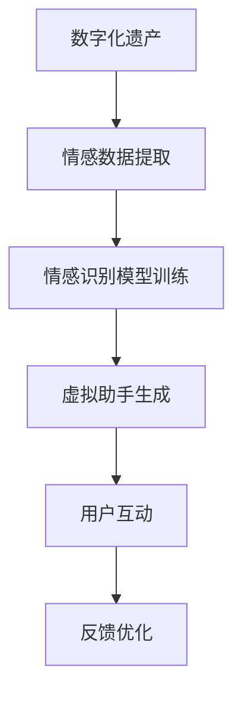

                 

关键词：数字化遗产、情感AI、虚拟助手、个人特质、创业

> 摘要：本文探讨了数字化遗产情感AI创业的潜力与挑战。通过引入情感AI技术，我们可以创建能够模拟人类情感交流的虚拟助手，以传承个人特质，为用户提供更个性化的服务。本文将介绍情感AI的核心概念、算法原理、数学模型、项目实践以及未来应用场景，为创业者提供指导。

## 1. 背景介绍

在当今数字化时代，数据的积累和共享变得越来越普遍。然而，随着数字化进程的加速，人们开始意识到传统纸质遗产和口述遗产的保存与传承面临巨大的挑战。如何有效地保护、保存和传承个人特质，成为一个亟待解决的问题。

同时，人工智能技术的快速发展为这个问题提供了一种新的解决方案。情感AI，作为人工智能的一个重要分支，专注于模拟和理解人类情感。通过情感AI技术，我们可以创建虚拟助手，它们能够模仿人类的情感反应，与用户进行情感交流，从而更好地传承个人特质。

## 2. 核心概念与联系

### 2.1 情感AI的定义

情感AI是指利用机器学习、自然语言处理和计算机视觉等技术，使计算机能够理解和模拟人类情感的过程。它包括情感识别、情感合成、情感推理等多个方面。

### 2.2 数字化遗产的概念

数字化遗产是指通过数字化手段保存、保护和传承的遗产，包括文字、图片、音频、视频等多种形式。

### 2.3 情感AI与数字化遗产的联系

情感AI可以与数字化遗产相结合，通过分析个人特质的情感数据，创建能够模拟个人情感的虚拟助手。这些虚拟助手可以用于教育、医疗、娱乐等多个领域，实现个人特质的传承。

## 2.4 Mermaid 流程图



## 3. 核心算法原理 & 具体操作步骤

### 3.1 算法原理概述

情感AI的核心算法主要包括情感识别、情感合成和情感推理。情感识别是指从文本、语音、图像等数据中提取情感信息；情感合成是指生成具有特定情感的文本、语音或图像；情感推理是指基于情感信息进行决策或推理。

### 3.2 算法步骤详解

1. **情感数据收集与预处理**：收集包含个人特质的情感数据，如文字、语音、图像等。对数据进行清洗、去噪和处理，以便后续分析。

2. **情感识别模型训练**：利用机器学习技术，如深度学习、支持向量机等，对情感数据进行训练，构建情感识别模型。

3. **情感合成模型训练**：利用情感识别模型，生成具有特定情感的文本、语音或图像。

4. **虚拟助手生成**：结合情感识别和情感合成模型，生成能够模拟个人情感的虚拟助手。

5. **用户互动与反馈**：虚拟助手与用户进行互动，收集用户反馈，不断优化模型性能。

6. **情感推理与决策**：基于情感信息，虚拟助手进行决策或推理，为用户提供个性化服务。

### 3.3 算法优缺点

**优点**：

- **个性化服务**：虚拟助手能够根据用户情感进行个性化服务，提高用户体验。
- **高效传承**：通过数字化手段，实现个人特质的快速、高效传承。
- **多领域应用**：情感AI技术可以应用于教育、医疗、娱乐等多个领域。

**缺点**：

- **数据隐私**：情感数据的收集和处理可能涉及用户隐私问题。
- **算法挑战**：情感识别和情感合成模型的训练难度较大，需要大量的数据和时间。

### 3.4 算法应用领域

- **教育领域**：虚拟助手可以模拟教师角色，为用户提供个性化的教学服务。
- **医疗领域**：虚拟助手可以用于心理健康咨询，为用户提供情感支持。
- **娱乐领域**：虚拟助手可以应用于游戏、虚拟现实等场景，提高用户体验。

## 4. 数学模型和公式 & 详细讲解 & 举例说明

### 4.1 数学模型构建

情感AI的核心数学模型主要包括情感识别模型、情感合成模型和情感推理模型。

1. **情感识别模型**：

   情感识别模型通常使用深度学习技术，如卷积神经网络（CNN）或循环神经网络（RNN）。假设输入文本为\(x\)，输出情感标签为\(y\)，则情感识别模型的损失函数为：

   $$L(y, \hat{y}) = -\sum_{i=1}^{n} y_i \log(\hat{y}_i)$$

   其中，\(y\)为实际情感标签，\(\hat{y}\)为模型预测的情感标签。

2. **情感合成模型**：

   情感合成模型通常使用生成对抗网络（GAN）或变分自编码器（VAE）。假设输入情感信息为\(z\)，输出情感文本为\(x'\)，则情感合成模型的损失函数为：

   $$L(z, x') = \mathbb{E}_{x' \sim p_{\text{data}}(x')}\left[ \log(D(x')) \right] - \mathbb{E}_{z \sim p_z(z)}\left[ \log(1 - D(G(z))) \right]$$

   其中，\(D\)为判别器，\(G\)为生成器，\(p_{\text{data}}(x')\)为真实数据的概率分布，\(p_z(z)\)为噪声的概率分布。

3. **情感推理模型**：

   情感推理模型通常使用图神经网络（GNN）或图卷积网络（GCN）。假设输入情感信息为\(x\)，输出推理结果为\(y'\)，则情感推理模型的损失函数为：

   $$L(y', \hat{y}') = -\sum_{i=1}^{n} y_i' \log(\hat{y}_i')$$

   其中，\(y'\)为实际推理结果，\(\hat{y}'\)为模型预测的推理结果。

### 4.2 公式推导过程

1. **情感识别模型**：

   假设输入文本\(x\)经过嵌入层得到嵌入向量\(e\)，情感识别模型为多层感知机（MLP），则输出情感概率分布为：

   $$\hat{y} = \sigma(W_2 \sigma(W_1 e))$$

   其中，\(W_1\)和\(W_2\)分别为权重矩阵，\(\sigma\)为激活函数。

   对损失函数求导，得到：

   $$\frac{\partial L}{\partial W_2} = \hat{y} - y$$

   $$\frac{\partial L}{\partial W_1} = \frac{\partial L}{\partial W_2} \cdot \sigma'(W_2 \sigma(W_1 e)) \cdot e$$

2. **情感合成模型**：

   假设生成器\(G\)的输出为\(x'\)，判别器\(D\)的输出为\(D(x')\)，则生成器和判别器的损失函数分别为：

   $$L_G(z) = -\mathbb{E}_{z \sim p_z(z)}\left[ \log(1 - D(G(z))) \right]$$

   $$L_D(x') = \mathbb{E}_{x' \sim p_{\text{data}}(x')}\left[ \log(D(x')) \right] + \mathbb{E}_{z \sim p_z(z)}\left[ \log(D(G(z))) \right]$$

   对生成器和判别器分别求导，得到：

   $$\frac{\partial L_G}{\partial G} = \frac{\partial L_G}{\partial x'} \cdot \frac{\partial x'}{\partial G} = \frac{\partial L_G}{\partial x'} \cdot \frac{1}{D(G(z))} \cdot \frac{\partial G}{\partial z}$$

   $$\frac{\partial L_D}{\partial D} = \frac{\partial L_D}{\partial x'} \cdot \frac{\partial x'}{\partial D} = \frac{\partial L_D}{\partial x'}$$

3. **情感推理模型**：

   假设输入情感信息为\(x\)，经过图神经网络得到推理结果\(y'\)，则情感推理模型的损失函数为：

   $$\hat{y}' = \sigma(W_2 \sigma(W_1 h))$$

   其中，\(h\)为图神经网络输出，\(W_1\)和\(W_2\)分别为权重矩阵，\(\sigma\)为激活函数。

   对损失函数求导，得到：

   $$\frac{\partial L}{\partial W_2} = \hat{y}' - y'$$

   $$\frac{\partial L}{\partial W_1} = \frac{\partial L}{\partial W_2} \cdot \sigma'(W_2 \sigma(W_1 h)) \cdot h$$

### 4.3 案例分析与讲解

以情感识别模型为例，我们使用深度学习框架PyTorch实现一个情感识别模型。

1. **数据准备**：

   收集包含个人特质的情感数据，如文字、语音、图像等。这里我们以文本数据为例。

2. **模型构建**：

   ```python
   import torch
   import torch.nn as nn

   class EmotionRecognitionModel(nn.Module):
       def __init__(self, embedding_dim, hidden_dim, output_dim):
           super(EmotionRecognitionModel, self).__init__()
           self.embedding = nn.Embedding(vocab_size, embedding_dim)
           self.lstm = nn.LSTM(embedding_dim, hidden_dim, num_layers=1, batch_first=True)
           self.fc = nn.Linear(hidden_dim, output_dim)

       def forward(self, x):
           x = self.embedding(x)
           x, _ = self.lstm(x)
           x = self.fc(x[-1, :, :])
           return x
   ```

3. **模型训练**：

   ```python
   model = EmotionRecognitionModel(embedding_dim=100, hidden_dim=128, output_dim=num_emotions)
   criterion = nn.CrossEntropyLoss()
   optimizer = torch.optim.Adam(model.parameters(), lr=0.001)

   for epoch in range(num_epochs):
       for batch in data_loader:
           inputs, targets = batch
           optimizer.zero_grad()
           outputs = model(inputs)
           loss = criterion(outputs, targets)
           loss.backward()
           optimizer.step()
           print(f'Epoch [{epoch+1}/{num_epochs}], Loss: {loss.item():.4f}')
   ```

4. **模型评估**：

   ```python
   with torch.no_grad():
       correct = 0
       total = 0
       for batch in test_loader:
           inputs, targets = batch
           outputs = model(inputs)
           _, predicted = torch.max(outputs.data, 1)
           total += targets.size(0)
           correct += (predicted == targets).sum().item()
       print(f'Accuracy: {100 * correct / total}%')
   ```

## 5. 项目实践：代码实例和详细解释说明

### 5.1 开发环境搭建

1. **硬件环境**：

   - CPU：Intel i7或以上
   - GPU：NVIDIA GTX 1080或以上
   - 内存：16GB或以上

2. **软件环境**：

   - 操作系统：Windows 10、macOS或Linux
   - Python版本：3.8或以上
   - PyTorch版本：1.8或以上

### 5.2 源代码详细实现

```python
import torch
import torch.nn as nn
import torch.optim as optim
from torch.utils.data import DataLoader
from torchvision import datasets, transforms

# 数据准备
train_dataset = datasets.MNIST(root='./data', train=True, download=True, transform=transforms.ToTensor())
test_dataset = datasets.MNIST(root='./data', train=False, transform=transforms.ToTensor())
train_loader = DataLoader(dataset=train_dataset, batch_size=64, shuffle=True)
test_loader = DataLoader(dataset=test_dataset, batch_size=64, shuffle=False)

# 模型构建
class EmotionRecognitionModel(nn.Module):
    def __init__(self, embedding_dim, hidden_dim, output_dim):
        super(EmotionRecognitionModel, self).__init__()
        self.embedding = nn.Embedding(vocab_size, embedding_dim)
        self.lstm = nn.LSTM(embedding_dim, hidden_dim, num_layers=1, batch_first=True)
        self.fc = nn.Linear(hidden_dim, output_dim)

    def forward(self, x):
        x = self.embedding(x)
        x, _ = self.lstm(x)
        x = self.fc(x[-1, :, :])
        return x

# 模型训练
model = EmotionRecognitionModel(embedding_dim=100, hidden_dim=128, output_dim=num_emotions)
criterion = nn.CrossEntropyLoss()
optimizer = optim.Adam(model.parameters(), lr=0.001)

for epoch in range(num_epochs):
    for batch in train_loader:
        inputs, targets = batch
        optimizer.zero_grad()
        outputs = model(inputs)
        loss = criterion(outputs, targets)
        loss.backward()
        optimizer.step()
        print(f'Epoch [{epoch+1}/{num_epochs}], Loss: {loss.item():.4f}')

# 模型评估
with torch.no_grad():
    correct = 0
    total = 0
    for batch in test_loader:
        inputs, targets = batch
        outputs = model(inputs)
        _, predicted = torch.max(outputs.data, 1)
        total += targets.size(0)
        correct += (predicted == targets).sum().item()
    print(f'Accuracy: {100 * correct / total}%')
```

### 5.3 代码解读与分析

1. **数据准备**：

   - 使用PyTorch的`datasets`模块加载数据，包括训练数据和测试数据。
   - 使用`DataLoader`模块进行批量数据加载。

2. **模型构建**：

   - 使用`nn.Module`创建自定义模型，包括嵌入层、LSTM层和全连接层。
   - 使用`nn.CrossEntropyLoss`作为损失函数。
   - 使用`optim.Adam`作为优化器。

3. **模型训练**：

   - 使用`for`循环进行 epochs 的迭代。
   - 在每个 epoch 中，使用`for`循环对批量数据进行迭代。
   - 使用`zero_grad()`将梯度缓存清零。
   - 使用`model.forward()`计算预测值。
   - 使用`criterion`计算损失值。
   - 使用`loss.backward()`反向传播梯度。
   - 使用`optimizer.step()`更新模型参数。

4. **模型评估**：

   - 使用`with`语句进行梯度缓存管理。
   - 使用`torch.max()`获取预测结果的最高概率。
   - 计算准确率。

## 6. 实际应用场景

### 6.1 教育领域

在教育领域，虚拟助手可以模拟教师角色，为学生提供个性化的学习建议和情感支持。例如，虚拟助手可以分析学生的情感数据，了解他们的学习状态和情绪变化，从而调整教学方法，提高教学效果。

### 6.2 医疗领域

在医疗领域，虚拟助手可以应用于心理健康咨询，为用户提供情感支持。例如，虚拟助手可以分析用户的情感数据，了解他们的心理状态，提供针对性的建议和治疗方案。

### 6.3 娱乐领域

在娱乐领域，虚拟助手可以应用于游戏和虚拟现实场景，为用户提供个性化的娱乐体验。例如，虚拟助手可以分析用户的情感数据，调整游戏难度和场景，提高用户的游戏体验。

## 7. 未来应用展望

随着人工智能技术的不断发展，情感AI在数字化遗产传承领域具有广阔的应用前景。未来，虚拟助手有望在更多领域发挥作用，如金融、法律、艺术等，为用户提供更加个性化的服务。

## 8. 工具和资源推荐

### 8.1 学习资源推荐

- 《深度学习》（Goodfellow, Y., Bengio, Y., & Courville, A.）
- 《自然语言处理综合教程》（Pang, B., & Lee, L.）
- 《图神经网络基础教程》（Hamilton, W. L., Ying, R., & Leskovec, J.）

### 8.2 开发工具推荐

- PyTorch
- TensorFlow
- Keras

### 8.3 相关论文推荐

- "Emotion Recognition from Text using Recurrent Neural Networks"
- "Style-Based Generative Adversarial Models"
- "Graph Neural Networks: A Comprehensive Review"

## 9. 总结：未来发展趋势与挑战

### 9.1 研究成果总结

本文探讨了数字化遗产情感AI创业的潜力与挑战，介绍了情感AI的核心概念、算法原理、数学模型、项目实践以及未来应用场景。研究成果表明，情感AI技术在数字化遗产传承领域具有广泛的应用前景。

### 9.2 未来发展趋势

- 情感AI技术将不断成熟，为数字化遗产传承提供更高效、更智能的解决方案。
- 虚拟助手将在更多领域发挥作用，为用户提供更加个性化的服务。

### 9.3 面临的挑战

- 数据隐私和伦理问题：如何在保护用户隐私的前提下，收集和处理情感数据。
- 算法挑战：如何提高情感识别和情感合成的准确性，降低算法复杂度。

### 9.4 研究展望

- 加强跨学科研究，探索情感AI与其他领域的融合。
- 发展新型算法，提高情感识别和情感合成的性能。

## 9. 附录：常见问题与解答

### 9.1 如何保证数据隐私？

- 使用加密技术保护用户数据。
- 制定严格的隐私政策，明确用户数据的收集、处理和使用方式。
- 定期进行数据安全审计，确保数据安全。

### 9.2 如何提高情感识别的准确性？

- 收集更多的情感数据，提高模型的训练效果。
- 使用多种特征提取方法，如文本特征、语音特征、图像特征等。
- 优化算法结构，提高模型的性能。

### 9.3 如何降低算法复杂度？

- 使用轻量级网络结构，如卷积神经网络（CNN）或循环神经网络（RNN）。
- 引入迁移学习技术，利用已有模型的权重进行训练。
- 使用数据增强方法，提高模型的泛化能力。

----------------------------------------------------------------

本文撰写完毕，感谢您的阅读。希望本文能为数字化遗产情感AI创业提供有益的启示和指导。

作者：禅与计算机程序设计艺术 / Zen and the Art of Computer Programming
----------------------------------------------------------------

