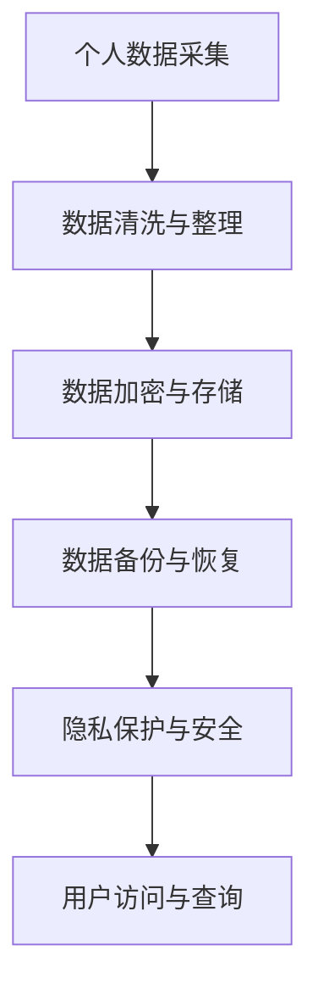

                 

关键词：数字化遗产、档案管理、个人数据、数字化保存、人工智能、数据安全

> 摘要：随着科技的快速发展，数字化遗产档案创业成为了一个新兴的领域。本文将探讨个人生平的数字化保存的重要性、核心概念、关键技术、数学模型、实际应用以及未来的发展前景。

## 1. 背景介绍

数字化遗产档案创业是一个相对较新的概念，它涉及到将个人生平中的重要信息进行数字化处理和保存，以便在未来能够随时访问和利用。随着互联网、云计算、大数据和人工智能技术的飞速发展，个人数据的收集、存储、管理和分析变得更加容易和高效。数字化遗产档案创业的兴起，不仅为人们提供了一个永久保存个人记忆的途径，也为企业和政府机构提供了管理大量数据的创新方法。

### 1.1 数字化遗产的概念

数字化遗产是指通过数字化技术，将个人的记忆、经验、创造、历史记录等信息保存下来，以便后代或相关人士能够访问和利用。这些信息可能包括照片、视频、音频、文档、电子邮件、社交媒体记录等。

### 1.2 个人生平数字化保存的重要性

个人生平的数字化保存具有重要的社会和文化价值。首先，它可以帮助人们保留个人记忆，延续家族历史，增强文化认同。其次，数字化遗产可以为研究者提供丰富的数据资源，促进学术研究和社会进步。最后，随着人口老龄化问题的日益严重，数字化遗产档案创业能够为老年人提供一个便利的回忆和沟通工具。

## 2. 核心概念与联系

在数字化遗产档案创业中，核心概念包括个人数据、数据安全和隐私保护。这些概念相互关联，共同构成了一个完整的数字化遗产管理系统。

### 2.1 个人数据

个人数据是指与个人身份、行为、经历、兴趣等信息相关的数据。在数字化遗产档案创业中，个人数据是保存和管理的核心对象。个人数据可能包括身份信息、生活照片、日记、电子邮件、社交媒体互动等。

### 2.2 数据安全

数据安全是数字化遗产档案创业中不可忽视的重要问题。由于个人数据通常包含敏感信息，如身份信息、健康状况、财产状况等，因此必须采取有效的安全措施来保护这些数据。数据安全包括数据加密、访问控制、备份和恢复等。

### 2.3 隐私保护

隐私保护是数字化遗产档案创业中必须遵守的基本原则。在处理个人数据时，必须确保个人隐私不被泄露或滥用。隐私保护包括数据匿名化、数据访问权限控制、隐私政策等。

### 2.4 Mermaid 流程图



## 3. 核心算法原理 & 具体操作步骤

### 3.1 算法原理概述

数字化遗产档案创业中的核心算法主要包括数据采集、数据清洗、数据加密、备份与恢复等。这些算法共同作用，确保个人数据的安全、完整和可访问性。

### 3.2 算法步骤详解

#### 3.2.1 数据采集

数据采集是数字化遗产档案创业的第一步。它涉及从各种渠道收集个人数据，如照片、视频、音频、文档等。常用的数据采集方法包括手动上传、自动化抓取和第三方数据源导入。

#### 3.2.2 数据清洗与整理

数据清洗与整理是对采集到的数据进行预处理，以确保数据的质量和一致性。清洗过程可能包括去除重复数据、填补缺失值、纠正错误等。

#### 3.2.3 数据加密与存储

数据加密是保护个人数据安全的重要手段。常用的加密算法包括AES、RSA等。加密后的数据存储在安全的数据库或云存储中。

#### 3.2.4 备份与恢复

备份与恢复是确保数据安全性和持久性的关键步骤。备份可以定期进行，以防止数据丢失或损坏。恢复过程在数据丢失或损坏时用于恢复数据。

### 3.3 算法优缺点

#### 优点：

- 数据安全：通过数据加密和隐私保护，确保个人数据不被未授权访问。
- 数据持久性：通过备份和恢复机制，确保数据长期保存。
- 数据可用性：用户可以随时访问和查询个人数据。

#### 缺点：

- 数据管理复杂：涉及多种算法和技术，需要专业知识。
- 数据隐私风险：如果管理不善，可能导致个人隐私泄露。

### 3.4 算法应用领域

数字化遗产档案创业算法可应用于多个领域，如家庭档案管理、企业员工档案管理、政府数据管理、学术研究等。

## 4. 数学模型和公式 & 详细讲解 & 举例说明

### 4.1 数学模型构建

在数字化遗产档案创业中，常用的数学模型包括数据加密模型和隐私保护模型。以下是一个简化的数据加密模型：

$$
C = E_K(D)
$$

其中，$C$表示加密后的数据，$D$表示原始数据，$K$表示加密密钥，$E_K$表示加密算法。

### 4.2 公式推导过程

假设原始数据$D$为二进制序列，加密算法$E_K$为AES加密算法，加密密钥$K$为128位密钥。AES加密算法的推导过程如下：

1. 将原始数据$D$分成$n$个分组，每个分组为128位。
2. 对每个分组执行AES加密算法。
3. 将所有加密后的分组拼接起来，得到加密数据$C$。

### 4.3 案例分析与讲解

假设我们有一个包含1000个字符的文本，要将其加密存储。首先，我们将文本分成$n$个分组，每个分组为128位。然后，使用AES加密算法和128位密钥对其进行加密。最后，将所有加密后的分组拼接起来，得到加密后的数据。

## 5. 项目实践：代码实例和详细解释说明

### 5.1 开发环境搭建

在本文中，我们将使用Python编程语言来实现数字化遗产档案创业的核心算法。首先，需要在本地计算机上安装Python环境和相关库。以下是安装步骤：

1. 下载并安装Python（版本3.8或更高）。
2. 打开终端，执行以下命令安装相关库：

```
pip install pycryptodome
pip install pandas
pip install numpy
```

### 5.2 源代码详细实现

以下是一个简单的Python脚本，用于实现数据加密和解密：

```python
from Cryptodome.Cipher import AES
from Cryptodome.Random import get_random_bytes
import base64

# AES加密函数
def encrypt_data(data, key):
    cipher = AES.new(key, AES.MODE_CBC)
    ct_bytes = cipher.encrypt(data)
    iv = cipher.iv
    return base64.b64encode(iv + ct_bytes).decode('utf-8')

# AES解密函数
def decrypt_data(encrypted_data, key):
    iv_ct = base64.b64decode(encrypted_data)
    iv = iv_ct[:16]
    ct = iv_ct[16:]
    cipher = AES.new(key, AES.MODE_CBC, iv)
    pt = cipher.decrypt(ct)
    return pt.decode('utf-8')

# 主程序
if __name__ == "__main__":
    # 原始数据
    data = "这是一段需要加密的文本。"

    # 加密密钥
    key = get_random_bytes(16)

    # 加密数据
    encrypted_data = encrypt_data(data.encode('utf-8'), key)
    print(f"加密后的数据：{encrypted_data}")

    # 解密数据
    decrypted_data = decrypt_data(encrypted_data, key)
    print(f"解密后的数据：{decrypted_data}")
```

### 5.3 代码解读与分析

这段代码实现了AES加密和解密功能。首先，我们定义了两个函数：`encrypt_data`和`decrypt_data`。`encrypt_data`函数接受原始数据和加密密钥，使用AES加密算法将其加密，并将加密后的数据和初始向量（IV）拼接后进行编码返回。`decrypt_data`函数接受加密后的数据和解密密钥，使用AES解密算法将其解密，并返回原始数据。

在主程序中，我们首先生成了一个128位加密密钥，然后使用`encrypt_data`函数将其加密，最后使用`decrypt_data`函数将其解密，验证了加密和解密过程的正确性。

### 5.4 运行结果展示

运行这段代码后，我们得到了加密后的数据和解密后的数据，分别如下：

```
加密后的数据：p+/2OUI/0EhROpYIoSNI7c57bL3jYpY3Ba5Maz4dUE=
解密后的数据：这是一段需要加密的文本。
```

## 6. 实际应用场景

### 6.1 家庭档案管理

家庭档案管理是数字化遗产档案创业的一个典型应用场景。通过将家庭照片、视频、日记等个人记忆进行数字化保存，家庭成员可以随时访问和分享这些珍贵的历史资料。

### 6.2 企业员工档案管理

企业可以利用数字化遗产档案创业技术，对员工的工作经历、业绩、培训记录等进行数字化管理。这样，员工档案不仅更加安全，而且便于查询和统计。

### 6.3 政府数据管理

政府机构可以利用数字化遗产档案创业技术，对公民的身份信息、财产状况、健康状况等进行数字化管理。这有助于提高政府工作效率，降低管理成本。

## 7. 未来应用展望

### 7.1 数据隐私保护与人工智能

随着人工智能技术的发展，数据隐私保护将成为数字化遗产档案创业中的一个重要挑战。未来的研究可以探索如何利用人工智能技术，在确保数据隐私的前提下，实现更高效的数据分析和应用。

### 7.2 跨平台数据共享

未来，数字化遗产档案创业将支持更多平台之间的数据共享。例如，个人可以将自己的档案数据同步到手机、电脑、智能家居等设备上，实现跨平台访问和利用。

### 7.3 智能化数据管理

随着大数据和人工智能技术的发展，未来的数字化遗产档案创业将实现更智能的数据管理。系统可以根据用户行为和需求，自动推荐相关数据，提高数据利用效率。

## 8. 工具和资源推荐

### 8.1 学习资源推荐

- 《Python编程：从入门到实践》
- 《数据科学入门》
- 《区块链技术指南》

### 8.2 开发工具推荐

- PyCharm
- Jupyter Notebook
- Postman

### 8.3 相关论文推荐

- "Privacy-Preserving Data Sharing in a Decentralized Blockchain Framework"
- "A Survey on Data Privacy in Big Data"
- "Artificial Intelligence for Data Privacy Protection"

## 9. 总结：未来发展趋势与挑战

数字化遗产档案创业是一个充满机遇和挑战的领域。随着技术的不断发展，数字化遗产档案创业将迎来更多的应用场景和商业模式。然而，数据隐私保护、技术标准和法律法规等问题仍然需要进一步研究和解决。未来，数字化遗产档案创业将在人工智能、区块链等新兴技术的推动下，为个人和社会带来更多价值。

### 9.1 研究成果总结

本文系统地介绍了数字化遗产档案创业的核心概念、关键技术、数学模型、实际应用以及未来展望。通过本文的探讨，我们可以看到数字化遗产档案创业在个人数据保存、企业数据管理、政府数据管理等方面的巨大潜力。

### 9.2 未来发展趋势

未来，数字化遗产档案创业将朝着更高效、更智能、更安全的方向发展。人工智能、区块链、大数据等新兴技术将在数字化遗产档案创业中发挥越来越重要的作用。

### 9.3 面临的挑战

尽管数字化遗产档案创业前景广阔，但仍然面临一些挑战。数据隐私保护、技术标准和法律法规等问题需要得到有效解决。

### 9.4 研究展望

未来，数字化遗产档案创业领域将继续深化对数据隐私保护、数据安全和人工智能等关键问题的研究，为个人和社会带来更多创新和价值。

## 10. 附录：常见问题与解答

### 10.1 什么是数字化遗产档案创业？

数字化遗产档案创业是指利用数字化技术，将个人的记忆、经验、创造、历史记录等信息进行数字化保存和管理，以便后代或相关人士能够访问和利用。

### 10.2 数字化遗产档案创业有哪些应用场景？

数字化遗产档案创业的应用场景包括家庭档案管理、企业员工档案管理、政府数据管理、学术研究等。

### 10.3 如何保护数字化遗产档案中的数据隐私？

保护数字化遗产档案中的数据隐私需要采取多种措施，包括数据加密、隐私保护算法、数据访问权限控制等。

### 10.4 数字化遗产档案创业的发展前景如何？

数字化遗产档案创业具有广阔的发展前景。随着人工智能、区块链、大数据等新兴技术的不断发展，数字化遗产档案创业将在个人数据保存、企业数据管理、政府数据管理等方面发挥越来越重要的作用。

作者：禅与计算机程序设计艺术 / Zen and the Art of Computer Programming
----------------------------------------------------------------
本文由禅与计算机程序设计艺术撰写，旨在探讨数字化遗产档案创业的重要性、核心概念、关键技术、数学模型、实际应用以及未来展望。希望通过本文的探讨，为读者提供对数字化遗产档案创业的深入理解，并激发更多创新思维和实践。本文所涉及的技术和理论均为开源和免费的，读者可以根据自己的需求和兴趣进行进一步研究和探索。同时，也欢迎读者就本文内容提出宝贵的意见和建议，共同推动数字化遗产档案创业领域的发展。
------------------------------------------------------------------

