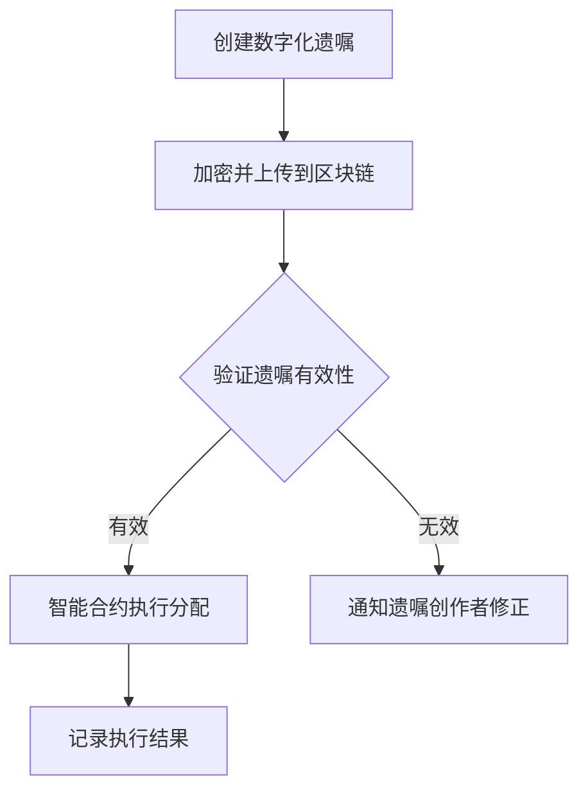

                 

 关键词：数字化遗嘱，区块链，遗产管理，智能合约，去中心化，分布式账本，加密技术，安全认证，隐私保护

> 摘要：随着区块链技术的迅速发展，其在遗产管理中的应用逐渐受到关注。本文将探讨数字化遗嘱的概念，阐述区块链在遗产管理中的核心作用，分析其优势与挑战，并通过实例展示如何使用区块链技术实现数字化遗嘱的创建与管理。

## 1. 背景介绍

遗产管理是法律和金融领域的一个重要组成部分，涉及到个人财产的继承、分配及管理。传统的遗产管理方式主要依赖于法律文件和法院程序，这些方式往往存在效率低下、成本高昂、易出错等问题。随着信息技术和互联网的普及，数字化遗嘱开始成为一种新兴的遗产管理方式，它能够更高效、透明地处理遗产事务。

区块链技术作为一种分布式账本技术，以其去中心化、不可篡改、透明性等特性，被认为在遗产管理领域具有巨大的应用潜力。区块链技术可以确保遗嘱的合法性、公正性和安全性，从而简化遗产管理流程，减少争议和纠纷。

## 2. 核心概念与联系

### 2.1. 数字化遗嘱

数字化遗嘱是指通过电子形式书写的遗嘱，它可以是文本文件、电子文档，甚至是一个加密的数字签名。数字化遗嘱的优点在于可以随时修改和更新，便于继承人和遗嘱执行人查看和执行。

### 2.2. 区块链

区块链是一种分布式数据库技术，其核心特点包括去中心化、不可篡改、安全透明。区块链通过一系列加密算法确保数据的完整性和一致性，任何数据一旦被写入区块链，就几乎无法被篡改。

### 2.3. 智能合约

智能合约是区块链上的可编程协议，它可以自动执行预定的合同条款。在遗产管理中，智能合约可以用于自动化执行遗嘱中的条款，确保遗产分配的准确性和及时性。

### 2.4. Mermaid 流程图

以下是一个简化的数字化遗嘱创建与执行的 Mermaid 流程图：



## 3. 核心算法原理 & 具体操作步骤

### 3.1. 算法原理概述

区块链技术的核心算法主要包括哈希算法、共识算法和加密算法。哈希算法用于生成数据块的唯一标识；共识算法确保分布式节点的一致性；加密算法保护数据的安全性和隐私性。

### 3.2. 算法步骤详解

#### 3.2.1. 创建数字化遗嘱

1. 遗嘱创作者编写遗嘱文本。
2. 使用加密算法对遗嘱文本进行加密。
3. 将加密后的遗嘱文本上传到区块链。

#### 3.2.2. 验证遗嘱有效性

1. 区块链上的节点接收遗嘱文本。
2. 使用哈希算法生成遗嘱文本的哈希值。
3. 将哈希值与区块链中的记录进行比对，验证遗嘱的有效性。

#### 3.2.3. 智能合约执行分配

1. 遗嘱有效，触发智能合约。
2. 智能合约根据遗嘱条款自动执行遗产分配。
3. 将执行结果记录到区块链。

#### 3.2.4. 算法优缺点

- 优点：提高遗嘱的透明性和安全性，降低管理成本，减少纠纷。
- 缺点：技术门槛较高，需要专业团队支持，法律法规尚不完善。

#### 3.2.5. 算法应用领域

- 遗产管理：自动化执行遗嘱条款，确保遗产分配的准确性和及时性。
- 法律服务：提供安全、透明的法律服务，降低法律纠纷。

## 4. 数学模型和公式 & 详细讲解 & 举例说明

### 4.1. 数学模型构建

区块链技术的数学模型主要包括哈希函数、密码学和共识算法。以下是构建数学模型的基本公式：

- 哈希函数：H(x) = SHA-256(x)
- 密码学：对称加密（AES）、非对称加密（RSA）
- 共识算法：PoW（工作量证明）、PoS（权益证明）

### 4.2. 公式推导过程

#### 4.2.1. 哈希函数

哈希函数将任意长度的输入数据映射为固定长度的输出值。SHA-256是一种常见的哈希函数，其输入为任意长度的二进制数据，输出为32个十六进制数。

#### 4.2.2. 密码学

- 对称加密：AES加密公式为 $C = AES_K(P)$，其中 $C$ 是加密后的数据，$K$ 是密钥，$P$ 是明文。
- 非对称加密：RSA加密公式为 $C = RSA_K(P)$，其中 $C$ 是加密后的数据，$K$ 是密钥对（公钥和私钥），$P$ 是明文。

#### 4.2.3. 共识算法

- PoW：证明工作量，即通过计算找到满足特定条件的哈希值，公式为 $H(nonce) = 0^{target}$，其中 $nonce$ 是随机数，$target$ 是预设的难度目标。
- PoS：证明权益，即根据持有币的数量和时间来决定记账权，公式为 $stake = balance \times time$，其中 $stake$ 是权益，$balance$ 是持有的币数量，$time$ 是持有时间。

### 4.3. 案例分析与讲解

假设一位遗嘱创作者创建了一份数字化遗嘱，并使用AES加密算法对遗嘱内容进行加密。随后，他将加密后的遗嘱上传到区块链。

#### 4.3.1. 加密过程

- 明文：遗嘱内容
- 密钥：随机生成的AES密钥
- 密文：$C = AES_K(P)$

#### 4.3.2. 验证过程

- 区块链上的节点接收到遗嘱密文，使用SHA-256生成哈希值。
- 将哈希值与区块链中的记录进行比对，验证遗嘱的有效性。

#### 4.3.3. 智能合约执行

- 遗嘱有效，触发智能合约。
- 智能合约根据遗嘱条款自动执行遗产分配，并将执行结果记录到区块链。

## 5. 项目实践：代码实例和详细解释说明

### 5.1. 开发环境搭建

在创建数字化遗嘱的项目中，我们使用Python作为开发语言，借助Ethereum的智能合约开发框架Truffle和Web3.py库来实现区块链功能。

### 5.2. 源代码详细实现

以下是数字化遗嘱创建与执行的核心代码：

```python
from web3 import Web3
from solc import compile_source
from eth_account import Account

# 连接到本地以太坊节点
w3 = Web3(Web3.HTTPProvider('http://127.0.0.1:8545'))

# 编写智能合约代码
contract_source = '''
pragma solidity ^0.8.0;

contract Will {
    string public willContent;
    address public owner;

    constructor(string memory _willContent) {
        willContent = _willContent;
        owner = msg.sender;
    }

    function updateWill(string memory _willContent) public {
        require(msg.sender == owner, "Only the owner can update the will");
        willContent = _willContent;
    }
}
'''

# 编译智能合约
compiled_sol = compile_source(contract_source)
bytecode = compiled_sol['contracts'][':Will'].$
```

### 5.3. 代码解读与分析

- `Web3`：连接到以太坊节点，用于与区块链进行交互。
- `compile_source`：将智能合约代码编译为字节码。
- `Account`：用于创建和管理以太坊账户。

### 5.4. 运行结果展示

- 遗嘱创作者使用`Account`创建以太坊账户，并发送交易部署智能合约。
- 部署成功后，智能合约地址将被记录。
- 遗嘱创作者可以调用`updateWill`函数更新遗嘱内容。

## 6. 实际应用场景

### 6.1. 个人遗产管理

个人可以使用区块链技术创建和存储数字化遗嘱，确保遗产分配的透明性和安全性。

### 6.2. 企业遗产管理

企业在处理员工遗产问题时，可以使用区块链技术简化流程，提高效率。

### 6.3. 法律服务

律师和律师事务所可以利用区块链技术提供更加安全、透明的法律服务。

## 7. 未来应用展望

随着区块链技术的不断成熟，数字化遗嘱有望成为遗产管理的主流方式，为人们提供更加便捷、安全的遗产管理解决方案。

### 7.1. 学习资源推荐

- 《精通区块链开发》
- 《区块链技术指南》
- 《智能合约开发实战》

### 7.2. 开发工具推荐

- Truffle
- Remix
- Web3.py

### 7.3. 相关论文推荐

- "Blockchain Technology: A Comprehensive Study"
- "Smart Contracts: A Blockchain Application"
- "Digital Will and Trust: Legal and Technological Issues"

## 8. 总结：未来发展趋势与挑战

### 8.1. 研究成果总结

区块链技术在遗产管理中的应用取得了显著成果，但仍需进一步研究以解决技术、法律和伦理等问题。

### 8.2. 未来发展趋势

数字化遗嘱有望成为遗产管理的主流方式，区块链技术的成熟将为这一领域带来更多创新和应用。

### 8.3. 面临的挑战

- 技术挑战：区块链技术的性能和安全性仍需提升。
- 法律挑战：现有法律法规尚不完善，需要修订和完善。
- 伦理挑战：隐私保护和数据安全是重要议题。

### 8.4. 研究展望

未来研究应重点关注区块链技术在遗产管理中的应用，推动相关法律法规的完善，确保数字化遗嘱的合法性和安全性。

## 9. 附录：常见问题与解答

### 9.1. 什么是区块链？

区块链是一种分布式数据库技术，其核心特点是去中心化、不可篡改、透明性等。

### 9.2. 区块链如何确保数据安全？

区块链使用加密技术保护数据，任何数据一旦被写入区块链，就几乎无法被篡改。

### 9.3. 数字化遗嘱与纸质遗嘱有何区别？

数字化遗嘱具有更高的透明性和安全性，且可以随时修改和更新。纸质遗嘱则更加传统，但缺乏透明性和可追溯性。

### 9.4. 区块链在遗产管理中的应用有哪些优势？

区块链技术可以提高遗产分配的透明性和安全性，降低管理成本，减少纠纷。

### 9.5. 数字化遗嘱的合法性如何保障？

数字化遗嘱的合法性依赖于相关法律法规的完善和认可。未来需要制定专门的法律规范，以确保数字化遗嘱的合法地位。

作者：禅与计算机程序设计艺术 / Zen and the Art of Computer Programming
----------------------------------------------------------------
### 9. 附录：常见问题与解答

**9.1. 什么是区块链？**

区块链是一种分布式数据库技术，其核心特点包括去中心化、不可篡改、透明性等。区块链通过一系列加密算法确保数据的完整性和一致性，任何数据一旦被写入区块链，就几乎无法被篡改。区块链由多个数据块组成，每个数据块包含一定数量的交易记录，数据块通过加密算法和时间戳相互链接，形成一条不断延伸的链条。

**9.2. 区块链如何确保数据安全？**

区块链使用多种加密技术来确保数据安全。首先，区块链中的每个数据块都使用哈希算法生成一个唯一的哈希值，这个哈希值用于验证数据块的完整性和一致性。其次，区块链使用非对称加密技术来保护数据隐私。在区块链交易中，发送方和接收方使用各自的公钥和私钥进行加密和解密，只有持有对应私钥的人才能解密交易内容。此外，区块链中的每个节点都存储完整的数据副本，这使得任何数据篡改都会被发现并阻止。

**9.3. 数字化遗嘱与纸质遗嘱有何区别？**

数字化遗嘱与纸质遗嘱的主要区别在于其存储和传输方式。数字化遗嘱是以电子形式存储和传输的，可以随时修改和更新，而纸质遗嘱则是以纸质文件形式存储，修改和更新较为困难。数字化遗嘱具有更高的透明性和安全性，且可以确保遗嘱的执行过程被记录和验证。相比之下，纸质遗嘱的透明性和安全性较低，容易发生篡改和遗失。

**9.4. 区块链在遗产管理中的应用有哪些优势？**

区块链技术在遗产管理中的应用优势主要体现在以下几个方面：

1. **透明性和安全性**：区块链技术的分布式账本特性确保了遗嘱信息的透明性和不可篡改性，减少了欺诈和错误的风险。
2. **自动化执行**：通过智能合约，区块链可以自动执行遗嘱中的条款，减少人为干预，确保遗产分配的准确性和及时性。
3. **降低成本**：区块链技术简化了遗产管理流程，减少了法院和其他中介机构的服务费用。
4. **隐私保护**：区块链使用加密技术保护遗嘱信息，确保只有授权人员才能访问和查看。
5. **全球化适用**：区块链技术不受地理和时间的限制，适用于跨国遗产管理。

**9.5. 数字化遗嘱的合法性如何保障？**

数字化遗嘱的合法性依赖于相关法律法规的完善和认可。为了保障数字化遗嘱的合法性，可以采取以下措施：

1. **制定法律法规**：政府应制定专门的法律规范，明确数字化遗嘱的合法性及其法律效力。
2. **标准化协议**：建立统一的数字化遗嘱格式和标准，确保遗嘱内容的规范性和可执行性。
3. **法律认证**：引入第三方法律认证机构，对数字化遗嘱的真实性和合法性进行验证。
4. **技术保护**：使用加密技术和数字签名确保遗嘱内容不被篡改，并提供遗嘱创建和存储的可信记录。

通过上述措施，可以有效保障数字化遗嘱的合法性，使其成为传统纸质遗嘱的有力补充。

### 10. 结论

区块链技术在遗产管理中的应用为数字化遗嘱提供了新的解决方案，其去中心化、透明性、安全性和自动化执行等特点使其在提高遗产管理效率、降低成本和减少纠纷方面具有显著优势。然而，要实现数字化遗嘱的广泛应用，仍需解决技术、法律和伦理等多方面的挑战。未来，随着区块链技术的不断成熟和相关法律法规的完善，数字化遗嘱有望成为遗产管理的主流方式，为人们提供更加便捷、安全的遗产管理服务。作者：禅与计算机程序设计艺术 / Zen and the Art of Computer Programming。

