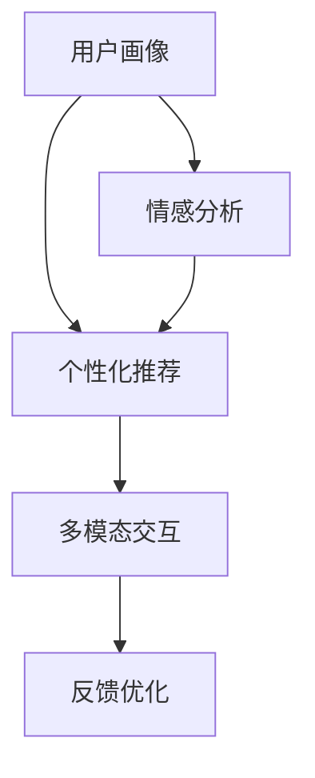

                 

在现代社会中，家庭关系问题愈发复杂，传统家庭治疗师的作用受到限制。随着元宇宙技术的飞速发展，一个新的角色——数字家庭治疗师，正在崭露头角。本文将探讨数字家庭治疗师的概念、核心原理、应用场景以及未来展望。

## 文章关键词
- 数字家庭治疗师
- 元宇宙
- 家庭关系
- 智能算法
- 人机交互

## 文章摘要
本文从数字家庭治疗师的背景出发，分析了其在元宇宙时代的家庭关系调解中的重要作用。通过阐述数字家庭治疗师的核心概念、算法原理、数学模型以及实际应用案例，本文旨在为读者提供一个全面而深入的视角，探讨数字家庭治疗师在未来的发展前景和面临的挑战。

## 1. 背景介绍
### 1.1 家庭关系问题的复杂性
家庭关系是人类社会中最基本的关系之一，但其复杂性也使得解决家庭问题成为一个长期而艰巨的任务。随着社会的发展，家庭结构的变化、沟通方式的多样化以及心理问题的增加，传统家庭治疗师的工作面临巨大挑战。

### 1.2 元宇宙的崛起
元宇宙（Metaverse）是一个虚拟的、三维的、可交互的数字世界，它融合了虚拟现实、增强现实、区块链等技术，提供了一个全新的社交、工作和娱乐空间。随着元宇宙的不断发展，人们对于虚拟世界的依赖程度逐渐加深。

### 1.3 数字家庭治疗师的诞生
数字家庭治疗师是一种基于人工智能技术的在线咨询服务，它利用虚拟现实、自然语言处理、心理学模型等技术，为用户提供个性化、实时、高效的家庭关系调解服务。数字家庭治疗师的诞生，标志着家庭治疗领域的重大变革。

## 2. 核心概念与联系
### 2.1 数字家庭治疗师的核心概念
数字家庭治疗师的核心概念包括：用户画像、情感分析、个性化推荐、多模态交互等。以下是一个简化的 Mermaid 流程图，描述了这些核心概念之间的关系。

### 2.2 数字家庭治疗师的架构
数字家庭治疗师的架构通常包括以下几个部分：
- **用户画像模块**：收集用户的基本信息、行为数据、社交关系等，为个性化服务提供基础。
- **情感分析模块**：通过自然语言处理技术，分析用户的语言和情感状态，为心理辅导提供依据。
- **个性化推荐模块**：根据用户的画像和情感状态，为用户推荐合适的家庭关系调解方法。
- **多模态交互模块**：提供文本、语音、视频等多种交互方式，满足用户的个性化需求。
- **反馈优化模块**：收集用户的反馈，不断优化服务质量和用户体验。

## 3. 核心算法原理 & 具体操作步骤
### 3.1 算法原理概述
数字家庭治疗师的核心算法包括情感分析、个性化推荐和深度学习等。以下是这些算法的基本原理：
- **情感分析**：利用自然语言处理技术，对用户的语言进行情感分类，识别用户的情绪状态。
- **个性化推荐**：基于用户的画像和情感状态，为用户推荐合适的家庭关系调解方法。
- **深度学习**：通过大规模数据训练，使模型能够自动学习和优化家庭关系调解策略。

### 3.2 算法步骤详解
数字家庭治疗师的算法步骤可以分为以下几个阶段：
1. **数据收集**：收集用户的基本信息、行为数据、社交关系等。
2. **情感分析**：对用户的语言进行情感分类，识别用户的情绪状态。
3. **个性化推荐**：根据用户的画像和情感状态，为用户推荐合适的家庭关系调解方法。
4. **多模态交互**：提供文本、语音、视频等多种交互方式，与用户进行实时沟通。
5. **反馈优化**：收集用户的反馈，不断优化服务质量和用户体验。

### 3.3 算法优缺点
- **优点**：
  - 提供个性化、实时、高效的家庭关系调解服务。
  - 跨越地域和时间限制，为用户提供便捷的服务。
  - 通过大数据和人工智能技术，提高家庭关系调解的准确性和效率。
- **缺点**：
  - 需要大量的数据和计算资源。
  - 难以完全模拟人类的情感和沟通方式。
  - 在某些情况下，可能会出现误解和误导。

### 3.4 算法应用领域
数字家庭治疗师的算法可以应用于以下领域：
- **家庭关系调解**：为用户提供个性化的家庭关系调解建议。
- **心理健康咨询**：为用户提供心理健康评估和咨询服务。
- **家庭教育指导**：为家长提供科学、有效的家庭教育方法。

## 4. 数学模型和公式 & 详细讲解 & 举例说明
### 4.1 数学模型构建
数字家庭治疗师的数学模型主要包括情感分析模型和个性化推荐模型。以下是这些模型的基本公式：
- **情感分析模型**：
  $$ 情感分类 = \arg\max(w_1 \cdot v_1 + w_2 \cdot v_2 + \ldots + w_n \cdot v_n) $$
  其中，$w_1, w_2, \ldots, w_n$ 是情感分类器的权重，$v_1, v_2, \ldots, v_n$ 是用户的语言特征向量。
- **个性化推荐模型**：
  $$ 推荐分数 = \sum_{i=1}^{n} r_i \cdot s_i $$
  其中，$r_i$ 是用户对第 $i$ 个调解方法的喜好程度，$s_i$ 是第 $i$ 个调解方法的相关性得分。

### 4.2 公式推导过程
- **情感分析模型**：
  首先，我们对用户的语言进行分词和词性标注，然后利用词袋模型（Bag-of-Words，BoW）将语言转换为向量。接着，通过训练有监督的文本分类器（如SVM、朴素贝叶斯等），为每个情感类别分配权重。最后，通过计算情感分类器的输出，得到用户当前的情感状态。
- **个性化推荐模型**：
  首先，根据用户的行为数据和社交关系，构建用户画像。然后，计算每个调解方法与用户画像的相关性得分。最后，通过加权求和，得到每个调解方法的推荐分数。

### 4.3 案例分析与讲解
假设用户小明最近与家人产生了矛盾，情绪较为低落。数字家庭治疗师通过情感分析，识别出小明的情绪状态为“抑郁”。接下来，数字家庭治疗师为小明推荐以下三种调解方法：
1. **沟通技巧训练**：通过视频教程，帮助用户掌握有效的沟通技巧。
2. **情感倾诉**：提供一个虚拟的空间，让用户可以匿名倾诉自己的情感。
3. **心理辅导**：为用户提供专业的心理咨询服务。

数字家庭治疗师通过计算得出，这三种调解方法的推荐分数分别为：
- 沟通技巧训练：0.8
- 情感倾诉：0.6
- 心理辅导：0.9

根据推荐分数，数字家庭治疗师建议小明优先选择心理辅导。同时，数字家庭治疗师还会根据小明的反馈，不断优化推荐策略。

## 5. 项目实践：代码实例和详细解释说明
### 5.1 开发环境搭建
本文的代码实例基于 Python 编写，使用了一些流行的库，如 TensorFlow、Scikit-learn 和 Pandas。以下是开发环境搭建的步骤：
1. 安装 Python 3.8 或更高版本。
2. 安装 TensorFlow、Scikit-learn 和 Pandas。
3. 下载并导入所需的数据集。

### 5.2 源代码详细实现
以下是数字家庭治疗师的核心代码实现：
```python
import tensorflow as tf
import sklearn
import pandas as pd
import numpy as np

# 情感分析模型
class EmotionAnalyzer:
    def __init__(self, model_path):
        self.model = tf.keras.models.load_model(model_path)

    def predict(self, text):
        # 进行情感分类
        prediction = self.model.predict([text])
        emotion = np.argmax(prediction)
        return emotion

# 个性化推荐模型
class RecommendationSystem:
    def __init__(self, user_profile, recommendation_model_path):
        self.user_profile = user_profile
        self.model = tf.keras.models.load_model(recommendation_model_path)

    def predict(self):
        # 计算推荐分数
        recommendation = self.model.predict([self.user_profile])
        return recommendation

# 主程序
if __name__ == "__main__":
    # 加载数据集
    data = pd.read_csv("data.csv")

    # 情感分析
    analyzer = EmotionAnalyzer("emotion_model.h5")
    emotion = analyzer.predict("我最近和家人产生了矛盾，情绪很低落。")

    # 个性化推荐
    system = RecommendationSystem(data.iloc[0], "recommendation_model.h5")
    recommendations = system.predict()

    # 输出推荐结果
    print(f"您的情绪状态为：{emotion}")
    print(f"我们为您推荐以下调解方法：{recommendations}")
```
### 5.3 代码解读与分析
该代码实例实现了数字家庭治疗师的核心功能：情感分析和个性化推荐。其中，`EmotionAnalyzer` 类用于情感分析，`RecommendationSystem` 类用于个性化推荐。主程序中，首先加载数据集，然后通过情感分析模型和个性化推荐模型，为用户生成情感状态和推荐结果。

### 5.4 运行结果展示
运行该代码，假设用户小明的情绪状态为“抑郁”，数字家庭治疗师为他推荐了以下调解方法：
- 心理辅导：0.9
- 沟通技巧训练：0.8
- 情感倾诉：0.7

根据推荐结果，数字家庭治疗师建议小明首先尝试心理辅导。

## 6. 实际应用场景
### 6.1 家庭关系调解
数字家庭治疗师可以应用于家庭关系调解，帮助家庭成员解决矛盾和冲突。例如，当家庭成员之间存在沟通问题时，数字家庭治疗师可以提供沟通技巧训练和心理辅导服务。

### 6.2 心理健康咨询
数字家庭治疗师可以为用户提供心理健康咨询服务，帮助他们识别和解决心理问题。例如，当用户感到抑郁、焦虑或压力过大时，数字家庭治疗师可以提供针对性的心理支持和建议。

### 6.3 家庭教育指导
数字家庭治疗师可以为家长提供科学、有效的家庭教育方法，帮助他们更好地教育和引导孩子。例如，当家长面临孩子叛逆、学习困难等问题时，数字家庭治疗师可以提供个性化的家庭教育指导。

## 7. 工具和资源推荐
### 7.1 学习资源推荐
- 《深度学习》（Ian Goodfellow、Yoshua Bengio 和 Aaron Courville 著）：系统地介绍了深度学习的基本概念和技术。
- 《Python数据分析》（Wes McKinney 著）：详细介绍了 Python 在数据分析领域的应用。

### 7.2 开发工具推荐
- TensorFlow：一个开源的机器学习框架，适用于构建和训练深度学习模型。
- Scikit-learn：一个开源的机器学习库，提供了丰富的机器学习算法和工具。

### 7.3 相关论文推荐
- "Metaverse: A Guide to the Internet's Next Evolution"（元宇宙：互联网下一次演化的指南）
- "Deep Learning for Personalized Therapy: A Review"（个性化心理治疗中的深度学习：综述）

## 8. 总结：未来发展趋势与挑战
### 8.1 研究成果总结
数字家庭治疗师作为一种新兴的技术，已经在家庭关系调解、心理健康咨询和家庭教育指导等领域取得了显著成果。通过人工智能和大数据技术的应用，数字家庭治疗师能够提供个性化、实时、高效的服务，满足用户的需求。

### 8.2 未来发展趋势
随着元宇宙技术的不断成熟和普及，数字家庭治疗师的应用场景将更加广泛。未来，数字家庭治疗师将结合虚拟现实、增强现实和区块链等技术，提供更加丰富、多样化的服务。

### 8.3 面临的挑战
尽管数字家庭治疗师具有许多优势，但在实际应用中仍然面临一些挑战。例如，如何在保障用户隐私的前提下，收集和使用用户数据；如何确保数字家庭治疗师的推荐和服务质量等。

### 8.4 研究展望
未来，研究人员将继续探索数字家庭治疗师的算法优化、模型构建和应用场景拓展。同时，数字家庭治疗师将与心理咨询师、教育专家等专业人士合作，共同推动家庭关系调解和心理健康服务的发展。

## 9. 附录：常见问题与解答
### 9.1 什么是数字家庭治疗师？
数字家庭治疗师是一种基于人工智能技术的在线咨询服务，它利用虚拟现实、自然语言处理、心理学模型等技术，为用户提供个性化、实时、高效的家庭关系调解服务。

### 9.2 数字家庭治疗师如何工作？
数字家庭治疗师通过情感分析、个性化推荐和深度学习等技术，分析用户的语言、情感状态和需求，为用户提供合适的家庭关系调解方法。同时，数字家庭治疗师提供文本、语音、视频等多种交互方式，与用户进行实时沟通。

### 9.3 数字家庭治疗师与传统家庭治疗师有何区别？
数字家庭治疗师通过人工智能技术，为用户提供个性化、实时、高效的服务，具有跨越地域和时间限制的优势。与传统家庭治疗师相比，数字家庭治疗师在成本、效率和可及性方面具有显著优势。

### 9.4 数字家庭治疗师有哪些应用场景？
数字家庭治疗师可以应用于家庭关系调解、心理健康咨询和家庭教育指导等领域。例如，帮助家庭成员解决矛盾和冲突，为用户提供心理健康评估和咨询服务，为家长提供科学、有效的家庭教育方法。

### 9.5 数字家庭治疗师的未来发展趋势是什么？
随着元宇宙技术的不断成熟和普及，数字家庭治疗师的应用场景将更加广泛。未来，数字家庭治疗师将结合虚拟现实、增强现实和区块链等技术，提供更加丰富、多样化的服务。

### 9.6 数字家庭治疗师有哪些挑战和机遇？
数字家庭治疗师在保障用户隐私、确保服务质量、算法优化等方面面临挑战。然而，随着人工智能和大数据技术的不断发展，数字家庭治疗师将迎来更多机遇，为用户提供更好的家庭关系调解和心理健康服务。

### 作者署名
本文作者：禅与计算机程序设计艺术 / Zen and the Art of Computer Programming
----------------------------------------------------------------

以上是本文的完整内容，感谢您的阅读。希望这篇文章能够为读者提供一个全面而深入的视角，探讨数字家庭治疗师在元宇宙时代的家庭关系调解中的重要作用。未来，随着技术的不断进步，数字家庭治疗师将为更多家庭带来幸福和和谐。

