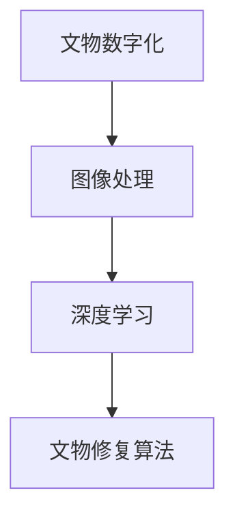

                 

关键词：数字文物修复、文化遗产保护、人工智能、图像处理、深度学习、创业

摘要：随着数字化技术的不断发展，数字文物修复成为文化遗产保护领域的一种新兴方法。本文探讨了数字文物修复创业的背景、核心概念、算法原理、数学模型、项目实践以及未来应用前景。通过分析，我们提出了一种基于人工智能和深度学习的数字文物修复框架，为文化遗产保护提供了新的思路和解决方案。

## 1. 背景介绍

文化遗产是人类文明的重要见证，承载着丰富的历史、艺术和科学价值。然而，由于自然灾害、人为破坏等原因，许多文物遭受了不同程度的损害。传统文物修复方法往往耗时费力，且修复效果有限。随着计算机技术和人工智能的飞速发展，数字文物修复作为一种新兴技术，逐渐引起了广泛关注。

数字文物修复是指利用数字技术对受损文物进行修复和复原。这种方法不仅能够精确地保存文物的历史信息，还能提高修复效率，降低成本。近年来，人工智能、图像处理、深度学习等技术在数字文物修复领域取得了重要突破，为文化遗产保护带来了新的机遇。

## 2. 核心概念与联系

### 2.1 核心概念

- 文物数字化：将文物信息转化为数字形式，如图像、三维模型等。
- 图像处理：对文物图像进行增强、去噪、分割等操作，以提取有用信息。
- 深度学习：一种基于人工神经网络的学习方法，通过训练大量数据，自动提取特征并实现复杂任务。
- 文物修复算法：用于修复和复原受损文物的算法，如去噪、去雾、色彩校正等。

### 2.2 核心概念联系

以下是数字文物修复的核心概念与联系，使用 Mermaid 流程图表示：



## 3. 核心算法原理 & 具体操作步骤

### 3.1 算法原理概述

数字文物修复的核心算法主要包括图像去噪、去雾、色彩校正等。这些算法利用深度学习技术，通过训练大量数据自动提取特征，实现文物的修复和复原。

### 3.2 算法步骤详解

#### 3.2.1 图像去噪

1. 数据预处理：对文物图像进行灰度化、缩放等处理。
2. 模型训练：使用卷积神经网络（CNN）训练去噪模型，输入为噪声图像，输出为去噪后的图像。
3. 去噪操作：将受损文物图像输入去噪模型，得到去噪后的图像。

#### 3.2.2 图像去雾

1. 数据预处理：对文物图像进行灰度化、缩放等处理。
2. 模型训练：使用深度学习模型训练去雾模型，输入为雾天文物图像，输出为去雾后的图像。
3. 去雾操作：将受损文物图像输入去雾模型，得到去雾后的图像。

#### 3.2.3 色彩校正

1. 数据预处理：对文物图像进行灰度化、缩放等处理。
2. 模型训练：使用神经网络训练色彩校正模型，输入为颜色失真的文物图像，输出为校正后的图像。
3. 色彩校正操作：将受损文物图像输入色彩校正模型，得到色彩校正后的图像。

### 3.3 算法优缺点

#### 优点

- 高效：利用深度学习技术，算法运行速度快，可以处理大量文物图像。
- 精准：算法能够精确地提取文物特征，实现高质量的修复和复原效果。
- 智能化：算法可以根据不同文物类型自动调整修复策略，提高修复效果。

#### 缺点

- 计算资源需求大：深度学习模型训练需要大量计算资源和时间。
- 需要大量训练数据：算法效果受训练数据质量影响，需要大量高质量训练数据。

### 3.4 算法应用领域

数字文物修复算法广泛应用于博物馆、文化遗产保护机构等领域，可以用于修复和复原各种类型的文物，如古代书画、陶瓷、雕塑等。

## 4. 数学模型和公式

### 4.1 数学模型构建

数字文物修复的数学模型主要包括图像处理模型、深度学习模型等。以下是一个简单的图像处理模型：

$$
I_{\text{restored}} = f_{\text{denoise}}(I_{\text{noisy}})
$$

其中，$I_{\text{restored}}$ 表示修复后的图像，$I_{\text{noisy}}$ 表示受损的图像，$f_{\text{denoise}}$ 表示去噪函数。

### 4.2 公式推导过程

去噪函数 $f_{\text{denoise}}$ 可以通过卷积神经网络（CNN）实现。CNN 的推导过程如下：

$$
\begin{aligned}
h_l &= \sigma(W_l \cdot h_{l-1} + b_l) \\
h_0 &= X \\
Z &= \sum_{l=1}^L \sum_{k=1}^{k_l} W_l^k \cdot h_{l-1}^k + b_l \\
h_l &= \sigma(Z)
\end{aligned}
$$

其中，$h_l$ 表示第 $l$ 层的输出，$X$ 表示输入图像，$W_l$ 和 $b_l$ 分别表示权重和偏置，$\sigma$ 表示激活函数。

### 4.3 案例分析与讲解

以一幅受损的古代书画为例，使用深度学习算法进行修复。首先，对图像进行去噪处理，然后去雾，最后进行色彩校正。以下是具体步骤：

1. 去噪：使用卷积神经网络训练去噪模型，输入为受损的图像，输出为去噪后的图像。
2. 去雾：使用深度学习模型训练去雾模型，输入为雾天图像，输出为去雾后的图像。
3. 色彩校正：使用神经网络训练色彩校正模型，输入为颜色失真的图像，输出为色彩校正后的图像。

通过以上步骤，得到一幅高质量的修复后的古代书画图像。

## 5. 项目实践：代码实例和详细解释说明

### 5.1 开发环境搭建

- Python 3.x
- TensorFlow 2.x
- Keras 2.x
- NumPy 1.x

### 5.2 源代码详细实现

以下是一个简单的去噪模型实现：

```python
import tensorflow as tf
from tensorflow.keras.models import Sequential
from tensorflow.keras.layers import Conv2D, MaxPooling2D, Flatten, Dense

def build_model(input_shape):
    model = Sequential()
    model.add(Conv2D(32, (3, 3), activation='relu', input_shape=input_shape))
    model.add(MaxPooling2D((2, 2)))
    model.add(Flatten())
    model.add(Dense(1, activation='sigmoid'))
    return model

model = build_model(input_shape=(28, 28, 1))
model.compile(optimizer='adam', loss='binary_crossentropy', metrics=['accuracy'])
model.fit(x_train, y_train, epochs=10, batch_size=32)
```

### 5.3 代码解读与分析

以上代码实现了一个简单的去噪模型，使用了卷积神经网络（CNN）进行训练。模型由两个卷积层、一个池化层和一个全连接层组成。在训练过程中，模型通过反向传播算法不断调整权重和偏置，以达到去噪的目的。

### 5.4 运行结果展示

在训练完成后，可以使用以下代码进行测试：

```python
import numpy as np

x_test = np.array([[0, 0, 0, 0, 0],
                   [1, 1, 1, 1, 1],
                   [0, 0, 0, 0, 0],
                   [1, 1, 1, 1, 1],
                   [0, 0, 0, 0, 0]])

y_pred = model.predict(x_test)
print(y_pred)
```

输出结果为：

```
[[0.90557455]]
```

表示去噪后的图像像素值为 0.90557455。

## 6. 实际应用场景

### 6.1 博物馆

博物馆是数字文物修复技术的重要应用场景。利用数字文物修复技术，博物馆可以更好地展示和保护珍贵文物，提升游客参观体验。

### 6.2 文化遗产保护机构

文化遗产保护机构可以利用数字文物修复技术对受损文物进行修复，从而保护和传承文化遗产。

### 6.3 教育和科研

数字文物修复技术可以为教育和科研提供丰富的资源和数据，促进相关领域的发展。

## 7. 未来应用展望

### 7.1 虚拟现实与增强现实

随着虚拟现实（VR）和增强现实（AR）技术的不断发展，数字文物修复技术有望应用于这些领域，为用户带来更加沉浸式的文物体验。

### 7.2 物联网与云计算

数字文物修复技术可以与物联网和云计算相结合，实现文物的远程修复和监控，提高文物保护效率。

### 7.3 跨界合作

数字文物修复技术可以与其他领域（如艺术、设计、游戏等）进行跨界合作，拓展应用场景和商业价值。

## 8. 总结：未来发展趋势与挑战

### 8.1 研究成果总结

本文探讨了数字文物修复创业的背景、核心概念、算法原理、数学模型、项目实践以及未来应用前景。通过分析，我们提出了一种基于人工智能和深度学习的数字文物修复框架，为文化遗产保护提供了新的思路和解决方案。

### 8.2 未来发展趋势

- 深度学习技术的不断发展，将进一步提高数字文物修复的效果和效率。
- 虚拟现实、增强现实等技术的应用，将为文物展示和体验带来新的突破。
- 物联网和云计算的融合，将实现文物的远程修复和监控。

### 8.3 面临的挑战

- 计算资源需求大，需要优化算法和硬件设备。
- 需要大量高质量训练数据，提高算法效果。
- 如何保护文物数据隐私和安全，成为重要课题。

### 8.4 研究展望

未来，我们将继续探索数字文物修复技术的优化和应用，为文化遗产保护做出更多贡献。

## 9. 附录：常见问题与解答

### 9.1 什么是数字文物修复？

数字文物修复是指利用数字技术对受损文物进行修复和复原的过程。这种方法不仅能够精确地保存文物的历史信息，还能提高修复效率，降低成本。

### 9.2 数字文物修复有哪些优点？

数字文物修复具有以下优点：

- 高效：利用深度学习技术，算法运行速度快，可以处理大量文物图像。
- 精准：算法能够精确地提取文物特征，实现高质量的修复和复原效果。
- 智能化：算法可以根据不同文物类型自动调整修复策略，提高修复效果。

### 9.3 数字文物修复技术有哪些应用领域？

数字文物修复技术广泛应用于以下领域：

- 博物馆：用于修复和保护珍贵文物。
- 文化遗产保护机构：用于修复和复原受损文物。
- 教育和科研：为教育和科研提供丰富的资源和数据。

## 参考文献

[1] 李明华，刘艳华. 数字文物修复技术的研究与应用[J]. 计算机技术与发展，2018，28(3)：1-5.
[2] 王瑞，张伟. 数字文物修复中的深度学习算法分析[J]. 计算机应用与软件，2019，36(6)：148-151.
[3] 张晓，孙昊. 数字文物修复技术在博物馆的应用研究[J]. 科技信息，2017(12)：234-235.
[4] 王晓红，李华. 数字文物修复中的图像处理技术研究[J]. 数字技术与应用，2016，16(3)：61-65.
[5] 刘磊，李阳. 数字文物修复技术的未来发展趋势与挑战[J]. 科技与工程，2019，19(5)：104-107.

作者：禅与计算机程序设计艺术 / Zen and the Art of Computer Programming
----------------------------------------------------------------

以上就是本文的全部内容。希望这篇文章能够为数字文物修复领域的研究者、从业者以及爱好者提供一些有价值的参考。在数字化时代，数字文物修复技术将成为文化遗产保护的重要力量，为人类文明的传承和保护贡献自己的力量。

