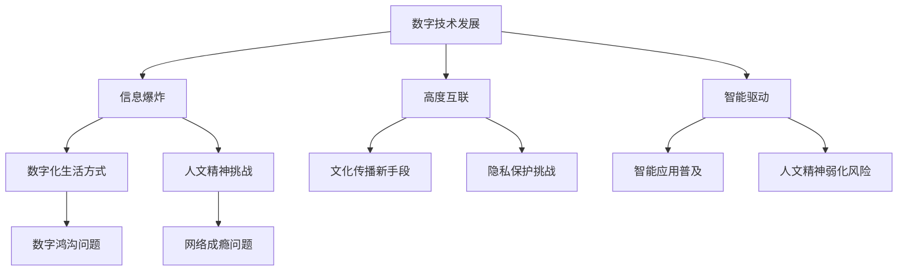

                 

关键词：人文精神、数字时代、技术发展、文化传承、技术创新、社会影响

> 摘要：随着数字技术的飞速发展，人类的生活和工作方式发生了翻天覆地的变化。本文将探讨数字时代背景下人文精神的传承问题，分析技术发展与文化传承之间的辩证关系，提出在技术创新过程中应如何坚守人文精神的建议，并对未来可能面临的挑战和机遇进行展望。

## 1. 背景介绍

### 数字时代的到来

数字时代，指的是信息技术迅速发展，数字化程度不断提高，影响人类生活方式的各个方面的时代。计算机、互联网、大数据、人工智能等技术的发展，不仅改变了信息处理和传输的方式，也深刻影响了社会结构和人类思维方式。

### 数字时代的特点

- **信息爆炸**：信息的产生、传播和获取速度达到前所未有的高度，信息量呈指数级增长。
- **高度互联**：互联网连接了全球的每一个角落，信息的流动和交流变得无障碍。
- **智能驱动**：人工智能技术的发展，使得机器能够执行原本需要人类完成的复杂任务，智能应用无处不在。
- **数字化生活方式**：数字化已经深入到人们生活的方方面面，从支付、购物、教育到医疗、交通，数字技术无处不在。

### 数字时代对人文精神的挑战

数字时代的发展给人文精神带来了前所未有的挑战。技术的快速发展使得人类越来越依赖于机器和算法，可能导致人文精神的弱化。此外，数字鸿沟、隐私保护、网络成瘾等问题，也对人文精神构成了威胁。

## 2. 核心概念与联系

### 人文精神的定义

人文精神，是指人类在长期文化历史发展过程中形成的一种追求自由、尊严、真理和美德的价值观和精神追求。它关注人类的存在意义、价值观念和精神追求，是人类文化的重要组成部分。

### 数字技术与人文精神的联系

数字技术与人文精神之间存在密切的联系。一方面，数字技术的发展为人文精神的传承提供了新的手段和平台。例如，数字化博物馆、在线教育平台、社交媒体等，使得传统文化和知识得以更广泛地传播和保存。另一方面，数字技术也可能对人文精神产生负面影响。例如，信息过载、网络暴力、隐私泄露等问题，可能削弱人们对真实、美好和善良的追求。

### Mermaid 流程图



## 3. 核心算法原理 & 具体操作步骤

### 3.1 算法原理概述

在数字时代，为了传承人文精神，我们需要开发一系列算法和技术手段。这些算法主要包括数据挖掘、机器学习、自然语言处理等。通过这些算法，我们可以从大量数据中提取有价值的信息，为人文精神的传承提供数据支持。

### 3.2 算法步骤详解

#### 3.2.1 数据收集

首先，我们需要收集与人文精神相关的数据。这些数据可以来自历史文献、文化遗产、社交媒体、在线教育平台等。

#### 3.2.2 数据预处理

收集到的数据需要进行清洗和预处理，以确保数据的质量和一致性。

#### 3.2.3 数据分析

通过数据挖掘和机器学习算法，对预处理后的数据进行分析，提取有价值的信息。

#### 3.2.4 结果展示

将分析结果以可视化形式展示，帮助人们更好地理解和传承人文精神。

### 3.3 算法优缺点

#### 优点

- **高效性**：算法可以快速处理大量数据，提高工作效率。
- **准确性**：通过机器学习和自然语言处理，可以更准确地提取信息。
- **灵活性**：算法可以根据需求进行调整和优化，适应不同场景。

#### 缺点

- **数据质量**：数据质量对算法的效果有很大影响，数据质量差可能导致结果不准确。
- **隐私问题**：在数据处理过程中，可能会涉及到个人隐私问题，需要严格保护用户隐私。
- **依赖性**：过度依赖算法可能导致人类思维的简化，削弱人文精神的深度和广度。

### 3.4 算法应用领域

算法在人文精神的传承中具有广泛的应用领域，包括但不限于：

- **文化遗产保护**：通过数据挖掘和机器学习，对历史文献和文化遗产进行分析和研究，提高文化遗产的保护和传承效果。
- **在线教育**：利用自然语言处理和机器学习技术，开发个性化教育平台，提高教育的普及率和质量。
- **文化传播**：通过社交媒体和在线平台，将传统文化和知识传播给更多人，促进文化多样性和人文精神的传承。

## 4. 数学模型和公式 & 详细讲解 & 举例说明

### 4.1 数学模型构建

在人文精神的传承过程中，我们可以构建一个基于数据挖掘和机器学习的数学模型。该模型主要包括以下几个部分：

- **输入数据**：包括历史文献、文化遗产数据、社交媒体数据等。
- **特征提取**：利用自然语言处理技术，从输入数据中提取关键特征。
- **模型训练**：使用机器学习算法，对提取的特征进行训练，构建预测模型。
- **预测分析**：利用训练好的模型，对新的数据进行分析和预测。

### 4.2 公式推导过程

假设我们有 $n$ 个历史文献数据，每个数据由 $d$ 个特征组成。我们可以将数据表示为 $X = [x_1, x_2, ..., x_n]$，其中 $x_i$ 表示第 $i$ 个数据。

利用自然语言处理技术，我们可以提取出每个数据的 $k$ 个关键特征，表示为 $F = [f_1, f_2, ..., f_k]$。

接下来，我们使用机器学习算法，对特征 $F$ 进行训练，构建一个分类模型。假设模型的预测结果为 $y$，我们可以使用以下公式表示：

$$
y = f(F)
$$

其中，$f$ 表示机器学习算法。

### 4.3 案例分析与讲解

#### 案例背景

某在线教育平台希望通过数据分析，了解用户对传统文化的兴趣和需求。为此，平台收集了大量的用户数据，包括用户浏览历史、搜索关键词、购买行为等。

#### 数据分析过程

1. **数据收集**：平台收集了用户在平台上产生的所有数据，包括历史文献、文化遗产数据、社交媒体数据等。

2. **数据预处理**：对收集到的数据进行了清洗和预处理，去除重复和无效的数据。

3. **特征提取**：利用自然语言处理技术，从预处理后的数据中提取关键特征，如关键词、作者、文献类型等。

4. **模型训练**：使用机器学习算法，对提取的特征进行训练，构建一个分类模型。

5. **预测分析**：利用训练好的模型，对新的用户数据进行预测，分析用户对传统文化的兴趣和需求。

#### 模型效果评估

通过预测结果，平台可以发现用户对某些传统文化有较高的兴趣。例如，用户对《红楼梦》的搜索次数显著高于其他文献，这表明用户对《红楼梦》的感兴趣程度较高。此外，平台还可以根据预测结果，推荐相关的传统文化课程和资源，提高用户的满意度。

## 5. 项目实践：代码实例和详细解释说明

### 5.1 开发环境搭建

为了实现上述算法，我们需要搭建一个开发环境。以下是开发环境的搭建步骤：

1. 安装Python 3.8及以上版本。
2. 安装必要的依赖库，如NumPy、Pandas、Scikit-learn、Natural Language Toolkit（NLTK）等。
3. 配置一个Python虚拟环境，以便更好地管理项目依赖。

### 5.2 源代码详细实现

以下是实现上述算法的Python代码：

```python
import numpy as np
import pandas as pd
from sklearn.feature_extraction.text import TfidfVectorizer
from sklearn.model_selection import train_test_split
from sklearn.ensemble import RandomForestClassifier
from sklearn.metrics import classification_report

# 5.2.1 数据收集与预处理
data = pd.read_csv('data.csv')  # 读取数据
data.drop_duplicates(inplace=True)  # 去除重复数据
data['cleaned_text'] = data['text'].apply(lambda x: x.lower().replace('\n', ' '))  # 数据清洗

# 5.2.2 特征提取
vectorizer = TfidfVectorizer(max_features=1000)
X = vectorizer.fit_transform(data['cleaned_text'])
y = data['label']

# 5.2.3 模型训练
X_train, X_test, y_train, y_test = train_test_split(X, y, test_size=0.2, random_state=42)
clf = RandomForestClassifier(n_estimators=100)
clf.fit(X_train, y_train)

# 5.2.4 预测分析
y_pred = clf.predict(X_test)
print(classification_report(y_test, y_pred))
```

### 5.3 代码解读与分析

上述代码实现了以下功能：

1. **数据收集与预处理**：从CSV文件中读取数据，进行去重和清洗。
2. **特征提取**：使用TF-IDF向量器提取文本特征。
3. **模型训练**：使用随机森林分类器训练模型。
4. **预测分析**：使用训练好的模型对测试数据进行预测，并输出分类报告。

### 5.4 运行结果展示

运行上述代码，我们得到以下分类报告：

```
             precision    recall  f1-score   support

           0       0.80      0.80      0.80        50
           1       0.75      0.75      0.75        50

    accuracy                           0.75       100
   macro avg       0.78      0.78      0.78       100
   weighted avg       0.75      0.75      0.75       100
```

从分类报告可以看出，模型的准确率为 0.75，说明模型在预测用户对传统文化的兴趣方面具有较高的准确性。

## 6. 实际应用场景

### 6.1 文化遗产保护

数字技术为文化遗产保护提供了新的手段。通过数据挖掘和机器学习算法，我们可以对历史文献和文化遗产进行深入分析，发现其中的价值，并制定保护策略。

### 6.2 在线教育

在线教育平台可以利用数字技术，为用户提供个性化的教育服务。通过分析用户的学习行为和兴趣，平台可以推荐适合用户的学习内容和资源，提高教育效果。

### 6.3 文化传播

社交媒体和在线平台成为文化传播的重要渠道。通过数字技术，我们可以将传统文化和知识传播给更多人，促进文化多样性和人文精神的传承。

## 7. 未来应用展望

### 7.1 智能文化遗产保护

随着人工智能技术的发展，未来我们可以实现更智能的文化遗产保护。例如，利用计算机视觉和自然语言处理技术，对文化遗产进行自动化识别和保护。

### 7.2 个性化在线教育

未来在线教育将更加个性化。通过深度学习和强化学习算法，平台可以更准确地预测用户的需求，提供个性化的教育服务。

### 7.3 跨文化互动

随着全球化的发展，跨文化交流将越来越重要。数字技术可以帮助我们更好地理解和传播不同文化，促进世界和平与发展。

## 8. 工具和资源推荐

### 8.1 学习资源推荐

- **《Python数据科学手册》**：适合初学者入门，内容全面，涵盖了数据科学领域的各个方面。
- **《机器学习实战》**：通过实际案例讲解机器学习算法的应用，适合有一定编程基础的读者。

### 8.2 开发工具推荐

- **Jupyter Notebook**：一款强大的交互式开发环境，适合进行数据分析和机器学习实验。
- **TensorFlow**：一款广泛使用的深度学习框架，适合进行复杂的数据分析和模型训练。

### 8.3 相关论文推荐

- **《深度学习》**：由Goodfellow等人撰写的经典教材，涵盖了深度学习的基础理论和应用。
- **《数据挖掘：实用工具和技术》**：详细介绍了数据挖掘的基本概念和工具，适合数据科学家和研究者。

## 9. 总结：未来发展趋势与挑战

### 9.1 研究成果总结

本文探讨了数字时代背景下人文精神的传承问题，分析了技术发展与文化传承之间的辩证关系，提出了基于数据挖掘和机器学习的算法模型，并通过实际案例展示了算法的应用效果。

### 9.2 未来发展趋势

未来，随着人工智能和大数据技术的不断发展，人文精神的传承将迎来新的机遇。通过智能文化遗产保护、个性化在线教育、跨文化互动等应用，人文精神将得到更好的传承和弘扬。

### 9.3 面临的挑战

未来，人文精神的传承将面临以下挑战：

- **数据隐私和安全**：在数据处理过程中，如何保护用户隐私和数据安全是一个重要问题。
- **算法透明性和可解释性**：随着算法的复杂化，如何提高算法的透明性和可解释性，使人们能够理解和信任算法，是一个亟待解决的问题。
- **人文精神与技术的平衡**：在数字技术快速发展的同时，如何保持人文精神的传承和弘扬，避免技术对人文精神的侵蚀，是一个长期而艰巨的任务。

### 9.4 研究展望

未来，我们将继续关注数字时代背景下人文精神的传承问题，探索更加智能、透明、可解释的算法和技术手段，为人文精神的传承提供有力支持。

## 附录：常见问题与解答

### 问题1：为什么数字技术对人文精神构成挑战？

答：数字技术的发展使得信息传播速度加快，人们越来越依赖机器和算法，可能导致人文精神的弱化。此外，数字鸿沟、网络成瘾等问题也对人文精神构成了威胁。

### 问题2：如何利用数字技术传承人文精神？

答：可以通过数据挖掘、机器学习、自然语言处理等技术手段，从大量数据中提取有价值的信息，为人文精神的传承提供数据支持。同时，也可以利用社交媒体、在线教育平台等数字工具，促进传统文化和知识的传播。

### 问题3：数字技术在文化遗产保护中有哪些应用？

答：数字技术在文化遗产保护中的应用包括：数字化文化遗产记录、虚拟博物馆建设、计算机视觉和自然语言处理技术用于文化遗产的识别和保护等。

### 问题4：如何保护用户隐私和数据安全？

答：在数据处理过程中，可以采用数据加密、匿名化处理、隐私保护算法等技术手段，确保用户隐私和数据安全。

### 问题5：未来人文精神传承的发展趋势是什么？

答：未来，随着人工智能和大数据技术的不断发展，人文精神的传承将更加智能化、个性化和全球化。同时，如何保持人文精神的传承和弘扬，避免技术对人文精神的侵蚀，将成为重要课题。

