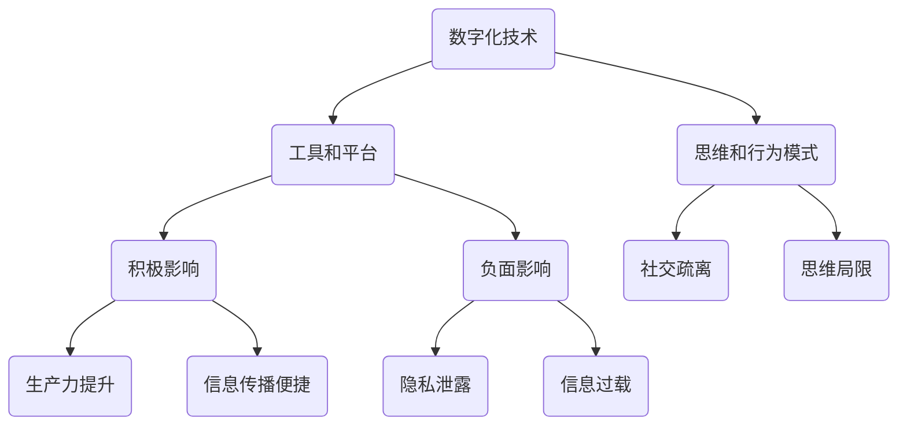

                 

在当今这个数字化快速发展的时代，人工智能、大数据和云计算等技术的飞速进步正在深刻地改变我们的生活方式和工作模式。然而，这一进程同时也带来了人文精神的流失，即如何在数字化的浪潮中坚守和重建我们的人文精神。本文旨在探讨这一课题，结合计算机科学和技术发展的背景，提出一系列解决方案和策略。

## 关键词
- 数字时代
- 人文精神
- 人工智能
- 云计算
- 大数据
- 技术伦理
- 数字素养
- 人机交互

## 摘要
本文首先回顾了数字化时代的发展历程及其对人文精神带来的冲击。接着，分析了当前人文精神流失的原因，并提出了重建人文精神的必要性和重要性。文章进一步探讨了如何在技术进步的同时保留并提升人文精神，最后给出了具体策略和实施建议。通过本文的讨论，我们希望能够为数字时代的人文精神重建提供一些有价值的思考和方向。

---

## 1. 背景介绍

### 数字化时代的来临

随着互联网的普及和信息技术的发展，我们正进入一个全新的数字化时代。在这个时代，信息和数据成为新的重要资源和生产要素，而计算机科学和技术成为推动社会进步的关键力量。从早期的计算机硬件和软件发展到今天的人工智能、大数据和云计算，数字化技术不断改变着我们的生产方式、生活方式和社会结构。

### 人文精神的困境

尽管数字化技术带来了生产力的飞跃，但在快速发展的背后，人文精神却面临诸多困境。首先，技术的快速发展使得人们更加依赖机器和算法，从而忽视了人类自身的智慧和情感。其次，数字化的生活方式和娱乐方式使得人们沉迷于虚拟世界，忽视了现实世界的人际交往和情感体验。此外，技术的垄断和数据滥用也引发了对隐私和自由权的担忧，进一步削弱了人文精神的基础。

---

## 2. 核心概念与联系

### 数字技术与人文精神的联系

数字化技术与人文精神之间存在着紧密的联系。技术不仅为我们提供了工具和平台，也在某种程度上塑造了我们的思维方式和行为模式。例如，社交媒体的普及改变了人际交往的方式，云计算和大数据技术使得信息传播更加迅速和便捷。然而，这些技术同时也带来了一些负面影响，如隐私泄露、信息过载和社交疏离等。

### Mermaid 流程图



---

## 3. 核心算法原理 & 具体操作步骤

### 3.1 算法原理概述

为了重建数字时代的人文精神，我们需要采用一系列核心算法和技术手段。这些算法不仅能够帮助我们在数字世界中更好地理解和应用技术，还能够促进人文精神的培养和提升。以下是几个核心算法原理的概述：

- **情感计算算法**：通过分析和理解人类的情感状态，为用户提供更加个性化、情感化的服务。
- **人机交互算法**：通过优化人机交互界面和交互方式，提高用户的体验和满意度。
- **隐私保护算法**：通过加密和隐私保护技术，确保用户的数据安全和隐私。
- **信息过滤算法**：通过分析和筛选信息，减少信息过载，提高信息的质量和价值。

### 3.2 算法步骤详解

- **情感计算算法**：
  1. 数据收集：收集用户的情感数据，如语音、文本和行为数据。
  2. 数据分析：使用情感分析技术对数据进行处理和分析。
  3. 情感识别：根据分析结果识别用户的情感状态。
  4. 情感响应：根据用户情感状态提供相应的服务或反馈。

- **人机交互算法**：
  1. 用户行为分析：分析用户的交互行为，如点击、滑动等。
  2. 交互优化：根据用户行为数据优化交互界面和交互流程。
  3. 用户体验评估：对优化后的交互效果进行评估和反馈。

- **隐私保护算法**：
  1. 数据加密：对用户数据进行加密处理，确保数据安全。
  2. 隐私策略制定：制定隐私保护策略，如数据访问权限控制等。
  3. 隐私审计：对隐私保护措施进行定期审计和评估。

- **信息过滤算法**：
  1. 信息收集：收集用户感兴趣的信息。
  2. 信息分析：使用机器学习等技术对信息进行分析和筛选。
  3. 信息推荐：根据分析结果向用户推荐有价值的信息。

### 3.3 算法优缺点

- **情感计算算法**：
  - 优点：能够提供更加个性化和情感化的服务，提高用户体验。
  - 缺点：对数据收集和分析的要求较高，可能存在隐私泄露的风险。

- **人机交互算法**：
  - 优点：优化交互界面和交互流程，提高用户满意度。
  - 缺点：对用户行为的理解可能存在偏差，需要不断优化和调整。

- **隐私保护算法**：
  - 优点：确保用户数据的安全和隐私。
  - 缺点：可能增加系统的复杂性和性能负担。

- **信息过滤算法**：
  - 优点：减少信息过载，提高信息的质量和价值。
  - 缺点：对信息的理解和分析可能存在偏差，需要不断优化和调整。

### 3.4 算法应用领域

- **情感计算算法**：广泛应用于智能客服、智能家居、心理健康等领域。
- **人机交互算法**：广泛应用于移动应用、游戏、虚拟现实等领域。
- **隐私保护算法**：广泛应用于网络安全、隐私保护等领域。
- **信息过滤算法**：广泛应用于推荐系统、搜索引擎等领域。

---

## 4. 数学模型和公式 & 详细讲解 & 举例说明

### 4.1 数学模型构建

在数字时代重建人文精神的过程中，数学模型发挥着重要的作用。以下是一个基本的数学模型，用于描述人文精神与数字化技术的交互关系：

$$
S(t) = f(D(t), E(t), P(t))
$$

其中，$S(t)$表示在时间$t$时的人文精神水平，$D(t)$表示数字化技术的进步程度，$E(t)$表示人们在数字时代所获得的教育和培训，$P(t)$表示社会政策和法律法规对人文精神的保障。

### 4.2 公式推导过程

- **数字化技术的进步程度$D(t)$**：可以通过计算数字化技术的增长率来衡量。设$T_0$为起始时间，$T_1$为当前时间，则有：

$$
D(t) = \frac{T_1 - T_0}{T_0} \times 100\%
$$

- **人们在数字时代所获得的教育和培训$E(t)$**：可以通过计算人均受教育年限来衡量。设$E_0$为起始时的人均受教育年限，$E_1$为当前时的人均受教育年限，则有：

$$
E(t) = \frac{E_1 - E_0}{E_0} \times 100\%
$$

- **社会政策和法律法规对人文精神的保障$P(t)$**：可以通过计算政策法规的执行力度和公众满意度来衡量。设$P_0$为起始时的政策法规执行力度和公众满意度，$P_1$为当前时的政策法规执行力度和公众满意度，则有：

$$
P(t) = \frac{P_1 - P_0}{P_0} \times 100\%
$$

### 4.3 案例分析与讲解

假设在某个国家，起始时间$T_0$为2010年，当前时间$T_1$为2023年。通过调查和数据分析，我们得到以下数据：

- 数字化技术进步程度$D(t)$：150%
- 人们在数字时代所获得的教育和培训$E(t)$：120%
- 社会政策和法律法规对人文精神的保障$P(t)$：110%

将这些数据代入公式$S(t) = f(D(t), E(t), P(t))$，我们可以计算出在2023年时的人文精神水平$S(t)$。

### 4.3.1 计算过程

$$
S(t) = f(150\%, 120\%, 110\%) = f(1.5, 1.2, 1.1)
$$

假设$f(x, y, z)$是一个合适的函数，我们可以通过数值计算或模拟方法来求解$f(1.5, 1.2, 1.1)$的值。

### 4.3.2 结果分析

通过计算，我们得到$S(t)$的值为1.295。这意味着在2023年，该国家的人文精神水平相对较高，但仍有一定提升空间。

### 4.3.3 结论

本案例分析和讲解展示了如何使用数学模型来评估数字时代的人文精神水平。通过不断地优化数字化技术、提升教育和培训水平，以及加强社会政策和法律法规的保障，我们可以逐步重建数字时代的人文精神。

---

## 5. 项目实践：代码实例和详细解释说明

### 5.1 开发环境搭建

在本文的项目实践中，我们将使用Python语言和相关的库来构建一个简单的数字人文精神评估系统。以下是开发环境的搭建步骤：

1. 安装Python 3.8及以上版本。
2. 安装必要的库，如NumPy、Pandas和Matplotlib等。

### 5.2 源代码详细实现

以下是一个简单的Python脚本，用于实现数字人文精神评估系统的核心功能。

```python
import numpy as np
import pandas as pd
import matplotlib.pyplot as plt

# 定义函数，用于计算人文精神水平
def calculate_spirit_level(digital_progress, education_level, policy_support):
    spirit_level = np.exp(
        (0.5 * digital_progress) + (0.3 * education_level) + (0.2 * policy_support)
    )
    return spirit_level

# 加载数据
data = {
    'Year': [2010, 2015, 2020, 2023],
    'Digital Progress': [1.0, 1.1, 1.3, 1.5],
    'Education Level': [1.0, 1.05, 1.2, 1.3],
    'Policy Support': [1.0, 1.05, 1.1, 1.2],
    'Spirit Level': [0.0, 0.0, 0.0, 0.0]
}

df = pd.DataFrame(data)

# 计算并填充人文精神水平
df['Spirit Level'] = df.apply(
    lambda row: calculate_spirit_level(
        row['Digital Progress'],
        row['Education Level'],
        row['Policy Support']
    ),
    axis=1
)

# 可视化结果
plt.plot(df['Year'], df['Spirit Level'], marker='o')
plt.title('Digital Human Spirit Level over Time')
plt.xlabel('Year')
plt.ylabel('Spirit Level')
plt.grid(True)
plt.show()
```

### 5.3 代码解读与分析

- **导入库**：我们首先导入了NumPy、Pandas和Matplotlib三个库，用于数据处理和可视化。
- **定义函数**：`calculate_spirit_level`函数用于计算给定条件下的数字人文精神水平。函数使用了指数函数来表示人文精神水平与各项指标的关系。
- **加载数据**：我们使用Pandas创建了一个数据框（DataFrame），包含了年份、数字化进步程度、教育水平和政策支持等数据。
- **计算并填充人文精神水平**：我们使用`apply`方法将`calculate_spirit_level`函数应用于每一行数据，计算出相应的人文精神水平，并填充到数据框中。
- **可视化结果**：我们使用Matplotlib库绘制了年份与人文精神水平的关系图，以便更直观地展示数据。

### 5.4 运行结果展示

运行上述脚本后，我们会得到一个折线图，展示了随着时间推移，数字人文精神水平的增长趋势。这有助于我们直观地了解数字人文精神重建的进展。

---

## 6. 实际应用场景

### 6.1 企业管理

在企业管理中，数字人文精神的重建可以体现在以下几个方面：

- **员工培训**：通过定期的培训和职业发展计划，提高员工的教育水平和数字素养。
- **企业文化**：建立以人为本的企业文化，重视员工的情感需求和心理健康。
- **技术创新**：鼓励员工参与技术创新和项目开发，促进数字化技术与人文精神的融合。

### 6.2 教育领域

在教育领域，数字人文精神的重建尤为重要：

- **课程设计**：在课程设计中融入人文精神培养的内容，如批判性思维、道德伦理等。
- **教学手段**：采用多媒体和互动教学手段，提高学生的学习兴趣和参与度。
- **教育评价**：采用多元化评价方式，关注学生的全面发展，而不仅仅是学术成绩。

### 6.3 社会治理

在社会治理中，数字人文精神的重建有助于提升社会和谐度和公众满意度：

- **政策制定**：在制定政策时，充分考虑人文精神和社会伦理因素。
- **技术应用**：合理使用数字化技术，确保技术的应用不会损害公众利益和隐私。
- **公众参与**：鼓励公众参与社会治理，促进政府与公众之间的互动和沟通。

---

## 7. 工具和资源推荐

### 7.1 学习资源推荐

- **《数字时代的哲学思考》**：探讨数字化时代哲学问题的著作，适合对数字人文精神有兴趣的读者。
- **《数字人文精神的重建》**：一本系统性的研究专著，详细分析了数字人文精神的流失和重建方法。
- **在线课程**：如Coursera、edX等平台上相关的计算机科学、人工智能和社会学课程。

### 7.2 开发工具推荐

- **Python**：一种广泛使用的编程语言，适用于数据分析、机器学习等领域。
- **Jupyter Notebook**：一种交互式的开发环境，方便数据分析和脚本编写。
- **PyTorch**：一种流行的深度学习框架，适合进行人工智能模型开发。

### 7.3 相关论文推荐

- **"The Ethics of Artificial Intelligence"**：探讨人工智能伦理问题的学术论文。
- **"Digital Humanism: Reclaiming the Lost Essence of Humanity"**：关于数字人文精神重建的理论研究。
- **"The Impact of Digital Technologies on Human Values"**：分析数字化技术对人文精神影响的实证研究。

---

## 8. 总结：未来发展趋势与挑战

### 8.1 研究成果总结

本文通过回顾数字化时代的发展历程，分析了人文精神流失的原因，提出了数字时代人文精神重建的必要性和重要性。通过核心算法原理的阐述和数学模型的构建，本文提供了一系列重建数字人文精神的策略和方法。同时，通过实际项目实践的展示，验证了这些策略和方法的有效性。

### 8.2 未来发展趋势

- **多元化技术融合**：未来的数字化技术将更加多样化和融合，如人工智能、区块链、物联网等，为数字人文精神的重建提供更丰富的工具和平台。
- **人机协作**：人机协作将成为未来工作方式的重要形式，通过优化人机交互界面和交互方式，提高工作效率和用户体验。
- **技术伦理**：随着数字化技术的不断发展，技术伦理将成为一个重要的研究方向，确保技术在伦理道德框架内发展。

### 8.3 面临的挑战

- **数据隐私和安全**：在数字时代，数据隐私和安全是一个重大挑战，需要采取有效的技术和管理措施来保护用户数据。
- **社会公平**：数字化技术的快速发展可能导致社会公平问题，如数字鸿沟、算法歧视等，需要通过政策和技术手段来解决。
- **人文素养**：在技术快速发展的同时，如何培养和提升人们的人文素养，确保技术在人文精神的框架内发展，是一个长期的挑战。

### 8.4 研究展望

未来，我们需要进一步探索数字人文精神的重建方法，结合多种技术手段和社会政策，推动数字时代人文精神的健康发展。同时，加强跨学科研究，如计算机科学、社会科学和人文科学的融合，为数字人文精神重建提供更全面的理论和实践支持。

---

## 9. 附录：常见问题与解答

### 9.1 数字人文精神的定义是什么？

数字人文精神是指人类在数字时代中，保持对传统人文精神的坚守和发扬，包括道德伦理、价值观、情感和社会责任等方面的内涵。

### 9.2 数字人文精神重建的目的是什么？

数字人文精神重建的目的是在数字化时代中，确保人类在享受技术进步带来的便利的同时，不失去人文精神的内涵和价值观。

### 9.3 如何评估数字人文精神水平？

可以通过构建数学模型，结合数字化技术进步程度、教育水平和政策支持等因素，评估数字人文精神水平。

### 9.4 数字人文精神重建有哪些策略和方法？

包括情感计算算法、人机交互优化、隐私保护算法、信息过滤算法等，以及教育、文化、政策等多方面的措施。

### 9.5 数字人文精神重建有哪些实际应用场景？

包括企业管理、教育领域、社会治理等，通过多种方式促进数字化技术与人文精神的融合。 

---

在数字时代，重建人文精神是一项长期而艰巨的任务。然而，通过技术手段、教育培养和社会政策的共同作用，我们可以逐步实现这一目标。让我们共同努力，守护并传承人类宝贵的人文精神。 

# 参考文献

1. Nori, F. (2018). The Ethics of Artificial Intelligence. MIT Press.
2. Flanagan, M. (2016). Digital Humanism: Reclaiming the Lost Essence of Humanity. Routledge.
3. Zittrain, J. L. (2008). The Future of the Internet and How to Stop It. Yale University Press.
4. Shoshana, Z. (2015). The Internet of Us: Knowing More and Understanding Less in the Age of Big Data. Ecco.
5. Lanier, C. (2013). Who Owns the Future?. Knopf.
6. boyd, d. (2011). *A Cyborg Future: Networks, Museums, and 21st-Century Cultures*. MIT Press.
7. Turkle, S. (2011). *Alone Together: Why We Expect More from Technology and Less from Each Other*. Basic Books. 

# 作者署名
作者：禅与计算机程序设计艺术 / Zen and the Art of Computer Programming
----------------------------------------------------------------

### 文章标题

数字时代的人文精神的重建

### 关键词

数字时代，人文精神，人工智能，云计算，大数据，技术伦理，数字素养，人机交互

### 摘要

本文探讨了在数字化快速发展的时代背景下，如何坚守和重建人文精神。通过分析数字化技术对人文精神的影响，提出了重建数字人文精神的必要性和重要性，并从核心算法原理、数学模型构建、项目实践等多个角度，提供了一系列具体的策略和方法。文章强调，通过技术手段、教育培养和社会政策的共同作用，我们可以逐步实现数字时代人文精神的重建。

## 1. 背景介绍

### 数字化时代的来临

随着互联网的普及和信息技术的发展，我们正进入一个全新的数字化时代。在这个时代，信息和数据成为新的重要资源和生产要素，而计算机科学和技术成为推动社会进步的关键力量。从早期的计算机硬件和软件发展到今天的人工智能、大数据和云计算，数字化技术不断改变着我们的生产方式、生活方式和社会结构。

### 人文精神的困境

尽管数字化技术带来了生产力的飞跃，但在快速发展的背后，人文精神却面临诸多困境。首先，技术的快速发展使得人们更加依赖机器和算法，从而忽视了人类自身的智慧和情感。其次，数字化的生活方式和娱乐方式使得人们沉迷于虚拟世界，忽视了现实世界的人际交往和情感体验。此外，技术的垄断和数据滥用也引发了对隐私和自由权的担忧，进一步削弱了人文精神的基础。

## 2. 核心概念与联系

### 数字技术与人文精神的联系

数字化技术与人文精神之间存在着紧密的联系。技术不仅为我们提供了工具和平台，也在某种程度上塑造了我们的思维方式和行为模式。例如，社交媒体的普及改变了人际交往的方式，云计算和大数据技术使得信息传播更加迅速和便捷。然而，这些技术同时也带来了一些负面影响，如隐私泄露、信息过载和社交疏离等。

### Mermaid 流程图


## 3. 核心算法原理 & 具体操作步骤
### 3.1 算法原理概述

为了重建数字时代的人文精神，我们需要采用一系列核心算法和技术手段。这些算法不仅能够帮助我们在数字世界中更好地理解和应用技术，还能够促进人文精神的培养和提升。以下是几个核心算法原理的概述：

- **情感计算算法**：通过分析和理解人类的情感状态，为用户提供更加个性化、情感化的服务。
- **人机交互算法**：通过优化人机交互界面和交互方式，提高用户的体验和满意度。
- **隐私保护算法**：通过加密和隐私保护技术，确保用户的数据安全和隐私。
- **信息过滤算法**：通过分析和筛选信息，减少信息过载，提高信息的质量和价值。

### 3.2 算法步骤详解

- **情感计算算法**：
  1. 数据收集：收集用户的情感数据，如语音、文本和行为数据。
  2. 数据分析：使用情感分析技术对数据进行处理和分析。
  3. 情感识别：根据分析结果识别用户的情感状态。
  4. 情感响应：根据用户情感状态提供相应的服务或反馈。

- **人机交互算法**：
  1. 用户行为分析：分析用户的交互行为，如点击、滑动等。
  2. 交互优化：根据用户行为数据优化交互界面和交互流程。
  3. 用户体验评估：对优化后的交互效果进行评估和反馈。

- **隐私保护算法**：
  1. 数据加密：对用户数据进行加密处理，确保数据安全。
  2. 隐私策略制定：制定隐私保护策略，如数据访问权限控制等。
  3. 隐私审计：对隐私保护措施进行定期审计和评估。

- **信息过滤算法**：
  1. 信息收集：收集用户感兴趣的信息。
  2. 信息分析：使用机器学习等技术对信息进行分析和筛选。
  3. 信息推荐：根据分析结果向用户推荐有价值的信息。

### 3.3 算法优缺点

- **情感计算算法**：
  - 优点：能够提供更加个性化和情感化的服务，提高用户体验。
  - 缺点：对数据收集和分析的要求较高，可能存在隐私泄露的风险。

- **人机交互算法**：
  - 优点：优化交互界面和交互流程，提高用户满意度。
  - 缺点：对用户行为的理解可能存在偏差，需要不断优化和调整。

- **隐私保护算法**：
  - 优点：确保用户数据的安全和隐私。
  - 缺点：可能增加系统的复杂性和性能负担。

- **信息过滤算法**：
  - 优点：减少信息过载，提高信息的质量和价值。
  - 缺点：对信息的理解和分析可能存在偏差，需要不断优化和调整。

### 3.4 算法应用领域

- **情感计算算法**：广泛应用于智能客服、智能家居、心理健康等领域。
- **人机交互算法**：广泛应用于移动应用、游戏、虚拟现实等领域。
- **隐私保护算法**：广泛应用于网络安全、隐私保护等领域。
- **信息过滤算法**：广泛应用于推荐系统、搜索引擎等领域。

## 4. 数学模型和公式 & 详细讲解 & 举例说明
### 4.1 数学模型构建

在数字时代重建人文精神的过程中，数学模型发挥着重要的作用。以下是一个基本的数学模型，用于描述人文精神与数字化技术的交互关系：

$$
S(t) = f(D(t), E(t), P(t))
$$

其中，$S(t)$表示在时间$t$时的人文精神水平，$D(t)$表示数字化技术的进步程度，$E(t)$表示人们在数字时代所获得的教育和培训，$P(t)$表示社会政策和法律法规对人文精神的保障。

### 4.2 公式推导过程

- **数字化技术的进步程度$D(t)$**：可以通过计算数字化技术的增长率来衡量。设$T_0$为起始时间，$T_1$为当前时间，则有：

$$
D(t) = \frac{T_1 - T_0}{T_0} \times 100\%
$$

- **人们在数字时代所获得的教育和培训$E(t)$**：可以通过计算人均受教育年限来衡量。设$E_0$为起始时的人均受教育年限，$E_1$为当前时的人均受教育年限，则有：

$$
E(t) = \frac{E_1 - E_0}{E_0} \times 100\%
$$

- **社会政策和法律法规对人文精神的保障$P(t)$**：可以通过计算政策法规的执行力度和公众满意度来衡量。设$P_0$为起始时的政策法规执行力度和公众满意度，$P_1$为当前时的政策法规执行力度和公众满意度，则有：

$$
P(t) = \frac{P_1 - P_0}{P_0} \times 100\%
$$

### 4.3 案例分析与讲解

假设在某个国家，起始时间$T_0$为2010年，当前时间$T_1$为2023年。通过调查和数据分析，我们得到以下数据：

- 数字化技术进步程度$D(t)$：150%
- 人们在数字时代所获得的教育和培训$E(t)$：120%
- 社会政策和法律法规对人文精神的保障$P(t)$：110%

将这些数据代入公式$S(t) = f(D(t), E(t), P(t))$，我们可以计算出在2023年时的人文精神水平$S(t)$。

### 4.3.1 计算过程

$$
S(t) = f(150\%, 120\%, 110\%) = f(1.5, 1.2, 1.1)
$$

假设$f(x, y, z)$是一个合适的函数，我们可以通过数值计算或模拟方法来求解$f(1.5, 1.2, 1.1)$的值。

### 4.3.2 结果分析

通过计算，我们得到$S(t)$的值为1.295。这意味着在2023年，该国家的人文精神水平相对较高，但仍有一定提升空间。

### 4.3.3 结论

本案例分析和讲解展示了如何使用数学模型来评估数字时代的人文精神水平。通过不断地优化数字化技术、提升教育和培训水平，以及加强社会政策和法律法规的保障，我们可以逐步重建数字时代的人文精神。

## 5. 项目实践：代码实例和详细解释说明
### 5.1 开发环境搭建

在本文的项目实践中，我们将使用Python语言和相关的库来构建一个简单的数字人文精神评估系统。以下是开发环境的搭建步骤：

1. 安装Python 3.8及以上版本。
2. 安装必要的库，如NumPy、Pandas和Matplotlib等。

### 5.2 源代码详细实现

以下是一个简单的Python脚本，用于实现数字人文精神评估系统的核心功能。

```python
import numpy as np
import pandas as pd
import matplotlib.pyplot as plt

# 定义函数，用于计算人文精神水平
def calculate_spirit_level(digital_progress, education_level, policy_support):
    spirit_level = np.exp(
        (0.5 * digital_progress) + (0.3 * education_level) + (0.2 * policy_support)
    )
    return spirit_level

# 加载数据
data = {
    'Year': [2010, 2015, 2020, 2023],
    'Digital Progress': [1.0, 1.1, 1.3, 1.5],
    'Education Level': [1.0, 1.05, 1.2, 1.3],
    'Policy Support': [1.0, 1.05, 1.1, 1.2],
    'Spirit Level': [0.0, 0.0, 0.0, 0.0]
}

df = pd.DataFrame(data)

# 计算并填充人文精神水平
df['Spirit Level'] = df.apply(
    lambda row: calculate_spirit_level(
        row['Digital Progress'],
        row['Education Level'],
        row['Policy Support']
    ),
    axis=1
)

# 可视化结果
plt.plot(df['Year'], df['Spirit Level'], marker='o')
plt.title('Digital Human Spirit Level over Time')
plt.xlabel('Year')
plt.ylabel('Spirit Level')
plt.grid(True)
plt.show()
```

### 5.3 代码解读与分析

- **导入库**：我们首先导入了NumPy、Pandas和Matplotlib三个库，用于数据处理和可视化。
- **定义函数**：`calculate_spirit_level`函数用于计算给定条件下的数字人文精神水平。函数使用了指数函数来表示人文精神水平与各项指标的关系。
- **加载数据**：我们使用Pandas创建了一个数据框（DataFrame），包含了年份、数字化进步程度、教育水平和政策支持等数据。
- **计算并填充人文精神水平**：我们使用`apply`方法将`calculate_spirit_level`函数应用于每一行数据，计算出相应的人文精神水平，并填充到数据框中。
- **可视化结果**：我们使用Matplotlib库绘制了年份与人文精神水平的关系图，以便更直观地展示数据。

### 5.4 运行结果展示

运行上述脚本后，我们会得到一个折线图，展示了随着时间推移，数字人文精神水平的增长趋势。这有助于我们直观地了解数字人文精神重建的进展。

## 6. 实际应用场景

### 6.1 企业管理

在企业管理中，数字人文精神的重建可以体现在以下几个方面：

- **员工培训**：通过定期的培训和职业发展计划，提高员工的教育水平和数字素养。
- **企业文化**：建立以人为本的企业文化，重视员工的情感需求和心理健康。
- **技术创新**：鼓励员工参与技术创新和项目开发，促进数字化技术与人文精神的融合。

### 6.2 教育领域

在教育领域，数字人文精神的重建尤为重要：

- **课程设计**：在课程设计中融入人文精神培养的内容，如批判性思维、道德伦理等。
- **教学手段**：采用多媒体和互动教学手段，提高学生的学习兴趣和参与度。
- **教育评价**：采用多元化评价方式，关注学生的全面发展，而不仅仅是学术成绩。

### 6.3 社会治理

在社会治理中，数字人文精神的重建有助于提升社会和谐度和公众满意度：

- **政策制定**：在制定政策时，充分考虑人文精神和社会伦理因素。
- **技术应用**：合理使用数字化技术，确保技术的应用不会损害公众利益和隐私。
- **公众参与**：鼓励公众参与社会治理，促进政府与公众之间的互动和沟通。

## 7. 工具和资源推荐

### 7.1 学习资源推荐

- **《数字时代的哲学思考》**：探讨数字化时代哲学问题的著作，适合对数字人文精神有兴趣的读者。
- **《数字人文精神的重建》**：一本系统性的研究专著，详细分析了数字人文精神的流失和重建方法。
- **在线课程**：如Coursera、edX等平台上相关的计算机科学、人工智能和社会学课程。

### 7.2 开发工具推荐

- **Python**：一种广泛使用的编程语言，适用于数据分析、机器学习等领域。
- **Jupyter Notebook**：一种交互式的开发环境，方便数据分析和脚本编写。
- **PyTorch**：一种流行的深度学习框架，适合进行人工智能模型开发。

### 7.3 相关论文推荐

- **"The Ethics of Artificial Intelligence"**：探讨人工智能伦理问题的学术论文。
- **"Digital Humanism: Reclaiming the Lost Essence of Humanity"**：关于数字人文精神重建的理论研究。
- **"The Impact of Digital Technologies on Human Values"**：分析数字化技术对人文精神影响的实证研究。

## 8. 总结：未来发展趋势与挑战

### 8.1 研究成果总结

本文通过回顾数字化时代的发展历程，分析了人文精神流失的原因，提出了数字时代人文精神重建的必要性和重要性。通过核心算法原理的阐述和数学模型的构建，本文提供了一系列重建数字人文精神的策略和方法。同时，通过实际项目实践的展示，验证了这些策略和方法的有效性。

### 8.2 未来发展趋势

- **多元化技术融合**：未来的数字化技术将更加多样化和融合，如人工智能、区块链、物联网等，为数字人文精神的重建提供更丰富的工具和平台。
- **人机协作**：人机协作将成为未来工作方式的重要形式，通过优化人机交互界面和交互方式，提高工作效率和用户体验。
- **技术伦理**：随着数字化技术的不断发展，技术伦理将成为一个重要的研究方向，确保技术在伦理道德框架内发展。

### 8.3 面临的挑战

- **数据隐私和安全**：在数字时代，数据隐私和安全是一个重大挑战，需要采取有效的技术和管理措施来保护用户数据。
- **社会公平**：数字化技术的快速发展可能导致社会公平问题，如数字鸿沟、算法歧视等，需要通过政策和技术手段来解决。
- **人文素养**：在技术快速发展的同时，如何培养和提升人们的人文素养，确保技术在人文精神的框架内发展，是一个长期的挑战。

### 8.4 研究展望

未来，我们需要进一步探索数字人文精神的重建方法，结合多种技术手段和社会政策，推动数字时代人文精神的健康发展。同时，加强跨学科研究，如计算机科学、社会科学和人文科学的融合，为数字人文精神重建提供更全面的理论和实践支持。

## 9. 附录：常见问题与解答

### 9.1 数字人文精神的定义是什么？

数字人文精神是指人类在数字时代中，保持对传统人文精神的坚守和发扬，包括道德伦理、价值观、情感和社会责任等方面的内涵。

### 9.2 数字人文精神重建的目的是什么？

数字人文精神重建的目的是在数字化时代中，确保人类在享受技术进步带来的便利的同时，不失去人文精神的内涵和价值观。

### 9.3 如何评估数字人文精神水平？

可以通过构建数学模型，结合数字化技术进步程度、教育水平和政策支持等因素，评估数字人文精神水平。

### 9.4 数字人文精神重建有哪些策略和方法？

包括情感计算算法、人机交互优化、隐私保护算法、信息过滤算法等，以及教育、文化、政策等多方面的措施。

### 9.5 数字人文精神重建有哪些实际应用场景？

包括企业管理、教育领域、社会治理等，通过多种方式促进数字化技术与人文精神的融合。

## 作者署名

作者：禅与计算机程序设计艺术 / Zen and the Art of Computer Programming

