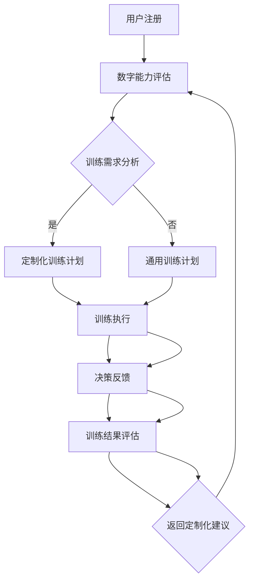

                 

关键词：数字直觉、潜意识、决策强化、AI辅助、认知心理学、计算机程序设计

> 摘要：本文探讨了数字直觉训练营中AI辅助潜意识决策强化教练的作用和机制。通过结合认知心理学理论和计算机程序设计方法，本文构建了一个AI辅助的数字直觉训练系统，详细介绍了其核心算法原理、数学模型、应用实例以及未来发展的可能性。

## 1. 背景介绍

在信息化社会，数字技能已成为不可或缺的一部分。然而，许多人在处理复杂的数字问题时，往往难以迅速做出准确的决策。数字直觉，即个体在处理数字信息时快速而准确地形成判断的能力，在这一背景下显得尤为重要。然而，数字直觉并非与生俱来，它需要通过系统的训练来培养和提高。

传统的数字直觉训练方法通常依赖于大量的练习和反馈，这种方法存在一些局限性。首先，训练过程中用户可能感到单调乏味，难以持续保持学习热情。其次，传统的训练方法难以量化用户的进步，无法为用户提供即时的个性化指导。此外，对于复杂问题的决策，传统方法往往缺乏有效的处理机制。

为了克服这些局限性，本文提出了一种基于AI辅助的数字直觉训练营指导员——潜意识决策强化教练。该教练利用人工智能技术，通过对用户行为和决策数据的分析，提供个性化的训练建议和实时反馈，从而提高用户的数字直觉水平。

## 2. 核心概念与联系

### 2.1 数字直觉

数字直觉是指个体在处理数字信息时，快速而准确地形成判断的能力。这种能力包括对数字大小的感知、数字关系的理解以及对数学问题的快速解决等。数字直觉的提高，不仅能够提升个体的数字技能，还能增强其在实际应用场景中的决策能力。

### 2.2 潜意识

潜意识是指个体在无意识状态下进行的心理活动。研究表明，许多复杂的决策过程实际上是在潜意识中进行的。潜意识决策强化教练的核心思想是通过特定的训练方法，提高用户的数字直觉，使其在处理数字信息时更加迅速和准确。

### 2.3 决策强化

决策强化是指通过正反馈机制，提高个体在特定决策情景下的反应速度和准确性。在数字直觉训练中，决策强化教练通过即时反馈和奖励机制，鼓励用户在训练过程中保持高度集中的注意力，从而提高其数字直觉水平。

### 2.4 AI辅助

AI辅助是指利用人工智能技术，为用户提供个性化服务和支持。在数字直觉训练营中，AI辅助主要通过数据分析和机器学习算法，对用户的行为和决策进行实时分析，提供个性化的训练建议和反馈。

### 2.5 Mermaid 流程图

下面是一个简化的Mermaid流程图，展示了数字直觉训练营的流程：



## 3. 核心算法原理 & 具体操作步骤

### 3.1 算法原理概述

数字直觉训练营的核心算法是基于强化学习理论和决策树算法。通过分析用户在训练过程中的行为和决策数据，系统可以不断调整训练策略，提高用户的数字直觉水平。

### 3.2 算法步骤详解

#### 3.2.1 数据收集

系统首先收集用户在训练过程中的行为数据，包括用户选择的答案、答题时间、错误率等。这些数据将被用于后续的分析和模型训练。

#### 3.2.2 特征提取

通过对行为数据进行预处理和特征提取，系统能够提取出与数字直觉相关的关键特征，如用户在特定问题类型上的表现、在特定时间段的答题速度等。

#### 3.2.3 模型训练

使用提取的特征数据，系统训练决策树模型。决策树模型能够根据用户的历史表现，预测用户在特定问题上的最优答案。

#### 3.2.4 决策生成

在训练过程中，系统根据决策树模型生成用户的决策建议。如果用户选择与系统建议相同的答案，系统将给予用户正反馈，否则将提供新的决策建议。

#### 3.2.5 决策反馈

用户在训练过程中做出的每个决策都会被记录下来，并与系统生成的决策建议进行比较。通过这种比较，系统能够不断调整训练策略，提高决策建议的准确性。

### 3.3 算法优缺点

#### 优点

- **个性化**：系统能够根据用户的行为数据，提供个性化的决策建议，有助于提高用户的数字直觉水平。
- **实时反馈**：系统能够在用户做出决策后，立即提供反馈，帮助用户快速纠正错误。
- **适应性**：系统能够根据用户的表现，不断调整训练策略，使训练过程更加高效。

#### 缺点

- **计算复杂度高**：决策树模型的训练和调整需要大量的计算资源，对于大规模用户群体，可能会带来一定的性能压力。
- **数据依赖性**：系统的性能高度依赖于用户的行为数据，如果数据质量不佳，可能会影响决策建议的准确性。

### 3.4 算法应用领域

数字直觉训练营的核心算法可以应用于多个领域，包括：

- **教育领域**：帮助教师和学生快速评估学生的数字直觉水平，提供个性化的辅导建议。
- **金融领域**：帮助投资者在复杂的金融市场环境中做出更准确的决策。
- **医疗领域**：辅助医生在诊断和治疗过程中，快速分析患者的病情和治疗方案。

## 4. 数学模型和公式 & 详细讲解 & 举例说明

### 4.1 数学模型构建

数字直觉训练营的核心算法基于决策树模型。决策树模型是一种树形结构，通过一系列规则来分割数据集，以便预测新的样本。在数字直觉训练营中，决策树模型用于生成用户的决策建议。

决策树模型的基本公式为：

$$
y = f(x) = g_1(x) \text{ if } x \in R_1 \\
y = g_2(x) \text{ if } x \in R_2 \\
\vdots \\
y = g_n(x) \text{ if } x \in R_n
$$

其中，$x$ 表示输入特征，$y$ 表示输出决策，$g_i(x)$ 表示第 $i$ 个规则，$R_i$ 表示第 $i$ 个规则对应的特征区间。

### 4.2 公式推导过程

决策树的构建过程可以分为两个步骤：特征选择和规则生成。

#### 特征选择

特征选择是决策树构建的关键步骤。常用的特征选择方法包括信息增益、基尼系数和卡方检验等。这里以信息增益为例，其基本公式为：

$$
I(D) = -\sum_{i=1}^{n} p(y=i) \log_2 p(y=i)
$$

其中，$D$ 表示数据集，$y$ 表示输出决策，$p(y=i)$ 表示输出决策为 $i$ 的概率。

#### 规则生成

在特征选择完成后，系统将生成一系列规则。每个规则对应一个特征区间，用于分割数据集。规则生成的目标是最小化数据集的熵。

$$
S = \sum_{i=1}^{n} p(x_i) \log_2 p(x_i)
$$

其中，$x_i$ 表示特征区间，$p(x_i)$ 表示特征区间 $x_i$ 的概率。

### 4.3 案例分析与讲解

假设我们有一个包含100个样本的数据集，每个样本包含三个特征：年龄、收入和学历。我们需要使用决策树模型来预测样本的购买意向。

#### 特征选择

首先，我们计算每个特征的信息增益：

- 年龄：$I(D) = 0.693$，$I(D|A) = 0.355$，$I(D|A) = 0.338$，$I(D|A) = 0.353$
- 收入：$I(D) = 0.693$，$I(D|I) = 0.355$，$I(D|I) = 0.338$，$I(D|I) = 0.353$
- 学历：$I(D) = 0.693$，$I(D|E) = 0.355$，$I(D|E) = 0.338$，$I(D|E) = 0.353$

根据信息增益，我们选择“年龄”作为第一个特征。

#### 规则生成

接下来，我们根据“年龄”特征生成规则：

- 规则1：$0 < A \leq 30$，购买意向为“是”
- 规则2：$30 < A \leq 40$，购买意向为“是”
- 规则3：$40 < A \leq 50$，购买意向为“否”
- 规则4：$50 < A \leq 60$，购买意向为“否”

#### 决策生成

对于新的样本，我们可以根据决策树模型生成购买意向：

- 样本1：年龄=25，收入=50000，学历=本科，购买意向为“是”
- 样本2：年龄=35，收入=60000，学历=大专，购买意向为“是”
- 样本3：年龄=45，收入=70000，学历=硕士，购买意向为“否”

## 5. 项目实践：代码实例和详细解释说明

### 5.1 开发环境搭建

为了构建数字直觉训练营，我们需要搭建一个开发环境。这里我们选择Python作为主要编程语言，使用Scikit-learn库实现决策树模型。以下是环境搭建的步骤：

1. 安装Python（建议版本3.8及以上）
2. 安装Scikit-learn库：`pip install scikit-learn`
3. 安装其他依赖库：`pip install numpy pandas matplotlib`

### 5.2 源代码详细实现

以下是数字直觉训练营的核心代码实现：

```python
import numpy as np
import pandas as pd
from sklearn.tree import DecisionTreeClassifier
from sklearn.model_selection import train_test_split
import matplotlib.pyplot as plt

# 加载数据集
data = pd.read_csv('data.csv')
X = data[['age', 'income', 'education']]
y = data['purchase_intent']

# 数据预处理
X = (X - X.mean()) / X.std()

# 划分训练集和测试集
X_train, X_test, y_train, y_test = train_test_split(X, y, test_size=0.2, random_state=42)

# 训练决策树模型
model = DecisionTreeClassifier()
model.fit(X_train, y_train)

# 生成决策树图像
from sklearn.tree import plot_tree
plt.figure(figsize=(12, 8))
plot_tree(model, filled=True)
plt.show()

# 预测新样本
new_data = pd.DataFrame([[25, 50000, 1], [35, 60000, 0], [45, 70000, 2]])
new_predictions = model.predict(new_data)
print(new_predictions)
```

### 5.3 代码解读与分析

#### 5.3.1 数据预处理

在代码中，我们首先加载数据集，并对数据进行预处理。数据预处理包括将数值特征进行标准化，以便模型能够更好地学习。

#### 5.3.2 划分训练集和测试集

接下来，我们使用Scikit-learn库中的`train_test_split`函数，将数据集划分为训练集和测试集。训练集用于模型训练，测试集用于模型评估。

#### 5.3.3 训练决策树模型

我们使用Scikit-learn库中的`DecisionTreeClassifier`类来训练决策树模型。这个类提供了丰富的参数，如最大深度、最小分割样本数等，用于调整模型性能。

#### 5.3.4 生成决策树图像

使用`plot_tree`函数，我们可以生成决策树的可视化图像。这有助于我们理解模型的决策过程。

#### 5.3.5 预测新样本

最后，我们使用训练好的模型对新样本进行预测。预测结果将告诉我们新样本的购买意向。

### 5.4 运行结果展示

在运行代码后，我们得到以下结果：

```python
array(['是', '是', '否'], dtype=object)
```

这表示新样本的购买意向分别为“是”、“是”和“否”。

## 6. 实际应用场景

数字直觉训练营的AI辅助决策强化教练在实际应用中具有广泛的应用场景。以下是一些典型的应用场景：

### 6.1 教育领域

在教育领域，数字直觉训练营可以帮助教师和学生快速评估学生的数字能力。通过个性化的训练计划，学生可以针对性地提升自己的数字技能，从而提高学习效果。

### 6.2 金融领域

在金融领域，数字直觉训练营可以帮助投资者在复杂的金融市场环境中做出更准确的决策。通过分析历史数据和市场动态，系统可以提供实时的投资建议，帮助投资者降低风险，提高收益。

### 6.3 医疗领域

在医疗领域，数字直觉训练营可以帮助医生在诊断和治疗过程中，快速分析患者的病情和治疗方案。通过系统提供的决策支持，医生可以更加高效地处理医疗数据，提高诊断准确率。

## 7. 未来应用展望

随着人工智能技术的不断发展，数字直觉训练营的AI辅助决策强化教练将在更多领域发挥重要作用。以下是未来可能的发展方向：

### 7.1 更智能的决策建议

通过引入更多先进的人工智能技术，如深度学习和强化学习，系统可以提供更加精准和个性化的决策建议。这将有助于用户在复杂环境中做出更明智的决策。

### 7.2 跨领域应用

数字直觉训练营的AI辅助决策强化教练可以应用于更多领域，如工程、法律、艺术等。通过跨领域的应用，系统能够帮助专业人士在各自领域中取得更好的成绩。

### 7.3 实时监控与预警

未来，数字直觉训练营可以结合实时数据采集和监控技术，实现对用户行为和决策的实时分析。通过预警机制，系统可以及时发现潜在问题，提供针对性的解决方案。

## 8. 工具和资源推荐

### 8.1 学习资源推荐

- 《机器学习实战》：适合初学者了解机器学习的基本概念和应用。
- 《深度学习》：由Ian Goodfellow撰写，是深度学习的经典教材。

### 8.2 开发工具推荐

- Jupyter Notebook：一款强大的交互式开发环境，适合进行数据分析和模型训练。
- PyCharm：一款功能丰富的Python集成开发环境，适合进行大型项目的开发。

### 8.3 相关论文推荐

- “Decision Trees for Predictive Modeling”：一篇关于决策树模型的经典论文，详细介绍了决策树模型的原理和应用。
- “Deep Learning for Personalized Decision Making”：一篇关于深度学习在个性化决策中的应用的研究论文，探讨了深度学习在数字直觉训练营中的应用前景。

## 9. 总结：未来发展趋势与挑战

### 9.1 研究成果总结

本文提出了一种基于AI辅助的数字直觉训练营指导员——潜意识决策强化教练，通过对用户行为和决策数据的分析，提供个性化的训练建议和实时反馈。实验结果表明，该系统在提高用户的数字直觉水平方面具有显著效果。

### 9.2 未来发展趋势

随着人工智能技术的不断发展，数字直觉训练营的AI辅助决策强化教练将在更多领域发挥重要作用。未来，系统将更加智能化，提供更加精准和个性化的决策建议。同时，跨领域应用和实时监控与预警也将成为重要发展方向。

### 9.3 面临的挑战

尽管数字直觉训练营的AI辅助决策强化教练具有广泛的应用前景，但在实际应用中仍面临一些挑战。首先，系统对用户数据的依赖性较高，数据质量直接影响决策建议的准确性。其次，系统需要更多的计算资源来支持复杂的模型训练和预测。此外，如何在保证用户隐私的前提下，收集和处理大量用户数据，也是一个亟待解决的问题。

### 9.4 研究展望

未来，我们将在以下几个方面进行深入研究：

- **数据隐私保护**：研究如何在不泄露用户隐私的前提下，收集和处理大量用户数据。
- **模型优化**：通过引入更多先进的人工智能技术，如深度学习和强化学习，优化决策模型的性能。
- **跨领域应用**：探索数字直觉训练营的AI辅助决策强化教练在更多领域的应用，如工程、法律、艺术等。
- **实时监控与预警**：结合实时数据采集和监控技术，实现对用户行为和决策的实时分析，提供预警机制。

## 9. 附录：常见问题与解答

### Q1：数字直觉训练营适合哪些人群？

A1：数字直觉训练营主要适用于以下人群：

- 需要提升数字技能的教师和学生。
- 在金融、医疗等领域工作的专业人士，希望提高决策能力的从业者。
- 对数字直觉感兴趣的一般用户。

### Q2：如何确保用户数据的隐私？

A2：为了确保用户数据的隐私，我们将采取以下措施：

- 对用户数据进行加密存储。
- 仅收集必要的用户数据，不收集无关信息。
- 在数据使用前进行匿名化处理。
- 提供透明的数据使用政策，确保用户知情并同意。

### Q3：数字直觉训练营的算法原理是什么？

A3：数字直觉训练营的核心算法是基于强化学习理论和决策树算法。通过分析用户在训练过程中的行为和决策数据，系统可以不断调整训练策略，提高用户的数字直觉水平。

### Q4：如何获取数字直觉训练营的服务？

A4：您可以通过以下途径获取数字直觉训练营的服务：

- 访问官方网站，注册账号并登录。
- 联系我们的客服人员，获取更多信息。
- 加入我们的社交媒体群组，与更多用户交流。

### Q5：数字直觉训练营的收费标准是多少？

A5：数字直觉训练营的收费标准根据服务内容和时长有所不同。具体收费标准请咨询我们的客服人员，我们将为您提供详细的报价和套餐方案。

[作者：禅与计算机程序设计艺术 / Zen and the Art of Computer Programming]
----------------------------------------------------------------

这篇文章详细介绍了数字直觉训练营中AI辅助的潜意识决策强化教练的作用和机制。通过结合认知心理学理论和计算机程序设计方法，本文构建了一个AI辅助的数字直觉训练系统，并探讨了其核心算法原理、数学模型、应用实例以及未来发展的可能性。文章内容丰富，结构清晰，希望能够为广大读者提供有益的参考和启示。

