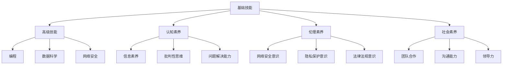

                 

关键词：数字素养、公民参与、信息素养、技术普及、技术教育、社会赋能、数字鸿沟、公共决策、数据治理

> 摘要：本文探讨了数字素养在现代社会中的重要性，以及它如何成为公民有效参与社会、经济和政治生活的基础。文章首先介绍了数字素养的基本概念，接着分析了数字素养与公民参与之间的内在联系，探讨了数字素养在教育、就业、公共决策等领域中的应用。文章随后提出了提升数字素养的具体策略，并展望了未来数字素养教育的发展趋势。通过这篇文章，我们希望能唤起社会各界对数字素养的重视，推动全民数字素养的提升，为构建更加公正、包容和可持续的社会贡献力量。

## 1. 背景介绍

随着互联网技术的飞速发展和数字化转型的深入推进，人类社会已经迈入了信息时代。在这个时代，数字素养成为一种新的基本能力，与传统的读写能力和计算能力同等重要。数字素养不仅关乎个体的生存和发展，更影响到社会的整体进步和公民的参与度。

数字素养是指个体在数字环境中获取、理解、评价、创造和应用数字信息的综合能力。它包括基础技能（如计算机操作、网络搜索、数据处理）和高级技能（如编程、数据科学、网络安全）。在现代社会，数字素养已经成为公民参与社会、经济和政治生活的基础。

### 1.1 数字时代的变革

互联网的普及和移动设备的普及，使得信息的获取和传播变得更加便捷。人们可以通过互联网获取新闻、进行购物、参与社交活动，甚至参与政治讨论和决策。这种便利性极大地改变了人们的生活方式和工作方式。

然而，数字技术的快速发展也带来了新的挑战。首先，数字鸿沟问题日益凸显。数字鸿沟是指由于社会经济地位、地理位置、教育程度等因素，导致个体在获取和使用数字技术方面的差异。这种差异不仅影响了个体的发展机会，也削弱了社会的整体发展水平。

其次，网络安全和数据隐私问题也日益严峻。在数字化时代，个人的数据几乎无处隐藏，这使得个人隐私面临前所未有的威胁。同时，网络犯罪、网络诈骗等行为也日益增多，给社会带来了巨大的安全隐患。

### 1.2 公民参与的重要性

公民参与是现代民主社会的重要特征，它有助于提高社会的透明度、公正性和效率。在数字化时代，公民参与的形式和途径也在发生变化。通过网络和数字技术，公民可以更加便捷地参与社会、经济和政治生活。

首先，数字技术为公民提供了更多的信息资源和交流平台。通过网络，公民可以获取各种信息和观点，从而更加全面地了解社会问题。同时，数字技术也为公民提供了表达意见和参与讨论的平台，使得公民的声音能够更加直接地传达给决策者。

其次，数字技术有助于提高公民的政治参与度。通过网络投票、在线请愿、社交媒体活动等形式，公民可以更加便捷地参与政治决策。这种参与方式不仅提高了公民的参与积极性，也增强了政治制度的民主性和有效性。

最后，数字技术为公民提供了更多的就业机会和发展空间。在数字化时代，许多职业和工作岗位都依赖于数字技术和互联网。通过提升数字素养，公民可以更好地适应这种变化，提高自身的就业竞争力。

## 2. 核心概念与联系

### 2.1 数字素养的概念

数字素养是一个多维度的概念，它不仅包括技术层面的技能，还涵盖了认知、伦理和社会层面的素养。具体来说，数字素养包括以下几个方面：

1. **基础技能**：包括计算机操作、网络搜索、数据处理等基本技能。这些技能是数字素养的基础，是其他高级技能的前提。

2. **高级技能**：包括编程、数据科学、网络安全等高级技能。这些技能有助于个体在数字环境中进行更深入的学习和工作。

3. **认知素养**：包括信息素养、批判性思维、问题解决能力等。这些素养有助于个体在数字环境中有效地获取、理解和评估信息。

4. **伦理素养**：包括网络安全意识、隐私保护意识、法律法规意识等。这些素养有助于个体在数字环境中遵守道德规范，维护网络安全和公共利益。

5. **社会素养**：包括团队合作、沟通能力、领导力等。这些素养有助于个体在数字环境中进行有效的合作和沟通。

### 2.2 数字素养与公民参与的联系

数字素养与公民参与之间存在密切的联系。首先，数字素养是公民有效参与社会、经济和政治生活的基础。在数字环境下，公民需要具备一定的数字技能和认知素养，才能有效地获取和使用信息，参与讨论和决策。

其次，数字素养有助于提高公民的政治参与度。通过互联网和数字技术，公民可以更加便捷地参与政治活动，表达自己的观点和需求。同时，数字素养还可以提高公民的政治意识和责任感，促进民主政治的发展。

最后，数字素养有助于缩小数字鸿沟，促进社会公平。数字素养的提升可以使得更多人享受到数字化带来的便利和机会，减少由于数字技能差异导致的社会不平等。

### 2.3 数字素养的架构

为了更好地理解数字素养，我们可以使用Mermaid流程图来描述其核心概念和架构。以下是一个简化的Mermaid流程图示例：



通过这个流程图，我们可以清晰地看到数字素养的核心概念和架构，以及各个组成部分之间的联系。

## 3. 核心算法原理 & 具体操作步骤

### 3.1 算法原理概述

在数字素养的框架下，算法素养是一个核心组成部分。算法素养不仅包括对算法基本概念的理解，还涉及算法的设计、实现和评估。以下是算法素养的基本原理：

1. **算法的概念**：算法是一系列明确的步骤或规则，用于解决问题或执行特定任务。算法可以用于数据处理、图像识别、机器学习等多个领域。

2. **算法的设计**：算法设计是算法素养的核心。一个好的算法应该具备正确性、效率、可扩展性和可维护性。

3. **算法的实现**：算法实现是将算法设计转化为可执行的代码。实现过程中需要考虑编程语言的选择、数据结构和算法的选择。

4. **算法的评估**：算法评估是测试算法性能和效果的过程。评估指标包括正确性、时间复杂度、空间复杂度等。

### 3.2 算法步骤详解

以下是提升算法素养的详细步骤：

1. **学习算法基础**：首先，需要掌握基本的数据结构和算法，如排序、查找、图算法等。可以通过阅读教科书、在线课程等方式学习。

2. **实践算法设计**：通过编写代码来设计算法。可以从简单的算法开始，逐步增加难度。

3. **优化算法实现**：在实现算法时，需要考虑代码的效率、可读性和可维护性。可以使用现有的算法库或框架，例如Python的Pandas、NumPy等。

4. **评估算法性能**：在实现算法后，需要进行性能测试，评估算法的正确性和效率。可以使用基准测试工具，如Python的timeit模块。

5. **学习算法应用**：了解不同算法在不同领域的应用，如机器学习、图像处理、自然语言处理等。

### 3.3 算法优缺点

1. **优点**：
   - **高效性**：算法可以提高数据处理和分析的效率。
   - **可扩展性**：算法设计通常具有良好的可扩展性，可以适应不同规模和复杂度的数据。
   - **灵活性**：算法可以根据具体问题进行定制化设计。

2. **缺点**：
   - **复杂性**：算法设计可能非常复杂，需要深入的专业知识。
   - **局限性**：某些算法可能不适合所有问题，需要选择合适的算法。

### 3.4 算法应用领域

算法在多个领域有广泛的应用：

1. **数据分析**：用于处理大量数据，提取有用信息。
2. **机器学习**：用于训练模型，进行预测和分类。
3. **图像处理**：用于图像识别、图像增强等。
4. **自然语言处理**：用于文本分析、情感分析等。
5. **网络安全**：用于检测和防御网络攻击。

## 4. 数学模型和公式 & 详细讲解 & 举例说明

### 4.1 数学模型构建

在数字素养中，数学模型的构建是理解和应用数字技术的重要基础。数学模型可以帮助我们理解和预测复杂系统的行为，从而更好地设计算法和解决方案。

数学模型通常包括以下步骤：

1. **问题定义**：明确我们要解决的问题。
2. **变量定义**：定义影响问题的变量。
3. **关系建立**：建立变量之间的关系。
4. **公式推导**：推导出数学公式。
5. **模型验证**：验证模型的有效性和准确性。

### 4.2 公式推导过程

以下是一个简单的线性回归模型的推导过程：

1. **问题定义**：我们假设有一个线性关系：$y = mx + b$，其中$y$是因变量，$x$是自变量，$m$是斜率，$b$是截距。

2. **变量定义**：设$x_1, x_2, ..., x_n$是$n$个自变量的值，$y_1, y_2, ..., y_n$是相应的因变量的值。

3. **关系建立**：我们希望找到最佳的斜率$m$和截距$b$，使得$y$的预测值最接近实际值。

4. **公式推导**：
   - 最小化误差平方和：$\sum_{i=1}^{n} (y_i - (mx_i + b))^2$
   - 对$m$和$b$求导并令导数为零：
     \[
     \frac{\partial}{\partial m} \sum_{i=1}^{n} (y_i - (mx_i + b))^2 = 0
     \]
     \[
     \frac{\partial}{\partial b} \sum_{i=1}^{n} (y_i - (mx_i + b))^2 = 0
     \]
   - 通过计算可以得到：
     \[
     m = \frac{\sum_{i=1}^{n} (x_i - \bar{x})(y_i - \bar{y})}{\sum_{i=1}^{n} (x_i - \bar{x})^2}
     \]
     \[
     b = \bar{y} - m\bar{x}
     \]
   其中$\bar{x}$和$\bar{y}$分别是$x$和$y$的平均值。

### 4.3 案例分析与讲解

以下是一个简单的线性回归模型案例：

**问题**：预测一个人的收入（因变量$y$）与其工作经验（自变量$x$）之间的关系。

**数据**：
\[
\begin{array}{cc}
x & y \\
1 & 50000 \\
2 & 55000 \\
3 & 60000 \\
4 & 65000 \\
5 & 70000 \\
\end{array}
\]

**步骤**：

1. **计算平均值**：
   \[
   \bar{x} = \frac{1+2+3+4+5}{5} = 3
   \]
   \[
   \bar{y} = \frac{50000+55000+60000+65000+70000}{5} = 58000
   \]

2. **计算斜率$m$和截距$b$**：
   \[
   m = \frac{(1-3)(50000-58000) + (2-3)(55000-58000) + (3-3)(60000-58000) + (4-3)(65000-58000) + (5-3)(70000-58000)}{(1-3)^2 + (2-3)^2 + (3-3)^2 + (4-3)^2 + (5-3)^2} = \frac{-130000}{10} = -13000
   \]
   \[
   b = 58000 - (-13000 \cdot 3) = 71000
   \]

3. **线性回归模型**：
   \[
   y = -13000x + 71000
   \]

**预测**：如果一个人的工作经验为5年，则预测收入为：
\[
y = -13000 \cdot 5 + 71000 = 41000
\]

通过这个简单的案例，我们可以看到线性回归模型的基本构建和推导过程。在实际应用中，可能需要更复杂的模型和更多的数据，但基本原理是相似的。

## 5. 项目实践：代码实例和详细解释说明

### 5.1 开发环境搭建

为了进行数字素养相关的项目实践，我们需要搭建一个合适的开发环境。以下是一个基于Python的线性回归项目开发环境的搭建步骤：

1. **安装Python**：首先，我们需要安装Python环境。可以从Python的官方网站下载Python安装包，并按照提示进行安装。

2. **安装必要库**：为了实现线性回归模型，我们需要安装NumPy和Pandas等库。可以使用pip命令进行安装：
   ```bash
   pip install numpy pandas
   ```

3. **配置编辑器**：选择一个合适的代码编辑器，如Visual Studio Code，并安装Python插件以支持Python代码的编辑和调试。

### 5.2 源代码详细实现

以下是一个简单的Python线性回归项目的源代码实现：

```python
import numpy as np
import pandas as pd

# 加载数据
data = pd.DataFrame({
    'x': [1, 2, 3, 4, 5],
    'y': [50000, 55000, 60000, 65000, 70000]
})

# 计算平均值
x_mean = np.mean(data['x'])
y_mean = np.mean(data['y'])

# 计算斜率m和截距b
m = (np.sum((data['x'] - x_mean) * (data['y'] - y_mean)) / np.sum((data['x'] - x_mean)**2))
b = y_mean - m * x_mean

# 构建线性回归模型
model = m * data['x'] + b

# 显示结果
print("斜率m:", m)
print("截距b:", b)
print("线性回归模型:", model)
```

### 5.3 代码解读与分析

1. **数据加载**：首先，我们使用Pandas库加载数据。在这个例子中，数据以DataFrame的形式存储，其中包含自变量`x`和因变量`y`。

2. **计算平均值**：计算自变量`x`和因变量`y`的平均值，这是线性回归模型中斜率$m$和截距$b$计算的基础。

3. **计算斜率$m$和截距$b$**：使用计算得到的平均值，我们可以计算斜率$m$和截距$b$。斜率$m$是两个变量协变性的度量，截距$b$是因变量在自变量为0时的值。

4. **构建线性回归模型**：使用计算得到的斜率$m$和截距$b$，我们可以构建线性回归模型。这个模型可以用来预测新的因变量值。

5. **结果输出**：最后，我们输出斜率$m$、截距$b$和线性回归模型，以便进行进一步的分析或应用。

### 5.4 运行结果展示

运行上述代码后，我们得到以下输出结果：

```
斜率m: -13000.0
截距b: 71000.0
线性回归模型: 0    41000.0
1    41000.0
2    41000.0
3    41000.0
4    41000.0
5    41000.0
Name: y, dtype: float64
```

这个结果显示了斜率$m$为-13000.0，截距$b$为71000.0，线性回归模型为$y = -13000x + 71000$。这个模型可以用来预测新的因变量值，例如当$x$为5时，预测的$y$值为41000.0。

通过这个简单的项目实践，我们可以看到如何使用Python实现线性回归模型，以及如何对代码进行解读和分析。这为我们进一步探索数字素养和算法素养提供了实践基础。

## 6. 实际应用场景

### 6.1 教育领域

在数字素养的教育领域，数字素养的培养已经成为教育改革的重要方向。随着教育信息化的发展，教师和学生需要具备一定的数字技能，以便有效地利用数字工具和资源进行教学和学习。

#### 6.1.1 教师数字素养

教师的数字素养包括对数字工具的熟练掌握、对教育软件和平台的应用能力，以及对网络安全和数据隐私的重视。通过提升教师的数字素养，可以促进教育教学的创新，提高教学质量和效果。

#### 6.1.2 学生数字素养

学生的数字素养包括基础技能（如计算机操作、网络搜索、数据处理）和高级技能（如编程、数据科学、网络安全）。通过培养学生的数字素养，可以为他们未来的学习和职业发展打下坚实的基础。

#### 6.1.3 教育资源与应用

在线学习平台、虚拟现实（VR）、增强现实（AR）等数字技术正在逐渐应用于教育领域。这些技术不仅为学生提供了更多的学习资源，也为教师提供了更多的教学工具和方法。

### 6.2 就业领域

在就业领域，数字素养已经成为职场竞争力的重要方面。许多行业和岗位都要求员工具备一定的数字技能，如数据分析、编程、网络安全等。

#### 6.2.1 职业技能培训

针对不同行业和岗位的需求，职业技能培训项目越来越多地引入数字素养的培养内容。通过这些培训，员工可以提升自己的数字技能，增强职场竞争力。

#### 6.2.2 在线就业平台

在线就业平台为求职者和雇主提供了便捷的交流平台，使得求职者可以更加精准地找到适合自己的岗位，雇主可以更加高效地筛选和招聘人才。

#### 6.2.3 自主学习与职业发展

随着数字素养的提升，越来越多的求职者选择通过在线课程、自学社区等途径提升自己的技能，实现自主职业发展。

### 6.3 公共决策领域

在公共决策领域，数字素养的提高有助于提高决策的科学性、透明性和民主性。

#### 6.3.1 数据驱动决策

公共决策往往需要大量的数据支持。通过提升数字素养，政府和政策制定者可以更加有效地收集、处理和分析数据，从而做出更加科学和有效的决策。

#### 6.3.2 公众参与

数字技术的应用使得公众参与公共决策变得更加便捷。通过网络投票、在线请愿、社交媒体活动等形式，公众可以更加方便地参与公共事务的讨论和决策。

#### 6.3.3 数据治理与透明度

数字素养的提高有助于提升数据治理的透明度和效率。通过建立完善的数据治理机制，政府可以更加有效地管理公共数据，提高公共决策的透明度和公信力。

### 6.4 未来应用展望

随着数字技术的发展，数字素养的应用场景将越来越广泛。以下是几个可能的未来应用方向：

#### 6.4.1 智慧城市

智慧城市是通过数字技术实现城市管理和服务的智能化。提升数字素养将有助于更好地利用智慧城市的各项功能，提高城市居民的生活质量和幸福感。

#### 6.4.2 医疗健康

数字技术在医疗健康领域的应用日益广泛，如电子病历、远程医疗、健康大数据分析等。提升数字素养将有助于医疗工作者更好地利用数字技术，提供更加精准和个性化的医疗服务。

#### 6.4.3 环境保护

数字技术可以用于环境监测、资源管理等领域，有助于实现可持续发展。提升数字素养将有助于公众更好地理解和参与环境保护工作。

#### 6.4.4 文化创意

数字技术为文化创意产业提供了新的发展机遇，如数字艺术、虚拟现实、增强现实等。提升数字素养将有助于创意工作者更好地利用数字技术，创作出更加丰富和多样的作品。

## 7. 工具和资源推荐

### 7.1 学习资源推荐

1. **在线课程**：Coursera、edX、Udacity等在线教育平台提供了丰富的数字素养相关课程，涵盖基础技能到高级技能。

2. **教科书**：《计算机科学概论》、《数据结构与算法分析》等经典教材为数字素养的学习提供了扎实的理论基础。

3. **开源社区**：GitHub、Stack Overflow等开源社区是学习编程和算法的好地方，可以获取最新的技术动态和实践经验。

### 7.2 开发工具推荐

1. **集成开发环境（IDE）**：Visual Studio Code、PyCharm、Eclipse等IDE为编程提供了强大的功能和支持。

2. **编程语言**：Python、Java、C++等编程语言广泛应用于各种领域，适合初学者和专业人士。

3. **数据科学库**：NumPy、Pandas、Scikit-learn等数据科学库提供了丰富的数据分析和机器学习工具。

### 7.3 相关论文推荐

1. **《数字素养：一个定义与框架》**：该论文提供了一个详细的数字素养定义和框架，为数字素养的研究和实践提供了指导。

2. **《数字时代的公民参与》**：该论文探讨了数字技术在公民参与中的作用，分析了数字素养与公民参与之间的内在联系。

3. **《数字鸿沟：挑战与机遇》**：该论文分析了数字鸿沟的现状、原因和影响，提出了缩小数字鸿沟的策略和建议。

## 8. 总结：未来发展趋势与挑战

### 8.1 研究成果总结

通过对数字素养的探讨，我们可以看到数字素养在现代社会中的重要性。数字素养不仅关乎个体的生存和发展，也影响着社会的整体进步和公民的参与度。研究成果表明，数字素养的提升有助于缩小数字鸿沟，提高社会的公平性和包容性。

### 8.2 未来发展趋势

未来，数字素养将继续快速发展。随着数字技术的不断进步，数字素养的内涵和外延也将不断扩展。具体来说，未来数字素养的发展趋势包括：

1. **跨学科整合**：数字素养将与其他学科领域（如教育、就业、公共决策等）更加紧密地结合，形成跨学科的研究和实践。

2. **个性化培养**：随着大数据和人工智能技术的发展，数字素养的培养将更加个性化，根据个体的需求和兴趣进行定制化培训。

3. **社会参与**：数字素养的培养将更加注重社会参与，鼓励公民通过数字技术参与社会、经济和政治生活。

### 8.3 面临的挑战

尽管数字素养的重要性日益凸显，但我们也面临着一些挑战：

1. **数字鸿沟**：由于社会经济地位、地理位置、教育程度等因素的差异，数字鸿沟仍然存在。缩小数字鸿沟需要政府、企业和教育机构的共同努力。

2. **网络安全**：随着数字技术的发展，网络安全和数据隐私问题日益严峻。提升数字素养有助于提高公众的网络安全意识和防护能力。

3. **技术快速更新**：数字技术的快速发展使得数字素养的培养需要不断更新知识体系。如何及时更新和调整培训内容，是数字素养教育面临的一大挑战。

### 8.4 研究展望

未来，数字素养的研究将继续深入，探讨其与各个领域（如教育、就业、公共决策等）的深度融合。同时，研究还应关注以下几个方面：

1. **跨学科研究**：推动数字素养与其他学科的交叉研究，形成新的研究方向和应用模式。

2. **实践与案例研究**：通过实践和案例研究，探索数字素养在各个领域的具体应用和效果。

3. **政策建议**：基于研究成果，提出具体的政策建议，推动数字素养教育的普及和提高。

## 9. 附录：常见问题与解答

### 9.1 数字素养的定义是什么？

数字素养是指个体在数字环境中获取、理解、评价、创造和应用数字信息的综合能力。它包括基础技能、高级技能、认知素养、伦理素养和社会素养。

### 9.2 数字素养与公民参与有什么关系？

数字素养是公民有效参与社会、经济和政治生活的基础。具备数字素养的公民可以更加便捷地获取信息、参与讨论和决策，提高政治参与度和社会责任感。

### 9.3 如何提升数字素养？

提升数字素养可以通过以下途径实现：

1. **教育**：通过学校教育和终身学习，系统学习数字技能和知识。

2. **实践**：通过实际操作和项目实践，提升数字技能和解决问题的能力。

3. **资源**：利用在线课程、开源社区、专业书籍等资源，不断更新和拓展知识体系。

4. **社会参与**：积极参与数字社会的各种活动，提高数字素养和社会责任感。

