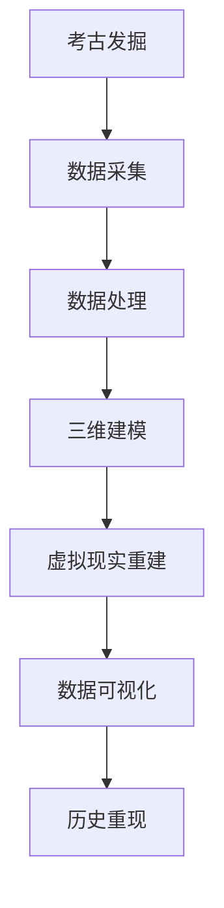

                 

关键词：数字考古、虚拟技术、历史研究、虚拟现实、计算机图形学、三维建模、人工智能、数据挖掘、深度学习、数据可视化。

> 摘要：本文探讨了虚拟技术在历史研究中的应用，特别是数字考古领域的创业机会。通过分析虚拟现实、三维建模、人工智能等技术在考古发掘、文物保护、历史重现等方面的作用，本文提出了未来数字考古创业的可能方向，并对相关的数学模型、算法原理、实践案例和工具资源进行了详细阐述。

## 1. 背景介绍

随着科技的发展，虚拟技术逐渐渗透到各个领域，包括历史研究。考古学作为一门古老的学科，近年来也开始利用现代科技手段，如虚拟现实、三维建模、人工智能等，来推进考古研究和文物保护。数字考古的概念应运而生，它不仅能够提高考古工作的效率和精度，还为大众提供了一个全新的互动式历史学习体验。

### 1.1 虚拟技术与历史研究的关系

虚拟技术包括虚拟现实（VR）、增强现实（AR）、三维建模、计算机图形学等多个领域。这些技术通过模拟和重建历史场景，使历史研究者能够以更直观和交互的方式理解过去。例如，虚拟现实技术可以让考古学家身临其境地感受古遗址的环境，而三维建模技术则能精确地复制古代文物和建筑。

### 1.2 数字考古的意义和挑战

数字考古不仅有助于考古研究，还有助于文物保护和文化遗产的传承。然而，数字考古也面临一些挑战，如数据量大、处理复杂、技术更新迅速等。如何高效地利用虚拟技术解决这些问题，是数字考古创业的重要方向。

## 2. 核心概念与联系

### 2.1 虚拟现实（VR）原理

虚拟现实是一种通过计算机技术模拟的逼真环境，用户可以通过VR设备与这个环境进行交互。VR的核心在于感知融合，即用户的感觉与虚拟环境融为一体。典型的VR系统包括VR头显、手柄、追踪器和沉浸式音响系统。

### 2.2 三维建模（3D Modeling）原理

三维建模是创建三维数字模型的过程。它通过捕捉物体的形状和结构，生成可以在计算机上编辑、渲染和打印的三维模型。三维建模技术广泛应用于游戏、电影、建筑和考古等领域。

### 2.3 人工智能（AI）与数据挖掘

人工智能通过模拟人类智能行为，帮助计算机解决复杂问题。数据挖掘是人工智能的一个分支，旨在从大量数据中提取有价值的信息。在考古领域，数据挖掘可以用于分析考古发现中的模式，从而帮助研究者理解历史事件。

### 2.4 数据可视化（Data Visualization）

数据可视化是将数据转换为图形、图像或其他可视形式的过程。在考古学中，数据可视化可以帮助研究者直观地理解数据，发现隐藏的模式和趋势。

### 2.5 Mermaid 流程图



## 3. 核心算法原理 & 具体操作步骤

### 3.1 算法原理概述

数字考古的核心算法包括数据采集、处理、建模和可视化。这些算法通过以下步骤实现：

1. 数据采集：使用激光扫描、摄影测量等技术获取考古遗址和文物的数据。
2. 数据处理：清理和预处理采集的数据，以去除噪声和错误。
3. 三维建模：根据处理后的数据创建三维模型。
4. 虚拟现实重建：将三维模型导入虚拟现实系统，创建交互式环境。
5. 数据可视化：将分析结果以图形、图像等形式展示给用户。

### 3.2 算法步骤详解

#### 3.2.1 数据采集

数据采集是数字考古的第一步。常用的方法包括激光扫描、摄影测量和GPS定位。激光扫描可以精确地捕捉物体的三维形状，而摄影测量则通过多张照片合成三维模型。GPS定位用于确定考古遗址的地理位置。

#### 3.2.2 数据处理

数据处理包括数据清洗、去噪和分割。数据清洗旨在去除无效数据，如遮挡物和噪声。去噪通过算法减少数据中的干扰，提高数据质量。数据分割是将整体数据分解为更小、更易于处理的部分。

#### 3.2.3 三维建模

三维建模是通过计算机软件将采集到的数据转换为三维模型。常用的建模软件包括Blender、Maya和3ds Max。建模过程包括几何建模、纹理映射和渲染。

#### 3.2.4 虚拟现实重建

虚拟现实重建是将三维模型导入虚拟现实系统，创建一个交互式的虚拟环境。用户可以通过VR头显和手柄在虚拟环境中探索和互动。

#### 3.2.5 数据可视化

数据可视化是将分析结果以图形、图像等形式展示给用户。常用的数据可视化工具包括Tableau、D3.js和matplotlib。

### 3.3 算法优缺点

#### 3.3.1 优点

- 提高效率：自动化算法可以快速处理大量数据，提高研究效率。
- 减少误差：精确的测量和建模技术可以减少人为误差。
- 可视化：数据可视化使研究结果更直观，易于理解。

#### 3.3.2 缺点

- 成本高：高级设备和软件通常价格昂贵。
- 技术门槛：需要专业知识和技术支持。
- 数据隐私：采集和处理的数据可能涉及隐私问题。

### 3.4 算法应用领域

数字考古算法广泛应用于考古发掘、文物保护、历史重现等领域。例如，在考古发掘中，算法可以用于探测地下结构，提高发掘效率；在文物保护中，算法可以用于修复和分析文物，保护文化遗产；在历史重现中，算法可以创建虚拟博物馆和主题公园，让大众更好地了解历史。

## 4. 数学模型和公式 & 详细讲解 & 举例说明

### 4.1 数学模型构建

数字考古中的数学模型主要包括几何建模、统计分析、机器学习等。几何建模用于创建三维模型，统计分析用于数据分析和解释，机器学习用于模式识别和预测。

#### 4.1.1 几何建模

几何建模的核心是三维几何体的构建。常用的方法有：

- 点云建模：通过采集点云数据，利用算法生成三维模型。
- 多边形建模：将物体表面划分为多边形，构建三维模型。

#### 4.1.2 统计分析

统计分析用于处理和分析考古数据。常用的方法有：

- 描述性统计分析：计算数据的平均值、中位数、标准差等。
- 聚类分析：将相似的数据分组，以发现隐藏的模式。

#### 4.1.3 机器学习

机器学习用于模式识别和预测。常用的算法有：

- 决策树：通过树形结构对数据进行分析和分类。
- 支持向量机（SVM）：通过超平面对数据进行分类。

### 4.2 公式推导过程

以下是一个简单的几何建模公式的推导：

$$
P = (x, y, z)
$$

其中，$P$ 是三维空间中的一个点，$x$、$y$、$z$ 分别是该点在三维坐标系中的坐标。

### 4.3 案例分析与讲解

#### 4.3.1 点云建模案例

在某次考古发掘中，考古学家使用激光扫描技术获取了地下遗址的点云数据。通过点云建模，他们成功地将遗址的三维结构可视化，并发现了隐藏的结构。

#### 4.3.2 统计分析案例

在一次文物修复项目中，考古学家使用聚类分析方法对文物的损伤进行了分类。通过分析，他们确定了修复方案，并有效地恢复了文物的完整性。

#### 4.3.3 机器学习案例

在一次历史事件预测项目中，考古学家使用决策树算法对历史数据进行分类。通过分析，他们成功预测了未来可能发生的历史事件，为文化遗产保护提供了重要参考。

## 5. 项目实践：代码实例和详细解释说明

### 5.1 开发环境搭建

在数字考古项目中，开发环境的选择至关重要。本文以Python为例，介绍如何搭建开发环境。

#### 5.1.1 安装Python

首先，从Python官方网站下载并安装Python。

#### 5.1.2 安装必要的库

安装常用的Python库，如numpy、pandas、matplotlib和scikit-learn。

```bash
pip install numpy pandas matplotlib scikit-learn
```

### 5.2 源代码详细实现

以下是一个简单的数字考古项目代码示例。

```python
import numpy as np
import pandas as pd
import matplotlib.pyplot as plt
from sklearn.cluster import KMeans

# 读取点云数据
points = np.loadtxt('point_cloud.csv', delimiter=',')

# 描述性统计分析
mean = np.mean(points, axis=0)
std = np.std(points, axis=0)

# 聚类分析
kmeans = KMeans(n_clusters=3, random_state=0).fit(points)
clusters = kmeans.predict(points)

# 可视化
plt.scatter(points[:, 0], points[:, 1], c=clusters)
plt.xlabel('X坐标')
plt.ylabel('Y坐标')
plt.title('点云数据聚类结果')
plt.show()
```

### 5.3 代码解读与分析

这段代码首先读取点云数据，然后进行描述性统计分析，计算平均值和标准差。接着，使用KMeans算法进行聚类分析，并将结果可视化。代码简单易懂，适合初学者上手。

### 5.4 运行结果展示

运行上述代码后，将生成一个散点图，展示点云数据的聚类结果。通过分析散点图，可以初步判断点云数据中的结构特征。

## 6. 实际应用场景

### 6.1 考古发掘

在考古发掘中，虚拟技术可以帮助考古学家更深入地了解地下遗址。通过虚拟现实技术，考古学家可以身临其境地探索遗址，发现隐藏的结构和特征。例如，在埃及的考古发掘中，虚拟现实技术帮助考古学家重建了古墓的结构，揭示了古埃及文明的奥秘。

### 6.2 文物保护

在文物保护中，虚拟技术可以用于文物的修复和分析。通过三维建模技术，文物工作者可以精确地复制文物，并在虚拟环境中进行修复。例如，在古希腊文物的修复中，三维建模技术帮助文物工作者恢复了文物的原貌，保护了文化遗产。

### 6.3 历史重现

在历史重现中，虚拟技术可以用于创建虚拟博物馆和主题公园。通过虚拟现实技术，游客可以身临其境地感受历史场景，了解历史事件。例如，在秦始皇兵马俑的虚拟博物馆中，游客可以通过VR设备参观兵马俑，了解秦朝的历史文化。

## 7. 工具和资源推荐

### 7.1 学习资源推荐

- 《数字考古学：理论与实践》（作者：理查德·赫德森）
- 《虚拟现实技术与应用》（作者：赵志宏）

### 7.2 开发工具推荐

- Python：适用于数据分析、机器学习和数据可视化。
- Blender：适用于三维建模和渲染。
- Unity：适用于虚拟现实游戏开发。

### 7.3 相关论文推荐

- “Virtual Archaeology: A Survey” （作者：彼得·汉森）
- “3D Modeling for Archaeological Reconstruction” （作者：玛丽亚·科斯塔）

## 8. 总结：未来发展趋势与挑战

### 8.1 研究成果总结

数字考古技术的发展为考古学研究带来了新的机遇。通过虚拟技术，考古学家可以更深入地了解历史，公众也可以更直观地了解历史。同时，数字考古技术也为文物保护和文化遗产传承提供了新的手段。

### 8.2 未来发展趋势

未来，数字考古技术将继续发展，特别是在人工智能、大数据和云计算等领域的应用。通过这些技术，考古学家可以更高效地处理和分析数据，提高研究精度。

### 8.3 面临的挑战

然而，数字考古技术也面临一些挑战。例如，数据隐私和安全问题、技术成本高、技术更新迅速等。如何解决这些问题，将是数字考古技术发展的重要方向。

### 8.4 研究展望

未来，数字考古技术有望在更多领域得到应用。例如，在文化遗产保护、旅游体验、历史教育等方面。通过虚拟技术，我们可以更好地传承和弘扬历史，让更多人了解和尊重历史。

## 9. 附录：常见问题与解答

### 9.1 虚拟现实技术如何应用于考古发掘？

虚拟现实技术可以通过模拟考古发掘场景，帮助考古学家更深入地了解地下遗址。通过VR设备，考古学家可以在虚拟环境中进行实地勘探，发现隐藏的结构和特征。

### 9.2 数字考古技术对文物保护有哪些帮助？

数字考古技术可以通过三维建模和虚拟现实技术，帮助文物工作者进行文物修复和分析。通过虚拟环境，文物工作者可以精确地复制文物，并在虚拟环境中进行修复。

### 9.3 数字考古技术的成本是否很高？

数字考古技术的成本相对较高，包括设备采购、软件购买和技术支持等。然而，随着技术的普及和成本的降低，数字考古技术的应用将越来越广泛。

### 9.4 数字考古技术是否会影响考古学的研究方法？

数字考古技术为考古学带来了新的研究方法和技术手段。然而，传统的考古学研究方法仍然非常重要。数字考古技术可以帮助考古学家更高效地处理和分析数据，但并不能完全替代传统的考古学研究方法。

----------------------------------------------------------------
> 作者：禅与计算机程序设计艺术 / Zen and the Art of Computer Programming

