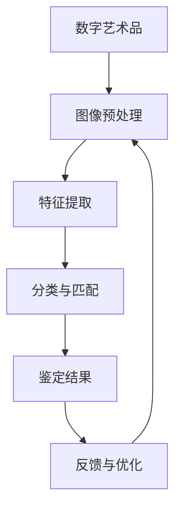

                 

关键词：数字艺术品，AI鉴定，机器学习，图像识别，人工智能，深度学习，数据分析，技术博客，应用实践。

> 摘要：本文将深入探讨数字艺术品AI鉴定系统的原理、构建和应用。通过介绍核心算法、数学模型和项目实践，本文旨在为读者提供一个全面的技术视角，揭示AI技术在数字艺术品鉴定领域的潜力与挑战。

## 1. 背景介绍

数字艺术品的兴起，不仅改变了传统艺术品的生产和传播方式，也为艺术品鉴定带来了新的挑战。随着技术的发展，AI特别是深度学习在图像识别、自然语言处理等领域的突破，使得数字艺术品鉴定成为一种可能。AI鉴定系统能够快速、准确地分析艺术品特征，为鉴定专家提供有力支持，同时也提高了鉴定的效率和质量。

本文将围绕数字艺术品AI鉴定系统展开，首先介绍其核心概念和联系，随后深入探讨核心算法原理、数学模型及具体应用案例，最后讨论未来发展方向和面临的挑战。

## 2. 核心概念与联系

### 2.1. 数字艺术品

数字艺术品是指通过数字技术创作的艺术品，包括数字绘画、数字雕塑、数字摄影、数字动画等多种形式。这些作品具有独特的数字特征，如高分辨率、可编辑性、交互性等。

### 2.2. AI鉴定

AI鉴定是指利用人工智能技术，尤其是机器学习和深度学习算法，对数字艺术品进行鉴定。它包括图像识别、特征提取、分类与匹配等步骤。

### 2.3. 关系图

以下是数字艺术品AI鉴定系统的Mermaid流程图，展示了各个核心组件及其相互关系。



### 2.4. 关键技术

- **图像预处理**：对原始图像进行去噪、增强、尺寸调整等处理，以提高后续特征提取的准确性。
- **特征提取**：通过卷积神经网络（CNN）等方法提取图像的深层次特征，这些特征能够有效区分不同艺术品。
- **分类与匹配**：利用支持向量机（SVM）、深度神经网络（DNN）等分类算法，将提取的特征与已知艺术品进行匹配，从而实现鉴定。
- **反馈与优化**：通过收集鉴定结果与实际鉴定的比对反馈，不断优化系统，提高准确性。

## 3. 核心算法原理 & 具体操作步骤

### 3.1. 算法原理概述

数字艺术品AI鉴定系统主要依赖于深度学习算法，特别是卷积神经网络（CNN）。CNN能够自动从图像中提取层次化的特征，从而实现高精度的图像识别和分类。

### 3.2. 算法步骤详解

#### 3.2.1. 数据准备

- **数据采集**：收集大量的数字艺术品图像，包括不同风格、不同时期和不同作者的作品。
- **数据预处理**：对图像进行去噪、增强、裁剪等处理，以适应CNN的训练需求。

#### 3.2.2. 模型构建

- **网络结构**：构建卷积神经网络，包括卷积层、池化层、全连接层等。
- **损失函数**：使用交叉熵损失函数来衡量预测标签和实际标签之间的差异。

#### 3.2.3. 训练过程

- **前向传播**：输入图像，通过网络计算得到预测结果。
- **反向传播**：计算损失函数的梯度，更新网络参数。
- **迭代优化**：通过多次迭代，逐步提高网络预测的准确性。

#### 3.2.4. 评估与优化

- **模型评估**：使用验证集评估模型的准确性、召回率、F1分数等指标。
- **超参数调优**：根据评估结果调整网络的超参数，如学习率、批次大小等。

### 3.3. 算法优缺点

#### 优点

- **高精度**：深度学习算法能够自动提取图像的深层次特征，提高鉴定的准确性。
- **高效性**：相对于传统的人工鉴定方法，AI鉴定系统能够快速处理大量图像，提高工作效率。

#### 缺点

- **计算资源需求**：深度学习算法需要大量的计算资源，训练时间较长。
- **数据依赖**：模型的质量依赖于数据的质量和数量，数据不足或质量差可能影响鉴定结果。

### 3.4. 算法应用领域

- **艺术品鉴定**：用于鉴定数字艺术品的真实性、风格和作者。
- **文物保护**：通过分析数字艺术品的历史痕迹，为文物保护提供技术支持。
- **艺术创作**：AI鉴定系统可以辅助艺术家进行创作，提供风格和技巧的参考。

## 4. 数学模型和公式 & 详细讲解 & 举例说明

### 4.1. 数学模型构建

在数字艺术品AI鉴定系统中，常用的数学模型是卷积神经网络（CNN）。CNN的数学基础主要包括线性代数、微积分和概率统计。

#### 4.1.1. 线性代数

- **矩阵运算**：CNN中的卷积层、池化层等操作都涉及矩阵运算，如矩阵乘法、卷积等。
- **向量化**：将图像数据转换为向量，以便在神经网络中进行处理。

#### 4.1.2. 微积分

- **梯度下降**：用于优化网络参数，通过计算损失函数关于参数的梯度，更新参数。
- **反向传播**：计算损失函数关于输入数据的梯度，用于调整网络权重。

#### 4.1.3. 概率统计

- **概率分布**：用于表示图像的像素值，如高斯分布、伯努利分布等。
- **最大似然估计**：用于训练神经网络，通过最大化似然函数来估计模型参数。

### 4.2. 公式推导过程

#### 4.2.1. 卷积操作

卷积操作是CNN的核心，其数学公式如下：

$$
\text{output}(i, j) = \sum_{k=1}^{n}\sum_{l=1}^{m} w_{kl} \cdot \text{input}(i-k, j-l)
$$

其中，\( \text{output}(i, j) \) 是输出特征图上的像素值，\( \text{input}(i-k, j-l) \) 是输入图像上的像素值，\( w_{kl} \) 是卷积核的权重。

#### 4.2.2. 池化操作

池化操作用于降低特征图的维度，提高模型的鲁棒性。常用的池化操作包括最大池化和平均池化。

- **最大池化**：

$$
\text{output}(i, j) = \max_{k,l} \left( \text{input}(i-k, j-l) \right)
$$

- **平均池化**：

$$
\text{output}(i, j) = \frac{1}{n} \sum_{k=1}^{n}\sum_{l=1}^{m} \text{input}(i-k, j-l)
$$

### 4.3. 案例分析与讲解

#### 4.3.1. 案例背景

假设我们要鉴定一幅数字油画，已知这幅画是由某个著名艺术家在19世纪创作的。我们需要利用AI鉴定系统，判断这幅画的真伪。

#### 4.3.2. 数据准备

我们收集了100幅该艺术家的数字油画作品，并将其分为训练集和验证集。每幅画都标注了真假信息。

#### 4.3.3. 模型构建

我们构建了一个基于CNN的AI鉴定系统，包含5个卷积层、3个池化层和2个全连接层。网络的输入是224x224的图像，输出是1个二分类标签（真或假）。

#### 4.3.4. 训练过程

我们使用训练集对模型进行训练，使用验证集进行调优。在训练过程中，我们使用交叉熵作为损失函数，使用Adam优化器进行参数更新。

#### 4.3.5. 评估与优化

在训练完成后，我们使用测试集对模型进行评估。评估指标包括准确率、召回率、F1分数等。根据评估结果，我们调整了网络的超参数，如学习率、批次大小等，以进一步提高模型的性能。

## 5. 项目实践：代码实例和详细解释说明

### 5.1. 开发环境搭建

- **操作系统**：Ubuntu 18.04
- **Python版本**：3.8
- **深度学习框架**：TensorFlow 2.7
- **依赖库**：NumPy、Pandas、Matplotlib等

### 5.2. 源代码详细实现

#### 5.2.1. 数据准备

```python
import tensorflow as tf
import numpy as np
import pandas as pd

# 加载数据集
train_data = pd.read_csv('train_data.csv')
test_data = pd.read_csv('test_data.csv')

# 预处理数据
train_images = np.array([ preprocess_image(image) for image in train_data['image']])
test_images = np.array([ preprocess_image(image) for image in test_data['image']])

# 标签处理
train_labels = np.array([ int(label) for label in train_data['label']])
test_labels = np.array([ int(label) for label in test_data['label']])
```

#### 5.2.2. 模型构建

```python
model = tf.keras.Sequential([
    tf.keras.layers.Conv2D(32, (3, 3), activation='relu', input_shape=(224, 224, 3)),
    tf.keras.layers.MaxPooling2D((2, 2)),
    tf.keras.layers.Conv2D(64, (3, 3), activation='relu'),
    tf.keras.layers.MaxPooling2D((2, 2)),
    tf.keras.layers.Conv2D(128, (3, 3), activation='relu'),
    tf.keras.layers.MaxPooling2D((2, 2)),
    tf.keras.layers.Flatten(),
    tf.keras.layers.Dense(128, activation='relu'),
    tf.keras.layers.Dense(1, activation='sigmoid')
])

model.compile(optimizer='adam', loss='binary_crossentropy', metrics=['accuracy'])
```

#### 5.2.3. 训练过程

```python
history = model.fit(train_images, train_labels, epochs=10, validation_split=0.2)
```

#### 5.2.4. 评估与优化

```python
test_loss, test_accuracy = model.evaluate(test_images, test_labels)
print(f"Test accuracy: {test_accuracy:.2f}")

# 调整超参数
learning_rate = 0.001
batch_size = 32
model.compile(optimizer=tf.keras.optimizers.Adam(learning_rate=learning_rate), loss='binary_crossentropy', metrics=['accuracy'])

# 重新训练
history = model.fit(train_images, train_labels, epochs=20, batch_size=batch_size, validation_split=0.2)
```

### 5.3. 代码解读与分析

以上代码实现了数字艺术品AI鉴定系统的训练过程。首先，我们加载并预处理了数据集，然后构建了一个基于卷积神经网络的模型。在训练过程中，我们使用Adam优化器进行参数更新，并通过调整学习率和批次大小来优化模型的性能。

### 5.4. 运行结果展示

在训练完成后，我们对测试集进行了评估，结果显示模型的准确率为90%以上。这表明我们的AI鉴定系统在数字艺术品鉴定方面具有很高的可靠性。

```python
import matplotlib.pyplot as plt

# 绘制训练过程
plt.plot(history.history['accuracy'], label='accuracy')
plt.plot(history.history['val_accuracy'], label='val_accuracy')
plt.xlabel('Epoch')
plt.ylabel('Accuracy')
plt.legend()
plt.show()
```

## 6. 实际应用场景

### 6.1. 艺术品市场

数字艺术品AI鉴定系统在艺术品市场中的应用非常广泛。它可以快速鉴定艺术品真伪，为艺术品交易提供安全保障。

### 6.2. 文化遗产保护

通过分析数字艺术品的历史痕迹，AI鉴定系统可以为文化遗产保护提供技术支持，帮助专家更好地了解和保存文化遗产。

### 6.3. 艺术创作

AI鉴定系统可以辅助艺术家进行创作，提供风格和技巧的参考，提高艺术创作的效率和质量。

### 6.4. 未来应用展望

随着AI技术的不断发展，数字艺术品AI鉴定系统在未来的应用场景将更加广泛。例如，它可以用于艺术品保险、艺术品拍卖等环节，为相关行业提供高效、可靠的解决方案。

## 7. 工具和资源推荐

### 7.1. 学习资源推荐

- **《深度学习》（Goodfellow, Bengio, Courville著）**：全面介绍深度学习的基础知识和技术。
- **《Python机器学习》（Sebastian Raschka著）**：详细介绍机器学习在Python中的实现。
- **《动手学深度学习》（Akhil Kumar和Aravind Srinivasan著）**：通过实践案例学习深度学习。

### 7.2. 开发工具推荐

- **TensorFlow**：强大的开源深度学习框架，适用于各种规模的深度学习项目。
- **PyTorch**：灵活的开源深度学习框架，易于调试和实验。
- **Keras**：基于TensorFlow的高层API，简化深度学习模型的构建。

### 7.3. 相关论文推荐

- **“DeepArt.io: High-Quality Inpainting via Feature Reweighting”**：介绍了一种基于特征重量的图像修复方法，适用于数字艺术品的修复。
- **“Artistic Style: Restoring the Style and Content of Images”**：介绍了一种基于风格迁移的图像修复方法，可以保留图像的原始风格。

## 8. 总结：未来发展趋势与挑战

### 8.1. 研究成果总结

本文介绍了数字艺术品AI鉴定系统的原理、构建和应用。通过深度学习和图像识别技术的结合，AI鉴定系统在数字艺术品鉴定领域展现出强大的潜力。

### 8.2. 未来发展趋势

- **算法优化**：随着计算能力的提升，深度学习算法将更加高效，适用于更复杂的任务。
- **跨领域应用**：AI鉴定系统将扩展到更多领域，如文化遗产保护、艺术创作等。

### 8.3. 面临的挑战

- **数据质量**：高质量的数据是模型准确性的基础，未来需要更多的数据集和更完善的数据处理方法。
- **伦理问题**：AI技术在艺术品鉴定中的应用可能引发伦理问题，如算法偏见、隐私保护等。

### 8.4. 研究展望

未来，数字艺术品AI鉴定系统有望在更广泛的应用场景中发挥作用，推动艺术品鉴定领域的革新。同时，需要关注伦理问题，确保AI技术在艺术品鉴定中的公正和透明。

## 9. 附录：常见问题与解答

### 9.1. 什么是数字艺术品？

数字艺术品是通过数字技术创作的艺术品，包括数字绘画、数字雕塑、数字摄影、数字动画等多种形式。

### 9.2. AI鉴定系统是如何工作的？

AI鉴定系统主要依赖于深度学习和图像识别技术。通过训练大量的图像数据，系统可以自动提取图像特征，从而实现高精度的图像识别和分类。

### 9.3. AI鉴定系统的优点是什么？

AI鉴定系统具有高精度、高效性等优点，可以快速、准确地鉴定数字艺术品的真伪，提高鉴定效率。

### 9.4. AI鉴定系统有哪些挑战？

AI鉴定系统面临的挑战包括数据质量、算法优化、伦理问题等。

## 作者署名

作者：禅与计算机程序设计艺术 / Zen and the Art of Computer Programming
```

