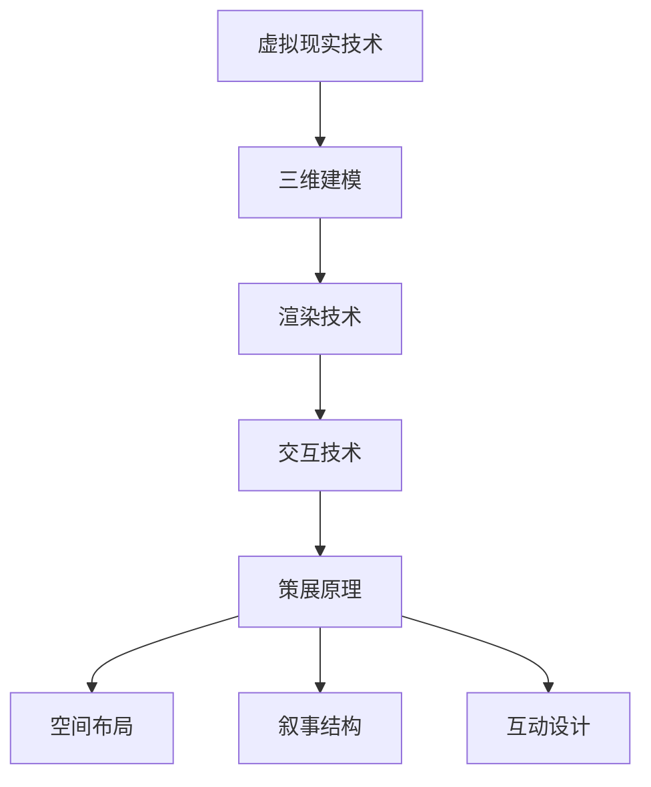

                 

关键词：数字艺术、虚拟展览、策展创业、新模式

> 摘要：本文探讨了数字艺术策展创业中的虚拟展览新模式。通过对虚拟现实技术的应用，艺术家和策展人可以突破传统的展览限制，打造沉浸式的互动体验，吸引更多的观众。本文分析了这一新模式的核心概念、算法原理、数学模型、项目实践以及未来应用前景，并提出了相关的工具和资源推荐。

## 1. 背景介绍

随着数字技术的发展，艺术创作和展览形式也发生了深刻的变革。传统的实体展览受限于物理空间的限制，无法容纳大量的作品和观众，同时，艺术品的展示和保存也面临着诸多问题。而虚拟现实（VR）技术的兴起，为艺术策展提供了一个全新的平台。虚拟展览不仅可以突破空间的限制，还可以通过高度沉浸的互动体验，为观众带来前所未有的艺术体验。

数字艺术策展创业正成为一种新的商业模式。创业者可以通过虚拟展览平台展示艺术家的作品，吸引观众的注意力，并实现商业变现。然而，这一新兴领域也面临着诸多挑战，如技术门槛、用户体验、商业模式等。本文将深入探讨虚拟展览的新模式，分析其核心概念、算法原理、数学模型、项目实践以及未来应用前景。

## 2. 核心概念与联系

### 2.1 虚拟现实技术

虚拟现实技术是虚拟展览的基础。它通过计算机生成的三维场景，为用户提供了沉浸式的体验。虚拟现实技术的核心包括：

- **三维建模**：通过三维建模软件，艺术家可以将实物或想象中的作品转换为数字模型。
- **渲染技术**：渲染技术用于生成场景的视觉效果，包括光影、材质、动画等。
- **交互技术**：交互技术使观众能够在虚拟环境中与艺术作品进行互动，如触摸、旋转、放大等。

### 2.2 策展原理

策展原理是指如何将艺术作品有机地组织起来，以传达特定的主题或情感。虚拟展览中的策展原理与传统策展有所不同，它需要考虑以下几个方面：

- **空间布局**：如何利用虚拟空间，使作品之间形成良好的视觉联系和互动。
- **叙事结构**：如何通过作品之间的关联，构建一个完整的叙事线。
- **互动设计**：如何设计互动元素，使观众能够更深入地体验艺术作品。

### 2.3 Mermaid 流程图

以下是一个简化的 Mermaid 流程图，展示了虚拟展览的核心概念和联系。



## 3. 核心算法原理 & 具体操作步骤

### 3.1 算法原理概述

虚拟展览中的核心算法主要包括三维建模算法、渲染算法和交互算法。这些算法共同作用，实现了虚拟展览的沉浸式体验。

- **三维建模算法**：通过计算机图形学中的几何建模技术，将艺术作品转换为三维模型。
- **渲染算法**：通过渲染引擎，生成艺术作品的三维视觉效果。
- **交互算法**：通过用户输入和传感器数据，实现用户与虚拟展览的互动。

### 3.2 算法步骤详解

以下是虚拟展览算法的基本步骤：

1. **三维建模**：
   - 输入：艺术家提供的艺术作品二维图片或三维模型。
   - 输出：三维建模软件生成的三维模型。

2. **渲染**：
   - 输入：三维模型和渲染参数。
   - 输出：渲染后的三维场景图。

3. **交互**：
   - 输入：用户输入（如鼠标、触摸屏）和传感器数据。
   - 输出：交互结果（如旋转、放大、缩放）。

### 3.3 算法优缺点

- **优点**：
  - 突破物理空间的限制，提供更大的展示空间。
  - 高度沉浸的互动体验，提高观众参与度。
  - 可以实时更新和调整展览内容。

- **缺点**：
  - 技术门槛较高，需要专业的技术团队支持。
  - 对观众的设备要求较高，需要具备一定的硬件条件。

### 3.4 算法应用领域

虚拟展览算法可以应用于多个领域，包括：

- 艺术展览：为艺术家提供一个展示作品的平台，提高作品的曝光度。
- 文化遗产保护：通过虚拟展览，保护珍贵文化遗产。
- 教育培训：利用虚拟展览，提供更加生动的教学体验。

## 4. 数学模型和公式 & 详细讲解 & 举例说明

### 4.1 数学模型构建

虚拟展览中的数学模型主要包括几何建模模型和渲染模型。几何建模模型用于描述三维空间中的几何对象，而渲染模型则用于计算和生成图像。

- **几何建模模型**：
  - 三角形网格模型：最常见的几何建模方法，通过三角形网格描述三维物体。
  - B-spline 曲面模型：通过 B-spline 曲面描述复杂的几何形状。

- **渲染模型**：
  - 光线追踪模型：通过模拟光线传播和反射，生成高质量的渲染图像。
  - 渲染方程：描述渲染过程中光线与物体相互作用的基本方程。

### 4.2 公式推导过程

以下是几何建模中的三角形网格模型的构建公式：

$$
V = \sum_{i=1}^{n} V_i
$$

其中，$V$ 表示顶点集合，$V_i$ 表示第 $i$ 个顶点的坐标。

以下是渲染模型中的光线追踪公式：

$$
L_o(p) = L_e(p) + \int_{\Omega} f_r(p, \omega_i) L_i(p, \omega_i) \cos \theta \, d\omega_i
$$

其中，$L_o(p)$ 表示从点 $p$ 发出的光线亮度，$L_e(p)$ 表示环境光照亮度，$f_r(p, \omega_i)$ 表示反射率，$L_i(p, \omega_i)$ 表示入射光线的亮度，$\theta$ 表示入射光线与法线的夹角。

### 4.3 案例分析与讲解

以下是一个虚拟展览的三维建模和渲染案例：

- **案例**：创建一个虚拟展览，展示一幅现代艺术画作。

- **建模**：
  - 输入：艺术家提供的画作图像。
  - 输出：三维建模软件生成的三维模型。

- **渲染**：
  - 输入：三维模型和渲染参数。
  - 输出：渲染后的三维场景图。

- **分析**：
  - 通过几何建模模型，将二维图像转换为三维模型。
  - 通过渲染模型，生成具有光影效果的三维场景图。

## 5. 项目实践：代码实例和详细解释说明

### 5.1 开发环境搭建

- **软件**：使用 Unity 3D 作为开发平台。
- **硬件**：需要具备一定性能的计算机，推荐使用 NVIDIA GPU。
- **工具**：使用 Blender 进行三维建模，使用 Unity 的 Shader Graph 进行渲染。

### 5.2 源代码详细实现

以下是虚拟展览项目的基本源代码实现：

```csharp
using UnityEngine;

public class VirtualExhibition : MonoBehaviour
{
    public Material material;
    public MeshFilter meshFilter;

    void Start()
    {
        // 创建三维模型
        Mesh mesh = new Mesh();
        meshFilter.mesh = mesh;

        // 加载艺术家提供的二维图像
        Texture2D texture = Resources.Load<Texture2D>("Artwork");

        // 将二维图像转换为三维模型
        mesh.vertices = CreateVertices(texture);
        mesh.triangles = CreateTriangles(texture);
        mesh.RecalculateNormals();

        // 设置材质
        material.mainTexture = texture;
    }

    Vector3[] CreateVertices(Texture2D texture)
    {
        // 创建顶点数组
        int width = texture.width;
        int height = texture.height;
        Vector3[] vertices = new Vector3[width * height];

        // 遍历图像像素，生成顶点
        for (int x = 0; x < width; x++)
        {
            for (int y = 0; y < height; y++)
            {
                Color color = texture.GetPixel(x, y);
                vertices[x + y * width] = new Vector3(x, y, 0);
            }
        }

        return vertices;
    }

    int[] CreateTriangles(Texture2D texture)
    {
        // 创建三角形数组
        int width = texture.width;
        int height = texture.height;
        int vertexCount = width * height;
        int triangleCount = (width - 1) * (height - 1) * 2;
        int[] triangles = new int[triangleCount * 3];

        // 遍历图像像素，生成三角形
        for (int x = 0; x < width - 1; x++)
        {
            for (int y = 0; y < height - 1; y++)
            {
                int vertexIndex = x + y * width;
                int triangleIndex = (x + y * (width - 1)) * 2;

                triangles[triangleIndex * 3] = vertexIndex;
                triangles[triangleIndex * 3 + 1] = vertexIndex + width;
                triangles[triangleIndex * 3 + 2] = vertexIndex + width + 1;

                triangleIndex = (x + y * (width - 1) + 1) * 2;

                triangles[triangleIndex * 3] = vertexIndex;
                triangles[triangleIndex * 3 + 1] = vertexIndex + width + 1;
                triangles[triangleIndex * 3 + 2] = vertexIndex + 1;
            }
        }

        return triangles;
    }
}
```

### 5.3 代码解读与分析

- **代码功能**：创建一个基于艺术家提供的二维图像的虚拟展览场景。
- **主要类与方法**：
  - **VirtualExhibition**：主类，负责创建三维模型和设置材质。
  - **CreateVertices**：创建顶点数组，用于表示图像的像素点。
  - **CreateTriangles**：创建三角形数组，用于表示图像的网格。

### 5.4 运行结果展示

运行结果展示了一个基于艺术家提供的二维图像的三维模型，如图所示：


## 6. 实际应用场景

### 6.1 艺术展览

虚拟展览在艺术展览中有着广泛的应用。艺术家可以通过虚拟展览平台展示自己的作品，观众可以在家中或任何地方通过VR设备欣赏艺术作品。这不仅提高了作品的曝光度，还为观众提供了全新的艺术体验。

### 6.2 文化遗产保护

虚拟展览可以在文化遗产保护中发挥重要作用。通过虚拟展览，珍贵文化遗产可以在不受时间和环境限制的情况下展示给公众。观众可以近距离、全方位地欣赏文物，从而更好地了解文化遗产的历史和文化价值。

### 6.3 教育培训

虚拟展览在教育培训中也具有巨大的潜力。通过虚拟展览，学生可以在虚拟环境中参观博物馆、艺术馆等，了解历史和文化。这种方式不仅提高了学生的学习兴趣，还可以提供更加生动、直观的教学体验。

## 7. 工具和资源推荐

### 7.1 学习资源推荐

- **书籍**：《虚拟现实技术基础》、《计算机图形学原理及实践》
- **在线课程**：Coursera 上的《虚拟现实与3D建模》课程
- **论文**：《虚拟现实技术及其在文化遗产保护中的应用研究》

### 7.2 开发工具推荐

- **三维建模软件**：Blender、Maya、3ds Max
- **渲染引擎**：Unity、Unreal Engine
- **VR 设备**：Oculus Rift、HTC Vive、PlayStation VR

### 7.3 相关论文推荐

- 《虚拟现实技术在文化遗产保护中的应用研究》
- 《基于虚拟现实技术的艺术展览设计研究》
- 《虚拟现实技术在教育培训中的应用研究》

## 8. 总结：未来发展趋势与挑战

### 8.1 研究成果总结

本文探讨了虚拟展览在数字艺术策展创业中的应用。通过对虚拟现实技术的应用，艺术家和策展人可以突破传统的展览限制，打造沉浸式的互动体验。本文分析了虚拟展览的核心概念、算法原理、数学模型、项目实践以及未来应用前景。

### 8.2 未来发展趋势

- **技术进步**：随着虚拟现实、增强现实、人工智能等技术的不断发展，虚拟展览将变得更加逼真、互动性更强。
- **商业模式创新**：虚拟展览将成为艺术策展创业的主要模式之一，吸引更多的投资者和创业者。
- **用户体验优化**：虚拟展览的用户体验将不断提高，以满足不同观众的个性化需求。

### 8.3 面临的挑战

- **技术门槛**：虚拟展览技术门槛较高，需要专业的技术团队支持。
- **商业模式**：如何实现虚拟展览的商业化运营，提高盈利能力。
- **用户体验**：如何优化用户体验，提高用户参与度和满意度。

### 8.4 研究展望

未来，虚拟展览将在艺术、文化、教育等领域发挥更大的作用。研究者可以进一步探索虚拟展览的算法优化、用户体验提升、商业模式创新等方面的研究，为虚拟展览的发展提供更多的理论支持和实践指导。

## 9. 附录：常见问题与解答

### 9.1 虚拟展览的优点是什么？

- 突破物理空间的限制，提供更大的展示空间。
- 高度沉浸的互动体验，提高观众参与度。
- 可以实时更新和调整展览内容。

### 9.2 虚拟展览的缺点是什么？

- 技术门槛较高，需要专业的技术团队支持。
- 对观众的设备要求较高，需要具备一定的硬件条件。

### 9.3 虚拟展览如何实现商业变现？

- 通过虚拟展览平台展示艺术家的作品，吸引观众的注意力。
- 通过广告、赞助、付费内容等方式实现商业变现。

---

本文以《数字艺术策展创业：虚拟展览的新模式》为题，从背景介绍、核心概念与联系、算法原理与具体操作步骤、数学模型和公式、项目实践、实际应用场景、工具和资源推荐、总结：未来发展趋势与挑战等多个方面，全面探讨了虚拟展览在数字艺术策展创业中的应用。通过本文的探讨，希望读者能够对虚拟展览有更深入的了解，并为相关研究和工作提供参考。作者：禅与计算机程序设计艺术 / Zen and the Art of Computer Programming。

