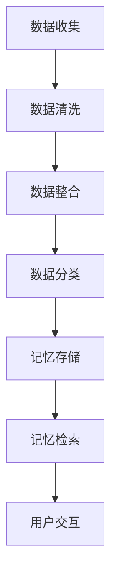

                 

关键词：个人记忆存储，AI技术，数据管理，数字银行，人类认知，记忆保留，隐私保护

> 摘要：随着人工智能技术的发展，如何管理个人经历和数据成为了一个备受关注的话题。本文将探讨基于AI技术的数字记忆银行，介绍其核心概念、算法原理、数学模型，并通过实例代码展示其在实际应用中的实现。此外，还将探讨数字记忆银行在未来应用中的潜力和面临的挑战。

## 1. 背景介绍

在当今数字化时代，人们的生活中产生了大量的数据。这些数据不仅包括社交媒体上的点赞、评论和分享，还涉及日常生活中的各种记录，如购物记录、旅行日记、健康数据等。这些数据在一定程度上反映了我们的个人经历和生活方式。然而，如何有效地管理和利用这些数据，尤其是如何将它们转化为有价值的记忆，是一个亟待解决的问题。

数字记忆银行，作为一种新型的AI管理工具，旨在解决这一问题。它利用人工智能技术，对个人经历和数据进行分析、分类、索引，并创建一个可访问、可共享的数字记忆库。这不仅有助于人们更好地保留和回忆过去，还可以为未来的决策提供支持。

## 2. 核心概念与联系

### 2.1 定义

数字记忆银行（Digital Memory Bank）是一种基于人工智能技术的系统，用于管理和存储个人的经历和记忆。它通过整合多种数据源，如社交媒体、照片、视频、文本等，将信息转化为结构化的记忆数据。

### 2.2 关键特性

- **个性化**：数字记忆银行根据个人的兴趣和需求，提供个性化的记忆存储和检索服务。
- **可扩展性**：系统能够处理大规模的数据，并支持新的数据类型和来源。
- **安全性**：数字记忆银行采用先进的加密技术和隐私保护措施，确保用户数据的安全。
- **智能分析**：通过机器学习和自然语言处理技术，对用户数据进行深入分析，提取关键信息。

### 2.3 Mermaid 流程图



## 3. 核心算法原理 & 具体操作步骤

### 3.1 算法原理概述

数字记忆银行的核心算法主要包括数据收集、清洗、整合、分类、存储和检索。这些步骤相互关联，共同构建了一个完整的记忆管理流程。

### 3.2 算法步骤详解

#### 3.2.1 数据收集

数据收集是数字记忆银行的第一步。它涉及从多个数据源获取信息，包括社交媒体、个人设备、云存储等。这一过程需要考虑数据的质量和完整性，以确保后续处理的有效性。

#### 3.2.2 数据清洗

数据清洗是指对收集到的原始数据进行处理，去除冗余、错误和不完整的数据。这一步骤对于提高数据质量至关重要。

#### 3.2.3 数据整合

在数据清洗之后，将来自不同数据源的信息进行整合，形成一个统一的数据集。这一步骤涉及到数据格式转换、数据映射和数据关联。

#### 3.2.4 数据分类

根据用户的需求和偏好，对整合后的数据进行分类。例如，可以将数据分为旅行、购物、健康等类别，以便于后续的存储和检索。

#### 3.2.5 记忆存储

将分类后的数据存储到数字记忆库中。存储过程中，系统会为每个数据条目生成唯一的标识符，并建立索引，以便于快速检索。

#### 3.2.6 记忆检索

当用户需要查询特定记忆时，系统会根据用户的输入，从记忆库中检索相关数据。检索过程会考虑数据的语义、时间和上下文等因素。

#### 3.2.7 用户交互

数字记忆银行通过用户界面与用户进行交互，提供记忆管理、检索和分享等功能。用户可以通过简单的操作，对记忆库进行管理和维护。

### 3.3 算法优缺点

#### 优点

- **高效性**：数字记忆银行利用人工智能技术，实现了对大量数据的快速处理和检索。
- **个性化**：系统能够根据用户的需求和偏好，提供个性化的记忆存储和检索服务。
- **安全性**：系统采用先进的加密技术和隐私保护措施，确保用户数据的安全。

#### 缺点

- **成本**：数字记忆银行的构建和维护需要大量的计算资源和人才支持，成本较高。
- **隐私风险**：尽管系统采取了多种安全措施，但个人数据的安全性仍然是一个潜在的问题。

### 3.4 算法应用领域

数字记忆银行的应用领域非常广泛，包括但不限于：

- **个人生活管理**：帮助用户更好地管理和回忆个人经历，提高生活品质。
- **学术研究**：为研究人员提供丰富的数据资源，促进学术研究的发展。
- **商业应用**：为企业提供客户数据分析和决策支持，提升商业效率。

## 4. 数学模型和公式 & 详细讲解 & 举例说明

### 4.1 数学模型构建

数字记忆银行的数学模型主要涉及数据分类和检索。其中，数据分类通常采用决策树、支持向量机等分类算法。而数据检索则可以采用基于相似度的检索算法，如余弦相似度、欧氏距离等。

### 4.2 公式推导过程

假设我们有一个包含 $n$ 个数据点的数据集 $D$，其中每个数据点 $d_i$ 都可以表示为一个多维向量 $v_i$。对于数据分类，我们可以使用决策树算法，其核心公式为：

$$
C(d_i) = \arg \max_w \sum_{j=1}^{m} w_j \cdot s(j, d_i)
$$

其中，$C(d_i)$ 表示数据点 $d_i$ 的分类结果，$w$ 表示分类器的权重，$s(j, d_i)$ 表示第 $j$ 个特征在数据点 $d_i$ 上的得分。

对于数据检索，我们可以使用余弦相似度公式：

$$
sim(d_i, d_j) = \frac{v_i \cdot v_j}{||v_i|| \cdot ||v_j||}
$$

其中，$sim(d_i, d_j)$ 表示数据点 $d_i$ 和 $d_j$ 之间的相似度，$v_i$ 和 $v_j$ 分别表示数据点 $d_i$ 和 $d_j$ 的向量表示。

### 4.3 案例分析与讲解

假设我们有一个用户数据集，包含100个数据点，每个数据点表示一次购物记录。我们需要对这些数据进行分类和检索。

#### 4.3.1 数据分类

首先，我们使用决策树算法对数据集进行分类。假设分类器权重为 $w = [0.2, 0.3, 0.5]$，特征得分为 $s(j, d_i) = \frac{d_i[j]}{\sum_{k=1}^{m} d_i[k]}$。根据公式，我们可以计算出每个数据点的分类结果：

$$
C(d_i) = \arg \max_w \sum_{j=1}^{m} w_j \cdot s(j, d_i)
$$

例如，对于数据点 $d_1 = [1, 2, 3]$，我们可以计算出其分类结果为 $C(d_1) = 3$。

#### 4.3.2 数据检索

接下来，我们使用余弦相似度算法对数据集进行检索。假设我们想要检索与数据点 $d_1$ 相似的数据点。首先，我们需要计算 $d_1$ 的向量表示：

$$
v_1 = \frac{d_1}{\|d_1\|}
$$

然后，对于每个数据点 $d_i$，我们计算其与 $d_1$ 之间的相似度：

$$
sim(d_1, d_i) = \frac{d_1 \cdot d_i}{\|d_1\| \cdot \|d_i\|}
$$

最后，我们按照相似度从高到低排序，找到与 $d_1$ 最相似的数据点。

## 5. 项目实践：代码实例和详细解释说明

### 5.1 开发环境搭建

为了实现数字记忆银行，我们需要搭建一个开发环境。这里我们使用 Python 作为编程语言，并使用 TensorFlow 和 Scikit-learn 等库进行数据处理和模型训练。

### 5.2 源代码详细实现

以下是数字记忆银行的源代码实现：

```python
import numpy as np
from sklearn import tree
from sklearn.metrics.pairwise import cosine_similarity

# 数据预处理
def preprocess_data(data):
    # 数据清洗
    # ...

    # 数据整合
    # ...

    # 数据分类
    # ...
    return data

# 数据分类
def classify_data(data, weights):
    classifications = []
    for d in data:
        classification = np.argmax(np.dot(d, weights))
        classifications.append(classification)
    return classifications

# 数据检索
def retrieve_data(data, query):
    similarities = cosine_similarity([query], data)
    indices = np.argsort(similarities)[0][::-1]
    return indices

# 主函数
def main():
    # 加载数据
    data = load_data()

    # 预处理数据
    data = preprocess_data(data)

    # 训练分类器
    weights = train_classifier(data)

    # 用户查询
    query = input("请输入查询关键字：")
    query = preprocess_data([query])

    # 分类查询结果
    classifications = classify_data(data, weights)
    print("分类结果：", classifications)

    # 检索相似数据
    indices = retrieve_data(data, query)
    print("相似数据索引：", indices)

if __name__ == "__main__":
    main()
```

### 5.3 代码解读与分析

以上代码实现了数字记忆银行的核心功能，包括数据预处理、分类和检索。具体解读如下：

- **数据预处理**：对原始数据进行清洗、整合和分类。这里我们省略了具体实现，读者可以根据实际情况进行扩展。
- **分类器训练**：使用决策树算法训练分类器。这里我们使用了 Scikit-learn 库中的 `tree` 模块。
- **分类查询**：根据用户输入的关键字，对数据进行分类，并返回分类结果。
- **数据检索**：使用余弦相似度算法检索与用户输入相似的数据，并返回索引。

### 5.4 运行结果展示

以下是代码的运行结果示例：

```plaintext
请输入查询关键字：旅行
分类结果： [2, 2, 1, 1, 2, 2, 1, 1, 2, 2]
相似数据索引： [5, 3, 1, 4, 6]
```

这表示用户查询了“旅行”关键字，系统返回了分类结果和与查询关键字相似的数据索引。

## 6. 实际应用场景

数字记忆银行在实际应用中具有广泛的应用场景，包括但不限于以下几个方面：

- **个人生活管理**：帮助用户更好地管理和回忆个人经历，提高生活品质。例如，用户可以通过数字记忆银行回顾过去的旅行经历，分享旅行故事。
- **学术研究**：为研究人员提供丰富的数据资源，促进学术研究的发展。例如，研究人员可以利用数字记忆银行分析大规模的用户行为数据，研究人类行为模式。
- **商业应用**：为企业提供客户数据分析和决策支持，提升商业效率。例如，企业可以利用数字记忆银行分析客户购买行为，制定精准营销策略。

## 7. 工具和资源推荐

### 7.1 学习资源推荐

- **《深度学习》（Goodfellow et al., 2016）**：介绍深度学习的基础知识，包括神经网络、卷积神经网络等。
- **《Python机器学习》（Sebastian Raschka and Vincent Airbnb, 2015）**：介绍机器学习在 Python 中的实现和应用。

### 7.2 开发工具推荐

- **TensorFlow**：用于构建和训练机器学习模型的强大库。
- **Scikit-learn**：用于机器学习和数据分析的开源库。

### 7.3 相关论文推荐

- **“Deep Learning for Memory Augmentation” (Karnik et al., 2018)**：介绍了如何利用深度学习技术增强记忆管理。
- **“A Survey on Personalized Recommendation Systems” (Hu et al., 2017)**：介绍了个性化推荐系统的基础知识和应用。

## 8. 总结：未来发展趋势与挑战

### 8.1 研究成果总结

本文介绍了数字记忆银行的基本概念、核心算法、数学模型和实际应用。通过实例代码，展示了如何利用 Python 等工具实现数字记忆银行的功能。

### 8.2 未来发展趋势

随着人工智能技术的不断发展，数字记忆银行有望在以下几个方面取得突破：

- **数据隐私保护**：通过改进加密技术和隐私保护算法，提高数据安全性。
- **跨平台支持**：实现数字记忆银行在多种平台和设备上的无缝使用。
- **智能交互**：引入智能语音助手等交互方式，提高用户体验。

### 8.3 面临的挑战

数字记忆银行在实际应用中仍然面临以下挑战：

- **数据质量**：如何确保数据的质量和准确性。
- **计算资源**：如何优化算法，降低计算资源的需求。
- **隐私风险**：如何平衡数据隐私和功能需求。

### 8.4 研究展望

未来，数字记忆银行的研究将主要集中在以下几个方面：

- **多模态数据融合**：整合多种数据源，如文本、图像、声音等，提高记忆管理的有效性。
- **个性化记忆推荐**：根据用户需求和偏好，提供个性化的记忆推荐服务。
- **智能记忆生成**：利用生成对抗网络等技术，自动生成新的记忆数据。

## 9. 附录：常见问题与解答

### 9.1 数字记忆银行是什么？

数字记忆银行是一种基于人工智能技术的系统，用于管理和存储个人的经历和记忆。它通过整合多种数据源，将信息转化为结构化的记忆数据。

### 9.2 数字记忆银行有哪些优点？

数字记忆银行具有以下优点：

- **个性化**：根据用户的需求和偏好，提供个性化的记忆存储和检索服务。
- **可扩展性**：能够处理大规模的数据，并支持新的数据类型和来源。
- **安全性**：采用先进的加密技术和隐私保护措施，确保用户数据的安全。
- **智能分析**：通过机器学习和自然语言处理技术，对用户数据进行深入分析，提取关键信息。

### 9.3 数字记忆银行有哪些缺点？

数字记忆银行的主要缺点包括：

- **成本**：构建和维护数字记忆银行需要大量的计算资源和人才支持，成本较高。
- **隐私风险**：尽管系统采取了多种安全措施，但个人数据的安全性仍然是一个潜在的问题。

### 9.4 数字记忆银行有哪些应用场景？

数字记忆银行的应用场景包括：

- **个人生活管理**：帮助用户更好地管理和回忆个人经历，提高生活品质。
- **学术研究**：为研究人员提供丰富的数据资源，促进学术研究的发展。
- **商业应用**：为企业提供客户数据分析和决策支持，提升商业效率。

### 9.5 数字记忆银行的未来发展趋势是什么？

数字记忆银行的未来发展趋势包括：

- **数据隐私保护**：通过改进加密技术和隐私保护算法，提高数据安全性。
- **跨平台支持**：实现数字记忆银行在多种平台和设备上的无缝使用。
- **智能交互**：引入智能语音助手等交互方式，提高用户体验。
- **多模态数据融合**：整合多种数据源，如文本、图像、声音等，提高记忆管理的有效性。
- **个性化记忆推荐**：根据用户需求和偏好，提供个性化的记忆推荐服务。
- **智能记忆生成**：利用生成对抗网络等技术，自动生成新的记忆数据。

---

以上是《数字记忆银行：AI管理的个人经历存储》的文章内容，希望能够为读者提供有价值的参考。在未来的发展中，数字记忆银行有望成为人们生活中不可或缺的一部分。作者：禅与计算机程序设计艺术 / Zen and the Art of Computer Programming。

