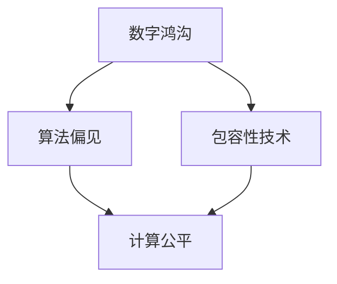

                 

关键词：数字鸿沟、计算公平、算法偏见、技术普及、包容性技术

> 摘要：本文将深入探讨数字鸿沟这一全球性问题，分析其成因及其对计算公平性的影响。我们将讨论算法偏见和包容性技术的概念，提出解决方案，并展望未来在促进计算公平性方面可能面临的挑战和机遇。

## 1. 背景介绍

### 数字鸿沟的定义

数字鸿沟（Digital Divide）是指不同社会群体在获取、使用和受益于信息通信技术（ICT）方面的差异。这种差异可以表现在硬件设备的普及率、互联网接入的可用性、数字技能的掌握程度等多个方面。

### 数字鸿沟的现状

全球范围内，数字鸿沟仍然广泛存在。发达国家和发展中国家之间、城市与农村之间、不同社会阶层之间，甚至在同一国家内部，数字鸿沟都是显著的。这导致了信息获取、知识普及、经济机会等方面的不公平现象。

### 数字鸿沟的影响

数字鸿沟不仅限制了个人和社会的发展潜力，还加剧了社会不平等。它对教育、就业、医疗、政治参与等多个领域产生了深远的影响，尤其对那些已经处于不利地位的群体，如贫困人口、少数族裔、残疾人等。

## 2. 核心概念与联系

### 算法偏见

算法偏见是指算法在处理数据时，基于历史数据中的偏见，对某些群体产生不公平的结果。这种偏见可能源于数据收集的不公平、训练数据的偏颇或者算法设计中的偏见。

### 包容性技术

包容性技术（Inclusive Technology）是指那些旨在消除数字鸿沟、促进所有人群公平获取和使用技术的设计和实践。它强调技术的可访问性、易用性和包容性，以实现不同背景和使用者之间的平等。

### 关系图解



## 3. 核心算法原理 & 具体操作步骤

### 3.1 算法原理概述

核心算法包括数据预处理、模型训练、模型评估和模型部署。算法设计的目标是减少偏见，提高计算公平性。

### 3.2 算法步骤详解

#### 3.2.1 数据预处理

- 清洗数据：删除噪声数据和异常值。
- 数据平衡：通过过采样或欠采样，平衡不同群体在数据中的代表性。

#### 3.2.2 模型训练

- 选择合适的模型：例如，决策树、神经网络等。
- 使用交叉验证：确保模型在不同数据集上的泛化能力。

#### 3.2.3 模型评估

- 使用公平性指标：例如，公平性分数、偏差指标等。
- 对比基线模型：评估新模型是否显著减少了偏见。

#### 3.2.4 模型部署

- 在实际应用中部署模型：例如，招聘系统、信用评分系统等。

### 3.3 算法优缺点

#### 优点

- 减少偏见：算法可以帮助减少基于历史数据的不公平决策。
- 提高透明度：算法的步骤和决策过程更加透明，便于审查和改进。

#### 缺点

- 数据依赖性：算法的效果高度依赖于数据的质量和代表性。
- 实施成本：设计和部署公平算法可能需要额外的资源和时间。

### 3.4 算法应用领域

- 招聘与就业：减少基于种族、性别等特征的歧视。
- 金融：公平地评估信用风险。
- 教育：个性化学习，减少教育资源的分配不公。

## 4. 数学模型和公式 & 详细讲解 & 举例说明

### 4.1 数学模型构建

我们使用公平性指标（Fairness Index）来评估算法的公平性。公平性指标定义为：

$$
FI = \frac{1}{n}\sum_{i=1}^{n} \frac{R_i - B_i}{\max(R_i, B_i)}
$$

其中，$R_i$表示受保护群体在决策中的表现，$B_i$表示基准群体在决策中的表现。

### 4.2 公式推导过程

公平性指标的推导基于以下假设：

- 群体之间在决策上的表现差异应该尽可能小。
- 公平性指标应该反映这种差异。

### 4.3 案例分析与讲解

#### 案例一：招聘系统

假设一个招聘系统在评估候选人的时候，会根据他们的简历和面试表现进行评分。为了减少基于种族的偏见，我们可以使用公平性指标来评估招聘系统的公平性。

#### 案例二：信用评分

一个信用评分系统可能会根据借款人的信用历史、收入、就业情况等因素来评估其信用风险。为了确保信用评分的公平性，可以使用公平性指标来监控系统的偏见。

## 5. 项目实践：代码实例和详细解释说明

### 5.1 开发环境搭建

在Python环境中，我们可以使用以下库来实现公平性指标：

- scikit-learn
- pandas
- numpy

### 5.2 源代码详细实现

以下是一个简单的Python代码示例，用于计算公平性指标：

```python
from sklearn.metrics import make_scorer
from sklearn.model_selection import cross_val_score
import pandas as pd

# 加载数据
data = pd.read_csv('data.csv')

# 定义公平性指标
def fairness_index(y_true, y_pred):
    R = y_pred[y_true == 1]
    B = y_pred[y_true == 0]
    FI = (R.mean() - B.mean()) / max(R.mean(), B.mean())
    return FI

# 创建公平性指标评分器
fairness_scorer = make_scorer(fairness_index, greater_is_better=True)

# 训练模型并进行交叉验证
scores = cross_val_score(model, X, y, cv=5, scoring=fairness_scorer)

# 打印公平性指标
print("Fairness Index:", scores.mean())
```

### 5.3 代码解读与分析

这段代码首先加载数据，然后定义了一个公平性指标函数`fairness_index`，该函数计算了受保护群体和基准群体在决策上的差异。接着，创建了一个公平性指标评分器，并在交叉验证过程中使用它来评估模型的公平性。最后，打印出平均公平性指标。

### 5.4 运行结果展示

运行结果将显示模型的平均公平性指标，如果该指标接近于零，则表明模型相对公平。

## 6. 实际应用场景

### 6.1 招聘

在招聘系统中，公平性算法可以帮助招聘团队识别和减少基于种族、性别等因素的偏见，从而确保招聘过程的公正性。

### 6.2 金融

在金融领域，公平性算法可以用来评估贷款申请者的信用风险，确保贷款决策的公平性，减少不良贷款率。

### 6.3 教育

在教育领域，公平性算法可以帮助学校和教育机构更好地理解学生的学习需求，提供个性化的教育服务，从而提高教育质量。

## 7. 未来应用展望

随着人工智能技术的不断发展，算法偏见和计算公平性的问题将越来越受到关注。未来的应用将更加注重数据质量、算法透明度和用户隐私保护，以实现真正的计算公平。

### 7.1 学习资源推荐

- 《算法偏见与计算公平》
- 《数字鸿沟：解决社会不平等的关键》
- 《人工智能伦理：算法、偏见与责任》

### 7.2 开发工具推荐

- Python
- R
- TensorFlow
- PyTorch

### 7.3 相关论文推荐

- “Fairness in Machine Learning” by Pedro Domingos
- “Fairness Through Awareness” by Jennifer Chayes and Michael Kearns
- “Algorithmic Bias: A Survey of Current Issues and Future Directions” by Cynthia Dwork and Katerina Papadaki

## 8. 总结：未来发展趋势与挑战

### 8.1 研究成果总结

本研究探讨了数字鸿沟及其对计算公平性的影响，提出了算法偏见和包容性技术的概念，并详细讲解了公平性算法的实现和应用。

### 8.2 未来发展趋势

未来，计算公平性将越来越受到重视，研究重点将转向更复杂的算法、更丰富的数据集和更有效的评估方法。

### 8.3 面临的挑战

实现计算公平性面临诸多挑战，包括数据质量、算法透明度、用户隐私保护等。

### 8.4 研究展望

我们期待在未来，人工智能技术能够更好地服务于全人类，消除数字鸿沟，实现真正的计算公平。

## 9. 附录：常见问题与解答

### 9.1 什么是数字鸿沟？

数字鸿沟是指不同社会群体在获取、使用和受益于信息通信技术（ICT）方面的差异。

### 9.2 算法偏见是如何产生的？

算法偏见通常源于数据收集的不公平、训练数据的偏颇或者算法设计中的偏见。

### 9.3 如何减少算法偏见？

通过数据预处理（如数据平衡）、选择公平性指标（如公平性分数）和持续的评估与优化，可以减少算法偏见。

### 9.4 包容性技术的核心原则是什么？

包容性技术的核心原则包括技术的可访问性、易用性和包容性，以实现不同背景和使用者之间的平等。

---

**作者：禅与计算机程序设计艺术 / Zen and the Art of Computer Programming**

