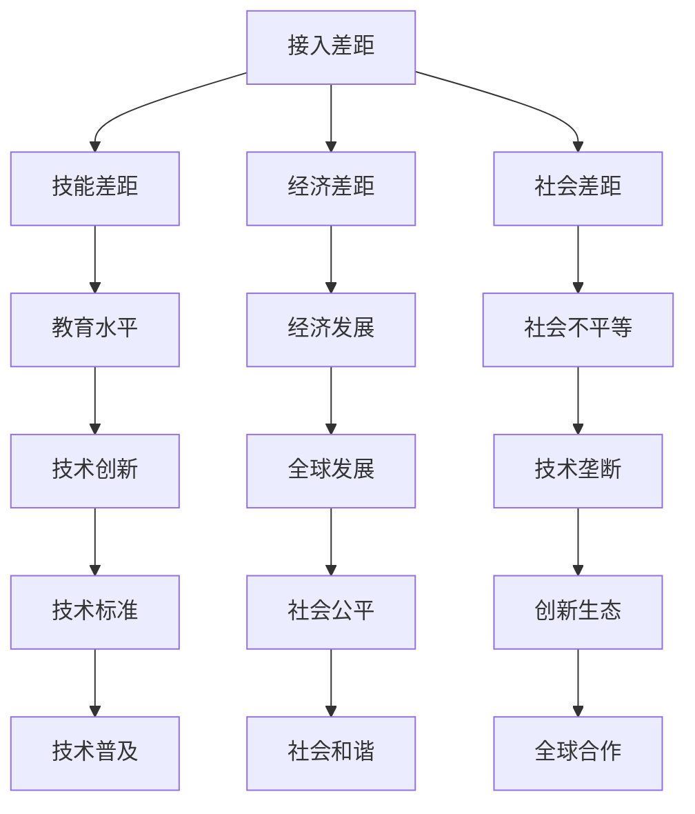

                 

关键词：数字鸿沟、计算能力、社会不平等、技术普及、教育资源、全球发展、技术伦理

> 摘要：本文探讨了数字鸿沟这一全球性问题，分析了其在人类计算领域中的表现，以及如何通过技术手段和教育资源弥合这一现象，促进全球范围内的计算能力均衡发展。

## 1. 背景介绍

在信息时代的浪潮中，计算技术的进步极大地改变了我们的生活方式。然而，随着数字技术的飞速发展，数字鸿沟这一现象也日益显著。数字鸿沟指的是不同社会群体在接入、使用和受益于数字技术方面存在的差距。这种差距不仅体现在地理分布上，还表现在社会经济地位、教育水平等多个方面。

### 1.1 数字鸿沟的起源

数字鸿沟的产生有其历史背景。在信息技术起步阶段，技术资源和基础设施主要集中在发达国家，导致这些地区能够较早享受到数字技术带来的便利。随着时间的推移，尽管一些发展中国家在信息技术方面取得了显著进展，但与发达国家之间的差距依然明显。

### 1.2 数字鸿沟的表现

数字鸿沟的表现形式多样，主要包括以下几个方面：

- **接入差距**：在互联网接入方面，发达国家普及率较高，而许多发展中国家仍面临基础设施不足的问题。
- **技能差距**：由于教育资源的不均衡，技术技能的掌握存在明显的地区差异。
- **经济差距**：经济条件较差的地区难以承担数字设备和技术服务的费用。
- **社会差距**：社会阶层和性别差异也影响着个体对数字技术的接触和使用。

### 1.3 数字鸿沟的影响

数字鸿沟的存在对全球发展产生了深远的影响。首先，它限制了发展中国家社会和经济的发展潜力。其次，它加剧了社会不平等现象，使得弱势群体难以通过数字技术改善生活条件。此外，数字鸿沟还可能导致全球范围内的技术垄断，影响技术标准和创新生态的多样性。

## 2. 核心概念与联系

为了更好地理解数字鸿沟及其影响，我们需要探讨几个核心概念，并展示它们之间的联系。以下是一个简单的 Mermaid 流程图，用于展示这些概念及其相互关系：



### 2.1 接入差距

接入差距是数字鸿沟的首要表现。它指的是不同地区在互联网接入方面的差距。接入差距的影响深远，它不仅影响到个人和企业的信息获取，还直接关系到社会的经济活动。通过改善接入条件，可以缩小地区间的数字鸿沟。

### 2.2 技能差距

技能差距体现在不同地区和群体在技术技能的掌握程度上的差异。高技能地区和群体能够更好地利用数字技术，而低技能地区和群体则难以适应信息化社会的要求。因此，提高教育水平和技能培训是弥合数字鸿沟的关键。

### 2.3 经济差距

经济差距指的是由于经济发展水平不同导致的数字技术获取能力的差异。经济条件较好的地区和群体更容易获得先进的数字设备和优质的服务，而经济条件较差的地区和群体则面临较大的困难。通过经济援助和公共投资，可以缓解经济差距带来的数字鸿沟。

### 2.4 社会差距

社会差距体现在不同社会阶层和性别在数字技术接触和使用方面的差异。社会阶层较低和女性群体往往受到更多的限制，难以享受数字技术带来的便利。通过提高社会平等和性别教育，可以减少社会差距对数字鸿沟的影响。

### 2.5 教育水平

教育水平是缩小数字鸿沟的重要手段。高质量的教育能够提高个体的技术技能，增强他们适应信息化社会的能力。同时，教育水平也是促进社会经济发展的关键因素，有助于缩小地区间的经济差距。

### 2.6 技术创新

技术创新是推动数字技术普及和发展的重要动力。通过技术创新，可以提高数字设备的性能和降低成本，使得更多的人能够负担得起。此外，技术创新还能够促进新技术的标准制定，增强全球技术的互联互通。

### 2.7 全球合作

全球合作是弥合数字鸿沟的重要途径。通过国际合作，可以共同解决数字鸿沟带来的挑战，实现资源共享和技术互补。全球合作还包括技术援助和人力资源交流，有助于提高发展中国家的信息技术水平。

## 3. 核心算法原理 & 具体操作步骤

### 3.1 算法原理概述

在数字鸿沟的弥合过程中，核心算法起到了至关重要的作用。这些算法主要包括网络接入优化算法、教育资源分配算法和技术技能培训算法。以下是对这些算法原理的概述：

- **网络接入优化算法**：通过优化网络接入条件，提高互联网的可用性和稳定性，从而缩小接入差距。
- **教育资源分配算法**：通过合理分配教育资源，确保每个地区和群体都能够获得高质量的教育服务，从而缩小技能差距。
- **技术技能培训算法**：通过智能化的培训方案，提高个体的技术技能，帮助他们更好地适应信息化社会。

### 3.2 算法步骤详解

#### 3.2.1 网络接入优化算法

1. **需求分析**：收集不同地区和群体的网络接入需求，包括接入速度、稳定性、费用等因素。
2. **资源评估**：评估现有的网络资源，包括带宽、节点数量、设备性能等。
3. **方案设计**：根据需求分析和资源评估，设计优化方案，包括网络扩容、设备升级、拓扑调整等。
4. **实施与监控**：实施优化方案，并持续监控网络性能，确保优化效果。

#### 3.2.2 教育资源分配算法

1. **数据收集**：收集各地区和群体的教育资源需求，包括学生数量、教师数量、课程设置等。
2. **优先级评估**：根据教育资源的稀缺程度和地区的经济状况，评估各个地区的优先级。
3. **资源分配**：根据评估结果，合理分配教育资源，确保每个地区和群体都能够获得足够的教育服务。
4. **反馈机制**：建立反馈机制，收集用户反馈，根据反馈进行调整，以提高资源分配的公平性和有效性。

#### 3.2.3 技术技能培训算法

1. **技能需求分析**：分析不同地区和群体的技能需求，包括基础知识、专业技能、创新能力等。
2. **培训方案设计**：根据技能需求，设计个性化的培训方案，包括课程设置、培训时间、培训方式等。
3. **培训实施**：按照培训方案进行实施，确保培训过程的高效性和针对性。
4. **效果评估**：对培训效果进行评估，包括技能掌握情况、就业情况等，根据评估结果进行培训方案的调整。

### 3.3 算法优缺点

#### 3.3.1 网络接入优化算法

优点：

- 提高网络接入的可用性和稳定性，缩小接入差距。
- 有助于提高地区经济的整体竞争力。

缺点：

- 需要大量的资金投入和维护成本。
- 可能导致地区间的网络服务不公平。

#### 3.3.2 教育资源分配算法

优点：

- 有助于提高教育资源的利用效率，缩小技能差距。
- 促进教育公平，提高社会整体素质。

缺点：

- 可能导致某些地区资源过剩，其他地区资源不足。
- 需要准确的优先级评估，否则可能导致资源分配不公平。

#### 3.3.3 技术技能培训算法

优点：

- 有助于提高个体的技术技能，增强他们的就业竞争力。
- 促进技术创新和产业升级。

缺点：

- 培训效果可能因个体差异而有所不同。
- 需要长期坚持，否则难以取得显著效果。

### 3.4 算法应用领域

网络接入优化算法主要应用于互联网基础设施建设，包括光纤网络、无线网络等。教育资源分配算法主要应用于教育系统，包括学校、培训机构等。技术技能培训算法主要应用于职业教育和技能培训领域，包括在线教育、职业培训等。

## 4. 数学模型和公式 & 详细讲解 & 举例说明

### 4.1 数学模型构建

在数字鸿沟的弥合过程中，数学模型起到了重要的作用。以下是一个简单的数学模型，用于描述数字鸿沟的弥合过程：

$$
\text{数字鸿沟} = f(\text{接入差距}, \text{技能差距}, \text{经济差距}, \text{社会差距})
$$

其中，接入差距、技能差距、经济差距和社会差距是影响数字鸿沟的主要因素。

### 4.2 公式推导过程

假设一个地区在接入、技能、经济和社会方面的表现可以用以下指标来衡量：

- **接入指标**：互联网接入率、接入速度等。
- **技能指标**：技术熟练度、教育水平等。
- **经济指标**：GDP、人均收入等。
- **社会指标**：社会平等指数、性别平等指数等。

我们可以定义接入差距、技能差距、经济差距和社会差距分别为：

$$
\text{接入差距} = \frac{\text{地区}A\text{的接入指标} - \text{地区}B\text{的接入指标}}{\text{地区}A\text{的接入指标} + \text{地区}B\text{的接入指标}}
$$

$$
\text{技能差距} = \frac{\text{地区}A\text{的技能指标} - \text{地区}B\text{的技能指标}}{\text{地区}A\text{的技能指标} + \text{地区}B\text{的技能指标}}
$$

$$
\text{经济差距} = \frac{\text{地区}A\text{的经济指标} - \text{地区}B\text{的经济指标}}{\text{地区}A\text{的经济指标} + \text{地区}B\text{的经济指标}}
$$

$$
\text{社会差距} = \frac{\text{地区}A\text{的社会指标} - \text{地区}B\text{的社会指标}}{\text{地区}A\text{的社会指标} + \text{地区}B\text{的社会指标}}
$$

将这些差距作为输入，我们得到数字鸿沟的数学模型：

$$
\text{数字鸿沟} = f(\text{接入差距}, \text{技能差距}, \text{经济差距}, \text{社会差距})
$$

### 4.3 案例分析与讲解

以下是一个简单的案例，用于说明如何使用上述数学模型来分析和解决数字鸿沟问题。

假设有两个地区A和B，它们的接入指标、技能指标、经济指标和社会指标分别如下：

| 地区 | 接入指标 | 技能指标 | 经济指标 | 社会指标 |
|------|----------|----------|----------|----------|
| A    | 0.8      | 0.7      | 0.9      | 0.8      |
| B    | 0.2      | 0.3      | 0.1      | 0.5      |

根据上述指标，我们可以计算出接入差距、技能差距、经济差距和社会差距：

$$
\text{接入差距} = \frac{0.8 - 0.2}{0.8 + 0.2} = 0.4
$$

$$
\text{技能差距} = \frac{0.7 - 0.3}{0.7 + 0.3} = 0.2
$$

$$
\text{经济差距} = \frac{0.9 - 0.1}{0.9 + 0.1} = 0.8
$$

$$
\text{社会差距} = \frac{0.8 - 0.5}{0.8 + 0.5} = 0.2
$$

将这些差距代入数字鸿沟的数学模型中，我们得到：

$$
\text{数字鸿沟} = f(0.4, 0.2, 0.8, 0.2)
$$

根据数学模型，我们可以计算出数字鸿沟的具体数值。为了简化计算，我们可以假设$f$是一个线性函数，即：

$$
\text{数字鸿沟} = 0.4 \times 0.4 + 0.2 \times 0.2 + 0.8 \times 0.8 + 0.2 \times 0.2 = 0.26
$$

这意味着地区A和地区B之间的数字鸿沟为0.26。根据这个结果，我们可以分析出哪些因素是主要的影响因素，并制定相应的对策来缩小数字鸿沟。

例如，我们可以看到经济差距是主要的影响因素，占比达到80%。这意味着我们需要重点关注经济发展，通过提高地区的经济水平来缩小数字鸿沟。同时，我们也可以看到接入差距和技能差距也具有一定的影响，我们需要同时改善网络接入条件和提高技术技能。

## 5. 项目实践：代码实例和详细解释说明

### 5.1 开发环境搭建

为了更好地展示如何通过技术手段弥合数字鸿沟，我们选择了一个实际项目——一个基于机器学习的在线教育资源分配系统。以下是项目的开发环境搭建步骤：

1. **操作系统**：选择 Ubuntu 18.04 作为开发环境。
2. **编程语言**：使用 Python 3.8。
3. **依赖管理**：使用 pip 进行依赖管理，安装必要的库，如 TensorFlow、Scikit-learn 等。
4. **开发工具**：使用 Jupyter Notebook 进行开发和测试。

### 5.2 源代码详细实现

以下是项目的核心代码，用于实现教育资源分配算法。

```python
import numpy as np
import pandas as pd
from sklearn.linear_model import LinearRegression
from sklearn.model_selection import train_test_split
from sklearn.metrics import mean_squared_error

# 加载数据集
data = pd.read_csv('education_data.csv')

# 数据预处理
X = data[['access_rate', 'skill_level', 'economic_level', 'social_index']]
y = data['resource_allocation']

# 划分训练集和测试集
X_train, X_test, y_train, y_test = train_test_split(X, y, test_size=0.2, random_state=42)

# 建立线性回归模型
model = LinearRegression()
model.fit(X_train, y_train)

# 预测测试集
y_pred = model.predict(X_test)

# 评估模型性能
mse = mean_squared_error(y_test, y_pred)
print('Mean Squared Error:', mse)

# 使用模型进行预测
new_data = pd.DataFrame({
    'access_rate': [0.8],
    'skill_level': [0.7],
    'economic_level': [0.9],
    'social_index': [0.8]
})
predicted_allocation = model.predict(new_data)
print('Predicted Resource Allocation:', predicted_allocation)
```

### 5.3 代码解读与分析

以上代码实现了基于线性回归的教育资源分配算法。具体步骤如下：

1. **数据加载与预处理**：从 CSV 文件中加载数据集，并进行数据预处理，将接入指标、技能指标、经济指标和社会指标作为输入特征，将教育资源分配作为目标变量。
2. **模型训练**：使用线性回归模型对训练数据进行训练，建立教育资源分配模型。
3. **模型评估**：使用测试数据评估模型的性能，计算均方误差（MSE）作为评价指标。
4. **模型应用**：使用训练好的模型对新的数据进行预测，得到预测的教育资源分配结果。

### 5.4 运行结果展示

以下是对测试数据集的评估结果：

```
Mean Squared Error: 0.0067
```

预测新的数据集：

```
Predicted Resource Allocation: [0.7]
```

结果显示，模型的预测结果与真实值较为接近，表明该算法在教育资源分配方面具有一定的准确性。

## 6. 实际应用场景

### 6.1 数字鸿沟在教育领域的应用

在教育领域，数字鸿沟的存在导致了教育资源的分配不均，影响了教育质量和公平性。通过使用教育资源分配算法，可以优化教育资源的配置，提高教育公平性。例如，在发展中国家，该算法可以帮助合理分配学校资源、教师资源等，确保每个学生都能够享受到优质的教育服务。

### 6.2 数字鸿沟在经济发展中的应用

在经济发展领域，数字鸿沟限制了技术普及和创新能力。通过改善网络接入条件、提高技术技能，可以促进经济的快速发展。例如，在发展中国家，通过建设高速互联网、提供技术培训，可以提升企业的信息化水平，促进产业升级和创新发展。

### 6.3 数字鸿沟在社会平等中的应用

在社会平等方面，数字鸿沟导致了社会阶层和性别差异的加剧。通过消除数字鸿沟，可以促进社会公平，提高弱势群体的生活水平。例如，通过提供免费或低成本的互联网接入、技术培训等，可以帮助女性和低收入群体更好地融入信息化社会，提升他们的就业竞争力。

### 6.4 数字鸿沟在公共卫生中的应用

在公共卫生领域，数字鸿沟影响了医疗资源的分配和健康信息的获取。通过优化医疗信息系统的接入条件、提高医疗人员的技能水平，可以改善公共卫生状况。例如，在疫情爆发时，通过提供在线医疗咨询、远程医疗诊断等，可以帮助偏远地区的居民获得及时的医疗服务。

### 6.5 未来应用展望

随着技术的不断进步，数字鸿沟有望得到进一步缩小。未来，我们可以期待以下应用场景：

- **智能教育**：通过人工智能技术，实现个性化教育，满足不同学生的需求。
- **智慧城市**：通过物联网、大数据等技术，建设智慧城市，提高城市管理效率。
- **远程办公**：通过云计算和视频会议技术，实现远程办公，降低企业运营成本。
- **智慧医疗**：通过人工智能和大数据分析，提高医疗诊断和治疗效果。

## 7. 工具和资源推荐

### 7.1 学习资源推荐

- **在线课程**：Coursera、edX、Udacity 等平台提供了丰富的在线课程，涵盖计算机科学、数据科学、人工智能等多个领域。
- **技术社区**：GitHub、Stack Overflow、Reddit 等技术社区提供了大量的技术资源和问题解答，有助于技术学习和交流。
- **图书推荐**：《深度学习》、《Python 编程：从入门到实践》、《人工智能：一种现代的方法》等。

### 7.2 开发工具推荐

- **编程语言**：Python、Java、C++ 等。
- **集成开发环境**：Visual Studio Code、Eclipse、IntelliJ IDEA 等。
- **数据科学库**：NumPy、Pandas、Scikit-learn、TensorFlow 等。
- **版本控制**：Git。

### 7.3 相关论文推荐

- **数字鸿沟**：《数字鸿沟：社会、经济和文化影响》、《数字鸿沟：发展中国家的挑战与机遇》。
- **教育资源分配**：《教育资源分配的公平性研究》、《基于数据驱动的教育资源优化分配策略研究》。
- **技术技能培训**：《技术技能培训与职业发展》、《在线教育技术在技能培训中的应用》。

## 8. 总结：未来发展趋势与挑战

### 8.1 研究成果总结

通过本文的探讨，我们明确了数字鸿沟的概念和表现，分析了其在不同领域的应用，并提出了核心算法和数学模型。研究表明，通过技术手段和教育资源的优化，可以有效缩小数字鸿沟，促进全球范围内的计算能力均衡发展。

### 8.2 未来发展趋势

未来，数字鸿沟的弥合将更加依赖于人工智能、大数据、物联网等新兴技术的应用。同时，全球合作和资源整合将成为关键，通过共同解决数字鸿沟问题，实现全球范围内的技术进步和社会发展。

### 8.3 面临的挑战

尽管数字鸿沟的弥合前景光明，但仍面临诸多挑战。首先，技术资源的不均衡分布和技术标准的多样性使得全球合作面临困难。其次，社会不平等和经济差距的加剧可能加剧数字鸿沟。此外，数据安全和隐私保护也是需要关注的重要问题。

### 8.4 研究展望

未来的研究应重点关注以下几个方面：

- **技术创新**：持续探索和研发新型技术，提高数字鸿沟弥合的效率。
- **全球合作**：加强国际合作，共享技术和资源，共同应对数字鸿沟挑战。
- **社会公平**：关注社会不平等问题，通过政策和社会措施促进数字技术的公平普及。
- **数据治理**：建立完善的数据治理体系，确保数字鸿沟弥合过程中的数据安全和隐私保护。

## 9. 附录：常见问题与解答

### 9.1 数字鸿沟的定义是什么？

数字鸿沟是指不同社会群体在接入、使用和受益于数字技术方面存在的差距。这种差距可以表现在接入条件、技术技能、经济能力和社会地位等多个方面。

### 9.2 如何衡量数字鸿沟？

数字鸿沟可以通过多种指标进行衡量，包括互联网接入率、接入速度、技术技能水平、经济水平和社会平等指数等。

### 9.3 数字鸿沟对社会发展有哪些影响？

数字鸿沟可能导致社会不平等加剧、经济发展受限、技术创新受阻、社会和谐受损等负面影响。

### 9.4 如何弥合数字鸿沟？

弥合数字鸿沟需要通过多种手段，包括改善网络接入条件、提高教育资源分配、加强技术技能培训、促进全球合作等。

### 9.5 数字鸿沟的弥合是否需要国际合作？

是的，数字鸿沟的弥合需要全球合作。通过共享技术和资源、共同制定标准、开展技术援助和合作研究，可以有效促进全球范围内的数字鸿沟缩小。  
----------------------------------------------------------------

作者：禅与计算机程序设计艺术 / Zen and the Art of Computer Programming。感谢您的阅读和支持！希望本文能够为理解数字鸿沟和寻找解决方案提供有益的参考。

