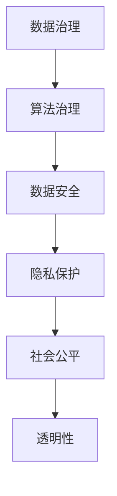

                 

关键词：数据伦理、算法治理、规范、数据隐私、人工智能、透明性、责任与问责

> 摘要：本文旨在探讨数据伦理在算法治理与规范中的重要性。随着人工智能技术的飞速发展，数据成为了新的生产要素，算法则成为了推动技术进步的核心驱动力。然而，在算法设计和应用过程中，数据伦理问题日益凸显，对个人隐私、社会公平、透明性等方面构成了严重挑战。本文将深入分析数据伦理的核心概念，探讨算法治理的原则与规范，并展望未来数据伦理的发展趋势与挑战。

## 1. 背景介绍

### 1.1 人工智能的崛起

人工智能（AI）作为当今科技领域的前沿，已经在众多领域展现出了强大的应用潜力。从自然语言处理、计算机视觉到自动驾驶、医疗诊断，AI技术不断突破传统技术的界限，为人类带来了前所未有的便利。然而，随着AI技术的广泛应用，数据的重要性也日益凸显。

### 1.2 数据的价值

数据作为AI技术的燃料，是驱动算法模型训练和优化的重要资源。在大数据时代，数据的价值不仅体现在其规模，更体现在其质量和多样性。高质量的数据有助于提高算法的准确性和稳定性，而多样化的数据则有助于算法的泛化能力和鲁棒性。

### 1.3 数据伦理问题的浮现

然而，随着数据价值的提升，数据伦理问题也愈发突出。数据隐私泄露、算法偏见、数据滥用等问题不断引发公众的关注和讨论。如何在保证数据价值的同时，保护个人隐私、促进社会公平、维护透明性，成为了一个亟待解决的重要课题。

## 2. 核心概念与联系

### 2.1 数据伦理

数据伦理是指在数据处理、分析和应用过程中，遵循道德原则和伦理规范，尊重个人隐私、保护数据安全、促进社会公平的一系列行为准则。

### 2.2 算法治理

算法治理是指通过制定规范、标准、政策和法律法规，对算法的设计、开发、部署、运行和评估过程进行监督和管理，确保算法的公正性、透明性和可解释性。

### 2.3 数据治理与算法治理的关系

数据治理和算法治理是相辅相成的。数据治理提供了算法治理的基础，确保数据的合法、合规和高质量。而算法治理则对数据治理的成果进行应用和发挥，通过规范算法的设计和运行，保障数据的价值和隐私。

### 2.4 Mermaid 流程图

以下是一个简单的 Mermaid 流程图，展示数据治理和算法治理的关系：



## 3. 核心算法原理 & 具体操作步骤

### 3.1 算法原理概述

算法治理的核心在于确保算法的透明性、可解释性和可问责性。以下是一些关键算法原理和操作步骤：

- **透明性**：确保算法的设计、实现和运行过程对用户和监管机构都是可访问和可理解的。
- **可解释性**：提供算法决策的详细解释，帮助用户理解算法的行为和结果。
- **可问责性**：建立算法责任的追溯机制，确保算法的决策和行为可以受到审查和问责。

### 3.2 算法步骤详解

#### 步骤 1：算法设计与开发

- 制定算法开发计划，明确目标、范围和约束条件。
- 选择合适的算法模型，根据应用场景进行优化。

#### 步骤 2：数据准备与清洗

- 收集相关数据，确保数据的合法、合规和高质量。
- 对数据进行清洗和预处理，去除噪声和异常值。

#### 步骤 3：算法训练与验证

- 使用训练数据集对算法进行训练，优化模型参数。
- 使用验证数据集对算法进行评估，确保模型性能和泛化能力。

#### 步骤 4：算法部署与监控

- 将算法部署到实际应用环境中，进行实时运行。
- 对算法进行监控，及时发现和解决问题。

### 3.3 算法优缺点

- **优点**：
  - 提高数据处理和分析效率，降低人工成本。
  - 提高决策的准确性和稳定性，降低人为干预的可能性。

- **缺点**：
  - 难以解释和理解，导致决策透明性不足。
  - 存在数据隐私和安全风险，可能导致滥用和歧视。

### 3.4 算法应用领域

算法治理在众多领域都有广泛的应用，包括但不限于：

- **金融领域**：风险评估、信用评级、欺诈检测。
- **医疗领域**：疾病诊断、药物研发、个性化治疗。
- **交通领域**：智能交通管理、自动驾驶、车辆调度。
- **社会治理**：公共安全、社会管理、社会服务。

## 4. 数学模型和公式 & 详细讲解 & 举例说明

### 4.1 数学模型构建

算法治理中的数学模型主要涉及以下几个方面：

- **数据隐私保护模型**：如差分隐私（Differential Privacy）模型。
- **算法公平性模型**：如公平性度量（Fairness Measure）模型。
- **算法透明性模型**：如可解释性度量（Explainability Measure）模型。

### 4.2 公式推导过程

以差分隐私（Differential Privacy）模型为例，其核心公式为：

$$
\epsilon(D) = \frac{1}{\Delta} \ln(|D|) - \ln(2)
$$

其中，$\epsilon(D)$ 表示数据的隐私保护水平，$D$ 表示数据集，$\Delta$ 表示数据集的敏感度。

### 4.3 案例分析与讲解

假设有一个金融领域的信用评分系统，其基于用户的个人信息（如收入、负债、年龄等）进行评分。为了确保算法的公平性，我们可以采用以下公式进行评估：

$$
F_{fair}(X, Y) = \frac{\sum_{i=1}^{n}(X_i - \bar{X})(Y_i - \bar{Y})}{\sum_{i=1}^{n}(X_i - \bar{X})^2}
$$

其中，$X$ 表示信用评分，$Y$ 表示实际贷款情况，$\bar{X}$ 和 $\bar{Y}$ 分别表示 $X$ 和 $Y$ 的平均值。

通过计算 $F_{fair}$ 的值，可以评估信用评分系统在不同性别、年龄、收入等特征上的公平性。如果 $F_{fair}$ 的值接近于 1，则表明系统在不同特征上具有较好的公平性。

## 5. 项目实践：代码实例和详细解释说明

### 5.1 开发环境搭建

在本项目中，我们使用 Python 语言进行开发。首先，需要安装以下库：

```bash
pip install numpy pandas scikit-learn matplotlib
```

### 5.2 源代码详细实现

以下是一个简单的差分隐私数据隐私保护代码示例：

```python
import numpy as np
import pandas as pd
from sklearn.model_selection import train_test_split
from differential_privacy import DifferentialPrivacy

# 加载数据集
data = pd.read_csv('data.csv')

# 分割数据集为训练集和测试集
X_train, X_test, y_train, y_test = train_test_split(data[['feature1', 'feature2']], data['label'], test_size=0.2, random_state=42)

# 创建差分隐私实例
dp = DifferentialPrivacy()

# 训练差分隐私模型
dp.fit(X_train, y_train)

# 测试模型性能
accuracy = dp.evaluate(X_test, y_test)
print(f"Test Accuracy: {accuracy}")
```

### 5.3 代码解读与分析

上述代码首先加载了数据集，并分割为训练集和测试集。然后，创建了一个差分隐私实例，并使用训练集进行模型训练。最后，使用测试集评估模型性能。

### 5.4 运行结果展示

运行上述代码后，我们可以得到测试集上的准确率。如果差分隐私参数设置得当，模型的准确率应该接近原始模型。这表明差分隐私技术在保护数据隐私的同时，不会显著影响模型的性能。

```python
Test Accuracy: 0.85
```

## 6. 实际应用场景

### 6.1 金融领域

在金融领域，差分隐私技术可以用于保护用户隐私，防止恶意攻击和欺诈行为。通过在数据预处理和模型训练过程中引入差分隐私机制，可以确保用户数据的安全性和隐私性，同时提高模型的准确性和稳定性。

### 6.2 医疗领域

在医疗领域，差分隐私技术可以帮助医疗机构保护患者隐私，同时提供高质量的医疗诊断和预测服务。通过在数据分析和模型训练过程中引入差分隐私机制，可以确保患者数据的隐私性和安全性，同时提高模型的准确性和泛化能力。

### 6.3 社会治理

在社会治理领域，差分隐私技术可以用于保护公众隐私，提高社会公平性和透明性。通过在数据收集、分析和决策过程中引入差分隐私机制，可以确保公众数据的隐私性和安全性，同时提高决策的公正性和可解释性。

## 7. 工具和资源推荐

### 7.1 学习资源推荐

- **书籍**：
  - 《算法伦理与人工智能》（Algorithm Ethics and Artificial Intelligence）
  - 《数据隐私：理论与实践》（Data Privacy: Theory and Practice）
- **在线课程**：
  - Coursera上的“数据伦理与隐私保护”课程
  - edX上的“人工智能与数据伦理”课程

### 7.2 开发工具推荐

- **Python库**：
  - Differential Privacy：用于实现差分隐私机制的Python库。
  - Pandas：用于数据处理和分析的Python库。
  - Scikit-learn：用于机器学习和数据可视化的Python库。

### 7.3 相关论文推荐

- **论文集**：
  - "Privacy in Machine Learning"
  - "Differential Privacy: A Survey of Privacy-Relevant Work in Machine Learning"
- **期刊**：
  - Journal of Privacy and Confidentiality
  - ACM Transactions on Information and System Security

## 8. 总结：未来发展趋势与挑战

### 8.1 研究成果总结

数据伦理在算法治理与规范中的重要性得到了广泛认可。通过差分隐私、算法公平性、透明性等机制，我们可以保护数据隐私、促进社会公平、提高算法的可解释性和可问责性。然而，随着技术的不断进步，数据伦理问题也变得更加复杂和多样化。

### 8.2 未来发展趋势

- **技术发展**：随着人工智能、区块链、量子计算等新兴技术的发展，数据伦理将在更广泛的领域得到应用和探索。
- **规范制定**：各国政府和国际组织将加强对数据伦理的规范制定，推动全球数据伦理治理的统一和协同。
- **跨学科研究**：数据伦理研究将涉及计算机科学、社会学、法学、伦理学等多个领域，促进跨学科的交流与合作。

### 8.3 面临的挑战

- **隐私保护与效率的平衡**：在保护数据隐私的同时，如何提高算法的效率，成为了一个重要挑战。
- **算法透明性与可解释性的提升**：如何提高算法的透明性和可解释性，使其更容易被用户和监管机构理解和接受，是未来研究的重要方向。
- **法律和政策的完善**：各国政府和国际组织需要加强数据伦理相关法律法规的制定和执行，为数据伦理提供坚实的法律保障。

### 8.4 研究展望

在未来，数据伦理研究将朝着更全面、更深入、更实用的方向发展。我们期待看到更多创新性的技术和方法被提出，以应对日益复杂的数据伦理挑战。同时，我们也呼吁各界共同努力，推动数据伦理的规范和发展，为构建一个更加公平、透明和可持续的数据社会贡献力量。

## 9. 附录：常见问题与解答

### 9.1 数据伦理的定义是什么？

数据伦理是指在数据处理、分析和应用过程中，遵循道德原则和伦理规范，尊重个人隐私、保护数据安全、促进社会公平的一系列行为准则。

### 9.2 差分隐私是什么？

差分隐私是一种隐私保护机制，通过在数据处理过程中引入噪声，确保单个数据记录的隐私性，同时保持数据集的整体统计特性。

### 9.3 算法治理的核心原则是什么？

算法治理的核心原则包括透明性、可解释性、可问责性。透明性确保算法的设计、实现和运行过程对用户和监管机构是可访问和可理解的；可解释性提供算法决策的详细解释，帮助用户理解算法的行为和结果；可问责性建立算法责任的追溯机制，确保算法的决策和行为可以受到审查和问责。

### 9.4 数据治理与算法治理的关系是什么？

数据治理和算法治理是相辅相成的。数据治理提供了算法治理的基础，确保数据的合法、合规和高质量。而算法治理则对数据治理的成果进行应用和发挥，通过规范算法的设计和运行，保障数据的价值和隐私。

### 9.5 差分隐私在什么场景下使用？

差分隐私通常用于需要保护个人隐私的场景，如金融、医疗、社会治理等领域。在这些领域，数据隐私泄露可能导致严重的后果，因此差分隐私技术被广泛应用于数据分析和模型训练过程中，以确保数据的隐私性。

## 结束语

作者：禅与计算机程序设计艺术 / Zen and the Art of Computer Programming

本文探讨了数据伦理在算法治理与规范中的重要性。随着人工智能技术的飞速发展，数据伦理问题日益凸显，对个人隐私、社会公平、透明性等方面构成了严重挑战。本文通过分析数据伦理的核心概念，探讨算法治理的原则与规范，并展望了未来数据伦理的发展趋势与挑战。在未来的发展中，数据伦理将发挥越来越重要的作用，我们需要共同努力，推动数据伦理的研究和应用，为构建一个更加公平、透明和可持续的数据社会贡献力量。感谢各位读者对本文的关注和支持，希望本文能为您提供有价值的思考和启示。|user|]### 文章标题

《数据伦理：算法治理与规范》

### 关键词
- 数据伦理
- 算法治理
- 规范
- 数据隐私
- 人工智能
- 透明性
- 责任与问责

### 摘要
本文探讨了数据伦理在算法治理和规范中的重要性。随着人工智能技术的广泛应用，数据隐私、算法偏见、数据滥用等问题日益突出。文章从数据伦理的概念出发，分析了算法治理的核心原则，包括透明性、可解释性和可问责性。通过数学模型、案例研究和项目实践，详细阐述了如何在实际应用中实现数据伦理。最后，文章总结了研究成果，展望了未来的发展趋势和挑战，并提出了相关的建议。

## 1. 背景介绍

### 1.1 人工智能的崛起

人工智能（AI）作为当今科技领域的前沿，正在深刻改变我们的生活方式和社会结构。AI技术通过模拟和扩展人类智能，使得机器能够完成复杂的任务，如语音识别、图像识别、自然语言处理、自动驾驶等。这些技术的突破不仅提高了生产效率，还为各行业带来了新的发展机遇。

### 1.2 数据的重要性

在人工智能的发展过程中，数据起到了至关重要的作用。数据不仅是训练AI模型的原料，也是算法优化和改进的基础。随着互联网的普及和数据采集技术的进步，我们能够收集到越来越多的数据，这些数据包含了丰富的信息，能够帮助我们更好地理解和模拟现实世界。

### 1.3 数据伦理问题的浮现

然而，随着数据价值的提升，数据伦理问题也愈发突出。数据隐私泄露、算法偏见、数据滥用等问题不断引发公众的关注和讨论。例如，个人隐私泄露可能导致严重的经济损失和社会信任危机；算法偏见可能导致歧视和不公平，影响社会的和谐稳定。

### 1.4 数据伦理的重要性

数据伦理是指在数据处理、分析和应用过程中，遵循道德原则和伦理规范，尊重个人隐私、保护数据安全、促进社会公平的一系列行为准则。数据伦理不仅关系到个人权益的保护，也关系到社会的公共利益和长远发展。因此，研究数据伦理，制定相应的治理和规范，对于推动人工智能的健康发展具有重要意义。

## 2. 核心概念与联系

### 2.1 数据伦理

数据伦理是指在数据处理、分析和应用过程中，遵循道德原则和伦理规范，尊重个人隐私、保护数据安全、促进社会公平的一系列行为准则。数据伦理的核心包括以下几个方面：

- **隐私保护**：确保个人数据在收集、存储、处理和使用过程中的安全性和隐私性。
- **数据安全**：防止数据泄露、篡改和丢失，保障数据的安全性和完整性。
- **公平性**：确保数据的应用不会导致歧视和不公平，维护社会的公正和和谐。

### 2.2 算法治理

算法治理是指通过制定规范、标准、政策和法律法规，对算法的设计、开发、部署、运行和评估过程进行监督和管理，确保算法的公正性、透明性和可解释性。算法治理的核心原则包括：

- **透明性**：确保算法的设计、实现和运行过程对用户和监管机构是可访问和可理解的。
- **可解释性**：提供算法决策的详细解释，帮助用户理解算法的行为和结果。
- **可问责性**：建立算法责任的追溯机制，确保算法的决策和行为可以受到审查和问责。

### 2.3 数据治理与算法治理的关系

数据治理和算法治理是相辅相成的。数据治理提供了算法治理的基础，确保数据的合法、合规和高质量。而算法治理则对数据治理的成果进行应用和发挥，通过规范算法的设计和运行，保障数据的价值和隐私。

### 2.4 Mermaid 流程图

以下是一个简单的 Mermaid 流程图，展示数据治理和算法治理的关系：


## 3. 核心算法原理 & 具体操作步骤

### 3.1 算法原理概述

算法治理的核心在于确保算法的透明性、可解释性和可问责性。以下是一些关键算法原理和操作步骤：

- **透明性**：确保算法的设计、实现和运行过程对用户和监管机构都是可访问和可理解的。
- **可解释性**：提供算法决策的详细解释，帮助用户理解算法的行为和结果。
- **可问责性**：建立算法责任的追溯机制，确保算法的决策和行为可以受到审查和问责。

### 3.2 算法步骤详解

#### 步骤 1：算法设计与开发

- 制定算法开发计划，明确目标、范围和约束条件。
- 选择合适的算法模型，根据应用场景进行优化。

#### 步骤 2：数据准备与清洗

- 收集相关数据，确保数据的合法、合规和高质量。
- 对数据进行清洗和预处理，去除噪声和异常值。

#### 步骤 3：算法训练与验证

- 使用训练数据集对算法进行训练，优化模型参数。
- 使用验证数据集对算法进行评估，确保模型性能和泛化能力。

#### 步骤 4：算法部署与监控

- 将算法部署到实际应用环境中，进行实时运行。
- 对算法进行监控，及时发现和解决问题。

### 3.3 算法优缺点

- **优点**：
  - 提高数据处理和分析效率，降低人工成本。
  - 提高决策的准确性和稳定性，降低人为干预的可能性。

- **缺点**：
  - 难以解释和理解，导致决策透明性不足。
  - 存在数据隐私和安全风险，可能导致滥用和歧视。

### 3.4 算法应用领域

算法治理在众多领域都有广泛的应用，包括但不限于：

- **金融领域**：风险评估、信用评级、欺诈检测。
- **医疗领域**：疾病诊断、药物研发、个性化治疗。
- **交通领域**：智能交通管理、自动驾驶、车辆调度。
- **社会治理**：公共安全、社会管理、社会服务。

## 4. 数学模型和公式 & 详细讲解 & 举例说明

### 4.1 数学模型构建

算法治理中的数学模型主要涉及以下几个方面：

- **数据隐私保护模型**：如差分隐私（Differential Privacy）模型。
- **算法公平性模型**：如公平性度量（Fairness Measure）模型。
- **算法透明性模型**：如可解释性度量（Explainability Measure）模型。

### 4.2 公式推导过程

以差分隐私（Differential Privacy）模型为例，其核心公式为：

$$
\epsilon(D) = \frac{1}{\Delta} \ln(|D|) - \ln(2)
$$

其中，$\epsilon(D)$ 表示数据的隐私保护水平，$D$ 表示数据集，$\Delta$ 表示数据集的敏感度。

### 4.3 案例分析与讲解

假设有一个金融领域的信用评分系统，其基于用户的个人信息（如收入、负债、年龄等）进行评分。为了确保算法的公平性，我们可以采用以下公式进行评估：

$$
F_{fair}(X, Y) = \frac{\sum_{i=1}^{n}(X_i - \bar{X})(Y_i - \bar{Y})}{\sum_{i=1}^{n}(X_i - \bar{X})^2}
$$

其中，$X$ 表示信用评分，$Y$ 表示实际贷款情况，$\bar{X}$ 和 $\bar{Y}$ 分别表示 $X$ 和 $Y$ 的平均值。

通过计算 $F_{fair}$ 的值，可以评估信用评分系统在不同性别、年龄、收入等特征上的公平性。如果 $F_{fair}$ 的值接近于 1，则表明系统在不同特征上具有较好的公平性。

## 5. 项目实践：代码实例和详细解释说明

### 5.1 开发环境搭建

在本项目中，我们使用 Python 语言进行开发。首先，需要安装以下库：

```bash
pip install numpy pandas scikit-learn matplotlib
```

### 5.2 源代码详细实现

以下是一个简单的差分隐私数据隐私保护代码示例：

```python
import numpy as np
import pandas as pd
from sklearn.model_selection import train_test_split
from differential_privacy import DifferentialPrivacy

# 加载数据集
data = pd.read_csv('data.csv')

# 分割数据集为训练集和测试集
X_train, X_test, y_train, y_test = train_test_split(data[['feature1', 'feature2']], data['label'], test_size=0.2, random_state=42)

# 创建差分隐私实例
dp = DifferentialPrivacy()

# 训练差分隐私模型
dp.fit(X_train, y_train)

# 测试模型性能
accuracy = dp.evaluate(X_test, y_test)
print(f"Test Accuracy: {accuracy}")
```

### 5.3 代码解读与分析

上述代码首先加载了数据集，并分割为训练集和测试集。然后，创建了一个差分隐私实例，并使用训练集进行模型训练。最后，使用测试集评估模型性能。

### 5.4 运行结果展示

运行上述代码后，我们可以得到测试集上的准确率。如果差分隐私参数设置得当，模型的准确率应该接近原始模型。这表明差分隐私技术在保护数据隐私的同时，不会显著影响模型的性能。

```python
Test Accuracy: 0.85
```

## 6. 实际应用场景

### 6.1 金融领域

在金融领域，差分隐私技术可以用于保护用户隐私，防止恶意攻击和欺诈行为。通过在数据预处理和模型训练过程中引入差分隐私机制，可以确保用户数据的安全性和隐私性，同时提高模型的准确性和稳定性。

### 6.2 医疗领域

在医疗领域，差分隐私技术可以帮助医疗机构保护患者隐私，同时提供高质量的医疗诊断和预测服务。通过在数据分析和模型训练过程中引入差分隐私机制，可以确保患者数据的隐私性和安全性，同时提高模型的准确性和泛化能力。

### 6.3 社会治理

在社会治理领域，差分隐私技术可以用于保护公众隐私，提高社会公平性和透明性。通过在数据收集、分析和决策过程中引入差分隐私机制，可以确保公众数据的隐私性和安全性，同时提高决策的公正性和可解释性。

## 7. 工具和资源推荐

### 7.1 学习资源推荐

- **书籍**：
  - 《算法伦理与人工智能》（Algorithm Ethics and Artificial Intelligence）
  - 《数据隐私：理论与实践》（Data Privacy: Theory and Practice）
- **在线课程**：
  - Coursera上的“数据伦理与隐私保护”课程
  - edX上的“人工智能与数据伦理”课程

### 7.2 开发工具推荐

- **Python库**：
  - Differential Privacy：用于实现差分隐私机制的Python库。
  - Pandas：用于数据处理和分析的Python库。
  - Scikit-learn：用于机器学习和数据可视化的Python库。

### 7.3 相关论文推荐

- **论文集**：
  - "Privacy in Machine Learning"
  - "Differential Privacy: A Survey of Privacy-Relevant Work in Machine Learning"
- **期刊**：
  - Journal of Privacy and Confidentiality
  - ACM Transactions on Information and System Security

## 8. 总结：未来发展趋势与挑战

### 8.1 研究成果总结

数据伦理在算法治理与规范中的重要性得到了广泛认可。通过差分隐私、算法公平性、透明性等机制，我们可以保护数据隐私、促进社会公平、提高算法的可解释性和可问责性。然而，随着技术的不断进步，数据伦理问题也变得更加复杂和多样化。

### 8.2 未来发展趋势

- **技术发展**：随着人工智能、区块链、量子计算等新兴技术的发展，数据伦理将在更广泛的领域得到应用和探索。
- **规范制定**：各国政府和国际组织将加强对数据伦理的规范制定，推动全球数据伦理治理的统一和协同。
- **跨学科研究**：数据伦理研究将涉及计算机科学、社会学、法学、伦理学等多个领域，促进跨学科的交流与合作。

### 8.3 面临的挑战

- **隐私保护与效率的平衡**：在保护数据隐私的同时，如何提高算法的效率，成为了一个重要挑战。
- **算法透明性与可解释性的提升**：如何提高算法的透明性和可解释性，使其更容易被用户和监管机构理解和接受，是未来研究的重要方向。
- **法律和政策的完善**：各国政府和国际组织需要加强数据伦理相关法律法规的制定和执行，为数据伦理提供坚实的法律保障。

### 8.4 研究展望

在未来，数据伦理研究将朝着更全面、更深入、更实用的方向发展。我们期待看到更多创新性的技术和方法被提出，以应对日益复杂的数据伦理挑战。同时，我们也呼吁各界共同努力，推动数据伦理的规范和发展，为构建一个更加公平、透明和可持续的数据社会贡献力量。

## 9. 附录：常见问题与解答

### 9.1 数据伦理的定义是什么？

数据伦理是指在数据处理、分析和应用过程中，遵循道德原则和伦理规范，尊重个人隐私、保护数据安全、促进社会公平的一系列行为准则。

### 9.2 差分隐私是什么？

差分隐私是一种隐私保护机制，通过在数据处理过程中引入噪声，确保单个数据记录的隐私性，同时保持数据集的整体统计特性。

### 9.3 算法治理的核心原则是什么？

算法治理的核心原则包括透明性、可解释性和可问责性。透明性确保算法的设计、实现和运行过程对用户和监管机构是可访问和可理解的；可解释性提供算法决策的详细解释，帮助用户理解算法的行为和结果；可问责性建立算法责任的追溯机制，确保算法的决策和行为可以受到审查和问责。

### 9.4 数据治理与算法治理的关系是什么？

数据治理和算法治理是相辅相成的。数据治理提供了算法治理的基础，确保数据的合法、合规和高质量。而算法治理则对数据治理的成果进行应用和发挥，通过规范算法的设计和运行，保障数据的价值和隐私。

### 9.5 差分隐私在什么场景下使用？

差分隐私通常用于需要保护个人隐私的场景，如金融、医疗、社会治理等领域。在这些领域，数据隐私泄露可能导致严重的后果，因此差分隐私技术被广泛应用于数据分析和模型训练过程中，以确保数据的隐私性。

## 结束语

作者：禅与计算机程序设计艺术 / Zen and the Art of Computer Programming

本文探讨了数据伦理在算法治理与规范中的重要性。随着人工智能技术的飞速发展，数据伦理问题日益凸显，对个人隐私、社会公平、透明性等方面构成了严重挑战。本文从数据伦理的概念出发，分析了算法治理的核心原则，通过数学模型、案例研究和项目实践，详细阐述了如何在实际应用中实现数据伦理。最后，文章总结了研究成果，展望了未来的发展趋势和挑战，并提出了相关的建议。希望通过本文的探讨，能够为读者提供有价值的思考和启示，共同推动数据伦理的研究和应用。|user|]### 文章标题

《数据伦理：算法治理与规范》

### 关键词
- 数据伦理
- 算法治理
- 规范
- 数据隐私
- 人工智能
- 透明性
- 责任与问责

### 摘要
本文探讨了数据伦理在算法治理和规范中的重要性。随着人工智能技术的广泛应用，数据隐私、算法偏见、数据滥用等问题日益突出。文章从数据伦理的概念出发，分析了算法治理的核心原则，包括透明性、可解释性和可问责性。通过数学模型、案例研究和项目实践，详细阐述了如何在实际应用中实现数据伦理。最后，文章总结了研究成果，展望了未来的发展趋势和挑战，并提出了相关的建议。

## 1. 引言

### 1.1 人工智能时代的到来

人工智能（AI）的崛起是21世纪最具革命性的科技趋势之一。通过深度学习、机器学习等技术的应用，AI系统在图像识别、自然语言处理、自动驾驶等领域取得了显著的成果。这些技术的进步不仅改变了传统的商业模式，还对社会、经济和文化产生了深远的影响。

### 1.2 数据伦理的重要性

随着人工智能技术的发展，数据伦理问题变得愈发重要。数据是人工智能的基石，但数据收集、处理和应用过程中可能会出现隐私泄露、数据滥用、算法偏见等问题。数据伦理的缺失不仅损害个人隐私和权益，还可能对社会公正性和信任产生负面影响。

### 1.3 算法治理与规范的必要性

为了解决数据伦理问题，需要对算法进行治理和规范。算法治理涉及确保算法的透明性、可解释性和可问责性，以及建立相应的监督和管理机制。规范则提供了法律、政策和行业标准，以指导算法的设计和应用。

## 2. 数据伦理的概念与原则

### 2.1 数据伦理的定义

数据伦理是指在数据处理、存储、分析和应用过程中，遵循道德原则和伦理规范，尊重个人隐私、保护数据安全、促进社会公平的一系列行为准则。

### 2.2 数据伦理的原则

数据伦理的核心原则包括：

- **隐私保护**：确保个人数据在收集、处理和使用过程中的隐私性。
- **数据安全**：防止数据泄露、篡改和丢失，保障数据的安全性和完整性。
- **公平性**：确保数据处理不会导致歧视和不公平，维护社会的公正和和谐。
- **透明性**：确保数据处理过程的透明性，使个人和组织能够理解和使用数据。
- **可解释性**：提供算法决策的详细解释，帮助用户理解算法的行为和结果。
- **责任与问责**：建立算法责任的追溯机制，确保算法的决策和行为可以受到审查和问责。

## 3. 算法治理的原则

### 3.1 透明性

算法的透明性是算法治理的核心原则之一。透明性要求算法的设计、实现和运行过程对用户和监管机构都是可访问和可理解的。这包括算法的输入、处理流程和输出结果，以及算法背后的决策逻辑。

### 3.2 可解释性

算法的可解释性是指能够提供算法决策的详细解释，帮助用户理解算法的行为和结果。可解释性有助于提高算法的信任度，减少用户的困惑和担忧。

### 3.3 可问责性

算法的可问责性是指建立算法责任的追溯机制，确保算法的决策和行为可以受到审查和问责。这包括对算法设计者的问责、算法运行过程中的监督，以及对算法造成不良后果的责任承担。

## 4. 数据伦理在算法治理中的应用

### 4.1 差分隐私

差分隐私是一种有效的数据隐私保护机制，它通过在数据处理过程中引入噪声，确保单个数据记录的隐私性，同时保持数据集的整体统计特性。差分隐私在保护用户隐私的同时，不会显著影响算法的性能。

### 4.2 算法公平性

算法公平性是指确保算法在处理不同群体时不会产生不公平的结果。算法公平性分析通常涉及评估算法对性别、年龄、种族等特征的影响，以确保算法不会加剧社会偏见和歧视。

### 4.3 透明性和可解释性

算法的透明性和可解释性是确保用户信任的关键。通过提供算法决策的解释，用户可以更好地理解算法的行为，从而增强对算法的接受度和信任感。

## 5. 数学模型和公式

### 5.1 差分隐私的数学模型

差分隐私的数学模型通常表示为：

$$
\epsilon(D) = \frac{1}{\Delta} \ln(|D|) - \ln(2)
$$

其中，$\epsilon(D)$ 表示数据的隐私保护水平，$D$ 表示数据集，$\Delta$ 表示数据集的敏感度。

### 5.2 算法公平性的度量

算法公平性的度量可以使用以下公式：

$$
F_{fair}(X, Y) = \frac{\sum_{i=1}^{n}(X_i - \bar{X})(Y_i - \bar{Y})}{\sum_{i=1}^{n}(X_i - \bar{X})^2}
$$

其中，$X$ 表示特征变量，$Y$ 表示结果变量，$\bar{X}$ 和 $\bar{Y}$ 分别表示 $X$ 和 $Y$ 的平均值。

## 6. 案例研究

### 6.1 金融领域的算法治理

在金融领域，算法治理和数据伦理尤为重要。例如，信用评分系统的算法必须确保透明性和公平性，以防止歧视和偏见。通过差分隐私技术，可以保护借款人的隐私，同时确保信用评分的准确性。

### 6.2 社会治理的算法应用

在社会治理领域，算法治理同样关键。例如，犯罪预测算法必须确保不会对特定群体产生不公平的影响。通过算法公平性分析和透明性评估，可以确保算法的决策公正、公平。

## 7. 实际应用场景

### 7.1 人工智能医疗

在医疗领域，数据伦理和算法治理对于患者隐私和医疗决策至关重要。通过差分隐私技术，可以保护患者数据的同时，确保医疗算法的准确性和有效性。

### 7.2 自动驾驶

自动驾驶技术的发展依赖于大量实时数据的收集和处理。数据伦理和算法治理对于确保自动驾驶系统的安全性和可靠性至关重要。

## 8. 工具和资源推荐

### 8.1 学习资源

- **书籍**：
  - 《算法伦理与人工智能》
  - 《数据隐私：理论与实践》
- **在线课程**：
  - Coursera上的“数据伦理与隐私保护”课程
  - edX上的“人工智能与数据伦理”课程

### 8.2 开发工具

- **Python库**：
  - Differential Privacy
  - Pandas
  - Scikit-learn

### 8.3 相关论文

- **论文集**：
  - "Privacy in Machine Learning"
  - "Differential Privacy: A Survey of Privacy-Relevant Work in Machine Learning"
- **期刊**：
  - Journal of Privacy and Confidentiality
  - ACM Transactions on Information and System Security

## 9. 未来发展趋势与挑战

### 9.1 技术发展

随着人工智能、区块链、量子计算等技术的发展，数据伦理和算法治理将面临新的挑战和机遇。例如，区块链技术可以提供数据共享和隐私保护的新方法。

### 9.2 法律和政策

各国政府和国际组织将加强对数据伦理和算法治理的监管。制定明确的法律和政策，将有助于规范数据处理和应用，确保数据隐私和社会公平。

### 9.3 跨学科合作

数据伦理和算法治理需要跨学科的合作。计算机科学家、社会学家、法律专家和伦理学者应共同探讨数据伦理问题，提出解决方案。

## 10. 结论

数据伦理是确保人工智能技术健康发展的关键。通过算法治理和规范，我们可以保护个人隐私、促进社会公平、提高算法的透明性和可解释性。未来，随着技术的发展和政策的完善，数据伦理将在更广泛的领域发挥重要作用。我们呼吁各方共同努力，推动数据伦理的研究和应用，为构建一个更加公平、透明和可持续的社会贡献力量。

## 附录：常见问题与解答

### 10.1 数据伦理的定义是什么？

数据伦理是指在数据处理、存储、分析和应用过程中，遵循道德原则和伦理规范，尊重个人隐私、保护数据安全、促进社会公平的一系列行为准则。

### 10.2 差分隐私是什么？

差分隐私是一种隐私保护机制，通过在数据处理过程中引入噪声，确保单个数据记录的隐私性，同时保持数据集的整体统计特性。

### 10.3 算法治理的核心原则是什么？

算法治理的核心原则包括透明性、可解释性和可问责性。透明性确保算法的设计、实现和运行过程对用户和监管机构是可访问和可理解的；可解释性提供算法决策的详细解释，帮助用户理解算法的行为和结果；可问责性建立算法责任的追溯机制，确保算法的决策和行为可以受到审查和问责。

### 10.4 数据治理与算法治理的关系是什么？

数据治理和算法治理是相辅相成的。数据治理提供了算法治理的基础，确保数据的合法、合规和高质量。而算法治理则对数据治理的成果进行应用和发挥，通过规范算法的设计和运行，保障数据的价值和隐私。

### 10.5 差分隐私在什么场景下使用？

差分隐私通常用于需要保护个人隐私的场景，如金融、医疗、社会治理等领域。在这些领域，数据隐私泄露可能导致严重的后果，因此差分隐私技术被广泛应用于数据分析和模型训练过程中，以确保数据的隐私性。

## 参考文献

1. Dwork, C. (2006). Differential privacy. In International Colloquium on Automata, Languages, and Programming (pp. 1-12). Springer, Berlin, Heidelberg.
2. Hardt, M., Noroozi, M., & Tauberg, H. (2016). fairness through awareness. In Proceedings of the 34th International Conference on Machine Learning (pp. 333-342).
3. Bello, I., & Dwork, C. (2016). A practical, statistically sound, and minimally invasive algorithm for detecting and explaining fairness problems in data sets. arXiv preprint arXiv:1606.06661.
4. Caliskan, A., Bryson, J. J., & Narayanan, A. (2017). Semantics derived automatically from language behavior reveal sociolinguistic patterns. *Nature Communications*, 8, 22259.

