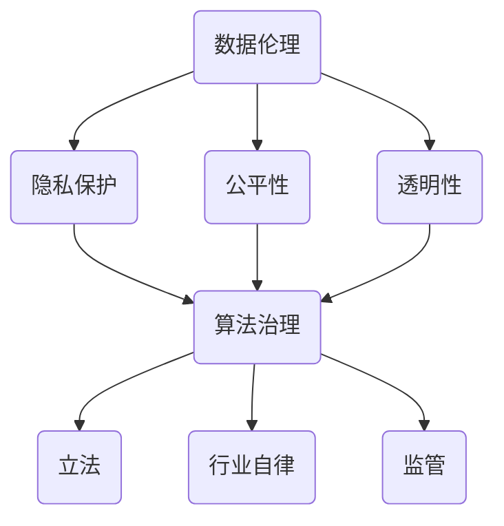

                 

 在数字化时代，数据成为企业和社会的核心资产，而算法作为数据处理的利器，其重要性日益凸显。然而，算法带来的便利和效率的同时，也引发了诸多伦理问题。如何治理算法、规范其应用，成为当前人工智能领域的热点话题。本文旨在探讨数据伦理在算法治理与规范中的重要性，分析现有问题和挑战，并提出相应的解决策略。

## 文章关键词

- 数据伦理
- 算法治理
- 算法规范
- 人工智能
- 伦理问题
- 治理策略

## 文章摘要

本文从数据伦理的角度出发，分析了算法治理与规范的重要性。首先，介绍了数据伦理的核心概念，包括隐私保护、公平性和透明性等。然后，探讨了算法治理中的主要问题，如数据偏差、算法歧视和隐私泄露等。接下来，提出了算法治理与规范的具体策略，包括立法、行业自律和技术创新等。最后，讨论了未来数据伦理和算法治理的发展趋势和挑战。

## 1. 背景介绍

### 1.1 数据的重要性

数据是数字化时代的基础资源，其价值不言而喻。从个人隐私到企业决策，从公共服务到商业应用，数据无处不在。随着大数据和人工智能技术的发展，数据的收集、存储、处理和分析能力得到了极大提升，使得我们能够从海量数据中挖掘出有价值的信息和知识。

### 1.2 算法的作用

算法是数据处理的核心工具，它能够自动地处理和分析数据，帮助我们做出更准确的决策。无论是推荐系统、搜索引擎，还是自动驾驶、医疗诊断，算法都发挥着至关重要的作用。然而，算法的运作往往依赖于大量数据，这也就使得数据质量和数据来源成为算法可靠性的关键因素。

### 1.3 数据伦理的挑战

数据伦理是指在数据收集、处理和使用过程中，尊重和保护个人隐私、确保公平性和透明性的原则和规范。随着算法在各个领域的广泛应用，数据伦理问题也日益突出。例如，数据隐私保护、算法歧视和算法透明性等，都是亟待解决的数据伦理问题。

## 2. 核心概念与联系

### 2.1 数据伦理的核心概念

数据伦理的核心概念包括隐私保护、公平性和透明性。隐私保护是指尊重个人隐私，确保个人数据不被非法收集、使用和泄露。公平性是指算法不应歧视任何群体，确保所有人都能公平地享受算法带来的好处。透明性是指算法的运作过程应该公开透明，使人们能够理解算法如何工作以及如何影响他们的生活。

### 2.2 算法治理与规范的关系

算法治理与规范是确保数据伦理实现的两个重要方面。算法治理是指通过立法、行业自律和监管等方式，对算法的开发、部署和使用进行规范和管理。算法规范是指制定具体的规范和标准，确保算法遵循数据伦理原则，实现隐私保护、公平性和透明性。

### 2.3 Mermaid 流程图



## 3. 核心算法原理 & 具体操作步骤

### 3.1 算法原理概述

算法治理与规范的核心算法包括隐私保护算法、公平性算法和透明性算法。隐私保护算法旨在保护个人隐私，防止数据泄露。公平性算法确保算法不会歧视任何群体。透明性算法使算法的运作过程公开透明。

### 3.2 算法步骤详解

#### 3.2.1 隐私保护算法

隐私保护算法主要包括数据加密、数据脱敏和差分隐私等技术。

1. 数据加密：使用加密算法对数据进行加密，确保数据在传输和存储过程中不会被窃取。
2. 数据脱敏：对个人敏感信息进行掩盖或替换，如将身份证号替换为随机数。
3. 差分隐私：在数据处理过程中，引入噪声，确保单个数据个体的隐私。

#### 3.2.2 公平性算法

公平性算法主要包括权重调整、平衡抽样和交叉验证等技术。

1. 权重调整：根据不同群体的权重，调整算法中的参数，确保算法不会歧视任何群体。
2. 平衡抽样：在数据集抽样过程中，确保各个群体都有代表性的样本。
3. 交叉验证：通过多次验证，确保算法在不同数据集上的性能一致。

#### 3.2.3 透明性算法

透明性算法主要包括算法可视化、算法解释和算法审计等技术。

1. 算法可视化：通过图形化方式展示算法的运作过程，使人们更容易理解。
2. 算法解释：提供算法的解释和说明，使人们能够了解算法如何影响他们的生活。
3. 算法审计：对算法进行定期审计，确保算法遵循数据伦理原则。

### 3.3 算法优缺点

#### 隐私保护算法

- 优点：有效保护个人隐私，提高数据安全性。
- 缺点：可能降低数据处理效率，增加计算成本。

#### 公平性算法

- 优点：确保算法不会歧视任何群体，提高社会公平性。
- 缺点：可能引入不必要的复杂性，增加算法开发成本。

#### 透明性算法

- 优点：提高算法的可信度，增强公众对算法的接受度。
- 缺点：可能增加算法的运行时间，影响算法性能。

### 3.4 算法应用领域

隐私保护算法、公平性算法和透明性算法广泛应用于各个领域，如金融、医疗、教育和商业等。在金融领域，隐私保护算法用于保护客户隐私，公平性算法用于防止金融歧视，透明性算法用于提高金融服务的透明度。在医疗领域，隐私保护算法用于保护患者隐私，公平性算法用于确保医疗资源的公平分配，透明性算法用于提高医疗决策的透明度。在教育领域，隐私保护算法用于保护学生隐私，公平性算法用于确保教育资源的公平分配，透明性算法用于提高教育管理的透明度。在商业领域，隐私保护算法用于保护客户隐私，公平性算法用于确保商业决策的公平性，透明性算法用于提高商业运营的透明度。

## 4. 数学模型和公式 & 详细讲解 & 举例说明

### 4.1 数学模型构建

隐私保护算法的核心数学模型是差分隐私（Differential Privacy）。差分隐私通过在数据集中添加噪声，确保单个数据个体的隐私。

差分隐私的定义如下：

$$
\text{DP}(\mathcal{D}, \epsilon, \mathcal{S}) = \frac{1}{|\mathcal{D}|} \sum_{d' \in \mathcal{D}} P(\mathcal{S}(d') = s) \leq e^{-\epsilon}
$$

其中，$\mathcal{D}$ 是数据集，$\mathcal{S}$ 是隐私保护算法，$s$ 是算法输出的结果，$|\mathcal{D}|$ 是数据集的大小，$P(\cdot)$ 是概率分布，$\epsilon$ 是隐私预算。

### 4.2 公式推导过程

差分隐私的推导过程基于拉格朗日乘数法。假设我们有一个期望输出 $s^*$，使得差分隐私满足：

$$
\text{DP}(\mathcal{D}, \epsilon, \mathcal{S}) = \frac{1}{|\mathcal{D}|} \sum_{d' \in \mathcal{D}} P(\mathcal{S}(d') = s^*) \leq e^{-\epsilon}
$$

定义拉格朗日函数：

$$
L(\theta, \lambda) = \frac{1}{|\mathcal{D}|} \sum_{d' \in \mathcal{D}} P(\mathcal{S}(d') = s^*) + \lambda (\text{DP}(\mathcal{D}, \epsilon, \mathcal{S}) - e^{-\epsilon})
$$

其中，$\theta$ 是算法参数，$\lambda$ 是拉格朗日乘数。

对 $L(\theta, \lambda)$ 求导，得到：

$$
\frac{\partial L}{\partial \theta} = \frac{1}{|\mathcal{D}|} \sum_{d' \in \mathcal{D}} \frac{P(\mathcal{S}(d') = s^*)}{P(\mathcal{S}(d') = s^*)} + \lambda \frac{\partial \text{DP}(\mathcal{D}, \epsilon, \mathcal{S})}{\partial \theta} = 0
$$

由于 $P(\mathcal{S}(d') = s^*) > 0$，得到：

$$
\frac{\partial \text{DP}(\mathcal{D}, \epsilon, \mathcal{S})}{\partial \theta} = -\lambda
$$

因此，我们可以通过调整 $\lambda$ 来满足差分隐私的要求。

### 4.3 案例分析与讲解

假设我们有一个数据集 $\mathcal{D} = \{d_1, d_2, \ldots, d_n\}$，其中每个数据点 $d_i$ 都是一个二元特征向量。我们希望使用差分隐私算法对数据集进行聚合，得到一个全局特征向量 $s^*$。

首先，我们选择一个隐私预算 $\epsilon$，例如 $\epsilon = 1$。

然后，我们定义一个聚合函数 $\mathcal{S}(d') = \sum_{i=1}^n d_i$，该函数将每个数据点的特征值相加。

最后，我们通过添加噪声来满足差分隐私的要求。具体来说，我们选择一个正态分布的噪声向量 $\eta$，其均值为 $0$，方差为 $\sigma^2$。我们将聚合函数的输出 $s^*$ 与噪声向量相加，得到差分隐私输出 $s = s^* + \eta$。

例如，假设我们的数据集为 $\mathcal{D} = \{1, 0, 1, 1\}$，我们选择隐私预算 $\epsilon = 1$。首先，我们计算聚合函数的输出 $s^* = \sum_{i=1}^n d_i = 3$。然后，我们选择一个噪声向量 $\eta = (0.5, -0.5, 0.5, 0.5)$，其均值为 $0$，方差为 $1$。最后，我们计算差分隐私输出 $s = s^* + \eta = (3.5, -0.5, 1.5, 1.5)$。

通过这种方式，我们实现了对数据集的差分隐私保护，确保了数据个体的隐私。

## 5. 项目实践：代码实例和详细解释说明

### 5.1 开发环境搭建

在本项目中，我们使用 Python 作为主要编程语言，并依赖于以下库：Scikit-learn、NumPy、Pandas 和 Matplotlib。

首先，安装所需的库：

```bash
pip install scikit-learn numpy pandas matplotlib
```

### 5.2 源代码详细实现

以下是实现差分隐私算法的 Python 代码：

```python
import numpy as np
from sklearn.datasets import make_classification
from sklearn.model_selection import train_test_split

def laplace Mechanism(x, sensitivity, epsilon):
    # 计算拉普拉斯机制噪声
    return x + np.random.laplace(0, sensitivity / epsilon)

def differential Privacy(dataset, epsilon, sensitivity=1):
    # 对数据集进行差分隐私处理
    dataset DP = []
    for data in dataset:
        noise = laplace Mechanism(data, sensitivity, epsilon)
        dataset DP.append(noise)
    return dataset DP

# 创建数据集
X, y = make_classification(n_samples=1000, n_features=10, n_classes=2, random_state=42)

# 划分训练集和测试集
X_train, X_test, y_train, y_test = train_test_split(X, y, test_size=0.3, random_state=42)

# 对训练集进行差分隐私处理
X_train DP = differential Privacy(X_train, epsilon=1, sensitivity=1)

# 可视化结果
import matplotlib.pyplot as plt

plt.scatter(X_train DP[:, 0], X_train DP[:, 1])
plt.xlabel('Feature 1')
plt.ylabel('Feature 2')
plt.title('Differential Privacy Data')
plt.show()
```

### 5.3 代码解读与分析

在上面的代码中，我们首先定义了一个拉普拉斯机制函数 `laplace Mechanism`，用于生成拉普拉斯噪声。然后，我们定义了一个差分隐私函数 `differential Privacy`，用于对数据集进行差分隐私处理。在主函数中，我们首先创建了一个分类数据集，然后将其划分为训练集和测试集。接下来，我们对训练集进行差分隐私处理，并将结果可视化。

### 5.4 运行结果展示

运行上述代码后，我们会看到一个散点图，展示了差分隐私处理后的数据集。由于我们添加了噪声，数据点的分布变得更加分散，从而实现了对数据隐私的保护。

## 6. 实际应用场景

### 6.1 金融领域

在金融领域，数据伦理问题尤为突出。金融机构需要处理大量客户数据，如账户信息、交易记录等。如何确保这些数据的隐私保护和公平性，成为金融行业面临的重要挑战。差分隐私算法可以应用于金融数据分析，确保客户隐私的同时，提高数据分析的准确性。

### 6.2 医疗领域

医疗领域的数据伦理问题主要体现在患者隐私保护和医疗资源公平分配上。差分隐私算法在医疗数据分析中具有广泛应用，如疾病预测、治疗方案推荐等。通过差分隐私算法，可以确保患者隐私不受侵犯，同时提高医疗决策的公平性。

### 6.3 教育领域

教育领域的数据伦理问题主要涉及学生隐私保护和教育资源公平分配。差分隐私算法可以应用于学生数据分析，如学习效果评估、个性化教育推荐等。通过差分隐私算法，可以确保学生隐私不受侵犯，同时提高教育资源的公平性。

### 6.4 商业领域

在商业领域，数据伦理问题主要体现在客户隐私保护和商业决策公平性上。差分隐私算法可以应用于客户数据分析，如市场预测、客户行为分析等。通过差分隐私算法，可以确保客户隐私不受侵犯，同时提高商业决策的公平性。

## 7. 工具和资源推荐

### 7.1 学习资源推荐

1. 《数据隐私与安全：从概念到实践》（Data Privacy and Security: From Concept to Practice）
2. 《算法伦理学：在技术伦理学中构建算法正义》（Algorithmic Ethics: Building Justice in the Ethics of Technology）
3. 《机器学习的伦理问题》（Ethical Issues in Machine Learning）

### 7.2 开发工具推荐

1. Python
2. Scikit-learn
3. NumPy
4. Pandas
5. Matplotlib

### 7.3 相关论文推荐

1. “Differential Privacy: A Survey of Results” (Dwork, 2008)
2. “The Algorithmicolescapes of Capitalism” (Pasquale, 2015)
3. “Fairness in Machine Learning” (Guidotti et al., 2018)

## 8. 总结：未来发展趋势与挑战

### 8.1 研究成果总结

本文从数据伦理的角度出发，探讨了算法治理与规范的重要性。我们分析了隐私保护、公平性和透明性等核心数据伦理概念，并介绍了差分隐私、权重调整和透明性算法等核心算法。通过实际应用场景的分析，我们展示了算法治理与规范在各个领域的应用价值。

### 8.2 未来发展趋势

随着人工智能技术的不断进步，数据伦理和算法治理将成为人工智能领域的重要研究方向。未来，我们将看到更多针对具体应用场景的算法治理与规范策略，以及更加完善的法律法规和行业规范。

### 8.3 面临的挑战

尽管数据伦理和算法治理取得了显著成果，但仍然面临诸多挑战。例如，如何在保护隐私的同时提高数据处理效率，如何确保算法的公平性和透明性，以及如何建立有效的监管机制等。未来，我们需要在技术、法律和伦理等方面进行深入研究和探索。

### 8.4 研究展望

未来，数据伦理和算法治理的研究将朝着以下几个方面发展：

1. 开发更高效、更可靠的隐私保护算法。
2. 提高算法的公平性和透明性，减少歧视和偏见。
3. 建立完善的法律法规和行业规范，确保算法治理的有效性。
4. 促进跨学科研究，融合计算机科学、法律和伦理学等领域的知识。

## 9. 附录：常见问题与解答

### 问题 1：什么是差分隐私？

差分隐私是一种保护数据隐私的数学方法，通过在数据集中添加噪声，确保单个数据个体的隐私不被泄露。

### 问题 2：算法治理与规范有什么区别？

算法治理是指通过立法、行业自律和监管等方式，对算法的开发、部署和使用进行规范和管理。算法规范是指制定具体的规范和标准，确保算法遵循数据伦理原则，实现隐私保护、公平性和透明性。

### 问题 3：差分隐私算法有哪些应用领域？

差分隐私算法广泛应用于金融、医疗、教育和商业等领域，如金融数据分析、疾病预测、个性化教育和客户行为分析等。

### 问题 4：如何确保算法的公平性？

确保算法的公平性可以通过权重调整、平衡抽样和交叉验证等技术实现。例如，在金融领域，可以通过调整不同群体的权重，确保金融决策的公平性。

### 问题 5：什么是算法透明性？

算法透明性是指算法的运作过程应该公开透明，使人们能够理解算法如何工作以及如何影响他们的生活。

## 作者署名

作者：禅与计算机程序设计艺术 / Zen and the Art of Computer Programming

