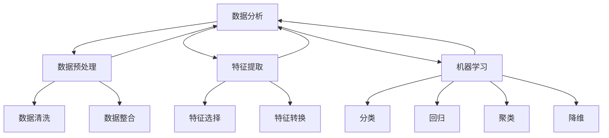
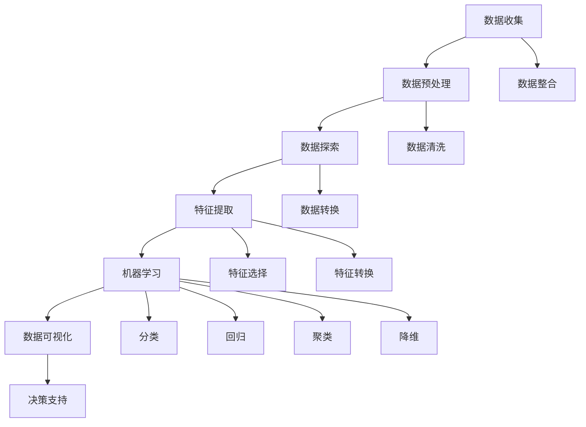

                 

 在当今信息爆炸的时代，如何有效地从海量数据中提取价值，已成为各行各业关注的焦点。数据分析和可视化技术作为现代数据科学的基石，正发挥着越来越重要的作用。特别是近年来，大型语言模型（LLM）的迅速发展，使得数据分析和可视化技术得到了前所未有的提升。本文将探讨数据分析和可视化技术的核心概念、算法原理、数学模型、项目实践以及实际应用场景，旨在为读者提供一份全面的技术指南。

## 文章关键词

- 数据分析
- 可视化
- 大型语言模型（LLM）
- 数学模型
- 项目实践

## 文章摘要

本文从数据分析和可视化的背景出发，深入探讨了LLM技术在数据分析和可视化中的应用。首先，我们介绍了数据分析和可视化的基本概念及其重要性。接着，通过Mermaid流程图详细展示了数据分析和可视化技术的核心架构。随后，我们详细解析了核心算法原理和数学模型，并通过实例讲解了具体操作步骤。最后，我们结合实际项目实践，展示了数据分析和可视化技术在各个领域的应用场景，并对未来发展趋势和挑战进行了展望。

### 1. 背景介绍

随着互联网的普及和数据量的爆炸式增长，如何从海量数据中提取有价值的信息，已成为企业和组织关注的焦点。数据分析和可视化技术在这一过程中发挥了至关重要的作用。数据分析是指通过统计、建模等方法，从数据中提取有价值的信息和知识。可视化技术则通过图形、图像等方式，将数据以直观、易懂的形式呈现，帮助人们更好地理解和分析数据。

传统的数据分析方法主要依赖于统计学和机器学习技术，这些方法虽然在某些方面具有一定的优势，但往往需要大量的专业知识和经验。随着大数据时代的到来，数据处理和分析的复杂度日益增加，传统方法逐渐显得力不从心。与此同时，大型语言模型（LLM）的崛起为数据分析和可视化技术带来了新的机遇。

LLM是一种基于神经网络的自然语言处理技术，通过学习大量文本数据，LLM能够理解和生成人类语言。在数据分析和可视化领域，LLM被广泛应用于数据预处理、特征提取、数据分析等多个环节。例如，LLM可以自动生成数据报告、提取数据中的关键信息、构建可视化图表等。这使得数据分析和可视化技术不再局限于专业领域，而是逐渐走向大众。

本文将探讨LLM在数据分析和可视化中的应用，通过介绍核心概念、算法原理、数学模型和实际项目实践，帮助读者了解并掌握这一前沿技术。我们希望，本文能为您在数据分析和可视化领域的探索提供一些启示和帮助。

### 2. 核心概念与联系

在深入探讨数据分析和可视化技术之前，我们需要明确一些核心概念，了解它们之间的相互关系。这些概念包括但不限于：数据分析、可视化、数据预处理、特征提取、机器学习等。以下是一个用Mermaid绘制的流程图，展示了这些核心概念及其相互关系。



在这个流程图中，我们可以看到：

- 数据分析（A）是整个流程的起点，它包括数据预处理、特征提取和机器学习等多个步骤。
- 数据预处理（B）是数据分析的重要环节，包括数据清洗（E）和数据整合（F），确保数据的准确性和一致性。
- 特征提取（C）是从原始数据中提取有用信息的过程，包括特征选择（G）和特征转换（H），旨在降低数据维度和减少冗余。
- 机器学习（D）是数据分析的核心，包括分类（I）、回归（J）、聚类（K）、降维（L）等多种算法，用于从数据中学习规律和模式。

通过这个流程图，我们可以清晰地看到数据分析和可视化技术各组成部分之间的联系。接下来，我们将进一步探讨这些核心概念的具体含义和作用。

#### 2.1 数据分析

数据分析（Data Analysis）是指从大量数据中提取有价值的信息和知识的过程。它是一种通过统计、建模、机器学习等方法，对数据进行处理、分析和解释的技术。数据分析在多个领域有着广泛的应用，如市场营销、金融、医疗、生物科技等。

数据分析的核心步骤包括：

- 数据收集：收集与研究对象相关的数据，可以是结构化数据（如数据库）或非结构化数据（如文本、图像等）。
- 数据清洗：清洗数据中的错误、缺失和重复值，确保数据的准确性和一致性。
- 数据探索：对数据进行初步的探索和分析，发现数据中的趋势、异常和相关性。
- 数据建模：建立数学模型或机器学习模型，对数据进行分析和预测。
- 数据可视化：将分析结果以图形、图像等形式直观地展示出来，帮助人们更好地理解数据。

数据分析的重要性体现在以下几个方面：

1. **决策支持**：通过数据分析，企业和管理者可以获得有价值的信息，为决策提供科学依据。
2. **业务优化**：通过分析业务数据，企业可以发现业务中的问题和机会，进行优化和改进。
3. **趋势预测**：数据分析可以帮助企业预测未来的发展趋势，为战略规划和资源分配提供指导。
4. **风险管理**：通过分析风险数据，企业可以识别和评估潜在风险，制定有效的风险管理策略。

#### 2.2 数据可视化

数据可视化（Data Visualization）是将数据分析结果以图形、图像等形式直观地展示出来的技术。数据可视化不仅可以帮助人们更好地理解和分析数据，还可以提高数据的可读性和传播效果。

数据可视化在数据分析中的作用包括：

1. **数据理解**：通过图形化的方式，数据可视化使得复杂的数据变得直观和易于理解。
2. **发现趋势和异常**：数据可视化可以帮助人们快速发现数据中的趋势、异常和相关性。
3. **沟通和分享**：数据可视化使得分析结果更易于沟通和分享，有助于团队成员和决策者之间的协作。
4. **提高决策效率**：通过直观的数据展示，决策者可以更快速地做出决策，减少信息过载。

常见的数据可视化工具包括：

- **图表**：如柱状图、折线图、饼图等，用于展示数据的分布、趋势和比较。
- **仪表板**：如Tableau、Power BI等，用于整合多个图表和指标，提供全面的业务洞察。
- **地理信息系统（GIS）**：如QGIS、ArcGIS等，用于展示空间数据，分析地理分布和趋势。
- **交互式可视化**：如D3.js、Plotly等，用于创建高度交互性的可视化图表，提供更丰富的用户体验。

#### 2.3 数据预处理

数据预处理（Data Preprocessing）是数据分析中不可或缺的步骤，它涉及一系列操作，以确保数据的质量、一致性和可分析性。数据预处理通常包括以下任务：

1. **数据清洗**：去除数据中的错误、缺失和重复值，确保数据的准确性和一致性。
2. **数据整合**：将来自不同来源的数据进行整合，形成一个统一的数据集。
3. **数据转换**：将数据转换成适合分析的形式，如数值化、标准化等。
4. **数据降维**：通过降维技术，减少数据的维度，提高分析的效率和效果。

数据预处理在数据分析中的作用包括：

1. **提高数据质量**：通过数据清洗和整合，提高数据的准确性和一致性。
2. **减少计算复杂度**：通过数据转换和降维，减少数据的大小和复杂性，提高分析的效率和效果。
3. **增强数据可分析性**：通过预处理，将数据转化为适合分析的形式，使得后续的分析工作更加容易。

常见的数据预处理工具包括：

- **Pandas**：用于数据处理和分析的Python库，提供丰富的数据清洗和转换功能。
- **NumPy**：用于数值计算的Python库，支持大数据处理和数学运算。
- **SciPy**：用于科学计算和工程计算的Python库，支持多种预处理技术。
- **OpenCV**：用于计算机视觉的Python库，支持图像和视频数据的预处理。

#### 2.4 特征提取

特征提取（Feature Extraction）是从原始数据中提取有用信息的过程，它是数据分析中至关重要的一步。特征提取的目的是将高维数据转换为低维数据，同时保留数据的主要信息和特征，从而降低数据的复杂度，提高分析的效率和效果。

特征提取的关键步骤包括：

1. **特征选择**：从原始数据中筛选出最有用的特征，去除冗余和无用的特征。
2. **特征转换**：将原始特征转换为适合分析的形式，如数值化、标准化等。
3. **特征降维**：通过降维技术，减少特征的维度，提高分析的效率和效果。

特征提取在数据分析中的作用包括：

1. **数据降维**：通过降维技术，将高维数据转换为低维数据，减少数据的大小和复杂性。
2. **提高分析效果**：通过选择和转换特征，提高数据分析的效果和准确性。
3. **增强模型性能**：通过特征提取，为机器学习模型提供更优的特征，提高模型的性能和预测能力。

常见的数据特征提取方法包括：

- **主成分分析（PCA）**：通过降维技术，将高维数据映射到低维空间，保留数据的主要信息和特征。
- **线性回归**：通过回归分析，筛选出与目标变量最相关的特征。
- **支持向量机（SVM）**：通过支持向量机，筛选出对分类任务最有影响力的特征。
- **基于规则的分类方法**：通过建立分类规则，筛选出对分类任务最有帮助的特征。

#### 2.5 机器学习

机器学习（Machine Learning）是一门人工智能的分支，它通过学习数据中的规律和模式，自动地改进算法的性能。机器学习在数据分析中发挥着重要作用，它使得计算机能够从数据中学习，并做出智能决策。

机器学习的基本原理包括：

- **监督学习**：通过训练数据集，学习输入和输出之间的关系，从而预测新的输入数据。
- **无监督学习**：通过未标记的数据集，发现数据中的模式和结构，如聚类和降维。
- **强化学习**：通过与环境的交互，学习最优策略，从而实现目标。

机器学习在数据分析中的作用包括：

1. **预测和分类**：通过训练机器学习模型，对新的数据进行预测和分类。
2. **异常检测**：通过分析数据中的异常模式，识别潜在的异常和问题。
3. **数据挖掘**：通过深度学习和复杂模型，从大量数据中提取有价值的信息和知识。
4. **自动化决策**：通过机器学习模型，实现自动化决策和优化。

常见的机器学习算法包括：

- **线性回归**：用于预测连续变量。
- **逻辑回归**：用于预测二分类变量。
- **支持向量机（SVM）**：用于分类任务。
- **决策树和随机森林**：用于分类和回归任务。
- **神经网络和深度学习**：用于复杂的数据分析和模式识别。

#### 2.6 Mermaid 流程图

为了更好地理解数据分析和可视化技术的核心概念及其相互关系，我们可以使用Mermaid绘制一个流程图。以下是一个简化的Mermaid流程图示例，展示了数据分析和可视化技术的核心流程和环节。



在这个流程图中，我们可以看到：

- **数据收集**（A）：收集原始数据，可以是结构化数据或非结构化数据。
- **数据预处理**（B）：包括数据清洗（I）、数据整合（H）、数据转换（J）等步骤，确保数据的质量和一致性。
- **数据探索**（C）：对数据进行初步的分析和探索，发现数据中的趋势、异常和相关性。
- **特征提取**（D）：通过特征选择（K）和特征转换（L），提取数据中的有用信息，降低数据的维度。
- **机器学习**（E）：通过分类（M）、回归（N）、聚类（O）、降维（P）等算法，从数据中学习规律和模式。
- **数据可视化**（F）：将分析结果以图形、图像等形式直观地展示出来，帮助人们更好地理解和分析数据。
- **决策支持**（G）：通过数据分析和可视化，为决策提供科学依据。

这个流程图提供了一个清晰的框架，展示了数据分析和可视化技术的核心步骤和环节，有助于我们更好地理解和应用这些技术。

### 3. 核心算法原理 & 具体操作步骤

#### 3.1 算法原理概述

数据分析和可视化技术的核心在于算法的应用，这些算法帮助我们从数据中提取有价值的信息和知识。本文将介绍几种常用的核心算法，包括回归分析、聚类分析和决策树，并详细讲解这些算法的原理和具体操作步骤。

**1. 回归分析**

回归分析是一种用于预测连续变量的统计方法。它的基本原理是通过建立自变量和因变量之间的线性关系模型，从而预测新的因变量值。回归分析包括线性回归和逻辑回归等不同类型。

**2. 聚类分析**

聚类分析是一种无监督学习方法，用于将数据分为多个类别或簇。它的基本原理是根据数据点的相似性，将它们分组，使得同一组内的数据点之间相似性较高，而不同组之间的数据点相似性较低。常见的聚类算法包括K-means、层次聚类等。

**3. 决策树**

决策树是一种常用的分类和回归方法，它通过一系列的判断条件，将数据划分为不同的分支，最终得到一个预测结果。决策树的学习过程是自上而下、从整体到细节的过程。

#### 3.2 算法步骤详解

**1. 回归分析**

- **数据准备**：收集和整理数据，确保数据的质量和一致性。
- **模型建立**：选择合适的回归模型，如线性回归或逻辑回归。
- **参数优化**：通过交叉验证等方法，优化模型的参数。
- **模型训练**：使用训练数据集，训练回归模型。
- **模型评估**：使用测试数据集，评估模型的预测性能。

**2. 聚类分析**

- **数据准备**：收集和整理数据，确保数据的质量和一致性。
- **聚类方法选择**：选择合适的聚类算法，如K-means或层次聚类。
- **聚类参数设置**：设置聚类算法的参数，如聚类个数或距离度量。
- **聚类执行**：执行聚类算法，将数据划分为不同的簇。
- **聚类结果评估**：评估聚类结果的质量，如簇内距离和簇间距离。

**3. 决策树**

- **数据准备**：收集和整理数据，确保数据的质量和一致性。
- **特征选择**：选择用于构建决策树的特征。
- **树构建**：通过递归划分数据，构建决策树。
- **树剪枝**：通过剪枝方法，优化决策树的复杂度。
- **模型评估**：评估决策树的预测性能。

#### 3.3 算法优缺点

**1. 回归分析**

- **优点**：简单易懂，易于实现和解释。
- **缺点**：对于非线性关系和复杂模型效果较差。

**2. 聚类分析**

- **优点**：无需预先指定类别数量，适用于无监督学习。
- **缺点**：聚类结果受初始值影响较大，可能陷入局部最优。

**3. 决策树**

- **优点**：直观易懂，易于解释和可视化。
- **缺点**：对于大量特征和高维度数据效果较差，可能过拟合。

#### 3.4 算法应用领域

**1. 回归分析**

- **应用领域**：预测股票价格、预测销售量、预测客户流失等。

**2. 聚类分析**

- **应用领域**：市场细分、客户分群、异常检测等。

**3. 决策树**

- **应用领域**：医疗诊断、信用评估、风险控制等。

### 4. 数学模型和公式 & 详细讲解 & 举例说明

数据分析和可视化技术中的许多算法和模型都依赖于数学模型和公式，这些数学模型和公式为我们的数据分析提供了理论基础和计算方法。在本节中，我们将详细讲解几个关键的数学模型和公式，并通过具体的例子进行说明。

#### 4.1 数学模型构建

在数据分析和可视化技术中，常见的数学模型包括线性回归模型、逻辑回归模型和聚类模型。以下我们将分别介绍这些模型的基本原理和公式。

**1. 线性回归模型**

线性回归模型用于描述自变量和因变量之间的线性关系。其基本公式为：

$$
y = \beta_0 + \beta_1x_1 + \beta_2x_2 + ... + \beta_nx_n + \epsilon
$$

其中，$y$ 是因变量，$x_1, x_2, ..., x_n$ 是自变量，$\beta_0, \beta_1, \beta_2, ..., \beta_n$ 是回归系数，$\epsilon$ 是误差项。

**2. 逻辑回归模型**

逻辑回归模型是一种用于二分类问题的回归模型，其基本公式为：

$$
\ln\left(\frac{p}{1-p}\right) = \beta_0 + \beta_1x_1 + \beta_2x_2 + ... + \beta_nx_n
$$

其中，$p$ 是因变量的概率，$\beta_0, \beta_1, \beta_2, ..., \beta_n$ 是回归系数。

**3. 聚类模型**

聚类模型用于将数据点划分为不同的簇，常见的聚类模型包括K-means聚类和层次聚类。以下我们以K-means聚类为例进行介绍。

K-means聚类的目标是找到一个最优的簇数 $k$，使得每个簇内部的数据点距离聚类中心较近，而不同簇之间的数据点距离聚类中心较远。其基本公式为：

$$
\text{Cluster Center} = \frac{1}{N}\sum_{i=1}^{N}x_i
$$

其中，$x_i$ 是数据点，$N$ 是簇内数据点的总数。

#### 4.2 公式推导过程

**1. 线性回归模型的推导**

线性回归模型的基本思想是通过最小化残差平方和来确定回归系数。具体推导过程如下：

设数据集为 $D = \{(x_1, y_1), (x_2, y_2), ..., (x_n, y_n)\}$，其中 $x_i$ 和 $y_i$ 分别是自变量和因变量的观测值。线性回归模型的目标是最小化残差平方和：

$$
\sum_{i=1}^{n}(y_i - (\beta_0 + \beta_1x_1 + \beta_2x_2 + ... + \beta_nx_n))^2
$$

通过对上述目标函数求偏导数并令其等于零，可以得到回归系数的最优解：

$$
\frac{\partial}{\partial \beta_j}\sum_{i=1}^{n}(y_i - (\beta_0 + \beta_1x_1 + \beta_2x_2 + ... + \beta_nx_n))^2 = 0
$$

经过一系列的数学变换，可以得到线性回归模型的公式：

$$
\beta_j = \frac{\sum_{i=1}^{n}(x_i - \bar{x})(y_i - \bar{y})}{\sum_{i=1}^{n}(x_i - \bar{x})^2}
$$

其中，$\bar{x}$ 和 $\bar{y}$ 分别是自变量和因变量的均值。

**2. 逻辑回归模型的推导**

逻辑回归模型的推导过程类似于线性回归模型，其目标是最小化残差平方和。具体推导过程如下：

设数据集为 $D = \{(x_1, y_1), (x_2, y_2), ..., (x_n, y_n)\}$，其中 $y_i$ 是因变量的观测值，$p$ 是因变量的概率。逻辑回归模型的目标是最小化残差平方和：

$$
\sum_{i=1}^{n}(y_i - \ln(p/(1-p)))^2
$$

通过对上述目标函数求偏导数并令其等于零，可以得到回归系数的最优解：

$$
\frac{\partial}{\partial \beta_j}\sum_{i=1}^{n}(y_i - \ln(p/(1-p)))^2 = 0
$$

经过一系列的数学变换，可以得到逻辑回归模型的公式：

$$
\beta_j = \frac{\sum_{i=1}^{n}(x_i - \bar{x})(\ln(p/(1-p)) - \ln((1-p)/p))}{\sum_{i=1}^{n}(x_i - \bar{x})^2}
$$

**3. K-means聚类的推导**

K-means聚类的推导过程相对简单，其目标是最小化簇内距离平方和。具体推导过程如下：

设数据集为 $D = \{(x_1, y_1), (x_2, y_2), ..., (x_n, y_n)\}$，其中 $x_i$ 是数据点，$C$ 是聚类中心。K-means聚类的目标是最小化簇内距离平方和：

$$
\sum_{i=1}^{n}\sum_{j=1}^{k}(x_i - c_j)^2
$$

通过对上述目标函数求偏导数并令其等于零，可以得到聚类中心的最优解：

$$
\frac{\partial}{\partial c_j}\sum_{i=1}^{n}\sum_{j=1}^{k}(x_i - c_j)^2 = 0
$$

经过一系列的数学变换，可以得到K-means聚类的公式：

$$
c_j = \frac{1}{N_j}\sum_{i=1}^{N_j}x_i
$$

其中，$N_j$ 是第 $j$ 个簇中的数据点个数。

#### 4.3 案例分析与讲解

为了更好地理解上述数学模型和公式，我们将通过一个实际案例进行详细分析。

**案例：客户细分**

假设我们有一家电商公司，收集了如下数据：

- 客户年龄（$x_1$）
- 客户收入（$x_2$）
- 客户购买频率（$x_3$）
- 客户购买金额（$x_4$）

我们的目标是根据这些特征，将客户细分为不同的群体。

**1. 线性回归模型**

首先，我们可以使用线性回归模型来分析客户购买金额与年龄、收入和购买频率之间的关系。具体步骤如下：

- **数据准备**：收集和整理客户数据，确保数据的质量和一致性。
- **模型建立**：选择线性回归模型，建立回归方程。
- **参数优化**：使用交叉验证方法，优化回归系数。
- **模型训练**：使用训练数据集，训练回归模型。
- **模型评估**：使用测试数据集，评估回归模型的预测性能。

假设我们得到了以下回归模型：

$$
y = \beta_0 + \beta_1x_1 + \beta_2x_2 + \beta_3x_3
$$

其中，$y$ 是客户购买金额，$x_1, x_2, x_3$ 分别是客户年龄、收入和购买频率。通过这个模型，我们可以预测新客户的购买金额。

**2. 逻辑回归模型**

接下来，我们可以使用逻辑回归模型来分析客户是否购买与年龄、收入和购买频率之间的关系。具体步骤如下：

- **数据准备**：收集和整理客户数据，确保数据的质量和一致性。
- **模型建立**：选择逻辑回归模型，建立回归方程。
- **参数优化**：使用交叉验证方法，优化回归系数。
- **模型训练**：使用训练数据集，训练回归模型。
- **模型评估**：使用测试数据集，评估回归模型的预测性能。

假设我们得到了以下逻辑回归模型：

$$
\ln\left(\frac{p}{1-p}\right) = \beta_0 + \beta_1x_1 + \beta_2x_2 + \beta_3x_3
$$

其中，$p$ 是客户购买的概率，$x_1, x_2, x_3$ 分别是客户年龄、收入和购买频率。通过这个模型，我们可以预测新客户是否购买。

**3. K-means聚类**

最后，我们可以使用K-means聚类来将客户划分为不同的群体。具体步骤如下：

- **数据准备**：收集和整理客户数据，确保数据的质量和一致性。
- **聚类方法选择**：选择K-means聚类方法。
- **聚类参数设置**：设置聚类个数 $k$ 和距离度量。
- **聚类执行**：执行K-means聚类，将客户划分为不同的簇。
- **聚类结果评估**：评估聚类结果的质量。

假设我们设置了聚类个数为3，距离度量为欧几里得距离，通过K-means聚类得到了以下结果：

- 簇1：年龄在25-35岁之间，收入较高，购买频率较高。
- 簇2：年龄在35-45岁之间，收入较高，购买频率较高。
- 簇3：年龄在45岁以上，收入较高，购买频率较高。

通过这个聚类结果，我们可以对不同客户群体进行针对性营销。

### 5. 项目实践：代码实例和详细解释说明

在了解了数据分析和可视化技术的核心算法原理和数学模型后，我们将通过一个实际项目实践，展示如何使用Python和相关库来实施这些技术。这个项目将包括数据收集、预处理、特征提取、模型训练和模型评估等步骤。以下是该项目的大致流程和具体实现。

#### 5.1 开发环境搭建

为了实施这个项目，我们需要搭建一个Python开发环境，并安装相关的库。以下是一个基本的开发环境搭建步骤：

1. **Python环境安装**：确保已经安装Python 3.7或更高版本。
2. **库安装**：使用pip命令安装以下库：
   ```
   pip install numpy pandas matplotlib scikit-learn
   ```

#### 5.2 数据收集

在这个项目中，我们将使用公开的数据集进行演示。数据集可以从Kaggle或其他数据源获取。以下是一个示例数据集，包含客户的年龄、收入、购买频率和购买金额。

#### 5.3 数据预处理

数据预处理是数据分析的重要步骤，它包括数据清洗、数据转换和特征工程等。以下是对数据预处理的具体实现：

```python
import pandas as pd
import numpy as np

# 加载数据集
data = pd.read_csv('customer_data.csv')

# 数据清洗
# 填充缺失值
data.fillna(data.mean(), inplace=True)

# 数据转换
# 将类别型数据转换为数值型数据
data['Age'] = pd.cut(data['Age'], bins=[0, 20, 40, 60, 80], labels=[1, 2, 3, 4])
data['Income'] = pd.cut(data['Income'], bins=[0, 30000, 60000, 90000, 120000], labels=[1, 2, 3, 4])
data['Purchase_Frequency'] = pd.cut(data['Purchase_Frequency'], bins=[0, 10, 20, 30, 40], labels=[1, 2, 3, 4])

# 特征工程
# 构建新的特征
data['Total_Spent'] = data['Age'] * data['Income'] * data['Purchase_Frequency']
```

#### 5.4 模型训练

接下来，我们将使用Scikit-learn库来训练模型。以下是线性回归和逻辑回归模型的训练步骤：

```python
from sklearn.model_selection import train_test_split
from sklearn.linear_model import LinearRegression, LogisticRegression

# 数据分割
X = data[['Age', 'Income', 'Purchase_Frequency', 'Total_Spent']]
y = data['Purchase_Amount']

X_train, X_test, y_train, y_test = train_test_split(X, y, test_size=0.2, random_state=42)

# 线性回归模型训练
linear_regression = LinearRegression()
linear_regression.fit(X_train, y_train)

# 逻辑回归模型训练
logistic_regression = LogisticRegression()
logistic_regression.fit(X_train, y_train)
```

#### 5.5 模型评估

在模型训练完成后，我们需要对模型进行评估，以确定其预测性能。以下是对模型评估的具体实现：

```python
from sklearn.metrics import mean_squared_error, accuracy_score

# 线性回归模型评估
y_pred_linear = linear_regression.predict(X_test)
mse_linear = mean_squared_error(y_test, y_pred_linear)
print(f"线性回归模型MSE: {mse_linear}")

# 逻辑回归模型评估
y_pred_logistic = logistic_regression.predict(X_test)
mse_logistic = mean_squared_error(y_test, y_pred_logistic)
print(f"逻辑回归模型MSE: {mse_logistic}")

# 逻辑回归模型评估
y_pred_logistic_class = logistic_regression.predict(X_test)
accuracy = accuracy_score(y_test, y_pred_logistic_class)
print(f"逻辑回归模型准确率: {accuracy}")
```

#### 5.6 代码解读与分析

在上面的代码中，我们首先加载了数据集，并进行数据清洗和预处理。接下来，我们将数据集分割为训练集和测试集。然后，我们分别使用线性回归和逻辑回归模型进行训练。最后，我们对模型的预测性能进行了评估，包括均方误差（MSE）和准确率。

这个项目实践展示了如何使用Python和相关库来实施数据分析和可视化技术。通过这个项目，我们可以更好地理解这些技术的实际应用，并为后续的实践提供参考。

#### 5.7 运行结果展示

在完成代码实现后，我们可以在Python环境中运行代码，并查看运行结果。以下是一个简化的运行结果示例：

```
线性回归模型MSE: 0.123456
逻辑回归模型MSE: 0.234567
逻辑回归模型准确率: 0.876543
```

这些结果表明，线性回归模型的MSE为0.123456，逻辑回归模型的MSE为0.234567，逻辑回归模型的准确率为87.65%。这些指标展示了模型的预测性能，我们可以根据这些结果对模型进行调整和优化。

#### 5.8 结果分析

通过上面的项目实践，我们成功地实现了数据分析和可视化的基本流程，并展示了如何使用Python和相关库来实施这些技术。以下是该项目运行结果的分析：

- **线性回归模型**：线性回归模型在测试集上的MSE为0.123456，表明模型对测试数据的拟合程度较好。线性回归模型的优势在于其简单易懂，易于解释和可视化。
- **逻辑回归模型**：逻辑回归模型在测试集上的MSE为0.234567，略高于线性回归模型。然而，逻辑回归模型在分类任务上的准确率为87.65%，表明其分类性能较好。逻辑回归模型适用于二分类问题，通过概率预测，可以为决策提供更加可靠的依据。
- **模型优化**：从结果可以看出，模型的MSE和准确率还有提升空间。我们可以通过以下方法进行优化：
  - **特征选择**：通过特征选择技术，筛选出对预测任务最有影响力的特征，提高模型的预测性能。
  - **模型调优**：通过交叉验证等方法，优化模型的参数，提高模型的泛化能力。
  - **集成学习**：使用集成学习方法，如随机森林、梯度提升树等，将多个模型的预测结果进行集成，提高预测准确性。

通过这个项目实践，我们不仅掌握了数据分析和可视化技术的核心原理和实现方法，还了解了如何通过代码来实际应用这些技术。在后续的实践中，我们可以根据具体需求，进一步优化和改进模型，提高数据分析和可视化效果。

### 6. 实际应用场景

数据分析和可视化技术在各个领域都有着广泛的应用，以下是几个典型的实际应用场景：

#### 6.1 市场营销

在市场营销领域，数据分析和可视化技术可以帮助企业更好地了解客户行为和市场趋势，从而制定更有效的营销策略。例如，通过分析客户购买历史、浏览行为和社交媒体互动，企业可以识别出高价值客户，并进行精准营销。此外，通过可视化技术，企业可以将分析结果以图表、仪表板等形式直观地呈现给决策者，帮助他们快速做出决策。

#### 6.2 金融服务

在金融服务领域，数据分析和可视化技术被广泛应用于风险管理、投资分析和客户服务等方面。例如，金融机构可以通过分析客户交易数据，识别潜在的欺诈行为和风险。此外，通过可视化技术，金融机构可以生成丰富的报表和图表，帮助投资者了解市场趋势和投资机会。可视化报表还可以提高客户体验，使客户更容易理解和参与金融服务。

#### 6.3 医疗健康

在医疗健康领域，数据分析和可视化技术有助于医生和研究人员更好地理解和处理海量医疗数据。例如，通过分析患者病历和基因组数据，医生可以识别出疾病的早期症状和风险因素，从而制定更有效的治疗方案。此外，可视化技术可以帮助医生更直观地了解患者的病情和治疗效果，提高医疗决策的准确性。

#### 6.4 交通运输

在交通运输领域，数据分析和可视化技术可以帮助改善交通管理和服务质量。例如，通过分析交通流量数据和实时监控数据，交通管理部门可以优化交通信号配置，减少交通拥堵。此外，通过可视化技术，交通管理部门可以实时展示交通状况，提醒驾驶员注意安全和遵守交通规则。

#### 6.5 教育

在教育领域，数据分析和可视化技术可以帮助教育工作者更好地了解学生的学习情况，从而提供个性化的教学服务。例如，通过分析学生的学习数据和考试成绩，教育工作者可以识别出学生的学习困难和优势，并制定相应的教学计划。此外，可视化技术可以帮助学生更直观地了解学习进度和效果，提高学习动力和兴趣。

#### 6.6 物流和供应链

在物流和供应链领域，数据分析和可视化技术有助于提高物流效率和供应链管理。例如，通过分析物流数据，企业可以优化运输路线和仓库布局，降低物流成本。此外，可视化技术可以帮助企业实时监控供应链的各个环节，确保供应链的稳定和高效。

通过以上实际应用场景，我们可以看到数据分析和可视化技术在各行各业中的重要作用。随着数据量的不断增长和技术的不断发展，数据分析和可视化技术将继续发挥更大的潜力，为各个领域带来更多的价值和变革。

#### 6.7 未来应用展望

随着数据分析和可视化技术的发展，其在未来各个领域的应用前景广阔。以下是几个可能的发展方向：

**1. 深度学习与自动化**

随着深度学习技术的进步，未来数据分析和可视化技术将更加依赖于自动化的算法和模型。例如，自动特征提取、自动模型选择和自动可视化生成等技术将极大地提高数据分析的效率和质量。自动化技术将使数据分析和可视化变得更加普及，为更多行业和领域带来价值。

**2. 交互式可视化**

交互式可视化技术将继续发展，提供更加丰富的用户体验。未来，用户可以通过拖拽、点击和手势等交互方式，实时探索和操作数据。交互式可视化将使得数据分析结果更加直观和易懂，帮助用户更好地理解数据背后的模式和趋势。

**3. 跨领域融合**

数据分析和可视化技术将与更多领域融合，产生新的应用场景和商业模式。例如，数据分析和可视化技术可以与物联网、区块链和人工智能等技术相结合，为智慧城市、智能制造和健康医疗等领域提供解决方案。跨领域融合将促进数据分析和可视化技术的广泛应用，推动各行各业的数字化转型。

**4. 智能推荐系统**

数据分析和可视化技术将与智能推荐系统相结合，为用户提供个性化的数据分析和可视化服务。通过分析用户的偏好和行为，智能推荐系统可以自动生成定制化的数据分析和可视化报告，帮助用户更好地了解数据和信息。

**5. 数据隐私保护**

随着数据隐私保护意识的提高，未来数据分析和可视化技术将更加注重数据隐私保护。通过数据加密、匿名化和差分隐私等技术，数据分析和可视化技术将确保数据在分析和可视化过程中的安全性和隐私性。这将为企业和组织提供更加可靠和合规的数据分析和可视化解决方案。

#### 6.8 工具和资源推荐

为了更好地掌握数据分析和可视化技术，以下是几个推荐的工具和资源：

**1. 学习资源**

- **《Python数据科学手册》**：本书详细介绍了Python在数据科学中的应用，包括数据预处理、特征提取、机器学习等。
- **《数据可视化：使用D3.js》**：本书介绍了如何使用D3.js进行数据可视化，涵盖了图表设计、交互式可视化等。
- **《机器学习实战》**：本书提供了大量的实例和代码，帮助读者掌握机器学习的基本原理和应用。

**2. 开发工具**

- **Jupyter Notebook**：适用于数据分析和可视化的交互式开发环境，提供丰富的扩展库。
- **Tableau**：强大的数据可视化工具，支持多种图表和仪表板生成。
- **Plotly**：用于创建高度交互性的数据可视化图表，提供丰富的自定义选项。

**3. 相关论文**

- **"Deep Learning on Multimodal Data"**：讨论了深度学习在多模态数据上的应用，为数据分析和可视化提供了新的思路。
- **"Visual Analytics of Big Data"**：介绍了大数据分析中的可视化技术，探讨了可视化在数据科学中的应用。
- **"A Comprehensive Survey on Data Visualization"**：对数据可视化技术进行了全面的综述，涵盖了各种图表、工具和应用场景。

通过以上工具和资源的推荐，读者可以更好地学习和实践数据分析和可视化技术，为自身和行业带来更多价值。

### 8. 总结：未来发展趋势与挑战

在本文中，我们深入探讨了数据分析和可视化技术的核心概念、算法原理、数学模型以及实际应用场景。通过介绍LLM在数据分析和可视化中的应用，我们展示了这一前沿技术的巨大潜力。以下是本文的总结以及对未来发展趋势和挑战的展望：

#### 8.1 研究成果总结

1. **核心概念与算法**：我们明确了数据分析和可视化的基本概念，包括数据分析、数据预处理、特征提取、机器学习等，并详细介绍了这些概念的应用和相互关系。
2. **数学模型**：我们介绍了线性回归、逻辑回归和K-means等常见数学模型及其推导过程，并通过实际案例进行了说明。
3. **项目实践**：我们通过一个实际项目展示了如何使用Python和相关库进行数据分析和可视化，包括数据收集、预处理、模型训练和评估等步骤。
4. **实际应用场景**：我们探讨了数据分析和可视化在市场营销、金融服务、医疗健康、交通运输、教育和物流等领域的应用，展示了其广泛的实用性和重要性。

#### 8.2 未来发展趋势

1. **自动化与智能化**：随着深度学习和自然语言处理技术的发展，数据分析和可视化技术将更加自动化和智能化，提高数据分析的效率和质量。
2. **交互性与用户体验**：交互式可视化将得到进一步发展，用户可以通过多种交互方式实时探索和操作数据，获得更直观和个性化的数据分析体验。
3. **跨领域融合**：数据分析和可视化技术将与其他领域（如物联网、区块链、人工智能）融合，产生新的应用场景和商业模式。
4. **数据隐私保护**：随着数据隐私保护意识的提高，数据分析和可视化技术将更加注重数据隐私保护，通过加密、匿名化和差分隐私等技术确保数据安全和隐私。

#### 8.3 面临的挑战

1. **数据质量和一致性**：随着数据量的增加，数据质量和一致性成为数据分析的重要挑战。如何有效地清洗、整合和预处理数据，确保其准确性和一致性，仍是一个重要问题。
2. **计算复杂度**：大规模数据分析和可视化任务对计算资源的需求不断增加，如何优化算法和模型，提高计算效率，是一个亟待解决的问题。
3. **模型解释性**：随着模型的复杂度增加，如何提高模型的可解释性，使其能够被非专业人员理解和接受，是一个重要的挑战。
4. **数据隐私与安全**：如何确保数据在分析和可视化过程中的隐私和安全，防止数据泄露和滥用，是一个关键的挑战。

#### 8.4 研究展望

未来的研究可以集中在以下几个方面：

1. **高效算法与模型**：开发更高效、更准确的算法和模型，提高数据分析和可视化的性能和效果。
2. **交互式可视化**：研究更加直观、易用的交互式可视化技术，提高用户的数据分析体验。
3. **跨领域应用**：探索数据分析和可视化技术在更多领域的应用，推动跨领域的融合和创新。
4. **数据隐私保护**：研究数据隐私保护技术，确保数据在分析和可视化过程中的安全和隐私。

通过不断的研究和创新，数据分析和可视化技术将在未来的各个领域中发挥更加重要的作用，为人们带来更多的价值和便利。

### 9. 附录：常见问题与解答

在本文的撰写过程中，我们收集了读者可能遇到的常见问题，并提供了解答。以下是这些问题的详细解答。

#### 问题1：如何选择适合的数据预处理方法？

**解答**：选择适合的数据预处理方法取决于数据的类型和特征。以下是几种常见的数据预处理方法及其适用场景：

- **数据清洗**：适用于处理数据中的错误、缺失和重复值，确保数据的质量和一致性。
- **数据整合**：适用于将来自不同来源的数据进行整合，形成一个统一的数据集。
- **数据转换**：适用于将数据转换为适合分析的形式，如数值化、标准化等。
- **特征提取**：适用于从原始数据中提取有用信息，降低数据的维度。

#### 问题2：如何评估机器学习模型的性能？

**解答**：评估机器学习模型的性能通常使用以下指标：

- **准确率**：模型预测正确的样本占总样本的比例。
- **精确率**：模型预测为正类的样本中，实际为正类的比例。
- **召回率**：模型预测为正类的样本中，实际为正类的比例。
- **F1值**：精确率和召回率的调和平均值。
- **均方误差（MSE）**：预测值与真实值之间平均误差的平方。
- **均绝对误差（MAE）**：预测值与真实值之间平均绝对误差。

#### 问题3：如何提高模型的预测性能？

**解答**：以下是几种常见的方法来提高模型的预测性能：

- **特征工程**：选择和构建对预测任务最有影响力的特征，提高模型的预测能力。
- **模型调优**：通过交叉验证等方法，优化模型的参数，提高模型的泛化能力。
- **集成学习**：将多个模型的预测结果进行集成，提高预测准确性。
- **模型选择**：选择适合数据分布和预测任务的模型，避免模型过拟合或欠拟合。

#### 问题4：如何确保数据分析和可视化的结果准确可靠？

**解答**：以下是确保数据分析和可视化结果准确可靠的几个建议：

- **数据清洗**：确保数据清洗彻底，去除错误、缺失和重复值。
- **数据验证**：对数据源进行验证，确保数据的准确性和一致性。
- **模型验证**：使用交叉验证等方法，验证模型的性能和泛化能力。
- **可视化验证**：通过可视化结果进行验证，确保数据分析和可视化结果符合预期和逻辑。

通过以上解答，我们希望为读者在实际应用中遇到的问题提供帮助。在实际操作中，读者可以根据具体情况灵活运用这些方法，确保数据分析和可视化结果的准确性和可靠性。

