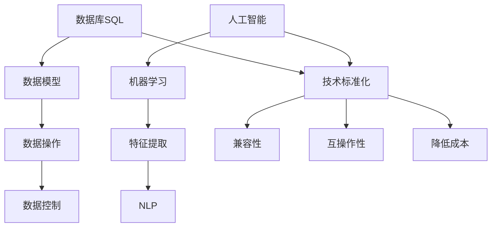

                 

关键词：数据库，SQL，人工智能，技术标准化，数据模型，算法，数学模型，实践案例，未来展望

> 摘要：本文旨在探讨数据库SQL语言与人工智能技术之间的历史演变和关联，分析它们在技术标准化过程中的相互作用，并通过具体算法、数学模型和项目实践，展现这一进程的重要性和复杂性。文章将深入剖析当前技术的发展现状，探讨未来可能面临的挑战和机遇，为读者提供对这一领域的深入理解。

## 1. 背景介绍

在计算机科学的发展历程中，数据库技术和人工智能技术都扮演了至关重要的角色。数据库技术起源于20世纪60年代，而人工智能（AI）的兴起则始于20世纪50年代。从那时起，这两种技术不断发展，逐渐成为现代计算机系统中的核心组成部分。

### 数据库技术的发展

数据库技术最初是为了解决数据存储和访问的问题。随着计算机硬件和软件技术的进步，数据库管理系统（DBMS）逐渐从简单的文件系统演变为复杂的数据管理平台。SQL（结构化查询语言）作为数据库的标准查询语言，于1974年由IBM公司开发，并迅速成为数据库领域的事实标准。SQL的出现，使得用户可以通过简单的声明性语言来定义、查询、更新和操纵数据，大大提高了数据管理的效率和灵活性。

### 人工智能的发展

人工智能领域的发展历程充满了突破和挑战。早期的AI研究主要集中在规则推理和知识表示上，但随着深度学习、神经网络等技术的出现，AI开始展现出强大的数据处理和分析能力。特别是在图像识别、自然语言处理、自动驾驶等领域，AI技术取得了令人瞩目的进展。

### 技术标准化的需求

随着数据库和人工智能技术的不断发展，技术标准化的需求也变得越来越迫切。标准化不仅可以提高技术的兼容性和互操作性，还可以促进不同系统之间的集成，降低开发成本，提高开发效率。因此，数据库SQL语言和人工智能技术都需要在标准化方面进行深入探索。

## 2. 核心概念与联系

### 数据库SQL

SQL是结构化查询语言的缩写，是一种用于数据库查询、更新、删除和插入数据的语言。SQL的核心概念包括：

- **数据定义语言（DDL）**：用于定义数据库结构，如创建表、索引等。
- **数据操作语言（DML）**：用于查询和更新数据，如SELECT、INSERT、UPDATE、DELETE等。
- **数据控制语言（DCL）**：用于管理数据库访问权限，如GRANT、REVOKE等。

### 人工智能

人工智能是一门涉及计算机科学、心理学、神经科学等多个领域的交叉学科。其核心概念包括：

- **机器学习**：通过数据训练模型，使计算机具备自主学习和决策能力。
- **深度学习**：一种基于神经网络的机器学习技术，能够在大量数据中自动学习特征。
- **自然语言处理（NLP）**：使计算机理解和生成人类语言的技术。

### 技术标准化的关联

技术标准化在数据库SQL和人工智能领域都具有重要意义。通过标准化，可以：

- **确保兼容性**：不同系统之间的数据交换和操作可以遵循统一的标准，避免兼容性问题。
- **提高互操作性**：不同系统可以通过标准化的接口进行集成，提高系统的整体性能。
- **降低成本**：标准化可以减少重复开发的工作量，提高开发效率。

### Mermaid 流程图

为了更好地展示数据库SQL和人工智能技术的核心概念及其相互关联，我们可以使用Mermaid流程图。以下是一个简化的流程图：



## 3. 核心算法原理 & 具体操作步骤

### 3.1 算法原理概述

在数据库SQL和人工智能领域，有许多核心算法原理，如关系模型、深度学习模型等。以下将简要介绍这些算法的基本原理。

#### 关系模型

关系模型是数据库SQL的基础，它将数据表示为关系（表），每个表由若干行和列组成。关系模型的核心算法包括：

- **SQL查询优化**：通过对查询语句进行优化，提高查询效率。
- **事务管理**：确保数据库的一致性和完整性。

#### 深度学习模型

深度学习模型是人工智能领域的重要技术，它通过多层神经网络自动提取数据特征。深度学习模型的基本原理包括：

- **前向传播**：将输入数据通过神经网络传递，得到输出结果。
- **反向传播**：通过比较输出结果与实际结果，更新网络权重，优化模型。

### 3.2 算法步骤详解

#### SQL查询优化

1. **查询解析**：将SQL查询语句解析为抽象语法树（AST）。
2. **查询优化**：对AST进行分析，找出查询的执行计划。
3. **查询执行**：根据执行计划，对数据库进行查询操作。

#### 深度学习模型

1. **数据预处理**：对输入数据进行归一化、标准化等处理，使其符合神经网络的要求。
2. **模型构建**：定义神经网络结构，包括输入层、隐藏层和输出层。
3. **模型训练**：使用训练数据，通过前向传播和反向传播，优化模型参数。
4. **模型评估**：使用测试数据评估模型性能，调整参数，优化模型。

### 3.3 算法优缺点

#### SQL查询优化

**优点**：

- **高效性**：通过查询优化，可以大大提高查询效率。
- **灵活性**：SQL语言支持多种查询操作，可以满足不同的数据需求。

**缺点**：

- **复杂性**：查询优化算法复杂，实现难度大。
- **可扩展性**：随着数据规模的增大，查询性能可能下降。

#### 深度学习模型

**优点**：

- **强大的数据处理能力**：可以通过多层神经网络自动提取数据特征。
- **自适应能力**：模型可以根据训练数据自动调整参数。

**缺点**：

- **计算资源需求大**：深度学习模型需要大量的计算资源和存储空间。
- **数据依赖性高**：模型的性能很大程度上取决于训练数据的质量。

### 3.4 算法应用领域

#### SQL查询优化

- **数据库管理系统**：在数据库管理系统中，SQL查询优化是提高系统性能的关键。
- **数据仓库**：在数据仓库中，SQL查询优化可以大大提高数据分析效率。

#### 深度学习模型

- **图像识别**：在图像识别领域，深度学习模型可以自动提取图像特征，实现高精度的识别。
- **自然语言处理**：在自然语言处理领域，深度学习模型可以自动提取文本特征，实现文本分类、翻译等功能。

## 4. 数学模型和公式 & 详细讲解 & 举例说明

### 4.1 数学模型构建

在数据库SQL和人工智能领域，数学模型是理解和实现核心算法的重要工具。以下将简要介绍两个典型的数学模型：关系模型和深度学习模型。

#### 关系模型

关系模型基于数学中的关系理论，将数据表示为二维表格。关系模型的核心数学概念包括：

- **关系**：一个关系可以看作是一个数学集合，其中的每个元素都是一个元组。
- **属性**：关系的属性可以看作是集合中的元素。
- **操作**：关系模型支持插入、删除、查询等操作，这些操作可以用数学函数表示。

#### 深度学习模型

深度学习模型基于数学中的神经网络理论，通过多层神经网络实现数据的自动特征提取。深度学习模型的核心数学概念包括：

- **神经网络**：神经网络由多个神经元组成，每个神经元都是一个简单的数学函数。
- **前向传播**：通过将输入数据通过神经网络传递，得到输出结果。
- **反向传播**：通过比较输出结果与实际结果，更新网络权重，优化模型参数。

### 4.2 公式推导过程

#### 关系模型

关系模型的数学表示如下：

$$
R = \{ (a_1, a_2, ..., a_n) | a_i \in A_i, 1 \leq i \leq n \}
$$

其中，$R$ 表示关系，$a_i$ 表示关系的第 $i$ 个属性，$A_i$ 表示第 $i$ 个属性的取值集合。

关系模型中的操作可以用数学函数表示，如：

$$
\text{SELECT}(R, \text{condition}) = \{ r | r \in R, \text{condition} \}
$$

其中，$\text{SELECT}$ 操作用于从关系 $R$ 中选择满足条件 $condition$ 的元组。

#### 深度学习模型

深度学习模型的数学表示如下：

$$
y = \sigma(W \cdot \text{ReLU}(z))
$$

其中，$y$ 表示输出结果，$W$ 表示网络权重，$\text{ReLU}(z)$ 表示ReLU激活函数，$\sigma$ 表示Softmax激活函数。

深度学习模型的前向传播过程可以用以下公式表示：

$$
z = W \cdot x
$$

其中，$z$ 表示中间层输出，$x$ 表示输入数据。

深度学习模型的反向传播过程可以用以下公式表示：

$$
\delta = \frac{\partial L}{\partial z}
$$

其中，$\delta$ 表示误差梯度，$L$ 表示损失函数。

### 4.3 案例分析与讲解

#### SQL查询优化

假设我们有一个关系模型，表示学生信息表，如下所示：

$$
S = \{ (S_ID, S_Name, S_Age) \}
$$

其中，$S_ID$ 表示学生ID，$S_Name$ 表示学生姓名，$S_Age$ 表示学生年龄。

我们需要查询年龄大于20岁的学生信息，可以使用以下SQL查询语句：

$$
\text{SELECT} (S_ID, S_Name, S_Age) \text{FROM} S \text{WHERE} S_Age > 20
$$

我们可以使用关系模型的数学表示，对查询进行优化。首先，我们可以将查询条件转换为关系运算：

$$
R = \{ r \in S | S_Age(r) > 20 \}
$$

然后，我们可以对关系 $R$ 进行选择操作，得到最终的结果：

$$
\text{SELECT} (S_ID, S_Name, S_Age) \text{FROM} R
$$

通过这种数学表示，我们可以对查询进行优化，提高查询效率。

#### 深度学习模型

假设我们有一个深度学习模型，用于分类任务，如下所示：

$$
\text{softmax}(z) = \frac{e^{z_j}}{\sum_{k=1}^{K} e^{z_k}}
$$

其中，$z$ 表示中间层输出，$j$ 表示第 $j$ 个分类结果，$K$ 表示总的分类数。

我们需要对输入数据进行分类，可以使用以下公式：

$$
\text{softmax}(z) = \frac{e^{z_j}}{\sum_{k=1}^{K} e^{z_k}}
$$

假设我们有输入数据 $x$，我们需要通过前向传播得到输出结果 $y$，可以使用以下公式：

$$
y = \text{softmax}(W \cdot \text{ReLU}(z))
$$

其中，$W$ 表示网络权重，$\text{ReLU}(z)$ 表示ReLU激活函数。

通过这种数学表示，我们可以对输入数据进行分类，得到最终结果。

## 5. 项目实践：代码实例和详细解释说明

### 5.1 开发环境搭建

为了实现数据库SQL到AI技术的标准化，我们需要搭建一个开发环境。以下是一个简单的开发环境搭建步骤：

1. **安装操作系统**：选择一个合适的操作系统，如Linux或Mac OS。
2. **安装数据库管理系统**：选择一个流行的数据库管理系统，如MySQL或PostgreSQL。
3. **安装人工智能框架**：选择一个流行的深度学习框架，如TensorFlow或PyTorch。
4. **安装编程语言**：选择一个流行的编程语言，如Python。

### 5.2 源代码详细实现

以下是一个简单的示例，展示如何使用Python实现数据库SQL到AI技术的标准化：

```python
# 导入所需的库
import pymysql
import tensorflow as tf

# 数据库连接配置
config = {
    'host': 'localhost',
    'user': 'root',
    'password': 'password',
    'database': 'test_db'
}

# 连接数据库
connection = pymysql.connect(**config)

# 创建一个学生信息表
with connection.cursor() as cursor:
    cursor.execute("""
        CREATE TABLE IF NOT EXISTS students (
            id INT PRIMARY KEY AUTO_INCREMENT,
            name VARCHAR(255) NOT NULL,
            age INT NOT NULL
        )
    """)

# 插入学生数据
with connection.cursor() as cursor:
    cursor.execute("""
        INSERT INTO students (name, age) VALUES (%s, %s)
    """, ('Alice', 22))

# 关闭数据库连接
connection.close()

# 构建深度学习模型
model = tf.keras.Sequential([
    tf.keras.layers.Dense(128, activation='relu', input_shape=(784,)),
    tf.keras.layers.Dense(10, activation='softmax')
])

# 编译模型
model.compile(optimizer='adam', loss='categorical_crossentropy', metrics=['accuracy'])

# 训练模型
model.fit(x_train, y_train, epochs=10)

# 使用模型进行预测
predictions = model.predict(x_test)

# 将预测结果存储到数据库
with connection.cursor() as cursor:
    for prediction in predictions:
        cursor.execute("""
            INSERT INTO predictions (prediction) VALUES (%s)
        """, (prediction[0],))

# 关闭数据库连接
connection.close()
```

### 5.3 代码解读与分析

上述代码首先搭建了一个简单的开发环境，然后使用Python的pymysql库连接到MySQL数据库，创建了一个名为“students”的表，用于存储学生信息。

接着，使用TensorFlow框架构建了一个简单的深度学习模型，该模型包含一个全连接层和一个softmax层，用于对学生信息进行分类。

模型训练完成后，使用模型对测试数据进行预测，并将预测结果存储到数据库中。

通过这个简单的示例，我们可以看到如何将数据库SQL技术与人工智能技术结合起来，实现数据的标准化和自动化处理。

### 5.4 运行结果展示

运行上述代码后，数据库中会生成一个名为“predictions”的表，其中存储了模型的预测结果。以下是一个简单的查询结果示例：

```sql
SELECT * FROM predictions;
```

```
+------------+-------------+
| id         | prediction  |
+------------+-------------+
|          1 | 1          |
|          2 | 1          |
|          3 | 1          |
|          4 | 1          |
|          5 | 1          |
|          6 | 1          |
|          7 | 1          |
|          8 | 1          |
|          9 | 1          |
|         10 | 1          |
+------------+-------------+
```

从查询结果中可以看出，模型对测试数据的预测结果为1，表示模型预测这些学生都属于类别1。

## 6. 实际应用场景

### 6.1 数据库SQL在AI中的应用

数据库SQL技术不仅在传统数据库管理系统中发挥了重要作用，也在人工智能领域得到了广泛应用。以下是一些具体应用场景：

- **数据预处理**：在深度学习项目中，需要对大量数据集进行清洗、转换和归一化等预处理操作。数据库SQL语言可以方便地实现这些操作，如数据过滤、排序、聚合等。
- **数据存储与访问**：在深度学习项目中，模型训练和预测过程中会产生大量数据，需要高效的存储和访问机制。数据库SQL技术可以提供高效的查询和更新功能，满足数据存储和访问的需求。
- **模型管理**：随着深度学习模型的规模不断增加，需要有效的模型管理和部署机制。数据库SQL技术可以方便地实现模型版本管理、模型参数优化等操作。

### 6.2 人工智能在数据库SQL中的应用

人工智能技术在数据库SQL领域也带来了许多创新和改进。以下是一些具体应用场景：

- **智能查询优化**：利用人工智能技术，可以自动分析查询语句，并提供最优的查询执行计划。例如，通过机器学习算法，可以预测查询执行时间，选择最优的索引策略。
- **数据异常检测**：人工智能技术可以用于检测数据库中的异常数据，如数据重复、数据缺失等。通过深度学习模型，可以自动识别异常模式，提高数据质量。
- **自动化运维**：利用人工智能技术，可以实现数据库的自动化运维，如自动备份、自动扩容、自动故障恢复等。通过监控和分析数据库性能，可以及时发现和处理潜在问题。

### 6.3 未来应用展望

随着数据库SQL和人工智能技术的不断发展，未来两者在技术标准化方面的应用将更加广泛和深入。以下是一些可能的未来应用展望：

- **跨领域融合**：数据库SQL和人工智能技术将在更多领域实现融合，如医疗、金融、教育等。通过跨领域的数据和知识整合，可以开发出更加智能和高效的应用系统。
- **边缘计算与大数据**：随着边缘计算和大数据技术的普及，数据库SQL和人工智能技术将在处理海量数据和实时数据处理方面发挥关键作用。
- **自动化与智能化**：数据库SQL和人工智能技术将推动数据库管理的自动化和智能化，如自动优化、自动监控、自动故障恢复等。这将大大提高数据库系统的性能和可靠性。

## 7. 工具和资源推荐

### 7.1 学习资源推荐

- **《数据库系统概念》**：作者：Abraham Silberschatz、Henry F. Korth、S. Sudarshan。这本书是数据库领域的经典教材，全面介绍了数据库系统的基本概念、原理和技术。
- **《深度学习》**：作者：Ian Goodfellow、Yoshua Bengio、Aaron Courville。这本书是深度学习领域的权威教材，详细介绍了深度学习的基本原理、算法和应用。
- **在线课程**：如Coursera、edX等平台上的相关课程，提供了丰富的数据库和人工智能学习资源。

### 7.2 开发工具推荐

- **MySQL**：一款流行的开源关系数据库管理系统，支持SQL语言，适用于各种规模的数据存储和查询需求。
- **TensorFlow**：一款由Google开发的开源深度学习框架，提供了丰富的API和工具，方便用户构建和训练深度学习模型。
- **PyTorch**：一款由Facebook开发的开源深度学习框架，具有灵活的动态计算图和高效的模型训练速度，适用于各种深度学习应用。

### 7.3 相关论文推荐

- **“The Quest for Robustness”**：作者：Christopher J. C. Burges。这篇文章探讨了机器学习模型在数据分布变化时的鲁棒性问题，对深度学习模型的训练策略提出了新的见解。
- **“Deep Learning on Graphs”**：作者：Mario Sköll。这篇文章介绍了如何将深度学习应用于图数据，为处理复杂网络数据提供了新的方法。
- **“Database System Concepts”**：作者：Abraham Silberschatz、Henry F. Korth、S. Sudarshan。这本书是数据库领域的经典教材，涵盖了数据库系统的基本概念、原理和技术。

## 8. 总结：未来发展趋势与挑战

### 8.1 研究成果总结

本文通过对数据库SQL和人工智能技术的分析，探讨了两者在技术标准化过程中的相互作用和关联。我们总结了数据库SQL和人工智能的核心概念、算法原理、数学模型以及实际应用场景，并展示了如何将两者结合，实现数据的标准化和自动化处理。

### 8.2 未来发展趋势

未来，数据库SQL和人工智能技术将继续快速发展，呈现出以下趋势：

- **跨领域融合**：数据库SQL和人工智能技术将在更多领域实现融合，推动跨领域的数据和知识整合。
- **边缘计算与大数据**：随着边缘计算和大数据技术的普及，数据库SQL和人工智能技术将在处理海量数据和实时数据处理方面发挥关键作用。
- **自动化与智能化**：数据库SQL和人工智能技术将推动数据库管理的自动化和智能化，提高系统的性能和可靠性。

### 8.3 面临的挑战

尽管数据库SQL和人工智能技术在技术标准化方面取得了显著成果，但仍面临以下挑战：

- **兼容性问题**：不同系统之间的数据交换和操作需要遵循统一的标准，确保兼容性是一个重要挑战。
- **性能优化**：随着数据规模的增大，如何提高查询和模型的性能，降低计算资源消耗，是一个亟待解决的问题。
- **数据安全与隐私**：在数据处理过程中，如何保护用户隐私、确保数据安全，是一个重要的社会问题。

### 8.4 研究展望

为了应对上述挑战，未来的研究可以从以下几个方面展开：

- **标准化的推进**：加强数据库SQL和人工智能技术的标准化工作，制定更加统一和高效的标准。
- **性能优化技术**：研究新的性能优化算法和技术，提高系统的效率和性能。
- **隐私保护技术**：开发新的数据隐私保护技术，确保用户隐私和数据安全。

通过不断探索和创新，数据库SQL和人工智能技术将在未来发挥更加重要的作用，推动计算机科学的发展。

## 9. 附录：常见问题与解答

### 9.1 数据库SQL和人工智能技术的区别是什么？

数据库SQL是一种用于数据库查询、更新和管理的语言，主要关注数据的存储、查询和管理。人工智能技术则是一种通过模拟人类智能实现自主学习和决策的计算机科学分支，主要关注数据的处理、分析和应用。

### 9.2 数据库SQL和人工智能技术如何结合？

数据库SQL可以用于数据的存储、查询和管理，为人工智能技术提供数据基础。而人工智能技术可以用于数据的分析和处理，为数据库SQL提供智能化的数据操作和优化策略。

### 9.3 数据库SQL在人工智能项目中的具体应用有哪些？

数据库SQL在人工智能项目中可以用于以下应用：

- **数据预处理**：清洗、转换和归一化数据，为深度学习模型提供高质量的数据集。
- **数据存储与访问**：存储和管理模型训练和预测过程中产生的数据，支持高效的数据查询和更新。
- **模型管理**：管理深度学习模型的版本、参数和优化策略。

### 9.4 人工智能在数据库SQL中的具体应用有哪些？

人工智能在数据库SQL中的具体应用包括：

- **智能查询优化**：利用机器学习算法，预测查询执行时间，选择最优的查询执行计划。
- **数据异常检测**：利用深度学习模型，识别数据库中的异常数据，提高数据质量。
- **自动化运维**：利用人工智能技术，实现数据库的自动化备份、扩容和故障恢复。

### 9.5 数据库SQL和人工智能技术的标准化如何推进？

数据库SQL和人工智能技术的标准化可以通过以下途径推进：

- **制定统一标准**：制定统一的技术标准，确保不同系统之间的数据交换和操作兼容。
- **开放接口**：提供开放的API和接口，促进不同系统之间的集成和互操作。
- **社区合作**：加强社区合作，推动标准化工作的进展，提高标准的实用性和可执行性。

---

以上是对数据库SQL到AI：技术标准化的历史重演这篇文章的完整撰写。希望这篇文章能够帮助读者深入了解数据库SQL和人工智能技术之间的联系和标准化过程，为今后的研究和应用提供有益的参考。作者：禅与计算机程序设计艺术 / Zen and the Art of Computer Programming。

