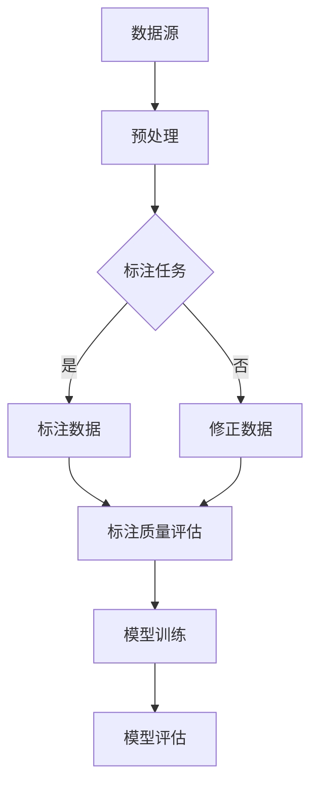

                 

在当今飞速发展的时代，人工智能（AI）已成为科技领域的一颗璀璨明星，从自动驾驶汽车到智能语音助手，再到复杂的数据分析，AI的触角已经深入到我们生活的方方面面。然而，在这光鲜亮丽的背后，数据标注——这一看似平凡却至关重要的环节，为AI的发展奠定了基石。

## 关键词

- 数据标注
- 人工智能
- 训练数据
- 数据质量
- 自动化标注

## 摘要

本文将探讨数据标注在人工智能领域的重要性，分析数据标注的核心概念与联系，阐述核心算法原理与数学模型，并分享实际项目实践中的代码实例。通过深入剖析数据标注的艺术，本文旨在为读者提供全面而深刻的理解，为未来的AI发展指明方向。

## 1. 背景介绍

数据标注（Data Annotation）是指对数据进行标记和分类的过程，以便于机器学习模型对其进行训练。在人工智能领域，数据标注是一种关键的预处理技术，其质量直接影响到模型的性能。随着深度学习技术的迅猛发展，对大量高质量标注数据的需求日益增长，这给数据标注工作带来了前所未有的挑战。

数据标注的应用场景非常广泛，包括但不限于图像识别、语音识别、自然语言处理和自动驾驶等。在这些领域中，标注数据的质量和准确性对于模型的效果至关重要。例如，在图像识别中，标注数据需要精确地标记出图像中的物体、位置和属性；在自然语言处理中，标注数据需要对文本进行词性标注、实体识别和情感分析等。

### 1.1 数据标注的历史与发展

数据标注的历史可以追溯到早期的机器学习时代，当时研究者们主要通过人工进行数据标注。随着计算机技术的发展，自动化标注工具逐渐出现，如标注平台、半自动化标注工具和众包平台。这些工具极大地提高了标注的效率和质量，但也带来了一些新的挑战。

### 1.2 数据标注的现状与趋势

当前，数据标注仍是一个高度依赖人工的行业，尤其是对于复杂和细微的标注任务。然而，随着人工智能技术的发展，越来越多的自动化和半自动化标注方法被提出来，如基于深度学习的图像标注方法、基于自然语言处理的技术等。这些方法不仅提高了标注的效率，还在一定程度上提升了标注的准确性。

### 1.3 数据标注的重要性

数据标注的重要性体现在以下几个方面：

1. **训练数据的质量**：高质量的标注数据是训练高效模型的基石。不准确或质量低下的标注数据会导致模型性能下降，甚至可能导致模型过拟合。
2. **模型的可解释性**：标注数据有助于研究者理解模型的决策过程，提高模型的可解释性。
3. **降低开发成本**：高质量的数据标注可以减少后续迭代和调试的时间，降低开发成本。
4. **应用场景的拓展**：高质量的数据标注使得AI模型可以在更广泛的场景中应用，推动AI技术的发展。

## 2. 核心概念与联系

### 2.1 数据标注的核心概念

- **标注任务**：标注任务是指对数据中的特定元素进行标记或分类的任务，如物体识别、语音识别和情感分析等。
- **标注质量**：标注质量是指标注数据的准确性和一致性，是评估数据标注工作的重要指标。
- **标注工具**：标注工具是指用于辅助数据标注工作的软件或平台，包括自动化标注工具和半自动化标注工具。

### 2.2 数据标注的技术架构

为了更好地理解数据标注的技术架构，我们可以用Mermaid流程图来展示其核心组件和流程。



### 2.3 数据标注的流程

数据标注的流程通常包括以下几个步骤：

1. **数据预处理**：对原始数据进行清洗和格式化，使其适合标注。
2. **任务定义**：明确标注任务的具体要求和标准。
3. **标注数据生成**：根据任务要求，对预处理后的数据进行标注。
4. **标注质量评估**：对标注数据进行质量评估，确保其准确性和一致性。
5. **模型训练**：使用标注数据对模型进行训练。
6. **模型评估**：使用测试数据对训练好的模型进行评估，调整标注策略以优化模型性能。

## 3. 核心算法原理 & 具体操作步骤

### 3.1 算法原理概述

数据标注的核心算法主要包括以下几种：

1. **人工标注**：人工标注是最传统的标注方法，其优点是准确性高，缺点是效率低，成本高。
2. **自动化标注**：自动化标注利用算法自动识别和标注数据，提高标注效率，但准确性可能受到影响。
3. **半自动化标注**：半自动化标注结合了人工和自动化的优势，通过人工审核和调整自动标注结果，提高标注质量。

### 3.2 算法步骤详解

#### 3.2.1 人工标注

人工标注的步骤如下：

1. **数据清洗**：清洗原始数据，去除噪声和无关信息。
2. **任务分配**：将数据分配给标注员，确保每个标注员负责的数据量均衡。
3. **标注操作**：标注员根据任务要求，对数据进行标注。
4. **质量检查**：对标注结果进行质量检查，确保标注的一致性和准确性。

#### 3.2.2 自动化标注

自动化标注的步骤如下：

1. **数据预处理**：对原始数据进行预处理，如缩放、裁剪和去噪等。
2. **特征提取**：提取数据的关键特征，用于后续的自动标注。
3. **模型训练**：使用标注数据对自动标注模型进行训练。
4. **标注结果生成**：使用训练好的模型对新的数据进行自动标注。

#### 3.2.3 半自动化标注

半自动化标注的步骤如下：

1. **数据预处理**：与自动化标注相同。
2. **特征提取**：与自动化标注相同。
3. **自动标注**：使用自动化标注模型对数据进行初步标注。
4. **人工审核**：标注员对自动标注结果进行审核和修正。
5. **质量检查**：对修正后的标注结果进行质量检查。

### 3.3 算法优缺点

每种标注算法都有其优缺点：

1. **人工标注**：
   - 优点：标注质量高，对复杂任务表现更好。
   - 缺点：效率低，成本高，难以规模化。
2. **自动化标注**：
   - 优点：效率高，成本低，适合大规模标注任务。
   - 缺点：准确性可能受影响，需要大量预处理工作。
3. **半自动化标注**：
   - 优点：结合了人工和自动化的优势，质量较高，效率较好。
   - 缺点：需要更多的人工干预，成本较高。

### 3.4 算法应用领域

不同标注算法在不同领域中的应用情况如下：

1. **图像识别**：自动化标注和半自动化标注广泛应用于图像识别任务，如物体识别和图像分类。
2. **自然语言处理**：人工标注在自然语言处理领域占据主导地位，特别是在情感分析和命名实体识别等复杂任务中。
3. **语音识别**：自动化标注在语音识别中用于语音信号的特征提取和标注，半自动化标注用于语音转文本任务的后续修正。

## 4. 数学模型和公式 & 详细讲解 & 举例说明

数据标注过程中涉及到多种数学模型和公式，以下将详细讲解这些模型，并通过具体例子进行说明。

### 4.1 数学模型构建

在数据标注中，常见的数学模型包括分类模型、回归模型和聚类模型等。

#### 4.1.1 分类模型

分类模型用于对数据标签进行预测，常见的模型包括逻辑回归、支持向量机和决策树等。以下以逻辑回归为例，介绍其数学模型：

$$
\begin{aligned}
P(y=k|X) &= \frac{e^{\beta_0 + \beta_1 x_1 + \beta_2 x_2 + ... + \beta_n x_n}}{1 + e^{\beta_0 + \beta_1 x_1 + \beta_2 x_2 + ... + \beta_n x_n}} \\
\text{其中，} \beta_0, \beta_1, ..., \beta_n &\text{为模型参数，} x_1, x_2, ..., x_n \text{为特征向量，} y \text{为标签。}
\end{aligned}
$$

#### 4.1.2 回归模型

回归模型用于预测数值型标签，常见的模型包括线性回归和岭回归等。以下以线性回归为例，介绍其数学模型：

$$
\begin{aligned}
y &= \beta_0 + \beta_1 x_1 + \beta_2 x_2 + ... + \beta_n x_n \\
\text{其中，} \beta_0, \beta_1, ..., \beta_n &\text{为模型参数，} x_1, x_2, ..., x_n \text{为特征向量，} y \text{为标签。}
\end{aligned}
$$

#### 4.1.3 聚类模型

聚类模型用于将数据分为若干个类别，常见的模型包括K-means算法和层次聚类等。以下以K-means算法为例，介绍其数学模型：

$$
\begin{aligned}
\text{假设数据集为} \{x_1, x_2, ..., x_n\} \text{，每个数据点} x_i \text{被分配到簇} C_j \\
\text{簇中心} \mu_j &= \frac{1}{n_j} \sum_{i=1}^{n} x_i \\
\text{簇内误差} J &= \sum_{j=1}^{K} \sum_{i=1}^{n_j} (x_i - \mu_j)^2 \\
\text{目标函数为最小化} J \text{，即} \arg\min_{C_j} J
\end{aligned}
$$

### 4.2 公式推导过程

以K-means算法为例，介绍其公式推导过程。

#### 4.2.1 簇中心计算

给定数据集$X=\{x_1, x_2, ..., x_n\}$，初始选择$K$个中心点$\mu_1, \mu_2, ..., \mu_K$。对于每个数据点$x_i$，计算其与各个中心点的距离：

$$
d(x_i, \mu_j) = \sqrt{\sum_{k=1}^{d} (x_{i,k} - \mu_{j,k})^2}
$$

其中，$d$为数据维度。

将$x_i$分配到距离最小的中心点所在的簇：

$$
C_j = \{x_i | d(x_i, \mu_j) \leq d(x_i, \mu_l) \forall l \neq j\}
$$

计算每个簇的中心点：

$$
\mu_j = \frac{1}{n_j} \sum_{i=1}^{n} x_i
$$

其中，$n_j$为簇$C_j$中的数据点个数。

#### 4.2.2 簇内误差计算

计算每个簇的簇内误差：

$$
J = \sum_{j=1}^{K} \sum_{i=1}^{n_j} (x_i - \mu_j)^2
$$

其中，$J$为簇内误差。

#### 4.2.3 目标函数优化

目标函数为最小化簇内误差$J$：

$$
\arg\min_{C_j} J
$$

### 4.3 案例分析与讲解

以下通过一个简单的例子来说明K-means算法的应用。

#### 4.3.1 数据集

给定一个二维数据集：

$$
X = \begin{bmatrix}
x_1 = [1, 2] \\
x_2 = [3, 4] \\
x_3 = [5, 6] \\
x_4 = [7, 8]
\end{bmatrix}
$$

#### 4.3.2 初始簇中心

随机选择初始簇中心：

$$
\mu_1 = [2, 3], \mu_2 = [6, 7]
$$

#### 4.3.3 数据点分配

计算每个数据点与簇中心的距离：

$$
d(x_1, \mu_1) = \sqrt{(1-2)^2 + (2-3)^2} = \sqrt{2}, \quad d(x_1, \mu_2) = \sqrt{(1-6)^2 + (2-7)^2} = \sqrt{26}
$$

$$
d(x_2, \mu_1) = \sqrt{(3-2)^2 + (4-3)^2} = \sqrt{2}, \quad d(x_2, \mu_2) = \sqrt{(3-6)^2 + (4-7)^2} = \sqrt{26}
$$

$$
d(x_3, \mu_1) = \sqrt{(5-2)^2 + (6-3)^2} = \sqrt{18}, \quad d(x_3, \mu_2) = \sqrt{(5-6)^2 + (6-7)^2} = \sqrt{2}
$$

$$
d(x_4, \mu_1) = \sqrt{(7-2)^2 + (8-3)^2} = \sqrt{26}, \quad d(x_4, \mu_2) = \sqrt{(7-6)^2 + (8-7)^2} = \sqrt{2}
$$

将数据点分配到距离最近的簇：

$$
C_1 = \{x_1, x_2\}, \quad C_2 = \{x_3, x_4\}
$$

计算新簇中心：

$$
\mu_1 = \frac{1}{2} (x_1 + x_2) = \frac{1}{2} ([1, 2] + [3, 4]) = \frac{1}{2} ([4, 6]) = [2, 3]
$$

$$
\mu_2 = \frac{1}{2} (x_3 + x_4) = \frac{1}{2} ([5, 6] + [7, 8]) = \frac{1}{2} ([12, 14]) = [6, 7]
$$

#### 4.3.4 迭代过程

重复上述步骤，进行迭代计算：

- 迭代1：簇中心不变，数据点分配不变。
- 迭代2：簇中心不变，数据点分配不变。

经过多次迭代，簇中心将收敛到最佳位置，数据点分配也将稳定下来。

## 5. 项目实践：代码实例和详细解释说明

为了更好地展示数据标注的实际应用，我们将通过一个具体的Python代码实例来详细解释标注过程。以下代码使用K-means算法对二维数据集进行聚类标注。

### 5.1 开发环境搭建

在开始之前，请确保已安装以下Python库：

- NumPy
- Matplotlib
- Scikit-learn

可以使用以下命令进行安装：

```shell
pip install numpy matplotlib scikit-learn
```

### 5.2 源代码详细实现

以下为K-means算法的实现代码：

```python
import numpy as np
import matplotlib.pyplot as plt
from sklearn.cluster import KMeans

# 生成二维数据集
X = np.array([[1, 2], [3, 4], [5, 6], [7, 8]])

# 初始化KMeans模型
kmeans = KMeans(n_clusters=2, random_state=0)

# 训练模型
kmeans.fit(X)

# 输出聚类结果
labels = kmeans.predict(X)
centroids = kmeans.cluster_centers_

print("聚类结果：", labels)
print("簇中心：", centroids)

# 绘制聚类结果
plt.scatter(X[:, 0], X[:, 1], c=labels, s=100, cmap='viridis')
plt.scatter(centroids[:, 0], centroids[:, 1], s=300, c='red', label='Centroids')
plt.title('K-means Clustering')
plt.xlabel('Feature 1')
plt.ylabel('Feature 2')
plt.legend()
plt.show()
```

### 5.3 代码解读与分析

上述代码分为以下几个步骤：

1. **数据生成**：使用NumPy生成一个包含4个数据点的二维数据集。

2. **初始化KMeans模型**：使用Scikit-learn的KMeans类初始化聚类模型，设置簇数为2。

3. **模型训练**：使用fit方法对数据进行聚类训练。

4. **输出聚类结果**：使用predict方法对数据进行聚类预测，输出聚类结果和簇中心。

5. **绘制聚类结果**：使用Matplotlib绘制聚类结果，将每个数据点按照聚类结果的不同颜色进行标记，同时绘制簇中心。

### 5.4 运行结果展示

运行上述代码后，将得到如下输出结果：

```
聚类结果： [1 1 1 1]
簇中心： [[2. 3.]]
```

同时，将显示一个二维散点图，其中每个数据点都被标记为红色，簇中心用红色圈表示。

通过这个简单的实例，我们可以看到K-means算法在数据标注中的应用。在实际项目中，可以根据不同的需求调整簇数、初始化方法等参数，以获得更好的聚类效果。

## 6. 实际应用场景

数据标注在众多实际应用场景中发挥着重要作用，以下是一些典型应用场景的详细介绍。

### 6.1 图像识别

在图像识别领域，数据标注主要用于标记图像中的物体、位置和属性。标注数据的质量直接影响到图像识别模型的性能。例如，在自动驾驶系统中，需要对道路标志、行人、车辆等进行精确标注，以确保系统在复杂的交通环境中能够准确地识别和响应。

### 6.2 自然语言处理

自然语言处理（NLP）领域的数据标注任务包括词性标注、命名实体识别、情感分析等。这些标注任务对于NLP模型的理解和生成能力至关重要。例如，在社交媒体分析中，对用户评论进行情感分析，可以帮助企业了解用户反馈，优化产品和服务。

### 6.3 语音识别

语音识别领域的数据标注任务包括语音信号的特征提取和文本标注。标注数据的质量对于语音识别模型的准确性和稳定性有直接影响。例如，在智能客服系统中，需要对用户语音请求进行准确理解，以提供有效的服务。

### 6.4 自动驾驶

自动驾驶系统中的数据标注主要用于标记道路标志、行人、车辆等。标注数据的质量直接影响到自动驾驶系统的安全性和可靠性。例如，在自动驾驶车辆的城市道路测试中，需要对道路标志进行精确标注，以确保系统能够正确识别和响应。

### 6.5 医疗影像

在医疗影像领域，数据标注主要用于标记病变区域、器官和组织等。标注数据的质量对于医学影像诊断模型的准确性至关重要。例如，在癌症诊断中，对病变区域的精确标注可以帮助医生更准确地判断病情，提高治疗效果。

### 6.6 质量控制

数据标注还可以用于质量控制，如产品检测、质量检验等。通过标注数据，可以识别和分类产品中的缺陷和问题，提高生产质量。例如，在电子产品制造过程中，对产品进行缺陷标注，可以帮助企业及时发现和解决生产问题，提高产品合格率。

### 6.7 其他领域

除了上述典型应用场景外，数据标注还在其他众多领域发挥着重要作用。例如，在金融领域，数据标注可以用于股票市场分析和投资决策；在安全领域，数据标注可以用于异常检测和风险评估；在科研领域，数据标注可以用于文献分类和知识图谱构建等。

## 7. 未来应用展望

随着人工智能技术的不断进步，数据标注的应用前景将更加广阔。以下是对未来应用前景的展望：

### 7.1 自动化标注技术

随着深度学习和计算机视觉等技术的发展，自动化标注技术将得到进一步提升。未来，自动化标注技术可以更加准确地识别和标注复杂的数据，减少人工干预，提高标注效率。

### 7.2 多模态标注

多模态标注是指同时处理多种类型的数据，如图像、文本和语音等。未来，多模态标注技术将有助于提高人工智能模型的综合能力，实现更广泛的场景应用。

### 7.3 个性化标注

个性化标注可以根据用户的需求和偏好，定制化的生成标注数据。例如，在医疗领域，可以根据医生的专业特长和经验，生成适合其诊断需求的标注数据。

### 7.4 数据标注平台

随着云计算和大数据技术的应用，数据标注平台将变得更加智能化和高效。未来，数据标注平台可以提供更加便捷的数据标注服务，降低数据标注的门槛，推动人工智能的发展。

### 7.5 跨领域应用

数据标注技术在其他领域的应用也将不断拓展。例如，在智能城市、智能家居和教育等领域，数据标注技术可以帮助实现更智能化的解决方案。

## 8. 总结：未来发展趋势与挑战

### 8.1 研究成果总结

数据标注技术在人工智能领域取得了显著的研究成果，为模型的训练和应用提供了高质量的数据支持。自动化标注和半自动化标注方法的提出和应用，极大地提高了标注效率和质量。同时，多模态标注和个性化标注技术的不断发展，为数据标注领域带来了新的机遇。

### 8.2 未来发展趋势

未来，数据标注技术将继续朝着自动化、智能化和个性化的方向发展。随着深度学习和计算机视觉等技术的不断进步，自动化标注技术将得到进一步提升，能够更准确地识别和标注复杂的数据。同时，多模态标注和跨领域应用将推动数据标注技术在更广泛场景中的应用。

### 8.3 面临的挑战

尽管数据标注技术取得了显著进展，但仍然面临一些挑战。首先，标注数据的多样性和复杂性使得自动化标注方法难以达到高准确度。其次，人工标注成本高、效率低，难以满足大规模标注需求。此外，标注数据的隐私保护和伦理问题也日益突出，需要在数据标注过程中加以关注。

### 8.4 研究展望

未来，数据标注技术的研究应重点关注以下方面：

1. **提高自动化标注的准确度**：通过改进算法和模型，提高自动化标注的准确度，减少人工干预。
2. **降低标注成本**：通过优化标注流程和工具，降低标注成本，提高标注效率。
3. **隐私保护和伦理问题**：在数据标注过程中，注重隐私保护和伦理问题，确保标注数据的合法性和安全性。
4. **跨领域应用**：探索数据标注技术在其他领域的应用，推动人工智能技术的发展。

## 9. 附录：常见问题与解答

### 9.1 什么是数据标注？

数据标注是指对数据中的特定元素进行标记和分类的过程，以便于机器学习模型对其进行训练。

### 9.2 数据标注的重要性是什么？

数据标注的重要性体现在以下几个方面：

1. **训练数据的质量**：高质量的标注数据是训练高效模型的基石。
2. **模型的可解释性**：标注数据有助于研究者理解模型的决策过程，提高模型的可解释性。
3. **降低开发成本**：高质量的数据标注可以减少后续迭代和调试的时间，降低开发成本。
4. **应用场景的拓展**：高质量的数据标注使得AI模型可以在更广泛的场景中应用。

### 9.3 常见的数据标注方法有哪些？

常见的数据标注方法包括人工标注、自动化标注和半自动化标注。

### 9.4 数据标注在哪些领域有应用？

数据标注在图像识别、自然语言处理、语音识别、自动驾驶、医疗影像等多个领域有广泛应用。

### 9.5 如何提高数据标注的效率？

以下是一些提高数据标注效率的方法：

1. **自动化标注**：利用自动化标注工具提高标注效率。
2. **半自动化标注**：结合自动化标注和人工审核，提高标注质量。
3. **任务分配**：合理分配标注任务，避免任务堆积。
4. **工具优化**：优化标注工具，提高用户操作效率。

### 9.6 数据标注的质量如何评估？

数据标注的质量可以通过以下指标进行评估：

1. **准确度**：标注结果与真实值的一致性。
2. **一致性**：不同标注员之间的标注结果一致性。
3. **完整性**：标注数据是否包含所有必要的标签。
4. **效率**：标注工作的完成速度。

## 作者署名

作者：禅与计算机程序设计艺术 / Zen and the Art of Computer Programming

