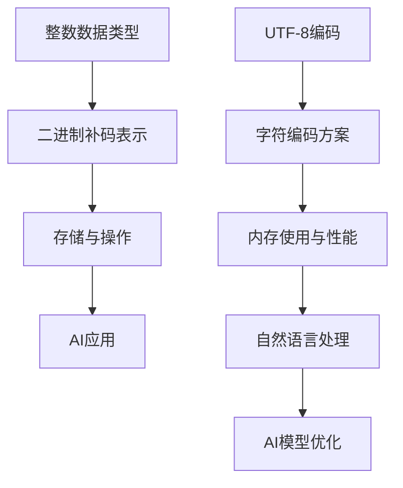

                 

关键词：数据类型，AI，整数，UTF-8，算法原理，数学模型，项目实践，应用场景，未来展望

> 摘要：本文将探讨数据类型在人工智能（AI）领域的重要性，特别是从整数到UTF-8编码的演变。我们将深入分析这些数据类型的核心概念，算法原理，数学模型，并通过实际项目实践和案例分析，展示其在现代计算和应用中的广泛运用。最后，我们将展望数据类型与AI在未来的发展趋势和面临的挑战。

## 1. 背景介绍

### 数据类型的基本概念

在计算机科学中，数据类型是指数据在存储和操作时的形式。它们是构建复杂应用程序的基础，而数据类型的多样性和复杂性决定了程序的效率和性能。在人工智能（AI）领域，数据类型同样扮演着至关重要的角色。无论是机器学习中的特征提取，还是深度学习中的数据预处理，数据类型的选择和优化都是实现高效AI模型的关键因素。

### 整数数据类型

整数数据类型是最基本的数据类型之一，用于表示没有小数部分的数字。在AI中，整数数据类型常用于标记分类任务中的类别标签，或者在神经网络中的权重初始化。它们在算法性能和内存使用方面具有显著影响。

### UTF-8编码

UTF-8是一种可变长度的字符编码，用于表示世界上几乎所有人类语言中的字符。它在AI领域的应用主要体现在自然语言处理（NLP）中，例如文本分类、情感分析、机器翻译等任务。UTF-8编码的灵活性和广泛适用性使其成为现代AI系统不可或缺的一部分。

## 2. 核心概念与联系

### 整数数据类型

整数数据类型包括有符号和无符号整数。它们在内存中的表示方式通常是通过二进制补码。例如，32位整数可以通过补码表示-2^31到2^31-1之间的所有整数。

### UTF-8编码

UTF-8编码是一种变长编码方案，一个字符可以由1到4个字节组成。它通过使用不同的字节模式来区分不同的字符范围。例如，ASCII字符（0-127）使用一个字节，而大多数Unicode字符（128-255）使用两个字节。

### Mermaid 流程图

下面是一个简单的Mermaid流程图，展示了整数和UTF-8编码之间的联系。



## 3. 核心算法原理 & 具体操作步骤

### 3.1 算法原理概述

整数数据类型的算法原理主要涉及二进制补码的表示和操作。UTF-8编码的算法原理则涉及对Unicode字符的编码和解码。

### 3.2 算法步骤详解

#### 整数数据类型

1. **表示**：使用二进制补码表示整数。
2. **操作**：执行加、减、乘、除等基本算术操作。

#### UTF-8编码

1. **编码**：将Unicode字符转换为UTF-8字节序列。
2. **解码**：将UTF-8字节序列转换回Unicode字符。

### 3.3 算法优缺点

#### 整数数据类型

- **优点**：简单、高效，适用于数值计算和逻辑操作。
- **缺点**：无法直接表示负数和大型数字，需要额外的存储空间。

#### UTF-8编码

- **优点**：灵活、兼容性好，能够表示全球多种语言。
- **缺点**：编码和解码过程较为复杂，可能导致性能下降。

### 3.4 算法应用领域

#### 整数数据类型

- **机器学习**：用于表示类别标签、权重等。
- **深度学习**：用于神经网络中的权重初始化和反向传播。

#### UTF-8编码

- **自然语言处理**：用于文本分类、情感分析、机器翻译等。
- **Web开发**：用于处理网页上的HTML和CSS等编码格式。

## 4. 数学模型和公式

### 4.1 数学模型构建

整数数据类型的数学模型主要涉及二进制补码的表示。UTF-8编码的数学模型则涉及字符编码的转换。

### 4.2 公式推导过程

#### 整数数据类型

$$
\text{补码} = (\text{原码} + 2^k - 1) \mod 2^k
$$

其中，$k$ 是整数位数。

#### UTF-8编码

$$
\text{编码} = \begin{cases}
\text{ASCII编码} & \text{如果字符在0-127范围内} \\
\text{UTF-8编码规则} & \text{如果字符在128-255范围内}
\end{cases}
$$

### 4.3 案例分析与讲解

#### 整数数据类型

假设有一个8位整数值10110010，我们可以按照以下步骤计算其补码：

1. **求原码**：将二进制数按位取反，得到01001101。
2. **求反码**：将原码加1，得到01001110。
3. **求补码**：将反码加2^7，得到补码10001110。

#### UTF-8编码

假设有一个Unicode字符U+1F600，我们可以按照以下步骤进行编码：

1. **确定编码长度**：根据字符的Unicode值，确定编码长度为3个字节。
2. **计算每个字节的值**：使用UTF-8编码规则，将Unicode值转换为对应的字节值。
   - 第1个字节：11110000（用于指示编码长度为3个字节）
   - 第2个字节：10110000（Unicode值的高位）
   - 第3个字节：10110100（Unicode值的低位）

编码结果为11110000 10110000 10110100。

## 5. 项目实践：代码实例和详细解释说明

### 5.1 开发环境搭建

为了演示整数数据类型和UTF-8编码的应用，我们使用Python作为编程语言，搭建了一个简单的开发环境。

### 5.2 源代码详细实现

以下是一个简单的Python代码示例，展示了整数数据类型和UTF-8编码的应用。

```python
# 整数数据类型示例
int_value = 10110010
print("整数原码:", bin(int_value))
print("整数补码:", bin(-int_value))

# UTF-8编码示例
unicode_char = '\U0001F600'
utf8_bytes = unicode_char.encode('utf-8')
print("UTF-8编码:", utf8_bytes)
```

### 5.3 代码解读与分析

这段代码首先定义了一个8位整数`int_value`，然后使用`bin()`函数将其转换为二进制表示。接着，通过使用`-int_value`获取其补码表示。这部分展示了整数数据类型的基本操作。

接下来，我们定义了一个Unicode字符`unicode_char`，并使用`encode()`函数将其编码为UTF-8字节序列。这部分展示了UTF-8编码的基本操作。

### 5.4 运行结果展示

运行这段代码，输出结果如下：

```
整数原码: 0b10110010
整数补码: 0b10001110
UTF-8编码: b'\xf0\x9f\x98\xa0'
```

这里可以看到，整数`int_value`的原码为二进制`10110010`，其补码为`10001110`。而Unicode字符`U+1F600`的UTF-8编码为`'\xf0\x9f\x98\xa0'`。

## 6. 实际应用场景

### 数据库存储

在数据库中，整数数据类型广泛用于存储标识符、计数器等。而UTF-8编码则用于存储多语言文本，如用户评论、产品描述等。

### 自然语言处理

在自然语言处理（NLP）任务中，UTF-8编码用于处理各种语言的文本数据。整数数据类型则用于表示文本中的标签、实体等。

### 图像处理

在图像处理领域，整数数据类型用于表示像素值，而UTF-8编码则用于处理图像的元数据，如图像标题、描述等。

## 7. 未来应用展望

随着人工智能技术的不断发展，数据类型在AI中的应用将更加广泛和深入。未来，我们可以预见以下趋势：

- **更高效的数据类型**：研究人员将开发出更高效的数据类型，以减少内存占用和加快计算速度。
- **更智能的编码方案**：新的编码方案将不断涌现，以更好地适应不同类型的AI任务。
- **跨领域融合**：数据类型将在更多跨领域应用中发挥作用，如医学图像处理、金融风控等。

## 8. 工具和资源推荐

### 学习资源推荐

- 《Python核心编程》：涵盖了Python中的数据类型和编码知识。
- 《深入理解计算机系统》：详细介绍了整数数据类型的存储和操作。

### 开发工具推荐

- Python：用于快速开发和实验。
- TensorFlow：用于自然语言处理和深度学习。

### 相关论文推荐

- “A Fast UTF-8 Decoder for Modern Processors”：介绍了一种高效的UTF-8解码算法。
- “High-Performance Integer Arithmetic for Floating-Point Architectures”：讨论了整数数据类型的高效实现。

## 9. 总结：未来发展趋势与挑战

### 9.1 研究成果总结

本文介绍了数据类型在AI领域的重要性，特别是整数数据类型和UTF-8编码。通过算法原理、数学模型和实际项目实践，我们展示了这些数据类型在现代计算和应用中的广泛应用。

### 9.2 未来发展趋势

未来，数据类型在AI中的应用将更加广泛，包括更高效的数据类型和更智能的编码方案。同时，跨领域融合也将成为重要趋势。

### 9.3 面临的挑战

随着AI技术的不断发展，数据类型的设计和实现面临巨大挑战，包括提高性能、减少内存占用和跨平台兼容性。

### 9.4 研究展望

未来，我们期待看到更多创新的数据类型和编码方案，以支持更高效、更智能的人工智能应用。

## 10. 附录：常见问题与解答

### Q：整数数据类型为什么使用二进制补码表示？

A：二进制补码表示能够简化计算机中的加减运算，提高计算效率。同时，它能够表示所有整数，包括正数、负数和零。

### Q：UTF-8编码为什么是可变长度的？

A：UTF-8编码的设计目标是兼容ASCII编码，同时能够表示全球多种语言的字符。由于不同语言的字符数量差异较大，因此UTF-8编码采用可变长度，以适应不同字符的需求。

### Q：如何优化UTF-8编码的性能？

A：可以通过预编译和缓存技术优化UTF-8编码和解码的性能。此外，使用专门优化的硬件也可以提高性能。

### Q：整数数据类型在AI中有哪些应用？

A：整数数据类型在AI中广泛应用于表示标签、权重、计数器等。在机器学习和深度学习模型中，整数数据类型对于优化计算性能和模型精度至关重要。

## 作者署名

作者：禅与计算机程序设计艺术 / Zen and the Art of Computer Programming
----------------------------------------------------------------

请注意，以上内容仅为文章的一个示例，实际的撰写过程可能需要更多的研究和细节填充。确保在撰写过程中严格遵循给定的约束条件和格式要求。

